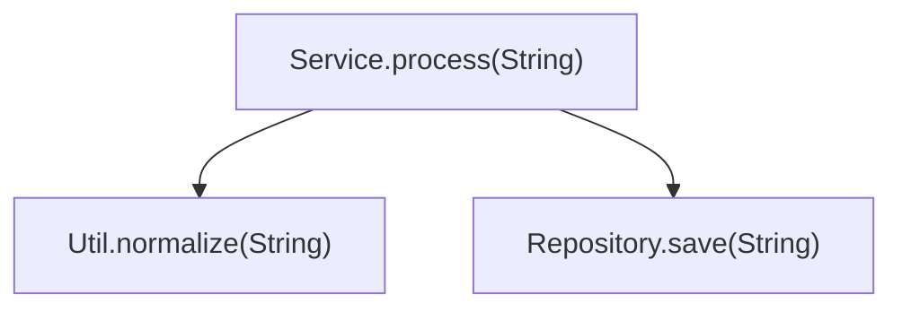
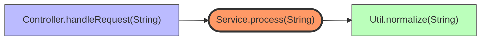
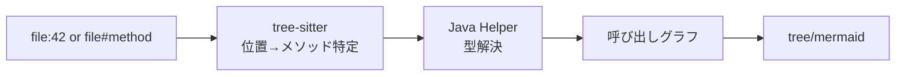

# depwalk

Java/Spring Boot プロジェクトのメソッド呼び出し依存関係を解析・可視化する CLI ツール。

tree-sitter による高速な構文解析と JavaParser による厳密な型解決を組み合わせたハイブリッドアーキテクチャにより、オーバーロードや継承を含むケースでも正確な解析を実現します。

## 特徴

- **callees**: 指定メソッドから呼び出されるメソッドを再帰的に探索
- **callers**: 指定メソッドを呼び出すメソッドを再帰的に探索
- **出力形式**: CLI ツリー / Mermaid 図
- **高速**: tree-sitter によるインデックス、キャッシュ機能
- **厳密**: JavaParser + SymbolSolver による型解決

## インストール

### 前提条件

- Go 1.22+
- Java 17+ (JDK)
- Gradle 8+ (オプション、Java helper のビルドに使用)

### go install でインストール

```bash
go install github.com/Fukuemon/depwalk/cmd/depwalk@latest

# Java helper も必要です（別途ダウンロードまたはビルド）
```

### Docker でインストール

```bash
# Docker イメージをビルド
docker build -t depwalk .

# Docker で実行
docker run --rm -v $(pwd):/workspace depwalk callees /workspace/src/Service.java:42

# docker-compose を使用
docker-compose run --rm depwalk callees /workspace/src/Service.java:42
```

### ソースからビルド

```bash
# リポジトリをクローン
git clone https://github.com/Fukuemon/depwalk.git
cd depwalk

# Go バイナリをビルド
go build -o depwalk ./cmd/depwalk

# Java helper をビルド
cd java/depwalk-helper
gradle wrapper
./gradlew fatJar
cd ../..
```

## 使い方

### callees (呼び出し先の探索)

指定したメソッドから呼び出されるメソッドを再帰的に探索します。

```bash
# 行番号で指定
depwalk callees src/main/java/com/example/Service.java:42

# メソッド名で指定
depwalk callees src/main/java/com/example/Service.java#process

# オプション
depwalk callees src/main/java/Service.java:42 \
  --depth 5 \           # 探索深度 (デフォルト: 3)
  --format mermaid \    # 出力形式: tree|mermaid
  --max-nodes 100       # 最大ノード数
```

### callers (呼び出し元の探索)

指定したメソッドを呼び出すメソッドを再帰的に探索します。

```bash
# 行番号で指定
depwalk callers src/main/java/com/example/Repository.java:20

# メソッド名で指定
depwalk callers src/main/java/com/example/Repository.java#save

# オプション
depwalk callers src/main/java/Repository.java#save \
  --depth 5 \
  --format mermaid
```

### both (呼び出し先と呼び出し元の両方を探索)

指定したメソッドの callees と callers を両方同時に探索します。

```bash
# 行番号で指定
depwalk both src/main/java/com/example/Service.java:42

# メソッド名で指定
depwalk both src/main/java/com/example/Service.java#process

# オプション
depwalk both src/main/java/Service.java:42 \
  --depth 3 \
  --format mermaid
```

### 出力例

**tree 形式:**

```
callees: com.example.Service#process(java.lang.String)
├─ com.example.Util#normalize(java.lang.String)
└─ com.example.Repository#save(java.lang.String)
```

**mermaid 形式:**



**both 形式 (tree):**

```
both: com.example.Service#process(java.lang.String)

=== Callees (outgoing) ===
├─ com.example.Util#normalize(java.lang.String)
└─ com.example.Repository#save(java.lang.String)

=== Callers (incoming) ===
├─ com.example.Controller#handleRequest(java.lang.String)
└─ com.example.BatchJob#execute()
```

**both 形式 (mermaid):**



### グローバルオプション

```
--project-root string   プロジェクトルート (自動検出)
--lang string           言語ドライバ (デフォルト: java)
--cache-dir string      キャッシュディレクトリ (デフォルト: .depwalk)
--no-cache              キャッシュを無効化
--include-tests         src/test/* を含める
--verbose               詳細ログ
```

## アーキテクチャ

```
┌─────────────────────────────────────────────────────────────┐
│                         CLI (cobra)                          │
├─────────────────────────────────────────────────────────────┤
│                      Pipeline (callees/callers)              │
├──────────────────┬──────────────────┬───────────────────────┤
│   tree-sitter    │   Java Helper    │       Cache           │
│   (Go, 高速)     │   (JavaParser)   │       (bbolt)         │
│                  │                  │                       │
│ • AST 解析       │ • 型解決         │ • 解決結果永続化      │
│ • 呼び出し抽出   │ • MethodID 生成  │ • ファイルハッシュ    │
│ • 位置特定       │ • JSONL 通信     │   による無効化        │
└──────────────────┴──────────────────┴───────────────────────┘
```

### データフロー



## ディレクトリ構成

```
depwalk/
├── cmd/depwalk/           # CLI エントリポイント
├── config/                # アプリケーション設定
├── internal/
│   ├── model/             # ドメインモデル
│   ├── pipeline/          # パイプライン定義
│   ├── infra/             # 外部依存の実装
│   │   ├── treesitter/    # tree-sitter パーサー
│   │   ├── javahelper/    # Java helper 通信
│   │   ├── index/         # 呼び出しインデックス
│   │   ├── cache/         # bbolt キャッシュ
│   │   ├── gradle/        # Gradle classpath 取得
│   │   └── output/        # 出力フォーマッター
│   └── driver/            # 言語ドライバ
├── pkg/                   # 再利用可能ユーティリティ
├── java/depwalk-helper/   # Java helper (JavaParser)
└── docs/                  # ドキュメント
```

## 開発

### ビルド & テスト

```bash
# ビルド
go build ./...

# Lint
go vet ./...

# Java helper の再ビルド
cd java/depwalk-helper && ./gradlew fatJar
```

### ドキュメント

- [アーキテクチャガイド](docs/architecture-guide.md)
- [ADR (Architecture Decision Records)](docs/adr/)

## 制限事項

- 現在は Java のみサポート (Kotlin は将来対応予定)
- Gradle プロジェクトを前提 (Maven は将来対応予定)
- Lombok 等のアノテーションプロセッサで生成されたコードは解決が不安定な場合あり

## ライセンス

MIT License
