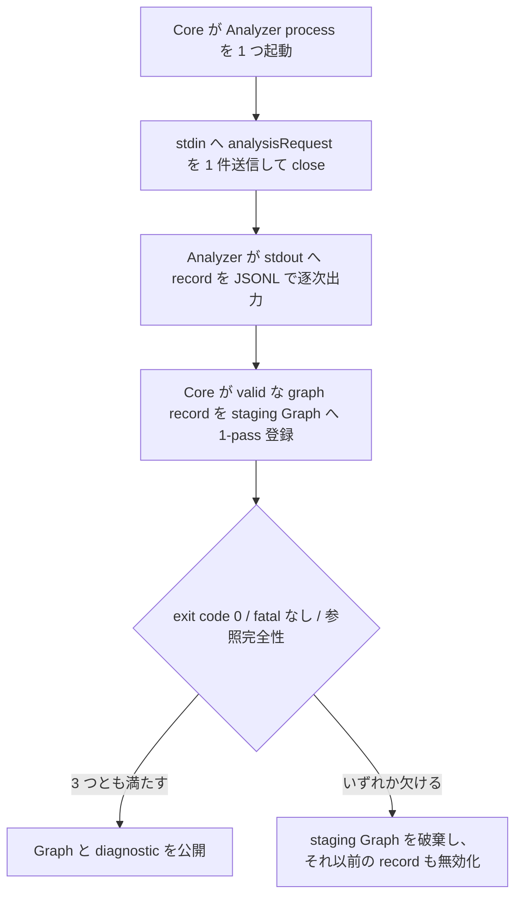

# ADR-0001: Analyzer Protocol を JSONL over STDIN/STDOUT の process SPI とする

## 状態

承認

## 決定日

2026-06-15

## 背景

depwalk は Core を言語非依存に保ち、言語ごとの差異を独立プロセスの Analyzer に閉じ込める。Phase1 は Java Analyzer を対象にするが、将来 Kotlin / TypeScript / Vue / Go の Analyzer を追加しても Core を変更しないことを成功条件にする。

Core が Analyzer の内部ライブラリや言語ランタイムに依存すると、Analyzer 追加時に Core の build / runtime / release 境界が膨らむ。Core と Analyzer の結合点を protocol に限定する必要がある。

## 決定

Core と Analyzer は別プロセスとし、Analyzer SPI は JSONL over STDIN/STDOUT を共通 protocol とする。

### プロセスと入出力

- Core は 1 `analysisRequest` ごとに Analyzer process を 1 つ起動する。
- Core は Analyzer の stdin へ `analysisRequest` record を 1 件送信し、その後 stdin を close する。
- Analyzer は stdout へ `methodSymbol` / `callEdge` / `diagnostic` / `error` record を JSONL で逐次出力する。
- stderr は人間向けの diagnostics とし、Core は protocol record として parse しない。
- exit code `0` は成功、非ゼロは fatal failure とする。

### schemaVersion と互換性の判定

- 全 record の `schemaVersion` は protocol 全体の major version を表す。Phase1 は `"1"` とする。
- record の受信者は、対応済み major version の未知 field を無視し、未対応 major version を拒否する。
- 任意 field の追加は互換変更とする。
- 必須 field の追加と削除、field の型変更、field の意味論変更、record type の削除は breaking change とする。

### streaming と成功結果の公開単位

JSONL の transport streaming と、request 単位での成功結果の公開を分離する。

- Analyzer は graph 全件を buffer せず、stdout へ逐次出力する。
- Core の Analyze Use Case は、valid な graph record を受領した時点で graph 値型へ変換し、request 専用の非公開 staging Graph へ 1-pass で登録する。wire DTO の全件は保持しない。
- exit code `0`、fatal なし、stream 全体の参照完全性の 3 つを満たした場合だけ、Graph と diagnostic を公開する。
- valid な `error` record、非ゼロ exit code、stdout の parse / schema error は、それ以前の graph record と diagnostic をすべて無効にする。fatal な stream には参照完全性を要求せず、staging Graph を破棄する。
- request が fatal でも観測可能にする情報は、Protocol 共通の `error.details` へ正規化する。`code` と `message` を必須、`sourceLocation` と opaque な `metadata` を任意とする。Core と CLI は Analyzer 固有の code で分岐せず、汎用の表示に留める。

Protocol と Model の具体 schema は本 ADR では定めない。

- [design/features/analyzer-protocol/DesignDoc_analyzer-protocol.md](../design/features/analyzer-protocol/DesignDoc_analyzer-protocol.md) の データ構造 / コンテンツモデル と Versioning / compatibility — record type ごとの field 定義と互換性規則を定める

## 代替案

- Analyzer を Core にライブラリとして組み込む。
  - 却下理由: Analyzer ごとの言語ランタイム依存が Core に混在し、将来の Analyzer 追加で Core の変更が必要になる。
- Core と Analyzer を同一プロセス化する。
  - 却下理由: 初期実装は単純になるが、TypeScript / Vue / Go など異なる runtime の Analyzer を追加しづらい。
- capability handshake / session reuse / incremental analysis を Phase1 の protocol に含める。
  - 却下理由: Analyzer 実装と contract test が複雑になる。Phase1 は 1 request = 1 process に限定し、必要性が測定された後に拡張する。

## 影響

### 良い影響

- Core は Analyzer の内部ライブラリや言語ランタイムを知らずに済む。
- 新しい Analyzer を追加しても Core の内部実装の差分を避けやすい。
- JSONL はテキストで観測でき、debug と contract test の入力に使いやすい。
- stdout streaming により、大規模な解析結果を一括読み込みせずに処理できる。
- streaming のメモリ特性を保ったまま、利用者へ部分 Graph を成功結果として渡さずに済む。

### 悪い影響 / トレードオフ

- process 起動と IPC の overhead が発生する。
- Analyzer process の timeout、stderr 上限、record サイズ上限などの runtime config が必要になる。
- session reuse と incremental analysis を初期 protocol に含めないため、短時間に多数の request を投げる用途では後続の拡張が必要になる可能性がある。

### 影響範囲

- 対象モジュール / package: `analyzer-protocol`, `java-analyzer`, `traversal`, `output`

## 実装・運用への反映

- spec 更新要否: 要。spec の durable な成果を feature doc と ADR へ引き継ぎ、spec 側は決定時のスナップショットへ降格する。
- context / AI 向け設定更新要否: 要。`context/testing.md` へ、protocol contract test で何を確かめるかを追記する。

## 関連ドキュメント / チケット

- [design/DesignDoc.md](../design/DesignDoc.md): Core 言語非依存、Analyzer 独立プロセス、Communication Protocol
- [design/features/analyzer-protocol/DesignDoc_analyzer-protocol.md](../design/features/analyzer-protocol/DesignDoc_analyzer-protocol.md): Protocol / SPI / Model schema を定める
- issue / PR:
  - [#8](https://github.com/Fukuemon/depwalk/issues/8): 決定経緯と issue 単位の作業記録
  - [#24](https://github.com/Fukuemon/depwalk/issues/24): request 原子性と failure detail の決定経緯
