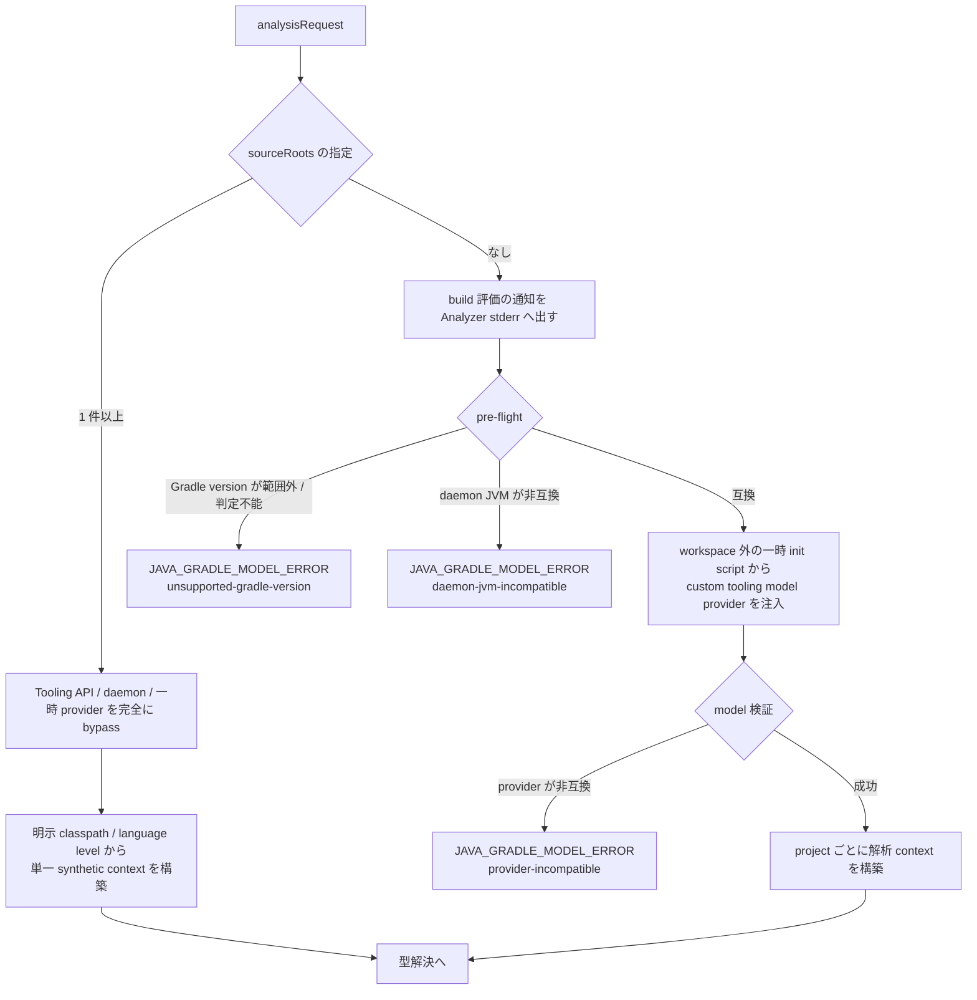

# ADR-0006: Gradle Tooling API による Java source root 自動 discovery を採用する

## 状態

承認

## 決定日

2026-07-18

## 背景

Java project は single-root だけでなく multi-project、変更された `projectDir`、custom source directory、project ごとの classpath / language level を持ち得る。root build file の include 記述だけを辿る方法では、settings logic、plugin、composite build、動的構成で確定する実効 model を再現できない。filesystem convention scanning も、build が定義した source set と依存関係を推測するため、不完全な Graph を成功結果として返す危険がある。

一方、すべての利用者に source roots、classpath、language level の列挙を要求すると通常利用の負担が大きい。自動 discovery と、Gradle build を評価したくない利用者向けの明示 override の両方が必要である。

## 決定

Java Analyzer は `analysisRequest.sourceRoots` 未指定時に Gradle Tooling API を使い、対象 build の実効 model から解析 context を discovery する。

本 ADR に書く版は決定時点 (Tooling API `9.6.1` / 対象 Gradle `7.6.5 <= version < 9.7.0`) のものである。**現在どの版を対象にするかは context が定める。**

- [context/toolchain.md](../context/toolchain.md) の Gradle discovery compatibility matrix — 現行の版と対応範囲を定める

### model の取得範囲

- workspace 外の一時 init script から bundled custom tooling model provider を注入する。
- provider が返すのは project identifier、`main` source roots、compile classpath、classes output、project dependencies、実効 source language level、preview 有無だけとする。Gradle task や source generation は実行しない。
- `test` と名前付き source set は自動 discovery の対象外とする。
- 各 project の `main` ごとに解析 context を作り、project dependency で到達可能な context と classpath だけを型解決へ接続する。

### workspace 境界と除外

- composite / included build の project は model の対象外とし、root build の project 階層だけを解析する。
- workspace 外の external included build project と、provider が報告する included build root は、いずれも `JAVA_SOURCE_ROOT_EXCLUDED` warning で除外を観測可能にし、黙示の脱落を残さない。解決済み artifact は外部依存として利用できる。
- workspace 内 project として採用した source root / file の realpath が workspace 外へ出る場合は fatal とする。

### 未生成 / 未 build の扱い

- model に宣言された source directory が未作成なら、生成前の空 root として除外する。既存 root の非 directory と読取不能は fatal にする。
- 次の 3 つは `JAVA_SOOTUP_UNAVAILABLE` warning とし、該当 bytecode なしで source 解析を継続する。依存 context の source root が solver へ入り型解決を補完する。
  - project classes output が未作成である。
  - 明示経路で自 project の classes output 自体が指定されていない。
  - model 由来 classpath のうち、workspace 内 project 依存の build output が未 build である。
- 利用者が明示した classpath entry と、model が解決済みの workspace 外 external entry については、欠落と読取不能を fatal とする。

### version matrix

- provider は Gradle `7.6.5` API baseline に対して build し、Java 8 classfile とする。compile 用の再配布 API artifact は `7.6.4` が最終のため、`7.6.5` 相当として `7.6.4` を使用する。
- 対象 Gradle は `7.6.5 <= version < 9.7.0` とする。wrapper 不在時は bundled Tooling API `9.6.1` を使用する。
- 固定 CI anchor は `7.6.5 / daemon JDK 8`、`8.14.5 / daemon JDK 17`、`9.6.1 / daemon JDK 25` とする。
  - [context/toolchain.md](../context/toolchain.md) の Gradle discovery compatibility matrix — 互換 matrix の詳細を定める正本

### 明示 override による bypass

`sourceRoots` が 1 件以上指定された request は、Gradle Tooling API、daemon、一時 provider を完全に bypass する。解析 context は、明示された classpath / language level から単一の synthetic context として構築する。この経路は wrapper 判定を含め matrix 全体を bypass する。

### 安全境界

自動 discovery は trusted build 前提である。build logic は利用者権限で評価され、repository credential、network、cache、daemon JVM 選択、任意の副作用は Gradle に任せる。depwalk は credential を受領・保存せず、Gradle stdout / stderr を Protocol / CLI へ転送しない。raw exception は sanitize する。非漏洩保証は depwalk が生成・転送する artifact に限定し、任意 build logic の sandbox は提供しない。

- [context/infrastructure.md](../context/infrastructure.md) の Security / Privacy — trusted build 前提、credential、network、非漏洩境界の運用契約を定める

CLI help はこの副作用と明示 bypass を常時説明する。自動 discovery の各 run では、build 評価の前に Analyzer stderr へ通知を出す。通知は「build logic 評価、repository / credential resolution、network、cache を利用し得る」ことを安定した定型文で伝える。discovery の開始・終了と安定 category は観測可能にするが、Gradle 由来の自由文は転送しない。

### 失敗の分類

次の 3 つはいずれも `JAVA_GRADLE_MODEL_ERROR` の fatal とし、安定 reason で区別する。reason の分類粒度は、判定できた phase に従う。

| reason                       | 条件                                          | 判定 phase                |
| ---------------------------- | --------------------------------------------- | ------------------------- |
| `unsupported-gradle-version` | 対象 Gradle が範囲外、または version 判定不能 | model 要求前の pre-flight |
| `daemon-jvm-incompatible`    | daemon JVM が非互換                           | model 要求前の pre-flight |
| `provider-incompatible`      | provider が非互換                             | model 検証                |

provider load 中に Gradle 側で顕在化した失敗は原因を特定できない。この場合は `model-request-failed` / `connection-failed` として報告し、詳細を raw exception から推測しない。

wrapper 不在の build は同梱 `9.6.1` で評価される。意図しない Gradle version での build 評価を避けたい場合は、wrapper の利用または明示 `sourceRoots` を推奨する。

## 代替案

- root module の include を独自に解析して module を辿る。
  - 却下理由: settings script、plugin、動的 projectDir、composite build と実効 source set / classpath を正確に再現できない。
- 標準 Tooling API model だけを使う。
  - 却下理由: project ごとの compile classpath、classes output、language level / preview を一つの安定した contract として取得するには不足する。
- filesystem convention (`src/main/java`) を走査する。
  - 却下理由: custom layout と build が除外した source を誤認し、project dependency / language level を復元できない。
- 明示 `sourceRoots` のみを提供する。
  - 却下理由: 正確だが multi-project の通常利用で入力負担が大きく、build model と設定の二重管理になる。

## 影響

### 良い影響

- single / multi-project と custom layout を同じ contract で扱える。
- source root、classpath、project dependency、language level を実効 build model から一貫して取得できる。
- 明示 override により Gradle を実行しない決定的な bypass を提供できる。

### 悪い影響 / トレードオフ

- 自動 discovery は Gradle daemon 起動と build 評価の時間・メモリ・副作用を伴う。
- Tooling API client、provider binary、対象 Gradle、daemon JVM の互換性 matrix を継続保守する必要がある。
- trusted でない build logic を安全に実行する sandbox は提供しない。

### 影響範囲

- 対象モジュール / package: `java-analyzer` (Tooling API / provider / discovery)、`analyzer-protocol` (optional `sourceRoots`)、`core` (言語非依存な repeatable `--source-root` flag と metadata passthrough)
- 横断 contract: `design/DesignDoc.md`、`context/architecture.md`、`context/toolchain.md`、`context/testing.md`、`context/infrastructure.md`

## 実装・運用への反映

- spec 更新要否: 要。discovery の durable 設計を本 ADR と Java Analyzer feature doc へハンドオフする。
- context / AI 向け設定更新要否: 要。runtime、toolchain、test、security contract へ反映する。

## 関連ドキュメント / チケット

- [design/DesignDoc.md](../design/DesignDoc.md): Java Analyzer の条件付き Gradle runtime
- [design/features/java-analyzer/DesignDoc_java-analyzer.md](../design/features/java-analyzer/DesignDoc_java-analyzer.md): discovery / analysis context / 完全性を定める
- [design/features/java-analyzer/discovery.md](../design/features/java-analyzer/discovery.md): source root discovery と Gradle runtime の安全境界の規則
- [context/toolchain.md](../context/toolchain.md): Gradle discovery compatibility matrix の正本
- [context/infrastructure.md](../context/infrastructure.md): trusted build、credential、network、非漏洩境界
- [issue #24](https://github.com/Fukuemon/depwalk/issues/24): 決定経緯と issue 単位の作業記録
