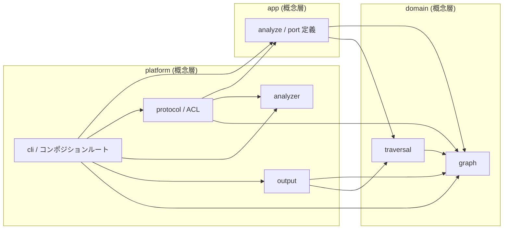

# ADR-0007: Core / Java Analyzer の依存境界を ACL と機械検査で固定する (Core はフラット package 構成を維持)

## 状態

承認

## 決定日

2026-07-24

## 背景

depwalk は Core (Go) と Analyzer (言語別) を、プロセスと JSONL Protocol で分離している。
この外側の境界は機能している。
一方でそれぞれの内部は feature 単位の package 並列に留まる。

- [ADR-0001](0001-analyzer-protocol-jsonl-spi.md) — Core と Analyzer を JSONL Protocol の SPI で分離すると定めた決定
- [ADR-0002](0002-core-implementation-foundation.md) — Core の初期 package 構成を定めた決定

import の実測 (2026-07-23) で、内部に次の 4 点の問題が確認された。

- `core/internal/protocol` がハブ化し、`graph` / `output` / `cli` / `analyze` / `analyzer` の 5 package が直接依存している。wire 表現 (JSONL DTO) がドメイン側へ漏れており、`graph -> protocol` の import が実在する
- `core/internal/cli` が use case (`analyze`) だけでなく `graph` / `output` / `protocol` にも直接依存し、エントリポイントが内層を迂回参照している
- Java Analyzer は `analysis` 配下に 9 sub-package が並列し、解析パイプラインの段階と外部ライブラリへの依存境界が構造から読み取れない。SootUp は `SootUpTypeHierarchyIndex` 1 ファイルへ封じ込め済みだが (2026-07-25 実測)、機械検査がないため隔離の維持を保証できない
- 層の区別がディレクトリ構造からも import 規約からも読み取れず、開発者と AI エージェントが依存方向を誤りやすい

外部挙動 (CLI / JSONL Protocol / 出力形式 / exit code) を一切変えないリファクタリングとして、層を明示し依存方向を機械検査で固定する。

## 要求

### 成功条件

- 依存方向が機械検査 (lint) で強制され、実際の package 間依存が、生成された依存図とコンポジションルートの配線コードから判別できる
- 層をまたぐ禁止 import が CI / pre-commit で機械検出され、regression が防止される
- architecture.md と DesignDoc の記述と、実装の import 関係の乖離 (`graph -> protocol` 等) がゼロになる
  - [context/architecture.md](../context/architecture.md) の Package Boundary — Core の package 依存規則と Java Analyzer の内部境界を定める
  - [design/DesignDoc.md](../design/DesignDoc.md) の設計原則 (Design Principles) — Core を言語非依存に保ち、Analyzer を独立プロセスと共通 Protocol で結合すると定める
- 既存の外部挙動 (CLI インターフェース / JSONL Protocol / 出力形式 / exit code) は一切変わらない

### 業務ルール

| #   | ルール                                                                              | 理由                                                                                                               |
| --- | ----------------------------------------------------------------------------------- | ------------------------------------------------------------------------------------------------------------------ |
| 1   | 依存方向は内向き単方向 (platform → app → domain)。domain は他層に依存しない         | クリーンアーキテクチャの基本原則。DesignDoc の設計原則 (Analyzer は独立プロセス / 共通 Protocol を実装) と整合する |
| 2   | wire 表現 (Protocol DTO) は境界の変換層でドメインモデルへ写像し、内層に持ち込まない | architecture.md の既存規約を実装レベルで保証する                                                                   |
| 3   | 外部ライブラリ (Cobra / SootUp / Gradle Tooling API) への依存は境界側に隔離する     | 将来のライブラリ差し替えとテスト容易性                                                                             |
| 4   | 再編は外部挙動を変えない (E2E / golden test が無変更で PASS する)                   | リファクタリングの安全性の確認                                                                                     |
| 5   | 層をまたぐ禁止 import は機械検査で検出し、quality gate に組み込む                   | 人力レビュー頼みでは regression する                                                                               |

### 受け入れ基準 (EARS)

1. WHEN 開発者が `core/internal` および `analyzers/java` の構造を確認したとき、THE SYSTEM SHALL 層の区別と依存方向を、生成依存図・depguard / ArchUnit のルール・architecture.md の層対応表から判別できる状態を提供する。
2. THE SYSTEM SHALL Core の domain 相当 package (`graph` / `traversal`) から wire 表現 (`protocol`) への import を持たない。
3. IF 層をまたぐ禁止 import が追加された場合、THEN THE SYSTEM SHALL quality gate で検出し CI / pre-commit を FAIL させる。
4. WHEN 再編後に既存のテストスイート (Go unit / Java unit / E2E / golden) を実行したとき、THE SYSTEM SHALL テスト本体のロジック変更なし (package 移動に伴う機械的修正のみ) で全件 PASS する。
5. THE SYSTEM SHALL architecture.md の Package Boundary 記述・`context/project.yml` の Naming Conventions と、実装の package 構造 / import 関係を一致させる。

### スコープ外

外部挙動の変更 (CLI インターフェース・JSONL Protocol schema・exit code 等)、新機能追加、既存ロジックのアルゴリズム変更は対象外とする。
Core / Analyzer 間のプロセス境界の変更も対象外とする。
`analyzers/java` の Gradle build 構成の変更も対象外とする。
ただし package 移動に伴う機械的な追随は行う。

## 決定

### Core (Go) の package 構成と依存方向

`core/internal` 配下は**フラットな責務名 package 構成を維持**し、物理的な層ディレクトリは作らない。

問題の本質は、package 間の実際の依存エッジが見えず強制もされないことである。
層ディレクトリはこれに対して粗すぎる。
層は 3 分類の順序しか示さず、`graph` と `traversal` の関係のような実エッジは依然として不可視だからである。
代わりに次の 3 点で可視性と強制を実現する。

- **依存方向の規定と機械検査**: package 単位の依存規則を depguard の deny ルールで宣言し、CI / pre-commit で強制する。規則の正本は architecture.md の Package Boundary に置く。層 glob より解像度が高い
- **生成された依存図**: `go list` の実 import から package 依存図 (mermaid) を生成するスクリプトを置き、architecture.md の生成マーカー区間を更新する。手描きの図と違い腐らず、再生成の diff を検査すれば実態との drift も検出できる
- **コンポジションルート**: 配線 (手動 DI と `var _` による interface 満足検証) を `cli` に集約し、実際の依存グラフが 1 箇所で読めるようにする

層 (domain / app / platform 相当) は**概念としては維持**し、architecture.md の表で package との対応を示す。
ディレクトリには焼き付けない。
`output` は presenter 層として独立させない。

### wire 変換層 (ACL) と port

- `graph` は自前の `Symbol` / `SourceLocation` 値型を持ち、`protocol` への import をゼロにする。wire 型との重複定義は境界隔離のコストとして許容する
  - [design/features/graph/DesignDoc_graph.md](../design/features/graph/DesignDoc_graph.md) — 「protocol 型を再利用する」という旧決定の改訂先
- `analyze` は domain 型 (graph の値型) を返す port interface を、利用側のファイル内に小さく定義する (`port/` 専用 package は作らない)。`analyze` 自身は struct として公開し、先回りの interface を作らない
- `protocol` は腐敗防止層 (ACL) として wire DTO を内部に閉じ、Translator (wire → domain 変換) と Adapter (port 実装) を担う
- 配線は `cli` (コンポジションルート) でのコンストラクタ注入による手動 DI とし、`google/wire` 等の DI ライブラリとコード生成は導入しない。`var _ Interface = (*Impl)(nil)` の interface 満足検証も `cli` に集約する

### 決定後の Core の依存方向

次の図は、上の 2 節が定める `core/internal` の package 依存方向である。
`graph` / `traversal` は他の internal package を import せず、`protocol` への import も deny する。
`cli` はコンポジションルートとして全 package を import してよい。

この図は本 ADR の決定を示す概念図である。
実 import から生成した図は architecture.md の生成マーカー区間にあり、drift 検査の対象はそちらとする。

### Java Analyzer の構造

- `javaanalyzer` 直下 (`protocol` / `io` / `preflight` / `discovery`) は現状維持とする
- `analysis` 配下は段階別 package で構成し、実行順は `analysis/pipeline` (AnalysisRunner を移動) だけが知る
- 外部ライブラリの隔離は 3 段階とする。SootUp は `analysis/sootup` (adapter facade、自前型で公開) へ完全に封じ込める。Gradle Tooling API は `discovery` へ完全に隔離する。JavaParser / SymbolSolver は解析エンジンの中核として `analysis` 配下では許容し、外への漏れのみ禁止する
  - [design/features/java-analyzer/DesignDoc_java-analyzer.md](../design/features/java-analyzer/DesignDoc_java-analyzer.md) — 内部 package 構成と依存境界の反映先

### 依存方向の機械検査

- Go: golangci-lint + depguard を導入し、package 単位の禁止 import を `files` + `deny` + `desc` の宣言形式で検査する。例として `graph` / `traversal` → `protocol` / `cli` / `output` を deny し、`analyze` → `protocol` / `analyzer` / `output` / `cli` を deny する。lefthook pre-commit と CI に組み込む
- Java: ArchUnit を test 依存として追加し、外部ライブラリ隔離ルールを JUnit テストとして記述する。既存の `./gradlew test` で実行される

### 実装の段階分割

実装は 2 段階に分割する。
第 1 段階で Core 再編と depguard 導入、第 2 段階で Java Analyzer 再編と ArchUnit 導入を行う。
各段階で既存テスト (unit / E2E / golden) が無変更で PASS する状態を保つ。

## 代替案

- 機械的層名 (`domain` / `usecase` / `infra`) を採用する。
  - 却下理由: クリーンアーキテクチャで唯一絶対なのは依存の内向き方向であり、層名と層数は自由である。Go コミュニティは機械的層名を避ける傾向があり、`app` / `platform` で同じ構造的可読性が得られる。
- 3 層ディレクトリ (`domain/` `app/` `platform/`) へ物理移動する。
  - 却下理由: 知りたい解像度は実際の依存エッジであり、層ディレクトリは 3 分類の粗い順序しか示さない。package 名は責務名のまま維持されるため、import path の深化・既存 branch との conflict・doc 17 箇所の追随という churn に見合う情報増がない。layer-first を避けて責務名の package を保つ、という Go の設計慣行とも整合しない。depguard は package 単位ルールで層 glob と同等以上の強制ができる。フラット構成 + lint 案の弱点だった「層の判別が文書依存になる」点は、手描き文書ではなく生成された依存図と drift 検査に置き換えることで解消する。
- `output` を presenter として独立層にする。
  - 却下理由: package 1 つのために 4 層目を作るのは先回りした共通化である。依存ルールは platform → domain の既存規則で表現できる。
- 変換を `analyze` に置き、app → platform (`protocol`) の import を例外許可する。
  - 却下理由: 層ルールに初回から例外が入り、lint ルールと説明文書が複雑化する。port + ACL なら例外なしで成立する。
- `google/wire` 等の DI ライブラリを導入する。
  - 却下理由: Core の配線は数個の struct の組み立てであり、手動 DI で十分である。依存を最小に保つ既存方針と整合し、interface を利用側で小さく定義するスタイルとも `wire.Bind` の相性が悪い。
- JavaParser / SymbolSolver も adapter へ全面隔離する。
  - 却下理由: 本 Analyzer は JavaParser の AST 上に構築された解析器そのものであり (35 クラス中 16 クラスが使用)、全面隔離は実質的な書き換えとなる。「外部挙動不変の再編」というスコープを超える。
- Java 側の機械検査を見送り、規約文書のみで運用する。
  - 却下理由: 再編直後が最も regression しやすく、Go 側 (depguard) と非対称になる。ArchUnit は既存の `./gradlew test` に乗るため導入コストが小さい。

## 影響

### 良い影響

- 生成された依存図・depguard の理由付きエラー・`cli` の配線コードの 3 点から実際の依存関係が判別でき、新規参加者と AI エージェントが配置と依存を誤りにくい。物理移動がゼロのため既存 path と既存 branch に影響しない
- wire 表現の変更 (Protocol 版更新) が ACL で遮断され、ドメインへ波及しない
- 禁止 import が CI / pre-commit で機械検出され、人力レビュー頼みの regression を防げる
- 参照実装 (Java Analyzer) の構造から、第 2 言語 Analyzer の作り方を読み取れる

### 悪い影響 / トレードオフ

- `SourceLocation` 相当の型定義が wire 用と domain 用で重複し、フィールド追加時に 2 箇所の更新と変換の追随が必要になる
- golangci-lint と ArchUnit という dev / test 依存が増え、バージョン固定の保守が必要になる
- パスを見るだけでは層の粗い順序が読めない。生成図と depguard の `desc` メッセージ、architecture.md の層対応表で代替する
- 依存図生成スクリプトという保守対象が 1 つ増える。drift 検査で腐敗は防ぐ

### 影響範囲

- 対象モジュール / package: `core`, `traversal`, `output`, `analyzer-protocol`, `java-analyzer`

## 実装・運用への反映

- context / AI 向け設定更新要否: 要。architecture.md (Package Boundary の依存規則・生成依存図・Java 内部境界)、`context/project.yml` (Naming Conventions)、`context/engineering.md` (依存方向 gate) へ反映済み

## 関連ドキュメント / チケット

- [design/DesignDoc.md](../design/DesignDoc.md): 設計原則 (本 ADR は Analyzer 独立プロセス / 共通 Protocol の内部徹底であり landscape 不変)
- [context/architecture.md](../context/architecture.md): Package Boundary (Core の package 依存規則・生成依存図・Java Analyzer の内部境界)
- [context/project.yml](../context/project.yml): Naming Conventions
- [context/engineering.md](../context/engineering.md): Repository Quality Gate (depguard / ArchUnit による依存方向 gate)
- [ADR-0001](0001-analyzer-protocol-jsonl-spi.md): Core と Analyzer を JSONL Protocol の SPI で分離する決定
- [ADR-0002](0002-core-implementation-foundation.md): 初期 package 構成 (本 ADR で依存境界を改訂)
- [design/features/graph/DesignDoc_graph.md](../design/features/graph/DesignDoc_graph.md): `SourceLocation` 自前型化・変換所在の改訂先
- [design/features/java-analyzer/DesignDoc_java-analyzer.md](../design/features/java-analyzer/DesignDoc_java-analyzer.md): 内部 package 構成と依存境界
- issue: [#32](https://github.com/Fukuemon/depwalk/issues/32) (epic) / [#34](https://github.com/Fukuemon/depwalk/issues/34) (Core) / [#35](https://github.com/Fukuemon/depwalk/issues/35) (Java Analyzer)
- 外部参考資料: [Go の設計、どこまでやる？](https://zenn.dev/135yshr/books/go-service-design) (依存性ルール / interface 利用側定義 / ACL / 手動 DI / depguard)
