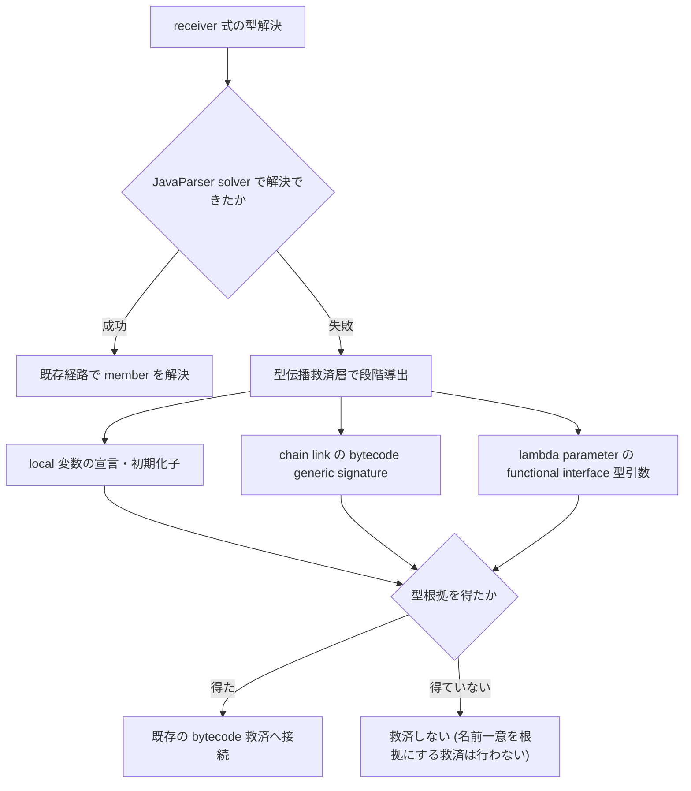

# ADR-0009: framework 由来の暗黙呼び出し解決と型伝播救済の設計判断

## 状態

承認

## 決定日

2026-08-13

## 背景

変更影響調査の網羅性は、edge が 1 本欠けると答えが間違う。
そこに対し、framework が実行時に起動する暗黙の呼び出しが edge にならない欠落が残っていた。
実環境検証プロジェクト (Gradle multi-project、7 project / call site 52,411) の実測で、次の 5 点が判明した。

1. アノテーション駆動 entry point が未解決と区別できない
2. イベント publish → listener の伝播が途切れる
3. 値渡しされた callable の invocation が繋がらない
4. 未解決診断の約 91% が、stream / builder 連鎖と generics 局所変数の receiver 型導出失敗である
5. 既定 heap での OutOfMemoryError と Gradle daemon JVM 非互換が、解析実行を阻害する

本 ADR は、この解決のために比較検討した判断群を 1 本へ集約して記録する。
関連する判断を個別 ADR へ分けない前例は既にある。

- [ADR-0005](0005-adopt-sootup-and-spring-di-resolution.md) — SootUp 導入と Spring DI 解決を 1 つの feature として段階導入すると定めた決定
- [ADR-0007](0007-layered-architecture-refactor.md) — Core / Java Analyzer の依存境界に関する判断群をまとめて記録した決定

## 決定

1. **Protocol 表現は opaque metadata と `JAVA_` diagnostic code の新設で閉じ、schema を変更しない**。
2. **entry point 分類は edge を作らず、終端根拠のみを付与する**。擬似 caller node は合成せず、runtime-provided マーカーの既存設計を踏襲する。
3. **イベント edge は broadcast 意味論の専用規則で表現する**。合致 listener への edge は複数でも各々確定 (`resolution: unique`) とし、曖昧扱いは条件付き listener のみとする。Spring DI の「複数候補 = 曖昧」とは意味論が異なるため流用しない。
4. **callable invocation edge は、method reference なら参照先メソッドへ、lambda なら定義側の囲みメソッド (標識付き) へ張る**。lambda 本体を独立 node にしない既存決定は維持し、囲みメソッドへの edge を「invoker はそのメソッド内で定義されたコードを実行する」の意味で用いる。静的追跡範囲は「同一メソッド内 + workspace メソッドへの引数渡し 1 段」に限定する。
5. **chain 型解決は「型伝播救済層」で強化する**。solver 失敗時に receiver 式の型を段階導出し、既存の bytecode 救済へ接続する。SAM arity も functional interface の bytecode から導出する。常に型根拠を維持し、宣言上の名前が一意であることだけを根拠にする救済には踏み込まない。型根拠なしの member 解決を採らないという既存決定を守るためである。
6. **Console は `entryPoint` key に限り metadata を意味解釈して表示する**。「Output は metadata を意味解釈しない」の唯一の例外とし、他 key の Console 表現は引き続き見送る。
7. **OutOfMemoryError は Core 側で検知し、対処付きのエラーとして報告する**。Analyzer が valid な `error` record なしで異常終了した場合に限り stderr をヒント照合し、解析結果の解釈には使わない。
8. **Gradle daemon JVM は request の `metadata.gradleJavaHome` による明示 override のみ提供する**。互換 JDK の暗黙の自動探索は行わない。discovery の明示性方針を維持するためである。

### 暗黙呼び出しの Protocol 表現

決定 1 に従い、3 種の暗黙呼び出しは既存 schema の opaque metadata へ標識する。

| 対象                           | 標識                                                               |
| ------------------------------ | ------------------------------------------------------------------ |
| アノテーション駆動 entry point | `methodSymbol.metadata.entryPoint` (検出アノテーション FQN の配列) |
| イベント publish → listener    | `callEdge.metadata.provenance` へ値 `spring-event` を追加          |
| callable invocation            | `callEdge.metadata.viaCallableInvocation: true`                    |

### 型伝播救済層の段階

決定 5 の段階導出は次の順で進む。
導出手段のいずれかで型根拠を得た場合だけ、既存の bytecode 救済へ接続する。

## 代替案

- **Protocol schema 拡張 (新 field / record)**: 言語非依存の一級表現になるが、契約変更・Core parser 改修・他言語 Analyzer への負担が生じる。複数言語の要求がない現時点では過剰設計である。却下。
- **イベント edge への DI 候補規則の流用 (複数 listener = ambiguous)**: 規則は単純だが、すべて実行される listener 群が「曖昧」と表示され、利用者が確度を誤読する。却下。
- **callable の diagnostic のみ (edge を張らない) / method reference のみ対応**: 影響伝播が途切れたままになり、callable 経由の呼び出しを edge として追跡する要求を満たさない。却下。
- **名前ベース救済の拡大 (型根拠なしで bytecode member を引く)**: 型根拠なしの member 解決を採らないという既存決定と正面衝突し、誤 edge のリスクが高い。却下。
- **JavaParser solver 本体への推論補強**: 失敗箇所が solver 内部に散在し、副作用範囲が読めない。却下。
- **Analyzer 側での OOM error record 化**: OOM 後の record 出力はメモリ確保を伴い、成功する保証がない (best effort に留まる)。却下。
- **互換 JDK の自動探索フォールバック**: 暗黙の JVM 選択は、利用者が信頼する build logic を利用者権限で評価するという discovery の明示性方針と相性が悪い。却下。

## 影響

### 良い影響

- entry point / イベント / callable の暗黙呼び出しが観測可能になり、caller 探索の終端根拠を示せる
- 実測で支配的だった未解決の形状 (receiver 型導出失敗、未解決診断の約 91%) に既存 bytecode 救済を接続できる
- Protocol と Core parser が無変更のため、他言語 Analyzer への契約影響がない

### 悪い影響 / トレードオフ

- lambda への invocation edge は囲みメソッド全体への近似であり、粒度が粗い (標識で明示する)
- Console の metadata 非解釈契約に例外が 1 つ入る (対象 key を `entryPoint` に固定して拡大を防ぐ)
- 型伝播救済層の導出手段が増えるほど解析コストが増える (index ベースで抑制し、実測で確認する)

### 影響範囲

- 対象モジュール / package: java-analyzer (分類・突合・救済・discovery)、output (Console の entry point 標識)、core (異常終了時のエラー報告)
- traversal はコードと契約のいずれも変更しない
- analyzer-protocol はコード変更なし。契約文書 (feature doc) へ、metadata 解釈の例外 (決定 6) と異常終了時の stderr の扱い (決定 7) を追記する

## 実装・運用への反映

- context / AI 向け設定更新要否: 要。toolchain 系の運用文書へ heap 指針と daemon JVM override 手順を追記する (実装 PR と同時)
- feature doc 追記: java-analyzer (analysis / protocol-mapping / discovery / DesignDoc)、output、analyzer-protocol、cli の各 doc の該当節へ設計を反映済み。実装状況は各 doc の注記に従う

## 関連ドキュメント / チケット

- [design/DesignDoc.md](../design/DesignDoc.md): Future Work「解析精度の強化」の実装単位
- [design/features/java-analyzer/analysis.md](../design/features/java-analyzer/analysis.md): 型伝播救済層 / 暗黙呼び出し解決の規則
- [design/features/java-analyzer/protocol-mapping.md](../design/features/java-analyzer/protocol-mapping.md): metadata 標識の Protocol 上の写像
- [design/features/java-analyzer/discovery.md](../design/features/java-analyzer/discovery.md): Gradle daemon JVM override の扱い
- [design/features/output/DesignDoc_output.md](../design/features/output/DesignDoc_output.md): entry point 標識の表示規則
- [ADR-0004](0004-defer-runtime-call-tracing.md): 動的呼び出しの完全追跡を見送る前提
- [ADR-0005](0005-adopt-sootup-and-spring-di-resolution.md): SootUp と Spring DI 解決の段階導入という前提
- [ADR-0006](0006-adopt-gradle-tooling-api-discovery.md): Gradle Tooling API による discovery という前提
- [ADR-0007](0007-layered-architecture-refactor.md): 判断群を 1 本の ADR へ集約した前例
- issue: [#82](https://github.com/Fukuemon/depwalk/issues/82)
