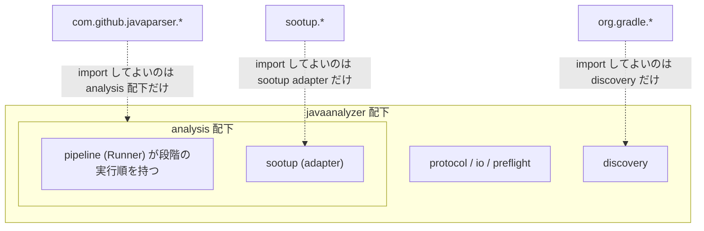
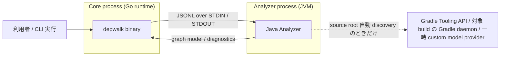

# Codebase Architecture

コードベースの package / runtime / state boundary と依存方向を定める。
全体像 (system landscape とモジュール責務) と Core 実装基盤の選定は別の正本が持ち、本書は境界の規約だけを扱う。

- [design/DesignDoc.md](../design/DesignDoc.md) の「アーキテクチャ概観 (Overview)」「モジュール責務」 — system landscape と各モジュールの責務を定める
- [ADR-0002](../adr/0002-core-implementation-foundation.md) — Core 実装基盤に Go と Go modules を採用した決定
- [project.yml](project.yml) — repo / 命名 / コマンドなどのプロジェクト固有値を定める

## Package Boundary

依存方向は Core 内を単方向にし、Core から Analyzer へは Protocol 境界だけを通す。
Core を言語非依存に保ち、言語ごとの差分を Analyzer 側へ閉じ込めるためである。
方針の根拠は Design Doc の 設計原則 (Design Principles) にある。

- CLI は Core だけに依存する。
- Core 内の依存は `Traversal Engine` → `Graph Engine`、`Output Engine` → `Graph Engine` / `Traversal Engine` の向きとする。Output から Traversal への依存は、traversal の result / request 型を使う consumer としての依存である。逆向き (Traversal → Output) は循環になるため禁止する。
  - [Output feature doc](../design/features/output/DesignDoc_output.md) の「公開 entry point と Formatter / View」 — Output が graph / traversal の型を入力として受け取る entry point を定める
- Graph Engine は node / edge の表示用属性を graph 固有の値型で保持する。属性は `Symbol` (qualifiedName / signature / 宣言位置 (optional) / opaque metadata) と `CallSite` であり、宣言位置は wire に依存しない自前の `SourceLocation` 型で持つ。
  - wire record から domain 値型への変換は、platform 層の腐敗防止層 (ACL) である `protocol` が担う。
  - Analyze Use Case は、port 経由で受け取った domain 値を非公開の staging Graph へ 1 pass で登録する。
  - stream 全体の参照完全性を検査するのは ACL とする。wire record を見る責務が ACL にあるためである。
  - Use Case は、検査結果と Analyzer process の成功を確認したときだけ Graph を公開する。fatal 時は Graph と先行 diagnostic をまとめて破棄する。
  - wire DTO 全件と wire 専用フィールド (`schemaVersion` / `recordType`) は graph model に保持しない。
  - [Graph feature doc](../design/features/graph/DesignDoc_graph.md) の「データ構造 / コンテンツモデル」「構築と公開の原子性」 — graph model が持つ属性と、staging から公開までの原子性を定める
- Core から Analyzer への経路は `Analyzer SPI` (Protocol 境界) だけとする。Core は Analyzer が使うライブラリと言語ランタイムを知らない。
  - [Analyzer Protocol / SPI feature doc](../design/features/analyzer-protocol/DesignDoc_analyzer-protocol.md) — Protocol / SPI / Model schema を定める
- Analyzer は `Model` (`MethodSymbol` / `CallEdge` / `SourceLocation`) のスキーマにだけ依存し、Core の内部実装には依存しない。
- 禁止経路は、Core から特定言語ランタイムまたは Analyzer 実装への直接依存とする。2 つ目以降の言語 Analyzer を追加したときに Core へ差分が出ないことを保つ。初号機導入時の言語非依存な初回配線は、この対象外とする。

### Core の package 構成と依存方向 (Go)

`core/internal` 配下はフラットな責務名 package で構成する。
層 (domain / app / platform 相当) は概念としてだけ維持し、ディレクトリ構造には焼き付けない。

- [ADR-0007](../adr/0007-layered-architecture-refactor.md) — Core と Java Analyzer の依存境界を ACL と機械検査で固定した決定

| Package                         | 層 (概念)  | 責務                                                                                      |
| ------------------------------- | ---------- | ----------------------------------------------------------------------------------------- |
| `core/cmd/depwalk`              | (cmd)      | `main`。Cobra root command の起動                                                         |
| `core/internal/graph`           | `domain`   | graph model (自前の `Symbol` / `SourceLocation` 値型)、node / edge 管理                   |
| `core/internal/traversal`       | `domain`   | caller / callee traversal                                                                 |
| `core/internal/graph/graphtest` | (test)     | graph のテスト支援 sub-package (`net/http/httptest` 相当)。本番コードから import しない   |
| `core/internal/analyze`         | `app`      | `depwalk analyze` の use case orchestration + port interface 定義 (利用側・小さく)        |
| `core/internal/protocol`        | `platform` | JSONL wire DTO / parse / validate + ACL (wire → domain 変換 Translator と port 実装)      |
| `core/internal/analyzer`        | `platform` | 外部 Analyzer process の起動、stdin / stdout / stderr、exit code handling                 |
| `core/internal/output`          | `platform` | Console / JSON formatter (依存先は graph / traversal のみ)                                |
| `core/internal/cli`             | `platform` | CLI command / flags / 入力 validation + 手動 DI 配線 (コンポジションルート、`var _` 集約) |

package 単位の依存規則は次のとおりとする。depguard で機械検査する。

- `graph`: 他の internal package に依存しない (wire 表現である `protocol` への import 禁止を含む)
- `traversal` → `graph` のみ
- `graph/graphtest` → `graph` のみ (テスト支援 sub-package。本番コードから import しない)
- `analyze` → `graph` / `traversal` のみ。`protocol` / `analyzer` / `output` / `cli` への import は禁止する (抽象は analyze 側の port interface で表現し、`protocol` が実装する)
- `output` → `graph` / `traversal` のみ
- `protocol` → `analyze` (port 実装) / `analyzer` (process 起動に利用) / `graph`
- `analyzer`: 他の internal package に依存しない
- `cli` はコンポジションルートとして全 package を import してよい (依存性ルールの例外ではなく最外層の役割)
- `core/cmd/depwalk` → `cli` のみ。起動だけを担い、内層を直接 import しない
- DI ライブラリ (`google/wire` 等) は導入せず、`cli` でのコンストラクタ注入による手動 DI とする

依存図は手で描かず、`go list` の実 import から `scripts/depgraph.sh` で生成して下の生成マーカー区間へ埋める。
再生成して diff が出る状態 (図の更新漏れ) は、lefthook pre-commit と CI が drift として検出する。

<!-- BEGIN GENERATED: core-depgraph (scripts/depgraph.sh が更新する。手編集しない) -->

```mermaid
graph LR
    graph_graphtest["graph/graphtest"]
    analyze --> graph & traversal
    cli --> analyze & analyzer & graph & output & protocol
    graph_graphtest --> graph
    output --> graph & traversal
    protocol --> analyze & analyzer & graph
    traversal --> graph
```

<!-- END GENERATED: core-depgraph -->

### Java Analyzer の内部境界

`analyzers/java` の `javaanalyzer` 配下は、解析パイプラインの段階別 package (`analysis/` 配下) と、入出力・起動系の package (`protocol` / `io` / `preflight` / `discovery`) で構成する。
段階の実行順を知るのは `analysis/pipeline` (Runner) だけとする。

外部ライブラリの隔離は次の 3 段階に分ける。判断を定めるのは ADR-0007 である。

- SootUp: `analysis/sootup` (adapter) へ完全に封じ込め、facade が自前型で公開する。他 package からの `sootup.*` の import は禁止する
- Gradle Tooling API: `discovery` へ完全に隔離し、`org.gradle.*` を import してよいのは `discovery` だけとする。jar が `org.gradle.api` / `util` / `internal` も同梱するため、tooling 配下だけの限定にはしない
- JavaParser / SymbolSolver: 解析エンジンの中核として `analysis` 配下では自由に使ってよい。`analysis` の外への import は禁止する



言語別 Analyzer 実装は `analyzers/<language>/` に置く。
Java Analyzer 実装は `analyzers/java/` に置き、Core の `internal` package には入れない。
Core と Analyzer が共有してよいのは、Protocol doc、ADR、JSONL fixture、contract test の観点だけとする。
Go package と Java の実装コードは共有しない。

依存境界の自動検査 (Go は golangci-lint + depguard、Java は ArchUnit) は quality gate が扱う。
Core と Java Analyzer のいずれも実装済みで、本書の記述と実コードの import は一致している。
一致を保証するのは、Go では上の生成依存図に対する drift 検査、Java では ArchUnit である。

- [engineering.md](engineering.md) の Repository Quality Gate — 依存方向 gate の実行点と検査内容を定める

## Runtime Boundary

- Core と Analyzer は別プロセスとして動き、STDIN / STDOUT 上の JSONL で通信する。形式を定めるのは Design Doc の Communication Protocol である。
- Core は Go runtime で動く CLI binary として実装する。Analyzer は対象言語のランタイム上で動く (Java Analyzer は JVM)。
- 解析は静的解析だけで行い、実行時情報と runtime trace には依存しない。この非対象を定めるのは Design Doc の Non Goals である。
- Java Analyzer の source root 自動 discovery のときだけ、条件付きの runtime として Gradle Tooling API、対象 build の Gradle daemon、workspace 外へ置く一時 custom model provider が加わる。
  - Gradle build logic は利用者権限で評価され、network、credential provider、cache、任意の副作用を持ち得る。
  - 明示 `sourceRoots` はこの経路を完全に bypass する。
  - Core と Analyzer の Protocol 境界は、この経路が加わっても言語非依存のまま変えない。
  - [Java Analyzer feature doc](../design/features/java-analyzer/DesignDoc_java-analyzer.md) の 起動契約 — Analyzer の起動と入出力の契約を定める
  - [infrastructure.md](infrastructure.md) の Security / Privacy — 自動 discovery の副作用境界と非漏洩保証の範囲を定める
  - [ADR-0006](../adr/0006-adopt-gradle-tooling-api-discovery.md) — Gradle Tooling API による Java source root 自動 discovery を採用した決定



## State Boundary

- Analyzer は解析対象ソースを読み取り専用で扱い、depwalk は対象リポジトリを書き換えない。ただし自動 discovery では、対象 build logic の評価に伴う Gradle runtime 全体の副作用を別の境界として扱う。
- 中間状態は、request 専用の非公開 staging Graph として Core process 内に保持する。成功時だけ公開し、fatal または非ゼロ exit のときは先行 diagnostic とともに破棄する。永続ストアは現時点で持たない。

## 参照

- [design/DesignDoc.md](../design/DesignDoc.md) の「アーキテクチャ概観 (Overview)」「モジュール責務」「設計原則 (Design Principles)」「Communication Protocol」「Non Goals」: 全体像、設計原則、通信形式、解析範囲の非対象
- [Graph feature doc](../design/features/graph/DesignDoc_graph.md): graph model の属性と、staging から公開までの原子性
- [Output feature doc](../design/features/output/DesignDoc_output.md): Output の公開 entry point と入力型
- [Analyzer Protocol / SPI feature doc](../design/features/analyzer-protocol/DesignDoc_analyzer-protocol.md): Protocol / SPI / Model schema
- [Java Analyzer feature doc](../design/features/java-analyzer/DesignDoc_java-analyzer.md): Java Analyzer の起動契約と解析範囲
- [engineering.md](engineering.md) の Repository Quality Gate: 依存方向 gate の実行点
- [infrastructure.md](infrastructure.md) の Security / Privacy: 自動 discovery の副作用境界と非漏洩保証の範囲
- [project.yml](project.yml): repo / 命名 / コマンドなどのプロジェクト固有値
- [ADR-0002](../adr/0002-core-implementation-foundation.md): Core 実装基盤に Go と Go modules を採用した決定
- [ADR-0006](../adr/0006-adopt-gradle-tooling-api-discovery.md): Gradle Tooling API による source root 自動 discovery を採用した決定
- [ADR-0007](../adr/0007-layered-architecture-refactor.md): 依存境界を ACL と機械検査で固定した決定
