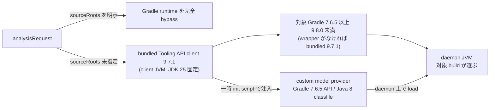

# Toolchain

採用する標準 toolchain と、その導入境界を定める。
実装者が参照する stack だけを本書に置き、採否の判断そのものは ADR が持つ。

- [adr/](../adr/) — 技術選定と境界の確定を記録する
- [ADR-0002](../adr/0002-core-implementation-foundation.md) — Core 実装基盤に Go と Go modules を採用した決定
- [project.yml](project.yml) の Quick Commands — プロジェクト固有のコマンドを定める

## 標準スタック

| 区分                      | ツール                                    | 備考                                                                                                                                                      |
| ------------------------- | ----------------------------------------- | --------------------------------------------------------------------------------------------------------------------------------------------------------- |
| Package manager           | Go modules                                | `core/go.mod` を module manifest とする                                                                                                                   |
| Task runner               | Go 標準 command                           | 初期は make-like wrapper を導入しない                                                                                                                     |
| Language (Core)           | Go                                        | single binary 配布、JSONL streaming、process 制御を重視                                                                                                   |
| Language (Java Analyzer)  | Java (JVM)                                | Analyzer runtime JDK 25 / Gradle (Kotlin DSL) + Shadow plugin / 単一 fat jar 配布。JavaParser / SymbolSolver / SootUp / Gradle Tooling API `9.7.1` を利用 |
| Gradle discovery provider | Java 8 classfile                          | Gradle `7.6.5` API baseline (compile は `7.6.4` artifact)。対象 Gradle は `7.6.5`〜`9.7.x`、一時 init script から注入                                     |
| CLI framework             | `github.com/spf13/cobra`                  | 初期 runtime dependency は Cobra のみに抑える                                                                                                             |
| Linter                    | `go vet` / `golangci-lint`                | `golangci-lint` は導入済み。depguard で依存方向を機械検査する ([engineering.md](engineering.md) の Repository Quality Gate)                               |
| Formatter                 | `gofmt` / `go fmt`                        | Go 標準 formatter を正とする                                                                                                                              |
| Unit test                 | Go 標準 `testing`                         | 手書き fake / golden fixture / contract test で開始する                                                                                                   |
| E2E                       | Go 標準 `testing` から CLI fixture を実行 | 実装は `core/e2e`                                                                                                                                         |

## 採用方針

- Java Analyzer の解析ライブラリは先行して固定する。AST は JavaParser、型解決は SymbolSolver、Interface Dispatch と Override 解決は SootUp が担う。SootUp は型階層 / override / interface 実装候補の索引としてだけ使い、call graph 生成は任せない。
  - [Java Analyzer feature doc](../design/features/java-analyzer/DesignDoc_java-analyzer.md) の 実装基盤 — 解析ライブラリの役割分担と SootUp の使用範囲を定める
- Gradle discovery の stack を固定する。Tooling API client は `9.7.1`、対象 Gradle は `7.6.5`〜`9.7.x`、custom model provider は Gradle `7.6.5` API と Java 8 classfile とする。version matrix の詳細は本書の Gradle discovery compatibility matrix 節だけを見る。
  - [ADR-0006](../adr/0006-adopt-gradle-tooling-api-discovery.md) — Gradle Tooling API による Java source root 自動 discovery を採用した決定
- Java と Gradle の version は次の 4 軸に分離し、軸をまたいだ推測と代用を禁止する。

| 軸  | 対象                                          | 決め方                                                                                                          |
| --- | --------------------------------------------- | --------------------------------------------------------------------------------------------------------------- |
| 1   | Analyzer runtime JDK                          | JDK 25 に固定する                                                                                               |
| 2   | Gradle daemon JVM                             | 対象 Gradle の互換条件で選ぶ                                                                                    |
| 3   | 対象 project の compile toolchain             | 対象 project の build 定義が決める                                                                              |
| 4   | parser に渡す source language level / preview | `release` を優先し、なければ実効 `sourceCompatibility` を使う。`targetCompatibility` は parser input に使わない |

- Java Analyzer の実装言語は Java を維持し、Kotlin を採用しない。JDK 25 の言語機能 (sealed interface + record + pattern matching) で Kotlin の主な利点が Java 単体でも得られ、JavaParser との interop では Kotlin の null 安全が platform type のため効かないからである。判断を定めるのは Java Analyzer feature doc である。
- Core の実装言語は Go に固定する。
- Analyzer との通信は JSONL over STDIN/STDOUT に固定する。言語非依存であり、実装とデバッグが容易だからである。
  - [ADR-0001](../adr/0001-analyzer-protocol-jsonl-spi.md) — Analyzer Protocol を JSONL over STDIN/STDOUT の process SPI とする決定
  - [Analyzer Protocol / SPI feature doc](../design/features/analyzer-protocol/DesignDoc_analyzer-protocol.md) — Protocol / SPI / Model schema を定める
- Go 側の Core は標準ライブラリを優先する。JSONL、外部 process 実行、graph 表現、Console / JSON 出力、test は、標準ライブラリと内部 package で開始する。
- JSONL の parser / validator は安定版の `encoding/json` で開始する。ただし `encoding/json` v1 の duplicate key 許容、invalid UTF-8 の置換、struct field の case-insensitive matching は、Protocol contract として採用しない。
- `encoding/json/v2` と `encoding/json/jsontext` は初期採用しない。Go 1.25 時点では experimental であり、`GOEXPERIMENT=jsonv2` が不要になった時点で strict な JSONL parser の実装候補として再評価する。
- Runtime dependency は初期状態で `github.com/spf13/cobra` だけに限定する。設定ファイルと env binding が要件化されるまで `viper` を導入しない。
- `golangci-lint` は runtime dependency ではなく quality gate として導入済みで、version は `scripts/golangci-lint.sh` で pin する。`govulncheck` は未導入で、引き続き候補として扱う。

## Gradle discovery compatibility matrix

自動 discovery の version matrix は本節で定める。

- bundled Tooling API client と Analyzer build wrapper: `9.7.1`
- target Gradle: `7.6.5 <= version < 9.8.0`
- wrapper がない build: bundled version `9.7.1` を使用
- custom provider: Gradle `7.6.5` API baseline、Java `--release 8`、classfile major 52。compile に使う再配布 API artifact (`dev.gradleplugins:gradle-api`) は `7.6.4` が最終のため `7.6.4` へ compile する。patch release は public API が変わらないため、`7.6.5` より新しい API 参照を混入させない契約はより強く満たされる
- Analyzer client JVM: JDK 25 固定
- daemon JVM: 対象 build の wrapper と Gradle 設定が選び、Gradle 公式の Java compatibility matrix に従う。depwalk は JDK の download、同梱、自動選択のいずれも行わず、Analyzer の JDK 25 を古い Gradle daemon へ強制しない。利用者は request `metadata.gradleJavaHome` (`--analyzer-meta gradleJavaHome=<path>`) で daemon JVM を明示 override できる
  - [discovery.md](../design/features/java-analyzer/discovery.md) の「Source root discovery と解析 context」 — `gradleJavaHome` の値の形式と検証規則を定める

CI では次の 3 つを anchor として固定し、いずれも provider load、model field、task 非実行、output 隔離、固定 Graph を検証する。

| CI anchor       | daemon JVM |
| --------------- | ---------- |
| Gradle `7.6.5`  | JDK 8      |
| Gradle `8.14.5` | JDK 17     |
| Gradle `9.7.1`  | JDK 25     |

次の 3 つはいずれも `JAVA_GRADLE_MODEL_ERROR` の fatal とし、安定 reason で区別する。

| 状況                                            | 安定 reason                  |
| ----------------------------------------------- | ---------------------------- |
| 範囲外 / version 判定不能な custom distribution | `unsupported-gradle-version` |
| provider の load 失敗                           | `provider-incompatible`      |
| daemon JVM の非互換                             | `daemon-jvm-incompatible`    |

対応の下限と上限を変えるときは、本節の表と Java Analyzer feature doc を同時に更新する。**ADR-0006 は更新しない。** ADR は決定時点の記録であり、採用した版が動くという当時の判断を残す文書である。現在どの版を対象にするかは本節が定める。

- [discovery.md](../design/features/java-analyzer/discovery.md) の「Source root discovery と解析 context」 — 対象 Gradle の範囲を feature 側から示す

明示 `sourceRoots` の経路は、wrapper 判定、Tooling API、provider load、daemon matrix をすべて bypass する。

### 実装上の互換性ハマりどころ

- provider が呼べる Gradle API は「7.6 に存在し、かつ 9.x で削除されていない」ものだけである。compile baseline が 7.6 でも、runtime は対象 build の daemon (最大 9.7.x) で動くため、compile が通っても runtime で `NoSuchMethodError` になる。実例として `ProjectDependency.getDependencyProject()` は Gradle 9.0 で削除済みで、代替の `ProjectDependency.getPath()` は 8.11 追加のため 7.6 に無い。project 依存の収集には、両系列に存在する `ResolutionResult` の `ProjectComponentIdentifier#getProjectPath()` を使う。provider へ API を追加するときは、7.6 と 9.7 の両方の Javadoc で存在を確認する。
- SootUp 2.0.0 は classfile major 69 (Java 25) を読めない。`guardQuery` が `unavailable` を返すため、bytecode 型階層の補完と bytecode-only member の救済が、例外なしに静かに無効化される (major 61 = Java 17 は読める)。解析対象 project の classes output が JDK 25 で compile されていると SootUp 依存の機能が効かないので、原因不明の `JAVA_INCOMPLETE_ANALYSIS` や候補 edge の欠落では、まず classes output の classfile version を疑う。test 内で `ToolProvider.getSystemJavaCompiler()` を使って fixture を compile するときは test JVM (JDK 25) の major になるため、`--release 17` を明示する。
- cross-version matrix の daemon JDK は、Gradle toolchain (foojay resolver) の自動 provisioning で供給する。`analyzers/java` の `gradleCompatibilityTest` task が `javaToolchains.launcherFor` で解決し、system property で test へ渡す。JDK 8 は arm64 macOS では Temurin が無く Zulu が供給される。anchor の JDK を解決できない場合は、skip 成功にせず fail させる契約とする。daemon JVM の固定は、一時 copy した fixture の `gradle.properties` へ `org.gradle.java.home` を書く方式が全対象 version で機能する。

## 実環境解析の運用指針

- Analyzer heap: 既定の heap では、中規模の実環境 multi-project (目安: call site 5 万規模) で `OutOfMemoryError` になり得る。`--analyzer-cmd` (または `DEPWALK_ANALYZER_CMD`) の java 起動に `-Xmx` を明示する。実測では `-Xmx8g` で 7 project / call site 52,411 を解析できた。
  - [cli feature doc](../design/features/cli/DesignDoc_cli.md) の exit code 体系 — OOM 検知時に Core が返す対処付きエラーと exit code を定める
  - [ADR-0009](../adr/0009-implicit-call-resolution-and-type-propagation-rescue.md) — 暗黙呼び出し解決と型伝播救済の設計判断
- Gradle daemon JVM: Analyzer JVM (JDK 25) が daemon へ引き継がれると、対象 Gradle が古い場合に互換範囲外となり discovery が失敗する (`JAVA_GRADLE_MODEL_ERROR` / daemon-jvm-incompatible)。回避策は `--analyzer-meta gradleJavaHome=<互換 JDK の path>` の明示指定であり、規則は discovery.md が定める。

## Scaffold Policy

- 新規 Analyzer は、Analyzer Protocol の SPI / JSONL スキーマに準拠する形で scaffold する。対象言語の公式ツール (パーサ等) を優先して採用する。
- 生成後は、プロジェクトの命名規約と Protocol 契約へ寄せる。
- Core の scaffold は `core/` 配下に閉じる。Go 側の Protocol 実装は `core/internal/protocol`、Analyzer process 境界は `core/internal/analyzer` に置く。

## 参照

- [adr/](../adr/): 技術選定と境界の確定
- [ADR-0001](../adr/0001-analyzer-protocol-jsonl-spi.md): Analyzer Protocol を JSONL over STDIN/STDOUT の process SPI とする決定
- [ADR-0002](../adr/0002-core-implementation-foundation.md): Core 実装基盤に Go と Go modules を採用した決定
- [ADR-0006](../adr/0006-adopt-gradle-tooling-api-discovery.md): Gradle Tooling API による source root 自動 discovery を採用した決定
- [ADR-0009](../adr/0009-implicit-call-resolution-and-type-propagation-rescue.md): 暗黙呼び出し解決と型伝播救済の設計判断
- [Java Analyzer feature doc](../design/features/java-analyzer/DesignDoc_java-analyzer.md): 解析ライブラリの役割分担と実装基盤
- [discovery.md](../design/features/java-analyzer/discovery.md): source root discovery の経路と `gradleJavaHome` の規則
- [Analyzer Protocol / SPI feature doc](../design/features/analyzer-protocol/DesignDoc_analyzer-protocol.md): Protocol / SPI / Model schema
- [cli feature doc](../design/features/cli/DesignDoc_cli.md): CLI の flag 体系と exit code 体系
- [engineering.md](engineering.md) の Repository Quality Gate: 依存方向 gate と quality gate の実行点
- [project.yml](project.yml): commands などのプロジェクト固有値
