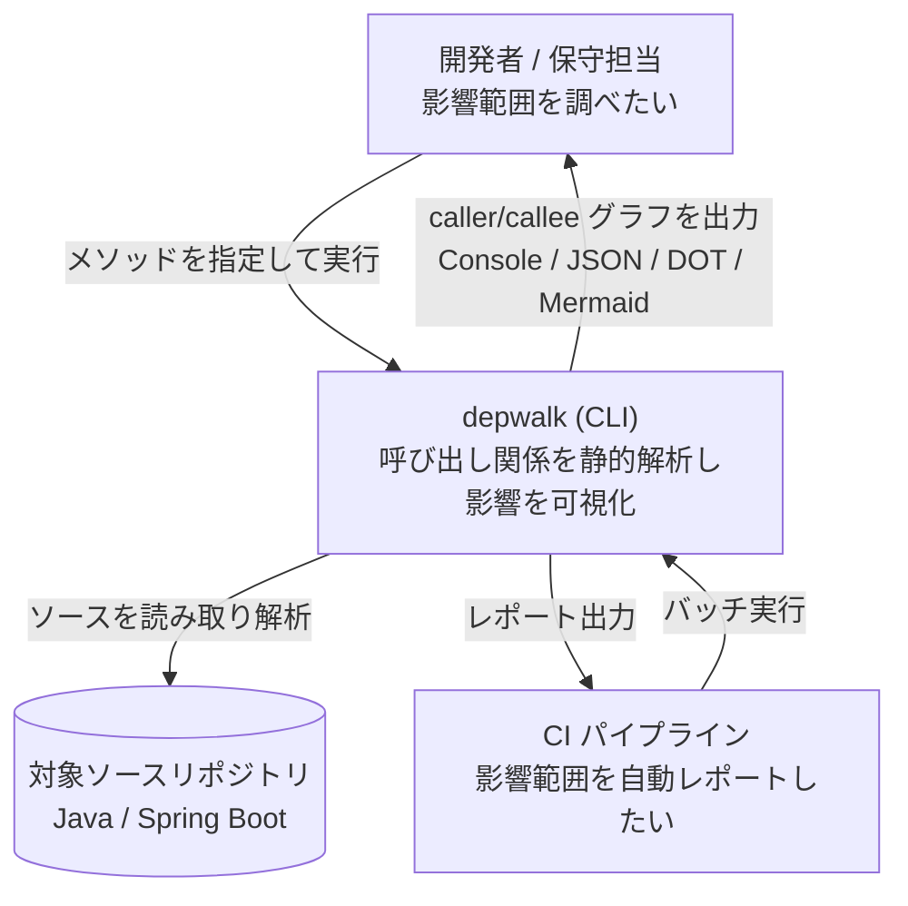
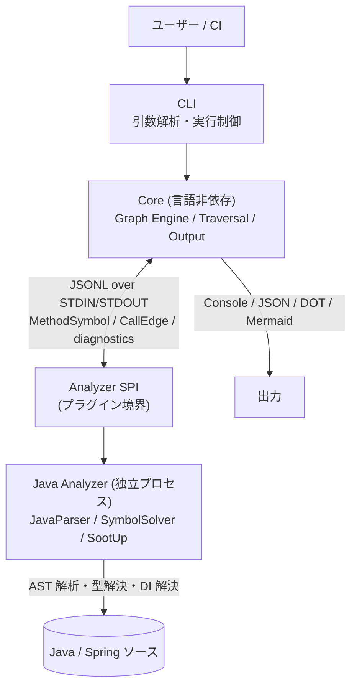
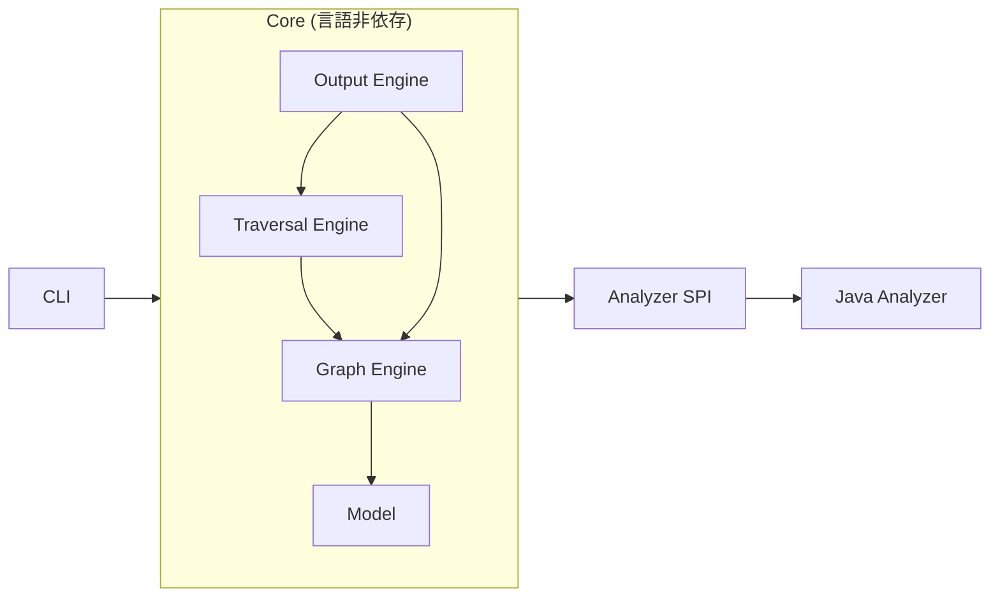

# depwalk Design Doc

> 最終更新: 2026-07-12 / Status: Draft

本 Design Doc は depwalk の **全体像 (system landscape)** を扱う。Why/What の所在 → Goal → アーキテクチャ概観 → モジュール責務の順に示し、feature 単位の詳細は [design/features/](features/)、技術規約は [context/](../context/)、個別判断は [adr/](../adr/) へ委譲する。

<!--
本 doc は統合モードで生成 (design-doc skill が判定)。独立 PRD は作らず、Why/What は本 doc の「## Why / What」節に統合する。
図ルール: 本 doc は C4 L1 (System Context) と L2 (Container) を描く。L3 (Component) は feature doc、Sequence/Flowchart は spec が担う。
-->

## 概要 (Summary)

depwalk は、ソースコードの静的解析でメソッド間の呼び出し関係を抽出し、変更影響調査を支援する CLI ツールである。「あるメソッドを直したいが、どこから呼ばれ・どこを呼んでいるか」を手作業で追う負荷を自動化し、CI 上でも実行できる形で提供する。Phase1 は Java/Spring Boot を対象とするが、呼び出しグラフの構築・探索を担う **Core を言語非依存**に保ち、言語ごとの解析差異を独立プロセスの **Analyzer** に閉じ込めることで、将来の Kotlin / TypeScript / Vue / Go 対応を Core 変更なしに追加できるアーキテクチャを採る。

## Why / What

### 背景・課題 (Why)

大規模システム、特に業務システムでは、メソッド変更時の影響範囲調査が大きなコストになっている。

- **影響範囲調査に時間がかかる** — メソッド 1 つの改修で、呼び出し元が Controller / Batch / Facade / Test などに広く散らばり、手作業での洗い出しに時間を要する。
- **IDE の Call Hierarchy では横断調査が難しい** — IDE はファイル / モジュール単位の探索に強い一方、プロジェクト全体を横断した網羅的な呼び出し関係の抽出には向かない。
- **Spring の DI で実呼び出し先が追いづらい** — interface 経由・Bean 注入により、コード上の呼び出し先と実体が一致せず、静的に追うには DI 解決が必要。
- **CI 上で自動化できない** — IDE 依存の調査は人手前提で、プルリク時などに影響範囲を自動レポートする手段がない。

具体例として、`UserService.findById()` を修正したいとき、現状は次の作業が手動で発生する。

```text
UserService.findById() を修正したい
  ↓ どこから呼ばれているのか分からない
  ↓ Controller / Batch / Facade / Test を手作業で調査
```

depwalk はこの調査を自動化することを目的とする。

### 提供価値 / 成功条件 (What)

| #   | 成功条件                                                                         | 測定方法                                                                                                                                                                                                                                               |
| --- | -------------------------------------------------------------------------------- | ------------------------------------------------------------------------------------------------------------------------------------------------------------------------------------------------------------------------------------------------------ |
| S1  | 指定メソッドの呼び出し元を再帰的に探索し、到達する呼び出し元を網羅的に列挙できる | サンプル Java/Spring プロジェクトで、既知の呼び出し元集合と CLI 出力が一致する (Traversal Engine 層の到達集合照合は [feature doc](features/traversal/DesignDoc_traversal.md) が正本。CLI 出力レベルでの最終照合は CLI interface spec 完了後に完成する) |
| S2  | 指定メソッドの呼び出し先を探索し、列挙できる                                     | 同上 (callee 方向で既知集合と一致)                                                                                                                                                                                                                     |
| S3  | 呼び出しグラフを Console / JSON / DOT / Mermaid で出力できる                     | 各形式でパース / レンダリング可能な出力が得られる (Output Engine 層の照合は [feature doc](features/output/DesignDoc_output.md) が正本。CLI 出力レベルでの最終照合は CLI interface spec 完了後に完成する)                                               |
| S4  | Spring DI 経由の呼び出し先を実体まで解決できる (Phase2 以降)                     | interface 注入を含むサンプルで、実装クラスのメソッドが呼び出し先として現れる                                                                                                                                                                           |
| S5  | 新しい言語の Analyzer を追加するとき Core を変更せずに済む                       | **2 つ目以降**の言語 Analyzer 追加で Core モジュールに差分が発生しないこと (Protocol のみで結合)。初号機 (Java) 導入時の言語非依存な初回配線 (`depwalk analyze` command / Analyzer 起動コマンド解決) は対象外とする                                    |

### スコープ

#### やること (Phase1 起点)

- Java/Spring Boot を対象とした静的解析
- メソッドの呼び出し元 (caller) 探索 / 呼び出し先 (callee) 探索
- 呼び出しグラフの出力 (Console / JSON、続いて DOT / Mermaid)
- 言語別 Analyzer をプラグインとして追加できる Core / Protocol

#### やらないこと

- Runtime Trace / APM などの実行時計測
- Reflection 解析 / AspectJ Runtime 解析 / 実行時 Proxy 解析
- IDE Plugin / Web UI の提供 (本ツールは CLI に限定する)

## Goal

| #   | ゴール                                       | 提供イメージ                                                                                        |
| --- | -------------------------------------------- | --------------------------------------------------------------------------------------------------- |
| G1  | 特定メソッドの呼び出し元を再帰的に探索できる | `UserService.findById` ← `UserController.getUser` / `AdminController.getUser` / `UserBatch.execute` |
| G2  | 特定メソッドの呼び出し先を探索できる         | `UserController.getUser` → `UserService.findById` / `UserMapper.toResponse` / `AuditService.record` |
| G3  | 呼び出しグラフを出力できる                   | 出力形式: Console / JSON / DOT / Mermaid                                                            |
| G4  | 言語ごとの解析実装を追加できる               | 将来対象: Java / Kotlin / TypeScript / Vue / Go                                                     |

## Non Goals

Phase1 では以下を対象外とする。

- 実行時計測系: Runtime Trace、APM
- 動的解析系: Reflection 解析、AspectJ Runtime 解析、実行時 Proxy 解析
- 提供形態: IDE Plugin、Web UI

本ツールは **CLI に限定**する。グラフの可視化は出力形式 (DOT / Mermaid) の生成までを担い、ビューワ自体は提供しない。

## Background

### 背景

業務システムの保守では、改修対象メソッドの影響範囲調査が頻発する。呼び出し関係はコードベース全体に散在し、IDE の Call Hierarchy や grep では網羅性・再帰性・DI 解決のいずれかが欠ける。結果として調査は人手・属人的になり、CI への組み込みもできていない。depwalk はこの調査を静的解析で自動化し、CLI として CI に組み込める形で提供する。

### 設計上の前提

- 解析は **静的解析**で行う (実行時情報には依存しない)。
- 対象は **JVM 言語を先行**し、Phase1 で Java/Spring Boot を扱う。Kotlin / TypeScript / Vue / Go は将来対象。
- 言語ごとの解析は、その言語のランタイム上で動く **独立した Analyzer プロセス**が担う。Core は特定言語ランタイムに依存しない。
- Core と Analyzer は、共通データモデル (`MethodSymbol` / `CallEdge`) と Protocol diagnostics (`diagnostic` / `error`) のみを介して結合する。

## アーキテクチャ概観 (Overview)

システムの全体像を **C4 で 2 段** 示す。詳細コンポーネントは feature doc、内部シーケンスは spec へ委譲する。

### System Context (C4 L1) — 誰が・何のために使うか



### Container (C4 L2) — 主要な実行単位とデータの流れ

Core と Analyzer は **別プロセス**であり、STDIN/STDOUT 上の JSONL で通信する。Core は Analyzer の内部 (使用ライブラリ・言語ランタイム) を知らない。



## モジュール責務

各モジュールの責務・境界を示す。Core は呼び出しグラフの構築・探索・出力に責務を限定し、解析処理は一切持たない。言語ごとの差異は Analyzer に閉じ込める。

| モジュール       | 責務                                                                                           | 公開境界           | 依存先                                |
| ---------------- | ---------------------------------------------------------------------------------------------- | ------------------ | ------------------------------------- |
| CLI              | 引数解析、実行制御、Core 呼び出し                                                              | コマンドライン I/F | Core                                  |
| Graph Engine     | Node 管理 / Edge 管理 / Graph 生成                                                             | グラフ構造 API     | Model                                 |
| Traversal Engine | Caller 探索 / Callee 探索 (BFS / DFS)                                                          | 探索 API           | Graph Engine                          |
| Output Engine    | Console / JSON / DOT / Mermaid への出力                                                        | 出力 API           | Graph Engine, Traversal Engine, Model |
| Model            | `MethodSymbol` / `CallEdge` / `SourceLocation` の定義 (Analyzer 出力の共通データモデル)        | データ型           | なし                                  |
| Analyzer SPI     | Analyzer をプラグインとして扱う境界。Core は graph model と diagnostics を Protocol 経由で受領 | Protocol (JSONL)   | Model                                 |
| Java Analyzer    | Java/Spring の AST 解析・型解決・DI 解決・CallGraph 生成                                       | Analyzer SPI 実装  | JavaParser / SymbolSolver / SootUp    |



### 設計原則 (Design Principles)

| #   | 原則                                    | 内容                                                                                                                   | 狙い                    |
| --- | --------------------------------------- | ---------------------------------------------------------------------------------------------------------------------- | ----------------------- |
| P1  | Core は言語非依存                       | 呼び出しグラフの構築・探索・出力は言語によらない。言語差は Analyzer へ閉じ込める                                       | マルチ言語化の容易さ    |
| P2  | Analyzer は独立プロセス                 | Core から各言語ランタイムへの依存を避ける (Java→JVM、TypeScript→Node.js、Go→Go)                                        | ランタイム混在の回避    |
| P3  | Analyzer は共通 Protocol を実装         | Core は Analyzer 内部を知らず、受け取るのは graph model と diagnostics のみ                                            | 結合点の最小化          |
| P4  | Core は Analyzer をプラグインとして扱う | Analyzer 追加時に Core 変更を不要とする (2 つ目以降の Analyzer 追加が対象。初号機導入時の言語非依存な初回配線は対象外) | 拡張時の変更局所化 (S5) |

## Communication Protocol

Analyzer との通信は **プロセス間通信**を用いる。

- **形式**: STDIN / STDOUT 上の **JSONL** (1 行 1 レコード)。Core が解析要求を渡し、Analyzer が graph model (`MethodSymbol` / `CallEdge`) と diagnostics (`diagnostic` / `error`) を JSONL で返す。
- **採用理由**: 言語非依存 (どの言語ランタイムからも実装可能) / 実装容易 / デバッグ容易 (テキストで観測可能) / 拡張容易 (新フィールド追加が容易)。

`MethodSymbol` / `CallEdge` / `SourceLocation` の具体スキーマ、Analyzer SPI、versioning 方針は [Analyzer Protocol / SPI feature doc](features/analyzer-protocol/DesignDoc_analyzer-protocol.md) を正本とする。JSONL over STDIN/STDOUT を process SPI とする判断は [ADR-0001](../adr/0001-analyzer-protocol-jsonl-spi.md) を正本とする。

## Alternatives Considered

統合モードのため、landscape に影響する代替案を本 doc に保持する。
確定した長期判断は [adr/](../adr/) を正本とする。

| 案  | 内容                                | メリット                  | デメリット                                 | 判定   |
| --- | ----------------------------------- | ------------------------- | ------------------------------------------ | ------ |
| A1  | Core を Kotlin で実装               | Analyzer (JVM) 統合が容易 | CLI 配布が重い / マルチ言語化しづらい      | 不採用 |
| A2  | Analyzer をライブラリとして組み込む | 高速 (プロセス間通信なし) | 言語ごとのランタイム依存が Core に混在する | 不採用 |
| A3  | Core + Analyzer を同一プロセス化    | 実装が単純                | 将来の TypeScript / Vue 対応が困難         | 不採用 |

いずれも「Core を言語非依存に保ち、Analyzer を独立プロセス + 共通 Protocol で結合する」(P1〜P4) という方針を優先して不採用とした。
Core 実装基盤は [ADR-0002](../adr/0002-core-implementation-foundation.md) で Go / Go modules / Go 標準 command を採用済み。

## 詳細の所在 (委譲先)

landscape より下の詳細は以下を正本とする。本 doc には重複させず、抜けと意図的委譲を区別するためリンクのみ置く。

### Feature 設計 (How: feature)

feature 単位の設計 (データ構造・主要シナリオ / フロー) は [design/features/](features/) を正本とする。

| Feature                              | 文書                                                                                        | 状態                               |
| ------------------------------------ | ------------------------------------------------------------------------------------------- | ---------------------------------- |
| Caller / Callee 探索                 | [DesignDoc_traversal.md](features/traversal/DesignDoc_traversal.md)                         | 完了                               |
| 呼び出しグラフのデータモデル (Graph) | [DesignDoc_graph.md](features/graph/DesignDoc_graph.md)                                     | 完了                               |
| 出力形式 (Console/JSON/DOT/Mermaid)  | [DesignDoc_output.md](features/output/DesignDoc_output.md)                                  | 完了 (DOT / Mermaid 実装は Phase4) |
| Analyzer Protocol / SPI              | [DesignDoc_analyzer-protocol.md](features/analyzer-protocol/DesignDoc_analyzer-protocol.md) | 完了                               |
| Java Analyzer                        | [DesignDoc_java-analyzer.md](features/java-analyzer/DesignDoc_java-analyzer.md)             | 完了                               |

### Engineering Context (How: 横断規約)

技術スタック規約・codebase architecture・運用契約は [context/](../context/) ライブラリを正本とする。プロジェクト固有値は [context/project.md](../context/project.md)。

| トピック                     | 文書                                                  |
| ---------------------------- | ----------------------------------------------------- |
| package / runtime / 言語境界 | [context/architecture.md](../context/architecture.md) |
| toolchain・build             | [context/toolchain.md](../context/toolchain.md)       |
| quality gate                 | [context/engineering.md](../context/engineering.md)   |
| test 方針                    | [context/testing.md](../context/testing.md)           |

### Related ADRs / 代替案 (Why: 判断)

確定した技術判断・却下した代替案は [adr/](../adr/) を正本とする。本 doc では一覧のみ持つ。

| ADR                                                       | 決定                                                         | 関連ドキュメント                                                                                       |
| --------------------------------------------------------- | ------------------------------------------------------------ | ------------------------------------------------------------------------------------------------------ |
| [ADR-0001](../adr/0001-analyzer-protocol-jsonl-spi.md)    | Core 言語非依存 + Analyzer 独立プロセス / JSONL process SPI  | 本 doc「設計原則」「Communication Protocol」                                                           |
| [ADR-0002](../adr/0002-core-implementation-foundation.md) | Core 実装基盤として Go / Go modules / Go 標準 command を採用 | [context/toolchain.md](../context/toolchain.md), [context/architecture.md](../context/architecture.md) |

## Open Questions / Future Work

### Future Work (Rollout Plan)

Phase は段階的に提供範囲を広げる。各 Phase の完了条件は spec で確定する。

| Phase              | 提供 / 追加                                                                                                                                                                     | 主技術                              |
| ------------------ | ------------------------------------------------------------------------------------------------------------------------------------------------------------------------------- | ----------------------------------- |
| Phase1             | Caller 探索 / Callee 探索 / JSON 出力                                                                                                                                           | JavaParser ベース                   |
| 後続 feature (#21) | 型階層補完 (SootUp) → Spring 絞り込みの順で Interface Dispatch / Override 解決と Spring Bean / DI 解決を実装 ([ADR-0005](../adr/0005-adopt-sootup-and-spring-di-resolution.md)) | SootUp + SymbolSolver + Spring 解析 |
| Phase4             | グラフ出力 (DOT / Mermaid)                                                                                                                                                      | Output Engine 拡張                  |
| Phase5             | Multi Language (Kotlin / TypeScript / Vue / Go)                                                                                                                                 | 言語別 Analyzer 追加                |

### Open Questions (未決事項)

| #   | 論点                                                                  | 決定者   | 期限                   | 状態                                                                                                                                                                                                                                                      |
| --- | --------------------------------------------------------------------- | -------- | ---------------------- | --------------------------------------------------------------------------------------------------------------------------------------------------------------------------------------------------------------------------------------------------------- |
| Q1  | `MethodSymbol` / `CallEdge` / `SourceLocation` の JSONL スキーマ定義  | Fukuemon | Phase1 設計時          | 解決済み ([feature doc](features/analyzer-protocol/DesignDoc_analyzer-protocol.md) / [ADR-0001](../adr/0001-analyzer-protocol-jsonl-spi.md))                                                                                                              |
| Q2  | SootUp 統合範囲 (どこまで Interface Dispatch / Override を解決するか) | Fukuemon | #21 spec の clarify 前 | 決定 (2026-07-12): 型階層・override・interface 実装候補の索引のみ (call graph 生成は委譲しない)。決定経緯は [spec #21 D1](../specs/21-java-dispatch-spring-di/index.md#解決済みの論点) / [feature doc](features/java-analyzer/DesignDoc_java-analyzer.md) |
| Q3  | Console 出力のツリー表現フォーマット (深さ表示・循環参照の扱い)       | Fukuemon | Phase1 設計時          | 解決済み ([feature doc](features/output/DesignDoc_output.md) / [spec #7](../specs/7-output/))                                                                                                                                                             |
| Q4  | 循環呼び出し・再帰の探索打ち切り条件 (深さ上限 / 訪問済み管理)        | Fukuemon | Phase1 設計時          | 解決済み ([feature doc](features/traversal/DesignDoc_traversal.md) / [spec #6](../specs/6-traversal/))                                                                                                                                                    |
