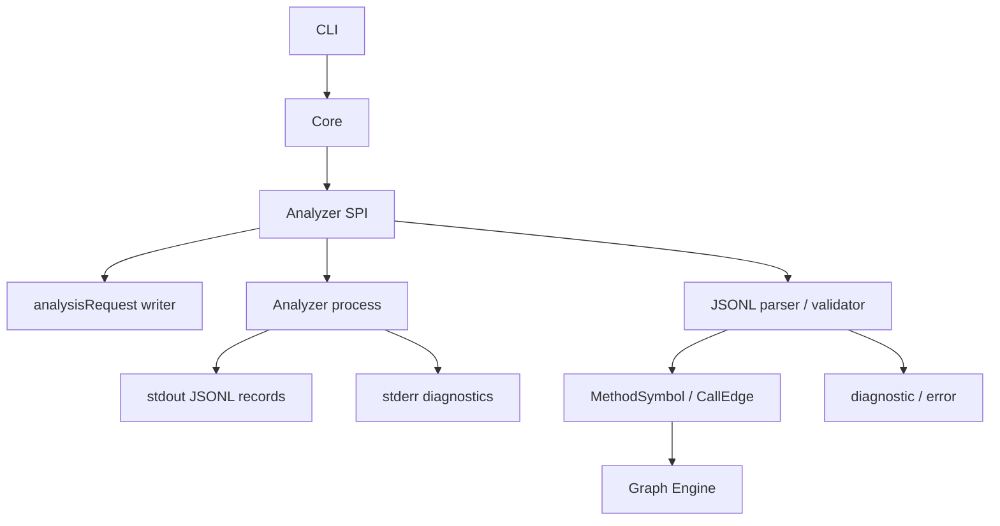
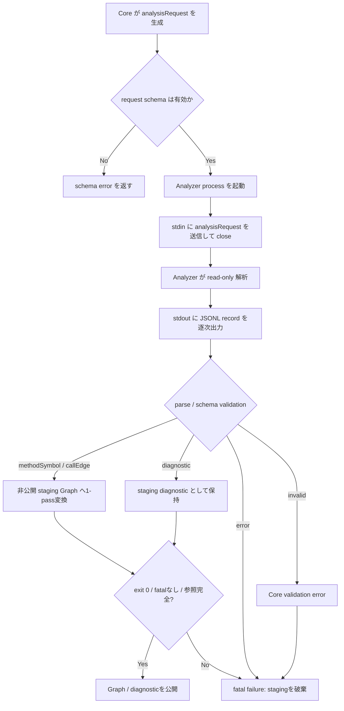

# Feature 設計: Analyzer Protocol / SPI

Analyzer SPI、JSONL Communication Protocol、Model schema の 設計を定める。Protocol / SPI / Model は本 doc が定める。

## 背景・要件解釈

depwalk は Core を言語非依存に保ち、言語ごとの差異を独立プロセスの Analyzer に閉じ込める。Analyzer Protocol / SPI は Core と Analyzer の唯一の結合点であり、`MethodSymbol` / `CallEdge` / `SourceLocation`、`diagnostic` / `error`、および process contract を定義する。

本 feature は Design Doc の成功条件 S5「新しい言語の Analyzer を追加するとき Core を変更せずに済む」を満たすため、Analyzer 実装者が準拠すべき共通契約を提供する。

## スコープ

### やること

- Core から Analyzer へ渡す `analysisRequest` record を定義する。
- Analyzer から Core へ返す `methodSymbol` / `callEdge` / `diagnostic` / `error` record を定義する。
- `SourceLocation` value object、`methodId` / `edgeId` の安定性、`metadata` の扱いを定義する。
- Analyzer process の起動、stdin / stdout / stderr、exit code の契約を定義する。
- `schemaVersion`、未知 field、breaking change の互換性方針を定義する。
- Protocol contract test で何を確かめるかを定義する。

### やらないこと

- Java 固有の AST 解析、型解決、DI 解決の方式は定義しない。
- Graph Engine、Traversal Engine、Output Engine の内部構造は定義しない。
- 出力表現は定義しない (定めるのは [output feature doc](../output/DesignDoc_output.md))。
- Core 実装言語、package manager、test framework は定義しない。
- Reflection、AspectJ Runtime、実行時 Proxy の動的解析は扱わない。

## 設計

### データ構造 / コンテンツモデル

Protocol は STDIN / STDOUT 上の JSONL とし、1 行を 1 record として扱う。全 record は `schemaVersion` と `recordType` を必須 field に持つ。現行の `schemaVersion` は `"1"`。

#### Core -> Analyzer

`analysisRequest` は Core が Analyzer process 起動後に stdin へ 1 件だけ送信する解析要求である。送信後、Core は stdin を close する。

| field           | 必須/任意 | 説明                                                                                |
| --------------- | --------- | ----------------------------------------------------------------------------------- |
| `schemaVersion` | 必須      | Protocol version。現行は `"1"`                                                      |
| `recordType`    | 必須      | `analysisRequest`                                                                   |
| `requestId`     | 必須      | 解析要求を識別する ID                                                               |
| `workspaceRoot` | 必須      | 解析対象 repository root                                                            |
| `language`      | 必須      | 対象言語。現行は `java` のみ                                                        |
| `sourceRoots`   | 任意      | `workspaceRoot` からの相対 source root 配列。指定時は Analyzer discovery を置換する |
| `include`       | 任意      | `workspaceRoot` からの相対 path glob 配列                                           |
| `exclude`       | 任意      | `workspaceRoot` からの相対除外 path glob 配列                                       |
| `entrypoints`   | 任意      | 起点 method selector 配列                                                           |
| `analysisMode`  | 任意      | `fullGraph` または `reachableFromEntrypoints`。未指定時は `fullGraph`               |
| `metadata`      | 任意      | 言語固有または Analyzer 固有の hint。Core の共通処理は依存しない                    |

`include` / `exclude` は `workspaceRoot` からの相対 path glob とする。path separator は `/` に正規化し、絶対 path、空文字、`..` を含む path は schema 不準拠として扱う。対応する glob は `*`、`?`、`**` とする。

`sourceRoots` は optional な明示 override である。未指定なら Analyzer が自身の標準 discovery を行い、1 件以上指定した場合は discovery を完全に bypass する。空配列、空文字、絶対 path、`..` segment は不正とし、`.` は workspace root 自体を表す。separator は `/` に正規化する。`workspaceRoot` は `sourceRoots`、`include` / `exclude`、全 `SourceLocation` に共通する唯一の座標系であり、Protocol に module / root ID は追加しない。言語固有 metadata の必須条件や discovery の方式は各 Analyzer feature doc が定める。

`entrypoints` の各要素は method selector object とし、`qualifiedName` を必須、`signature` を任意にする。`entrypoints` が未指定または空配列の場合、Analyzer は scope 全体の call graph 生成要求として扱う。

#### Analyzer -> Core

| record         | Core 対応 | 出現条件 / 説明                                                        |
| -------------- | --------- | ---------------------------------------------------------------------- |
| `methodSymbol` | 必須      | graph node として扱う method / constructor / function が検出された場合 |
| `callEdge`     | 必須      | 解決済み caller / callee の呼び出し関係が検出された場合                |
| `diagnostic`   | 必須      | 未解決 symbol、部分解析、警告、非致命的エラーがある場合                |
| `error`        | 必須      | 致命的エラー時。出力後、Analyzer は非ゼロ終了する                      |

`Core 対応 = 必須` は Core parser / validator がその record type を実装するという意味であり、すべての解析結果にその record が 1 件以上出ることを意味しない。

#### `methodSymbol`

| field            | 必須/任意 | 説明                                                  |
| ---------------- | --------- | ----------------------------------------------------- |
| `schemaVersion`  | 必須      | Protocol version                                      |
| `recordType`     | 必須      | `methodSymbol`                                        |
| `methodId`       | 必須      | Analyzer が決定的に生成する stable ID                 |
| `language`       | 必須      | 対象言語。現行は `java` のみ                          |
| `symbolKind`     | 必須      | `method` / `constructor` / `function` / `initializer` |
| `qualifiedName`  | 必須      | 表示・debug 用の完全修飾名                            |
| `signature`      | 必須      | overload を区別できる正規化済み signature             |
| `sourceLocation` | 任意      | 定義位置。位置を持てない symbol では省略できる        |
| `metadata`       | 任意      | 言語固有情報。Core の graph 構築は依存しない          |

`methodId` は、同一 Analyzer 実装 version、同一 `analysisRequest`、同一 source content、同一 `qualifiedName` / `signature` に対して決定的に再生成できる ID とする。Analyzer version をまたぐ永続 ID は要求しない。

#### `callEdge`

| field            | 必須/任意 | 説明                                                    |
| ---------------- | --------- | ------------------------------------------------------- |
| `schemaVersion`  | 必須      | Protocol version                                        |
| `recordType`     | 必須      | `callEdge`                                              |
| `edgeId`         | 必須      | Analyzer が決定的に生成する stable ID                   |
| `callerMethodId` | 必須      | 呼び出し元の `methodSymbol.methodId`                    |
| `calleeMethodId` | 必須      | 呼び出し先の `methodSymbol.methodId`                    |
| `callSite`       | 任意      | 呼び出し式の source 位置                                |
| `metadata`       | 任意      | dispatch 種別、解析 confidence、言語固有 call kind など |

valid な `callEdge` は、`callerMethodId` と `calleeMethodId` が解決済み `methodSymbol` を参照する。未解決 symbol は `diagnostic` として表現する。

**`metadata` の Core 内保持**: 「Core の graph 構築は `metadata` に依存しない」は、Core が `metadata` の中身を解釈しないという意味であり、利用者へ透過すると決めた metadata を破棄してよいという意味ではない。解決根拠を載せる `callEdge.metadata` は、Core の `graph.Edge` / `output.EdgeView` が意味解釈しない opaque passthrough として保持する。

`methodSymbol.metadata` も `callEdge.metadata` と同じ opaque passthrough である。Core は意味を解釈せず、Graph の `Symbol.Metadata` へ nested value を含めて deep copy する。Traversal はこの追加属性を解釈・表出しない。Output は JSON の `nodes[].metadata` / `edges[].metadata` (optional、omitempty) として意味解釈なしに透過表出する で決定。表出を定めるのは [Output feature doc](../output/DesignDoc_output.md))。bytecode にだけ存在する symbol は `sourceLocation` を省略でき、source owner との対応が必要なら Analyzer 固有 metadata に保持する。具体的な graph 所有境界は [Graph feature doc](../graph/DesignDoc_graph.md) が定める。

#### `SourceLocation`

`SourceLocation` は独立 JSONL record ではなく、`methodSymbol.sourceLocation` または `callEdge.callSite` に埋め込む value object とする。

| field         | 必須/任意 | 説明                            |
| ------------- | --------- | ------------------------------- |
| `path`        | 必須      | `workspaceRoot` からの相対 path |
| `startLine`   | 必須      | 1-based の開始行                |
| `startColumn` | 任意      | 1-based の開始 column           |
| `endLine`     | 任意      | 1-based の終了行                |
| `endColumn`   | 任意      | 1-based の終了 column           |

#### `diagnostic` / `error`

`diagnostic` は継続可能な問題や部分解析情報を表す。Core は利用者へ伝播するが、`diagnostic` だけを理由に解析全体を fatal failure として扱わない。

`error` は Analyzer が解析を継続できない致命的な問題を表す。Analyzer が `error` を出力した場合、Analyzer process は非ゼロ exit code で終了する。

| record       | 必須 field                                                   | 任意 field                                      |
| ------------ | ------------------------------------------------------------ | ----------------------------------------------- |
| `diagnostic` | `schemaVersion`, `recordType`, `severity`, `code`, `message` | `sourceLocation`, `relatedMethodId`, `metadata` |
| `error`      | `schemaVersion`, `recordType`, `code`, `message`             | `sourceLocation`, `details`, `metadata`         |

`error.details` は Analyzer を問わず利用できる `FailureDetail` 配列である。各要素は `code` / `message` を必須、`sourceLocation` / opaque `metadata` を任意とし、Analyzer が定義する決定順で並べる。Core / CLI は Analyzer 固有 code を分岐せず、共通 field を汎用表示する。

valid `error` record、非ゼロ exit、stdout の parse / schema error のいずれも request-level fatal であり、それ以前に受領した graph record と diagnostic を含む全成功候補を無効にする。Core は valid graph record を非公開 staging Graph へ 1-pass 変換し、exit `0`、fatal なし、stream 全体の参照完全性を確認した場合だけ公開する。fatal 時に保持してよい解析結果は共通 `error.details` に正規化された failure detail だけである。

`diagnostic.severity` は `info` / `warning` / `partialFailure` とする。不正 JSONL、schema 不準拠、未対応 `schemaVersion` は Analyzer が表現する `error` ではなく、Core 側 validation error として扱う。

### 画面・デザイン

非該当。depwalk は CLI ツールであり、本 feature は Web UI / IDE Plugin を提供しない。

### コンポーネント構成 (C4 L3)

Core は Analyzer process を起動し、Protocol parser / validator を通じて Model と diagnostics だけを受領する。Analyzer の内部ライブラリや言語ランタイムには依存しない。

### フロー / シーケンス

### Versioning / compatibility

`schemaVersion` は record 種別ごとの個別 version ではなく、protocol 全体の version を表す。record の受信者は対応済み major version の record だけを受け付ける。未対応 major version の record を受け取った場合、受信者は schema version mismatch として解析を失敗させる。

| 変更種別            | 互換性 | 扱い                                                                                         |
| ------------------- | ------ | -------------------------------------------------------------------------------------------- |
| 任意 field の追加   | 互換   | record の受信者は未知 field を無視し、既知 field だけで処理を継続する                        |
| `metadata` 内の追加 | 互換   | record の受信者は必要な既知 field のみを採用し、Core の graph 構築は `metadata` に依存しない |
| 必須 field の追加   | 非互換 | major version bump の対象                                                                    |
| 必須 field の削除   | 非互換 | major version bump の対象                                                                    |
| field 型の変更      | 非互換 | major version bump の対象                                                                    |
| field 意味論の変更  | 非互換 | major version bump の対象                                                                    |
| record type の削除  | 非互換 | major version bump の対象                                                                    |

Handshake / capability negotiation は採用しない。

## 主要シナリオ / フロー

- Core が CLI 入力を `analysisRequest` に正規化し、Analyzer process に 1 件だけ送信する。
- Analyzer が `methodSymbol` / `callEdge` を stdout JSONL として逐次出力し、Core が逐次 parse / validate する。
- Analyzer が未解決 symbol や部分解析を `diagnostic` として出力し、Core が利用者へ観測可能に伝播する。
- Analyzer が継続不能な問題を `error` として出力し、非ゼロ exit code で終了する。
- record の受信者が未知 field を無視し、対応済み major version の既知 field だけで処理を継続する。

## テスト観点

横断規約は [context/testing.md](../../../context/testing.md) が定める。本 feature の contract test は少なくとも以下を検証する。

- valid `analysisRequest` record を Analyzer が受け取れること。
- `sourceRoots` の未指定と 1 件以上の指定を区別し、空配列、絶対 path、空文字、`..` を拒否し、`.` を許容すること。
- `include` / `exclude` が相対 path glob として扱われ、絶対 path、空文字、`..` を含む path が拒否されること。
- `entrypoints` の method selector が `qualifiedName` 必須、`signature` 任意として検証されること。
- Core が `analysisRequest` 送信後に stdin を close すること。
- Analyzer stdout の JSONL record が逐次 parse / validate されること。
- Analyzer stderr が protocol record として parse されないこと。
- exit code `0` を成功、非ゼロを fatal failure として扱うこと。
- `methodSymbol` / `callEdge` が 0 件の正常解析を success として扱えること。
- `methodId` / `edgeId` が同一条件で決定的に再生成されること。
- Analyzer が `analysisRequest` の未知 field を無視できること。
- Core が Analyzer response record の未知 field を無視できること。
- 未対応 major version の record を Core が schema version mismatch として拒否できること。
- valid `diagnostic` を Core が利用者へ伝播し、`diagnostic` だけを理由に fatal failure としないこと。
- valid `error` を Core が fatal failure として扱うこと。
- `error.details` を決定順で保持し、Core / CLI が Analyzer 固有 code に依存せず表示できること。
- fatal / 非ゼロ終了で先行 graph record と diagnostic を破棄し、成功時だけ staging Graph を公開すること。
- 未解決 symbol が `diagnostic` として表現され、未解決 callee を参照する `callEdge` が valid edge として扱われないこと。
