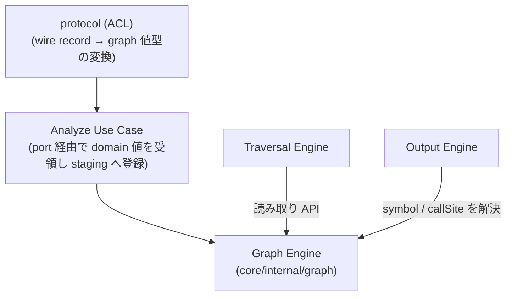
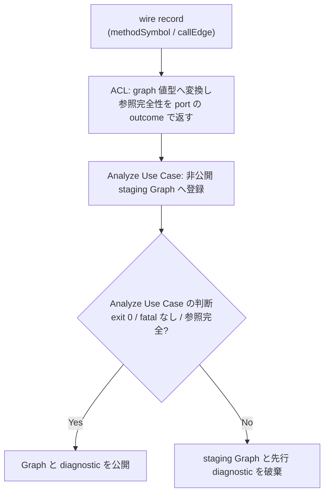

# Feature 設計: Graph (呼び出しグラフのデータモデル)

Graph Engine の設計を定める。

## 呼び出しグラフとは

**呼び出しグラフ** (call graph) は「どのメソッドがどのメソッドを呼んでいるか」を表した有向グラフである。

- **node** = メソッド 1 つ。`com.example.UserService#findById(java.lang.Long)` のような単位
- **edge** = 呼び出し 1 つ。`A --> B` は「A が B を呼んでいる」を表す

このグラフがあると「このメソッドを変更したら誰が壊れるか」に、edge を逆向きに辿るだけで機械的に答えられる。depwalk が Analyzer に解析させて構築するのがこのグラフであり、Graph Engine はその**保持と読み取り**を担う。探索そのものは [Traversal Engine](../traversal/DesignDoc_traversal.md) の責務である。

本 doc が定めるのは 2 つある。1 つは in-memory 呼び出しグラフの **node / edge が保持する属性** (`Node.Symbol` / `Edge.CallSite`) である。もう 1 つは、Analyzer Protocol の wire record (`methodSymbol` / `callEdge`) から graph 値型への変換契約である。

## 背景・要件解釈

Analyzer Protocol の `methodSymbol` は `methodId` に加えて `qualifiedName` / `signature` / `sourceLocation` を持つ。`callEdge` は `callSite` を持つ。一方、`methodId` は **Analyzer が決定的に生成する不透明な stable ID** であり、人間可読な名前である保証はない。

- [analyzer-protocol feature doc](../analyzer-protocol/DesignDoc_analyzer-protocol.md) の データ構造 / コンテンツモデル — `methodSymbol` / `callEdge` が持つ field を定める

Output Engine (Console / JSON) がメソッド名・宣言位置・呼び出し箇所を表示するには、これらの属性を graph 側が保持している必要がある。graph model は Output 専用ではなく Traversal も読む**横断データモデル**であるため、その属性契約は本 doc が定める。

## スコープ

### やること

- graph の node / edge が保持する表示用属性 (`Node.Symbol` / `Edge.CallSite`) を定義する。
- Protocol の wire record から graph 値型への変換契約 (変換位置・回数・wire 専用フィールドの除外) を定義する。

### やらないこと

- `MethodSymbol` / `CallEdge` / `SourceLocation` の wire schema は再定義しない。analyzer-protocol feature doc と ADR-0001 が定める。
- 探索の意味論。traversal feature doc が定める。
- 出力形式ごとの表示規則。
  - [output feature doc](../output/DesignDoc_output.md) の 出力形式ごとの表示規則 — 表示規則と View への変換契約を定める

## 設計

### データ構造 / コンテンツモデル

graph は node / edge の ID に加えて、表示に必要な属性を **graph 固有の値型**として保持する。

```go
// core/internal/graph
type Node struct {
    ID     string // Analyzer の methodId (不透明な stable ID)
    Symbol Symbol
}

type Symbol struct {
    QualifiedName string
    Signature     string
    Source        *SourceLocation // 宣言位置 (optional。graph 固有の値型)
    Metadata      map[string]any  // Analyzer 固有情報 (opaque, optional)
}

type Edge struct {
    ID       string
    CallerID string
    CalleeID string
    CallSite *SourceLocation // 呼び出し箇所 (optional。graph 固有の値型)
    Metadata map[string]any  // Analyzer 固有情報 (opaque, optional)
}
```

- **変換は 1 回だけ**行う。`protocol.MethodSymbol` / `protocol.CallEdge` (wire record) → 上記値型への写しは ACL (`protocol`。app が定義する port の実装側) が担い、以後 Core 内で wire record を持ち回らない。
- **wire 専用フィールド (`schemaVersion` / `recordType`) は graph model に持ち込まない**。graph が wire 表現に結合すると、Protocol の版更新が Core 内部モデルへ波及するため。
- `SourceLocation` は graph package が自前の値型として定義し、`protocol` package の型を再利用しない。domain 層から wire 表現への import をゼロにするためであり、wire 型との重複定義は境界隔離のコストとして受け入れる。
  - [ADR-0007](../../../adr/0007-layered-architecture-refactor.md) の wire 変換層 (ACL) と port — domain 層が wire 表現を import しない境界を定める
- `sourceLocation` / `callSite` は Protocol 上 optional であり、graph でも nil を許容する。表示時の省略規則は consumer (output feature doc) が定める。
- `methodSymbol.metadata` / `callEdge.metadata` は Graph が所有する opaque 属性 (`Symbol.Metadata` / `Edge.Metadata`) として、nested map / array を含め deep copy する。
  - Graph と Traversal は値の意味を解釈しない。
  - **metadata を持たない record は nil、明示的に空オブジェクトを持つ record は空 map** として区別して保持する。この差は JSON 出力に現れる。
  - JSON 出力へは opaque なまま透過表出する。表出の規則は output feature doc が定める。console などそれ以外の出力表現には自動で表出しない。
  - bytecode-only symbol のように `sourceLocation` がない node も有効とする。owner の source anchor は metadata が持ち、`sourceLocation` とは混同しない。

### 構築と公開の原子性

Analyze Use Case は、ACL が graph 値型へ変換した valid な `methodSymbol` / `callEdge` を受領順に、request 専用の **非公開 staging Graph** へ登録する。wire DTO 全件や Analyzer 側の全 graph を別途 buffer しない。staging Graph と diagnostic を公開するのは、Analyzer が exit `0` で終了し、fatal record がなく、stream 全体で全 edge の caller / callee 参照が揃った場合だけである。

検査と公開判断の担当は分かれる。stream の **参照完全性検査は ACL (`protocol`)** が行う。wire record を見る責務であり、結果は port の outcome として返す。その結果と process 状態から **公開するかどうかを決めるのは Analyze Use Case** である。この分担は ADR-0007 が定める。

valid `error`、非ゼロ exit、stdout の parse / schema error の場合は参照完全性の成立を要求せず、staging Graph と先行 diagnostic をすべて破棄する。Graph Engine の公開 API から request の部分結果は観測できない。

### 画面・デザイン

非該当。depwalk は CLI ツールであり、本 feature は Web UI / IDE Plugin を提供しない。

### コンポーネント構成 (C4 L3)



### フロー / シーケンス

構築は「wire record の受領 → 値型への変換 → 非公開 staging Graph への登録」の 1 パスで行う。公開するのは、process 成功と参照完全性を確認した後だけである。詳細な protocol 検証は analyzer-protocol feature doc、探索と出力は各 feature doc が持つ。



## 主要シナリオ / フロー

- Analyze Use Case は Analyzer からの `methodSymbol` / `callEdge` record を受領し、graph 値型 (`Node` + `Symbol` / `Edge` + `CallSite`) へ変換して非公開 staging Graph に登録する。成功時だけ公開し、fatal 時は破棄する。
- Traversal Engine は Graph の読み取り API で node / edge の接続関係のみを参照する (symbol 属性には依存しない)。
- Output Engine は Graph の読み取り API で `Symbol` / `CallSite` を解決し、各形式の表示に用いる。

## テスト観点

- 横断規約は [context/testing.md](../../../context/testing.md)。本 feature 固有の観点を記す。
- wire record の `qualifiedName` / `signature` / `sourceLocation` / `metadata` / `callSite` が変換後の graph 値型に保持され、nested metadata が deep copy されること。
- `sourceLocation` / `callSite` が欠落した record からも graph を構築できること (nil 許容)。
- graph model に `schemaVersion` / `recordType` が現れないこと。
- valid record が非公開 staging Graph へ逐次登録され、wire DTO 全件を保持しないこと。
- success 時だけ staging Graph が公開され、fatal / 非ゼロ exit 時は先行 diagnostic とともに破棄されること。
- 正常 stream では参照完全性を検証し、fatal stream では未完参照を別の failure にしないこと。

## 関連ドキュメント

- [traversal feature doc](../traversal/DesignDoc_traversal.md): 探索の意味論と深さ・訪問順・結果構造の契約
- [output feature doc](../output/DesignDoc_output.md): 出力形式ごとの表示規則と View への変換契約
- [analyzer-protocol feature doc](../analyzer-protocol/DesignDoc_analyzer-protocol.md): wire schema (`methodSymbol` / `callEdge`) と SPI
- [context/testing.md](../../../context/testing.md): test の責務分担
- [ADR-0007](../../../adr/0007-layered-architecture-refactor.md): 依存境界を ACL と機械検査で固定した決定
