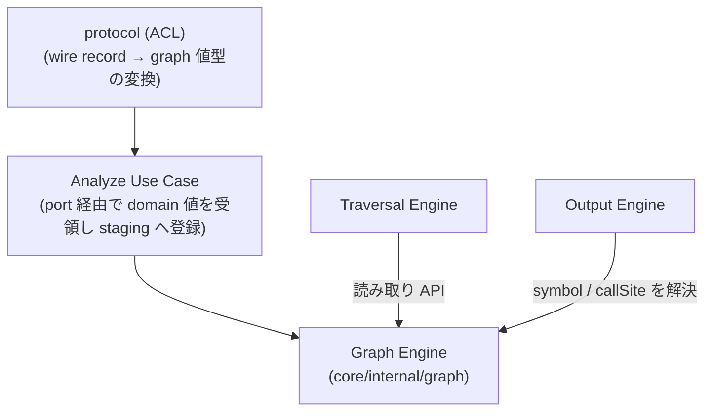

# Feature 設計: Graph (呼び出しグラフのデータモデル)

> 最終更新: 2026-07-24 / Status: 完了 ([issue #32](https://github.com/Fukuemon/depwalk/issues/32) で SourceLocation を domain 自前型へ改訂し、変換の所在を platform 層 ACL へ移動)

Graph Engine の durable な feature 設計正本。Analyzer Protocol の wire record (`methodSymbol` / `callEdge`) から構築される in-memory 呼び出しグラフの **node / edge が保持する属性**と、wire record → graph 値型の変換契約を定義する。本 doc は graph データモデル (`Node.Symbol` / `Edge.CallSite`) の正本であり、決定経緯は [issue #7](https://github.com/Fukuemon/depwalk/issues/7) と関連 PR を参照する。

## メタ

| 項目           | 値                                                                                                                                                                                                                                                                                      |
| -------------- | --------------------------------------------------------------------------------------------------------------------------------------------------------------------------------------------------------------------------------------------------------------------------------------- |
| 関連 PRD 要求  | 統合モードのため [DesignDoc の Why / What](../../DesignDoc.md#提供価値--成功条件-what)                                                                                                                                                                                                  |
| 関連 DesignDoc | [モジュール責務 Graph Engine / Model](../../DesignDoc.md#モジュール責務)、[成功条件 S3](../../DesignDoc.md#提供価値--成功条件-what)                                                                                                                                                     |
| 関連 context   | [architecture](../../../context/architecture.md) (Package Boundary)                                                                                                                                                                                                                     |
| 関連 ADR       | [ADR-0001](../../../adr/0001-analyzer-protocol-jsonl-spi.md)、[ADR-0002](../../../adr/0002-core-implementation-foundation.md)                                                                                                                                                           |
| 関連 issue     | [#7](https://github.com/Fukuemon/depwalk/issues/7)、[#6](https://github.com/Fukuemon/depwalk/issues/6) (読み取り API の consumer)、[#24](https://github.com/Fukuemon/depwalk/issues/24)、[#32](https://github.com/Fukuemon/depwalk/issues/32) (SourceLocation 自前型化・変換所在の改訂) |
| 対象モジュール | `core` (`core/internal/graph`。層構造の正本は [architecture.md](../../../context/architecture.md))                                                                                                                                                                                      |

## 背景・要件解釈

Analyzer Protocol の `methodSymbol` は `methodId` に加えて `qualifiedName` / `signature` / `sourceLocation` を持ち、`callEdge` は `callSite` を持つ ([analyzer-protocol feature doc](../analyzer-protocol/DesignDoc_analyzer-protocol.md) が正本)。一方、`methodId` は **Analyzer が決定的に生成する不透明な stable ID** であり、人間可読な名前である保証はない。

Output Engine (Console / JSON / DOT / Mermaid) がメソッド名・宣言位置・呼び出し箇所を表示するには、これらの属性を graph 側が保持している必要がある。graph model は Output 専用ではなく Traversal も読む**横断データモデル**であるため、その属性契約を本 doc が正本として定義する (置き場所の判断経緯は [issue #7](https://github.com/Fukuemon/depwalk/issues/7))。

## スコープ

### やること

- graph の node / edge が保持する表示用属性 (`Node.Symbol` / `Edge.CallSite`) を定義する。
- Protocol の wire record から graph 値型への変換契約 (変換位置・回数・wire 専用フィールドの除外) を定義する。

### やらないこと

- `MethodSymbol` / `CallEdge` / `SourceLocation` の wire schema の再定義 (正本は analyzer-protocol feature doc / ADR-0001)。
- 探索の意味論 (正本は [traversal feature doc](../traversal/DesignDoc_traversal.md))。
- 出力形式ごとの表示規則 (正本は [output feature doc](../output/DesignDoc_output.md))。

## 設計

### データ構造 / コンテンツモデル

graph は node / edge の ID に加えて、表示に必要な属性を **graph 固有の値型**として保持する。

```go
// core/internal/graph
type Node struct {
    ID     string // Analyzer の methodId (不透明な stable ID)
    Symbol Symbol
}

type Symbol struct {
    QualifiedName string
    Signature     string
    Source        *SourceLocation // 宣言位置 (optional。graph 固有の値型)
    Metadata      map[string]any  // Analyzer 固有情報 (opaque, optional)
}

type Edge struct {
    ID       string
    CallerID string
    CalleeID string
    CallSite *SourceLocation // 呼び出し箇所 (optional。graph 固有の値型)
    Metadata map[string]any  // Analyzer 固有情報 (opaque, optional)
}
```

- **変換は 1 回だけ**行う。`protocol.MethodSymbol` / `protocol.CallEdge` (wire record) → 上記値型への写しは ACL (`protocol`。app が定義する port の実装側) が担い、以後 Core 内で wire record を持ち回らない (変換の所在は [issue #32](https://github.com/Fukuemon/depwalk/issues/32) で Analyze Use Case 層から platform 層へ改訂)。
- **wire 専用フィールド (`schemaVersion` / `recordType`) は graph model に持ち込まない**。graph が wire 表現に結合すると、Protocol の版更新が Core 内部モデルへ波及するため。
- `SourceLocation` は graph package が自前の値型として定義し、`protocol` package の型を再利用しない (2026-07-24 改訂。旧決定は protocol 型の再利用だったが、domain 層から wire 表現への import をゼロにする層規約 [ADR-0007](../../../adr/0007-layered-architecture-refactor.md) に伴い改訂。wire 型との重複定義は境界隔離のコストとして許容する。決定経緯は [issue #32](https://github.com/Fukuemon/depwalk/issues/32))。
- `sourceLocation` / `callSite` は Protocol 上 optional であり、graph でも nil を許容する。表示時の省略規則は consumer (output feature doc) が定める。
- `methodSymbol.metadata` / `callEdge.metadata` は Graph が所有する opaque 属性として nested map / array を含め deep copy する (`Symbol.Metadata` / `Edge.Metadata`)。Graph / Traversal は値の意味を解釈しない。JSON 出力へは opaque なまま透過表出する (表出の正本は [output feature doc](../output/DesignDoc_output.md)。[issue #22](https://github.com/Fukuemon/depwalk/issues/22) で決定)。console 等それ以外の既存出力表現には自動では表出しない。bytecode-only symbol のように `sourceLocation` がない node も有効であり、owner の source anchor は metadata と sourceLocation を混同しない。

### 構築と公開の原子性

Analyze Use Case は valid な `methodSymbol` / `callEdge` を受領順に (ACL が graph 値型へ変換したものを) request 専用の **非公開 staging Graph** へ登録する。wire DTO 全件や Analyzer 側の全 graph を別途 buffer しない。Analyzer が exit `0` で終了し、fatal record がなく、stream 全体で全 edge の caller / callee 参照が揃った場合だけ staging Graph と diagnostic を公開する。

valid `error`、非ゼロ exit、stdout の parse / schema error の場合は参照完全性の成立を要求せず、staging Graph と先行 diagnostic をすべて破棄する。Graph Engine の公開 API から request の部分結果は観測できない。

### 画面・デザイン

非該当。depwalk は CLI ツールであり、本 feature は Web UI / IDE Plugin を提供しない。

### コンポーネント構成 (C4 L3)



### フロー / シーケンス

構築は「wire record の受領 → 値型への変換 → 非公開 staging Graph への登録」の 1 パスで行い、process 成功と参照完全性の確認後にだけ公開する。詳細な protocol 検証は analyzer-protocol feature doc、探索・出力は各 feature doc へ委譲する。

## 主要シナリオ / フロー

- Analyze Use Case は Analyzer からの `methodSymbol` / `callEdge` record を受領し、graph 値型 (`Node` + `Symbol` / `Edge` + `CallSite`) へ変換して非公開 staging Graph に登録する。成功時だけ公開し、fatal 時は破棄する。
- Traversal Engine は Graph の読み取り API で node / edge の接続関係のみを参照する (symbol 属性には依存しない)。
- Output Engine は Graph の読み取り API で `Symbol` / `CallSite` を解決し、各形式の表示に用いる。

## テスト観点

- 横断規約は [context/testing.md](../../../context/testing.md)。本 feature 固有の観点を記す。
- wire record の `qualifiedName` / `signature` / `sourceLocation` / `metadata` / `callSite` が変換後の graph 値型に保持され、nested metadata が deep copy されること。
- `sourceLocation` / `callSite` が欠落した record からも graph を構築できること (nil 許容)。
- graph model に `schemaVersion` / `recordType` が現れないこと。
- valid record が非公開 staging Graph へ逐次登録され、wire DTO 全件を保持しないこと。
- success 時だけ staging Graph が公開され、fatal / 非ゼロ exit 時は先行 diagnostic とともに破棄されること。
- 正常 stream では参照完全性を検証し、fatal stream では未完参照を別の failure にしないこと。

## 上位資料からの変更点

| 対象資料                                                   | 変更種別 (継承 / 追記 / 変更提案) | 内容                                                                                                                                                                                                             |
| ---------------------------------------------------------- | --------------------------------- | ---------------------------------------------------------------------------------------------------------------------------------------------------------------------------------------------------------------- |
| PRD                                                        | 継承                              | 統合モードのため DesignDoc の Why / What を参照                                                                                                                                                                  |
| DesignDoc                                                  | 追記                              | feature 一覧に Graph Engine の行を追加 (本 doc を正本として参照)                                                                                                                                                 |
| context                                                    | 追記                              | `context/architecture.md` Package Boundary に、Graph Engine が表示用属性を保持し変換を構築時に行う旨を補足 (正本は本 doc)                                                                                        |
| ADR                                                        | 継承                              | ADR-0001 (Protocol/Model 境界) / ADR-0002 (Core package 境界) の範囲内。新規 ADR 不要                                                                                                                            |
| [issue #24](https://github.com/Fukuemon/depwalk/issues/24) | 追記                              | `Symbol.Metadata` の deep copy、非公開 staging Graph への1-pass変換、成功時公開、fatal時破棄、正常streamの参照完全性を反映                                                                                       |
| [issue #22](https://github.com/Fukuemon/depwalk/issues/22) | 追記                              | `Edge.Metadata` (`callEdge.metadata` の opaque 保持、Symbol 側と同じ deep copy 方針) を追加し、JSON 出力への透過表出 (正本: output feature doc) を明記                                                           |
| [issue #32](https://github.com/Fukuemon/depwalk/issues/32) | 変更 (改訂)                       | `SourceLocation` を protocol 型再利用から graph 自前型へ改訂し、wire → 値型変換の所在を Analyze Use Case 層から platform 層 ACL へ移動 (層規約は [ADR-0007](../../../adr/0007-layered-architecture-refactor.md)) |
