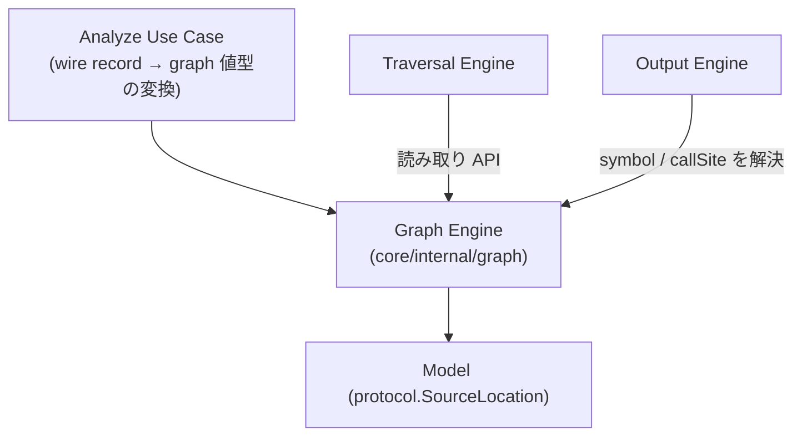

# Feature 設計: Graph (呼び出しグラフのデータモデル)

> 最終更新: 2026-07-11 / Status: 完了

Graph Engine の durable な feature 設計正本。Analyzer Protocol の wire record (`methodSymbol` / `callEdge`) から構築される in-memory 呼び出しグラフの **node / edge が保持する属性**と、wire record → graph 値型の変換契約を定義する。本 doc は graph データモデル (`Node.Symbol` / `Edge.CallSite`) の正本であり、決定経緯と issue 単位の作業記録は [spec #7](../../../specs/7-output/) (論点 D1) を参照する。

## メタ

| 項目           | 値                                                                                                                                  |
| -------------- | ----------------------------------------------------------------------------------------------------------------------------------- |
| 関連 PRD 要求  | 統合モードのため [DesignDoc の Why / What](../../DesignDoc.md#提供価値--成功条件-what)                                              |
| 関連 DesignDoc | [モジュール責務 Graph Engine / Model](../../DesignDoc.md#モジュール責務)、[成功条件 S3](../../DesignDoc.md#提供価値--成功条件-what) |
| 関連 context   | [architecture](../../../context/architecture.md) (Package Boundary)                                                                 |
| 関連 ADR       | [ADR-0001](../../../adr/0001-analyzer-protocol-jsonl-spi.md)、[ADR-0002](../../../adr/0002-core-implementation-foundation.md)       |
| 関連 spec      | [specs/7-output](../../../specs/7-output/) (D1)、[specs/6-traversal](../../../specs/6-traversal/) (読み取り API の consumer)        |
| 対象モジュール | `core` (`core/internal/graph`)                                                                                                      |

## 背景・要件解釈

Analyzer Protocol の `methodSymbol` は `methodId` に加えて `qualifiedName` / `signature` / `sourceLocation` を持ち、`callEdge` は `callSite` を持つ ([analyzer-protocol feature doc](../analyzer-protocol/DesignDoc_analyzer-protocol.md) が正本)。一方、`methodId` は **Analyzer が決定的に生成する不透明な stable ID** であり、人間可読な名前である保証はない。

Output Engine (Console / JSON / DOT / Mermaid) がメソッド名・宣言位置・呼び出し箇所を表示するには、これらの属性を graph 側が保持している必要がある。graph model は Output 専用ではなく Traversal も読む**横断データモデル**であるため、その属性契約を本 doc が正本として定義する (置き場所の判断経緯は spec #7 の track gate 記録)。

## スコープ

### やること

- graph の node / edge が保持する表示用属性 (`Node.Symbol` / `Edge.CallSite`) を定義する。
- Protocol の wire record から graph 値型への変換契約 (変換位置・回数・wire 専用フィールドの除外) を定義する。

### やらないこと

- `MethodSymbol` / `CallEdge` / `SourceLocation` の wire schema の再定義 (正本は analyzer-protocol feature doc / ADR-0001)。
- 探索の意味論 (正本は [traversal feature doc](../traversal/DesignDoc_traversal.md))。
- 出力形式ごとの表示規則 (正本は [output feature doc](../output/DesignDoc_output.md))。

## 設計

### データ構造 / コンテンツモデル

graph は node / edge の ID に加えて、表示に必要な属性を **graph 固有の値型**として保持する。

```go
// core/internal/graph
type Node struct {
    ID     string // Analyzer の methodId (不透明な stable ID)
    Symbol Symbol
}

type Symbol struct {
    QualifiedName string
    Signature     string
    Source        *protocol.SourceLocation // 宣言位置 (optional)
}

type Edge struct {
    ID       string
    CallerID string
    CalleeID string
    CallSite *protocol.SourceLocation // 呼び出し箇所 (optional)
}
```

- **変換は graph 構築時 (Analyze Use Case 層) に 1 回だけ**行う。`protocol.MethodSymbol` / `protocol.CallEdge` (wire record) → 上記値型への写しであり、以後 Core 内で wire record を持ち回らない。
- **wire 専用フィールド (`schemaVersion` / `recordType`) は graph model に持ち込まない**。graph が wire 表現に結合すると、Protocol の版更新が Core 内部モデルへ波及するため。
- `SourceLocation` は `protocol` package の型を再利用する。この型は `path` / `startLine` 等の純粋な値のみで wire 専用フィールドを持たず、依存方向も `Graph Engine → Model` の範囲内に収まる。
- `sourceLocation` / `callSite` は Protocol 上 optional であり、graph でも nil を許容する。表示時の省略規則は consumer (output feature doc) が定める。

### 画面・デザイン

非該当。depwalk は CLI ツールであり、本 feature は Web UI / IDE Plugin を提供しない。

### コンポーネント構成 (C4 L3)



### フロー / シーケンス

構築は「wire record の受領 → 値型への変換 → graph への登録」の 1 パスで行う。詳細な protocol 検証は analyzer-protocol feature doc、探索・出力は各 feature doc へ委譲する。

## 主要シナリオ / フロー

- Analyze Use Case は Analyzer からの `methodSymbol` / `callEdge` record を受領し、graph 値型 (`Node` + `Symbol` / `Edge` + `CallSite`) へ変換して Graph Engine に登録する。
- Traversal Engine は Graph の読み取り API で node / edge の接続関係のみを参照する (symbol 属性には依存しない)。
- Output Engine は Graph の読み取り API で `Symbol` / `CallSite` を解決し、各形式の表示に用いる。

## テスト観点

- 横断規約は [context/testing.md](../../../context/testing.md)。本 feature 固有の観点を記す。
- wire record の `qualifiedName` / `signature` / `sourceLocation` / `callSite` が変換後の graph 値型に保持されること。
- `sourceLocation` / `callSite` が欠落した record からも graph を構築できること (nil 許容)。
- graph model に `schemaVersion` / `recordType` が現れないこと。

## 上位資料からの変更点

| 対象資料  | 変更種別 (継承 / 追記 / 変更提案) | 内容                                                                                                                      |
| --------- | --------------------------------- | ------------------------------------------------------------------------------------------------------------------------- |
| PRD       | 継承                              | 統合モードのため DesignDoc の Why / What を参照                                                                           |
| DesignDoc | 追記                              | feature 一覧に Graph Engine の行を追加 (本 doc を正本として参照)                                                          |
| context   | 追記                              | `context/architecture.md` Package Boundary に、Graph Engine が表示用属性を保持し変換を構築時に行う旨を補足 (正本は本 doc) |
| ADR       | 継承                              | ADR-0001 (Protocol/Model 境界) / ADR-0002 (Core package 境界) の範囲内。新規 ADR 不要                                     |
