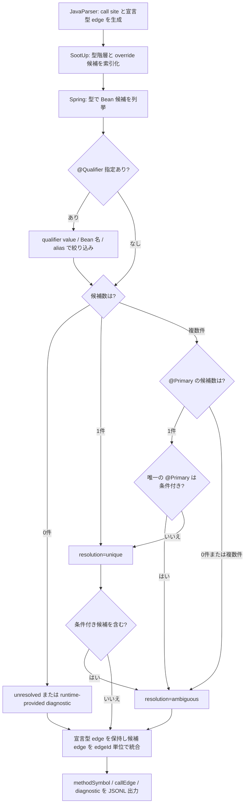

# Feature 設計: Java Analyzer

> 最終更新: 2026-07-19 / Status: 完了 (spec #24 sync で Gradle multi-project discovery、完全性 gate、生成 member 対応を更新)

Java/Spring ソースの AST 解析・型解決・CallGraph 生成を担う言語別 Analyzer の durable な feature 設計正本。本 doc が Java Analyzer 設計の正本。決定経緯と issue 単位の作業記録は [spec #9](../../../specs/9-java-analyzer/)、[spec #21](../../../specs/21-java-dispatch-spring-di/)、[spec #24](../../../specs/24-gradle-multi-module-source-roots/) を参照する。共通契約 (SPI / JSONL Protocol / Model schema) は [Analyzer Protocol / SPI feature doc](../analyzer-protocol/DesignDoc_analyzer-protocol.md) と [ADR-0001](../../../adr/0001-analyzer-protocol-jsonl-spi.md) が正本であり、本 doc は Java 固有の discovery、metadata、解析完全性を定める。

## メタ

| 項目           | 値                                                                                                                                                                                                                                                                                                                                                                                                    |
| -------------- | ----------------------------------------------------------------------------------------------------------------------------------------------------------------------------------------------------------------------------------------------------------------------------------------------------------------------------------------------------------------------------------------------------- |
| 関連 PRD 要求  | 統合モードのため [DesignDoc の Why / What](../../DesignDoc.md#提供価値--成功条件-what)                                                                                                                                                                                                                                                                                                                |
| 関連 DesignDoc | [成功条件 S1/S2/S4/S5](../../DesignDoc.md#提供価値--成功条件-what)、[モジュール責務 Java Analyzer](../../DesignDoc.md#モジュール責務)、[設計原則 P1-P4](../../DesignDoc.md#設計原則-design-principles)、[Future Work Phase1-3 / Open Questions Q2](../../DesignDoc.md#open-questions-未決事項)                                                                                                        |
| 関連 context   | [architecture](../../../context/architecture.md)、[testing](../../../context/testing.md)、[toolchain](../../../context/toolchain.md)、[engineering](../../../context/engineering.md)、[infrastructure](../../../context/infrastructure.md)                                                                                                                                                            |
| 関連 ADR       | [ADR-0001](../../../adr/0001-analyzer-protocol-jsonl-spi.md)、[ADR-0002](../../../adr/0002-core-implementation-foundation.md)、[ADR-0003](../../../adr/0003-analyzer-command-resolution.md)、[ADR-0004](../../../adr/0004-defer-runtime-call-tracing.md)、[ADR-0005](../../../adr/0005-adopt-sootup-and-spring-di-resolution.md)、[ADR-0006](../../../adr/0006-adopt-gradle-tooling-api-discovery.md) |
| 関連 spec      | [specs/9-java-analyzer](../../../specs/9-java-analyzer/)、[specs/21-java-dispatch-spring-di](../../../specs/21-java-dispatch-spring-di/)、[specs/24-gradle-multi-module-source-roots](../../../specs/24-gradle-multi-module-source-roots/)                                                                                                                                                            |
| 対象モジュール | `java-analyzer` (Core 初回配線として `core` にも一部影響)                                                                                                                                                                                                                                                                                                                                             |

## 背景・要件解釈

Phase1 の対象は Java/Spring Boot であり、Java Analyzer は `analyzer-protocol` の SPI / JSONL スキーマを実装する最初の言語別 Analyzer である。Core 側は Protocol parser / validator (`core/internal/protocol`) と Analyzer process 起動 (`core/internal/analyzer`) を実装済みで、契約の受け側は揃っている。本 feature は、その契約に対して JSONL を出力する Java 側の実装方式 (build 基盤、起動契約、型解決、正規化規則、帰属型決定、段階導入) を確定する。

本 feature が関わる成功条件は Design Doc の S1 / S2 (caller / callee 探索の網羅性 — graph の入力を供給する)、S4 (Spring DI 経由の呼び出し先解決、Phase2 以降)、S5 (2 つ目以降の言語 Analyzer 追加時に Core 無変更) である。Phase1 では JavaParser ベースの静的呼び出し抽出を達成し、DI 解決 (Phase2) と Interface Dispatch / Override 解決 (Phase3, SootUp) は段階導入とする。

## スコープ

### やること

- Java ソースの AST 解析 (JavaParser) と型解決 (SymbolSolver) による静的呼び出し抽出
- 抽出結果を `analyzer-protocol` の JSONL スキーマ (`methodSymbol` / `callEdge` / `diagnostic` / `error`) で stdout へ出力
- `analysisRequest` の受領 (stdin) と process contract (exit code / stderr) の遵守
- Java Analyzer の build / 配布形態 (Gradle + Shadow plugin、単一 fat jar)
- Core からの起動方法 (CLI flag / 環境変数による起動コマンド解決) の確定
- 未解決 symbol / 部分解析の `diagnostic` 表現
- #21 で行う SootUp 型階層補完、Interface Dispatch / Override 解決、Spring Bean / DI 解決、候補 edge 統合の契約
- single / multi-project を同じ request で扱う Gradle build model discovery と明示 source root override
- parse・resolution・生成 member を含む call inventory の完全性 gate

### やらないこと

- 共通契約 (SPI / Protocol / Model schema) の定義・変更 (→ analyzer-protocol feature doc が正本)
- グラフ探索 (→ traversal)、出力整形 (→ output)
- SootUp への call graph 生成委譲 (#21 では型階層・override・interface 実装候補の索引だけに使う)
- Reflection / AspectJ Runtime / 実行時 Proxy の動的解析 (Design Doc Non Goals)
- CLI 引数の完全仕様の確定 (出力形式指定 / 探索方向 / 深さ上限などの全 flag 体系 → 後続の CLI interface spec)

## 設計

### 実装基盤

- **build tool**: Gradle (Kotlin DSL)。`gradlew` wrapper を同梱し、CI に Gradle 本体の事前インストールを要求しない。
- **JDK**: 25 LTS。Gradle toolchain で固定する (Analyzer process 自身が動く JVM の version。解析対象ソースの言語レベルとは独立して扱う)。
- **配布形態**: 単一 fat jar (Gradle Shadow plugin)。Core は `java -jar <path>` の 1 コマンドで起動できる。
- **実装言語**: Java を維持する (Kotlin を検討した上での判断)。JDK 25 の sealed interface + record + pattern matching で Kotlin を採用した場合の主利点 (代数的データ型、網羅性検査) が Java 単体で得られること、JavaParser との interop では Kotlin の null 安全が platform type で効かず利点が薄れること、将来の「Kotlin Analyzer」との命名混乱を避けられることが理由。

### 起動契約

Core は `--analyzer-cmd` (CLI flag) → `DEPWALK_ANALYZER_CMD` (環境変数) の順で Analyzer 起動コマンド文字列を解決する。どちらも指定が無い場合は実行前に validation error で拒否する。Core は解決した文字列を **shell を介さず shell-word 分割して exec** する (shell injection を避ける)。Core は `java` / jar / JVM の存在を知らず、言語固有の分岐と path 解決規約を持ち込まない。正本判断は [ADR-0003](../../../adr/0003-analyzer-command-resolution.md)。

metadata passthrough も同様の言語非依存原則に従う。Core は `--analyzer-meta key=value` で `analysisRequest.metadata` へ素通しするだけで、key / value の意味を解釈しない。

### metadata 契約

`--analyzer-meta key=value` の合成規則 (Core が metadata の JSON を組み立てる規則):

- 値は常に JSON 配列に積む。1 回だけ指定した場合も要素 1 の配列になる (`--analyzer-meta classpath=/a.jar` → `{"classpath": ["/a.jar"]}`)。
- 同一 key の繰り返しは、指定順に配列へ追加する。
- 値が空文字列の場合、その key を空配列として登録する (`--analyzer-meta classpath=` → `{"classpath": []}`)。
- 同一 key の繰り返しと空値 (`key=`) が混在する場合: 空値指定はその key を (未登録の場合のみ) 空配列として登録する。既登録の値をリセットしない。よって `classpath=/a.jar` → `classpath=` は `["/a.jar"]`、`classpath=` → `classpath=/a.jar` も `["/a.jar"]`。
- 分割は最初の `=` で行う (value 側に `=` を含んでよい)。`=` を含まない指定は validation error として実行前に拒否する。

Java 固有の `metadata` key:

| key                   | 型          | 必須/任意                                                                               | 意味                                                                                                                        |
| --------------------- | ----------- | --------------------------------------------------------------------------------------- | --------------------------------------------------------------------------------------------------------------------------- |
| `classpath`           | string 配列 | 明示 `sourceRoots` 時は **必須** (空配列可)。自動 discovery 時は任意の共通 extra        | 依存 jar / classes dir の path。自動 discovery では model の compile classpath / classes output を使用する                  |
| `javaLanguageLevel`   | string 配列 | 明示 `sourceRoots` 時は **必須** (要素 1)。自動 discovery 時は指定禁止                  | parser に渡す canonical source language level。Analyzer / daemon JVM から推測しない                                         |
| `javaPreview`         | string 配列 | 明示 `sourceRoots` 時のみ任意 (要素 1 の `true` / `false`)。自動 discovery 時は指定禁止 | preview 構文の有効化。parser が対応する language level のみ許可                                                             |
| `liftExcludePackages` | string 配列 | 任意                                                                                    | 引き上げ除外 package (帰属型決定規則)。指定時は既定値 (`java` / `javax` / `jakarta`) を置き換える。segment 単位 prefix 一致 |

未知 key は protocol の規則どおり無視する。Core は本表を知らない (Analyzer 側のみが解釈する)。

### 型解決

JavaParser (AST 解析) + SymbolSolver (型解決) を用い、次の 3 つの `TypeSolver` を構成する。

- `ReflectionTypeSolver` (JDK 標準型)
- `JavaParserTypeSolver` (対象プロジェクトの source root)
- `JarTypeSolver` (依存 jar)

classpath は明示 `sourceRoots` 経路で `analysisRequest.metadata.classpath` key を **必須**とする (空配列可)。自動 discovery 経路では custom tooling model が project ごとの compile classpath / classes output を提供し、request metadata の `classpath` があれば共通 extra として全 context へ追加する。`javaLanguageLevel` / `javaPreview` の自動 discovery 時指定は不正とする。

`classpath` の各要素には依存 jar またはコンパイル済み classes directory を指定できる。#21 で自プロジェクトの bytecode を照会する場合は、解析対象プロジェクトの classes output directory (例: Gradle の `build/classes/java/main`) も既存の `classpath` 配列へ追加する。新しい metadata key は導入しない。SootUp は、source から得た binary name と一致する `.class` を classpath 上で照会し、自プロジェクトの class と依存 class を区別する。

pre-flight 検査 (classpath key の有無 / 指定した jar または classes directory の存在・読み取り可否) は、解析開始前に一括で行う。明示された classpath entry の欠落・読み取り不能は `JAVA_MISSING_JAR` の fatal とし、`error` + 非ゼロ exit で即時停止する。明示された入力の欠落を部分解析へ降格すると、出力済みの `methodSymbol` / `callEdge` が「一見成功した出力」として観測されうるためである。

`JAVA_SOOTUP_UNAVAILABLE` の継続可能 fallback は、pre-flight を通過した入力について SootUp が class file を解釈・索引化できない場合、自動 discovery の model 由来 classes output が未作成の場合、明示経路で自 project classes output 自体が classpath に指定されていない場合、または model 由来 compile classpath のうち workspace 内の project 依存 build output が未 build で存在しない場合に限定する。この場合は対象と原因を diagnostic に出力し、JavaParser の結果だけで source-only 解析を継続する (workspace 内の未 build entry は除外しても、依存 project の source root が solver へ入るため型解決は依存 context の source が補完する。model 取得は task を実行しないため、fresh checkout ではこの欠落が通常状態である)。利用者が classpath entry として明示した classes directory / jar、または model が解決済み compile classpath として返した workspace 外の external artifact の欠落・読取不能は `JAVA_MISSING_JAR` の fatal であり fallback しない。source-only で生成 member を救済できず primary call diagnostic が残れば、終端で `JAVA_INCOMPLETE_ANALYSIS` になる。

#21 の SootUp 依存は `org.soot-oss:sootup.core:2.0.0`、`org.soot-oss:sootup.java.core:2.0.0`、`org.soot-oss:sootup.java.bytecode.frontend:2.0.0` に固定する。`sootup.callgraph` は D1 の責務境界に反するため追加しない。2.0.0 は実装前設計時点で Maven Central に公開されている安定版で、bytecode の `AnalysisInputLocation` / `View` に必要な最小 module を選んだ。

### Source root discovery と解析 context

`analysisRequest.sourceRoots` の有無で経路を排他的に選ぶ。

| 経路           | 入力                                                                               | discovery / context                                                                                                             |
| -------------- | ---------------------------------------------------------------------------------- | ------------------------------------------------------------------------------------------------------------------------------- |
| 明示 override  | `sourceRoots` 1 件以上 + `classpath` + `javaLanguageLevel`、必要なら `javaPreview` | Gradle runtime を完全 bypass し、全 root と global classpath から単一 synthetic `SourceSetAnalysisContext` を構築する           |
| 自動 discovery | `sourceRoots` 未指定                                                               | Gradle Tooling API で build model を取得し、各 Gradle project の `main` source set ごとに `SourceSetAnalysisContext` を構築する |

自動 discovery は filesystem convention や root module の include 記述を独自解析しない。Gradle Tooling API `9.6.1` と、一時 init script から注入する bundled custom model provider を用いる。provider は project identifier、`main` source roots、compile classpath、classes output、project dependencies、実効 source language level、preview 有無だけを返す。task 実行や source 生成は行わず、`test` と名前付き source set は明示 override で指定された場合を除き対象外とする。一時 provider / init script は workspace 外へ置く。

provider は Gradle `7.6.5` API に対して build し Java 8 classfile とする。対象 Gradle は `7.6.5 <= version < 9.7.0`、Tooling API client と Analyzer build wrapper は `9.6.1`、wrapper がないbuildはbundled `9.6.1`を使い、Analyzer runtimeはJDK 25とする。Gradle daemon JVMは対象Gradleの互換条件に従って選び、project compile toolchainとsource language levelとは別軸にする。source language levelはcompile taskの`release`を優先し、なければ実効`sourceCompatibility`を用いる。`targetCompatibility`、Analyzer JVM、daemon JVM、project toolchainからparser levelを推測しない。固定CI anchorと安定failure reasonの詳細正本は [toolchain context](../../../context/toolchain.md#gradle-discovery-compatibility-matrix) とする。

root は `/` separator の workspace 相対 path へ正規化する。明示root、またはworkspace内projectのsource setとして採用したroot / fileのrealpathがworkspace外へ出る場合はfatalとする。Tooling APIがworkspace外のexternal composite / included buildとして識別したbuildのprojectは、root validationより先に解析scopeから除外し、`JAVA_SOURCE_ROOT_EXCLUDED` warningへ件数集約して報告する。root buildのproject階層に含まれないcomposite / included build (workspace内を含む) はv1のmodel対象外であり、providerが報告するbuild rootごとに1件の`JAVA_SOURCE_ROOT_EXCLUDED` warningと`--source-root`明示overrideの案内を出して黙示の脱落を残さない。modelが返す解決済みartifactは外部依存として利用できる。directory symlinkは再帰追跡しない。完全重複は先勝ちで除去し、一方が他方を包含するrootはrequest ambiguityとして拒否する。明示rootの欠落・非directory・読取不能はfatal、自動discoveryで存在しないrootは生成前sourceとみなし除外する。最終的なsource fileは絶対realpathで重複排除する。`include` / `exclude`と全locationは常に`workspaceRoot`座標で評価し、module / root IDはgraphに持ち込まない。

各自動 context は model の project dependency で到達可能な context と自身の classpath だけを solver に接続する。明示経路は synthetic context の global classpath を用いる。source index を location の正本とし、solver origin と dependency reachability が一致するときだけ別 context の source へ対応付ける。

### Parse・resolution・call 完全性

全対象 Java file を workspace 相対 path の決定順で graph record 出力前に parse pre-flight する。1 件でも失敗した場合は最初の失敗 file の location、適用 language level、sanitize 済み parser messageを持つ `JAVA_PARSE_ERROR` を出力して非ゼロ終了し、v1 では部分 parse mode を提供しない。pre-flight の AST は file ごとに破棄し、成功後の通常解析で再 parse する。

solver 前に resolution と独立した visitor で各 call expression / method reference / constructor invocation / initializer call を inventory 化する。`CallSiteId` は workspace 相対 path、start / end line・column、AST call kind からなる lexical site key と semantic caller method IDをcanonical順で連結した内部 identity とし、Protocol へは出力しない。全 call は内部 outcome ledger で次のいずれか1つへ終端しなければならない。

- `emitted`: valid edge を出力した。
- `excluded`: `external-target` または `lift-excluded-package` の列挙済み理由に該当する。
- `diagnostic`: allowlist された resolution failure として候補・理由を保持した。

未知の `RuntimeException` / `LinkageError` を広く捕捉して diagnostic へ降格しない。allowlist 外の resolver failure は `JAVA_INTERNAL_ERROR` の request fatal とする。1 call の symbol / edge / ledger 更新は原子的に行い、中途半端な record を出さない。instance initializer / field initializer の call は各 constructor caller へ、static initializer は `<clinit>` caller へ意味論上展開し、展開後の各 call を独立 `CallSiteId` として数える。

source にない生成 member は、call site から要求された member だけを project bytecode member index で検索する。index は generator 固有の annotation 名に依存せず、compile classes output の signature / owner / kind を扱う。source-only member は `sourceLocation` を持つ。bytecode-only member は `sourceLocation` を省略し、`methodSymbol.metadata` に `declarationOrigin: "project-bytecode"`、`sourceAnchor: "owner-type"`、`ownerSourceLocation` を保持する。対応する edge は `calleeOrigin: "project-bytecode-member"` を持ち、Graph は nested metadata を deep copy する。owner source type がscope内にない生成type全体と、source call siteから直接参照されないJVM内部memberは索引対象外である。

全救済後にも primary diagnostic outcome が残る場合、成功 graph を返さず `JAVA_INCOMPLETE_ANALYSIS` の request fatal とする。未解決 call は内部 `CallSiteId` 順で並べるが、ID 自体は Protocol へ出力しない。各共通 `error.details` には source location、元 diagnostic code / message、opaque metadata の reason / call kind / 判明済み target / candidate を自己完結形式で含め、top-level metadata の total / reasonCounts と一致させる。`silentOmission` は常に 0 でなければならない。

### Gradle runtime と安全境界

自動 discovery は利用者が信頼する Gradle build logic を利用者権限で評価する。repository 認証、credential provider、network、Gradle cache、daemon JVM 選択は Gradle に委譲され、任意の build logic の副作用を depwalk が sandbox するとは保証しない。明示 `sourceRoots` はこの runtime を完全に bypass する安全経路である。

CLI help はこの副作用境界と明示overrideを常時説明する。自動discoveryを開始する各runでは、build評価前にAnalyzer stderrへ、settings / build script / pluginの評価、artifact repository、既存credential resolution、network、Gradle user cacheを利用し得ることと、明示overrideでbypassできることを安定した定型文で通知する。discovery開始・終了、使用Gradle version、project / root件数、安定failure categoryもstderrへ出すが、Gradle由来の自由文は出力しない。

Gradle の stdout / stderr は Protocol / CLI 出力へ転送せず破棄する。例外は raw message、URL query、credential、絶対 path をそのまま返さず、分類済み code と sanitize 済み message / detail に変換する。非漏洩保証は depwalk が生成・転送する Protocol、CLI、log、test artifact に限定し、Gradle 自身や利用者 build logic の出力・副作用までは含めない。

### analysisMode の意味論

`fullGraph` と `reachableFromEntrypoints` の両方を Phase1 で実装する。

| モード                     | 出力範囲                                                                                                     |
| -------------------------- | ------------------------------------------------------------------------------------------------------------ |
| `fullGraph`                | scope (`include` / `exclude` 適用後) 内の全 `methodSymbol` と、その間の全 `callEdge`                         |
| `reachableFromEntrypoints` | `entrypoints` から呼び出し先 (callee) 方向に推移的に到達する `methodSymbol` と、それらの間の `callEdge` のみ |

- `entrypoints` が未指定または空配列の場合は、`analysisMode` の値によらず scope 全体の call graph 生成要求として扱う。
- node 母集合 (どのメソッドを `methodSymbol` として出すか) の列挙方法は「帰属型の決定規則」節を正本とする。
- caller 探索 (S1) の入力としては `reachableFromEntrypoints` は不完全であるため、caller 方向の問い合わせでは Core が `fullGraph` を選ぶ責務を持つ (Core 側の実装は #22 CLI interface spec へ引き継ぐ。本 doc は Java Analyzer 側の意味論の正本であり、Core の振る舞いは参照)。`reachableFromEntrypoints` は callee 方向の調査で出力量を削るための最適化と位置づける。

### 正規化規則 (methodId / signature)

型表記は erasure + JVM binary name とし、`methodId` は可読な文字列そのものとする (hash しない)。

| 項目            | 規則                                                                                                                                | 例                                                           |
| --------------- | ----------------------------------------------------------------------------------------------------------------------------------- | ------------------------------------------------------------ |
| 型名            | JVM binary name (nested class は `$` 区切り)                                                                                        | `com.example.Outer$Inner`                                    |
| generics        | erasure で消去する (型引数を保持しない)                                                                                             | `List<String>` → `java.util.List`                            |
| 配列 / varargs  | erasure の配列表記に正規化する (varargs は配列として扱う)                                                                           | `String...` → `java.lang.String[]`                           |
| `signature`     | `<帰属型の binary name>#<メソッド名>(<引数型の binary name をカンマ区切り>)` (帰属型の決定規則は「帰属型の決定規則」節を正本とする) | `com.example.UserService#findById(java.lang.Long)`           |
| `qualifiedName` | 表示・debug 用の完全修飾名                                                                                                          | `com.example.UserService.findById`                           |
| constructor     | メソッド名 token は JVM 表記の `<init>` を用いる                                                                                    | `com.example.UserService#<init>(com.example.UserRepository)` |
| `methodId`      | `java:` prefix + `signature`                                                                                                        | `java:com.example.UserService#findById(java.lang.Long)`      |

Java の overload 解決は erasure ベースであり、erasure だけで overload の区別に十分であるため generics を保持する必要はない。`methodId` を hash しないのは、JSONL がデバッグ容易性のために選ばれた性質と一貫させるためであり、決定性は文字列生成規則が決定的であることで満たす。

匿名クラスのメソッドは、宣言型を直近の enclosing class ごとに 1 始まりのソース出現順で採番した binary name (`com.example.Outer$1`、JVM binary name 互換) とし、通常のメソッドと同じ規則で `signature` / `methodId` を作る。ローカルクラスは `Outer$1Local` 形式 (n は同名ローカルクラスの enclosing class 内出現順)。lambda は独立 node にしないため専用の ID を持たない。

### symbolKind の割り当て

`method` + `constructor` + static initializer (`initializer`) を node 化する。lambda は独立 node にしない。protocol の `symbolKind` enum は変更しない。

| Java の構文                                     | 扱い                                                                              |
| ----------------------------------------------- | --------------------------------------------------------------------------------- |
| インスタンス / static メソッド                  | `symbolKind: method`                                                              |
| コンストラクタ                                  | `symbolKind: constructor`                                                         |
| 匿名クラスのメソッド                            | `symbolKind: method` (宣言型が `Outer$1` になるだけで実体は通常のメソッド)        |
| static 初期化ブロック                           | `symbolKind: initializer` (`signature` は `com.example.Foo#<clinit>()`)           |
| インスタンス初期化ブロック / フィールド初期化子 | 独立 node にせず、各 `constructor` に畳み込む (Java コンパイラの意味論に合わせる) |
| lambda 本体                                     | 独立 node にせず、lambda を字句的に囲むメソッドに帰属させる                       |

lambda 本体内の呼び出しは、囲みメソッドを caller とする `callEdge` として出力する。遅延実行される呼び出しであることは `callEdge.metadata` に `viaLambda: true` を立てて標識する (Core の graph 構築は `metadata` に依存しないため契約上は無害)。

method reference (`this::toDto` / `Foo::bar` / `Foo::new`) も lambda と同じ原則で扱う: 独立 node にせず、method reference を字句的に囲むメソッドを caller とする `callEdge` を出力し、参照先メソッド (D11 の帰属型決定規則を適用) を callee とする。遅延実行であることは `callEdge.metadata` に `viaMethodReference: true` を立てて標識する (`viaLambda` とは独立した flag。method reference が lambda 本体の中に現れた場合は両方が立つ)。constructor reference (`Foo::new`) は D11 の `new` 規則を適用し、callee を `Foo` の canonical constructor (`<init>`) とする (constructor は継承されないため引き上げは発生せず、`Foo` が scope 外なら出力しない)。

### dispatch 標識

Phase1 は DI 解決を行わないため、interface / 抽象メソッド呼び出しの callee は「帰属型の決定規則」で決まる帰属型 (interface / 抽象クラスを含む) のメソッドになる。実装クラスのメソッドへの辺は後続 feature (#21 / ADR-0005) で追加する。

`callEdge.metadata.dispatch` に呼び出しの種別を持たせる: `static` (static メソッド呼び出し) / `virtual` (具象クラスの instance メソッド) / `interface` (interface 経由) / `abstract` (抽象クラスの抽象メソッド経由)。利用者は「この辺は宣言型止まりで実体ではない」と判別でき、後続 feature (#21 / ADR-0005) で実装候補の辺を足すときの土台にもなる。

未解決 `diagnostic` に倒す案は採らない。Spring プロジェクトでは呼び出しの大半が interface 越しであり、辺を落とすと S1 / S2 (網羅性) が Phase1 で実用にならないため。

「Spring DI 経由の呼び出し先を実体まで解決できる」(S4) は後続 feature (#21 / ADR-0005) 以降の成功条件であり、Phase1 では宣言型止まりであることが仕様である。

**dispatch 標識の拡張 (#21、決定済み 2026-07-14)**: 複数の dispatch 候補は call site ごとに caller → 各実装候補への複数 `CallEdge` として表現し、宣言型 (interface / 基底型) への既存 edge も保持する。宣言型 edge の既存 metadata は変更しない。追加する実装候補 edge の metadata は次で固定する。本 doc を正本とする (決定経緯: [spec #21 D2](../../../specs/21-java-dispatch-spring-di/index.md#解決済みの論点))。

| key              | 型       | 値 / 規則                                                                                                             |
| ---------------- | -------- | --------------------------------------------------------------------------------------------------------------------- |
| `resolution`     | string   | `unique` または `ambiguous`。条件付き候補を含む場合は候補が 1 件でも `ambiguous`                                      |
| `provenance`     | string[] | `sootup` / `spring-di` の重複なし・辞書順配列。両方から同じ candidate edge が得られた場合は `["sootup", "spring-di"]` |
| `conditional`    | boolean  | 条件アノテーション付き候補なら `true`。条件なしでは key を省略                                                        |
| `conditionTypes` | string[] | 検出した条件アノテーションの FQN を重複なし・辞書順で格納。`conditional: true` のとき必須                             |

edge の重複判定は caller / callee / call site から生成する既存 `edgeId` 単位で行う。同一 edge を複数解析器が報告した場合は edge を 1 件に統合し、`provenance` を和集合にする。

### Spring Bean 候補の選択規則

#21 は Spring ApplicationContext を起動せず、次の静的規則だけを実装する。

1. 注入型へ代入可能な Bean を型階層から列挙する。
2. 注入点に直接の `@Qualifier("value")` がある場合は、Bean 側の qualifier value、Bean 名、alias のいずれかが `value` と一致する候補だけを残す。custom qualifier meta-annotation、generics qualifier、`@Resource` は対象外とする。
3. 残った候補が 1 件なら `unique` とする。ただし条件アノテーション付き候補は `ambiguous` とする。
4. 候補が複数件なら、条件アノテーションがない `@Primary` 候補がちょうど 1 件の場合だけその候補を `unique` とする。唯一の `@Primary` が条件付きの場合は、条件が偽のときに他候補が選ばれる可能性を残すため、全候補を保持して `ambiguous` とする。`@Primary` が 0 件または複数件の場合も全候補を保持して `ambiguous` とする。
5. 候補が 0 件なら unresolved とする。既知の runtime-provided マーカーに該当する場合だけ理由を `runtime-provided` に置き換える。

Bean 名は次の規則で導出する。

- stereotype class は annotation の `value` が非空ならその値を使う。省略時は simple class name に `java.beans.Introspector.decapitalize` と同じ規則を適用する。
- `@Bean` method は `name` / `value` に明示された名前を Bean 名・alias として保持する。省略時の Bean 名は method name とする。
- Bean class または `@Bean` method に直接付与された `@Qualifier("value")` を qualifier value として保持する。

### diagnostic / error code 体系

`JAVA_` prefix + 大文字スネークケースとする。Core は `code` を不透明な文字列として扱うため契約変更は発生しない。

`diagnostic` (解析継続):

| code                           | severity  | 出る場面                                                                                                           |
| ------------------------------ | --------- | ------------------------------------------------------------------------------------------------------------------ |
| `JAVA_UNRESOLVED_SYMBOL`       | `warning` | 呼び出し先の型が解決できず `callEdge` を張れない                                                                   |
| `JAVA_ENTRYPOINT_NOT_FOUND`    | `warning` | `entrypoints` の method selector に一致する method が見つからない                                                  |
| `JAVA_SOOTUP_UNAVAILABLE`      | `warning` | pre-flight 通過後に SootUp が class file を解釈・索引化できない、または自プロジェクト bytecode が classpath にない |
| `JAVA_RUNTIME_PROVIDED`        | `info`    | Spring Data / MyBatis が実行時に実装を提供するため意図的に解決しない                                               |
| `JAVA_AMBIGUOUS_CANDIDATE`     | `warning` | `@Qualifier` / `@Primary` 適用後も候補が複数残る                                                                   |
| `JAVA_CONDITIONAL_BEAN`        | `info`    | 条件付き Bean を評価せず候補として保持する                                                                         |
| `JAVA_EXTERNAL_BUILD_EXCLUDED` | `warning` | workspace外のexternal included buildを解析scopeから除外した                                                        |

`error` (fatal / 非ゼロ exit):

| code                                 | 出る場面                                                                                                |
| ------------------------------------ | ------------------------------------------------------------------------------------------------------- |
| `JAVA_MISSING_CLASSPATH`             | 明示 `sourceRoots` request の `metadata` に classpath key が無い (空配列は正当な入力)                   |
| `JAVA_MISSING_JAR`                   | classpath に指定された jar または classes directory が存在しない / 読めない (fatal、既存 code を再利用) |
| `JAVA_INVALID_REQUEST`               | `analysisRequest` が Java Analyzer として処理できない (未対応 `language` 等)                            |
| `JAVA_INTERNAL_ERROR`                | 上記以外の継続不能な内部エラー                                                                          |
| `JAVA_PARSE_ERROR`                   | parse pre-flight で 1 件以上の file が失敗した                                                          |
| `JAVA_INCOMPLETE_ANALYSIS`           | 全救済後も primary diagnostic outcome が残り、完全な成功 graph を保証できない                           |
| `JAVA_INVALID_SOURCE_ROOT`           | 明示 root の欠落・非directory・読取不能、または root包含関係のambiguity                                 |
| `JAVA_SOURCE_ROOT_OUTSIDE_WORKSPACE` | rootまたはin-scope fileのrealpathがworkspace外へ出る                                                    |
| `JAVA_NO_SOURCE_ROOTS`               | discoveryと除外後に有効なsource rootが0件                                                               |
| `JAVA_GRADLE_MODEL_ERROR`            | model非互換、必須field欠落、classpath解決、context対応、build評価に失敗した                             |
| `JAVA_INVALID_LANGUAGE_LEVEL`        | 明示またはmodelのlanguage levelが欠落・invalid・曖昧                                                    |
| `JAVA_UNSUPPORTED_LANGUAGE_LEVEL`    | JavaParserがlanguage level / previewに対応しない                                                        |

jar 欠落を fatal にするのは、jar が 1 つ欠けるだけで広範囲の型解決が失敗し、継続すると「未解決だらけの、一見成功した結果」が出て利用者が不完全なグラフを正と誤認するリスクが高いため。`diagnostic.sourceLocation` と `relatedMethodId` を可能な範囲で埋め、未解決の発生箇所を追跡できるようにする。

### 性能方針

- **モード別の streaming 方針**: `reachableFromEntrypoints` は entrypoints からの到達判定に解析完了までの adjacency 全体が必要であり、streaming と両立しない。このためモードごとに挙動を分ける。
  - `fullGraph`: ファイル単位で `methodSymbol` / `callEdge` を逐次 stdout へ flush し、解析済みファイルの中間状態 (AST 等) を保持しない。出力済み `methodId` 集合の保持は許容する。
  - `reachableFromEntrypoints`: 到達判定のため、解析完了まで adjacency (呼び出し関係) を保持したうえで到達集合を確定し、その後に出力する二段階処理を **モード別の例外** として許容する。
  - `diagnostic` は両モードとも検出時に即時 flush する (中間保持しない)。
- **AST の逐次破棄**: 解析済みファイルの AST を保持し続けない。保持するのは SymbolSolver の型解決キャッシュと、`callEdge` 出力に必要な最小限の情報 (`fullGraph` は逐次 flush 用、`reachableFromEntrypoints` は到達判定用の adjacency) に限る。
- **計測の観測性**: 解析ファイル数 / 所要時間 / 未解決件数を stderr に出力する (protocol record としては出さない)。
- **spec #24 の計測契約**: 明示 single-root、自動 single-project、自動 multi-project の3モードを、初回1回と warm 3回の中央値で測る。discovery / model / parse / resolution / graph の phase 別時間を記録するが、本 issue では数値 SLO を合否条件にしない。
- **メモリ特性の扱い**: 上記の通り `fullGraph` と `reachableFromEntrypoints` はメモリ特性 (adjacency 保持の有無) が異なるため、baseline / 将来の数値目標はモード別に扱う。
- **数値目標**: 未定。Phase1 実装時に fixture プロジェクトの実測値 (ファイル数 / 所要時間 / 最大 RSS) を baseline として記録し、その後に本 doc へ確定値を記録する。現時点は方式のみを Phase1 の必須仕様として確定し、数値目標は実測 baseline 取得後に本 doc へ追記する。
- **baseline 実測値 (計測日 2026-07-12)**: `testdata/fixtures/java/project` (Java ソース 10 ファイル、うち 1 ファイルは意図的にパース不能) を `core/e2e` (`TestJavaAnalyzerFixtureE2E/PerformanceBaseline`) から実 jar (`analyzers/java/build/libs/java-analyzer.jar`, JDK 25 / Eclipse Temurin 25.0.3+9, Apple Silicon darwin/arm64) で解析した実測値。

  | 指標           | 実測値                                      | 取得元                                                                      |
  | -------------- | ------------------------------------------- | --------------------------------------------------------------------------- |
  | 解析ファイル数 | 10                                          | Analyzer stderr (`analyzedFiles=10`)                                        |
  | 所要時間       | 約 500ms (500〜521ms、複数回実行のばらつき) | Analyzer stderr (`durationMs=...`)                                          |
  | 最大 RSS       | 約 128,008,192 bytes (約 122 MiB)           | `os.ProcessState.SysUsage()` (`syscall.Rusage.Maxrss`, darwin は byte 単位) |

  fixture 規模が小さい (10 ファイル) ため JVM 起動コストの寄与が大きく、この baseline は「小規模プロジェクトでの下限に近い値」として扱う。数値目標 (SLO) の確定は本 baseline を踏まえた別作業とする。

- **数値目標の確定 (追跡メタデータ)**: 決定者 Fukuemon / 期限 #22 (CLI interface 結合) 完了時。現 baseline は小規模 fixture の floor 値であり、CLI から実プロジェクト規模を計測できるようになった時点でモード別に確定する。
- **#21 (SootUp / Spring 解析追加分) の受け入れ基準 (決定済み 2026-07-12)**: 数値の合否基準は定めない。同一 fixture での before/after (解析時間・最大 RSS) を計測し、本節へ増分を記録することを #21 の受け入れ基準とする。SLO (合否ライン) は #22 完了時の数値目標確定と合わせて決める。設計原則として、SootUp の view 構築は lazy に行い、型階層解決に必要なクラスのみ読み込む (eager な全クラス読み込みをしない)。本 doc を正本とする (決定経緯: [spec #21 D5](../../../specs/21-java-dispatch-spring-di/index.md#解決済みの論点))。

- **#21 実装後の実測値 (計測日 2026-07-15)**: Issue #9 baseline と同じ `testdata/fixtures/java/project` を、実装後の実 jar で 1 回解析した。計測環境は JDK 25 / Eclipse Temurin 25.0.3+9、macOS 14.6.1、Apple Silicon darwin/arm64。実行コマンドは `DEPWALK_E2E_REQUIRED=1 go test ./e2e -run 'TestJavaAnalyzerFixtureE2E/PerformanceBaseline' -count=1 -v`。数値は合否判定に使わず、D5 の増分記録として扱う。

  | 指標           | Issue #9 baseline              | #21 実装後        | 増分                                      |
  | -------------- | ------------------------------ | ----------------- | ----------------------------------------- |
  | 解析ファイル数 | 10                             | 10                | 0                                         |
  | 所要時間       | 約 500〜521ms                  | 1,891ms           | 約 +1,370〜1,391ms                        |
  | 最大 RSS       | 128,008,192 bytes (約 122 MiB) | 138,166,272 bytes | +10,158,080 bytes (約 +9.7 MiB、約 +7.9%) |

  所要時間には JVM 起動、Spring DI / 候補 method 用 first pass、SootUp 型階層索引化が含まれる。fixture が 10 ファイルと小さいため、この 1 回の値だけから実プロジェクト規模の傾向や SLO を決定しない。SLO は既定どおり #22 完了時に、実プロジェクト規模の複数回計測を入力として確定する。

- **#24 実装後の実測値 (計測日 2026-07-18)**: 明示 single-root、single-project 自動 discovery、multi-module 自動 discovery (3 module、`testdata/fixtures/java/multi-module-spring-project`) の 3 経路を、同一 checkout・同一 Gradle user home・warm daemon / cache 状態で実 jar により計測した。各経路は初回 1 回 + warm 3 回 (中央値)。環境: commit `081a262` 時点の実装 (phase metrics 追加後)、JDK 25 (Eclipse Temurin 25.0.3+9)、target Gradle 9.6.1、macOS (Darwin 23.6.0) / Apple Silicon arm64。command は stdin へ `analysisRequest` を渡す `/usr/bin/time -l java -jar analyzers/java/build/libs/java-analyzer.jar`。single 経路の fixture は 2 file の一時 Gradle project。数値 SLO は設けず Issue #22 へ委ねる。

  | 経路                            | 初回 wall | warm 中央値 | 最大 RSS (warm) | discovery (warm) | context 構築 (warm) | parse pre-flight (warm) | 完全性 metrics                         |
  | ------------------------------- | --------- | ----------- | --------------- | ---------------- | ------------------- | ----------------------- | -------------------------------------- |
  | 明示 single-root (2 file)       | 557ms     | 515ms       | 約 115 MiB      | - (bypass)       | 23ms                | 72ms                    | callSites=3 emitted=3 silentOmission=0 |
  | single-project discovery        | 1,216ms   | 1,119ms     | 約 168 MiB      | 634ms            | 15ms                | 65ms                    | callSites=3 emitted=3 silentOmission=0 |
  | multi-module discovery (5 file) | 2,756ms   | 2,455ms     | 約 378 MiB      | 638ms            | 41ms                | 81ms                    | callSites=2 emitted=2 silentOmission=0 |

  discovery 時間は Tooling API 接続・provider 一時展開・Gradle configuration / classpath 解決・model 転送を含む合計で、stderr の `discoveryMs` (D8 の分離計測) をそのまま記録した。provider 展開や Gradle 内部の configuration / 転送の内訳は client 側から個別計測できないため、推測値は記録しない。multi-module の RSS 増分は context ごとの TypeSolver / SootUp 構築と Spring 依存 jar (11 classpath entry) の索引化による。unresolved symbol / bytecode-only member / error.details は全経路 0 件 (correctness gate を先に満たした状態で計測)。

### solver 層の bytecode member 合成 (spec #24 D31)

scope 内 source 型を solver が解決するとき、同一 context の classes output にしか存在しない一意な callable member (Lombok 等の生成 member) を解決時に合成する。call-site 駆動の救済 (生成 member 索引) だけでは式の型伝播 (chained call / stream 連鎖) を辿れないための拡張で、source 宣言と source 優先の帰属規則は変更しない。合成 member の出力は bytecode-only member と同じ契約 (定義位置省略 + owner metadata) に従う。generic 戻り値は classes output の Signature 属性から実型引数を復元する (spec #24 D32)。Signature が無い・読めない member と型変数は erasure (Object) へ degrade し、解析は失敗させない。決定経緯は [spec #24 D31](../../../specs/24-gradle-multi-module-source-roots/index.md#解決済みの論点)。

合成・救済の選択境界 (PR #26 レビュー反映、2026-07-19): 型名 scope の static call は instance member を合成・救済せず、未解決として完全性 gate に残す (偽 edge 防止)。member 候補は owner class の classfile が project 所有 classes output (自 context + classpath 上の依存 project output) に存在する場合だけ採用し、external artifact だけに存在する同名 class の member を project bytecode として救済しない (D16 の origin 検証)。SootUp の入力は project 所有 output を external jar より先に登録し、同名 class は project bytecode を優先する。

### 帰属型の決定規則

帰属型 (メソッドが属する型) は「宣言型を優先し、宣言が scope 外のときだけレシーバの静的型へ引き上げる」。

「宣言型」は SymbolSolver が override 解決まで済ませた後に返す、そのメソッド宣言の所在型を指す (本体を持つかどうかは問わない — interface / 抽象メソッドの宣言もここに含む)。override されていれば override 先の型、されていなければ継承元の型になる。

| 条件                                                                                          | 帰属型                                                | 例                                                                                                                                                                                        |
| --------------------------------------------------------------------------------------------- | ----------------------------------------------------- | ----------------------------------------------------------------------------------------------------------------------------------------------------------------------------------------- |
| 宣言サイトが scope 内                                                                         | 宣言型 (宣言の所在型)                                 | `UserService extends BaseService` で `save` を override していない → `userService.save()` の callee は `com.example.BaseService#save`。override していれば `com.example.UserService#save` |
| 宣言サイトが scope 外で、レシーバの静的型が scope 内、かつ宣言型が引き上げ除外 package でない | レシーバの静的型へ引き上げる                          | `UserRepository extends JpaRepository` → `userRepository.findById()` の callee は `com.example.UserRepository#findById(java.lang.Long)`                                                   |
| 宣言サイトが scope 外で、宣言型が引き上げ除外 package                                         | 出力しない                                            | `userService.toString()` (`java.lang.Object#toString`) / `equals` / `hashCode`                                                                                                            |
| 宣言サイトが scope 外で、レシーバの静的型も scope 外                                          | 出力しない (`methodSymbol` / `callEdge` とも出さない) | `String#equals` / `List#add`                                                                                                                                                              |

**引き上げ除外 package**: 既定で `java` / `javax` / `jakarta` 配下を引き上げ対象から除外する (`liftExcludePackages` に渡す正規値は wildcard を含まない package prefix)。`analysisRequest.metadata` の `liftExcludePackages` で除外 package を上書き (置き換え) 可能にする。除外判定は宣言型の binary name に対する `.` 区切り segment 単位の prefix 一致で行う (`java` は `java.lang` / `java.util` に一致し、`javafx` には一致しない)。

**その他の呼び出し形**:

- static メソッド: 「レシーバ」を参照した型とみなして同一規則を適用する。
- `this.foo()` / `super.foo()`: 宣言サイトが scope 内なら宣言型に帰属するため揺れない。
- `new Foo()` (constructor): constructor は継承されないため引き上げは発生しない。`Foo` が scope 内なら `com.example.Foo#<init>(...)` を callee とし、scope 外 (`new ArrayList<>()` 等) なら出力しない。

**根拠**:

- 宣言サイト基準の根拠: 「常にレシーバ型へ帰属」だと scope 内継承 (override なし) で実在しない node が合成され node 分裂を招く。「常に根の基底へ集約」だと override した node が dead node になり影響調査ができない。実際の宣言サイトを使えばどちらの病理も起きない。
- 引き上げを scope 外に限る根拠: 引き上げは「宣言が jar の中にあって node にできない」問題を解くためだけに使う。継承元が scope 外であることは `methodSymbol.metadata` に保持する (例: `declaringType: "org.springframework.data.repository.CrudRepository"`, `inherited: true`)。
- scope 外呼び出しを落とす根拠: JDK / library 内部メソッドをすべて node 化すると影響調査に無価値なノイズでグラフが埋まる。depwalk の用途は自分のコードへの影響調査であり、library 内部の呼び出し関係は対象外。
- 未解決との区別: scope 外呼び出しの省略は「解析できなかった」ではなく「仕様として出力しない」ため、`JAVA_UNRESOLVED_SYMBOL` の `diagnostic` は出さない。型解決自体に失敗した場合のみ `diagnostic` とする。
- protocol 整合: 出力する `callEdge` の caller / callee はいずれも出力済み `methodSymbol` を参照するため、「valid な `callEdge` は解決済み `methodSymbol` を参照する」という契約を満たす。

**Phase1 の既知の制約 (override)**: 静的解決のため、基底型の変数経由の呼び出しは基底型のメソッドに帰属し、実行時に呼ばれる override 先には辺が張られない。virtual dispatch の解決は後続 feature (#21 / ADR-0005) の担当とする。SootUp は型階層・override・interface 実装候補の索引としてのみ使用し、call graph 生成そのものは委譲しない (決定経緯: [spec #21 D1](../../../specs/21-java-dispatch-spring-di/index.md#解決済みの論点)、2026-07-12)。本 doc を正本とする。

**node 母集合 (列挙方法)**: `fullGraph` の `methodSymbol` は次の和集合とする。

1. **宣言列挙**: scope 内で宣言された method / constructor / static initializer のすべて。呼ばれていないメソッドも node として出力する (caller が 0 件であることを示せる = S1 の用途に必要)。
2. **call site 由来**: 引き上げで生じた node (scope 内型に帰属する、宣言が scope 外のメソッド)。これらは scope 内に宣言が存在しないため宣言列挙では出せず、実際に呼び出された箇所からのみ生成する。呼ばれていない継承 library メソッドは node 化しない。

`reachableFromEntrypoints` は上記母集合のうち、entrypoints から callee 方向に推移的に到達するものに限る。

### 段階導入

| Phase              | 範囲                                                                                                                                                                                                                                                                                                                                                                                                                                                                                                                                                                                                                                                                                                                                                                                                                                                                                                                                                                                                                                                                                                                                                                          |
| ------------------ | ----------------------------------------------------------------------------------------------------------------------------------------------------------------------------------------------------------------------------------------------------------------------------------------------------------------------------------------------------------------------------------------------------------------------------------------------------------------------------------------------------------------------------------------------------------------------------------------------------------------------------------------------------------------------------------------------------------------------------------------------------------------------------------------------------------------------------------------------------------------------------------------------------------------------------------------------------------------------------------------------------------------------------------------------------------------------------------------------------------------------------------------------------------------------------- |
| Phase1             | JavaParser + SymbolSolver による静的呼び出し抽出 (本 doc の確定内容)                                                                                                                                                                                                                                                                                                                                                                                                                                                                                                                                                                                                                                                                                                                                                                                                                                                                                                                                                                                                                                                                                                          |
| 後続 feature (#21) | SootUp による型階層 / Interface Dispatch / Override 候補の補完と、Spring Bean / DI 解決による候補絞り込み (S4 の達成)。実装は型階層補完 → Spring 候補絞り込み → 統合 E2E の順に分割する ([ADR-0005](../../../adr/0005-adopt-sootup-and-spring-di-resolution.md))。**SootUp の統合範囲は決定済み (2026-07-12)**: 型階層・override・interface 実装候補の索引としてのみ使用し、call graph 生成は委譲しない。SootUp の view 構築は lazy に行い、型階層解決に必要なクラスのみ読み込む (性能方針節を参照)。**Lombok 生成コンストラクタの解決 (決定済み 2026-07-14)**: `@AllArgsConstructor` / `@RequiredArgsConstructor` 等 Lombok が生成する constructor は source (JavaParser) からは見えないため、SootUp の bytecode 型階層照会対象に自プロジェクトのコンパイル済み class を含めて解決する。これに伴い、解析対象プロジェクトは解析時点でコンパイル済み (`.class` 生成済み) であることを前提とする (未ビルド時は E3 の一般規則で degrade する)。この自プロジェクトのコンパイル済み class も、既存の解析対象ソース・依存 jar と同様に読み取り専用として扱う (書き込み・実行はしない)。決定経緯: [spec #21 D7](../../../specs/21-java-dispatch-spring-di/index.md#解決済みの論点)。 |

Reflection / AspectJ Runtime / 実行時 Proxy 等、実行時状態で初めて確定する呼び出しの完全追跡は初期スコープに含めない ([ADR-0004](../../../adr/0004-defer-runtime-call-tracing.md))。静的に候補を導ける場合は候補と根拠を出力し、確定できない場合は候補・未解決理由を観測可能にする。

> 本 doc 内の「Phase2」「Phase3」という旧呼称は、ADR-0005 (2026-07-11) により後続 feature (#21) に統合された。

**後続 feature (#21) の範囲確定 (決定済み 2026-07-14)**: 本 doc を正本とする (決定経緯: [spec #21](../../../specs/21-java-dispatch-spring-di/index.md#解決済みの論点))。

- **Spring 条件アノテーション (D3)**: `@Profile` / `@ConditionalOnProperty` 等の条件アノテーションは条件評価を行わず、検出・記録のみを行う。条件付き Bean も無条件に候補として列挙し、「条件付きである」事実と条件種別を metadata / diagnostic に記録する。条件付き候補を含む場合は候補が 1 件でも `resolution: unique` とはせず曖昧候補として扱う。
- **実行時生成実装 (D4、マーカー対象は D8 で拡張)**: Spring Data 等の実行時生成実装は宣言メソッドへの edge のみを保持し、疑似実装ノードは合成しない。既知の runtime-provided マーカーは Spring Data `Repository` 型階層に加え、MyBatis `@Mapper` インターフェース (フレームワークによるランタイムプロキシ生成でソースに実装クラスが存在しない点で Spring Data と同構造、決定済み 2026-07-14) を対象とする。マーカーに合致する場合は diagnostic の理由を「未解決」ではなく「runtime-provided」として区別する。`@FeignClient` 等その他フレームワークへの拡張は引き続き後続とする。決定経緯: [spec #21 D8](../../../specs/21-java-dispatch-spring-di/index.md#解決済みの論点)。

## 主要シナリオ / フロー

- Core が Analyzer process を起動し stdin へ `analysisRequest` を 1 件送信して close する。Java Analyzer は対象 Java ソースを read-only で解析し、結果を stdout へ JSONL で逐次出力する。
- 呼び出し先の型が解決できたとき、`methodSymbol` (caller / callee 双方) と、両者を参照する `callEdge` を出力する。
- 呼び出し先が interface / 抽象メソッドであるとき、帰属型の決定規則で決まる帰属型のメソッドを callee として `callEdge` を出力し、`callEdge.metadata.dispatch` に dispatch 種別を標識する。
- 呼び出し先メソッドの宣言サイトが scope 外で、その宣言型が引き上げ除外 package に属するとき、`methodSymbol` / `callEdge` を出力しない (解析失敗ではないため `diagnostic` も出さない)。
- allowlist された resolution failure は call outcome ledger に候補・理由を記録して解析を継続するが、全救済後も primary diagnostic が残る request は `JAVA_INCOMPLETE_ANALYSIS` で fatal にする。
- 個別ファイルがパース不能なときは graph record を1件も確定せず、決定順で最初の parse failure を `JAVA_PARSE_ERROR` の location / message として返して fatal にする。
- 解析を継続できない致命的な問題が起きたとき、`error` record を出力し、非ゼロ exit code で終了する。

### Interface Dispatch / Spring DI 解決フロー

SootUp は edge を直接生成せず候補索引だけを提供する。Spring の絞り込み後に JavaParser 側で候補 edge を生成し、同一 edge の provenance を統合する。

## テスト観点

横断規約は [context/testing.md](../../../context/testing.md)。本 feature は三層 (Java unit / Go fake analyzer / 実 jar E2E) で担保する。

**観測責務の境界 (#21、決定済み 2026-07-12)**: 曖昧性・解決根拠の観測は Analyzer JSONL (`callEdge.metadata` / `diagnostic`) までを本 feature の責務とする。CLI 出力 (Console / JSON) への edge 単位 metadata 表出は #22 (CLI interface spec) が管轄する。本 doc を正本とする (決定経緯: [spec #21 D6](../../../specs/21-java-dispatch-spring-di/index.md#解決済みの論点))。

**Java unit test (JUnit / `analyzers/java/`)**

- signature / `methodId` の正規化 (overload / generics erasure / varargs / nested class (`$`) / constructor (`<init>`) / static initializer (`<clinit>`) / 匿名クラス採番の決定性)
- `symbolKind` の割り当て (インスタンス初期化子・フィールド初期化子が constructor に畳み込まれること、lambda 内の呼び出しが囲みメソッドに帰属し `viaLambda: true` が立つこと)
- 帰属型の決定規則 (宣言サイト scope 内 (override あり / なし)、scope 外宣言の引き上げ、除外 package (既定値と `liftExcludePackages` による置き換え、segment 単位 prefix 一致)、`this` / `super` / static / `new` の各形、`metadata.dispatch` の値)
- `diagnostic` / `error` の code と severity の対応、pre-flight 検査 (classpath key 不在 / 明示 classpath entry 欠落・読取不能 / `language != "java"`) が解析開始前に fatal になること
- explicit / auto の排他 validation、root 正規化・重複・包含・realpath 境界、custom model、main source set、project dependency 到達性、context 別 language level / preview
- parse pre-flight、allowlist 外 resolver fatal、atomic mutation、call inventory / outcome ledger、initializer caller 展開、`silentOmission == 0`、共通 failure details
- call-site driven project bytecode member index、bytecode-only member の location 省略と owner metadata、Graph deep copy
- `fullGraph` / `reachableFromEntrypoints` の出力範囲 (宣言列挙 ∪ call site 由来、entrypoints 空は全体扱い)

**Go 側 process contract (fake analyzer / JVM 不要)**

- `--analyzer-cmd` / `DEPWALK_ANALYZER_CMD` の解決順序と、どちらも無い場合の実行前拒否
- `--analyzer-meta key=value` の合成規則 (1 回指定 → 要素 1 の配列、繰り返し → 指定順の配列、空値 (`key=`) → 空配列、`=` なし → validation error、value に `=` を含む指定 → 最初の `=` で分割)
- shell を介さない shell-word 分割で exec されること
- 既存の contract test 観点 (stdin close / 逐次 parse / stderr 非 parse / exit code) を再利用する

**E2E (実 jar / `testdata/fixtures/java/`)**

- 既知の caller / callee 集合と解析結果 graph の照合 (S1 / S2 の入力層)。CLI 出力レベルの照合は CLI interface spec (#22) 完了後に完成する
- interface 注入を含むサンプルで、宣言型 (interface) のメソッドが callee に現れ `dispatch: interface` が立つこと (Phase1 の S4 前段)
- パース不能ファイルを混ぜた fixture で、`JAVA_PARSE_ERROR` が決定順で最初のfailure detailを返し graph / diagnostic を公開しないこと
- 未解決 symbol を含む fixture で、救済できない primary outcome が `JAVA_INCOMPLETE_ANALYSIS` の全 detail を返し、不完全 graph を成功させないこと
- app / service / repository の3 project、変更した `projectDir`、custom source dir、project 間 call / DI を含む fixture で、自動 discovery と明示 override の graph が一致すること
- test-only 透過 proxy を介して実 Core CLI と実 Analyzer jarを接続し、request、raw graph、CLI終了状態を required gate で照合すること
- Gradle `7.6.5`〜`9.6.x` と daemon JVM anchor matrix、Gradle output discard、credential / URL / absolute path を含む negative fixture の非漏洩を検証すること
- **Spring Boot fixture (#21、2026-07-15 追加済み)**: `testdata/fixtures/java/spring-project/` に単一 source root の Spring fixture を配置した。DI (constructor / field / setter injection)、stereotype、`@Qualifier`、`@Primary`、条件付き Bean (`@Profile` / `@ConditionalOnProperty`)、Spring Data Repository を含む。決定経緯: [spec #21](../../../specs/21-java-dispatch-spring-di/index.md#解決済みの論点)。
- **Lombok / MyBatis Mapper 拡張 (#21、決定済み 2026-07-14)**: 上記 fixture に、コンストラクタを明示せず Lombok (`@AllArgsConstructor` / `@RequiredArgsConstructor` 等) で生成するクラス (D7) と、MyBatis `@Mapper` インターフェース (D8) を含める。前者は自プロジェクトのコンパイル済み class を通じた constructor injection 解決を、後者は runtime-provided マーカー検出を検証する。決定経緯: [spec #21 D7](../../../specs/21-java-dispatch-spring-di/index.md#解決済みの論点) / [D8](../../../specs/21-java-dispatch-spring-di/index.md#解決済みの論点)。
- **fixture build / classpath 契約 (#21、決定済み 2026-07-14)**: `testdata/fixtures/java/spring-project/` は独立した Gradle project とし、repository の `analyzers/java/gradlew -p` で build する。fixture の `build.gradle.kts` は Java toolchain 25、`options.release=21`、Spring Boot Autoconfigure 4.1.0、Spring Data Commons 4.1.0、MyBatis 3.5.19、Lombok 1.18.46 を固定する。`writeDepwalkClasspath` task が `build/classes/java/main` と `runtimeClasspath` の jar を絶対 path・辞書順・1 行 1 entry で `build/depwalk-classpath.txt` へ書き、Go E2E は全行を `analysisRequest.metadata.classpath` に渡す。Lombok の生成 constructor は `classes` task 後の `.class` で検証する。

## 上位資料からの変更点

| 対象資料  | 変更種別 (継承 / 追記 / 変更提案) | 内容                                                                                                                                                                                                                                                                                                                                                                                                     |
| --------- | --------------------------------- | -------------------------------------------------------------------------------------------------------------------------------------------------------------------------------------------------------------------------------------------------------------------------------------------------------------------------------------------------------------------------------------------------------- |
| PRD       | 継承                              | 統合モードのため DesignDoc の Why / What を参照                                                                                                                                                                                                                                                                                                                                                          |
| DesignDoc | 追記                              | Java Analyzer feature の正本を本 doc に移す。成功条件 S5 / 設計原則 P4 の測定方法明確化 (2 つ目以降の Analyzer 追加時に Core 無変更) を反映済み                                                                                                                                                                                                                                                          |
| context   | 追記                              | `context/toolchain.md` / `context/project.md` / `context/testing.md` / `context/architecture.md` / `context/engineering.md` の該当箇所へ反映済み                                                                                                                                                                                                                                                         |
| ADR       | 追記                              | Analyzer 起動コマンド解決の判断を ADR-0003 に記録                                                                                                                                                                                                                                                                                                                                                        |
| spec #21  | 追記                              | sync phase (2026-07-12) で D1〜D6 (SootUp 範囲確定、dispatch 標識拡張、Spring 条件アノテーション、実行時生成実装、性能受け入れ基準、観測責務境界) と Spring Boot fixture 方針を反映。決定経緯は [spec #21](../../../specs/21-java-dispatch-spring-di/index.md#解決済みの論点)                                                                                                                            |
| spec #21  | 追記                              | 追加 sync phase (2026-07-14、clarify 再オープン分) で D7 (Lombok 生成コンストラクタは SootUp の自プロジェクト bytecode 照会で解決、解析対象はビルド済みが前提) / D8 (runtime-provided マーカーに MyBatis `@Mapper` を追加) を反映。決定経緯は [spec #21 D7](../../../specs/21-java-dispatch-spring-di/index.md#解決済みの論点) / [D8](../../../specs/21-java-dispatch-spring-di/index.md#解決済みの論点) |
| spec #21  | 追記                              | 実装前レビュー対応 (2026-07-14) で classpath の classes directory 入力契約、E3 と fatal pre-flight の境界、metadata key/value、Spring Bean 名・Qualifier・Primary 選択規則、dispatch/DI 解決フローを確定                                                                                                                                                                                                 |
| spec #21  | 追記                              | 実装・実測 (2026-07-15) で Spring fixture の配置完了と、Issue #9 と同一 fixture による所要時間・最大 RSS の増分を性能方針へ記録                                                                                                                                                                                                                                                                          |
| spec #24  | 追記                              | Gradle Tooling API discovery、明示 override、project/main context、language level、parse・call完全性、生成 member、failure detail、安全境界、E2E / matrix / 性能計測を反映。実装後の 3 経路実測値 (2026-07-18) を性能方針へ追記。D31 の solver 層 member 合成と erasure 限界 (2026-07-19) を型解決節へ追記。決定経緯は [spec #24](../../../specs/24-gradle-multi-module-source-roots/)                   |
| spec #24  | 変更提案                          | PR #26 レビュー反映 (2026-07-19) で model 由来 classpath の fatal 境界を精緻化: workspace 内の project 依存 build output の未 build 欠落は `JAVA_SOOTUP_UNAVAILABLE` warning で除外して source 解析を継続し (依存 context の source が型解決を補完)、external artifact の欠落は `JAVA_MISSING_JAR` fatal を維持                                                                                          |
| spec #24  | 変更提案                          | PR #26 未合意 high 指摘の反映 (2026-07-19): 型名 scope の static call へ instance member を合成・救済しない境界、member 救済の project output origin 検証 (D16) と SootUp の project bytecode 優先、composite / included build root の warning 報告 (provider model へ root 一覧を追加) を確定                                                                                                           |
