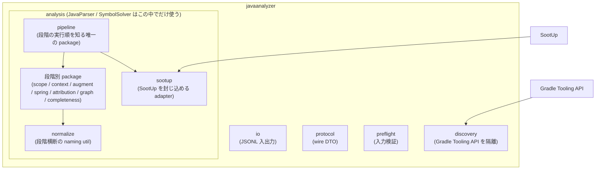
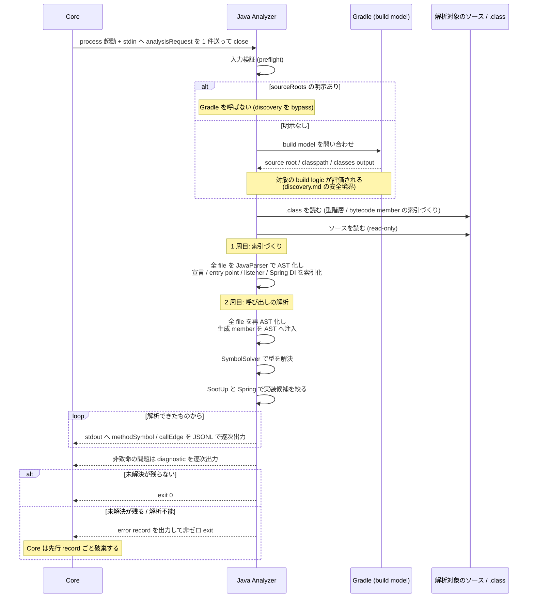
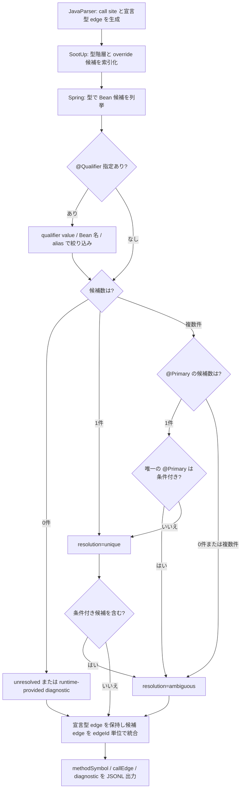

# Feature 設計: Java Analyzer

Java/Spring のソースを読み、メソッドの呼び出し関係を抽出する言語別 Analyzer の設計を定める。

本 doc は Java 固有の部分だけを扱う。共通契約 (SPI / JSONL Protocol / Model schema) は次の 2 つが定める。

- [analyzer-protocol feature doc](../analyzer-protocol/DesignDoc_analyzer-protocol.md) — JSONL wire schema、SPI、process contract を定める
- [ADR-0001](../../../adr/0001-analyzer-protocol-jsonl-spi.md) — Analyzer Protocol を JSONL over STDIN/STDOUT の process SPI とした決定

## 前提: この doc を読むのに必要な語

Java の静的解析に固有の語が多いため、先に整理する。

### 解析の 3 段

Java のソースから「どのメソッドがどのメソッドを呼んでいるか」を出すには、3 段階を踏む。

| 段                | やること                                                                               | 使うもの                                                                    |
| ----------------- | -------------------------------------------------------------------------------------- | --------------------------------------------------------------------------- |
| 1. 構文を読む     | ソースを構文木 (AST) にする。「ここにメソッド呼び出しがある」まで分かる                | **[JavaParser](https://javaparser.org/)**                                   |
| 2. 型を決める     | その呼び出しが**どの型の**どのメソッドか決める。`user.save()` の `user` が何型かを解く | **SymbolSolver** (JavaParser の `javaparser-symbol-solver-core`)            |
| 3. 実装候補を絞る | interface 越しの呼び出しについて、実装クラスの候補を挙げる                             | **[SootUp](https://soot-oss.github.io/SootUp/latest/)** / Spring の DI 情報 |

2 が解けないと呼び出し先が特定できず、edge を出せない。**この doc の大半は「2 と 3 をどこまで、どう解くか」の規則**である。

SootUp は JVM の bytecode を読んで型階層や call graph を扱う静的解析基盤だが、depwalk は**型階層と override / interface 実装候補の索引としてのみ使う**。call graph の生成は任せない。

- [ADR-0005](../../../adr/0005-adopt-sootup-and-spring-di-resolution.md) の SootUp に call graph 生成は任せない — 索引としてのみ使う理由を定める

### 型解決に必要な入力

| 語                    | 意味                                                                                                                                                                                                                         |
| --------------------- | ---------------------------------------------------------------------------------------------------------------------------------------------------------------------------------------------------------------------------- |
| **classpath**         | 型を解決するために参照する場所の一覧。依存ライブラリの jar と、コンパイル済みクラスの置き場からなる ([JDK の `--class-path`](https://docs.oracle.com/en/java/javase/25/docs/specs/man/java.html))                            |
| **classes directory** | コンパイル済みの `.class` ファイルが置かれるディレクトリ (Gradle なら `build/classes/java/main`)。**classes output** も同じものを指す                                                                                        |
| **bytecode member**   | ソースには現れないが `.class` には存在するメソッドやコンストラクタ。[Lombok が生成する](https://projectlombok.org/features/constructor) getter / コンストラクタが典型。ソースだけ見ても分からないため、`.class` を読んで補う |
| **source root**       | 解析対象のソースが置かれたディレクトリ (`src/main/java` 等)                                                                                                                                                                  |

依存ライブラリのソースは手元にないため、型解決は `.class` を読んで行う。classpath が欠けると「型が分からない」呼び出しが増え、edge が落ちる。

### 結果の扱いに使う語

| 語              | 意味                                                                                                                                       |
| --------------- | ------------------------------------------------------------------------------------------------------------------------------------------ |
| **adjacency**   | 隣接関係。「どの node からどの node へ edge が伸びているか」の対応表                                                                       |
| **provenance**  | その edge が**どういう根拠で出たか** (ソースの呼び出しから直接か、Spring の DI 解決を経たか等)。同じ edge が複数の経路で出たときに統合する |
| **完全性 gate** | 解析しきれなかった呼び出しが残ったまま結果を返さないための検査。未解決が残れば失敗として扱う                                               |
| **救済**        | 一次的に解決できなかった呼び出しを、別の手段 (`.class` を読む等) で解き直すこと                                                            |

### 範囲と失敗の扱い

| 語                     | 意味                                                                                                                                                       |
| ---------------------- | ---------------------------------------------------------------------------------------------------------------------------------------------------------- |
| **workspace**          | 解析の起点となるディレクトリ。利用者が `depwalk analyze <path>` で渡したもの                                                                               |
| **scope (解析 scope)** | node として出す対象の範囲。**scope 内**は自分のコード、**scope 外**は依存ライブラリや JDK。scope 外のメソッドは原則 node にしない (影響調査に使わないため) |
| **record**             | Analyzer が stdout へ 1 行ずつ出す JSONL の 1 件。`methodSymbol` / `callEdge` / `diagnostic` / `error` の 4 種                                             |
| **diagnostic**         | 解析を続けられる問題の報告。出しても結果は返る                                                                                                             |
| **fatal**              | 解析を続けられない問題。`error` record を出して非ゼロ exit し、**それまでに出した record ごと破棄される**                                                  |

## 背景・要件解釈

対象は Java/Spring Boot であり、Java Analyzer は `analyzer-protocol` の SPI / JSONL スキーマを実装する最初の言語別 Analyzer である。契約の受け側は Core が持つ。Protocol parser / validator は `core/internal/protocol`、Analyzer process 起動は `core/internal/analyzer` が担う。本 feature は、その契約へ JSONL を出力する Java 側の実装方式 (build 基盤、起動契約、型解決、正規化規則、帰属型決定、解析手段の範囲) を定める。

本 feature が関わる成功条件は [DesignDoc](../../DesignDoc.md) の 3 つである。

- **S1 / S2**: caller / callee 探索の網羅性 — graph の入力を供給する
- **S4**: Spring DI 経由の呼び出し先解決
- **S5**: 2 つ目以降の言語 Analyzer を追加するとき Core を変更せずに済む

## スコープ

### やること

- Java ソースの AST 解析 (JavaParser) と型解決 (SymbolSolver) による静的呼び出し抽出
- 抽出結果を `analyzer-protocol` の JSONL スキーマ (`methodSymbol` / `callEdge` / `diagnostic` / `error`) で stdout へ出力
- `analysisRequest` の受領 (stdin) と process contract (exit code / stderr) の遵守
- Java Analyzer の build / 配布形態 (Gradle + Shadow plugin、単一 fat jar)
- Core からの起動方法 (CLI flag / 環境変数による起動コマンド解決)
- 未解決 symbol / 部分解析の `diagnostic` 表現
- SootUp 型階層補完、Interface Dispatch / Override 解決、Spring Bean / DI 解決、候補 edge 統合の契約
- single / multi-project を同じ request で扱う Gradle build model discovery と明示 source root override
- parse / resolution / 生成 member を含む call inventory の完全性 gate
- framework 由来の暗黙呼び出しの解決 (entry point 分類、イベント edge、callable invocation)
- 型伝播救済層 (generic signature の前進導出による receiver 型の復元と、bytecode 救済への接続)

### やらないこと

- 共通契約 (SPI / Protocol / Model schema) の定義と変更。analyzer-protocol feature doc が定める
- グラフ探索 (traversal feature)、出力整形 (output feature)
- SootUp への call graph 生成の委任。型階層 / override / interface 実装候補の索引としてのみ使う
- Reflection / AspectJ Runtime / 実行時 Proxy の動的解析。Design Doc の Non Goals にあたる
- CLI 引数の完全仕様 (出力形式指定 / 探索方向 / 深さ上限などの全 flag 体系)。CLI feature doc が定める

## 設計

### 詳細の所在

本 doc は Java Analyzer 全体の骨格 (実装基盤・package 境界・起動契約・性能) を持つ。個別の規則は次が持つ。

- [discovery.md](discovery.md) — 解析対象のソースと classpath をどう決めるか (Gradle build model と安全境界)
- [analysis.md](analysis.md) — ソースから呼び出し関係をどう解決するか (型解決 / Spring DI / 完全性)
- [protocol-mapping.md](protocol-mapping.md) — 解析結果を Protocol の record へどう写すか (正規化 / 帰属型 / metadata / diagnostic)

pre-flight が検証する metadata の規則は protocol-mapping.md が持つ。そのうち `gradleJavaHome` が指す Gradle daemon JVM の規則は discovery.md が持つ。

### 実装基盤

- **build tool**: Gradle (Kotlin DSL)。`gradlew` wrapper を同梱し、CI に Gradle 本体の事前インストールを要求しない。
- **JDK**: 25 LTS。Gradle toolchain で固定する (Analyzer process 自身が動く JVM の version。解析対象ソースの言語レベルとは独立して扱う)。
- **配布形態**: 単一 fat jar (Gradle Shadow plugin)。Core は `java -jar <path>` の 1 コマンドで起動できる。
- **実装言語**: Java とする。Kotlin を採らない理由は 3 つある。
  - JDK 25 の sealed interface + record + pattern matching で、Kotlin の主利点 (代数的データ型、網羅性検査) が Java 単体で得られる。
  - JavaParser との interop では型が platform type になり、Kotlin の null 安全が効かない。
  - 将来の「Kotlin Analyzer」と名前が紛れる。

### 内部 package 構成と依存境界

`javaanalyzer` 配下の内部構成を定める。

- 直下の `protocol` (wire DTO) / `io` (JSONL 入出力) / `preflight` (入力検証) / `discovery` (Gradle Tooling API 隔離) は入出力と起動系を担う。
- `analysis` 配下は解析パイプラインの段階別 package で構成し、**段階の実行順は `analysis/pipeline` (AnalysisRunner) だけが知る**。`normalize` は段階横断の naming util である。実行順は次のとおり。
  1. workspaceRoot の real path 化と scope 列挙
  2. bytecode 索引の構築 (context ごとの SootUp 型階層と project bytecode member)
  3. context 構築 (context 別の TypeSolver / parser / AST injector の生成)
  4. parse pre-flight と、成功後の context warning 出力
  5. attribution 準備 (`liftExcludePackages` の解決と帰属型 resolver の生成)
  6. first pass (全 file を parse し、inventory / 宣言索引 / entry point / event listener / callable / source method / Spring DI を索引化)
  7. builder 構築 (context ごとの CallGraphBuilder)
  8. second pass (全 file を再 parse し、bytecode-only member を AST へ注入して CallGraphBuilder で呼び出しを解析)
  9. completeness gate (`fullGraph` の io 出力は second pass の中で逐次起きるため、この検査より先に始まる)
- 外部ライブラリの隔離は 3 段階に分ける。
  - **SootUp** は `analysis/sootup` の adapter に完全封じ込める。facade が自前型で公開し、他 package から `sootup.*` を import しない。
  - **Gradle Tooling API** は `discovery` に完全隔離する。
  - **JavaParser / SymbolSolver** は解析エンジンの中核として `analysis` 配下では自由に使い、`analysis` の外へは漏らさない。
  - [ADR-0007](../../../adr/0007-layered-architecture-refactor.md) の Java Analyzer の構造 — 外部ライブラリの隔離境界を定める
- 依存境界は ArchUnit の JUnit テストで機械検査する。
  - [engineering.md](../../../context/engineering.md) の Repository Quality Gate — 依存方向 gate の実行点を定める

### 起動契約

Core は `--analyzer-cmd` (CLI flag) → `DEPWALK_ANALYZER_CMD` (環境変数) の順で Analyzer 起動コマンド文字列を解決する。どちらも指定が無い場合は、実行前に validation error で拒否する。解決した文字列は **shell を介さず shell-word 分割して exec** する。shell injection を避けるためである。Core は `java` / jar / JVM の存在を知らず、言語固有の分岐と path 解決規約を持ち込まない。

- [ADR-0003](../../../adr/0003-analyzer-command-resolution.md) — Analyzer 起動コマンドを言語非依存な文字列として解決する決定

metadata passthrough も同様の言語非依存原則に従う。Core は `--analyzer-meta key=value` で `analysisRequest.metadata` へ素通しするだけで、key / value の意味を解釈しない。

### analysisMode の意味論

`fullGraph` と `reachableFromEntrypoints` の両方を実装する。

| モード                     | 出力範囲                                                                                                     |
| -------------------------- | ------------------------------------------------------------------------------------------------------------ |
| `fullGraph`                | scope (`include` / `exclude` 適用後) 内の全 `methodSymbol` と、その間の全 `callEdge`                         |
| `reachableFromEntrypoints` | `entrypoints` から呼び出し先 (callee) 方向に推移的に到達する `methodSymbol` と、それらの間の `callEdge` のみ |

- `entrypoints` が未指定または空配列の場合は、`analysisMode` の値によらず scope 全体の call graph 生成要求として扱う。
- node 母集合 (どのメソッドを `methodSymbol` として出すか) の列挙方法は「帰属型の決定規則」節が定める。
- `reachableFromEntrypoints` は caller 探索 (S1) の入力としては不完全である。そのため caller 方向の問い合わせでは、Core が `fullGraph` を選ぶ責務を持つ。本 doc が定めるのは Java Analyzer 側の意味論だけで、Core の振る舞いは参照にとどまる。
- `reachableFromEntrypoints` は、callee 方向の調査で出力量を削るための最適化と位置づける。

### 性能方針

- **モード別の streaming 方針**: `reachableFromEntrypoints` は entrypoints からの到達判定に解析完了までの adjacency 全体が必要であり、streaming と両立しない。このためモードごとに挙動を分ける。
  - `fullGraph`: ファイル単位の解析が終わるごとに、新たに確定した `methodSymbol` / `callEdge` / `diagnostic` を stdout へ flush する。flush は出力済み index を進めるだけで、要素は破棄しない。
  - `reachableFromEntrypoints`: 到達判定のため逐次 flush を行わず、解析完了後に到達集合を確定してから一括出力する二段階処理を **モード別の例外** として許容する。
- **逐次破棄されるのは AST のみ**: ファイル単位で parse した AST は処理後に参照を手放す。それ以外はモードを問わず実行終了まで保持する。
  - node / edge / diagnostic は両モードとも `GraphAccumulator` が追加のみの list で保持する。モードで変わるのは writer へ流す timing だけである。
  - SymbolSolver の型解決キャッシュも実行終了まで残る。
  - first pass で作る索引 (inventory / 宣言索引 / entry point / event listener / callable / source method / Spring DI) と call outcome ledger も、run 全体で保持する。
- **計測の観測性**: 解析ファイル数 / 所要時間 / 未解決件数を stderr に出力する (protocol record としては出さない)。
- **メモリ特性の扱い**: `fullGraph` と `reachableFromEntrypoints` は record の出力 timing が異なるため、数値目標はモード別に扱う。グラフ本体の保持量そのものはモードで変わらない。
- **SootUp の view 構築は lazy に行う**。型階層解決に必要なクラスだけを読み込み、eager な全クラス読み込みをしない。

#### 計測の手順

明示 single-root、自動 single-project、自動 multi-project の 3 経路を、初回 1 回と warm 3 回の中央値で測る。discovery / model / parse / resolution / graph の phase 別時間を stderr へ記録する。

数値目標は実測から次の規則で導く。

- latency: warm wall 中央値の 1.5 倍を 0.5 秒単位で切り上げ
- 最大 RSS: warm 3 回の最大値の 1.25 倍を 64 MiB 単位で切り上げ

小規模 fixture では JVM 起動と Gradle daemon の寄与が大きいため、値は「小規模プロジェクトでの下限に近い値」として扱う。

#### 経路別 SLO

| 経路                      | 初回 wall | warm wall 3 回        | warm 中央値 | warm 最大 RSS                    | latency SLO | 最大 RSS SLO |
| ------------------------- | --------- | --------------------- | ----------- | -------------------------------- | ----------- | ------------ |
| 明示 single-root (8 file) | 1.78s     | 1.71s / 1.81s / 1.69s | 1.71s       | 418,873,344 bytes (約 399.5 MiB) | 3.0s 以下   | 512 MiB 以下 |
| single-project discovery  | 3.52s     | 3.00s / 2.52s / 2.73s | 2.73s       | 445,415,424 bytes (約 424.8 MiB) | 4.5s 以下   | 576 MiB 以下 |
| multi-module discovery    | 3.11s     | 2.51s / 2.64s / 2.49s | 2.51s       | 399,687,680 bytes (約 381.2 MiB) | 4.0s 以下   | 512 MiB 以下 |

この SLO は特定の fixture と計測環境に対する手動のリリース目標であり、**時間や RSS の機械的なテスト gate にはしない**。S1 から S3 の CLI E2E を required gate とする方針は維持する。fixture の規模、Analyzer runtime JDK、Gradle major が変わったら測り直す。

### 解析手段の範囲

呼び出しの抽出は 2 つの手段を重ねて行う。

- **静的呼び出し抽出**: JavaParser + SymbolSolver で呼び出しと型を解決する。
- **SootUp / Spring 解析**: SootUp が型階層 / Interface Dispatch / Override 候補を補い、Spring Bean / DI 解決が候補を絞り込む。これで成功条件 S4 を満たす。

SootUp は型階層、override、interface 実装候補の索引としてのみ使い、call graph 生成は任せない。view 構築を lazy にする規則は性能方針節が定める。

**Lombok 生成コンストラクタの解決**: `@AllArgsConstructor` / `@RequiredArgsConstructor` 等が生成する constructor は、source からは見えない。そのため SootUp の bytecode 型階層照会対象に自プロジェクトのコンパイル済み class を含めて解決する。

- 解析対象プロジェクトは、解析時点でコンパイル済み (`.class` 生成済み) であることを前提とする。
- 未ビルドの場合は `JAVA_SOOTUP_UNAVAILABLE` の diagnostic を出し、JavaParser の結果だけで source-only 解析を続ける。
- 自プロジェクトのコンパイル済み class も、解析対象ソースや依存 jar と同じく読み取り専用として扱う (書き込みと実行はしない)。

Reflection / AspectJ Runtime / 実行時 Proxy 等、実行時状態で初めて確定する呼び出しの完全追跡は扱わない。静的に候補を導ける場合は候補と根拠を出力し、確定できない場合は候補と未解決理由を観測可能にする。

- [ADR-0004](../../../adr/0004-defer-runtime-call-tracing.md) — 動的呼び出しの完全追跡を初期スコープに含めないと定めた決定

静的に解けない framework の仕組みは、次の 2 つの規則で扱う。

- **Spring 条件アノテーション**: `@Profile` / `@ConditionalOnProperty` 等の条件アノテーションは、条件評価を行わず検出と記録だけを行う。条件付き Bean も無条件に候補として列挙し、「条件付きである」事実と条件種別を metadata / diagnostic に記録する。条件付き候補を含む場合は、候補が 1 件でも `resolution: unique` とせず曖昧候補として扱う。
- **実行時生成実装**: Spring Data 等の実行時生成実装は、宣言メソッドへの edge だけを保持し、疑似実装ノードを合成しない。既知の runtime-provided マーカーは Spring Data `Repository` 型階層と MyBatis `@Mapper` インターフェースの 2 つとする。MyBatis を含めるのは、framework がランタイムプロキシを生成しソースに実装クラスが存在しない点で Spring Data と同構造だからである。マーカーに合致する場合は、diagnostic の理由を「未解決」ではなく「runtime-provided」として区別する。`@FeignClient` 等その他 framework は対象に含めない。

## 主要シナリオ / フロー

### 起動から結果を返すまで

Core が Analyzer を 1 回呼ぶと何が起きるかの全体像。各段の詳細は子 doc が持つ。

全 file を 2 周する構成は、同一 compilation unit 内の参照と framework 由来の呼び出しを解くために要る。1 周目の索引が揃わないと 2 周目の解決ができない。各周でやることの規則は analysis.md が持つ。

出力は**逐次**である。解析が全部終わってからまとめて返すのではなく、確定したものから流す。ただし `reachableFromEntrypoints` は到達判定に解析全体が要るため例外とする。その扱いは「analysisMode の意味論」節に置く。

### 個別の規則

- Core が Analyzer process を起動し stdin へ `analysisRequest` を 1 件送信して close する。Java Analyzer は対象 Java ソースを read-only で解析し、結果を stdout へ JSONL で逐次出力する。
- 呼び出し先の型が解決できたとき、`methodSymbol` (caller / callee 双方) と、両者を参照する `callEdge` を出力する。
- 呼び出し先が interface / 抽象メソッドであるとき、帰属型の決定規則で決まる帰属型のメソッドを callee として `callEdge` を出力し、`callEdge.metadata.dispatch` に dispatch 種別を標識する。
- 呼び出し先メソッドの宣言サイトが scope 外で、その宣言型が引き上げ除外 package に属するとき、`methodSymbol` / `callEdge` を出力しない (解析失敗ではないため `diagnostic` も出さない)。
- framework が実行時に起動する呼び出しも、ソース上の根拠がある範囲で edge にする。`publishEvent` から `@EventListener` メソッドへのイベント edge と、functional interface の invocation site から実体への callable invocation edge を出す。規則は analysis.md が定める。
- framework が直接起動し得るメソッドは `methodSymbol.metadata.entryPoint` で標識する。edge は作らず、caller 探索の終端根拠だけを与える。対象アノテーションの集合は analysis.md が定める。
- allowlist された resolution failure は、call outcome ledger に候補と理由を記録して解析を継続する。ただし全救済後も primary diagnostic が残る request は `JAVA_INCOMPLETE_ANALYSIS` で fatal にする。
- 個別ファイルがパース不能なときは graph record を 1 件も確定しない。決定順で最初の parse failure を `JAVA_PARSE_ERROR` の location / message として返し、fatal にする。
- 解析を継続できない致命的な問題が起きたとき、`error` record を出力し、非ゼロ exit code で終了する。

### Interface Dispatch / Spring DI 解決フロー

SootUp は edge を直接生成せず候補索引だけを提供する。Spring の絞り込み後に JavaParser 側で候補 edge を生成し、同一 edge の provenance を統合する。

## テスト観点

本 feature は三層 (Java unit / Go fake analyzer / 実 jar E2E) で保証する。

- [context/testing.md](../../../context/testing.md) — test の責務分担と test runtime contract を定める

**観測責務の境界**: 曖昧性と解決根拠の観測は、Analyzer JSONL (`callEdge.metadata` / `diagnostic`) までを本 feature の責務とする。CLI 出力への edge 単位 metadata 表出は [CLI feature doc](../cli/DesignDoc_cli.md) が定める。

**Java unit test (JUnit / `analyzers/java/`)**

- signature / `methodId` の正規化 (overload / generics erasure / varargs / nested class (`$`) / constructor (`<init>`) / static initializer (`<clinit>`) / 匿名クラス採番の決定性)
- `symbolKind` の割り当て (インスタンス初期化子・フィールド初期化子が constructor に畳み込まれること、lambda 内の呼び出しが囲みメソッドに帰属し `viaLambda: true` が立つこと)
- 帰属型の決定規則 (宣言サイト scope 内 (override あり / なし)、scope 外宣言の引き上げ、除外 package (既定値と `liftExcludePackages` による置き換え、segment 単位 prefix 一致)、`this` / `super` / static / `new` の各形、`metadata.dispatch` の値)
- `diagnostic` / `error` の code と severity の対応、および pre-flight 検査が解析開始前に fatal になること。検査対象は次のとおり。
  - `language != "java"`、`workspaceRoot` の不在・非 directory
  - 明示 `sourceRoots` 経路での classpath key 不在、classpath entry の欠落・読取不能
  - `liftExcludePackages` が文字列配列であること (空配列は「除外なし」として正当)
  - `allowIncompleteAnalysis` が要素 1 の `["true"]` / `["false"]` であること
  - `gradleJavaHome` が要素 1 の非空 string で、実在する directory かつ `bin/java` が実行可能であること (自動 discovery 経路でのみ解釈する)
- explicit / auto の排他 validation、root 正規化・重複・包含・realpath 境界、custom model、main source set、project dependency 到達性、context 別 language level / preview
- parse pre-flight、allowlist 外 resolver fatal、atomic mutation、call inventory / outcome ledger、initializer caller 展開、`silentOmission == 0`、共通 failure details
- call-site driven project bytecode member index、bytecode-only member の location 省略と owner metadata、Graph deep copy
- `fullGraph` / `reachableFromEntrypoints` の出力範囲 (宣言列挙 ∪ call site 由来、entrypoints 空は全体扱い)
- entry point 分類 (対象アノテーションの検出、1 段の合成アノテーション、対象外とする形での非検出、`metadata.entryPoint` の値)
- イベント edge (publisher 判定、引数型と型階層による listener 突合、無条件 listener の `unique`、条件付き / generics / SpEL 属性での `ambiguous` 降格、突合できないときの diagnostic)
- callable invocation (method reference と lambda の edge 先、`viaCallableInvocation` の標識、local 変数経由と parameter 1 段の追跡範囲、対象外の形で edge を張らないこと)
- 同一 compilation unit 内での bytecode-only member の AST 注入と、暗黙宣言を注入しないこと
- 型伝播救済層の generic 前進導出 (chain link の型引数伝播、固定表の適用範囲、`java.lang.Object` での打ち切り)
- `gradleJavaHome` の受理と拒否 (要素 1 の非空 string、実在 directory かつ `bin/java` 実行可能なら受理。それ以外は `JAVA_INVALID_REQUEST`。明示 `sourceRoots` 経路では解釈しない)
- **複数 context (依存 project 関係) を要する規則** (cross-module bytecode 救済など) は、`MultiContextAnalysisTestSupport` で検証する。in-memory の fake build model から production の context 構築 (`discoveredContexts`) を通し、`AnalysisRunner` を直接駆動する。
  - build model は Tooling API が構造的に adapt する interface である。そのため fake でも、root 検証と依存 context id 導出は production コードが行う。
  - unit test の範囲から外れるのは model 取得 (Tooling API / Gradle daemon / provider 配布) だけである。その部分は実 jar E2E (`TestGradleMultiProjectCLI` 等) が実 Gradle で担う。

**Go 側 process contract (fake analyzer / JVM 不要)**

- `--analyzer-cmd` / `DEPWALK_ANALYZER_CMD` の解決順序と、どちらも無い場合の実行前拒否
- `--analyzer-meta key=value` の合成規則 (1 回指定 → 要素 1 の配列、繰り返し → 指定順の配列、空値 (`key=`) → 空配列、`=` なし → validation error、value に `=` を含む指定 → 最初の `=` で分割)
- shell を介さない shell-word 分割で exec されること
- contract test の既存観点 (stdin close / 逐次 parse / stderr 非 parse / exit code) を再利用する

**E2E (実 jar / `testdata/fixtures/java/`)**

- 既知の caller / callee 集合と解析結果 graph の照合 (S1 / S2 の入力層)。CLI 出力レベルの照合は CLI 層が担う
- interface 注入を含むサンプルで、宣言型 (interface) のメソッドが callee に現れ `dispatch: interface` が立つこと (S4 の前段)
- パース不能ファイルを混ぜた fixture で、`JAVA_PARSE_ERROR` が決定順で最初の failure detail を返し、graph / diagnostic を公開しないこと
- 未解決 symbol を含む fixture で、救済できない primary outcome が `JAVA_INCOMPLETE_ANALYSIS` の全 detail を返し、不完全 graph を成功させないこと
- **完全性 gate の opt-in 緩和**: `metadata.allowIncompleteAnalysis=["true"]` のとき、primary diagnostic が残っていても exit 0 で成功し、解決済み edge / node と診断 (`diagnostic` record) が公開されること。`callSiteSummary` の `diagnostic[...]` 集計が残存件数と一致し `silentOmission=0` を維持すること。不正な値 (`["true"]` / `["false"]` 以外) は `JAVA_INVALID_REQUEST` で fatal になること
- app / service / repository の 3 project、変更した `projectDir`、custom source dir、project 間の call / DI を含む fixture で、自動 discovery と明示 override の graph が一致すること
- test-only 透過 proxy を介して実 Core CLI と実 Analyzer jar を接続し、request、raw graph、CLI 終了状態を required gate で照合すること
- Gradle `7.6.5`〜`9.6.x` と daemon JVM anchor matrix、Gradle output discard、credential / URL / absolute path を含む negative fixture の非漏洩を検証すること
- **Spring Boot fixture**: `testdata/fixtures/java/spring-project/` に単一 source root の Spring fixture を置く。DI (constructor / field / setter injection)、stereotype、`@Qualifier`、`@Primary`、条件付き Bean (`@Profile` / `@ConditionalOnProperty`)、Spring Data Repository を含む。
- **Lombok / MyBatis Mapper**: 上記 fixture に、コンストラクタを Lombok (`@AllArgsConstructor` / `@RequiredArgsConstructor` 等) で生成するクラスと、MyBatis `@Mapper` インターフェースを含める。前者は自プロジェクトのコンパイル済み class を通じた constructor injection 解決を、後者は runtime-provided マーカー検出を検証する。
- **未解決 call パターン fixture**: `testdata/fixtures/java/multi-module-spring-project/patterns/` に、実環境実測の上位未解決パターン (lambda / generic を含む fluent chain、`var` + generic メソッド戻り値、method reference、explicit `super(...)`、cross-module の Lombok 生成 member 呼び出し) の最小再現ケースを置く。各パターンは bytecode-only member の契約下で edge になる。この成功期待は required E2E (`core/e2e/unresolved_patterns_cli_test.go`) が守る。`JAVA_INCOMPLETE_ANALYSIS` 時の診断 metadata 4 項目 (sanitize 制約含む) の期待値検証は Java unit test 側が担う。
- **metadata 透過表出の CLI 照合**: Analyzer が付けた metadata が CLI 出力まで欠落せず届くことを、`core/e2e/event_edges_cli_test.go` / `core/e2e/callable_edges_cli_test.go` / `core/e2e/entrypoint_metadata_cli_test.go` の 3 本で照合する。この 3 本は `testdata/fixtures/java/` を使わず、必要最小の source を一時 workspace へ組み立てて実行する。検証したい表出だけを含む最小構成にし、共有 fixture の変更で壊れないようにするためである。
- **fixture build / classpath 契約**: `testdata/fixtures/java/spring-project/` は独立した Gradle project とし、repository の `analyzers/java/gradlew -p` で build する。fixture の `build.gradle.kts` は Java toolchain 25、`options.release=21`、Spring Boot Autoconfigure 4.1.0、Spring Data Commons 4.1.0、MyBatis 3.5.19、Lombok 1.18.46 を固定する。`writeDepwalkClasspath` task は `build/classes/java/main` と `runtimeClasspath` の jar を、絶対 path・辞書順・1 行 1 entry で `build/depwalk-classpath.txt` へ書く。Go E2E はその全行を `analysisRequest.metadata.classpath` に渡す。Lombok の生成 constructor は `classes` task 後の `.class` で検証する。

## 関連ドキュメント

- [discovery.md](discovery.md): 解析対象のソースと classpath の決め方 (Gradle build model と安全境界)
- [analysis.md](analysis.md): 型解決 / Spring DI 解決 / 解析完全性の判定規則
- [protocol-mapping.md](protocol-mapping.md): 解析結果を Protocol の record へ写す規則
- [analyzer-protocol feature doc](../analyzer-protocol/DesignDoc_analyzer-protocol.md): JSONL wire schema と SPI、process contract
- [cli feature doc](../cli/DesignDoc_cli.md): CLI の flag 体系と、CLI 出力への metadata 表出
- [design/DesignDoc.md](../../DesignDoc.md): system landscape とモジュール責務
- [context/engineering.md](../../../context/engineering.md): quality gate と依存方向 gate の実行点
- [context/testing.md](../../../context/testing.md): test の責務分担と test runtime contract
- [context/toolchain.md](../../../context/toolchain.md): 標準 toolchain と Gradle discovery の互換 matrix
- [ADR-0001](../../../adr/0001-analyzer-protocol-jsonl-spi.md): Analyzer Protocol を JSONL over STDIN/STDOUT の process SPI とした決定
- [ADR-0003](../../../adr/0003-analyzer-command-resolution.md): Analyzer 起動コマンドを言語非依存な文字列として解決する決定
- [ADR-0004](../../../adr/0004-defer-runtime-call-tracing.md): 動的呼び出しの完全追跡を初期スコープに含めない決定
- [ADR-0005](../../../adr/0005-adopt-sootup-and-spring-di-resolution.md): SootUp と Spring DI 解決を段階導入した決定
- [ADR-0006](../../../adr/0006-adopt-gradle-tooling-api-discovery.md): Gradle Tooling API による source root 自動 discovery を採用した決定
- [ADR-0007](../../../adr/0007-layered-architecture-refactor.md): 依存境界を ACL と機械検査で固定した決定
