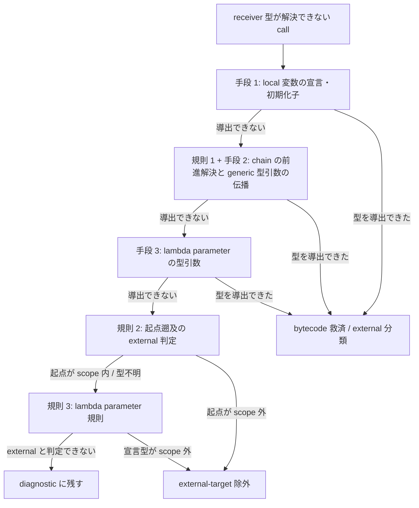

# Java Analyzer: 解析エンジン

**ソースから呼び出し関係をどう解決するか**を定める。

JavaParser と SymbolSolver で型を解決し、SootUp で型階層 / override / interface 実装候補を索引し、Spring の DI で候補を絞り込む。解決できなかった call の扱い (救済するか、未解決として完全性 gate に残すか) も本 doc が定める。

用語 (JavaParser / SymbolSolver / SootUp / bytecode member / 救済 / 完全性 gate) は、親 doc の「前提: この doc を読むのに必要な語」節が定義する。

- [DesignDoc_java-analyzer.md](DesignDoc_java-analyzer.md) — Java Analyzer の骨格と、本 doc で使う語の定義
- [protocol-mapping.md](protocol-mapping.md) — 解決結果を Protocol の record へ写す規則を定める

## この doc が答えること

- `user.save()` の `user` が何型か、どう決めるか (型解決)
- ソースに現れない Lombok 生成メソッドをどう解くか (bytecode member の合成)
- interface 越しの呼び出しで、実装クラスの候補をどう絞るか (Spring DI)
- 解決できなかった呼び出しをどう扱うか。救済するか、未解決として結果を失敗にするか

## 型解決

JavaParser (AST 解析) + SymbolSolver (型解決) を用い、次の 3 つの `TypeSolver` を構成する。

- `ReflectionTypeSolver` (JDK 標準型)
- `JavaParserTypeSolver` (対象プロジェクトの source root)
- `JarTypeSolver` (依存 jar)

classpath は明示 `sourceRoots` 経路で `analysisRequest.metadata.classpath` key を **必須**とする (空配列可)。自動 discovery 経路では、custom tooling model が project ごとの compile classpath / classes output を提供する。request metadata に `classpath` があれば、共通 extra として全 context へ追加する。`javaLanguageLevel` / `javaPreview` を自動 discovery 時に指定するのは不正とする。両 key とも、要素数が 1 でない配列 (0 件・2 件以上) と非 string 要素は `JAVA_INVALID_REQUEST` として解析開始前に拒否する。

`classpath` の各要素には依存 jar またはコンパイル済み classes directory を指定できる。自プロジェクトの bytecode を照会する場合は、解析対象プロジェクトの classes output directory (例: Gradle の `build/classes/java/main`) も `classpath` 配列へ追加する。新しい metadata key は導入しない。SootUp は source から得た binary name と一致する `.class` を classpath 上で照会し、自プロジェクトの class と依存 class を区別する。

pre-flight 検査 (classpath key の有無、指定した jar または classes directory の存在と読み取り可否) は、解析開始前に一括で行う。明示された classpath entry の欠落と読み取り不能は `JAVA_MISSING_JAR` の fatal とし、`error` record と非ゼロ exit で即時停止する。明示された入力の欠落を部分解析へ降格すると、出力済みの `methodSymbol` / `callEdge` が「一見成功した出力」として観測されうるためである。

`JAVA_SOOTUP_UNAVAILABLE` の継続可能 fallback は、pre-flight を通過した入力について次の 4 つに限定する。

- SootUp が class file を解釈・索引化できない
- 自動 discovery の model 由来 classes output が未作成
- 明示経路で、自 project の classes output 自体が classpath に指定されていない
- model 由来 compile classpath のうち、workspace 内の project 依存 build output が未 build で存在しない

この 4 つでは対象と原因を diagnostic に出力し、JavaParser の結果だけで source-only 解析を継続する。workspace 内の未 build entry を除外しても、依存 project の source root が solver へ入るため、型解決は依存 context の source が補完する。model 取得は task を実行しないため、fresh checkout ではこの欠落が通常状態である。

次の 2 つの欠落と読取不能は `JAVA_MISSING_JAR` の fatal とし、fallback しない。利用者が classpath entry として明示した classes directory / jar と、model が解決済み compile classpath として返した workspace 外の external artifact である。

source-only で生成 member を救済できず primary call diagnostic が残れば、終端で `JAVA_INCOMPLETE_ANALYSIS` になる。fatal は先行 warning record を無効化する。そのため SootUp を利用できなかった context 数を、`JAVA_INCOMPLETE_ANALYSIS` の error metadata (`sootUpUnavailableContexts`) へ自己完結に保持する。bytecode 救済の欠如が原因の未解決を、fatal 後も診断できるようにするためである。

SootUp 依存は `org.soot-oss:sootup.core:2.0.0`、`org.soot-oss:sootup.java.core:2.0.0`、`org.soot-oss:sootup.java.bytecode.frontend:2.0.0` に固定する。この 3 つは bytecode の `AnalysisInputLocation` / `View` に必要な最小 module であり、2.0.0 は Maven Central に公開されている安定版である。`sootup.callgraph` は、SootUp に call graph 生成を任せない責務境界に反するため追加しない。

## solver 層の bytecode member 合成

scope 内 source 型を solver が解決するとき、同一 context の classes output にしか存在しない一意な callable member (Lombok 等の生成 member) を解決時に合成する。call-site 駆動の救済 (生成 member 索引) だけでは、式の型伝播 (chained call / stream 連鎖) を辿れないためである。source 宣言と source 優先の帰属規則は変えない。合成 member の出力は bytecode-only member と同じ契約 (定義位置省略 + owner metadata) に従う。generic 戻り値は classes output の Signature 属性から実型引数を復元する。Signature が無い member、読めない member、型変数は erasure (Object) へ degrade し、解析は失敗させない。

合成・救済の選択境界: 型名 scope の static call は instance member を合成・救済せず、未解決として完全性 gate に残す (偽 edge 防止)。member 候補は、owner class の classfile が project 所有の classes output に存在する場合だけ採用する。対象は自 context と、**model の project 依存関係で到達可能な依存 project の output** である。

### AST への member 注入

solver 経由の合成は、TypeSolver を通らない解決経路には効かない。効かないのは次の 2 つである。

- 同一 compilation unit 内の参照 (自 class の getter を `this` / 暗黙 scope で呼ぶ、同一 file の local 変数 receiver、switch selector)
- solver 内部で parse した AST から直接作られる宣言

実環境で最も多い未解決は「entity 自身のメソッド内から自 class の生成 getter を呼ぶ」形である。そこで、生成 member の宣言そのものを parse 後の AST へ注入して補う。

- [ADR-0012](../../../adr/0012-implicit-call-resolution-and-type-propagation-rescue.md) の 決定 — 暗黙呼び出し解決と型伝播救済の範囲を定める

注入先は、解析対象の parse 結果と solver 内部の parse 結果の両方である。

注入の対象と除外:

- 対象は class 宣言と enum 宣言。interface は生成 member が付かず、record は accessor が言語仕様で暗黙宣言されるため対象外
- 言語仕様が暗黙に宣言する member は注入しない (enum の values / valueOf、javac の暗黙 default constructor と同じ形のもの)
- class には bytecode-only constructor (@AllArgsConstructor 等) も注入する。ただし同 arity の source 宣言が無い一意なものだけ
- 同名・同 arity が bytecode 上に複数ある member は、曖昧なので注入しない (合成と同じ一意性規則)
- source に書けない匿名・local class 名 (`$` + 数字) が owner か member の型に現れる場合は注入しない
- 注入時に型解決は行わない (solver への再入を防ぐ)。型は classfile の descriptor / Signature の名前をそのまま書き下す

注入した宣言は「解決のための標識」であり、source 宣言としては扱わない:

- caller として walk しない。呼び出された場合は bytecode-only member と同じ出力契約 (定義位置省略 + owner metadata + calleeOrigin) で emit する
- owner の型が scope (include/exclude 適用後) の外なら external-target として除外する (fatal にしない)
- field initializer の caller 帰属 (帰属先 constructor の集合) は注入前の source 宣言で数え、注入で変えない
- walk する AST の first-pass 索引 (inventory / 宣言索引 / entry point / event listener / callable / source method / Spring DI) は、いずれも注入前の AST で作る。ただし索引が行う型解決は solver 内部の注入済み AST を参照しうるため、「注入の影響が first pass に一切現れない」ことまでは保証しない

external artifact だけに存在する同名 class の member は、project bytecode として救済しない (「solver 層の bytecode member 合成」節の origin 検証)。依存 project output は classpath の形 (Gradle model は依存 project を jar として返すことがある) に依存せず model の依存関係から解決する。SootUp の入力は project 所有 output を external jar より先に登録し、同名 class は project bytecode を優先する。

cross-module 救済: 依存 context の source 型が持つ生成 member (Lombok constructor / getter 等) の cross-module 呼び出しも救済の対象とする。採用境界は依存 project の output を含む。

## Spring Bean 候補の選択規則

Spring ApplicationContext は起動せず、次の静的規則だけを実装する。

1. 注入型へ代入可能な Bean を型階層から列挙する。
2. 注入点に直接の `@Qualifier("value")` がある場合は、Bean 側の qualifier value、Bean 名、alias のいずれかが `value` と一致する候補だけを残す。custom qualifier meta-annotation、generics qualifier、`@Resource` は対象外とする。
3. 残った候補が 1 件なら `unique` とする。ただし条件アノテーション付き候補は `ambiguous` とする。
4. 候補が複数件なら、条件アノテーションがない `@Primary` 候補がちょうど 1 件の場合だけその候補を `unique` とする。唯一の `@Primary` が条件付きの場合は、条件が偽のときに他候補が選ばれる可能性を残すため、全候補を保持して `ambiguous` とする。`@Primary` が 0 件または複数件の場合も全候補を保持して `ambiguous` とする。
5. 候補が 0 件なら unresolved とする。既知の runtime-provided マーカーに該当する場合だけ理由を `runtime-provided` に置き換える。代入可能性の判定に使う ancestor 収集は best-effort とし、解決できない ancestor があっても解決済みの ancestor を捨てない。1 つの未解決 external 基底で、workspace interface への代入可能性が失われないようにするためである。

Bean 名は次の規則で導出する。

- stereotype class は annotation の `value` が非空ならその値を使う。省略時は simple class name に `java.beans.Introspector.decapitalize` と同じ規則を適用する。
- `@Bean` method は `name` / `value` に明示された名前を Bean 名・alias として保持する。省略時の Bean 名は method name とする。
- Bean class または `@Bean` method に直接付与された `@Qualifier("value")` を qualifier value として保持する。

## Parse・resolution・call 完全性

全対象 Java file を、workspace 相対 path の決定順で graph record 出力前に parse pre-flight する。1 件でも失敗した場合は `JAVA_PARSE_ERROR` を出力して非ゼロ終了する。この record は最初の失敗 file の location、適用 language level、sanitize 済み parser message を持つ。部分 parse mode は v1 では提供しない。pre-flight の AST は file ごとに破棄し、成功後の通常解析で再 parse する。

solver の前に、resolution と独立した visitor で各 call expression / method reference / constructor invocation / initializer call を inventory 化する。`CallSiteId` は 2 つを canonical 順で連結した内部 identity であり、Protocol へは出力しない。1 つは workspace 相対 path、start / end line、column、AST call kind からなる lexical site key である。もう 1 つは semantic caller method ID である。全 call は内部 outcome ledger で、次のいずれか 1 つへ終端しなければならない。

- `emitted`: valid edge を出力した。
- `excluded`: `external-target` または `lift-excluded-package` の列挙済み理由に該当する。
- `diagnostic`: allowlist された resolution failure として候補と理由を保持した。

未知の `RuntimeException` / `LinkageError` を広く捕捉して diagnostic へ降格しない。allowlist 外の resolver failure は `JAVA_INTERNAL_ERROR` の request fatal とする。1 call の symbol / edge / ledger 更新は原子的に行い、中途半端な record を出さない。

initializer の call は意味論に合わせて展開する。instance initializer / field initializer は各 constructor caller へ、static initializer は `<clinit>` caller へ展開する。展開後の各 call は独立した `CallSiteId` として数える。

source にない生成 member は、call site から要求された member だけを project bytecode member index で検索する。index は generator 固有の annotation 名に依存せず、compile classes output の signature / owner / kind を扱う。source-only member は `sourceLocation` を持つ。bytecode-only member は `sourceLocation` を省略する。代わりに `methodSymbol.metadata` へ `declarationOrigin: "project-bytecode"`、`sourceAnchor: "owner-type"`、`ownerSourceLocation` を保持する。対応する edge は `calleeOrigin: "project-bytecode-member"` を持ち、Graph は nested metadata を deep copy する。索引対象外は 2 つある。owner source type が scope 内にない生成 type の全体と、source call site から直接参照されない JVM 内部 member である。

全救済後にも primary diagnostic outcome が残る場合、既定では成功 graph を返さず `JAVA_INCOMPLETE_ANALYSIS` の request fatal とする。未解決 call は内部 `CallSiteId` 順で並べるが、ID 自体は Protocol へ出力しない。各共通 `error.details` には、source location、元 diagnostic の code / message、opaque metadata を自己完結形式で含める。opaque metadata が持つのは reason、call kind、判明済み target、candidate である。この内容は top-level metadata の total / reasonCounts と一致させる。`silentOmission` は常に 0 でなければならない。

### 未解決を許して結果を返す (opt-in)

`metadata.allowIncompleteAnalysis` が `true` の場合、primary diagnostic が残っても request を fatal にせず、解決済み edge と明示除外を含む graph を成功として公開する。残存する primary diagnostic は、検出時点で `diagnostic` record (`JAVA_UNRESOLVED_SYMBOL` warning) として streaming 済みであり、graph が部分的であることは隠さない。stderr の call-site summary (`callSiteSummary`) には、終端種別と理由別の集計 (`emitted` / `excluded[...]` / `diagnostic[...]`) を既定で出力する。`silentOmission == 0` の不変条件は緩和時も維持する。既定値は `false` とし、fatal にする挙動を既定に置く。

この flag が変えるのは完全性 gate の判定タイミングだけである。outcome ledger の分類ロジック、帰属意味論、emit される edge の正しさ (推測による false edge の禁止) には影響しない。

### 救済と除外分類が効く範囲

bytecode 救済 (project bytecode member index) と `external-target` 除外分類は、method call だけに適用するのではない。method reference (constructor reference を含む) と explicit constructor invocation (`super(...)` / `this(...)`) の resolve 失敗にも適用する。救済と分類を試みてから diagnostic 化する。outcome ledger の 3 終端と帰属意味論は変えない。

### 呼び出し元の型が分からないとき

receiver 型が取得できない call は、次の順で分類を試みてから diagnostic 化する。いずれも classfile / 確定 AST のみを根拠とし、推測による型付けは行わない。

1. **chain の前進解決**: receiver chain の各 link を、project bytecode candidate の戻り値型 (descriptor / generic Signature 由来) で前進解決する。owner 型を復元できたら、通常の救済 / external 分類を適用する。
   - 候補が一意でない link、primitive / 配列戻り値、project 外 classfile の link では前進しない。
   - 暗黙 this link は囲み型で補完する。型不明の単純名は、確定 AST の initializer (囲み callable 内で同名宣言が一意の場合のみ) または囲み型の bytecode field 型で補完する。
   - field 型補完は、囲み member 内に同名の local 宣言 (parameter / パターン変数を含む) が見えない場合に限る。block 直下以外 (for ヘッダ、try-resource、catch 節等) で宣言された local が field を shadowing しているとき、field 型での誤判定 (false exclusion) を避けるためである。
2. **起点遡及の external 判定**: 前進解決できない場合、chain、変数 initializer、`this.field` を遡って、最初に静的型が取れる起点を探す。その型が scope 外 (source 宣言索引に無い) なら `external-target` 除外へ分類する。
   - 起点が scope 内型か暗黙 this の場合、および起点の型も取れない場合は、保守的に diagnostic に残す。
   - 単純名起点の field 型補完には、規則 1 と同じ同名 local 宣言の検査を適用する。
3. **lambda parameter 規則**: receiver が lambda parameter の場合、lambda が代入される変数の宣言型 (functional interface 型そのもの) が scope 外なら `external-target` へ分類する。
   - lambda を直接 method 引数に渡す形 (unqualified static import 経由を含む) は、external 判定の根拠にしない。受け手 method の receiver 型や static import 元の class は、lambda parameter が実際に instantiate される型とは独立した情報だからである。external な受け手でも in-scope 型の parameter を取り得るため、diagnostic に残す。

SAM arity を推論できない method reference は救済せず、diagnostic に残す。候補列挙は owner classfile の宣言 member に限られ、継承 overload を検証できない。そのため宣言上の名前一意を、参照先が一意である根拠にできない。

### 型伝播救済層

上記の分類規則を拡張し、solver 失敗時に receiver 式の型を段階導出して bytecode 救済へ接続する。この範囲は ADR-0012 が定める。導出手段は次の 3 つで、いずれも classfile / 確定 AST を根拠とし、推測による型付けは行わない。

1. **local 変数の宣言・初期化子**: receiver が local 変数 (var 宣言含む) のとき、宣言型または初期化子式の解決型から receiver 型を導出する
2. **chain link の generic signature**: 規則 1 (chain の前進解決) の適用を拡大し、bytecode の generic Signature が型引数を保持する場合は型引数を伝播して要素型を復元する。JDK コレクション / Stream / Optional / Map の link は、classfile Signature と等価な「宣言済み generic 意味論の固定表」で伝播する
3. **lambda parameter の functional interface 型引数**: lambda parameter の型を、lambda が渡された先の receiver の要素型 (手段 2 で復元した型引数) から導出する

手段 2 の固定表の適用範囲:

- `Collectors.toMap` と 1 引数 `groupingBy` の結果 Map、bound method reference の適用を含む
- Map の意味論は明示列挙した JDK の Map 型に限って適用する (名前 pattern では判定しない。列挙に無い型は導出しないだけで、誤導出はしない)
- downstream collector 付き `groupingBy` の値型は導出しない (値型が downstream に依存し、固定表では確定できないため)
- project bytecode に無い型への unbound method reference は導出しない
- `java.lang.Object` は owner の根拠にしない。型変数・raw・欠落の erasure と見分けが付かないため、既存の前進解決と同じ規則で打ち切る

JavaParser が「型引数を Object へ落とした部分成功」の解決結果を返す chain では、解決結果を捨てずに手段 2 の導出とマージし、劣化した型引数だけを補う。解決済みの erasure と導出の erasure が食い違う場合は、解決結果を正とする。

SAM arity も functional interface の bytecode から導出する (例: `java.util.function.Function#apply` は arity 1)。これで arity 推論失敗による救済スキップは減る。ただし「宣言上の名前一意を根拠にする救済はしない」保守側の原則は変えない。

適用順序: 本救済層は「呼び出し元の型が分からないとき」の規則群と同じ分類段階に統合する。各手段の位置づけは次のとおり。

- 手段 2 (chain link の generic signature) は、規則 1 (chain の前進解決) の適用拡大
- 手段 3 (lambda parameter の型引数) は、規則 3 (lambda parameter 規則) の前段の型導出

順序は「手段 1 → 規則 1 + 手段 2 → 手段 3 → 規則 2 → 規則 3 → diagnostic」とし、導出できた型は bytecode 救済 / external 分類へそのまま渡す。

## framework 由来の暗黙呼び出しの解決

framework が実行時に起動する呼び出しを、ソース上の根拠 (アノテーション / 型 / AST) を伴う範囲で解決する。この範囲は ADR-0012 が定める。解決不能は diagnostic に残し、`silentOmission == 0` を維持する。

### entry point 分類

対象アノテーションを付与されたメソッドを framework entry point として分類し、`methodSymbol.metadata.entryPoint` (検出アノテーション FQN の配列) で標識する。entry point の意味は「framework が直接起動し得るメソッド」であり、caller edge の有無とは独立している。例えば `@EventListener` メソッドはイベント edge で caller edge を持ち得るが、framework 起動でもあるため標識する。edge は作らず、擬似 caller node も合成しない。付与するのは caller 探索の終端根拠だけである。対象集合は次の FQN を既知集合として明示列挙する。

- ライフサイクル: `org.springframework.scheduling.annotation.Scheduled` / `javax.annotation.PostConstruct` / `jakarta.annotation.PostConstruct` / `javax.annotation.PreDestroy` / `jakarta.annotation.PreDestroy`
- イベント: `org.springframework.context.event.EventListener` / `org.springframework.transaction.event.TransactionalEventListener`
- Web (すべて `org.springframework.web.bind.annotation` 配下): `RequestMapping` + Spring 提供 composed (`GetMapping` / `PostMapping` / `PutMapping` / `DeleteMapping` / `PatchMapping`) / `ExceptionHandler` / `ModelAttribute`

利用者定義の合成アノテーション (meta-annotation) は 1 段だけ辿って検出する。次はいずれも検出対象外とし、診断も出さない (制約)。

- 2 段以上の入れ子
- 型 level の mapping アノテーション (メソッド level のみ対象)
- nested / local に宣言された合成アノテーション
- 合成アノテーションの利用側 FQN が、型解決と import 復元のいずれでも得られない場合

### イベント edge

起点は `publishEvent` 呼び出しの call site とする。対象は、receiver の静的型が `org.springframework.context.ApplicationEventPublisher` またはその subtype (`ApplicationContext` 等) の場合とする。receiver 省略の暗黙 this は、囲み型が subtype のときに含める。この call site から、引数の静的型とその型階層に合致する `@EventListener` / `@TransactionalEventListener` メソッドへの edge を生成する。caller は call site の囲みメソッドとし、`provenance` には `spring-event` を積む。

確度は broadcast 意味論 (合致 listener が全て実行される) を前提に決める。無条件 listener への edge は、複数でも各々確定 (`resolution: unique`) とする。次の場合は `ambiguous` に落とす。

- 条件アノテーション付きの listener。`conditional` / `conditionTypes` で表す
- generics を使ったイベント型の突合で過剰一致しうる listener (型変数、型引数付き parameter)。突合を raw type 一致で近似するための制約である
- listener annotation の `condition` (SpEL) 属性を持つ listener と、`@TransactionalEventListener` の transaction phase 依存。broadcast の確定性が成立しないため実行時条件として扱い、`conditional: true` と `conditionTypes` を付ける

突合対象の listener は、candidate 再対応付けと同じく、publisher context から Gradle 依存で到達可能な context に限る。対象は単一引数のメソッド形式だけとし、`classes` 属性と引数 0 の形式は対象外とする。この対象外には診断を出さない。

### callable invocation

functional interface の invocation site から、渡された callable の実体への edge を生成する。method reference は参照先メソッドへ、lambda は定義側の囲みメソッドへ張り、`viaCallableInvocation: true` で通常呼び出しと区別する。lambda 本体は独立 node にしない。囲みメソッドへの edge は「invoker はそのメソッド内で定義されたコードを実行する」の意味である。

静的追跡範囲は次の 2 つに限定する。

- 同一メソッド内の local 変数経由 (lambda / method reference を直接 initializer に持ち、再代入がない場合のみ)
- workspace メソッドの functional interface parameter への引数渡し 1 段

invocation の対象は、receiver が単純名 (parameter / local) の SAM 呼び出しに限る。functional interface は抽象メソッドがちょうど 1 個の interface とし、chain 途中の receiver は対象外とする。callee は到達可能 context の workspace メソッドに限る (external への method reference は張らない)。

次はいずれも対象外とする。

- constructor を実体とする callable (constructor reference / constructor 内 lambda)
- interface / 抽象宣言越しに渡された callable。写像は静的な宣言メソッド単位で行うため、実装メソッド内の invocation と突合しない
- 可変長引数位置へ渡した callable と、constructor 引数 (`new X(...)`) 経由の受け渡し
- field 経由と多段の受け渡し。diagnostic に残す

追跡できなかった SAM invocation は、経路 (field / 写像なし / 追跡不能 local) によらず `JAVA_CALLABLE_UNRESOLVED` (info、advisory) で観測可能にする。複数の call site から異なる callable が渡る場合は、invocation site を根拠 (callSite) として各 callable への edge を全列挙する。同一メソッド内 local の lambda では caller = callee の self edge になるが、`viaCallableInvocation` 標識で通常の再帰と識別できる。

invocation site が外部ライブラリ内にあるケース (`stream.map(...)` 等) は、workspace 内に call site が存在しないため outcome ledger の対象外であり、診断も出さない。silent omission には該当しない。lambda 本体内の呼び出し自体は、`viaLambda` 帰属で edge になっているためである。

## 関連ドキュメント

- [DesignDoc_java-analyzer.md](DesignDoc_java-analyzer.md): Java Analyzer の骨格 (実装基盤・package 境界・起動契約・性能)
- [protocol-mapping.md](protocol-mapping.md): 解析結果を Protocol の record へ写す規則
- [ADR-0005](../../../adr/0005-adopt-sootup-and-spring-di-resolution.md): SootUp と Spring DI 解決を段階導入した決定
- [ADR-0012](../../../adr/0012-implicit-call-resolution-and-type-propagation-rescue.md): framework 由来の暗黙呼び出し解決と型伝播救済の決定
