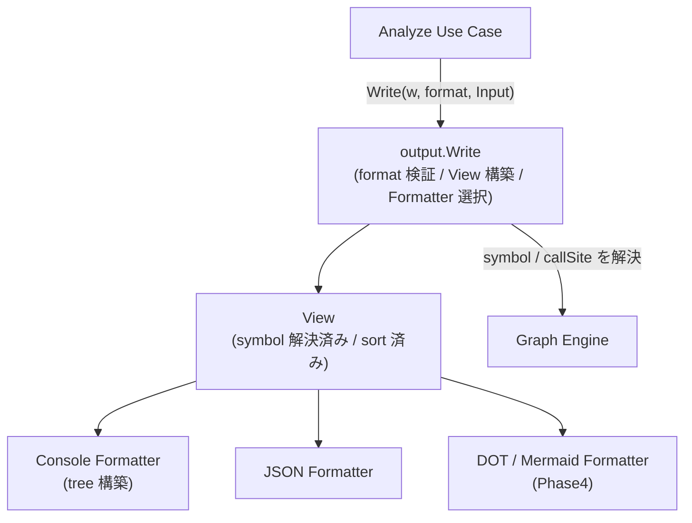

# Feature 設計: Output (Console / JSON / DOT / Mermaid 出力)

> 最終更新: 2026-07-11 / Status: 完了 (DOT / Mermaid の具体構文のみ Phase4 spec へ委譲)

Output Engine の durable な feature 設計正本。Traversal result (到達 node / edge 集合、`cycle` 注釈、`depthLimit` cutoff) を入力に、Console / JSON / DOT / Mermaid の各形式へ変換する出力契約を定義する。本 doc は **公開 entry point / Formatter・View 構造 / Console ツリー表現 (Design Doc Open Question Q3 の解) / JSON schema と版管理 / DOT・Mermaid の I/F 要件 / エラー境界** の正本であり、決定経緯と issue 単位の作業記録は [spec #7](../../../specs/7-output/) (論点 D2-D7) を参照する。

## メタ

| 項目           | 値                                                                                                                                                                                                                                |
| -------------- | --------------------------------------------------------------------------------------------------------------------------------------------------------------------------------------------------------------------------------- |
| 関連 PRD 要求  | 統合モードのため [DesignDoc の Why / What](../../DesignDoc.md#提供価値--成功条件-what)                                                                                                                                            |
| 関連 DesignDoc | [成功条件 S3](../../DesignDoc.md#提供価値--成功条件-what)、[Goal G3](../../DesignDoc.md#goal)、[モジュール責務 Output Engine](../../DesignDoc.md#モジュール責務)、[Open Questions Q3](../../DesignDoc.md#open-questions-未決事項) |
| 関連 context   | [architecture](../../../context/architecture.md)、[testing](../../../context/testing.md)、[toolchain](../../../context/toolchain.md)、[engineering](../../../context/engineering.md)                                              |
| 関連 ADR       | [ADR-0001](../../../adr/0001-analyzer-protocol-jsonl-spi.md)、[ADR-0002](../../../adr/0002-core-implementation-foundation.md)                                                                                                     |
| 関連 spec      | [specs/7-output](../../../specs/7-output/)                                                                                                                                                                                        |
| 対象モジュール | `output` (`core/internal/output`)                                                                                                                                                                                                 |

## 背景・要件解釈

調査結果の呼び出しグラフは、人が読む用途 (Console) と機械処理・可視化用途 (JSON / DOT / Mermaid) の双方で使われる (成功条件 S3 / Goal G3)。Phase1 は Console / JSON を実装し、DOT / Mermaid は実装こそ Phase4 だが **I/F は本 feature で確定**し、Phase4 で Output Engine の構造を作り直さないことを設計目標とする。

Design Doc の Open Question Q3「Console 出力のツリー表現フォーマット (深さ表示・循環参照の扱い)」は本 doc の「Console ツリー表現」節が解であり、以後本 doc を正本とする。

## スコープ

### やること

- Output package の公開 entry point と Formatter / View の構造。
- Console のツリー表現 (tree 構築規則・標識・行の書式) — Q3 の正本。
- JSON 出力の schema と版管理・後方互換方針・要素順序の決定性。
- DOT / Mermaid が表現すべき意味の要件 (G-1〜G-7)。
- 該当なし / 到達なし / 未対応 format のエラー境界。

### やらないこと

- グラフのビューワ提供 (DOT / Mermaid は構文生成まで — Non Goals)。
- DOT / Mermaid の具体構文 (ノード形状 / 色 / 線種) — Phase4 spec で確定する。
- 探索の意味論 (正本は [traversal feature doc](../traversal/DesignDoc_traversal.md))。
- graph が保持する属性の定義 (正本は [graph feature doc](../graph/DesignDoc_graph.md))。
- CLI の引数名 / exit code / エラー表示先 (CLI interface spec の対象)。Output は `error` を返すところまでを責務とする。

## 設計

### 公開 entry point と Formatter / View

`output.Write` を唯一の公開 entry point とし、format 検証 → `View` 構築 → Formatter 選択 → 描画を担う。呼び出し側 (Analyze Use Case) は `Formatter` / `View` を知らない。

```go
// core/internal/output

type Format string

const (
    FormatConsole Format = "console"
    FormatJSON    Format = "json"
    FormatDOT     Format = "dot"     // Phase4
    FormatMermaid Format = "mermaid" // Phase4
)

type Input struct {
    Graph   *graph.Graph
    Result  traversal.Result
    Request traversal.Request // direction / start を持つ (Result は保持しない)
}

// Write は Output package の唯一の公開 entry point。
//  1. f が未対応 format なら、何も書き出さずに error を返す
//  2. Input から View を構築する (symbol 解決 + sort)
//  3. f に対応する Formatter を選び、formatter.Format(w, view) を呼ぶ
func Write(w io.Writer, f Format, in Input) error

// 以下は package 内部の拡張点。

// 全 formatter が共有する中間表現 (symbol 解決済み / sort 済み)
type View struct {
    Status    traversal.Status
    Direction graph.Direction // 探索方向 (Request から引き継ぐ)
    Start     NodeView
    Nodes     []NodeView   // methodId の辞書順
    Edges     []EdgeView   // edgeId の辞書順。Cycle flag を持つ
    Cutoffs   []CutoffView // edgeId の辞書順
}

// NodeView は 1 node の Formatter 向け表現。symbol 欠落時は QualifiedName /
// Signature / Source がゼロ値 (ID のみ有効)。
type NodeView struct {
    ID            string
    QualifiedName string
    Signature     string
    Source        *protocol.SourceLocation // nil なら位置情報なし
    MinDepth      int                      // 起点からの最短距離。Result の minDepth を View 構築時に引き継ぐ
}

// EdgeView は 1 edge の Formatter 向け表現。
type EdgeView struct {
    ID       string
    CallerID string
    CalleeID string
    Cycle    bool
    CallSite *protocol.SourceLocation // nil なら位置情報なし
}

// CutoffView は 1 depthLimit cutoff edge の Formatter 向け表現。
type CutoffView struct {
    EdgeID         string
    CallerID       string
    CalleeID       string
    TargetMethodID string                   // 探索方向の接続先 (dangling する側)
    TargetMinDepth int                      // TargetMethodID の minDepth
    CallSite       *protocol.SourceLocation // nil なら位置情報なし
}

type Formatter interface {
    Format(w io.Writer, v View) error
}
```

- **Formatter は `View` 以外に依存しない**: Console / JSON いずれの出力項目も `View` / `NodeView` / `EdgeView` / `CutoffView` の field からのみ得られる (`traversal.Result` や `graph.Graph` へ直接アクセスしない)。全出力項目と対応 field の一覧は「View 境界の全数対応」節を正本とする。
- **決定性の規約は `View` 構築に 1 本化する**: `Nodes` / `Edges` / `Cutoffs` を id の辞書順に固定し、同一 Result から常に同一のバイト列を出力する。
- symbol (`QualifiedName` / `Signature` / `Source` / `CallSite`) は Graph の読み取り API から解決する ([graph feature doc](../graph/DesignDoc_graph.md) が属性の正本)。`NodeView` は symbol 欠落 (ID のみ。`startNotFound` 時の起点など) を許容する。
- `traversal.Request` を入力に含めるのは、`traversal.Result` が `direction` / `start` を保持しないため (JSON がこの 2 つを出力する)。
- **`View` は `Request` の `direction` / `start` を保持して Formatter へ運ぶ** (JSON の `direction` field と Console の子方向判定・文言分岐が必要とするため)。
- **`NodeView.MinDepth` / `CutoffView.TargetMinDepth` は `traversal.Result` の `minDepth` 公開を View 構築時に引き継ぐ** (JSON の `nodes[].minDepth` / `depthCutoffs[].targetMinDepth` が Formatter 内で `traversal.Result` に触れずに済むようにするため)。
- 出力は `io.Writer` への逐次書き出しで足り、専用の streaming 機構は導入しない (graph は全体がメモリ上にあり、出力サイズは到達集合に比例する)。

### View 境界の全数対応

Console / JSON 両 Formatter が出力する全項目と、対応する `View` field の一覧。Formatter はこの一覧に載る field 以外から情報を得ない。

| 出力項目                                                                   | View field                                                    |
| -------------------------------------------------------------------------- | ------------------------------------------------------------- |
| status                                                                     | `View.Status`                                                 |
| direction (Console の子方向判定 / JSON の `direction`)                     | `View.Direction`                                              |
| 起点の methodId / qualifiedName / signature / 宣言位置                     | `View.Start.ID` / `.QualifiedName` / `.Signature` / `.Source` |
| start (JSON)                                                               | `View.Start.ID`                                               |
| nodes[] の methodId / qualifiedName / signature                            | `View.Nodes[].ID` / `.QualifiedName` / `.Signature`           |
| nodes[].minDepth                                                           | `View.Nodes[].MinDepth`                                       |
| nodes[].sourceLocation                                                     | `View.Nodes[].Source`                                         |
| edge 両端 methodId (Console) / callerMethodId・calleeMethodId (JSON)       | `View.Edges[].CallerID` / `.CalleeID`                         |
| edges[].edgeId                                                             | `View.Edges[].ID`                                             |
| edge の callSite (Console 子行の位置 / JSON `callSite`)                    | `View.Edges[].CallSite`                                       |
| cycle flag                                                                 | `View.Edges[].Cycle`                                          |
| cutoff の到達側 endpoint (Console) / callerMethodId・calleeMethodId (JSON) | `View.Cutoffs[].CallerID` / `.CalleeID`                       |
| cutoff 件数 (Console の `N edges cut`)                                     | `len(View.Cutoffs)` を対象 node 単位に集計                    |
| depthCutoffs[].edgeId                                                      | `View.Cutoffs[].EdgeID`                                       |
| depthCutoffs[].targetMethodId                                              | `View.Cutoffs[].TargetMethodID`                               |
| depthCutoffs[].targetMinDepth                                              | `View.Cutoffs[].TargetMinDepth`                               |
| depthCutoffs[].callSite                                                    | `View.Cutoffs[].CallSite`                                     |

### エラー境界

`startNotFound` と「到達なし」は**正常系**として各形式で明示する。Output Engine が `error` を返すのは次の 2 つのみ。

| ケース                                              | Console                                                                   | JSON                                         | DOT / Mermaid           | 戻り値                                        |
| --------------------------------------------------- | ------------------------------------------------------------------------- | -------------------------------------------- | ----------------------- | --------------------------------------------- |
| 起点不在 (`status=startNotFound`)                   | `該当なし: 起点メソッドが解析結果に存在しません (<start>)`                | `status: "startNotFound"` + 空配列           | 空グラフの有効構文      | `nil`                                         |
| 到達なし (`Edges` も `Cutoffs` も空)                | root 行 + `└─ (呼び出し元なし)` (callee 方向は `(呼び出し先なし)`)        | 起点 1 件 + 空 `edges`                       | 起点 node のみ          | `nil`                                         |
| `Edges` は空だが `Cutoffs` が非空 (`maxDepth=0` 等) | root 行 + `… (depth limit: N edges cut)`。`(呼び出し元なし)` とは出さない | 起点 1 件 + 空 `edges` + 非空 `depthCutoffs` | 起点 node + cutoff 表現 | `nil`                                         |
| 未対応 format 指定                                  | —                                                                         | —                                            | —                       | `error` (出力前に validation。対応形式を案内) |
| `io.Writer` への書き込み失敗                        | —                                                                         | —                                            | —                       | `error`                                       |

- 「到達なし」の判定は **`Edges` が空 かつ `Cutoffs` も空**。`maxDepth=0` では起点の隣接 edge が cutoff になる (起点 self-loop は誘導 edge として残る — traversal feature doc の `maxDepth=0` 契約) ため、`Edges` 空だけで判定してはならない。
- 該当なし / 到達なしの分岐は各 Formatter の内部で行う (`View.Status` / `Edges` / `Cutoffs` の 3 つを見る)。見せ方が形式ごとに異なるため、`Write` は status で分岐しない。
- exit code とエラー表示先は CLI の責務。

### Console ツリー表現 (Q3 の正本)

Traversal result は tree ではなく集合であるため、tree 化の規則を Output 側の仕様として定義する。

#### tree 構築規則

1. **root** = 起点 node。
2. **子** = 誘導 edge 集合 (`View.Edges`) を探索方向に辿った先の node。caller 方向なら子は「呼び出し元」、callee 方向なら「呼び出し先」。
3. **兄弟の順序** = `qualifiedName` → `signature` → `methodId` の辞書順 (出力の決定性を担保)。
4. **展開順序** = 上記順序の pre-order DFS。**node の展開に入る時点で、その node 自身を「展開済み」に記録し「経路上の祖先集合」に加える** (root を含む)。これにより self-loop も規則 6 の `(cycle)` になり、root の self-loop で root が再展開されることもない。
5. **初出のみ展開** = 部分木を展開するのは tree 中で最初に出現したときの 1 回のみ。出力行数は O(到達 edge 数) に収まり、**停止性はこの規則だけで保証される**。
6. **再登場 node の標識** = 展開しない葉に 2 種類の標識を付ける。判定は Console formatter が DFS 中に保持する経路 (祖先集合) で行い、**`Result.Cycles` (= `View.Edges[].Cycle` として運ばれる) は使わない** (この flag は同一 SCC の誘導 edge すべてを注釈するグラフ全体の性質であり、打ち切りに使うと 3 要素 SCC で最初の edge が切られ node が tree から消える):
   - **`(cycle)`** = 現在の経路上の祖先に戻る edge (back edge) の先。
   - **`(既出)`** = 祖先ではないが、別の枝で展開済みの node (合流)。
7. **`… (depth limit: N edges cut)`** = cutoff edge の到達側 endpoint の子として、**子の最後に** 1 行出す。N はその node からの cutoff edge 数。cutoff 先 (`targetMethodId`) は到達集合外のため名前を出さない。
8. **到達なし** (`Edges` も `Cutoffs` も空) = root 行 + `(呼び出し元なし)` / `(呼び出し先なし)`。`Edges` が空でも `Cutoffs` が非空なら規則 7 の cutoff 行を出す。
9. **`startNotFound`** = tree を組まず、エラー境界の表に従った文言を出す。

#### 行の書式

- node ラベル = `qualifiedName` + `signature`。
- 位置情報: 子行は `edge.CallSite` (呼び出し箇所)、root は宣言位置 (`Symbol.Source`)。欠落時は位置表記を省略する。メソッドの宣言位置は Console では出さない (JSON が両方持つ)。

```text
UserService.findById(Long)  [UserService.java:42]
├─ UserController.getUser(Long)  [UserController.java:31]
│  └─ ApiFilter.doFilter()  [ApiFilter.java:20]
├─ AdminController.getUser(Long)  [AdminController.java:18]
│  └─ ApiFilter.doFilter()  (既出)
├─ UserBatch.execute()  [UserBatch.java:55]
│  └─ … (depth limit: 2 edges cut)
└─ CacheWarmer.warm()  [CacheWarmer.java:8]
   └─ Scheduler.run()  [Scheduler.java:12]
      └─ UserService.findById(Long)  (cycle)
```

### JSON 出力 (schema と版管理)

フラットな graph (`nodes[]` / `edges[]` / `depthCutoffs[]`) として出力し、tree にはしない。field 名は Analyzer Protocol の語彙を踏襲する。

```json
{
  "schemaVersion": "1.0",
  "status": "ok",
  "direction": "caller",
  "start": "<methodId>",
  "nodes": [
    {
      "methodId": "<methodId>",
      "qualifiedName": "com.example.UserService.findById",
      "signature": "(java.lang.Long)",
      "minDepth": 0,
      "sourceLocation": {
        "path": "src/main/java/com/example/UserService.java",
        "startLine": 42
      }
    }
  ],
  "edges": [
    {
      "edgeId": "<edgeId>",
      "callerMethodId": "<methodId>",
      "calleeMethodId": "<methodId>",
      "cycle": false,
      "callSite": {
        "path": "src/main/java/com/example/UserController.java",
        "startLine": 31
      }
    }
  ],
  "depthCutoffs": [
    {
      "edgeId": "<edgeId>",
      "callerMethodId": "<methodId>",
      "calleeMethodId": "<methodId>",
      "targetMethodId": "<methodId>",
      "targetMinDepth": 3,
      "callSite": { "path": "...", "startLine": 12 }
    }
  ]
}
```

- `status` = `ok` / `startNotFound`。`direction` = `caller` / `callee`。
- `edges[].cycle` は `Result.Cycles` (同一 SCC の誘導 edge) に対応し、**false でも省略しない**。
- `nodes[].minDepth` は起点からの最短距離 (traversal feature doc の `minDepth` 公開を参照)。
- `sourceLocation` / `callSite` は欠落時 field ごと省略する。
- **`depthCutoffs[].targetMethodId` は探索方向の接続先** (= dangling する側): `direction=caller` なら `callerMethodId`、`callee` なら `calleeMethodId` と同値。cutoff 先の node は到達集合外のため **`nodes[]` に存在しない**。`targetMinDepth` はこの `targetMethodId` の minDepth。
- **要素順序**: `nodes[]` は `methodId`、`edges[]` / `depthCutoffs[]` は `edgeId` の辞書順に固定する。

#### 版管理

- `schemaVersion` は **Analyzer Protocol と独立の採番** (Protocol は Analyzer ↔ Core、本 schema は Core ↔ 利用者の契約で、変更理由が独立)。
- field の追加は後方互換 (additive、minor)。削除 / 意味変更 / 型変更は破壊的変更 (major)。利用者は未知 field を無視できることを前提にする。

### DOT / Mermaid の I/F 要件 (Phase4 実装)

具体構文は Phase4 spec に委譲する。Phase4 実装は次を満たすこと (I/F の手直しを不要にするための意味要件)。

| #   | 要件                                                                                                    |
| --- | ------------------------------------------------------------------------------------------------------- |
| G-1 | 到達 node / edge 集合をグラフとしてそのまま描く (tree に潰さない。Console の tree 構築規則は適用しない) |
| G-2 | 起点 node を他と区別できる                                                                              |
| G-3 | `cycle` 注釈付き edge を他と区別できる                                                                  |
| G-4 | `depthLimit` cutoff がある node に「続きがある」ことを示せる (cutoff 先の名前は出せない)                |
| G-5 | node ラベルは `qualifiedName` + `signature` (Console と同じ語彙)                                        |
| G-6 | 同一 Result から常に同一のバイト列を出力する (要素順序は id の辞書順)                                   |
| G-7 | 外部ツール (Graphviz / Mermaid レンダラ) がパース可能な構文であること                                   |

### 画面・デザイン

非該当。depwalk は CLI ツールであり、ビューワは提供しない (Non Goals)。

### コンポーネント構成 (C4 L3)



### フロー / シーケンス

主要フロー (出力全体 / Console tree 構築 / sequence) の詳細図は [spec #7 のフロー / シーケンス](../../../specs/7-output/index.md#フロー--シーケンス) を参照する (決定時の図。規範は本 doc の各節)。

## 主要シナリオ / フロー

- 呼び出し側 (Analyze Use Case) は Traversal result と出力形式を指定して `output.Write` を呼ぶ。未対応 format は出力を書き出す前にエラーになる。
- 開発者 / 保守担当は Console のツリーで呼び出し関係を読む。合流は `(既出)`、循環は `(cycle)`、深さ上限は `… (depth limit: N edges cut)` で読み取れる。
- CI パイプラインは JSON を保存・後処理する。`minDepth == 1` で直接の呼び出し元だけを抽出する、といった後処理が JSON 単体で完結する。
- ドキュメント作成者は DOT / Mermaid (Phase4) の出力を外部レンダラに渡して図を得る。

## テスト観点

横断規約は [context/testing.md](../../../context/testing.md)。本 feature 固有の観点を記す。

- 各 formatter の出力を golden file と比較する unit test で担保する (golden は `core/internal/output/testdata/golden/`)。golden 比較は書式と決定性 (同一 Result → 同一バイト列) を同時に検証する。
- fixture ケース: 循環 (self-loop / 相互再帰 / 3 要素 SCC) / 合流 (ダイヤモンド) / `depthLimit` cutoff / 到達なし (`Edges` も `Cutoffs` も空) / `maxDepth=0` (`Edges` 空 + `Cutoffs` 非空) / `maxDepth=0` + 起点 self-loop / `startNotFound`。
- Console: 3 要素 SCC で全 node が tree に現れること (`(cycle)` は back edge の先のみ)。self-loop が `(既出)` でなく `(cycle)` になること。root の self-loop で部分木が二重出力されないこと。`maxDepth=0` で `(呼び出し元なし)` を出さず cutoff 行を出すこと。
- JSON: `encoding/json` でパースできること (S3)。`targetMethodId` が `nodes[]` に存在しない (dangling) ことを caller / callee 両方向で検証すること。`cycle: false` が省略されないこと。
- エラー境界: 未対応 format が出力を書き出す前に `error` になり、`startNotFound` / 到達なしが `error` にならないこと。
- S3 の照合は **Output 層 (本 doc の unit / golden) と CLI 層 (CLI interface spec 完了後)** の 2 層からなる (S1/S2 と同じ分界)。

## 上位資料からの変更点

| 対象資料    | 変更種別 (継承 / 追記 / 変更提案) | 内容                                                                                                                                           |
| ----------- | --------------------------------- | ---------------------------------------------------------------------------------------------------------------------------------------------- |
| PRD         | 継承                              | 統合モードのため DesignDoc の Why / What を参照                                                                                                |
| DesignDoc   | 追記 / 変更提案                   | Q3 を解決済みへ更新 (本 doc が正本)。S3 の測定方法に 2 層照合を追記。モジュール責務の Output Engine 依存先に Traversal Engine を追加 (C4 図も) |
| feature doc | 変更提案                          | [traversal feature doc](../traversal/DesignDoc_traversal.md) の Traversal result に `minDepth` の公開を追加 (additive)                         |
| context     | 追記                              | `context/architecture.md` に Output → Traversal 依存を追加。`context/testing.md` に S3 の 2 層照合と package-local `testdata/` を補足          |
| ADR         | 継承                              | ADR-0001 / ADR-0002 の範囲内。新規 ADR 不要 (出力 schema の版管理は本 doc が正本を持つ)                                                        |
