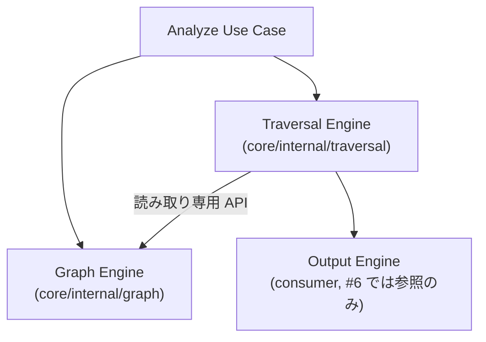
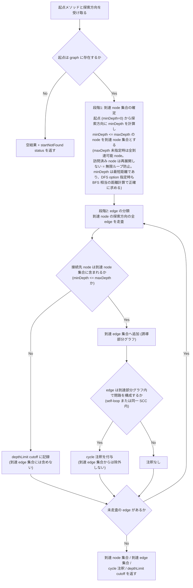
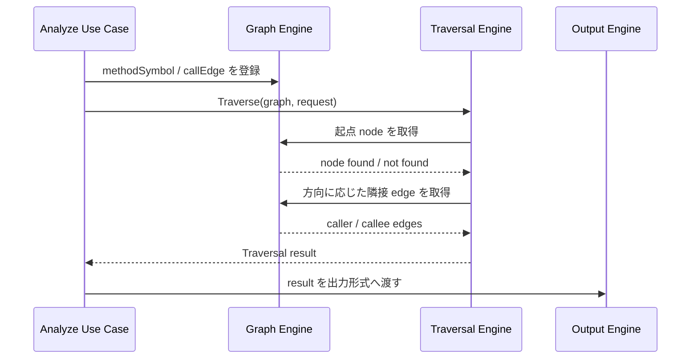

# Feature 設計: Traversal (Caller / Callee 探索)

> 最終更新: 2026-07-08 / Status: 完了

Traversal Engine の durable な feature 設計正本。Graph Engine が保持する node / edge を入力に、caller / callee 方向の到達集合を計算する探索エンジンの API・結果モデル・打ち切り意味論を定義する。本 doc は Traversal result の契約 (到達 node / edge 集合、`cycle` 注釈、`depthLimit` cutoff) の正本であり、決定経緯と issue 単位の作業記録は [spec #6](../../../specs/6-traversal/) を参照する。

## メタ

| 項目           | 値                                                                                                                                                                                                  |
| -------------- | --------------------------------------------------------------------------------------------------------------------------------------------------------------------------------------------------- |
| 関連 PRD 要求  | 統合モードのため [DesignDoc の Why / What](../../DesignDoc.md#提供価値--成功条件-what)                                                                                                              |
| 関連 DesignDoc | [成功条件 S1/S2](../../DesignDoc.md#提供価値--成功条件-what)、[モジュール責務 Traversal Engine](../../DesignDoc.md#モジュール責務)、[Open Questions Q4](../../DesignDoc.md#open-questions-未決事項) |
| 関連 context   | [architecture](../../../context/architecture.md)、[testing](../../../context/testing.md)、[toolchain](../../../context/toolchain.md)、[engineering](../../../context/engineering.md)                |
| 関連 ADR       | [ADR-0001](../../../adr/0001-analyzer-protocol-jsonl-spi.md)、[ADR-0002](../../../adr/0002-core-implementation-foundation.md)                                                                       |
| 関連 spec      | [specs/6-traversal](../../../specs/6-traversal/)                                                                                                                                                    |
| 対象モジュール | `traversal` (`core` から呼び出される)                                                                                                                                                               |

## 背景・要件解釈

depwalk の Phase1 は、指定メソッドの caller / callee を探索し、既知の呼び出し関係集合と一致する結果を返すことを成功条件 (S1 / S2) にしている。Analyzer Protocol / SPI (analyzer-protocol feature) が Core 側に `methodSymbol` / `callEdge` を渡せる境界を提供した後、Graph Engine が構築した呼び出しグラフを入力に、Traversal Engine が caller / callee 方向へ到達集合を計算する。

本 feature は Design Doc の Open Question Q4「循環呼び出し・再帰の探索打ち切り条件」を解き、探索 API、探索結果モデル、循環 / 深さ上限の意味論を確定する。

## スコープ

### やること

- caller 方向 / callee 方向の探索 API を提供する。
- 探索方向、起点メソッド、深さ上限、探索順序 (BFS / DFS) を受け取る。
- 循環呼び出し / 再帰を検出し、無限ループせず観測可能な形で結果に含める。
- 深さ上限到達を検出し、打ち切り情報を結果に含める。
- Graph Engine が公開する読み取り API 経由で探索する (Graph の内部構造に依存しない)。

### やらないこと

- Java ソースの解析、型解決、DI 解決は行わない (`java-analyzer` の責務)。
- Analyzer Protocol / SPI / Model schema は再定義しない (正本は analyzer-protocol feature doc と ADR-0001)。
- Output Engine の Console / JSON / DOT / Mermaid 表現は決めない。
- CLI `depwalk analyze` の引数、exit code、エラー表示は決めない (CLI interface spec の対象)。
- 永続ストア、キャッシュ、並列探索、分散処理は扱わない。

## 設計

### データ構造 / コンテンツモデル

Traversal は起点 method ID、方向 (`caller` / `callee`)、深さ上限 (任意)、探索順序 (`bfs` / `dfs`、未指定時 `bfs`) を受け取り、到達 node 集合、到達 edge 集合、status、`cycle` 注釈、`depthLimit` cutoff を返す。

| 概念              | 主な field / 値                                                                                    | 備考                                                                                                                                                   |
| ----------------- | -------------------------------------------------------------------------------------------------- | ------------------------------------------------------------------------------------------------------------------------------------------------------ |
| Traversal request | 起点 method ID、方向、深さ上限 (任意、未指定時は無制限)、探索順序 (未指定時は `bfs`)               | CLI 引数名は CLI interface spec で決める                                                                                                               |
| Traversal result  | 到達 node 集合、到達 edge 集合、status (`ok` / `startNotFound`)、`cycle` 注釈、`depthLimit` cutoff | Output Engine が consumer。tree は保持しない。到達 node / edge 集合は順序を保証しない                                                                  |
| Cycle 注釈        | 対象 edge の集合                                                                                   | 到達部分グラフ内で閉路を構成する edge (self-loop、または同一 SCC 内の edge)。**到達 edge 集合にも含まれる** (呼び出し関係として実在するため除外しない) |
| DepthLimit cutoff | 対象 edge の集合、接続先 node の minDepth                                                          | 到達 node から `minDepth > maxDepth` の node への edge。**到達 edge 集合には含まれない**。対象は edge のみで node 自体は cutoff 対象にしない           |

#### 到達集合の定義

結果は探索の副産物 (どの edge を辿ったか) ではなく、グラフの性質として定義する。これにより結果は探索順序 (BFS / DFS) に一切依存せず決定的になる。

- **minDepth**: 起点から探索方向に沿った最短距離。起点自身は 0。合流 (複数経路で同一 node へ到達するダイヤモンド型構造) がある場合、最短の距離を採る。
- **到達 node 集合**: `minDepth <= maxDepth` を満たす node (maxDepth 未指定時は全到達可能 node)。起点を含む。
- **到達 edge 集合**: 両端が到達 node 集合に属する、探索方向に沿った全 edge (誘導部分グラフ)。合流 edge も `cycle` 注釈付き edge も含む。
- **`maxDepth=0`**: 起点 node のみを到達集合に含み、起点の隣接 edge は `depthLimit` cutoff になる。ただし起点自身への self-loop は両端が到達 node のため、誘導 edge (+ `cycle` 注釈) として到達 edge 集合に残る (誘導部分グラフ定義からの帰結)。

呼び出しグラフでは、共有メソッドが複数箇所から呼ばれる合流構造が一般的である。探索木 edge 方式 (実際に辿った edge のみを結果に含める) では、この合流構造において BFS / DFS の選択によってどの edge が結果に残るかが変わってしまい、かつ循環していない合流 edge を誤って循環と標識してしまう。誘導部分グラフ + SCC 判定による定義は、この両方の問題を構造的に解消する。

訪問済み node 管理 (再展開の抑止) は無限ループ防止のための内部実装機構であり、結果契約には現れない。

### 画面・デザイン

非該当。depwalk は CLI ツールであり、本 feature は Web UI / IDE Plugin を提供しない。

### コンポーネント構成 (C4 L3)

Traversal Engine は `core/internal/traversal` に閉じ、Graph の node / edge 管理には関与しない。Graph が公開する読み取り API 経由でのみ探索する。Analyzer 固有情報や Java 固有 metadata を分岐条件にしない。

### フロー / シーケンス

処理は「到達 node 集合の確定」→「誘導 edge 集合と注釈の構築」の 2 段階で行う。段階 1 の訪問順序 (BFS / DFS) は結果に影響しない。

## 主要シナリオ / フロー

- 呼び出し側は起点メソッド、探索方向、深さ上限、探索順序を指定して Traversal Engine を呼び出す。探索順序を未指定にした場合は BFS、深さ上限を未指定にした場合は無制限として扱う。
- 起点メソッドが graph に存在しない場合、Traversal Engine は空の到達集合と `startNotFound` status を返す。Graph が空の場合も同様に `startNotFound` として扱う。
- Traversal Engine は caller または callee 方向に graph を辿り、到達 node 集合 (minDepth <= maxDepth の node)、到達 edge 集合 (到達 node 間の誘導 edge)、`cycle` 注釈 (閉路を構成する edge)、`depthLimit` cutoff を返す。
- Output Engine は Traversal 結果を受け取り、Console / JSON / DOT / Mermaid の各形式へ変換する。Console tree が必要な場合も、tree 構築は Output 側で行う (Traversal は tree 表現を保持しない)。

## テスト観点

横断規約は [context/testing.md](../../../context/testing.md)。本 feature 固有の観点を記す。

- caller / callee 方向で既知の呼び出し元 / 呼び出し先集合を返せること。
- 探索順序未指定時に内部訪問順序が BFS になること (到達集合自体の順序は検証しない。white-box test で検証)。
- 自己再帰 / 相互再帰 (SCC) を含む graph で、閉路を構成する edge が `cycle` 注釈を持ちつつ到達 edge 集合にも含まれること。
- 合流 (ダイヤモンド型) graph で、同一 node への複数経路の edge がすべて到達 edge 集合に含まれ、`cycle` と誤標識されないこと。
- BFS / DFS のどちらを指定しても、到達 node / edge 集合・`cycle` 注釈・`depthLimit` cutoff の内容が同一であること (順序非依存性)。
- 深さ上限指定時に `minDepth <= maxDepth` の node を到達集合に含め、`minDepth > maxDepth` の node への edge を `depthLimit` cutoff として記録できること (`maxDepth=0` の境界ケースを含む)。
- 起点メソッドが存在しない場合、および Graph が空の場合に panic せず空結果 + `startNotFound` status を返すこと。
- Traversal が Analyzer 実装や Output format に依存しないこと。

## 上位資料からの変更点

| 対象資料  | 変更種別 (継承 / 追記 / 変更提案) | 内容                                                                                                                   |
| --------- | --------------------------------- | ---------------------------------------------------------------------------------------------------------------------- |
| PRD       | 継承                              | 統合モードのため DesignDoc の Why / What を参照                                                                        |
| DesignDoc | 追記                              | Open Questions Q4 を解決済みへ更新 (本 doc を正本として参照)。成功条件 S1/S2 の測定方法に Traversal 層照合の補足を追加 |
| context   | 追記                              | `context/testing.md` E2E (照合) 行に、S1/S2 が Traversal 層照合 (本 doc 正本) と CLI 出力照合の 2 層からなる旨を追記   |
| ADR       | 継承                              | ADR-0001 (Protocol/Model 境界) / ADR-0002 (Core package 境界) の範囲内。新規 ADR 不要                                  |
