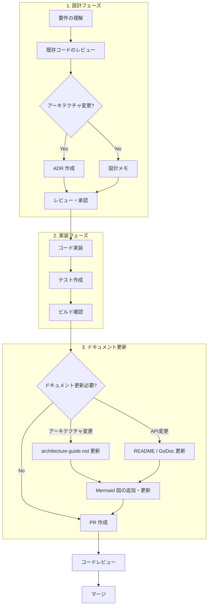
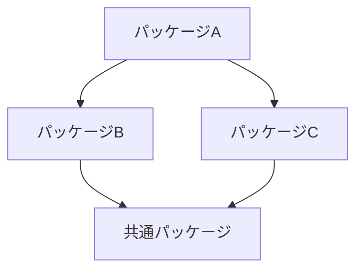
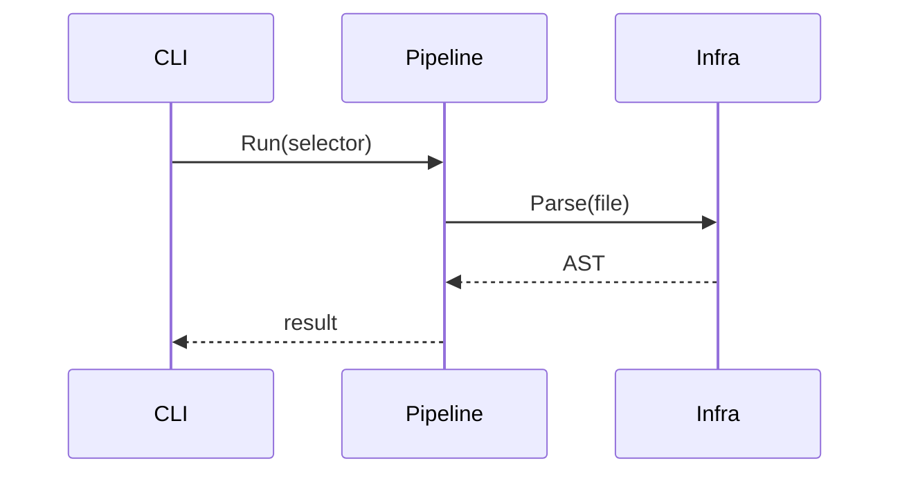

# Contributing to depwalk

このドキュメントは depwalk への貢献方法と開発ワークフローを説明します。

## 目次

1. [開発ワークフロー](#開発ワークフロー)
2. [設計フェーズ](#設計フェーズ)
3. [実装フェーズ](#実装フェーズ)
4. [ドキュメント更新フェーズ](#ドキュメント更新フェーズ)
5. [レビューチェックリスト](#レビューチェックリスト)

---

## 開発ワークフロー

depwalk では **設計 → 実装 → ドキュメント化** のサイクルを重視します。



---

## 設計フェーズ

### 1. 要件の理解

- Issue や要望を明確化
- 影響範囲を特定（どのパッケージに影響するか）
- 既存の Design Doc / PRD との整合性を確認

### 2. 既存コードのレビュー

変更を加える前に、関連コードを必ずレビューする：

```bash
# 関連ファイルの確認
tree internal/pipeline/
go doc ./internal/pipeline/...

# 依存関係の確認
go mod graph | grep depwalk
```

### 3. ADR（Architecture Decision Record）の作成

**以下の場合は ADR を作成する**：

| 条件                   | 例                                         |
| ---------------------- | ------------------------------------------ |
| パッケージ構成の変更   | 新しいパッケージの追加、既存の統合・分割   |
| 新しい外部依存の追加   | 新しいライブラリの導入                     |
| インターフェースの変更 | `pipeline.Parser` にメソッド追加など       |
| データフローの変更     | 新しいステージの追加                       |
| 重要な技術的決定       | キャッシュ戦略、エラーハンドリング方針など |

#### ADR テンプレート

```markdown
# ADR XXXX: [タイトル]

## ステータス

提案中（Proposed） / 承認済み（Accepted） / 非推奨（Deprecated）

## 日付

YYYY-MM-DD

## コンテキスト

[背景と課題を説明]

## 決定

[何を決定したか]

## 結果

### 良い影響

- ...

### 悪い影響

- ...

## 参照

- [関連リンク]
```

ADR ファイルは `docs/adr/` に配置：

```
docs/adr/
├── 0001-hybrid-pipeline-architecture.md
├── 0002-package-structure.md
└── 0003-your-new-decision.md  # 連番で追加
```

---

## 実装フェーズ

### 1. ブランチ作成

```bash
git checkout -b feature/your-feature-name
```

### 2. 実装

[アーキテクチャガイドライン](./architecture-guide.md) に従って実装：

- 依存の方向を守る（model ← pipeline ← infra）
- インターフェースは `pipeline/stage.go` に定義
- 外部依存は `infra/` に隔離

### 3. テスト

```bash
go test ./...
```

### 4. ビルド確認

```bash
go build ./...
go vet ./...
```

---

## ドキュメント更新フェーズ

### 更新が必要なケース

| 変更内容             | 更新するドキュメント                       |
| -------------------- | ------------------------------------------ |
| パッケージ追加・変更 | `docs/architecture-guide.md`               |
| インターフェース変更 | `docs/architecture-guide.md`, GoDoc        |
| CLI オプション変更   | `README.md`, コマンドヘルプ                |
| アーキテクチャ決定   | `docs/adr/` に新規 ADR                     |
| データフロー変更     | `docs/architecture-guide.md` の Mermaid 図 |

### Mermaid 図の追加・更新

ドキュメントには積極的に Mermaid 図を使用：

```markdown
## 使用する図の種類

1. **flowchart** - データフロー、処理フロー
2. **graph TD/LR** - 依存関係、構成図
3. **sequenceDiagram** - コンポーネント間のやりとり
4. **classDiagram** - インターフェース、構造体の関係
5. **quadrantChart** - トレードオフ分析（ADR 用）
```

#### 例：依存関係図



#### 例：シーケンス図



### ドキュメント更新チェックリスト

- [ ] 新しいパッケージを追加した場合、`architecture-guide.md` の構成図を更新
- [ ] 新しいインターフェースを追加した場合、クラス図を更新
- [ ] データフローが変わった場合、フローチャートを更新
- [ ] ADR を書いた場合、関連するガイドラインからリンク
- [ ] 公開 API を変更した場合、README を更新

---

## レビューチェックリスト

PR を出す前に確認：

### コード

- [ ] `go build ./...` が成功する
- [ ] `go test ./...` が成功する
- [ ] `go vet ./...` で警告がない
- [ ] 依存の方向が正しい（循環依存がない）
- [ ] 新しいパッケージは適切な場所に配置されている

### ドキュメント

- [ ] ADR が必要な変更には ADR がある
- [ ] `architecture-guide.md` が最新の構成を反映している
- [ ] Mermaid 図が正しく表示される
- [ ] 公開 API の変更は README に反映されている

### コミット

- [ ] コミットメッセージが明確
- [ ] 関連する Issue がリンクされている

---

## 参照

- [Architecture Guide](./architecture-guide.md)
- [ADR 0001: ハイブリッド・パイプラインアーキテクチャ](./adr/0001-hybrid-pipeline-architecture.md)
- [ADR 0002: パッケージ構造の設計](./adr/0002-package-structure.md)
