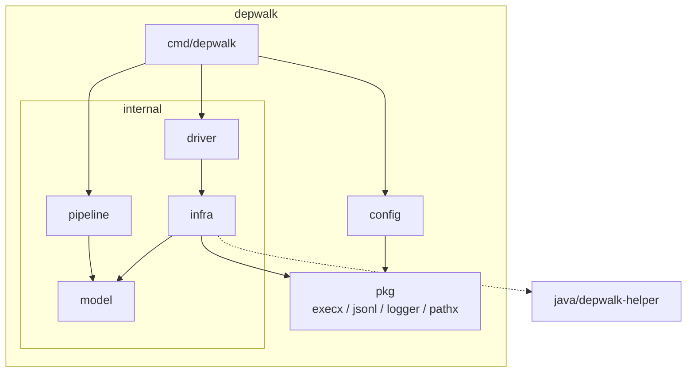
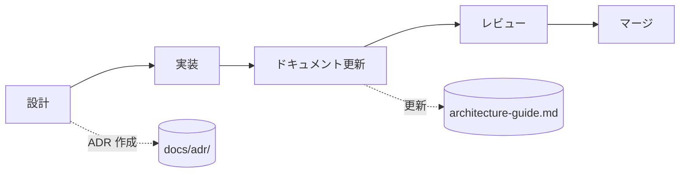
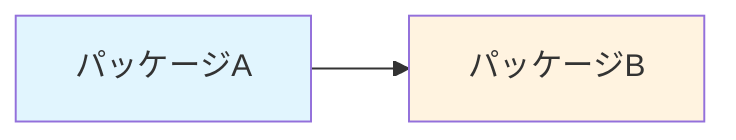

# depwalk ドキュメント

このディレクトリには depwalk の設計・開発ドキュメントが含まれています。

## ドキュメント一覧

| ドキュメント                                     | 内容                                 | 対象者               |
| ------------------------------------------------ | ------------------------------------ | -------------------- |
| [architecture-guide.md](./architecture-guide.md) | アーキテクチャ概要と開発ガイドライン | 開発者               |
| [CONTRIBUTING.md](./CONTRIBUTING.md)             | 貢献方法と開発ワークフロー           | コントリビューター   |
| [adr/](./adr/)                                   | Architecture Decision Records        | 開発者・アーキテクト |

## アーキテクチャ概要

## ADR（Architecture Decision Records）

重要なアーキテクチャ決定は ADR として記録しています。

| ADR                                                | タイトル                                 | ステータス |
| -------------------------------------------------- | ---------------------------------------- | ---------- |
| [0001](./adr/0001-hybrid-pipeline-architecture.md) | ハイブリッド・パイプラインアーキテクチャ | 承認済み   |
| [0002](./adr/0002-package-structure.md)            | パッケージ構造の設計                     | 承認済み   |

## 開発ワークフロー

詳細は [CONTRIBUTING.md](./CONTRIBUTING.md) を参照してください。

## 図の規約

ドキュメントでは Mermaid を使用して図を作成します。

### 使用する図の種類

| 種類              | 用途                     | 例               |
| ----------------- | ------------------------ | ---------------- |
| `flowchart`       | データフロー、処理フロー | パイプライン処理 |
| `graph TD/LR`     | 依存関係、構成図         | パッケージ依存   |
| `sequenceDiagram` | コンポーネント間通信     | API 呼び出し     |
| `classDiagram`    | 型・インターフェース関係 | model 構造       |
| `quadrantChart`   | トレードオフ分析         | ADR での比較     |

### 命名規約

- ノード名は英語（大文字始まり）
- ラベルは日本語可
- 色は `style` で指定（一貫性を保つ）

