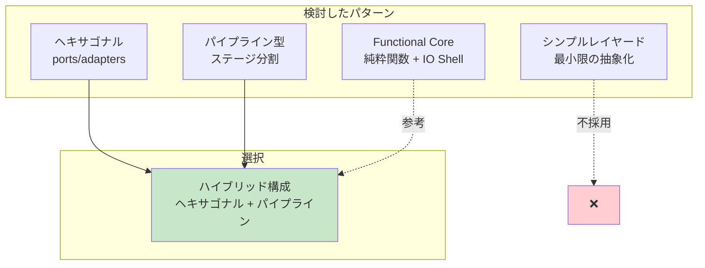
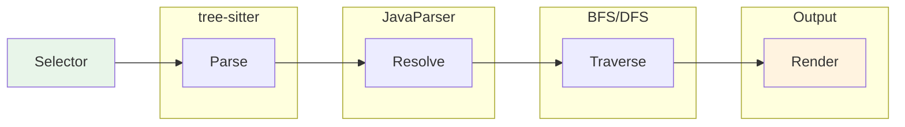
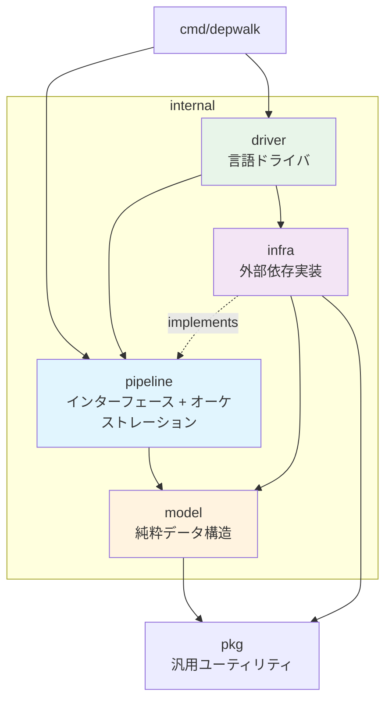
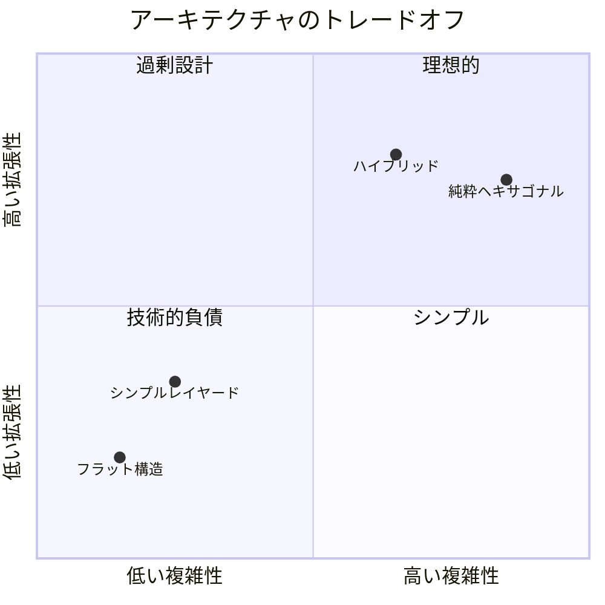

# ADR 0001: ハイブリッド・パイプラインアーキテクチャの採用

## ステータス

承認済み（Accepted）

## 日付

2026-01-03

## コンテキスト

depwalk は Java/Spring Boot プロジェクトのメソッド呼び出し依存関係を解析する CLI ツールである。
主な技術的課題として以下がある：

1. **データフローの明確性**: `selector → parse → resolve → traverse → render` という一方向のフローが存在
2. **外部依存の隔離**: tree-sitter（高速 AST）と JavaParser（厳密な型解決）という異なる技術を組み合わせる
3. **テスタビリティ**: 各処理段階を独立してテストしたい
4. **拡張性**: 将来的に Kotlin 等の他言語をサポートしたい

### 検討したアーキテクチャパターン



## 決定

**ヘキサゴナルアーキテクチャとパイプライン型のハイブリッド構成**を採用する。

### 採用理由

1. **パイプライン型の視点**

   - depwalk のデータフローは本質的に一方向パイプライン
   - 各ステージ（parse → resolve → traverse → render）が明確に分離可能
   - Design Doc のフローチャートがそのままコード構造に反映される

2. **ヘキサゴナルの視点**
   - 外部依存（tree-sitter, JavaParser, Gradle）をインターフェースで隔離
   - テスト時にモック差し替えが容易
   - 言語ドライバ（Java, 将来の Kotlin）の差し替えが可能

### パイプラインフロー



### ディレクトリ構成

```
depwalk/
├── cmd/depwalk/           # CLI エントリポイント
│   ├── main.go
│   ├── root.go
│   ├── callees.go
│   └── callers.go
├── internal/
│   ├── model/             # ドメインモデル（純粋なデータ構造）
│   │   ├── methodid.go
│   │   ├── callsite.go
│   │   ├── graph.go
│   │   ├── selector.go
│   │   └── errors.go
│   ├── pipeline/          # パイプライン定義とオーケストレーション
│   │   ├── stage.go       # インターフェース定義
│   │   ├── config.go
│   │   ├── deps.go
│   │   ├── callees.go     # callees パイプライン
│   │   └── callers.go     # callers パイプライン
│   ├── infra/             # 外部依存の実装（旧 adapters）
│   │   ├── treesitter/    # tree-sitter 実装
│   │   ├── javahelper/    # JavaParser 実装
│   │   ├── gradle/        # Gradle classpath 取得
│   │   ├── cache/         # キャッシュ実装
│   │   └── output/        # 出力フォーマッタ
│   └── driver/            # 言語ドライバ（旧 lang）
│       ├── driver.go
│       ├── registry.go
│       └── java.go
├── pkg/                   # 再利用可能なユーティリティ
│   ├── execx/
│   ├── jsonl/
│   └── pathx/
└── java/                  # Java ヘルパープロセス
    └── depwalk-helper/
```

### 依存関係のルール



- `model`: 外部依存なし、純粋なデータ構造
- `pipeline`: ビジネスロジックのオーケストレーション
- `infra`: 外部システムとの接続（tree-sitter, Java helper, Gradle）
- `driver`: 言語固有の設定とコンポーネントバンドル
- `pkg`: 汎用ユーティリティ（他プロジェクトでも再利用可能）

## 結果

### トレードオフ分析



### 良い影響

1. **明確なデータフロー**: パイプラインの各ステージが視覚的に理解しやすい
2. **テスト容易性**: インターフェースによるモック差し替えが可能
3. **拡張性**: 新しい言語ドライバの追加が容易
4. **関心の分離**: model は純粋、infra は外部依存を隠蔽

### 悪い影響

1. **初期の複雑性**: 小規模プロジェクトには過剰な可能性
2. **インターフェースの増加**: 抽象化レイヤーが増える

### 中立的な影響

1. **学習コスト**: 新規コントリビューターは構成を理解する必要がある（この ADR で軽減）

## 参照

- [Design Doc: depwalk](../design/design-doc.md)
- [PRD: depwalk](../design/prd.md)
- [Hexagonal Architecture (Alistair Cockburn)](https://alistair.cockburn.us/hexagonal-architecture/)
- [Pipeline Pattern](https://www.enterpriseintegrationpatterns.com/patterns/messaging/PipesAndFilters.html)
