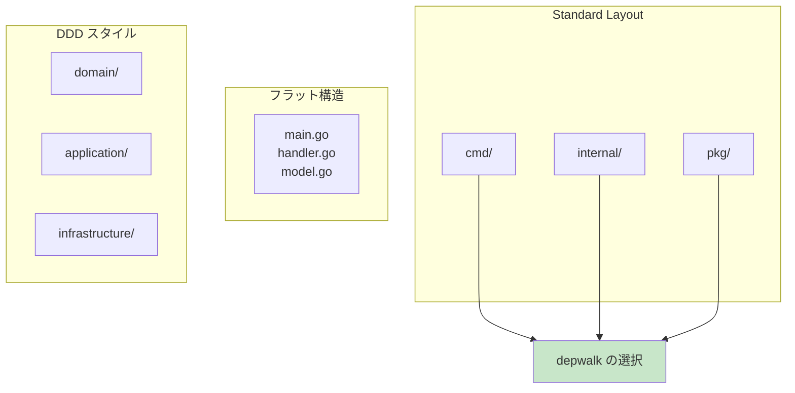
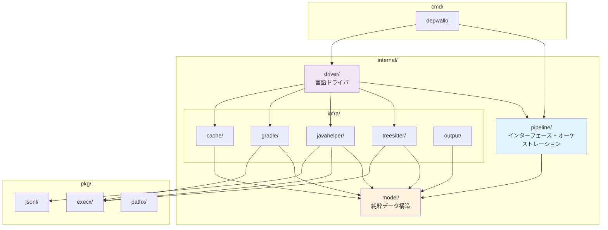
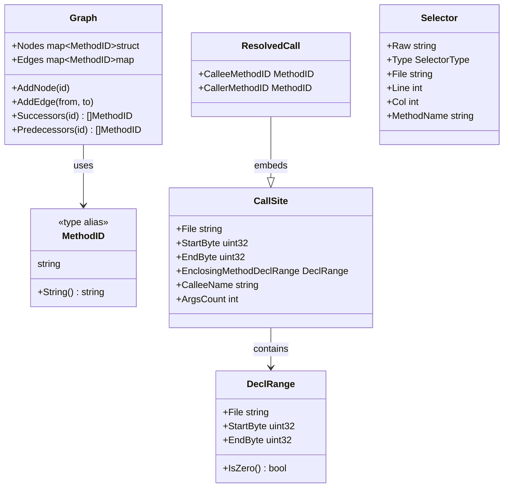
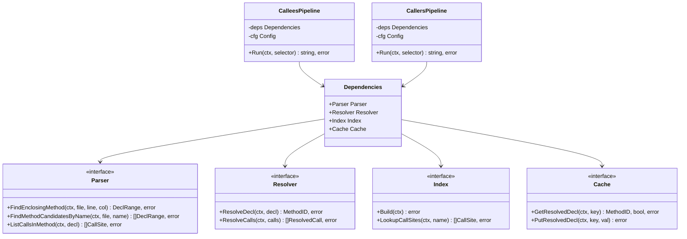
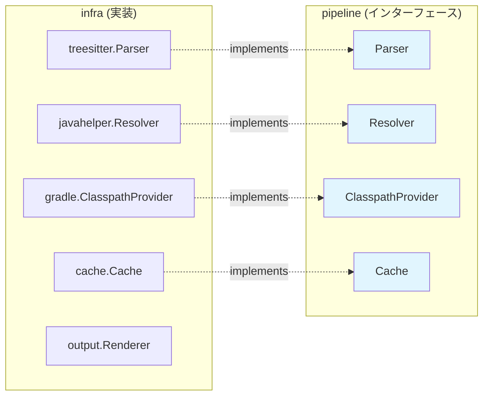
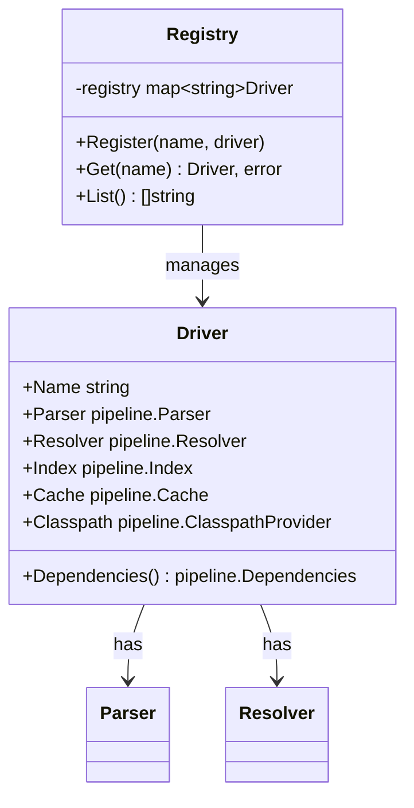
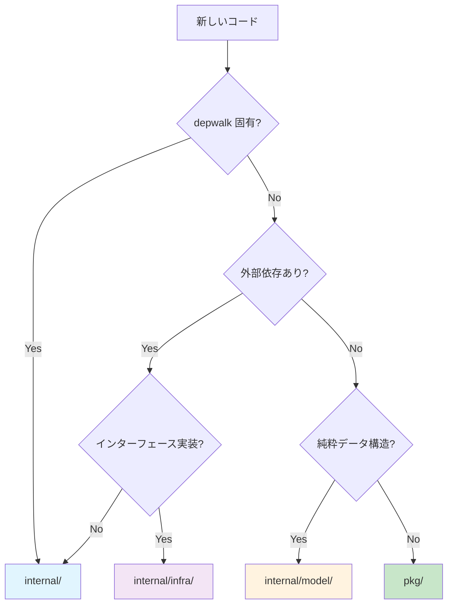

# ADR 0002: パッケージ構造の設計

## ステータス

承認済み（Accepted）

## 日付

2026-01-03

## コンテキスト

Go プロジェクトのパッケージ構造には複数のパターンがある：

1. **Standard Go Project Layout**: `cmd/`, `internal/`, `pkg/` の分離
2. **フラット構造**: 最小限のディレクトリ
3. **DDD スタイル**: domain/, application/, infrastructure/

depwalk は以下の要件を持つ：

- CLI ツールとしてのエントリポイント
- 外部依存（tree-sitter, JavaParser）の隔離
- 将来の言語拡張（Kotlin）への対応
- 再利用可能なユーティリティの分離

### パターン比較



## 決定

**Standard Go Project Layout をベースに、内部構造をカスタマイズ**する。

### パッケージ構成図



### パッケージの責務

#### `cmd/depwalk/`

CLI エントリポイント。Cobra を使用したコマンド定義。

```go
// 責務: フラグ解析、ドライバ取得、パイプライン実行
func newCalleesCmd() *cobra.Command {
    // ...
    p := pipeline.NewCalleesPipeline(d.Dependencies(), cfg)
    result, err := p.Run(ctx, selectorRaw)
    // ...
}
```

#### `internal/model/`

純粋なデータ構造。**外部依存なし**。



| ファイル      | 内容                        |
| ------------- | --------------------------- |
| `methodid.go` | MethodID 型（安定識別子）   |
| `callsite.go` | CallSite, ResolvedCall      |
| `graph.go`    | Graph（ノード・エッジ）     |
| `selector.go` | Selector, ParseSelector()   |
| `errors.go`   | SelectorError, ResolveError |

#### `internal/pipeline/`

パイプラインのオーケストレーション。**インターフェース定義**を含む。



| ファイル     | 内容                                            |
| ------------ | ----------------------------------------------- |
| `stage.go`   | Parser, Resolver, Index, Cache インターフェース |
| `config.go`  | Config 構造体                                   |
| `deps.go`    | Dependencies バンドル                           |
| `callees.go` | CalleesPipeline                                 |
| `callers.go` | CallersPipeline                                 |

#### `internal/infra/`

外部システムとの接続。**pipeline のインターフェースを実装**。



| パッケージ    | 実装するインターフェース     |
| ------------- | ---------------------------- |
| `treesitter/` | pipeline.Parser              |
| `javahelper/` | pipeline.Resolver            |
| `gradle/`     | pipeline.ClasspathProvider   |
| `cache/`      | pipeline.Cache               |
| `output/`     | Renderer（出力フォーマット） |

#### `internal/driver/`

言語固有のコンポーネントをバンドル。



```go
type Driver struct {
    Name      string
    Parser    pipeline.Parser
    Resolver  pipeline.Resolver
    Index     pipeline.Index
    Cache     pipeline.Cache
    Classpath pipeline.ClasspathProvider
}
```

#### `pkg/`

**再利用可能**な汎用ユーティリティ。他プロジェクトからも import 可能。

| パッケージ | 内容                           |
| ---------- | ------------------------------ |
| `execx/`   | コマンド実行ヘルパー           |
| `jsonl/`   | JSON Lines エンコード/デコード |
| `pathx/`   | プロジェクトルート探索         |

### internal vs pkg の判断基準



| 条件                               | 配置先            |
| ---------------------------------- | ----------------- |
| depwalk 固有のロジック             | `internal/`       |
| 汎用的で他プロジェクトで再利用可能 | `pkg/`            |
| 外部依存を含む                     | `internal/infra/` |
| 純粋なデータ構造                   | `internal/model/` |

## 結果

### 良い影響

1. **明確な責務分離**: 各パッケージの役割が明確
2. **依存方向の制御**: `internal/` 内での循環依存を防止
3. **再利用性**: `pkg/` の切り出しにより汎用コードを共有可能

### 悪い影響

1. **ディレクトリ階層**: 深いネストがナビゲーションを複雑に

## 参照

- [ADR 0001: ハイブリッド・パイプラインアーキテクチャ](./0001-hybrid-pipeline-architecture.md)
- [Standard Go Project Layout](https://github.com/golang-standards/project-layout)
