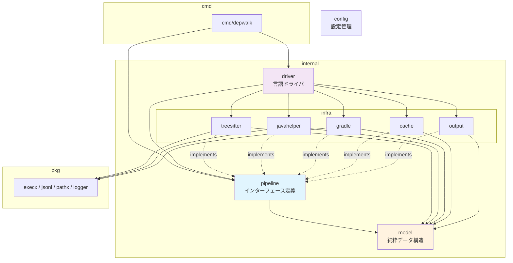
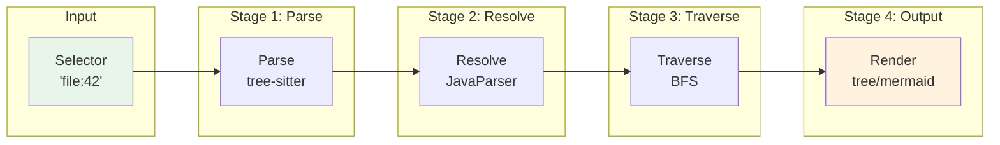
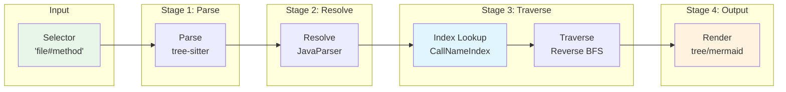
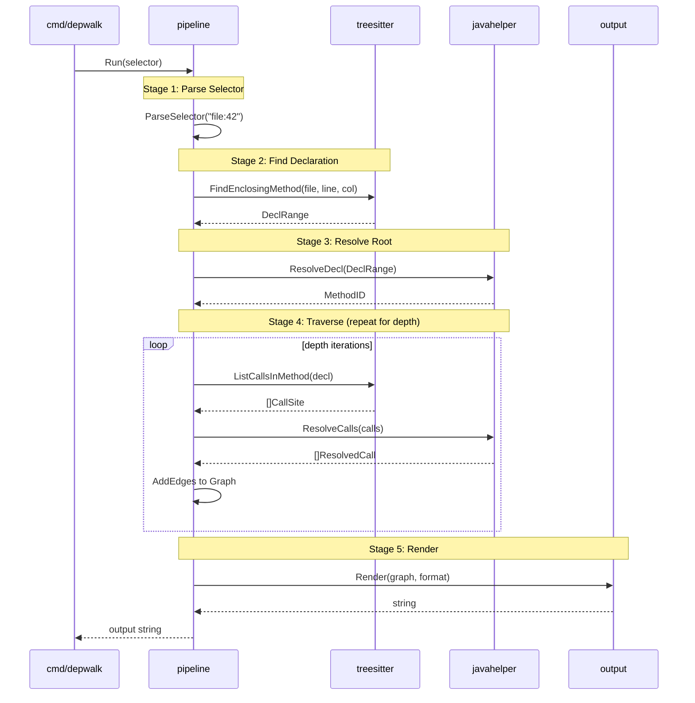
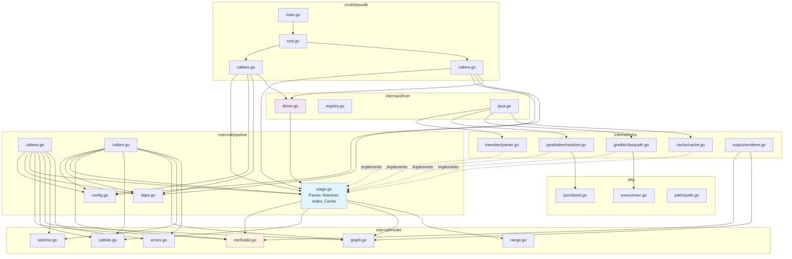
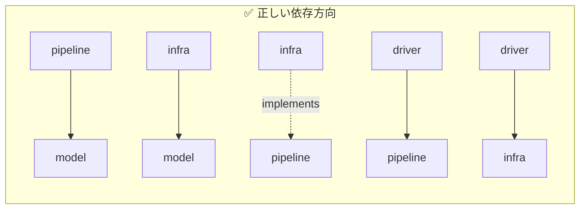
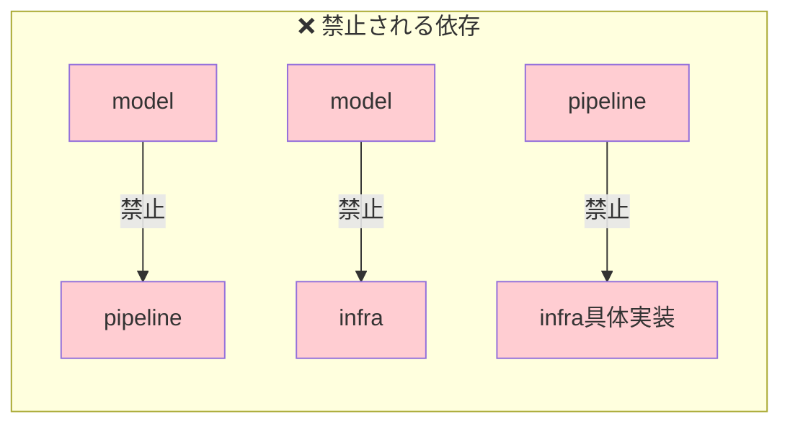
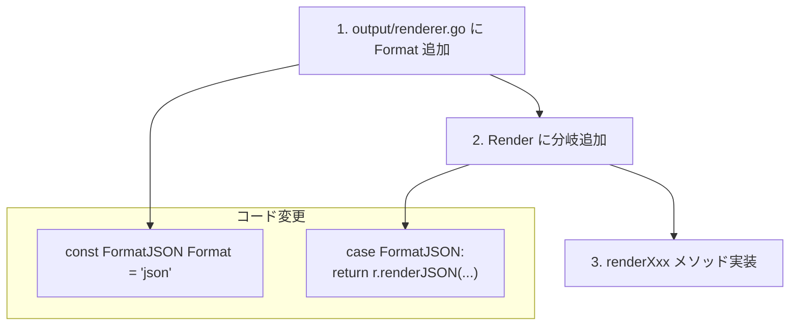
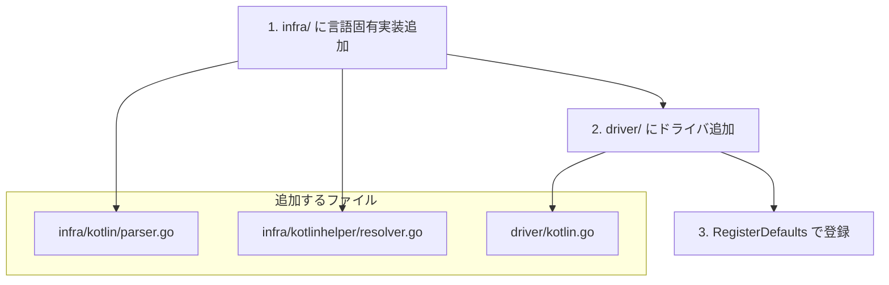
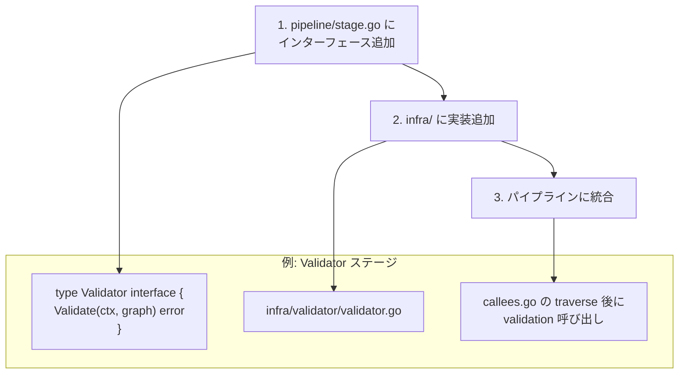

# depwalk アーキテクチャガイドライン

このドキュメントは、depwalk の開発者向けにアーキテクチャの概要と開発ガイドラインを提供します。

## 目次

1. [アーキテクチャ概要](#アーキテクチャ概要)
2. [ディレクトリ構成](#ディレクトリ構成)
3. [データフロー](#データフロー)
4. [パッケージ詳細](#パッケージ詳細)
5. [開発ガイドライン](#開発ガイドライン)
6. [新機能の追加方法](#新機能の追加方法)

---

## アーキテクチャ概要

depwalk は**ハイブリッド・パイプラインアーキテクチャ**を採用しています。

- **パイプライン型**: データが `selector → parse → resolve → traverse → render` と一方向に流れる
- **ヘキサゴナル（Ports & Adapters）**: 外部依存をインターフェースで隔離

### なぜこの構成か？

1. **データフローの明確性**: 解析処理のステージが視覚的に理解しやすい
2. **テスタビリティ**: 各ステージを独立してテスト可能
3. **拡張性**: 新しい言語（Kotlin 等）のサポートが容易

詳細は [ADR 0001](./adr/0001-hybrid-pipeline-architecture.md) を参照。

---

## ディレクトリ構成

```
depwalk/
├── cmd/depwalk/           # CLI エントリポイント
├── config/                # アプリケーション設定
│   ├── config.go          # 設定読み込みロジック
│   └── config.yaml        # デフォルト設定ファイル
├── internal/
│   ├── model/             # ドメインモデル（純粋）
│   ├── pipeline/          # パイプライン定義
│   ├── infra/             # 外部依存の実装
│   │   ├── treesitter/
│   │   ├── javahelper/
│   │   ├── gradle/
│   │   ├── cache/
│   │   └── output/
│   └── driver/            # 言語ドライバ
├── pkg/                   # 再利用可能ユーティリティ
│   ├── execx/             # コマンド実行
│   ├── jsonl/             # JSON Lines
│   ├── logger/            # 構造化ログ（slog）
│   └── pathx/             # パス操作
├── java/                  # Java ヘルパー
│   └── depwalk-helper/
└── docs/                  # ドキュメント
    └── adr/               # Architecture Decision Records
```

### 依存関係図



**ルール**:

- `model` は他の internal パッケージに依存しない
- `infra` は `pipeline` のインターフェースを実装
- 循環依存は禁止

---

## データフロー

### callees コマンド



### callers コマンド



### 詳細フロー（callees）



---

## パッケージ詳細

### パッケージ関係の詳細図



### `internal/model/`

純粋なデータ構造を定義。**外部依存なし**。

```go
// MethodID - 安定したメソッド識別子
type MethodID string  // "com.example.Foo#bar(int,String)"

// CallSite - 呼び出し箇所（未解決）
type CallSite struct {
    File      string
    StartByte uint32
    EndByte   uint32
    CalleeName string
    // ...
}

// Graph - 呼び出しグラフ
type Graph struct {
    Nodes map[MethodID]struct{}
    Edges map[MethodID]map[MethodID]struct{}
}
```

### `internal/pipeline/`

パイプラインのインターフェース定義とオーケストレーション。

```go
// stage.go - インターフェース
type Parser interface {
    FindEnclosingMethod(ctx, file, line, col) (DeclRange, error)
    FindMethodCandidatesByName(ctx, file, name) ([]DeclRange, error)
    ListCallsInMethod(ctx, decl) ([]CallSite, error)
}

type Resolver interface {
    ResolveDecl(ctx, decl) (MethodID, error)
    ResolveCalls(ctx, calls) ([]ResolvedCall, error)
}

// callees.go - パイプライン実装
type CalleesPipeline struct {
    deps Dependencies
    cfg  Config
}

func (p *CalleesPipeline) Run(ctx, selector) (string, error) {
    // 1. Parse selector
    // 2. Find declaration
    // 3. Resolve root
    // 4. Traverse callees
    // 5. Render output
}
```

### `internal/infra/`

外部システムとの接続。`pipeline` のインターフェースを実装。

| パッケージ    | 責務                            |
| ------------- | ------------------------------- |
| `treesitter/` | tree-sitter による高速 AST 解析 |
| `javahelper/` | JavaParser による厳密な型解決   |
| `gradle/`     | Gradle からの classpath 取得    |
| `cache/`      | 解決結果のキャッシュ            |
| `output/`     | tree/mermaid 出力フォーマット   |

### `internal/driver/`

言語固有のコンポーネントをバンドル。

```go
type Driver struct {
    Name      string
    Parser    pipeline.Parser
    Resolver  pipeline.Resolver
    Index     pipeline.Index
    Cache     pipeline.Cache
    Classpath pipeline.ClasspathProvider
}

// Dependencies() で pipeline.Dependencies に変換
func (d Driver) Dependencies() pipeline.Dependencies { ... }
```

### `pkg/`

再利用可能なユーティリティ。depwalk 固有でない汎用コード。

| パッケージ | 内容                            |
| ---------- | ------------------------------- |
| `execx/`   | `exec.Command` のラッパー       |
| `jsonl/`   | JSON Lines エンコード/デコード  |
| `logger/`  | 構造化ログ（`log/slog` ベース） |
| `pathx/`   | プロジェクトルート探索          |

### `config/`

アプリケーション設定の管理。**YAML ファイル + 環境変数** からの設定読み込みを提供。

```go
// config/config.go
type Config struct {
    Logger logger.Config `yaml:"logger"`
}

// 使用例
cfg, err := config.NewConfig[config.Config]()
```

設定の優先順位:

1. 環境変数（最優先）
2. `config/config.yaml`
3. デフォルト値

環境変数の例:

| 環境変数          | 説明                  | デフォルト |
| ----------------- | --------------------- | ---------- |
| `LOG_LEVEL`       | ログレベル            | `info`     |
| `LOG_ADD_SOURCE`  | ソース情報を含めるか  | `true`     |
| `LOG_JSON_FORMAT` | JSON 形式で出力するか | `true`     |

---

## 開発ガイドライン

### 1. 依存の方向を守る





### 2. インターフェースは pipeline に定義

外部依存を抽象化するインターフェースは `pipeline/stage.go` に集約。

```go
// ❌ 悪い例: infra にインターフェースを定義
package treesitter
type Parser interface { ... }

// ✅ 良い例: pipeline にインターフェースを定義
package pipeline
type Parser interface { ... }
```

### 3. model は純粋に保つ

`model` パッケージには IO やフレームワーク依存を入れない。

```go
// ❌ 悪い例: model で IO
package model
func (g *Graph) SaveToFile(path string) error { ... }

// ✅ 良い例: IO は infra で
package cache
func SaveGraph(path string, g *model.Graph) error { ... }
```

### 4. エラーは適切な粒度で

```go
// ❌ 悪い例: 汎用的すぎる
return errors.New("failed")

// ✅ 良い例: 構造化エラー
return &model.SelectorError{
    Kind:     model.SelectorErrorNotFound,
    Selector: raw,
    Message:  "method not found",
}
```

### 5. Context を伝播する

すべての外部呼び出しに `context.Context` を渡す。

```go
func (p *Parser) FindEnclosingMethod(ctx context.Context, ...) { ... }
```

---

## 新機能の追加方法

### 新しい出力フォーマットを追加



```go
const FormatJSON Format = "json"

func (r *Renderer) Render(...) {
    switch format {
    case FormatJSON:
        return r.renderJSON(root, g, direction), nil
    // ...
    }
}
```

### 新しい言語をサポート



```go
// internal/driver/kotlin.go
func RegisterKotlin() {
    d := Driver{
        Name:     "kotlin",
        Parser:   kotlin.NewParser(),
        Resolver: kotlinhelper.NewResolver(""),
        // ...
    }
    Register("kotlin", d)
}
```

### 新しいパイプラインステージを追加



---

## 参照ドキュメント

- [ADR 0001: ハイブリッド・パイプラインアーキテクチャ](./adr/0001-hybrid-pipeline-architecture.md)
- [ADR 0002: パッケージ構造の設計](./adr/0002-package-structure.md)
- [Design Doc](../design/)
