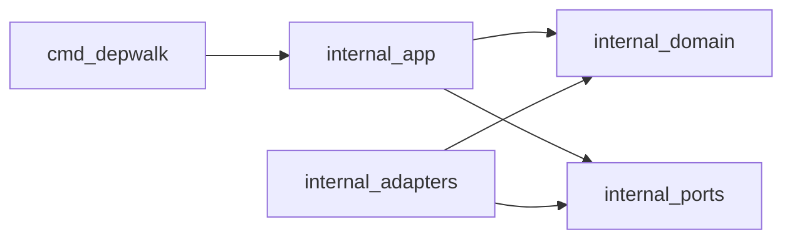

# depwalk architecture

Go ではパッケージを細かく切りすぎると把握コストが上がりやすいので、MVP では **切り分けを最小限**にします。
ただし外部 I/O（tree-sitter / Java helper / Gradle / cache / output）は差し替え可能性が高いので `internal/adapters/*` に隔離し、インターフェースは `internal/ports` にまとめます（ports は 1 パッケージ）。

参考: [Effective Go](https://go.dev/doc/effective_go)

## Dependency rule（簡略版）

- `cmd/depwalk`: CLI 配線のみ（依存注入・エラー表示）
- `internal/domain`: 中核の型（MethodID/CallSite 等）
- `internal/app`: usecase（探索の手順）
- `internal/ports`: interfaces（1 パッケージに集約）
- `internal/adapters/*`: 外部 I/O 実装（tree-sitter / java helper / gradle / cache / output）

## High-level flow

