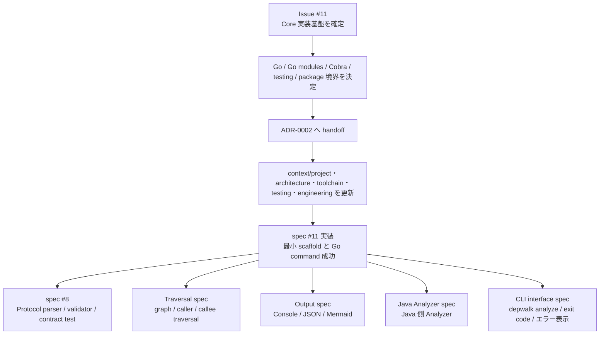
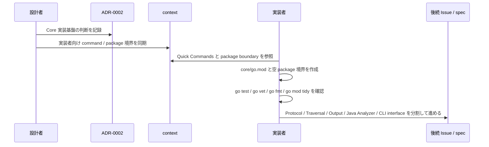

# Core implementation foundation technology selection spec

> Core 実装言語、package manager、task runner、test framework、初期 directory / package 構成を決めるための issue 単位の作業文書。最終的な durable な判断は ADR と context に handoff する。

## メタ情報

- Issue: `#11`
- ステータス: `Review`
- 作成日: 2026-06-15
- 更新日: 2026-06-27
- Branch: `feature/11`
- Owner: Fukuemon

## 設計フェーズ状況

状態は `未着手 / 進行中 / 完了 / レビュー済 / 保留` のいずれか。保留の場合は理由を備考に残す。

| #   | フェーズ                    | 状態   | 最終更新   | 備考 |
| --- | --------------------------- | ------ | ---------- | ---- |
| 1   | 起票                        | 完了   | 2026-06-15 | GitHub issue #11 を確認済み |
| 2   | 下書き                      | 完了   | 2026-06-15 | 本 spec を scaffold |
| 3   | 上位文書突合                | 完了   | 2026-06-15 | Design Doc / feature doc / context / ADR を確認 |
| 4   | 論点整理                    | 完了   | 2026-06-15 | D1-D7 を初期論点として列挙 |
| 5   | 論点解決                    | 完了   | 2026-06-27 | D1-D7 を解決済み |
| 6   | Interface / Routing 設計    | 完了   | 2026-06-27 | 非 UI / CLI package boundary として ADR-0002 / context へ反映 |
| 7   | Content / Data 設計         | 完了   | 2026-06-27 | 初期 module / package 構成を ADR-0002 / context へ反映 |
| 8   | Performance / Security 設計 | 完了   | 2026-06-27 | CLI 配布、外部送信なし、read-only 解析を ADR-0002 / context へ反映 |
| 9   | Test / Metrics 設計         | 完了   | 2026-06-27 | test framework と quality gate を context へ反映 |
| 10  | 実装分割                    | 完了   | 2026-06-27 | ADR / context handoff 済み |
| 11  | レビュー済                  | 進行中 | 2026-06-27 | `spec-review` NEEDS_WORK 指摘へ対応中 |

## 上位文書整合

正本 ([Design Doc](../../design/DesignDoc.md) / [feature doc](../../design/features/) / [context](../../context/) / ADR) のどの節と、どう整合させたかを記録する。本プロダクトは統合モードのため独立した `PRD.md` は持たず、Why / What は Design Doc に統合されている。

- PRD 更新要否: 不要 (統合モードのため `design/DesignDoc.md` の Why / What を参照)
- Design Doc 更新要否: 反映済 ([design/DesignDoc.md](../../design/DesignDoc.md) の Related ADRs / Alternatives Considered)
- ADR 起票要否: 反映済 ([ADR-0002](../../adr/0002-core-implementation-foundation.md))

| 上位文書    | 節 / 該当箇所 | 整合方針 (継承 / 補足 / 変更提案) |
| ----------- | ------------- | --------------------------------- |
| PRD         | 統合モードのため `design/DesignDoc.md` の Why / What | 継承 |
| Design Doc  | 設計原則 P1-P4 / Alternatives Considered A1 / Related ADRs | 反映済 |
| feature doc | `design/features/analyzer-protocol/DesignDoc_analyzer-protocol.md` の「やらないこと」(Core 実装言語、package manager、test framework は定義しない) | 補足 |
| context     | `context/architecture.md` Package Boundary / Runtime Boundary | 継承 |
| context     | `context/toolchain.md` 標準スタック / 採用方針 | 反映済 |
| context     | `context/testing.md` テスト責務の分担 / テスト runtime contract | 反映済 |
| context     | `context/engineering.md` Shared Config Boundary / Root Task Boundary / Repository Quality Gate | 反映済 |
| context     | `context/project.md` Repository Map / Quick Commands / 対象ドメイン | 反映済 |
| context     | `context/infrastructure.md` CLI バイナリ / パッケージ配布、外部送信なし | 補足 |
| ADR         | `adr/0001-analyzer-protocol-jsonl-spi.md` | 継承 |
| ADR         | `adr/0002-core-implementation-foundation.md` | 反映済 |

> Issue 11 の durable な判断は ADR-0002 と context へ handoff 済み。本 spec は決定経緯と issue 単位の作業記録を保持する。

## 関連資料

- `design/DesignDoc.md`: Core 言語非依存、Analyzer 独立プロセス、CLI 限定、Alternatives A1、Future Work
- `design/features/analyzer-protocol/DesignDoc_analyzer-protocol.md`: Analyzer Protocol / SPI / Model schema の正本。Core 実装言語・package manager・test framework は対象外
- `adr/0001-analyzer-protocol-jsonl-spi.md`: JSONL over STDIN/STDOUT の process SPI 判断
- `context/project.md`: 対象ドメイン、Issue Tracker、Source of Truth、Branch pattern、Quick Commands
- `context/architecture.md`: Core -> Analyzer は Protocol 境界のみ、Core は Analyzer 内部を知らない
- `context/toolchain.md`: Core 実装言語 / package manager / task runner / test framework の標準スタック
- `context/testing.md`: Unit / Protocol contract / E2E の責務分担
- `context/engineering.md`: shared config / root task / quality gate の境界規約
- `context/infrastructure.md`: CLI バイナリ / パッケージ配布、local / CI 実行、外部送信なし
- `specs/8-analyzer-protocol/`: Protocol / SPI / Model schema は決定済み。Core 実装基盤は ADR-0002 へ handoff 済み
- `adr/0002-core-implementation-foundation.md`: Go / Go modules / Go 標準 command / 初期 package 構成の正本
- 関連 issue / ticket: [#11](https://github.com/Fukuemon/depwalk/issues/11)

## 背景

Spec8 で Analyzer Protocol / SPI / Model schema の契約設計は完了した。次に Core 実装へ進むには、Core 実装言語、package manager、task runner、test framework、初期 directory / package 構成を確定する必要がある。

この spec は、Core を言語非依存に保つという Design Doc の設計原則 P1-P4 と、Analyzer Protocol を JSONL process SPI とする ADR-0001 を前提に、実装基盤の技術選定を issue #11 の作業正本として整理する。決定後は ADR と context に durable な判断を handoff し、Core 環境構築と空の package 境界を作る最小 scaffold へ進める状態にする。

## スコープ

### やること

- Core 実装言語の候補を比較し、1 つを選定する。
- package manager、task runner、test framework、formatter / linter の初期方針を決める。
- `analyzer-protocol` 実装の配置方針を決める。
- 初期 module / package / directory 構成案を決める。
- 決定理由と却下案を ADR に昇格する。
- `context/project.md`、`context/toolchain.md`、`context/testing.md`、`context/engineering.md` の更新方針を決める。
- Core 実装基盤の最小 scaffold として、`core/go.mod`、Cobra 依存、`core/cmd/depwalk/`、`core/internal/...` の空 package、`analyzers/java/`、`testdata/analyzer-protocol/`、`testdata/fixtures/` を作る。
- `go test ./...`、`go vet ./...`、`go fmt ./...`、`go mod tidy` が通る最小状態を作る。

### やらないこと

- Analyzer Protocol / SPI / Model schema を再設計しない。正本は feature doc と ADR-0001。
- Java Analyzer の AST 解析、型解決、DI 解決方式を決めない。
- Traversal / Output の feature 詳細仕様を決めない。
- Protocol parser、Protocol validator、Traversal、Output、Java Analyzer の実装ロジックを作らない。
- `depwalk analyze ...` の引数、exit code、エラー表示の詳細を決めない。CLI interface spec で扱う。
- Runtime Trace、APM、Reflection、AspectJ Runtime、実行時 Proxy 解析を扱わない。
- IDE Plugin / Web UI / サーバ常駐の提供形態を扱わない。

## 要件の解釈

### 実現したいユーザー価値

Core 開発者は、追加質問なしに最初の実装 scaffold を作成し、後続 spec の実装へ進むための package 境界と検証コマンドを一意に参照できる。Analyzer 実装者は、Core と共有する `analyzer-protocol` の配置と、後続の Protocol 実装で参照する正本を一意に参照できる。

### 成功条件

- Core 実装言語が決まっている。
- package manager、task runner、test framework が決まっている。
- `analyzer-protocol` 実装の配置方針が決まっている。
- 初期 module / package / directory 構成案が決まっている。
- 技術選定 ADR が作成されている。
- `context/project.md` / `context/toolchain.md` / `context/testing.md` / `context/engineering.md` が更新されている。
- `core/go.mod` と Cobra 依存が追加されている。
- `core/cmd/depwalk/`、`core/internal/...`、`analyzers/java/`、`testdata/analyzer-protocol/`、`testdata/fixtures/` の最小 directory / package 境界が作成されている。
- `go test ./...`、`go vet ./...`、`go fmt ./...`、`go mod tidy` が `core/` 配下で成功する。
- Protocol、Traversal、Output、Java Analyzer、CLI interface の実装を各 Issue / spec に分割して進められる状態になっている。

### 対象ユーザー / 操作主体

- Core 開発者
- Analyzer 実装者
- depwalk CLI を local / CI で実行する開発者
- spec / ADR / context を保守する設計者

EARS 風で振る舞いを記述する。

- WHEN Core 実装を scaffold する時、開発者は ADR で承認された Core 実装言語と package manager を使用する。
- WHEN Core と Analyzer の境界を実装する時、システムは ADR-0001 と Analyzer Protocol feature doc に定義された JSONL process SPI を変更せずに実装する。
- WHEN 新しい Analyzer を追加する時、Core は Analyzer の内部 runtime / library に直接依存しない。
- IF 選定候補が Core に特定 Analyzer runtime への直接依存を要求する時、その候補は Design Doc P1-P4 と矛盾するため採用しない。
- IF 選定候補が single binary 配布を阻害する runtime 依存、または local / CI の初期導入に複数 runtime の事前インストールを要求する時、採否判断では導入手順数、dependency restore、CI cold start への影響を記録する。
- システムは Core を Analyzer 実装言語と Analyzer runtime から独立させる。

## 設計時の論点

設計 / 実装フェーズへ持ち越す残課題を 1 件ずつ管理する。確定したものは「解決済みの論点」へ移す。

| #   | 論点 | 決定候補 | 決定 |
| --- | ---- | -------- | ---- |
| D1  | Core 実装言語を何にするか | Rust / Go / TypeScript(Node.js) / Kotlin 以外の JVM 言語 / その他 | Go を採用する |
| D2  | package manager と dependency 管理を何にするか | D1 の言語に従属。例: Cargo / Go modules / npm 系 | Go modules を採用し、初期の runtime dependency は `github.com/spf13/cobra` のみに抑える |
| D3  | task runner と root command をどう定義するか | 言語標準 task / make-like wrapper / package manager scripts | 初期は Go 標準 command (`go test` / `go vet` / `go fmt` / `go mod tidy`) を root command とし、make-like wrapper は後続で必要になった時に検討する |
| D4  | test framework と contract test の配置をどうするか | 言語標準 test / dedicated test runner / golden fixture | `testing` を採用し、手書き fake / golden fixture / Protocol contract test で開始する。`testify` / mock generator / `go-cmp` は初期導入しない |
| D5  | `analyzer-protocol` の実装配置をどうするか | Core 内 package / 独立 package / schema + generated types | Go 実装は `core/internal/protocol` に置く。Analyzer 実装は `analyzers/<language>/` に分離し、共有境界は Protocol doc / ADR / JSONL fixture / contract test 観点に限定する |
| D6  | 初期 directory / package 構成をどう切るか | CLI / Core / Model / Analyzer SPI / Traversal / Output / fixtures の分割案 | `core/` と `analyzers/` を top-level に分ける。Core 内は strict VSA ではなく、`internal/analyze` を use case slice、`protocol` / `analyzer` / `graph` / `traversal` / `output` を capability package とする |
| D7  | ADR / context へどの順序で handoff するか | ADR 作成後に context 更新 / spec-sync で同時反映 | ADR を先に作成し、その後 `spec-sync` で context を ADR 参照として更新する |

## 解決済みの論点

- D1: Core 実装言語は Go を採用する。single binary 配布、local / CI での導入容易性、JSONL streaming と外部プロセス制御の標準ライブラリ対応、Core を Analyzer runtime から独立させる設計原則 P1-P4 との相性を重視した。
- D2: dependency 管理は Go modules を採用する。初期の runtime dependency は CLI framework の `github.com/spf13/cobra` のみに抑え、Analyzer Protocol / JSONL / process 実行 / graph / output / test は標準ライブラリと内部実装で開始する。
- D3: task runner は初期導入しない。root command は Go 標準 command (`go test ./...`、`go vet ./...`、`go fmt ./...`、`go mod tidy`) とし、repository-level の wrapper は command 数や CI matrix が増えた時に再検討する。
- D4: test framework は Go 標準の `testing` を採用する。mock は手書き fake / interface stub を標準方針とし、`testify`、`go.uber.org/mock`、`github.com/google/go-cmp/cmp` は初期導入しない。`go-cmp` は graph / Protocol record の deep diff が読みにくくなった時、mock generator は同一 interface の fake が複数 test package に重複した時に検討する。
- D5: `analyzer-protocol` の Go 実装は `core/internal/protocol` に置く。Analyzer process の起動、stdin / stdout / stderr、exit code handling は `core/internal/analyzer` に分ける。Java などの言語別 Analyzer 実装は Core の `internal` 配下に置かず、`analyzers/<language>/` に分離する。Core と Analyzer が共有する正本は Analyzer Protocol feature doc、ADR、JSONL fixture、contract test 観点とし、Go package や Java 実装 code は共有しない。schema generated types / JSON schema validator は初期導入しない。
- D6: 初期 directory / package 構成は `core/` と `analyzers/` を top-level に分ける。Core 内は strict VSA ではなく、`core/internal/analyze` を use case slice とし、`protocol` / `analyzer` / `graph` / `traversal` / `output` を再利用可能な capability package として分ける折衷案を採用する。`core/internal/core` のような重複名は責務が曖昧なため採用しない。
- D7: handoff は ADR 作成を先行し、その後 `spec-sync` で context を更新する。Core 実装基盤の技術選定、依存方針、package boundary は issue 終了後も残る durable な設計判断のため ADR を正本にする。`context/project.md`、`context/architecture.md`、`context/toolchain.md`、`context/testing.md`、`context/engineering.md` は ADR への参照と実行時 contract を持ち、判断理由を二重管理しない。

## Go 側ライブラリ選定

本節は spec #11 の決定時スナップショットである。
Core 実装基盤の正本は [ADR-0002](../../adr/0002-core-implementation-foundation.md)、実装者が参照する標準 stack は [context/toolchain.md](../../context/toolchain.md)、検証観点は [context/testing.md](../../context/testing.md) とする。

Core は Go 標準ライブラリを中心に実装し、初期 runtime dependency は `github.com/spf13/cobra` のみに抑える。
Cobra は CLI の subcommand、help、completion、POSIX flags を担う。
JSONL、外部プロセス実行、graph 表現、text / JSON / Mermaid 出力、unit test / contract test は標準ライブラリと内部 package で開始する。

JSONL parser / validator は安定版の `encoding/json` で開始する。
ただし、Protocol の strict validation は `encoding/json` v1 の permissive な挙動をそのまま採用しない。
duplicate key、invalid UTF-8、Protocol field 名の大小文字違い、必須 field 欠落、未対応 major `schemaVersion` の扱いは [ADR-0002](../../adr/0002-core-implementation-foundation.md) と [context/testing.md](../../context/testing.md) を正本とする。

開発ツール (`golangci-lint` / `govulncheck` 等) は runtime dependency ではない。
CI gate へ追加する時点で version 固定方法を決める。

## 未確定事項

| 未確定事項 | 決定者 | 期限 | 下流への影響 |
| ---------- | ------ | ---- | ------------ |
| Analyzer process の timeout / stderr 上限 / record size 上限 | Fukuemon | CLI interface spec または runtime config spec 着手前 | CLI の exit code、エラー表示、runtime config、E2E の失敗条件に影響する |
| Runtime budget の具体値 | Fukuemon | Traversal / Output / Java Analyzer の初回 E2E 測定後 | 性能目標、CI 実行時間、large repository 対応方針に影響する |
| 開発ツール (`golangci-lint` / `govulncheck`) の version 固定方法 | Fukuemon | CI gate 設計時 | 再現性、CI cache、開発者 setup 手順に影響する |

これらは spec #11 の Core 実装基盤選定と最小 scaffold を止める未決事項ではない。
各 Issue / spec で対象責務に入った時点で決定する。

## 実装対象

正規 target は `context/project.md` の対象ドメイン一覧を正本とする。

| モジュール          | 実装有無 | 主な責務 |
| ------------------- | :------: | -------- |
| `traversal`         |    ◯     | 空 package 境界を作る。探索 engine の実装は Traversal spec で扱う |
| `output`            |    ◯     | 空 package 境界を作る。Console / JSON / Mermaid 出力の実装は Output spec で扱う |
| `analyzer-protocol` |    ◯     | 空 package 境界と fixture directory を作る。parser / validator / contract test の実装は spec #8 で扱う |
| `java-analyzer`     |    -     | `analyzers/java/` directory だけ作る。Java 固有実装は Java Analyzer spec で扱う |

## 機能仕様

### User Flow

1. 設計者は Issue 11 と上位文書を確認し、Core 実装基盤の評価軸を確定する。
2. 設計者は候補技術を CLI 配布、Core 言語非依存性、Analyzer 追加時の Core 無変更、JSONL process SPI との相性、test / build 運用の明確さで比較する。
3. 設計者は採用案と却下案を決め、ADR に判断理由を記録する。
4. 設計者は `context/toolchain.md`、`context/testing.md`、`context/engineering.md`、`context/project.md` を更新する。
5. 実装者は更新後の context を参照して、spec #11 の最小 scaffold を作る。
6. 実装者は Protocol、Traversal、Output、Java Analyzer、CLI interface の実装ロジックを各 Issue / spec に分けて進める。

### Reuse Policy

- Protocol / SPI / Model schema の正本は `design/features/analyzer-protocol/DesignDoc_analyzer-protocol.md` とし、本 spec では再定義しない。
- Core 内 package は `context/architecture.md` の依存方向に従う。
- Java Analyzer 固有の build / runtime 設定を Core 共通 package に持ち込まない。
- `analyzer-protocol` の parser / validator / contract test は spec #8 で実装する。本 spec では package 境界と fixture directory だけを作る。

### Performance

- 採用候補は local / CI での cold start、install size、single binary または package 配布の容易さを評価する。
- Core ↔ Analyzer は streaming JSONL を扱うため、全 Analyzer stdout の一括読み込みを前提にしない runtime / library を選ぶ。
- 具体的な runtime budget は Traversal / Output / Java Analyzer の E2E 測定後に、対象 spec または context へ追記する。

### Routing / URL State

- 非該当。depwalk は CLI ツールであり、Web routing / URL state を持たない。

### Content / Assets

- 非該当。静的 asset やコンテンツ配信は扱わない。

### UI Reuse

- 非該当。IDE Plugin / Web UI は Non Goals。

### Testing

- Core の unit test は Graph / Traversal / Output / Protocol parser / validator の責務ごとに配置する。
- Protocol contract test は `analyzer-protocol` 境界に置き、Core と Analyzer 実装が同じ contract を参照できるようにする。
- E2E はサンプル Java/Spring fixture を使い、既知 caller / callee 集合と CLI 出力を照合する。
- 初期 test framework は Go 標準の `testing` とし、assertion library / mock generator は導入しない。
- mock は手書き fake / interface stub を使う。`go-cmp` は graph / Protocol record の deep diff が読みにくくなった時に検討する。
- test command は `context/project.md` の Quick Commands と `context/testing.md` に反映する。

## Interface 設計

### UI / API / Event Interface

- UI: 非該当。
- Web API endpoint: 非該当。
- CLI command interface: 初期 scaffold 後に CLI interface spec で扱う。本 spec では build / test / quality gate の開発者向け command と、Cobra root command を置く package 境界だけを決める。
- Process interface: ADR-0001 と Analyzer Protocol feature doc の JSONL over STDIN/STDOUT を継承する。

### Props / Request / Response

- Protocol request / response schema は本 spec では再定義しない。
- Core 実装基盤の決定は、Protocol schema の必須 field や record type を変更してはならない。
- `analyzer-protocol` 実装配置は `core/internal/protocol` と `testdata/analyzer-protocol/` の境界だけを決める。parser / validator / contract test の実装は spec #8 で扱う。

## Content / Data 設計

### 保存・管理するデータ

- 永続データストアは持たない。
- 管理対象は source code、package manifest、test fixture、contract test fixture、ADR、context の文書である。
- 解析対象 repository は read-only とし、depwalk は対象 repository を書き換えない。

### コンテンツ配置 / package / route

本節は spec #11 の決定時スナップショットである。
初期 directory / package 構成の正本は [ADR-0002](../../adr/0002-core-implementation-foundation.md)、[context/architecture.md](../../context/architecture.md)、[context/project.md](../../context/project.md) とする。

本 spec の実装範囲は、次の directory と空 package 境界を作り、Go 標準 command が通る状態にすることに限定する。

```text
depwalk/
├── core/
│   ├── go.mod
│   ├── cmd/
│   │   └── depwalk/
│   └── internal/
│       ├── cli/
│       ├── analyze/
│       ├── protocol/
│       ├── analyzer/
│       ├── graph/
│       ├── traversal/
│       └── output/
├── analyzers/
│   └── java/
└── testdata/
    ├── analyzer-protocol/
    └── fixtures/
```

- `cmd/depwalk` は `main` と Cobra root command の起動に限定する。
- `internal/cli` は CLI command / flags / 入力 validation を担う package 境界である。具体的な CLI interface は CLI interface spec で扱う。
- `internal/analyze` は `depwalk analyze` の use case orchestration を担う package 境界である。実装ロジックは CLI interface spec と各 domain spec で扱う。
- `internal/protocol` は JSONL record type、parse、validate を担う package 境界である。実装は spec #8 で扱う。
- `internal/analyzer` は外部 Analyzer process の起動、stdin / stdout / stderr、exit code handling を担う package 境界である。timeout / stderr 上限 / record size 上限は CLI interface spec または runtime config spec で決める。
- `internal/graph`、`internal/traversal`、`internal/output` は graph model、caller / callee traversal、text / JSON / Mermaid formatter を担う package 境界である。実装ロジックは Traversal spec / Output spec で扱う。
- `analyzers/<language>/` は言語別 Analyzer runtime を置く境界である。Java Analyzer 実装は Java Analyzer spec で扱う。
- `testdata/analyzer-protocol/` は Core と Analyzer が共有する JSONL fixture を置く directory である。fixture 内容は spec #8 で扱う。
- Web route / asset route は非該当。

## Performance / Security 設計

### Performance

- 技術選定では CLI 配布の軽さ、CI 上の導入時間、JSONL streaming 処理の実装容易性を比較軸に含める。
- Analyzer process 起動 overhead は ADR-0001 の既知トレードオフとして受け入れる。timeout / stderr 上限 / record size 上限は未確定事項として後続 spec で扱う。
- runtime dependency は初期状態で `github.com/spf13/cobra` のみに抑え、dependency restore と supply chain risk を小さく保つ。

### Security / Privacy

- depwalk は利用者自身の source code を local / CI 上で read-only に解析する。
- 外部送信、常駐サーバ、secret / token は扱わない。
- dependency supply chain risk は package manager 選定時に評価する。

## Error / Fallback 設計

### エラーケース

| #   | ケース | ユーザーへの見せ方 | リカバリ |
| --- | ------ | ------------------ | -------- |
| 1   | 選定候補が Core から Analyzer 実装への直接依存を要求する | Design Doc P1-P4 との不整合として却下理由を ADR に記録する | Protocol 境界を保てる候補へ切り替える |
| 2   | 選定候補が single binary 配布を阻害する runtime 依存、または local / CI の初期導入に複数 runtime の事前インストールを要求する | 導入手順数、dependency restore、CI cold start への影響を ADR に記録する | single binary / 軽量 runtime / package 配布の代替を評価する |
| 3   | test framework が Protocol contract test を表現しづらい | test 方針の不適合として記録する | fixture / golden test を扱える framework を選ぶ |
| 4   | context 更新が ADR の決定内容とずれる | `spec-sync` / review で差分を指摘する | ADR を正として context を同期する |
| 5   | Analyzer 起動失敗、timeout、invalid record、非ゼロ exit の表示仕様が必要になる | 本 spec では未確定事項として扱い、CLI interface spec または runtime config spec の対象にする | CLI interface spec で exit code、stderr 表示、diagnostics 表示、runtime config を決める |

### Fallback

- ADR 作成前に context 更新が必要になった場合、context には暫定判断を直接複製せず、本 spec への参照または TODO として残す。
- context 更新が広がる場合、ADR を先に確定し、context は ADR へのリンクを正本として追従させる。

## テスト / 評価方針

### テスト観点

- 候補技術が unit test、Protocol contract test、E2E fixture 照合を無理なく表現できること。
- spec #11 の最小 scaffold 後、`cd core && go test ./...`、`cd core && go vet ./...`、`cd core && go fmt ./...`、`cd core && go mod tidy` が成功すること。
- Protocol strict validation、nil slice / nil map、Analyzer process contract の詳細検証は [context/testing.md](../../context/testing.md) と spec #8 を正本とする。
- `testing` と手書き fake だけで失敗原因が読めること。graph / Protocol record の deep diff が読みにくい場合は `go-cmp` を追加検討すること。
- `context/project.md` の Quick Commands に、実装者が迷わず実行できる build / test / quality gate command を記載できること。

### 計測指標

- CLI install / setup 手順の少なさ。
- CI cold start と dependency restore の見通し。
- single binary または package 配布の実現性。
- Protocol contract test の fixture 作成コスト。
- Analyzer 追加時に Core の内部実装差分が不要であること。

## フロー / シーケンス

本 spec は技術選定と最小 scaffold の issue であり、runtime の caller / callee 探索フローは扱わない。
図は、正本 handoff と後続 Issue への分割だけを示す。

### Flowchart (ユーザー操作起点)



spec #11 は `scaffold` までを扱い、各実装ロジックは後続 spec へ分割する。

### Sequence



実装者は spec #11 で実装ロジックを先取りせず、後続 Issue / spec の正本を待って各 package の中身を実装する。

## 実装分割

### 実装タスク案

| Phase | 対象 | 概要 | 依存 |
| ----- | ---- | ---- | ---- |
| P1 | spec | D1-D7 を `spec-resolve` で解決する | 完了 |
| P2 | ADR | Core 実装基盤の技術選定 ADR-0002 を作成する | 完了 |
| P3 | context | `project` / `architecture` / `toolchain` / `testing` / `engineering` を ADR 参照として更新する | 完了 |
| P4 | scaffold | `core/go.mod`、Cobra 依存、`core/cmd/depwalk/`、`core/internal/...`、`analyzers/java/`、`testdata/analyzer-protocol/`、`testdata/fixtures/` を作る | P1-P3 |
| P5 | scaffold validation | `cd core && go test ./...`、`go vet ./...`、`go fmt ./...`、`go mod tidy` を成功させる | P4 |
| P6 | downstream | Protocol / Traversal / Output / Java Analyzer / CLI interface の実装を各 Issue / spec に分割する | P5 |

### prompts 生成方針

spec #11 では、Core 環境構築と空の package 境界を作る prompt だけを生成する。
実装ロジックは次の単位に分ける。

| 順序 | spec / Issue | 扱う内容 |
| ---- | ------------ | -------- |
| 1 | spec #11 | Core 環境構築と空の package 境界を作る |
| 2 | spec #8 | Analyzer Protocol の parser / validator / contract test を実装する |
| 3 | Traversal spec | graph / caller / callee traversal を実装する |
| 4 | Output spec | Console / JSON / Mermaid などの出力を実装する |
| 5 | Java Analyzer spec | Java 側 Analyzer 実装を進める |
| 6 | CLI interface spec | `depwalk analyze ...` の引数、exit code、エラー表示を固めて実装する |

この分割により、Protocol、Traversal、Output、CLI interface、Java Analyzer の判断を spec #11 が先取りしない。

## 上位資料からの変更点

本 spec で PRD / Design Doc / feature doc / context / 既存 ADR から変更・追加した内容を、反映先別に記録する。`spec-track` / `spec-sync` で更新する。

### PRD への影響

| 対象節 | 変更内容 | 理由 |
| ------ | -------- | ---- |
| なし | 独立 PRD はなく、Design Doc の Why / What を継承する | 統合モードのため |

### Design Doc への影響

| 対象節 | 変更内容 | 理由 |
| ------ | -------- | ---- |
| Alternatives Considered / Related ADRs | 反映済: ADR-0002 への参照と Go 採用済みの注記を追加 | Design Doc の A1 / toolchain 未確定状態を解消するため |

### feature doc への影響

| 対象 doc / 節 | 変更内容 | 理由 |
| ------------- | -------- | ---- |
| `design/features/analyzer-protocol/DesignDoc_analyzer-protocol.md` | 原則不要。Protocol schema は変更しない | Core 実装基盤は Protocol の実装配置を決めるだけで、schema 正本を変更しないため |

### context への影響

| 対象 doc / 節 | 変更内容 | 理由 |
| ------------- | -------- | ---- |
| `context/project.md` Repository Map / Quick Commands | 反映済: 初期 directory 構成と build / test / quality gate command を追記 | 実装着手前の未確定項目を解消するため |
| `context/project.md` Repository Map | 反映済: `core/` と `analyzers/<language>/` を top-level に分ける構成を追記 | Core と Analyzer の runtime 境界を directory 構成でも明示するため。source: spec-resolve D5-D6 |
| `context/architecture.md` Package Boundary | 反映済: Core の Go 実装は `core/internal/...`、Analyzer 実装は `analyzers/<language>/` に分け、共有境界を Protocol doc / fixture / contract test 観点に限定する方針を追記 | Core が Analyzer 内部 runtime / implementation に依存しない境界を実装構成へ落とすため。source: spec-resolve D5-D6 |
| `context/toolchain.md` 標準スタック / 採用方針 | 反映済: Core 実装言語、package manager、task runner、formatter / linter、test framework を確定 | 技術選定結果を横断正本へ反映するため |
| `context/toolchain.md` Go 側 dependency 方針 | 反映済: 初期 runtime dependency は `github.com/spf13/cobra` のみ、開発ツールは `golangci-lint` / `govulncheck` を候補として追記 | 依存最小化と CLI 品質 gate を両立するため。source: spec-resolve D1-D4 |
| `context/testing.md` テスト runtime contract | 反映済: 採用 test framework と実行 command、contract test 配置を追記 | Spec8 実装 prompt 生成に必要なため |
| `context/testing.md` mock / assertion 方針 | 反映済: 初期は `testing`、手書き fake、golden fixture を採用し、`testify` / mock generator / `go-cmp` は初期導入しない方針を追記 | 依存を増やさずに contract test を開始するため。source: spec-resolve D4 |
| `context/engineering.md` Shared Config / Root Task / Quality Gate | 反映済: shared config と root task、依存境界検査の初期方針を追記 | 実装 repo としての quality gate を定義するため |
| context 全般 | 反映済: ADR-0002 への参照と実行時 contract を追加し、判断理由は ADR 参照へ寄せる | issue 終了後も残る技術選定の正本を ADR に置き、context との二重管理を避けるため。source: spec-resolve D7 |

### ADR の新規 / 更新

| ADR ID | 変更内容 | 理由 |
| ------ | -------- | ---- |
| ADR-0002 | 反映済: Core 実装言語、package manager、task runner、test framework、初期 module 構成の採用判断を記録 | 長期判断として issue 終了後も残るため |
| ADR-0001 | 原則更新なし。必要なら Core 実装基盤から見た影響範囲へのリンクを追加する | JSONL process SPI 判断は既に承認済みであり、再判断しないため |

## レビュー

`spec-review` (fresh-context evaluator) の最新結果。完全な記録は `review.md` を参照。

| 日付 | 結果 (PASS / NEEDS_WORK) | 指摘要点 | 対応 |
| ---- | ------------------------ | -------- | ---- |
| 2026-06-27 | NEEDS_WORK | 正本境界の重複、空のフロー / シーケンス、未確定事項の残存、EARS の観測可能性不足、ステータス不整合 | 対応済み。再 review 待ち |

## 変更履歴

| 日付 | 変更者 | 変更内容 |
| ---- | ------ | -------- |
| 2026-06-27 | Codex | spec-review 指摘に対応し、正本境界、未確定事項、最小 scaffold 範囲、後続 Issue 分割を整理 |
| 2026-06-27 | Codex | ADR-0002 と context / Design Doc へ Core 実装基盤の durable な判断を handoff |
| 2026-06-27 | Codex | `encoding/json/v2` を初期採用せず、安定版 `encoding/json` に strict validation を重ねる方針を追記 |
| 2026-06-27 | Codex | D7 を解決し、ADR 作成後に context を ADR 参照として更新する handoff 順序を追加 |
| 2026-06-27 | Codex | D5-D6 を解決し、Core / Analyzer の top-level 分離と Core 内 package 構成を追加 |
| 2026-06-21 | Codex | Go 側 Core ライブラリ選定を追加し、D1-D4 を解決済みに更新 |
| 2026-06-15 | Codex | Issue #11 の spec draft を作成 |

## 備考

- 本 spec は API endpoint、永続 DB、認可、画面、data-testid を扱わないため、`templates/specs/appendices/` の追加 appendix は取り込まない。
