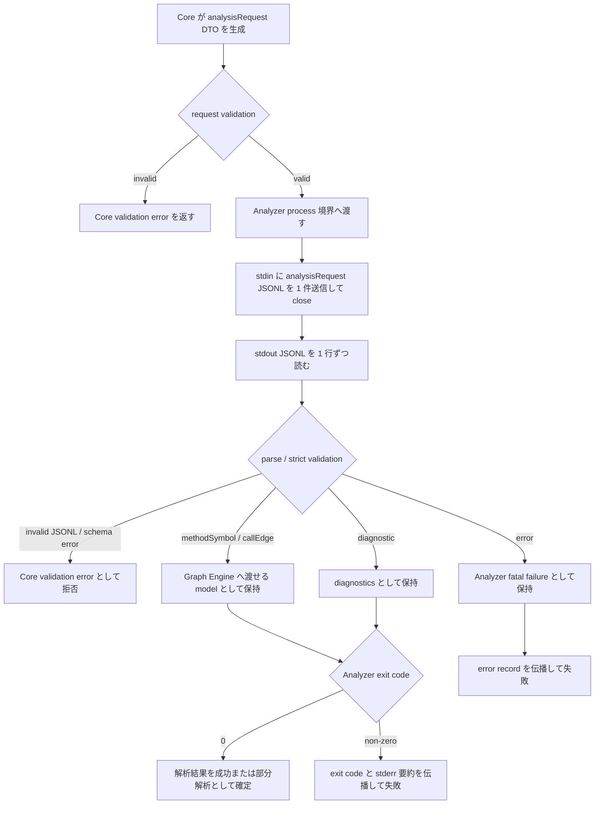
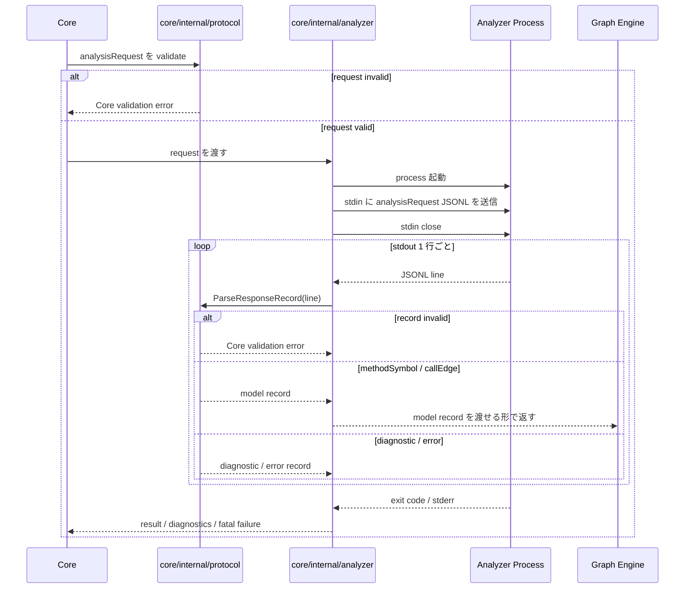

# Analyzer Protocol / SPI implementation spec

> issue #12 の実装 spec。
> Protocol / SPI / Model schema の正本は [Analyzer Protocol / SPI feature doc](../../design/features/analyzer-protocol/DesignDoc_analyzer-protocol.md) と [ADR-0001](../../adr/0001-analyzer-protocol-jsonl-spi.md)。本 spec は、その契約を Go Core に実装する作業単位と検証計画を管理する。

## メタ情報

- Issue: `#12`
- ステータス: `Draft`
- 作成日: 2026-07-01
- 更新日: 2026-07-02
- Branch: `feature/12`
- Owner: Fukuemon

## 設計フェーズ状況

状態は `未着手 / 進行中 / 完了 / レビュー済 / 保留` のいずれか。保留の場合は理由を備考に残す。

| #   | フェーズ                    | 状態   | 最終更新   | 備考                                              |
| --- | --------------------------- | ------ | ---------- | ------------------------------------------------- |
| 1   | 起票                        | 完了   | 2026-07-01 | GitHub issue #12 を確認済み                       |
| 2   | 下書き                      | 進行中 | 2026-07-01 | 本 spec を scaffold                               |
| 3   | 上位文書突合                | 完了   | 2026-07-01 | #8 feature doc / ADR / context と矛盾なし         |
| 4   | 論点整理                    | 完了   | 2026-07-02 | D1-D3 を解決済み                                  |
| 5   | 論点解決                    | 完了   | 2026-07-02 | D1-D3 を解決済み                                  |
| 6   | Interface / Routing 設計    | 進行中 | 2026-07-02 | Protocol parser / Analyzer process 境界を具体化中 |
| 7   | Content / Data 設計         | 進行中 | 2026-07-02 | fixture 粒度を決定済み                            |
| 8   | Performance / Security 設計 | 未着手 |            | streaming parse / read-only / 外部送信なし        |
| 9   | Test / Metrics 設計         | 未着手 |            | unit / contract test                              |
| 10  | 実装分割                    | 完了   | 2026-07-02 | prompts 4 本を生成済み                            |
| 11  | レビュー済                  | 未着手 |            | `spec-review` 後に更新                            |

## 上位文書整合

正本 ([PRD](../../PRD.md) / [Design Doc](../../design/DesignDoc.md) / [feature doc](../../design/features/) / [context](../../context/) / ADR) のどの節と、どう整合させたかを記録する。

- PRD 更新要否: 不要 (本プロダクトは統合モード。Why / What は Design Doc に統合)
- Design Doc 更新要否: 不要
- ADR 起票要否: 不要

| 上位文書    | 節 / 該当箇所                                                      | 整合方針 (継承 / 補足 / 変更提案) |
| ----------- | ------------------------------------------------------------------ | --------------------------------- |
| PRD         | 統合モードのため `design/DesignDoc.md` の Why / What を参照        | 継承                              |
| Design Doc  | 設計原則 P1-P4 / Communication Protocol / モジュール責務           | 継承                              |
| feature doc | `design/features/analyzer-protocol/DesignDoc_analyzer-protocol.md` | 継承                              |
| context     | `context/architecture.md` Package Boundary / Runtime Boundary      | 継承                              |
| context     | `context/testing.md` Protocol contract test                        | 継承                              |
| context     | `context/toolchain.md` Go / Go modules / `encoding/json` 方針      | 継承                              |
| context     | `context/engineering.md` Repository Quality Gate / 依存境界 gate   | 継承                              |
| ADR         | `adr/0001-analyzer-protocol-jsonl-spi.md`                          | 継承                              |
| ADR         | `adr/0002-core-implementation-foundation.md`                       | 継承                              |

> 現時点で上位文書との矛盾は検出していない。本 spec は #8 の Protocol 契約を変更せず、Go Core 側の実装分割と検証計画を補足する。

## 関連資料

- `design/DesignDoc.md`: Core 言語非依存、Analyzer 独立プロセス、Communication Protocol
- `design/features/analyzer-protocol/DesignDoc_analyzer-protocol.md`: Protocol / SPI / Model schema の正本
- `adr/0001-analyzer-protocol-jsonl-spi.md`: JSONL over STDIN/STDOUT、process SPI、versioning 判断の正本
- `adr/0002-core-implementation-foundation.md`: Core 実装言語、package manager、test framework、初期 package 境界の正本
- `context/architecture.md`: Go package 境界、Core -> Analyzer は Protocol 経由のみ
- `context/testing.md`: Protocol contract test の正本観点
- `context/toolchain.md`: Go 標準 command、`encoding/json` + strict validation 方針
- `context/engineering.md`: quality gate と依存境界 gate
- `specs/8-analyzer-protocol/index.md`: issue #8 の決定時スナップショット
- `specs/11-core-implementation-foundation/index.md`: Core scaffold と実装基盤の決定記録
- 関連 issue / ticket: [#12](https://github.com/Fukuemon/depwalk/issues/12), [#8](https://github.com/Fukuemon/depwalk/issues/8), [#11](https://github.com/Fukuemon/depwalk/issues/11)

## 背景

Spec #8 で Analyzer Protocol / SPI / Model schema は確定し、feature doc / ADR / context へ正本ハンドオフ済みである。Spec #11 では Core 実装基盤として Go / Go modules / Go 標準 `testing` / `core/internal/protocol` / `core/internal/analyzer` の境界を確定し、Core scaffold を追加した。

Issue #12 は、#8 の契約を Core 実装へ落とす実装 task である。本 spec は #8 の設計を複製して再決定するものではない。#8 の正本を参照し、Go package、test fixture、prompt 分割、検証順序を #12 の作業単位として管理する。

## スコープ

### やること

- `core/internal/protocol` に Analyzer Protocol の Go DTO / wire model を実装する。
- `analysisRequest` / `methodSymbol` / `callEdge` / `diagnostic` / `error` / embedded `SourceLocation` を parse / validate できるようにする。
- JSONL parser / validator を実装し、不正 JSONL、必須 field 欠落、型不一致、未対応 `schemaVersion`、未知 `recordType` を Core validation error として扱う。
- `encoding/json` v1 の permissive な挙動を Protocol contract として採用しないため、duplicate key、invalid UTF-8、field 名の大小文字違いを拒否する。
- 未知 field は対応済み major version では無視し、既知 field だけで処理を継続する。
- `core/internal/analyzer` に `1 analysisRequest = 1 Analyzer process` の最小 runner を実装する。
- `testdata/analyzer-protocol/` に contract fixture を追加し、Core 側 contract test を `cd core && go test ./...` で実行できるようにする。

### やらないこと

- Analyzer Protocol / SPI / Model schema の再設計は行わない。
- Java Analyzer の AST 解析、型解決、DI 解決、build / runtime 設定は実装しない。
- Traversal Engine、Graph Engine の本格実装、Output Engine、CLI `depwalk analyze` interface は実装しない。
- timeout、stderr 上限、record size 上限、parallel execution、session reuse、capability handshake は決めない。
- `encoding/json/v2`、schema generator、`testify`、mock generator、`go-cmp` は導入しない。

## 要件の解釈

### 実現したいユーザー価値

Analyzer 実装者は、Go Core が受け付ける Protocol contract を fixture と test で確認できる。Core 開発者は、Analyzer 実装言語を知らずに JSONL record を parse / validate し、Graph / Traversal / Output の後続実装へ渡せる境界を得る。

### 成功条件

- `analysisRequest` / `methodSymbol` / `callEdge` / `diagnostic` / `error` / `SourceLocation` の Go DTO と validation が実装されている。
- JSONL parser / validator が streaming 前提で 1 行 1 record を処理できる。
- Core validation error と Analyzer が出力する `error` record の境界が code 上で分離されている。
- contract fixture により、未知 field、未対応 `schemaVersion`、不正 JSONL、schema 不準拠、duplicate key、invalid UTF-8、field 名の大小文字違いを検証できる。
- `1 analysisRequest = 1 Analyzer process` の SPI 契約が `core/internal/analyzer` の最小 runner として実装されている。
- `cd core && go test ./...`、`cd core && go vet ./...`、`cd core && test -z "$(gofmt -l .)"` が通る。

### 対象ユーザー / 操作主体

- Core 開発者
- Analyzer 実装者
- depwalk CLI を local / CI で利用する開発者

EARS 風で振る舞いを記述する。

- WHEN Core が Analyzer stdout の JSONL 行を受け取る時、システムは 1 行を 1 record として parse / validate する。
- WHEN Core が対応済み `schemaVersion` の record を受け取る時、システムは未知 field を無視し、既知 field の validation 結果だけで採否を決める。
- IF Core が不正 JSONL、duplicate key、invalid UTF-8、必須 field 欠落、field 名の大小文字違いを受け取った時、システムは Core validation error として record を拒否する。
- IF Core が未対応 major `schemaVersion` を受け取った時、システムは schema version mismatch として解析を失敗させる。
- IF Analyzer が valid `diagnostic` record を出力した時、システムは fatal failure とせず、利用者へ伝播可能な diagnostics として保持する。
- IF Analyzer が valid `error` record を出力した時、システムは Analyzer 側 fatal failure として扱う。
- THE SYSTEM SHALL keep Core independent from Analyzer implementation language and runtime.

## 設計時の論点

設計 / 実装フェーズへ持ち越す残課題を 1 件ずつ管理する。確定したものは「解決済みの論点」へ移す。

| #   | 論点                                                                                                          | 決定候補                                                                                                | 決定                                                                                         |
| --- | ------------------------------------------------------------------------------------------------------------- | ------------------------------------------------------------------------------------------------------- | -------------------------------------------------------------------------------------------- |
| D1  | `core/internal/protocol` の実装を model / validation / JSONL parser / fixture test のどの prompt に分割するか | A: model + validation を先に実装して parser を後続にする / B: parser と validation を同一 prompt にする | A: model + validation を先に実装し、JSONL parser / fixture test は後続 prompt に分ける       |
| D2  | `core/internal/analyzer` で process 実行を #12 の実装対象に含める範囲                                         | A: interface と fake まで / B: `os/exec` による最小 process runner まで                                 | B: `os/exec` による最小 process runner まで含める                                            |
| D3  | contract fixture の粒度                                                                                       | A: record type ごとの JSONL fixture / B: scenario ごとの input-output fixture / C: 両方                 | C: record type ごとの JSONL fixture と scenario ごとの input-output fixture の両方を採用する |

## 解決済みの論点

- #8 D1-D5: Protocol / SPI / Model schema、`analysisRequest`、process contract、versioning、`diagnostic` / `error` 境界は解決済み。正本は feature doc と ADR-0001。
- #11 D1-D7: Core 実装基盤、Go package 境界、test framework、strict JSONL validation 方針は解決済み。正本は ADR-0002 と context。
- #12 D1: `core/internal/protocol` は、最初の prompt で record DTO、enum、embedded object、record 単位 validation を実装する。strict JSONL parser、duplicate key / invalid UTF-8 / field 名大小文字違いの検出、contract fixture は後続 prompt に分ける。初回 prompt を小さくし、Protocol schema と validation API を先にレビュー可能にするため。
- #12 D2: `core/internal/analyzer` は `os/exec` による最小 process runner まで #12 に含める。runner は 1 `analysisRequest` ごとに Analyzer process を 1 つ起動し、stdin に request JSONL を 1 件送信して close し、stdout を streaming parse へ渡し、stderr を protocol record として parse せず、exit code を結果に含める。timeout、stderr 上限、record size 上限は固定しない。#12 の完了条件である process SPI の実装境界を code で検証可能にするため。
- #12 D3: contract fixture は record type ごとの JSONL fixture と scenario ごとの input-output fixture の両方を採用する。record type fixture は `core/internal/protocol` の parse / validation / strict JSONL test に使い、scenario fixture は `core/internal/analyzer` の process runner test に使う。fixture 数は増えるが、Protocol record 単位の異常系と process SPI の流れを分離してレビューできるため。

## 未確定事項

下表は #12 の prompt 生成前に解決する。Protocol 契約そのものの未確定事項ではなく、実装順序と fixture 粒度の未確定事項である。

| 未確定事項 | 決定者 | 期限 | #12 への影響                           |
| ---------- | ------ | ---- | -------------------------------------- |
| なし       | -      | -    | D1-D3 は解決済み。prompts 生成へ進める |

## 実装対象

正規 target は `context/project.md` の対象ドメイン一覧を正本とする。

| モジュール          | 実装有無 | 主な責務                                                        |
| ------------------- | :------: | --------------------------------------------------------------- |
| `core`              |    ◯     | Go Core 内の package 境界、process orchestration の受け口       |
| `traversal`         |    -     | #12 では Protocol の consumer として参照のみ                    |
| `output`            |    -     | #12 では diagnostics / errors の利用先として参照のみ            |
| `analyzer-protocol` |    ◯     | Protocol DTO、JSONL parser / validator、contract fixture / test |
| `java-analyzer`     |    -     | 後続で contract に準拠する実装対象                              |

## 機能仕様

### User Flow

1. Core は `analysisRequest` DTO を生成し、Protocol validator で schema 準拠を確認する。
2. Analyzer SPI は Analyzer process に `analysisRequest` JSONL を 1 件送信し、stdin を close する。
3. Core は Analyzer stdout を 1 行ずつ読み、JSONL parser / validator に渡す。
4. Protocol validator は `recordType` に応じて `methodSymbol` / `callEdge` / `diagnostic` / `error` を検証する。
5. Core は valid な model record を後続 Graph Engine に渡せる形で保持し、diagnostic / error / Core validation error を区別する。

### Reuse Policy

- Go 側の Protocol 実装は `core/internal/protocol` に閉じる。
- Analyzer process の起動、stdin / stdout / stderr、exit code handling は `core/internal/analyzer` に閉じる。
- Java 固有処理や Analyzer runtime library は Core に import しない。
- fixture は `testdata/analyzer-protocol/` に置き、Core / Analyzer の共通 contract 入力として使える形にする。

### Performance

- JSONL stdout は streaming 前提で扱い、全出力を一括読み込みしない。
- record size 上限、timeout、stderr 上限は #12 では固定値として決めない。後続 runtime config の対象とする。
- duplicate key や invalid UTF-8 の検出は validation の正確性を優先し、性能最適化は実測後に行う。

### Routing / URL State

- 非該当。depwalk は CLI ツールであり、Web routing / URL state を持たない。

### Content / Assets

- 永続コンテンツや静的 asset は扱わない。
- contract fixture は `testdata/analyzer-protocol/` に JSONL / expected result として管理する。

### UI Reuse

- 非該当。IDE Plugin / Web UI は #12 の対象外。

### Testing

- Unit test は `core/internal/protocol` と `core/internal/analyzer` に置く。
- Protocol contract fixture は `testdata/analyzer-protocol/` に置く。
- record type ごとの fixture は `core/internal/protocol` の parser / validator test で使う。
- scenario ごとの input-output fixture は `core/internal/analyzer` の process runner test で使う。
- `cd core && go test ./...` で Core 側 unit / contract test を実行できる状態にする。
- Java Analyzer 側の contract test 実行は後続 issue で扱う。

## Interface 設計

### UI / API / Event Interface

- UI: 非該当。
- Web API endpoint: 非該当。
- Go package interface: `core/internal/protocol` は JSONL record の parse / validate と DTO を提供する。
- Process interface: `core/internal/analyzer` は 1 request ごとに Analyzer process を起動し、stdin / stdout / stderr / exit code を扱う最小 runner を提供する。
- Event interface: Analyzer stdout の各 JSONL 行を record event として扱う。

### Props / Request / Response

実装する record は feature doc の schema を正本とする。

| 方向             | record / object   | #12 での扱い                                                                             |
| ---------------- | ----------------- | ---------------------------------------------------------------------------------------- |
| Core -> Analyzer | `analysisRequest` | DTO、marshal、validation、fixture                                                        |
| Core -> Analyzer | method selector   | `entrypoints[]` の embedded object として validation                                     |
| Analyzer -> Core | `methodSymbol`    | DTO、parse、validation、fixture                                                          |
| Analyzer -> Core | `callEdge`        | DTO、parse、validation、fixture                                                          |
| Analyzer -> Core | `diagnostic`      | DTO、parse、validation、fatal failure としない扱い                                       |
| Analyzer -> Core | `error`           | DTO、parse、validation、Analyzer fatal failure とする扱い                                |
| embedded         | `SourceLocation`  | `methodSymbol.sourceLocation` / `callEdge.callSite` / diagnostic / error 内で validation |
| embedded         | `metadata`        | 任意 object として保持し、Core の graph 構築条件にしない                                 |

## Content / Data 設計

### 保存・管理するデータ

- 永続データは持たない。
- Protocol DTO は Core process 内の一時データとして扱う。
- contract fixture は repository 内の `testdata/analyzer-protocol/` に保存する。
- Analyzer stderr は protocol record として parse しない。

### コンテンツ配置 / package / route

| path                         | 用途                                                                                        |
| ---------------------------- | ------------------------------------------------------------------------------------------- |
| `core/internal/protocol`     | Protocol DTO / wire model / JSONL parser / validation / unit test                           |
| `core/internal/analyzer`     | `os/exec` による最小 Analyzer process runner / stdin / stdout / stderr / exit code handling |
| `testdata/analyzer-protocol` | record type fixture と scenario input-output fixture                                        |
| `analyzers/java`             | #12 では参照のみ。Java Analyzer 実装は後続 issue                                            |

## Performance / Security 設計

### Performance

- JSONL parser は `io.Reader` から 1 行ずつ処理できる形にする。
- 大規模 stdout を一括で `[]byte` に保持する実装を避ける。
- `records processed per second` と peak memory は実装後に測定候補として残すが、#12 の acceptance には固定値を置かない。

### Security / Privacy

- Core / Analyzer は解析対象ソースや解析結果を外部送信しない。
- Analyzer は対象 repository を read-only で扱う。
- Protocol validation error では、必要な行番号、record type、field 名を返し、ソース本文全体や secret を出力しない。
- Core は Analyzer 実装や Java runtime library を import しない。

## Error / Fallback 設計

### エラーケース

| #   | ケース                          | ユーザーへの見せ方                                        | リカバリ                                     |
| --- | ------------------------------- | --------------------------------------------------------- | -------------------------------------------- |
| 1   | 不正 JSONL                      | 行番号と parse error を含む Core validation error         | Analyzer 実装または fixture を修正する       |
| 2   | duplicate key                   | 行番号と重複 field 名を含む Core validation error         | Analyzer 出力を修正する                      |
| 3   | invalid UTF-8                   | 行番号を含む Core validation error                        | Analyzer 出力 encoding を修正する            |
| 4   | 必須 field 欠落 / 型不一致      | record type と field 名を含む Core validation error       | schema 準拠に修正する                        |
| 5   | Protocol field 名の大小文字違い | 必須 field 欠落として Core validation error               | field 名を正規表記へ修正する                 |
| 6   | 未対応 major `schemaVersion`    | schema version mismatch                                   | Core / Analyzer の protocol version を揃える |
| 7   | 未知 field                      | エラーにしない。既知 field だけ採用                       | 必要なら後続 version で採用判断する          |
| 8   | valid `diagnostic`              | 警告 / 部分解析として伝播                                 | Analyzer 精度または解析 scope を見直す       |
| 9   | valid `error`                   | Analyzer fatal failure として error code / message を伝播 | Analyzer 実装または解析対象の前提を修正する  |
| 10  | Analyzer 非ゼロ exit            | exit code と stderr 要約を伝播                            | stderr をもとに原因を修正する                |

### Fallback

- 対応済み major version の未知 field は無視する。
- 未対応 major version、不正 JSONL、duplicate key、invalid UTF-8、必須 field 欠落、型不一致は fallback せず拒否する。
- `diagnostic` は fatal failure にしない。
- `error` record と Analyzer 非ゼロ exit は fatal failure とする。

## テスト / 評価方針

### テスト観点

- valid `analysisRequest` を marshal / validate できること。
- valid `methodSymbol` / `callEdge` / embedded `SourceLocation` を parse / validate できること。
- valid `diagnostic` を fatal failure とせず扱えること。
- valid `error` を Analyzer fatal failure として扱えること。
- 未知 field を含む対応済み major version の record を受け入れられること。
- 未対応 major `schemaVersion` を拒否できること。
- 不正 JSONL、duplicate key、invalid UTF-8、必須 field 欠落、型不一致、field 名の大小文字違いを拒否できること。
- `include` / `exclude` の絶対 path、空文字、`..` を拒否できること。
- `entrypoints.qualifiedName` 必須、`signature` 任意を検証できること。
- Analyzer stderr を protocol record として parse しないこと。
- `core/internal/analyzer` の最小 runner が stdin に 1 件の `analysisRequest` を送信して close すること。
- `core/internal/analyzer` の最小 runner が stdout を protocol parser へ streaming で渡すこと。
- `core/internal/analyzer` の最小 runner が exit code と stderr を protocol record と分離して扱うこと。
- record type ごとの fixture で valid / invalid record を個別に検証できること。
- scenario fixture で request、stdout JSONL、stderr、exit code の組み合わせを検証できること。
- Core が `analyzers/<language>/` や Analyzer runtime library に直接依存していないこと。

### 計測指標

- `cd core && go test ./...` の pass / fail
- contract fixture pass rate
- schema validation error count
- JSONL records processed per second (実装後に計測)
- peak memory while streaming parse (実装後に計測)

## フロー / シーケンス

この spec では、Core が Analyzer process へ `analysisRequest` を送信し、stdout JSONL を validation して後続処理へ渡すまでを図示する。

### Flowchart (ユーザー操作起点)

### Sequence

## 実装分割

### 実装タスク案

| Phase | 対象                        | 概要                                                                               | 依存         |
| ----- | --------------------------- | ---------------------------------------------------------------------------------- | ------------ |
| P1    | protocol model + validation | record DTO、enum、embedded object、record 単位 validation を実装                   | #11 scaffold |
| P2    | strict JSONL parser         | 1 行 1 record parse、duplicate key、invalid UTF-8、case-sensitive field validation | P1           |
| P3    | contract fixtures           | record type fixture と scenario fixture を追加し、Core 側 contract test を実装     | P1, P2       |
| P4    | analyzer process runner     | `os/exec` で `1 analysisRequest = 1 Analyzer process` の最小 runner を実装         | P1, P2, P3   |
| P5    | quality gate                | go test / go vet / gofmt / import boundary check を通す                            | P1-P4        |

### prompts 生成方針

- prompt は `specs/12-analyzer-protocol-implementation/prompts/` に置く。
- #8 の設計正本は参照先として扱い、prompt 本文には必要最小限の契約だけを抜粋する。
- 最初の prompt は `core/internal/protocol` の model + validation を対象にする。
- strict JSONL parser は model + validation の後続 prompt に分ける。
- contract fixture は record type fixture と scenario fixture の両方を生成する。
- record type fixture は strict JSONL parser prompt と同梱し、scenario fixture は analyzer process runner prompt と同梱する。
- `core/internal/analyzer` は `os/exec` による最小 runner として prompt 化する。

## 上位資料からの変更点

本 spec で PRD / Design Doc / feature doc / context / 既存 ADR から変更・追加した内容を、反映先別に記録する。`spec-track` / `spec-sync` で更新する。

### PRD への影響

| 対象節 | 変更内容 | 理由                                         |
| ------ | -------- | -------------------------------------------- |
| -      | なし     | 統合 Design Doc の Why / What を継承するため |

### Design Doc への影響

| 対象節 | 変更内容 | 理由                                                    |
| ------ | -------- | ------------------------------------------------------- |
| -      | なし     | Communication Protocol とモジュール責務は変更しないため |

### feature doc への影響

| 対象 doc / 節                                                      | 変更内容 | 理由                                                  |
| ------------------------------------------------------------------ | -------- | ----------------------------------------------------- |
| `design/features/analyzer-protocol/DesignDoc_analyzer-protocol.md` | なし     | #12 は実装 spec であり、Protocol 契約を変更しないため |

### context への影響

| 対象 doc / 節             | 変更内容 | 理由                                                                                                                       |
| ------------------------- | -------- | -------------------------------------------------------------------------------------------------------------------------- |
| `context/testing.md`      | なし     | contract test 観点は既に正本化済みであり、本 spec は実装計画に留めるため                                                   |
| `context/architecture.md` | なし     | package 境界は ADR-0002 / context を継承するため                                                                           |
| -                         | なし     | D1 は prompt 分割の決定であり上位文書の正本変更を伴わない。source: spec-resolve D1                                         |
| -                         | なし     | D2 は ADR-0001 / ADR-0002 の process SPI 実装範囲を具体化するだけで、上位文書の正本変更を伴わない。source: spec-resolve D2 |
| -                         | なし     | D3 は fixture 配置と粒度の実装計画であり、`context/testing.md` の contract test 観点を変更しない。source: spec-resolve D3  |
| -                         | なし     | prompt review 指摘により phase 依存表を追加し、runner prompt を P4 に揃えた。上位文書の正本変更は伴わない                  |

### ADR の新規 / 更新

| ADR ID | 変更内容 | 理由                                              |
| ------ | -------- | ------------------------------------------------- |
| -      | なし     | 既存 ADR-0001 / ADR-0002 の判断内で実装できるため |

## レビュー

`spec-review` (fresh-context evaluator) の最新結果。完全な記録は `review.md` を参照。

| 日付       | 結果 (PASS / NEEDS_WORK) | 指摘要点                                                                     | 対応                                                      |
| ---------- | ------------------------ | ---------------------------------------------------------------------------- | --------------------------------------------------------- |
| 2026-07-02 | PASS                     | 指摘なし。上位文書整合、未解決論点、実装対象、必須節、EARS、正本境界を満たす | 完了                                                      |
| 2026-07-02 | NEEDS_WORK               | prompts 全体の phase 依存表不足、runner prompt の phase 不整合               | 対応済み。README に依存表を追加し、runner prompt を P4 化 |
| 2026-07-02 | PASS                     | 指摘なし。prompts 自己完結性を含めて PASS                                    | 完了                                                      |

## 変更履歴

| 日付       | 変更者 | 変更内容                                                                  |
| ---------- | ------ | ------------------------------------------------------------------------- |
| 2026-07-01 | Codex  | #12 用の実装 spec scaffold を作成                                         |
| 2026-07-02 | Codex  | D1 を解決し、protocol model + validation を先行 prompt に分割             |
| 2026-07-02 | Codex  | D2 を解決し、`os/exec` による最小 Analyzer process runner を #12 に含める |
| 2026-07-02 | Codex  | D3 を解決し、record type fixture と scenario fixture の両方を採用         |
| 2026-07-02 | Codex  | spec-review PASS を記録                                                   |
| 2026-07-02 | Codex  | 実装 prompt 4 本を生成                                                    |
| 2026-07-02 | Codex  | prompt review 指摘に対応し、依存表追加と runner prompt の P4 化を実施     |

## 備考

- 追加 appendix は不要。#12 は API endpoint、DB、認可、画面、E2E UI の spec ではない。
- #11 issue は PR #15 merge 済みだが、GitHub issue は open のまま残っている。#12 着手条件を運用上明確にするため、別途 close する。
