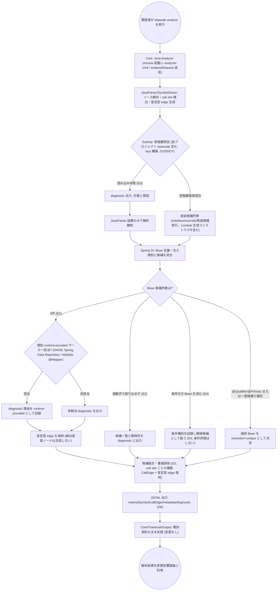
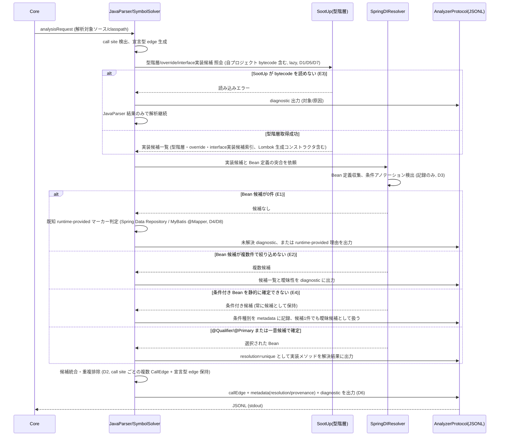

# Java Analyzer で Interface Dispatch と Spring DI を解決する

> spec 本体。要求の正は [requirements.md](requirements.md)。本 doc は spec-lifecycle (scaffold 〜 review) の作業記録であり、durable な設計成果は sync phase で上位文書 (Design Doc / feature doc / ADR) へハンドオフする。

## メタ情報

- Issue: `#21`
- ステータス: `設計中`
- 作成日: 2026-07-12
- 更新日: 2026-07-14
- Branch: `feature/21`
- Owner: Fukuemon

## 設計フェーズ状況

状態は `未着手 / 進行中 / 完了 / レビュー済 / 保留` のいずれか。保留の場合は理由を備考に残す。

| #   | フェーズ                    | 状態       | 最終更新   | 備考                                                                                                                                                                                                                                                                                                             |
| --- | --------------------------- | ---------- | ---------- | ---------------------------------------------------------------------------------------------------------------------------------------------------------------------------------------------------------------------------------------------------------------------------------------------------------------- |
| 1   | 起票                        | 完了       | 2026-07-11 | requirements.md / GitHub Issue #21 として起票済み                                                                                                                                                                                                                                                                |
| 2   | 下書き                      | レビュー済 | 2026-07-12 | 本 index.md をテンプレートから新規作成 (scaffold)。spec-review PASS (非 blocker 2 件対応済み)                                                                                                                                                                                                                    |
| 3   | 上位文書突合                | 完了       | 2026-07-14 | sync phase 完了 (2026-07-12): 「上位資料からの変更点」全 11 行を上位文書 (Design Doc 1 件 / feature doc 7 件 / context 1 件 / ADR 2 件) へ反映し、durable 成果を正本ハンドオフ済み。追加 sync (2026-07-14): D7/D8 を feature doc (java-analyzer) へ反映 (段階導入節・実行時生成実装節・E2E fixture 節・メタ情報) |
| 4   | 論点整理                    | レビュー済 | 2026-07-14 | requirements.md の Q1〜Q4 を継承。実ターゲット調査 (Lombok / MyBatis Mapper 等) を踏まえ D7/D8 を追加し clarify を再オープン。spec-review PASS (非 blocker 2 件、対応不要)                                                                                                                                       |
| 5   | 論点解決                    | レビュー済 | 2026-07-14 | D1〜D9 すべて解決済み (D7: Lombok は SootUp bytecode 照会で解決、D8: MyBatis `@Mapper` を runtime-provided マーカーに追加、D9: Core が `metadata` を opaque passthrough として保持する追加実装)。マルチモジュール対応は既定方針どおり #24 継続。spec-review PASS                                                 |
| 6   | Interface / Routing 設計    | レビュー済 | 2026-07-14 | D1/D2 で解決済み。フロー図 (CLI 起点の解析フロー) / シーケンス図 (dispatch 解決処理) 生成完了、spec-review PASS (非 blocker 3 件、実装時留意)。2026-07-14: D7/D8 (Lombok bytecode 照会 / MyBatis Mapper マーカー) のラベル更新を反映、spec-review PASS (非 blocker 1 件、対応不要)                               |
| 7   | Content / Data 設計         | レビュー済 | 2026-07-14 | 永続ストアなし・CLI のみのため大部分「該当なし」。D1〜D4/D8 の配置方針 (`analyzers/java/`) を反映済み。spec-review PASS                                                                                                                                                                                          |
| 8   | Performance / Security 設計 | レビュー済 | 2026-07-14 | D5 で確定: 計測・記録まで、SLO は #22 で確定。D7 の read-only 拡張を feature doc へ sync 済み。spec-review NEEDS_WORK→修正→PASS                                                                                                                                                                                  |
| 9   | Test / Metrics 設計         | レビュー済 | 2026-07-14 | 既存三層テスト戦略を継承し、D4/D8 (runtime-provided マーカー検出) / D7 (Lombok fixture) のテスト観点を追記済み。具体化 (テストケース単位への分解) は実装分割時に行う。spec-review PASS                                                                                                                           |
| 10  | 実装分割                    | レビュー済 | 2026-07-14 | D9 検討時に一時 `P1_02_core_metadata-passthrough.md` を生成したが、#22 D11 が同一 gap を先に担っていたことが判明したため撤回。実装分割は当初どおり P1〜P3 の 3 prompt。spec-review PASS                                                                                                                          |
| 11  | レビュー済                  | 完了       | 2026-07-14 | フェーズ1〜10 すべて完了・レビュー済。D1〜D9 全解決 (D9: Core 側修正は #22 D11 へ委譲)、実装 prompt (P1〜P3) 生成・レビュー完了。次は実装セッション (P1 から着手)                                                                                                                                                |

## 上位文書整合

正本 ([Design Doc](../../design/DesignDoc.md) / [feature doc](../../design/features/java-analyzer/DesignDoc_java-analyzer.md) / [context](../../context/) / ADR) のどの節と、どう整合させたかを記録する。

- PRD 更新要否: 不要 (本プロジェクトは統合モードのため独立 PRD なし。Design Doc の Why/What が正)
- Design Doc 更新あり (sync phase で実施): Open Question Q2 の解決状態反映 (D1 により「型階層補完のみ」で確定)。成功条件 S4/S5、Future Work「後続 feature (#21)」の記述は本 spec の前提と整合しており、本文との矛盾はなし
- ADR 起票要否: 不要 (ADR-0004 / ADR-0005 の決定枠内。新規 ADR 化が必要な代替案は現時点で発見していない)

| 上位文書                    | 節 / 該当箇所                                                                                                                         | 整合方針 (継承 / 補足 / 変更提案)                                 |
| --------------------------- | ------------------------------------------------------------------------------------------------------------------------------------- | ----------------------------------------------------------------- |
| Design Doc                  | 成功条件 S4 (Spring DI 経由の呼び出し先を実体まで解決)                                                                                | 継承                                                              |
| Design Doc                  | 成功条件 S5 (Core 無変更) — SootUp / Spring 解析は `java-analyzer` に閉じ、Core / analyzer-protocol の破壊的変更をしない              | 継承                                                              |
| Design Doc                  | Future Work「後続 feature (#21)」(型階層補完 (SootUp) → Spring 絞り込みの順で実装)                                                    | 継承                                                              |
| Design Doc                  | Open Questions Q2 (SootUp 統合範囲、期限「#21 spec の clarify 前」)                                                                   | 継承 (本 spec の論点 Q1 として引き継ぎ、clarify phase で解決する) |
| feature doc (java-analyzer) | 段階導入 (Phase1 は本 doc 確定済み、後続 feature (#21) は型階層補完 → Spring 候補絞り込み → 統合 E2E の順)                            | 継承                                                              |
| feature doc (java-analyzer) | dispatch 標識 (`callEdge.metadata.dispatch`)、帰属型の決定規則、`methodId`/`signature` 正規化規則                                     | 継承 (#21 の実装候補 edge が土台にする既存契約)                   |
| feature doc (java-analyzer) | 性能方針・baseline (数値目標未確定 (実測 baseline は feature doc に記録済み)、#22 完了時に確定予定)                                   | 継承 (#21 の追加解析コストは既存 baseline との比較対象として扱う) |
| context (architecture.md)   | Package Boundary (`java-analyzer` は Core `internal` に入れない、Core → Analyzer は Protocol 経由のみ)                                | 継承                                                              |
| context (testing.md)        | Java Analyzer 三層 (Java unit / Go process contract (fake, JVM 不要) / 実 jar E2E)                                                    | 継承                                                              |
| ADR-0004                    | 動的呼び出しの完全追跡は非対象。候補と根拠の観測可能性、再検討条件                                                                    | 継承                                                              |
| ADR-0005                    | SootUp + Spring DI を単一 feature (#21) として段階導入。責務境界 (JavaParser/SymbolSolver・SootUp・Spring DI・Core)。実装 prompt 順序 | 継承                                                              |

矛盾は検出していない。requirements.md の記述はいずれも上位文書の枠内にとどまり、上位文書側の更新提案は発生していない。

## 関連資料

- `design/DesignDoc.md`: 成功条件 S4/S5、Open Questions Q2、Future Work「後続 feature (#21)」
- `design/features/java-analyzer/DesignDoc_java-analyzer.md`: 段階導入、dispatch 標識、帰属型決定規則、性能方針
- 関連 issue: [#21](https://github.com/Fukuemon/depwalk/issues/21) / 起点 [#9](https://github.com/Fukuemon/depwalk/issues/9)
- `adr/0004-defer-runtime-call-tracing.md`
- `adr/0005-adopt-sootup-and-spring-di-resolution.md`
- `specs/9-java-analyzer/index.md`: Phase1 の `methodId`/`signature` 正規化規則 (D5)、帰属型決定規則 (D11)、性能・メモリ方針 (D9)、テスト戦略 (D10) の決定記録

## 背景

Issue #9 の Phase1 は JavaParser + SymbolSolver によるソース中心の静的解析で、interface / 基底型経由の呼び出しは宣言メソッドまでしか callee にならない。Spring Boot では interface 越しのサービス・repository 呼び出しが一般的であり、宣言メソッドだけでは「どの実装を変更すると呼び出し元へ影響するか」という変更影響調査の主要経路が実装クラスへ接続されず、Design Doc の成功条件 S4 を満たさない。

本 spec は、ADR-0005 により単一 feature として統合された次の 2 点を Java Analyzer の拡張として設計する。

1. SootUp による source / bytecode / 依存 jar をまたぐ型階層補完と Interface Dispatch / Override 候補の解決。
2. Spring の Bean 定義・注入規則の解析による、dispatch 候補から実際の Bean 候補への絞り込み。

Java Analyzer / Analyzer Protocol の責務であり、Core は Spring / JVM / SootUp の意味を解釈しない (S5、ADR-0005)。動的追跡 (Reflection / AspectJ Runtime / 実行時 Proxy) の完全解決は ADR-0004 により非対象のままとする。

## スコープ

### やること

- Interface Dispatch、継承、override、interface default method の解決
- SootUp による bytecode / 依存 jar の型階層・dispatch 情報の補完
- Spring stereotype と `@Bean` による Bean 候補の収集
- constructor / field / setter injection の解決
- `@Qualifier` / `@Primary` および一意候補による Bean 選択
- JavaParser / SootUp / Spring 解析結果の統合と call edge 重複排除
- 既存 Analyzer Protocol の metadata / diagnostic を用いた解決根拠・曖昧性の表現 (非破壊的な追加のみ)
- Spring Boot fixture による unit / integration / E2E テスト

### やらないこと

- Reflection、AspectJ Runtime、実行時 Proxy の動的追跡 (ADR-0004)
- SpEL や任意文字列から動的に選択されるクラス・メソッドの完全解決
- 実行時 profile、外部設定、条件評価を含む Spring ApplicationContext の完全再現
- Analyzer Protocol の破壊的変更
- Kotlin など Java 以外の言語解析
- CLI 引数の完全仕様確定 (→ #22 CLI interface spec)
- Gradle マルチモジュール (複数 source root) プロジェクトへの対応 (→ #24 へ切り出し。D1 決定に付随する前提制約、詳細は「設計時の論点」D1 参照)

### 前提制約

- 解析対象は単一 source root プロジェクトのみとする。Spring Boot fixture も単一モジュールで作成する。Gradle マルチモジュール対応は [#24](https://github.com/Fukuemon/depwalk/issues/24) で扱う (D1 決定に付随、clarify phase で判明)。
- 解析対象プロジェクトは解析時点でコンパイル済み (`.class` 生成済み) であることを前提とする。SootUp による Lombok 生成コンストラクタ等の bytecode 補完は、ビルド成果物の存在に依存する (D7 決定に付随)。

## 要件の解釈

### 実現したいユーザー価値

- Java/Spring Boot コードの変更影響を調査する開発者が、interface 越し・DI 経由の呼び出しについても「宣言型止まり」ではなく静的に特定できる実装候補まで影響調査できる。
- 解析結果を CI やレビューで利用するチームが、候補が一意でない場合でも根拠 (diagnostic / metadata) を確認しながら解析を継続利用できる。

### 成功条件

- interface または基底型経由の呼び出しについて、静的型階層から到達可能な実装候補への call edge を生成できる (Design Doc S4 の一部)。
- Spring の DI 情報から注入される Bean 候補を絞り込み、実装メソッドへの call edge を生成できる (S4)。
- source と依存 jar の型情報を統合し、JavaParser だけでは不足する dispatch 情報を SootUp で補完できる。
- 解決が一意でない場合も候補と diagnostic を保持し、根拠なく一つの実装へ確定しない (ADR-0004 の境界を継承)。
- Core / analyzer-protocol の破壊的変更を発生させない (S5)。

### 対象ユーザー / 操作主体

- Java/Spring Boot コードの変更影響を調査する開発者
- 解析結果を CI やレビューで利用するチーム
- Java Analyzer と Analyzer Protocol を保守する開発者

EARS 風で振る舞いを記述する (`<who>` `<trigger>` 時、システムは `<expected behavior>` する)。

- WHEN interface または基底型を通じてメソッドが呼ばれたとき、Java Analyzer は静的型階層から到達可能な実装候補への call edge を出力する。
- WHEN Spring Bean が constructor、field または setter で注入されるとき、Java Analyzer は Bean 定義と選択規則に従って実装候補への call edge を出力する。
- WHERE `@Qualifier` または `@Primary` で候補が一意になる場合、Java Analyzer は選択された Bean の実装メソッドを解決結果として出力する。
- IF 複数の実装候補が残る場合、Java Analyzer は解析を失敗させず、候補と曖昧性を diagnostic または metadata に出力する。
- IF source から必要な型階層を取得できず依存 jar に情報がある場合、Java Analyzer は SootUp で補完して dispatch を解決する。
- IF Reflection、実行時 Proxy または実行時条件がなければ確定できない場合、Java Analyzer は推測で一意に確定せず未解決理由を出力する。
- WHEN Spring Boot E2E fixture を解析したとき、既知の caller / callee 集合と一致する。検証は graph 上の既知 caller / callee 集合との照合を基本とし、CLI 出力レベルの照合は CLI interface spec (#22) 完了後に完成する (#22 完了を前提条件とする)。

## 設計時の論点

設計 / 実装フェーズへ持ち越す残課題を 1 件ずつ管理する。確定したものは「解決済みの論点」へ移す。

| #   | 論点                                                                                                                                                                                                                                                                                                                                                                                          | 決定候補                                                                                                                                                                                                                                                                                                                                        | 決定     |
| --- | --------------------------------------------------------------------------------------------------------------------------------------------------------------------------------------------------------------------------------------------------------------------------------------------------------------------------------------------------------------------------------------------- | ----------------------------------------------------------------------------------------------------------------------------------------------------------------------------------------------------------------------------------------------------------------------------------------------------------------------------------------------- | -------- |
| D1  | SootUp を型階層補完だけに使うか、call graph 生成まで使うか (requirements Q1 / Design Doc Q2 を継承)                                                                                                                                                                                                                                                                                           | A: 型階層補完のみ (call graph 生成は委譲しない)                                                                                                                                                                                                                                                                                                 | 解決済み |
| D2  | 複数 dispatch 候補を複数 edge で表すか metadata で表すか (requirements Q2)。Traversal (Core) への影響を要確認                                                                                                                                                                                                                                                                                 | A1: call site ごとの複数候補 edge (宣言型 edge 保持 + metadata で解決根拠)                                                                                                                                                                                                                                                                      | 解決済み |
| D3  | Spring 条件評価 (profile / property / conditional) をどこまで静的解決するか (requirements Q3)                                                                                                                                                                                                                                                                                                 | A: 条件評価しない (条件の検出・記録のみ、候補は常に保持)                                                                                                                                                                                                                                                                                        | 解決済み |
| D4  | Spring Data 等の実行時生成実装をどの抽象度で表すか (requirements Q4)。実行時 Proxy 自体は非対象                                                                                                                                                                                                                                                                                               | A: 宣言メソッド edge のみ + runtime-provided マーカー区別 (初期は Spring Data のみ)                                                                                                                                                                                                                                                             | 解決済み |
| D5  | SootUp / Spring 解析の追加による解析時間・最大 RSS の増分をどこまで許容するか (Issue #9 baseline との比較基準)                                                                                                                                                                                                                                                                                | A: 数値基準は定めず計測・記録を受け入れ基準に (SLO は #22 で確定)                                                                                                                                                                                                                                                                               | 解決済み |
| D6  | 候補 edge の曖昧性・解決根拠を CLI 出力でどう観測可能にするか (D2 の付随論点)                                                                                                                                                                                                                                                                                                                 | A: JSONL metadata + diagnostic まで (CLI 出力表出は #22 へ引き継ぎ)                                                                                                                                                                                                                                                                             | 解決済み |
| D7  | Lombok (`@AllArgsConstructor` / `@RequiredArgsConstructor` 等) が生成するコンストラクタを constructor injection 解決でどう扱うか (実ターゲット調査で判明、source-only の JavaParser では見えない)                                                                                                                                                                                             | B: SootUp の bytecode 型階層照会に自プロジェクトのコンパイル済み class を含め、D1 の枠内で解決                                                                                                                                                                                                                                                  | 解決済み |
| D8  | MyBatis `@Mapper` インターフェース (実装クラスがソースに存在しないランタイムプロキシ) を D4 の runtime-provided マーカー対象に含めるか (実ターゲット調査で判明。feature doc は現状「他フレームワークは後続」と記載済みのため決定後に sync 要)                                                                                                                                                 | A: MyBatis `@Mapper` も D4 のマーカー対象に追加し #21 内で対応                                                                                                                                                                                                                                                                                  | 解決済み |
| D9  | `callEdge.metadata` / `methodSymbol.metadata` (D2/D6 が前提とする resolution/provenance 等) が Core の内部表現に到達する前に消失することが実装レビューで判明。`core/internal/graph/convert.go` の `EdgeFromCallEdge` / `NodeFromMethodSymbol` が `Metadata` をコピーしておらず、`graph.Edge` / `graph.Node.Symbol` に `Metadata` フィールド自体が存在しない。#21 がこの修正を自ら実装すべきか | B: #22 の spec (`specs/22-cli-interface/index.md`) を確認したところ、D11 (決定日 2026-07-12、#21 のこの投資より先行) が同一の gap を既に発見し、`graph.Edge`/`output.EdgeView` への Metadata 透過追加として #22 の実装スコープに正しく割り当て済みだった。#21 が重複して実装すると二重管理・競合が生じるため、#21 は実装せず #22 D11 に委譲する | 解決済み |

## 解決済みの論点

(`spec-resolve` で確定したものをここに移動する)

- **D1: SootUp を型階層補完のみに使う (案 A)。call graph 生成までは委譲しない。**
  - 決定理由: ADR-0005 の責務境界 (JavaParser = source AST / 呼び出し式 / symbol 抽出、SootUp = bytecode / 依存 jar の型階層・override・interface 実装候補の補完) と整合する。Phase 1 資産 (CallGraphBuilder / AttributionResolver / methodId 正規化 D5) をそのまま延長でき、callSite の行番号精度が source 由来で保たれる。SootUp call graph (CHA/RTA) の追加能力は依存 jar 内部の呼び出し連鎖だが、帰属型規則 (D11) が scope 外 edge を出力しない現行仕様では活きず、Spring DI 絞り込みはどちらの案でも自前実装のため最終精度は同等。時間 / RSS 増分も抑えられる。
  - 前提制約: 解析対象は単一 source root プロジェクトのみとする。Gradle マルチモジュール (複数 source root) 対応は #21 のスコープ外とし、[#24](https://github.com/Fukuemon/depwalk/issues/24) へ切り出した。
  - 決定日: 2026-07-12
  - 決定者: Fukuemon

- **D2: 複数 dispatch 候補は「call site ごとに caller → 各実装候補への複数 CallEdge」で表す (案 A1)。宣言型 (interface / 基底型) への既存 edge も保持する。各 edge の metadata に解決根拠を付与する (例: `resolution: unique / ambiguous`、`provenance: sootup / spring-di` — フィールド名の最終形は設計時に確定する)。**
  - 決定理由: (1) S4 の測定方法「実装クラスのメソッドが callee として現れること」は graph 上の実 edge を要求し、Core は metadata を解釈しない (R3/S5) ため metadata 内候補配列 (案 B) では Traversal が実装候補に到達できず S4 未達となる。(2) Spring DI の絞り込みは注入点ごと (call site 単位) に決まるため、宣言メソッド→実装メソッドの型ペア単位 edge (案 A2) では「ServiceX では ImplA に確定」という解決成果を表現できない。(3) Traversal Engine は edge を区別しない BFS のため、複数候補 edge は Core / Traversal 変更ゼロで到達性に反映される。(4) Phase 1 の dispatch metadata パターンの延長で、R4 の重複排除も edgeId 単位で単純になる。
  - トレードオフとして受容: 候補が絞れない場合 edge 数が増える (過大近似が graph に入る)。確定 / 候補の区別は metadata 頼みとなる。
  - 決定日: 2026-07-12
  - 決定者: Fukuemon
  - **追記 (2026-07-14、D9 決定に伴う訂正)**: 理由(3)の「Core / Traversal 変更ゼロ」は到達性 (edge の存在・BFS 到達) についてのみ正しい。metadata (`resolution` / `provenance`) 自体を Core が保持するための実装は #21 のスコープ外で、`specs/22-cli-interface/index.md` D11 が別途担う (D9 参照)。D2 の edge 構造の決定自体は変更しない。

- **D3: Spring の条件評価 (profile / property / `@Conditional`) は一切行わない。条件アノテーションの検出と記録のみ行う (案 A)。`@Profile` / `@ConditionalOnProperty` 等の条件アノテーション付き Bean も無条件に候補として列挙する。「条件付きである」事実と条件種別を metadata / diagnostic に記録し、絞り込みの判断材料には使わない。条件付き Bean が候補に含まれる場合、候補 1 件でも「静的に一意」とは扱わず曖昧候補とする (R1/E4 整合)。**
  - 決定理由: E4 (条件未確定として候補保持、実行環境を推測しない) の既定路線の踏襲。誤判定ゼロで影響追跡として安全側。実装が単純で #21 を小さく保てる。
  - 将来拡張の余地: active profile をユーザー入力で受け取り限定評価する案 (B) は不採用だが、条件情報を metadata に記録するため、後から絞り込み層を追加する拡張は閉じない (ユースケース具体化後の後続 issue とする)。
  - 決定日: 2026-07-12
  - 決定者: Fukuemon

- **D6: 曖昧性・解決根拠の観測は、#21 では Analyzer JSONL の metadata + diagnostic までを責務とする (案 A)。CLI 出力 (Console / JSON) への edge 単位の metadata 表出は #22 (CLI interface spec) の論点として引き継ぐ。**
  - 決定理由: #21 の実装対象が java-analyzer に閉じる。R2「diagnostic または metadata で観測可能」は JSONL レベルで満たせる (曖昧ケースは diagnostic、根拠は metadata)。出力 UX / スキーマの判断を出力仕様の正本である #22 に一元化し、二重設計・衝突を避ける。
  - トレードオフとして受容: #22 完了までは CLI の JSON 出力で候補 edge を機械的にフィルタできない。
  - 決定日: 2026-07-12
  - 決定者: Fukuemon
  - **追記 (2026-07-14、D9 決定に伴う訂正)**: 「Analyzer JSONL の metadata までが #21 の責務」という切り分け自体は正しかったが、Core が metadata を内部保持しているという黙示の前提が誤りだったことが実装レビューで判明した (D9)。Core 側の opaque passthrough 実装は #21 ではなく `specs/22-cli-interface/index.md` D11 が担う。D6 の責務境界の決定自体 (JSONL までが #21、CLI 表出は #22) は変更しない。

- **D4: Spring Data 等の実行時生成実装は「宣言メソッドへの edge のみ + 既知の実行時提供マーカー検出による区別記録」で表す (案 A)。疑似実装ノードは合成しない。**
  - 具体化: 実装候補ゼロの interface 呼び出しは E1 の一般規則 (未解決 diagnostic + 宣言型 edge 保持) で処理する。ただし既知マーカーに合致する場合は「未解決」ではなく「runtime-provided (framework が実行時に提供、意図的に解決しない)」として metadata / diagnostic の理由を区別する。既知マーカーの初期対応は Spring Data の `Repository` 型階層のみとし、他フレームワーク (`@FeignClient`、MyBatis Mapper 等) の追加は後続とする。
  - 決定理由: Repository が大量にある実プロジェクトで diagnostic を「本当に調べるべき未解決」と「仕様どおり解決しないもの」に区別でき、ノイズで本物の未解決が埋もれるのを防ぐ (案 B の欠点)。疑似ノード合成 (案 C) はソースに存在しないノードが graph / 出力に混入し methodId 規則と整合せず、生成実装の先は辿れないため traversal 上の価値もない。ADR-0004 (実行時 Proxy 非対象) と整合。
  - トレードオフとして受容: 既知マーカー一覧の保守が必要 (初期は Spring Data のみに限定)。
  - 決定日: 2026-07-12
  - 決定者: Fukuemon

- **D5: SootUp / Spring 解析追加の性能増分について、#21 では数値の合否基準を定めない。「計測と記録」を受け入れ基準とする (案 A)。**
  - 具体化: #21 の完了条件は「同一 fixture での before/after (解析時間・最大 RSS) を計測し、feature doc の性能節に増分を記録する」まで。合否ライン (SLO) は #22 完了時の数値目標確定と一緒に決める (feature doc の既定路線と整合)。
  - 決定理由: 現 baseline (10 ファイル / 約 500ms / 約 122MiB) は極小 fixture の下限値で、SootUp の JVM / jar 読み込み固定費が支配的になるため、小 fixture 上の倍率は実プロジェクトを代表しない。根拠のない暫定上限 (案 B) は超過時に基準側を直す議論になり形骸化する。
  - 代替設計原則: 数値ゲートの代替として、設計原則を機能仕様の Performance 設計に明記する。「SootUp の view 構築は lazy に行い、型階層解決に必要なクラスのみ読み込む (eager な全クラス読み込みをしない)」。
  - トレードオフとして受容: 実装中の性能悪化を機械的に検知するゲートはなく、計測値の妥当性はレビューでの人間判断になる。
  - 決定日: 2026-07-12
  - 決定者: Fukuemon

- **D7: Lombok が生成するコンストラクタ (`@AllArgsConstructor` / `@RequiredArgsConstructor` 等) は、SootUp の bytecode 型階層照会対象に自プロジェクトのコンパイル済み class を含めることで解決する (案 B)。**
  - 決定理由: D1 で確定した責務分担 (SootUp = bytecode / 依存 jar からの型階層・メンバー情報補完) の枠内に収まり、新規の外部ツール依存 (delombok 前処理) や Lombok アノテーションの独自模倣ロジック (フィールド選定規則への追随コスト) を追加せずに済む。Lombok はコンパイル時にコンストラクタをバイトコードへ実体化するため、SootUp の照会対象に自プロジェクトのコンパイル済み class を含めれば、JavaParser (source-level) からは見えないコンストラクタも解決できる。実ターゲット調査で Spring 管理クラスの相当数がコンストラクタを明示せず Lombok 生成に依存していることが判明し、対応必須と判断した。
  - 前提制約: 解析対象プロジェクトは解析時点でコンパイル済み (`.class` 生成済み) であることを前提とする。ソースのみ・未ビルド状態のプロジェクトでは Lombok 生成コンストラクタの解決精度が下がる制約を受け入れる (E3 の一般規則 — SootUp が bytecode を読めない場合は diagnostic を出力し JavaParser 結果のみで解析継続 — でカバーする)。
  - 決定日: 2026-07-14
  - 決定者: Fukuemon

- **D8: D4 の runtime-provided マーカー対象に MyBatis `@Mapper` インターフェースを追加する (案 A)。#21 内で対応する。**
  - 決定理由: 実ターゲット調査で、Spring Data JPA は使われておらず、MyBatis `@Mapper` インターフェース (フレームワークによるランタイムプロキシ生成でソースに実装クラスが存在しない点で Spring Data `Repository` と同構造) が「実装クラスを持たない interface」の主要パターンであることが判明した。D4 が回避しようとした「diagnostic ノイズで本物の未解決が埋もれる」問題が、対象を Spring Data のみに限定したままでは MyBatis Mapper で同様に発生する。マーカー照合の仕組み (既知マーカー該当判定 → `runtime-provided` として diagnostic 理由を区別) は D4 と共通のため、`@Mapper` アノテーション検出を追加する実装コストは小さい。
  - 位置づけ: D4 の「初期は Spring Data の `Repository` 型階層のみとし、他フレームワークの追加は後続とする」という当初スコープを、実ターゲットの実態を踏まえて #21 内に前倒しする決定。D4 自体の決定 (宣言メソッド edge のみ + マーカー区別という方式) は変更しない。
  - トレードオフとして受容: 既知マーカー一覧の保守対象が増える (Spring Data `Repository` + MyBatis `@Mapper` の 2 種)。`@FeignClient` 等その他フレームワークへの拡張は引き続き後続とする。
  - 決定日: 2026-07-14
  - 決定者: Fukuemon

- **D9: `callEdge.metadata` / `methodSymbol.metadata` が Core 内部で消失する gap を確認したが、修正の実装は #21 では行わない (案 B)。#22 D11 が同一 gap を先に発見・decision 済みで、実装スコープとして正しく担っているため委譲する。**
  - 決定理由: 実装レビューで、`core/internal/graph/convert.go` の `EdgeFromCallEdge` / `NodeFromMethodSymbol` が `protocol.CallEdge.Metadata` / `protocol.MethodSymbol.Metadata` をコピーしておらず、`graph.Edge` / `graph.Symbol` に `Metadata` フィールド自体が存在しないことが判明した (`core/internal/analyze/analyze.go` の `buildGraph` は生の `protocol.Record` を畳み込んだ後に破棄するため、Diagnostic 以外の metadata は Core 内のどこにも残らない)。この時点では #21 自身で `graph.Edge`/`graph.Symbol` へ opaque passthrough を追加する対応 (案 A) を検討したが、並行して進行中の `specs/22-cli-interface/index.md` を確認したところ、D11 (決定日 2026-07-12、本論点より先行) が同一 gap を既に発見し「`graph.Edge` と `output.EdgeView` に Metadata を非破壊で追加し、graph convert で破棄をやめて保持、JSON formatter でそのまま載せる」という、Output 層まで含めたより完全な修正を #22 の実装スコープ (`実装対象` テーブルで `core: ◯` / `output: ◯`) として既に確定していた。#21 が同じ Core コードを重複して実装すると、2つの spec の実装 prompt が同一ファイル (`core/internal/graph/*`) を競合して変更するリスクが生じる。
  - 対応方式: #21 は Core / Output の実装を行わない。D6 の「Analyzer JSONL の metadata までが #21 の責務」という責務境界は変更しない (元々の記述どおり正しかった)。ただし D6 が黙示的に前提としていた「Core は metadata を保持する」という事実は #21 単体では保証されず、#22 D11 の実装完了が前提条件になることを明記する。
  - 位置づけ: D2/D6 の決定内容自体は変更しない。feature doc (analyzer-protocol) への「Core は metadata を意味解釈しないが破棄もしない」という記述追記は、実装主体によらず正しい durable な設計事実のため維持する。
  - トレードオフとして受容: #21 の observability chain (JSONL → CLI 表出) の完成は、#21 自身の完了条件ではなく #22 (D11 実装) に依存する。これは元々の D6 の設計 (CLI 表出は #22 の管轄) と整合しており、新たな依存ではなく既存の依存を正確化しただけである。
  - 決定日: 2026-07-14
  - 決定者: Fukuemon

## 未確定事項

(決定できない項目を理由とともに残す。1 件でも残っていれば下流 phase は止める)

- D1〜D9 すべて解決済み。未決論点なし。

## 実装対象

正規 target は `context/project.md` の対象ドメイン一覧を正本とする。

| モジュール          | 実装有無 | 主な責務                                                                                                                                                                                                                              |
| ------------------- | :------: | ------------------------------------------------------------------------------------------------------------------------------------------------------------------------------------------------------------------------------------- |
| `core`              |    -     | #21 では変更なし。D9 で判明した metadata 消失の実装修正 (`graph.Edge`/`graph.Symbol` への opaque passthrough) は #22 D11 が既に担う (`specs/22-cli-interface/index.md#解決済みの論点`)。Spring / JVM / SootUp の意味は解釈しない (S5) |
| `traversal`         |    -     | 変更なし。D2 (call site 単位の複数候補 edge) により Traversal 変更不要が確定 (edge を区別しない BFS がそのまま候補へ到達)                                                                                                             |
| `output`            |    -     | 変更なし想定。Console/JSON 表出の実装は #22 の管轄 (D6/D9、#22 D11 が担当)                                                                                                                                                            |
| `analyzer-protocol` |    -     | schema 変更なし。既存 CallEdge.metadata / Diagnostic への値追加のみ (非破壊、D1〜D4/D6)                                                                                                                                               |
| `java-analyzer`     |    ◯     | Interface Dispatch / Override 解決、SootUp 型階層補完 (自プロジェクトのコンパイル済み class を含む、D7)、Spring Bean / DI 解決、候補統合・重複排除、metadata/diagnostic 出力                                                          |

## 機能仕様

### User Flow

1. Core が既存 Analyzer 起動契約 (`--analyzer-cmd` / `DEPWALK_ANALYZER_CMD`、`--analyzer-meta`) に従って Java Analyzer process を起動し、`analysisRequest` を送信する (契約は変更しない想定)。
2. Java Analyzer は JavaParser/SymbolSolver によるソース抽出に加え、SootUp で型階層・依存 jar を補完し、Spring 解析で DI 候補を絞り込む (D1〜D4 の決定を反映)。
3. 実装候補への call edge、解決根拠、曖昧性を Protocol の `methodSymbol` / `callEdge` / `diagnostic` として stdout へ出力する。
4. Core / Traversal / Output は既存契約のまま結果を処理する (D2 確定: 候補 edge は宣言型 edge と同様に通常の CallEdge として扱われ、Traversal は edge を区別しない BFS のため変更なしで候補へ到達する)。

### Reuse Policy

- 第一原則は feature / colocation とする。SootUp / Spring 解析ロジックは `analyzers/java/` 内に閉じ、Core / analyzer-protocol へ持ち出さない (ADR-0005, S5)。
- 共通化は複数 feature / app をまたぐ再利用が明確になってから行う。

### Performance

- Issue #9 で取得した Phase1 baseline (fixture: `testdata/fixtures/java/project`、10 ファイル、約500ms、最大RSS 約122MiB) との比較で、SootUp / Spring 解析追加分の時間・最大 RSS を計測する。合否ライン (数値基準) は定めず、「計測して feature doc の性能節に増分を記録する」ことを #21 の受け入れ基準とする (D5)。SLO は #22 完了時の数値目標確定と一緒に決める。
- 設計原則: SootUp の view 構築は lazy に行い、型階層解決に必要なクラスのみ読み込む (eager な全クラス読み込みをしない) (D5)。
- 数値目標の確定方針は [context/architecture.md](../../context/architecture.md) / feature doc の性能方針を継承する。

### Routing / URL State

- 該当なし (CLI ツールであり URL state を持たない)。

### Content / Assets

- 該当なし。解析対象はソース + 依存 jar (`classpath` metadata) であり、コンテンツ配信は発生しない。

### UI Reuse

- 該当なし (CLI 出力のみ。Console / JSON フォーマットは既存 Output Engine を変更なく再利用する想定)。

### Testing

- [context/testing.md](../../context/testing.md) の Java Analyzer 三層 (Java unit / Go process contract (fake, JVM 不要) / 実 jar E2E) を踏襲する。
- SootUp / Spring 解析固有の観点として、Spring Data `Repository` および MyBatis `@Mapper` 経由呼び出しの runtime-provided マーカー検出テスト (D4/D8) を追加する。条件アノテーション検出・記録 (D3) のテストケースとあわせ、具体化は実装分割時に行う。
- Lombok (`@AllArgsConstructor` / `@RequiredArgsConstructor` 等) でコンストラクタを生成するクラスへの constructor injection 解決テストを追加する。fixture にはコンストラクタを明示しない Lombok 生成クラスを含める (D7)。

## Interface 設計

> 以下は決定時スナップショット (2026-07-12 sync phase で正本ハンドオフ済み)。正本は [feature doc](../../design/features/java-analyzer/DesignDoc_java-analyzer.md) (dispatch 標識 / Interface 設計節)。本節は決定経緯の記録として残す。

### UI / API / Event Interface

- 該当なし (CLI のみ)。Analyzer Protocol への追加が必要な場合も既存 schema の非破壊的拡張に限る (D1 解決済み: SootUp は call graph 生成まで委譲しないため、SootUp 由来の追加 edge 種別を Protocol へ持ち込む必要はない。D2 解決済み: 複数 dispatch 候補は call site ごとの複数 CallEdge として表現し、宣言型への既存 edge も保持する。D3 解決済み: Spring 条件評価は行わず、条件アノテーションの検出・記録のみを metadata / diagnostic に追加する。条件付き Bean を含む場合は候補が 1 件でも一意扱いにしない。D4 解決済み: Spring Data 等の実行時生成実装は疑似実装ノードを合成せず、宣言メソッドへの edge のみを保持する。既知マーカー (Spring Data `Repository` 型階層 + MyBatis `@Mapper`、D8 で追加) に合致する場合は diagnostic の理由を「未解決」ではなく「runtime-provided」として区別する。D6 解決済み: 観測レイヤーの責務境界として、Analyzer JSONL (metadata / diagnostic) までを #21 の責務とし、CLI 出力 (Console / JSON) への edge 単位 metadata 表出は #22 (CLI interface spec) へ引き継ぐ)。

### Props / Request / Response

- `analysisRequest` / `methodSymbol` / `callEdge` / `diagnostic` の既存 schema を変更しない前提。D2 により、複数 dispatch 候補は caller → 各実装候補への複数 `callEdge` (宣言型への既存 edge も保持) で表現し、各 edge の metadata に解決根拠 (例: `resolution: unique / ambiguous`、`provenance: sootup / spring-di`) を付与する。フィールド名の最終形は設計時に確定する。D3 により、`@Profile` / `@ConditionalOnProperty` 等の条件アノテーション付き Bean は評価せず無条件に候補として列挙し、「条件付きである」事実と条件種別を metadata / diagnostic に追加する (絞り込みには使わない、条件付き候補を含む場合は 1 件でも `resolution: unique` にしない)。D4 により、実装候補ゼロの interface 呼び出しは E1 の一般規則 (未解決 diagnostic + 宣言型 edge 保持) に従うが、既知の実行時提供マーカー (Spring Data `Repository` 型階層 + MyBatis `@Mapper`、D8 で追加) に合致する場合は diagnostic の理由を「runtime-provided」として区別する。疑似実装ノードは合成しない。SootUp 由来の型階層情報は edge の正本にはならず、JavaParser 側が生成する call edge の入力 (dispatch 候補解決の補助) としてのみ使う (D1)。

## Content / Data 設計

> 以下は決定時スナップショット (2026-07-12 sync phase で正本ハンドオフ済み)。正本は [feature doc](../../design/features/java-analyzer/DesignDoc_java-analyzer.md) (段階導入 / コンテンツ配置に相当する節)。本節は決定経緯の記録として残す。

### 保存・管理するデータ

- 永続ストアは持たない (既存方針を継承)。Core プロセス内の中間状態としてのみ graph を保持する。

### コンテンツ配置 / package / route

- SootUp / Spring 解析実装は `analyzers/java/` 配下に配置する想定 (具体的な package 構成は実装分割時に確定)。SootUp は型階層・override・interface 実装候補の索引としてのみ使用し、call edge 生成の正本は JavaParser 側に置く (D1)。複数 dispatch 候補の call edge 化・重複排除ロジックも `analyzers/java/` 内で行う (D2)。条件アノテーション (`@Profile` / `@ConditionalOnProperty` 等) の検出・記録ロジックも `analyzers/java/` 内で行い、条件評価は実装しない (D3)。実行時生成実装の既知マーカー (Spring Data `Repository` 型階層 + MyBatis `@Mapper`、D8 で追加) の照合ロジックも `analyzers/java/` 内に持ち、疑似実装ノードは合成しない (D4/D8)。

## Performance / Security 設計

> Performance 節は決定時スナップショット (2026-07-12 sync phase で正本ハンドオフ済み)。正本は [feature doc](../../design/features/java-analyzer/DesignDoc_java-analyzer.md) (性能方針節)。本節は決定経緯の記録として残す。Security / Privacy 節のうち既存方針の継承部分 (ソース・依存 jar の読み取り専用) はハンドオフ対象外。D7 で追加された自プロジェクトのコンパイル済み class の read-only 性は durable な事実のため、feature doc (段階導入節 D7 行) へ追加 sync 済み (2026-07-14)。正本は同節、本節は決定経緯の記録。

### Performance

- D5 解決済み: 数値の合否基準は定めず、同一 fixture での before/after (解析時間・最大 RSS) を計測し feature doc の性能節に増分を記録することを #21 の受け入れ基準とする。SLO (合否ライン) は #22 完了時の数値目標確定と合わせて決める。
- 設計原則: SootUp の view 構築は lazy に行い、型階層解決に必要なクラスのみ読み込む (eager な全クラス読み込みをしない)。

### Security / Privacy

- 解析対象ソース・依存 jar は読み取り専用として扱う (既存方針を継承、context/architecture.md の State Boundary)。D7 により SootUp の照会対象へ追加される自プロジェクトのコンパイル済み class も同様に読み取り専用として扱う (書き込み・実行はしない)。

## Error / Fallback 設計

### エラーケース

| #   | ケース                             | ユーザーへの見せ方                                                                                                                                                                               | リカバリ                                                       |
| --- | ---------------------------------- | ------------------------------------------------------------------------------------------------------------------------------------------------------------------------------------------------ | -------------------------------------------------------------- |
| E1  | Bean 候補が0件                     | 未解決 diagnostic を出力し解析継続。ただし既知の実行時提供マーカー (Spring Data `Repository` 型階層 + MyBatis `@Mapper`、D8 で追加) に合致する場合は理由を「runtime-provided」として区別 (D4/D8) | 宣言型の edge を保持 (疑似実装ノードは合成しない)              |
| E2  | Bean 候補が複数件で絞り込めない    | 候補一覧と曖昧性を出力                                                                                                                                                                           | 複数候補 edge + 宣言型 edge 保持 (D2)                          |
| E3  | bytecode を SootUp が読めない      | 対象と原因を diagnostic へ出力                                                                                                                                                                   | JavaParser 結果のみで解析継続                                  |
| E4  | 条件付き Bean を静的に確定できない | 条件付きであることと条件種別を metadata / diagnostic に記録し、候補を無条件に列挙                                                                                                                | 条件評価は行わず (D3)、候補 1 件でも一意扱いせず曖昧候補とする |

### Fallback

- 一意に確定できない場合は根拠なく一つへ絞らず、候補と未解決理由を diagnostic / metadata で観測可能にする (ADR-0004 を継承)。
- 観測レイヤーの責務境界 (D6): Analyzer JSONL (metadata / diagnostic) までを #21 の責務とする。CLI 出力 (Console / JSON) への edge 単位 metadata 表出は #22 (CLI interface spec) の論点として引き継ぐ。

## テスト / 評価方針

### テスト観点

- [context/testing.md](../../context/testing.md) の三層構成 (Java unit / Go process contract / 実 jar E2E) を踏襲。
- Spring Boot fixture による E2E で、既知の caller / callee 集合との照合を行う (graph 照合が基本、CLI 出力照合は #22 完了後)。
- 具体的な test case は実装分割時に追記する。

### 計測指標

- 解析時間・最大 RSS (Issue #9 baseline との差分。D5 により合否基準は定めず、計測・記録までを受け入れ基準とする)。
- 未解決 / 候補件数の diagnostic 出力件数 (観測可能性の担保)。

## フロー / シーケンス

(`spec-diagrams` で生成。spec の主要操作を Mermaid 図に落とす)

### Flowchart (ユーザー操作起点)

CLI 実行起点で `depwalk analyze` から Java Analyzer 内部の解析パイプライン全体、E1〜E4 の分岐、JSONL 出力、Core/Traversal/Output への引き渡しまでを描く。D1 (SootUp は型階層照会のみ)、D4/D8 (runtime-provided マーカー判定)、D2 (候補統合・重複排除)、D6 (JSONL までが観測責務)、D7 (SootUp は自プロジェクトの bytecode も照会) の決定を反映する。

### Sequence

Java Analyzer 内部の dispatch 解決処理 (call site 検出 → SootUp 型階層照会 → Bean 候補突合 → resolution 判定 → metadata/diagnostic 付与) を描く。E1〜E4 は alt 分岐で表現し、D1〜D4/D6/D7/D8 の決定に対応させる。third-party API 呼び出しはないため `Ext` participant は置かない。

## 実装分割

### 実装タスク案

ADR-0005 の実装 prompt 順序 (型階層補完 → Spring 候補絞り込み → 統合 E2E) を踏襲する。tasks phase で `specs/21-java-dispatch-spring-di/prompts/` に生成済み。3 phase とも並列不可の直列実行 (ADR-0005 の依存関係)。Core 側の metadata 保持実装 (D9) は #21 のスコープ外、`specs/22-cli-interface/index.md` D11 が担う。

| Phase | 対象          | 概要                                                                                                                                                                 | 依存 | prompt                                               |
| ----- | ------------- | -------------------------------------------------------------------------------------------------------------------------------------------------------------------- | ---- | ---------------------------------------------------- |
| P1    | java-analyzer | SootUp 依存追加・lazy view 構築 (自プロジェクトの class 含む, D7)、Interface Dispatch / Override 候補索引化、E3 diagnostic                                           | なし | `P1_01_java-analyzer_sootup-type-hierarchy.md`       |
| P2    | java-analyzer | Spring stereotype/`@Bean` 収集、constructor/field/setter injection 解決、`@Qualifier`/`@Primary`、条件アノテーション検出 (D3)、runtime-provided マーカー判定 (D4/D8) | P1   | `P2_01_java-analyzer_spring-di-resolution.md`        |
| P3    | java-analyzer | 候補統合・CallEdge 化・重複排除 (D2)、diagnostic 拡張 (D6)、Spring Boot fixture 新規作成、統合 E2E、性能計測・記録 (D5)                                              | P2   | `P3_01_java-analyzer_candidate-merge-fixture-e2e.md` |

### prompts 生成方針

- `context/project.md` の対象ドメインのうち `java-analyzer` を中心に分割する。
- 型階層補完 (SootUp) → Spring 候補絞り込み → 統合 E2E の順に並列実装できない依存関係を持つため、直列分割を基本とする (ADR-0005)。

## 上位資料からの変更点

本 spec で PRD / Design Doc / feature doc / context / 既存 ADR から変更・追加した内容を、反映先別に記録する。`spec-track` / `spec-sync` で更新する。

### PRD への影響

| 対象節 | 変更内容 | 理由 |
| ------ | -------- | ---- |
|        |          |      |

### Design Doc への影響

| 対象節            | 変更内容                                                                                                  | 理由                             | 状態                |
| ----------------- | --------------------------------------------------------------------------------------------------------- | -------------------------------- | ------------------- |
| Open Questions Q2 | 「SootUp 統合範囲」を解決 — 型階層補完のみ (call graph 生成は委譲しない)。sync phase で Design Doc へ反映 | source: clarify (spec D1 で決定) | 反映済 (2026-07-12) |

### feature doc への影響

| 対象 doc / 節                                                                          | 変更内容                                                                                                                                                                                                                                                                    | 理由                                                                                    | 状態                         |
| -------------------------------------------------------------------------------------- | --------------------------------------------------------------------------------------------------------------------------------------------------------------------------------------------------------------------------------------------------------------------------- | --------------------------------------------------------------------------------------- | ---------------------------- |
| feature doc (java-analyzer) dispatch 標識 (`callEdge.metadata.dispatch`)               | 複数 dispatch 候補は call site ごとの複数 CallEdge (宣言型 edge 保持 + metadata で解決根拠) で表す拡張が確定。sync phase で feature doc へ反映                                                                                                                              | source: clarify (spec D2 で決定)                                                        | 反映済 (2026-07-12)          |
| feature doc (java-analyzer) 段階導入 / 既知の制約 (override)                           | SootUp の役割を確定 — 型階層・override・interface 実装候補の索引としてのみ使用し call graph 生成は委譲しない。SootUp の view 構築は lazy に行う。「virtual dispatch の解決は後続 feature (#21) の担当」の記述を具体化。sync phase で feature doc へ反映                     | source: clarify (spec D1 で決定)                                                        | 反映済 (2026-07-12)          |
| feature doc (java-analyzer) 段階導入 (後続 feature (#21) の範囲)                       | Spring 条件アノテーション (`@Profile` / `@ConditionalOnProperty` 等) は条件評価を行わず検出・記録のみとし、候補は常に保持する方針を新規追記。sync phase で feature doc へ反映                                                                                               | source: clarify (spec D3 で決定)                                                        | 反映済 (2026-07-12)          |
| feature doc (java-analyzer) 段階導入 (後続 feature (#21) の範囲)                       | Spring Data 等の実行時生成実装は宣言メソッドへの edge のみを保持し、既知の runtime-provided マーカー (初期は Spring Data `Repository` 型階層のみ) で区別する方針を新規追記。sync phase で feature doc へ反映                                                                | source: clarify (spec D4 で決定)                                                        | 反映済 (2026-07-12)          |
| feature doc (java-analyzer) 性能方針                                                   | SootUp / Spring 解析追加分の性能増分は数値の合否基準を定めず計測・記録までを受け入れ基準とする方針 (SLO は #22 で確定) と、SootUp の view lazy 構築という設計原則を追記。sync phase で feature doc へ反映                                                                   | source: clarify (spec D5 で決定)                                                        | 反映済 (2026-07-12)          |
| feature doc (java-analyzer) 段階導入 / テスト観点                                      | 観測責務の境界 (Analyzer JSONL の metadata / diagnostic までを #21 の責務とし、CLI 出力への表出は #22 へ引き継ぐ) を新規追記。sync phase で feature doc へ反映                                                                                                              | source: clarify (spec D6 で決定)                                                        | 反映済 (2026-07-12)          |
| feature doc (java-analyzer) テスト観点 (E2E)                                           | Spring Boot fixture の新規作成が必要 (現状 `testdata/fixtures/java/` に Spring fixture なし)。単一 source root 前提での fixture 追加をテスト戦略節へ追記。sync phase で feature doc へ反映                                                                                  | source: clarify (spec D1/前提制約, D3, D4 で決定)                                       | 反映済 (2026-07-12)          |
| feature doc (java-analyzer) 段階導入 (後続 feature (#21) の範囲) / 前提制約            | Lombok 生成コンストラクタ (`@AllArgsConstructor` / `@RequiredArgsConstructor` 等) は SootUp の bytecode 型階層照会対象に自プロジェクトのコンパイル済み class を含めて解決する方針、および解析対象は事前にビルド済みであることが前提となる制約を新規追記                     | source: clarify (spec D7 で決定)                                                        | 反映済 (2026-07-14)          |
| feature doc (java-analyzer) 段階導入 (D7 行)                                           | フェーズ7-9 クローズレビュー指摘対応: D7 で SootUp の照会対象に追加される自プロジェクトのコンパイル済み class も、既存の解析対象ソース・依存 jar と同様に読み取り専用として扱う旨を追記 (spec の Security/Privacy 節が「ハンドオフ対象外」と誤って断定していたため訂正)     | source: track (spec-review 指摘対応)                                                    | 反映済 (2026-07-14)          |
| feature doc (java-analyzer) 段階導入 (後続 feature (#21) の範囲)                       | 既知の runtime-provided マーカーの初期対応を Spring Data `Repository` 型階層のみから MyBatis `@Mapper` インターフェースを含む対象へ拡大。「他フレームワーク (`@FeignClient` / MyBatis Mapper 等) への拡張は後続とする」の記述を、MyBatis Mapper については #21 内対応へ更新 | source: clarify (spec D8 で決定)                                                        | 反映済 (2026-07-14)          |
| feature doc (java-analyzer) diagnostic / error code 体系                               | 実装 prompt (P1: `JAVA_SOOTUP_UNAVAILABLE`、P3: `JAVA_RUNTIME_PROVIDED` / `JAVA_AMBIGUOUS_CANDIDATE` / `JAVA_CONDITIONAL_BEAN`) で追加する新規 diagnostic code 計 4 件を正本表へ追記する予告。各 prompt 実装完了後の phase: track/sync で反映する                           | source: track (tasks phase prompt 自己完結性レビュー指摘対応、実装未着手のため予告のみ) | 未反映 (P1/P3 実装後に sync) |
| feature doc (analyzer-protocol) `methodSymbol`/`callEdge` の `metadata` フィールド説明 | Core が `metadata` を意味解釈しないことと、Core 内部で `metadata` を破棄せず opaque passthrough として保持することは別である旨を明記 (D9、実装レビューで Core の `graph.Edge`/`graph.Symbol` に `Metadata` が存在せず消失することが判明したための訂正)                      | source: clarify (spec D9 で決定)                                                        | 反映済 (2026-07-14)          |

### context への影響

| 対象 doc / 節                                         | 変更内容                                                                                                                                                           | 理由                                                                                                                | 状態                |
| ----------------------------------------------------- | ------------------------------------------------------------------------------------------------------------------------------------------------------------------ | ------------------------------------------------------------------------------------------------------------------- | ------------------- |
| context/toolchain.md (Java Analyzer の解析スタック節) | SootUp の確定範囲を D1 で確定 — 型階層・override・interface 実装候補の索引のみ (call graph 生成は委譲しない)。「確定範囲は Q2 で詰める」の記述を確定内容に更新する | source: clarify (spec D1 で決定)。D1 (Design Doc Q2 解決) の toolchain への伝播。ADR-0005 の context 反映指示に従う | 反映済 (2026-07-12) |

- context/testing.md は更新不要: 既に「サンプル Java/Spring プロジェクト」を前提とした三層テスト戦略が記載済みで、#21 の Spring Boot fixture 追加はその枠内 (feature doc テスト観点行で管理)。

### ADR の新規 / 更新

| ADR ID   | 変更内容                                                                                         | 理由                             | 状態                |
| -------- | ------------------------------------------------------------------------------------------------ | -------------------------------- | ------------------- |
| ADR-0005 | 未決事項だった SootUp の call graph 生成委譲範囲が確定 (型階層補完のみに限定)。sync phase で反映 | source: clarify (spec D1 で決定) | 反映済 (2026-07-12) |
| ADR-0005 | 未決事項 (候補 edge / 解決根拠 / 曖昧性の Protocol 表現) が確定 — sync phase で反映              | source: clarify (spec D2 で決定) | 反映済 (2026-07-12) |

## レビュー

`spec-review` (fresh-context evaluator) の最新結果。完全な記録は `review.md` を参照。

| 日付       | 結果 (PASS / NEEDS_WORK) | 指摘要点                                                                                                                                                                                                                                              | 対応                                                                                    |
| ---------- | ------------------------ | ----------------------------------------------------------------------------------------------------------------------------------------------------------------------------------------------------------------------------------------------------- | --------------------------------------------------------------------------------------- |
| 2026-07-12 | PASS                     | scaffold: 非 blocker 2 件 (文言ずれ / typo)                                                                                                                                                                                                           | 修正済み                                                                                |
| 2026-07-12 | NEEDS_WORK→修正済み      | clarify: stale 記述 8 件 (決定の伝播漏れ)                                                                                                                                                                                                             | 全件修正、再レビューへ                                                                  |
| 2026-07-12 | PASS                     | clarify 再レビュー: 指摘 8 件反映確認、非 blocker 2 件                                                                                                                                                                                                | requirements スコープ反映 / phase 6 で留意                                              |
| 2026-07-12 | PASS                     | diagram: 図と決定の整合良好、非 blocker 3 件 (実装時留意)                                                                                                                                                                                             | 備考に記録                                                                              |
| 2026-07-12 | NEEDS_WORK→修正済み      | track: context 反映行の記録漏れ + minor 2 件                                                                                                                                                                                                          | 全件修正、再レビューへ                                                                  |
| 2026-07-12 | PASS                     | track 再レビュー: 指摘 3 件反映確認                                                                                                                                                                                                                   | sync で toolchain 最終更新日に留意                                                      |
| 2026-07-14 | PASS                     | clarify 再オープン分 (D7/D8): 非 blocker 2 件 (diagram ラベル未更新は追跡済み / D7 の EARS 明示は推奨事項)                                                                                                                                            | 対応不要。sync phase (feature doc) と diagram phase (MyBatis ラベル) を次工程として推奨 |
| 2026-07-14 | PASS                     | diagram 再実行分 (D7/D8 ラベル反映): 指摘なし、非 blocker 1 件 (E3 分岐への D7 前提制約の明示は不要と判断)                                                                                                                                            | 対応不要                                                                                |
| 2026-07-14 | NEEDS_WORK→修正済み      | フェーズ7-9 クローズ: D7 read-only 拡張が feature doc 未反映のまま「ハンドオフ対象外」と断定                                                                                                                                                          | feature doc へ追記、spec 見出し訂正、変更点テーブルに行追加。再レビューへ               |
| 2026-07-14 | PASS                     | フェーズ7-9 再レビュー: 指摘解消確認                                                                                                                                                                                                                  | フェーズ7-9 を完了として確定                                                            |
| 2026-07-14 | NEEDS_WORK→修正済み      | tasks phase (1回目): P3 の severity が spec に存在しない表を参照 (自己完結性違反)                                                                                                                                                                     | P3 に severity 確定値を直書き。再レビューへ                                             |
| 2026-07-14 | NEEDS_WORK→修正済み      | tasks phase (2回目): P3 の新規 diagnostic code に feature doc 反映経路の指示なし                                                                                                                                                                      | P3 に sync ルーティング注記・完了条件・予告行を追加。再レビューへ                       |
| 2026-07-14 | NEEDS_WORK→修正済み      | tasks phase (3回目): 同種の指摘が P1 (E3 用 code) にも波及、review.md/変更履歴の記録漏れ                                                                                                                                                              | P1 にも同一パターンを適用、review.md/変更履歴を同期。再レビューへ                       |
| 2026-07-14 | PASS                     | tasks phase 最終レビュー: 全指摘の解消確認、P2 への波及なしも確認                                                                                                                                                                                     | tasks phase (P1/P2/P3) を最終 PASS として確定                                           |
| 2026-07-14 | PASS                     | D9 (Core metadata passthrough) 追加分 (1回目): 指摘なし。D2/D6 訂正注記・実装対象表・feature doc sync・P1_02 の整合確認                                                                                                                               | D9 を解決済みとして確定 (この時点では #21 が自ら実装する案 A)                           |
| 2026-07-14 | PASS                     | D9 (Core metadata passthrough) 訂正分 (案 B、#22 D11 へ委譲): #22 D11 の内容・決定日を実ファイルで確認し #21 側記述と完全一致、実装対象表/実装タスク案/prompts (P1_02 削除・P3 依存除去) が D9 追加前の状態に正しく復元されていることを確認。指摘なし | D9 (案 B) を最終確定、フェーズ10・11 をレビュー済/完了として最終化                      |

## 変更履歴

| 日付       | 変更者 | 変更内容                                                                                                                                                                                                                                                                                                                                                                                                                                                                                           |
| ---------- | ------ | -------------------------------------------------------------------------------------------------------------------------------------------------------------------------------------------------------------------------------------------------------------------------------------------------------------------------------------------------------------------------------------------------------------------------------------------------------------------------------------------------- |
| 2026-07-12 | Claude | requirements.md と上位文書を基に index.md を新規作成 (scaffold)                                                                                                                                                                                                                                                                                                                                                                                                                                    |
| 2026-07-12 | Claude | scaffold 完了、spec-review PASS。非 blocker 指摘 2 件 (feature doc 行の文言ずれ / 「からから」typo) を修正                                                                                                                                                                                                                                                                                                                                                                                         |
| 2026-07-12 | Claude | clarify: D1 (SootUp を型階層補完のみに使う) を決定として反映。Gradle マルチモジュール対応を #24 へ切り出し                                                                                                                                                                                                                                                                                                                                                                                         |
| 2026-07-12 | Claude | clarify: D2 (複数 dispatch 候補は call site ごとの複数候補 edge、案 A1) を決定として反映。付随論点 D6 (曖昧性・解決根拠の CLI 出力での観測可能性) を追加                                                                                                                                                                                                                                                                                                                                           |
| 2026-07-12 | Claude | clarify: D6 (観測は Analyzer JSONL の metadata + diagnostic までを #21 の責務とし、CLI 出力表出は #22 へ引き継ぐ、案 A) を決定として反映                                                                                                                                                                                                                                                                                                                                                           |
| 2026-07-12 | Claude | clarify: D3 (Spring 条件評価は行わず、条件アノテーションの検出・記録のみ行う、案 A) を決定として反映                                                                                                                                                                                                                                                                                                                                                                                               |
| 2026-07-12 | Claude | clarify: D4 (実行時生成実装は宣言メソッド edge のみ + runtime-provided マーカー区別、初期は Spring Data のみ、案 A) を決定として反映                                                                                                                                                                                                                                                                                                                                                               |
| 2026-07-12 | Claude | clarify: D5 (性能増分は数値基準を定めず計測・記録を受け入れ基準に、SLO は #22 で確定、案 A) を決定として反映。D1〜D6 全論点解決、clarify phase 完了                                                                                                                                                                                                                                                                                                                                                |
| 2026-07-12 | Claude | clarify レビュー指摘 8 件対応 (stale 記述を D1〜D6 決定内容に同期)                                                                                                                                                                                                                                                                                                                                                                                                                                 |
| 2026-07-12 | Claude | clarify 再レビュー PASS。requirements.md のスコープへ Gradle マルチモジュール非対応 (#24 切り出し) を反映、clarify phase 完了                                                                                                                                                                                                                                                                                                                                                                      |
| 2026-07-12 | Claude | diagram: フロー図 (CLI 起点の解析フロー、E1〜E4 分岐込み) とシーケンス図 (Java Analyzer 内部の dispatch 解決処理) を生成、D1〜D6/E1〜E4 に対応付け                                                                                                                                                                                                                                                                                                                                                 |
| 2026-07-12 | Claude | diagram レビュー PASS、実装時留意点 (BeanCount 分岐の判定順序 / diagnostic・callEdge 出力タイミング) を記録                                                                                                                                                                                                                                                                                                                                                                                        |
| 2026-07-12 | Claude | track phase: 上位資料からの変更点を最新化。feature doc への影響行を 6 件追加 (D1/D3/D4/D5/D6/Spring Boot fixture)。Design Doc / ADR / context / PRD は既存記録済み・変更なしを確認                                                                                                                                                                                                                                                                                                                 |
| 2026-07-12 | Claude | track レビュー指摘 3 件対応 (context への影響テーブルに D1 → toolchain.md 反映行を追加、testing.md 更新不要の根拠記録、ADR テーブル D1 行の文言統一)                                                                                                                                                                                                                                                                                                                                               |
| 2026-07-12 | Claude | track 再レビュー PASS。非 blocker (sync phase で context/toolchain.md の最終更新日を同時更新) を記録し、track phase 完了                                                                                                                                                                                                                                                                                                                                                                           |
| 2026-07-12 | Claude | sync phase: 上位文書 11 件反映 (Design Doc 1 / feature doc 7 / context 1 / ADR 2) + 正本ハンドオフ (Interface / Content・Data / Performance 設計節を feature doc へ)                                                                                                                                                                                                                                                                                                                               |
| 2026-07-14 | Claude | 実ターゲットコードベースの追加調査に基づき clarify phase を再オープン。D7 (Lombok 生成コンストラクタは SootUp の自プロジェクト bytecode 照会で解決、案 B) を決定として反映、前提制約に「解析対象はビルド済みが前提」を追加。D8 (MyBatis Mapper の runtime-provided マーカー化) を新規論点として追加、検討中。マルチモジュール対応は既定方針どおり #24 継続                                                                                                                                         |
| 2026-07-14 | Claude | clarify: D8 (MyBatis `@Mapper` を D4 の runtime-provided マーカー対象に追加、#21 内対応、案 A) を決定として反映。D4 の既存決定文は不変のまま、マーカー対象を記述する現況節 (Testing / Interface 設計 snapshot / Content 配置 / Error ケース E1) を同期。D1〜D8 全論点解決、clarify 再オープン分の decision 確定完了。feature doc への影響行を 2 件追加 (D7/D8、未反映・次回 sync 待ち)                                                                                                             |
| 2026-07-14 | Claude | clarify 再オープン分 spec-review PASS。非 blocker 2 件 (diagram の MyBatis ラベル未反映は既に更新フラグで追跡済み / D7 の専用 EARS 行は推奨事項) を記録、clarify phase (再オープン分) 完了                                                                                                                                                                                                                                                                                                         |
| 2026-07-14 | Claude | 追加 sync phase: D7/D8 を feature doc (java-analyzer) へ反映 (段階導入節の Lombok 解決方針・前提制約、実行時生成実装節の MyBatis `@Mapper` マーカー拡張、E2E fixture 節、メタ情報 (最終更新日 / 関連 spec / 上位資料からの変更点))。spec 側の該当行を「反映済 (2026-07-14)」に更新                                                                                                                                                                                                                 |
| 2026-07-14 | Claude | diagram phase 再実行: flowchart / sequence を D7 (SootUp は自プロジェクト bytecode も照会、Lombok 生成コンストラクタ含む) / D8 (runtime-provided マーカーに MyBatis `@Mapper` を追加) に合わせてラベル更新。分岐構造の変更なし。備考の更新フラグを解消                                                                                                                                                                                                                                             |
| 2026-07-14 | Claude | diagram 再実行分 spec-review PASS (指摘なし、非 blocker 1 件は対応不要)。PhaseStatus #6 をレビュー済に更新                                                                                                                                                                                                                                                                                                                                                                                         |
| 2026-07-14 | Claude | Content/Data・Performance/Security・Test/Metrics 設計 (フェーズ7-9) を確定。永続ストアなし・CLI のみのため大部分「該当なし」を確認、D7 (自プロジェクトのコンパイル済み class も読み取り専用) を Security/Privacy 節へ追記。既存内容 (D1〜D8 反映済み) の完全性を再確認しクローズ                                                                                                                                                                                                                   |
| 2026-07-14 | Claude | フェーズ7-9クローズの spec-review 指摘対応: D7 の read-only 拡張が spec 内のみに留まり feature doc へ未反映だった点を修正。追加 sync で feature doc (段階導入節 D7 行) へ read-only 記述を反映、spec の Security/Privacy 節見出しの「ハンドオフ対象外」断定を訂正                                                                                                                                                                                                                                  |
| 2026-07-14 | Claude | フェーズ7-9 再レビュー PASS。PhaseStatus #7/#8/#9 をレビュー済に更新、clarify 再オープン (D7/D8) に伴う一連のフェーズ再確認 (diagram / フェーズ7-9) が完了                                                                                                                                                                                                                                                                                                                                         |
| 2026-07-14 | Claude | tasks phase: ADR-0005 の実装 prompt 順序を P1 (SootUp/型階層)・P2 (Spring DI 絞り込み)・P3 (候補統合/fixture/E2E/性能計測) の 3 prompt に分割し `specs/21-java-dispatch-spring-di/prompts/` に生成。実装タスク案テーブルを更新、PhaseStatus #10 を完了に更新。spec-review 待ち                                                                                                                                                                                                                     |
| 2026-07-14 | Claude | tasks phase spec-review 指摘対応 (3 ラウンド): P3 の severity 自己完結性違反を修正、P3/P1 の新規 diagnostic code (計4件) に feature doc sync ルーティングを追加、spec の予告行を拡張。review.md/変更履歴を同期                                                                                                                                                                                                                                                                                     |
| 2026-07-14 | Claude | D9 (Core が `callEdge.metadata`/`methodSymbol.metadata` を opaque passthrough として保持する) を決定として反映 (実装レビューで Core の `graph.Edge`/`graph.Symbol` に metadata が到達せず消失することが判明)。D2/D6 の決定文に訂正注記を追加 (決定自体は不変)。実装対象表の `core` 行を更新。feature doc (analyzer-protocol) へ sync 反映。新規 prompt `P1_02_core_metadata-passthrough.md` を生成し、P3 の前提条件・E2E ステップを更新。spec-review 待ち                                          |
| 2026-07-14 | Claude | D9 追加分 spec-review PASS。フェーズ5 (論点解決)・10 (実装分割)・11 (レビュー済) をレビュー済/完了として最終化                                                                                                                                                                                                                                                                                                                                                                                     |
| 2026-07-14 | Claude | #22 (`specs/22-cli-interface/index.md`) を確認し、D11 (2026-07-12 決定) が D9 と同一の Core metadata 消失 gap を既に発見・実装スコープに割当済みであることが判明。D9 を「#21 が実装する (案 A)」から「#22 D11 へ委譲する (案 B)」に訂正。撤回内容: `prompts/P1_02_core_metadata-passthrough.md` を削除、P3 prompt の前提条件・E2E ステップから P1_02 依存を除去、実装対象表 `core`/`output` 行・実装タスク案テーブルを D9 追加前の状態に復元 (D6 の元の責務境界が正しかったことを確認する形の訂正) |

## 備考

<!--
追加 appendix が必要な spec は、templates/specs/appendices/ から該当 topic を取り込むこと:

- API endpoint / request / response → appendices/api.md
- ER 図 / DDL / シードデータ → appendices/database.md
- ロール別 UI 制御 / API 認可マトリクス → appendices/authorization.md
- 画面コンポーネントツリー / 表示条件 → appendices/screen-spec.md
- data-testid 一覧 → appendices/testid.md
-->

現時点でこの機能に該当する appendix は見当たらない (UI / DB / 認可 / 画面 / data-testid のいずれも対象外)。clarify 完了時点の結論: 取り込む appendix なし。metadata / diagnostic の値追加は既存 schema の範囲内のため protocol schema 差分 appendix も不要。以後 diagram / tasks phase で必要が生じた場合のみ再検討する。

### 実装時の留意点 (diagram レビューより)

- flowchart の BeanCount 分岐で「条件付き Bean (E4)」は件数と直交する属性 (複数件かつ条件付きが起こり得る)。実装分割時に判定順序を明確化する。
- sequence の diagnostic / callEdge 出力タイミングが二段に読める。実装時に「出力は統合後に一括か逐次か」を確定する。
