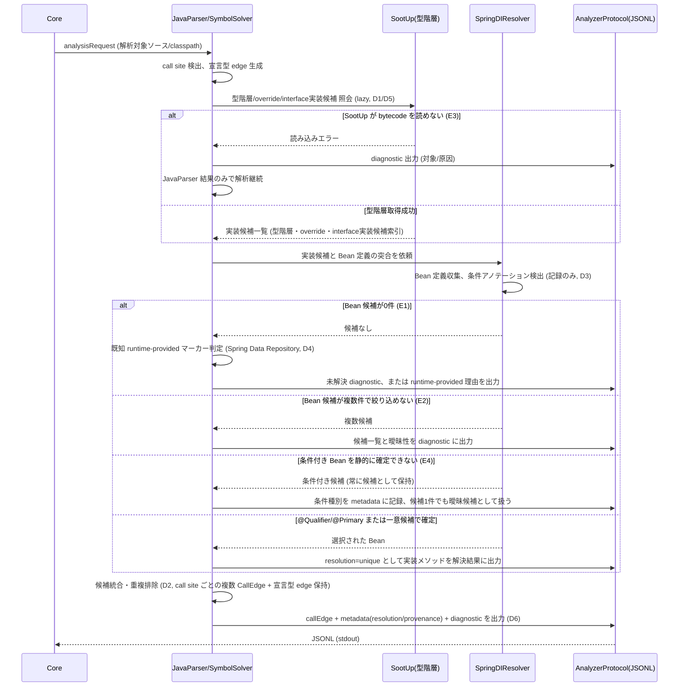

# Java Analyzer で Interface Dispatch と Spring DI を解決する

> spec 本体。要求の正は [requirements.md](requirements.md)。本 doc は spec-lifecycle (scaffold 〜 review) の作業記録であり、durable な設計成果は sync phase で上位文書 (Design Doc / feature doc / ADR) へハンドオフする。

## メタ情報

- Issue: `#21`
- ステータス: `設計中`
- 作成日: 2026-07-12
- 更新日: 2026-07-12
- Branch: `feature/21`
- Owner: Fukuemon

## 設計フェーズ状況

状態は `未着手 / 進行中 / 完了 / レビュー済 / 保留` のいずれか。保留の場合は理由を備考に残す。

| #   | フェーズ                    | 状態       | 最終更新   | 備考                                                                                                                                          |
| --- | --------------------------- | ---------- | ---------- | --------------------------------------------------------------------------------------------------------------------------------------------- |
| 1   | 起票                        | 完了       | 2026-07-11 | requirements.md / GitHub Issue #21 として起票済み                                                                                             |
| 2   | 下書き                      | レビュー済 | 2026-07-12 | 本 index.md をテンプレートから新規作成 (scaffold)。spec-review PASS (非 blocker 2 件対応済み)                                                 |
| 3   | 上位文書突合                | 完了       | 2026-07-12 | 整合確認済み・矛盾なし (上位文書への反映は sync phase)                                                                                        |
| 4   | 論点整理                    | レビュー済 | 2026-07-12 | requirements.md の Q1〜Q4 を継承。clarify phase で対話整理完了 (D1〜D6 すべて解決済み)                                                        |
| 5   | 論点解決                    | レビュー済 | 2026-07-12 | D1〜D6 すべて解決済み (D5 は数値基準を定めず計測・記録を受け入れ基準に確定)                                                                   |
| 6   | Interface / Routing 設計    | レビュー済 | 2026-07-12 | D1/D2 で解決済み。フロー図 (CLI 起点の解析フロー) / シーケンス図 (dispatch 解決処理) 生成完了、spec-review PASS (非 blocker 3 件、実装時留意) |
| 7   | Content / Data 設計         | 未着手     |            |                                                                                                                                               |
| 8   | Performance / Security 設計 | 未着手     |            | D5 で確定: 計測・記録まで、SLO は #22 で確定                                                                                                  |
| 9   | Test / Metrics 設計         | 未着手     |            |                                                                                                                                               |
| 10  | 実装分割                    | 未着手     |            | ADR-0005 の実装 prompt 順序 (型階層補完 → Spring 候補絞り込み → 統合 E2E) を踏襲予定                                                          |
| 11  | レビュー済                  | 未着手     |            |                                                                                                                                               |

## 上位文書整合

正本 ([Design Doc](../../design/DesignDoc.md) / [feature doc](../../design/features/java-analyzer/DesignDoc_java-analyzer.md) / [context](../../context/) / ADR) のどの節と、どう整合させたかを記録する。

- PRD 更新要否: 不要 (本プロジェクトは統合モードのため独立 PRD なし。Design Doc の Why/What が正)
- Design Doc 更新あり (sync phase で実施): Open Question Q2 の解決状態反映 (D1 により「型階層補完のみ」で確定)。成功条件 S4/S5、Future Work「後続 feature (#21)」の記述は本 spec の前提と整合しており、本文との矛盾はなし
- ADR 起票要否: 不要 (ADR-0004 / ADR-0005 の決定枠内。新規 ADR 化が必要な代替案は現時点で発見していない)

| 上位文書                    | 節 / 該当箇所                                                                                                                         | 整合方針 (継承 / 補足 / 変更提案)                                 |
| --------------------------- | ------------------------------------------------------------------------------------------------------------------------------------- | ----------------------------------------------------------------- |
| Design Doc                  | 成功条件 S4 (Spring DI 経由の呼び出し先を実体まで解決)                                                                                | 継承                                                              |
| Design Doc                  | 成功条件 S5 (Core 無変更) — SootUp / Spring 解析は `java-analyzer` に閉じ、Core / analyzer-protocol の破壊的変更をしない              | 継承                                                              |
| Design Doc                  | Future Work「後続 feature (#21)」(型階層補完 (SootUp) → Spring 絞り込みの順で実装)                                                    | 継承                                                              |
| Design Doc                  | Open Questions Q2 (SootUp 統合範囲、期限「#21 spec の clarify 前」)                                                                   | 継承 (本 spec の論点 Q1 として引き継ぎ、clarify phase で解決する) |
| feature doc (java-analyzer) | 段階導入 (Phase1 は本 doc 確定済み、後続 feature (#21) は型階層補完 → Spring 候補絞り込み → 統合 E2E の順)                            | 継承                                                              |
| feature doc (java-analyzer) | dispatch 標識 (`callEdge.metadata.dispatch`)、帰属型の決定規則、`methodId`/`signature` 正規化規則                                     | 継承 (#21 の実装候補 edge が土台にする既存契約)                   |
| feature doc (java-analyzer) | 性能方針・baseline (数値目標未確定 (実測 baseline は feature doc に記録済み)、#22 完了時に確定予定)                                   | 継承 (#21 の追加解析コストは既存 baseline との比較対象として扱う) |
| context (architecture.md)   | Package Boundary (`java-analyzer` は Core `internal` に入れない、Core → Analyzer は Protocol 経由のみ)                                | 継承                                                              |
| context (testing.md)        | Java Analyzer 三層 (Java unit / Go process contract (fake, JVM 不要) / 実 jar E2E)                                                    | 継承                                                              |
| ADR-0004                    | 動的呼び出しの完全追跡は非対象。候補と根拠の観測可能性、再検討条件                                                                    | 継承                                                              |
| ADR-0005                    | SootUp + Spring DI を単一 feature (#21) として段階導入。責務境界 (JavaParser/SymbolSolver・SootUp・Spring DI・Core)。実装 prompt 順序 | 継承                                                              |

矛盾は検出していない。requirements.md の記述はいずれも上位文書の枠内にとどまり、上位文書側の更新提案は発生していない。

## 関連資料

- `design/DesignDoc.md`: 成功条件 S4/S5、Open Questions Q2、Future Work「後続 feature (#21)」
- `design/features/java-analyzer/DesignDoc_java-analyzer.md`: 段階導入、dispatch 標識、帰属型決定規則、性能方針
- 関連 issue: [#21](https://github.com/Fukuemon/depwalk/issues/21) / 起点 [#9](https://github.com/Fukuemon/depwalk/issues/9)
- `adr/0004-defer-runtime-call-tracing.md`
- `adr/0005-adopt-sootup-and-spring-di-resolution.md`
- `specs/9-java-analyzer/index.md`: Phase1 の `methodId`/`signature` 正規化規則 (D5)、帰属型決定規則 (D11)、性能・メモリ方針 (D9)、テスト戦略 (D10) の決定記録

## 背景

Issue #9 の Phase1 は JavaParser + SymbolSolver によるソース中心の静的解析で、interface / 基底型経由の呼び出しは宣言メソッドまでしか callee にならない。Spring Boot では interface 越しのサービス・repository 呼び出しが一般的であり、宣言メソッドだけでは「どの実装を変更すると呼び出し元へ影響するか」という変更影響調査の主要経路が実装クラスへ接続されず、Design Doc の成功条件 S4 を満たさない。

本 spec は、ADR-0005 により単一 feature として統合された次の 2 点を Java Analyzer の拡張として設計する。

1. SootUp による source / bytecode / 依存 jar をまたぐ型階層補完と Interface Dispatch / Override 候補の解決。
2. Spring の Bean 定義・注入規則の解析による、dispatch 候補から実際の Bean 候補への絞り込み。

Java Analyzer / Analyzer Protocol の責務であり、Core は Spring / JVM / SootUp の意味を解釈しない (S5、ADR-0005)。動的追跡 (Reflection / AspectJ Runtime / 実行時 Proxy) の完全解決は ADR-0004 により非対象のままとする。

## スコープ

### やること

- Interface Dispatch、継承、override、interface default method の解決
- SootUp による bytecode / 依存 jar の型階層・dispatch 情報の補完
- Spring stereotype と `@Bean` による Bean 候補の収集
- constructor / field / setter injection の解決
- `@Qualifier` / `@Primary` および一意候補による Bean 選択
- JavaParser / SootUp / Spring 解析結果の統合と call edge 重複排除
- 既存 Analyzer Protocol の metadata / diagnostic を用いた解決根拠・曖昧性の表現 (非破壊的な追加のみ)
- Spring Boot fixture による unit / integration / E2E テスト

### やらないこと

- Reflection、AspectJ Runtime、実行時 Proxy の動的追跡 (ADR-0004)
- SpEL や任意文字列から動的に選択されるクラス・メソッドの完全解決
- 実行時 profile、外部設定、条件評価を含む Spring ApplicationContext の完全再現
- Analyzer Protocol の破壊的変更
- Kotlin など Java 以外の言語解析
- CLI 引数の完全仕様確定 (→ #22 CLI interface spec)
- Gradle マルチモジュール (複数 source root) プロジェクトへの対応 (→ #24 へ切り出し。D1 決定に付随する前提制約、詳細は「設計時の論点」D1 参照)

### 前提制約

- 解析対象は単一 source root プロジェクトのみとする。Spring Boot fixture も単一モジュールで作成する。Gradle マルチモジュール対応は [#24](https://github.com/Fukuemon/depwalk/issues/24) で扱う (D1 決定に付随、clarify phase で判明)。

## 要件の解釈

### 実現したいユーザー価値

- Java/Spring Boot コードの変更影響を調査する開発者が、interface 越し・DI 経由の呼び出しについても「宣言型止まり」ではなく静的に特定できる実装候補まで影響調査できる。
- 解析結果を CI やレビューで利用するチームが、候補が一意でない場合でも根拠 (diagnostic / metadata) を確認しながら解析を継続利用できる。

### 成功条件

- interface または基底型経由の呼び出しについて、静的型階層から到達可能な実装候補への call edge を生成できる (Design Doc S4 の一部)。
- Spring の DI 情報から注入される Bean 候補を絞り込み、実装メソッドへの call edge を生成できる (S4)。
- source と依存 jar の型情報を統合し、JavaParser だけでは不足する dispatch 情報を SootUp で補完できる。
- 解決が一意でない場合も候補と diagnostic を保持し、根拠なく一つの実装へ確定しない (ADR-0004 の境界を継承)。
- Core / analyzer-protocol の破壊的変更を発生させない (S5)。

### 対象ユーザー / 操作主体

- Java/Spring Boot コードの変更影響を調査する開発者
- 解析結果を CI やレビューで利用するチーム
- Java Analyzer と Analyzer Protocol を保守する開発者

EARS 風で振る舞いを記述する (`<who>` `<trigger>` 時、システムは `<expected behavior>` する)。

- WHEN interface または基底型を通じてメソッドが呼ばれたとき、Java Analyzer は静的型階層から到達可能な実装候補への call edge を出力する。
- WHEN Spring Bean が constructor、field または setter で注入されるとき、Java Analyzer は Bean 定義と選択規則に従って実装候補への call edge を出力する。
- WHERE `@Qualifier` または `@Primary` で候補が一意になる場合、Java Analyzer は選択された Bean の実装メソッドを解決結果として出力する。
- IF 複数の実装候補が残る場合、Java Analyzer は解析を失敗させず、候補と曖昧性を diagnostic または metadata に出力する。
- IF source から必要な型階層を取得できず依存 jar に情報がある場合、Java Analyzer は SootUp で補完して dispatch を解決する。
- IF Reflection、実行時 Proxy または実行時条件がなければ確定できない場合、Java Analyzer は推測で一意に確定せず未解決理由を出力する。
- WHEN Spring Boot E2E fixture を解析したとき、既知の caller / callee 集合と一致する。検証は graph 上の既知 caller / callee 集合との照合を基本とし、CLI 出力レベルの照合は CLI interface spec (#22) 完了後に完成する (#22 完了を前提条件とする)。

## 設計時の論点

設計 / 実装フェーズへ持ち越す残課題を 1 件ずつ管理する。確定したものは「解決済みの論点」へ移す。

| #   | 論点                                                                                                           | 決定候補                                                                            | 決定     |
| --- | -------------------------------------------------------------------------------------------------------------- | ----------------------------------------------------------------------------------- | -------- |
| D1  | SootUp を型階層補完だけに使うか、call graph 生成まで使うか (requirements Q1 / Design Doc Q2 を継承)            | A: 型階層補完のみ (call graph 生成は委譲しない)                                     | 解決済み |
| D2  | 複数 dispatch 候補を複数 edge で表すか metadata で表すか (requirements Q2)。Traversal (Core) への影響を要確認  | A1: call site ごとの複数候補 edge (宣言型 edge 保持 + metadata で解決根拠)          | 解決済み |
| D3  | Spring 条件評価 (profile / property / conditional) をどこまで静的解決するか (requirements Q3)                  | A: 条件評価しない (条件の検出・記録のみ、候補は常に保持)                            | 解決済み |
| D4  | Spring Data 等の実行時生成実装をどの抽象度で表すか (requirements Q4)。実行時 Proxy 自体は非対象                | A: 宣言メソッド edge のみ + runtime-provided マーカー区別 (初期は Spring Data のみ) | 解決済み |
| D5  | SootUp / Spring 解析の追加による解析時間・最大 RSS の増分をどこまで許容するか (Issue #9 baseline との比較基準) | A: 数値基準は定めず計測・記録を受け入れ基準に (SLO は #22 で確定)                   | 解決済み |
| D6  | 候補 edge の曖昧性・解決根拠を CLI 出力でどう観測可能にするか (D2 の付随論点)                                  | A: JSONL metadata + diagnostic まで (CLI 出力表出は #22 へ引き継ぎ)                 | 解決済み |

## 解決済みの論点

(`spec-resolve` で確定したものをここに移動する)

- **D1: SootUp を型階層補完のみに使う (案 A)。call graph 生成までは委譲しない。**
  - 決定理由: ADR-0005 の責務境界 (JavaParser = source AST / 呼び出し式 / symbol 抽出、SootUp = bytecode / 依存 jar の型階層・override・interface 実装候補の補完) と整合する。Phase 1 資産 (CallGraphBuilder / AttributionResolver / methodId 正規化 D5) をそのまま延長でき、callSite の行番号精度が source 由来で保たれる。SootUp call graph (CHA/RTA) の追加能力は依存 jar 内部の呼び出し連鎖だが、帰属型規則 (D11) が scope 外 edge を出力しない現行仕様では活きず、Spring DI 絞り込みはどちらの案でも自前実装のため最終精度は同等。時間 / RSS 増分も抑えられる。
  - 前提制約: 解析対象は単一 source root プロジェクトのみとする。Gradle マルチモジュール (複数 source root) 対応は #21 のスコープ外とし、[#24](https://github.com/Fukuemon/depwalk/issues/24) へ切り出した。
  - 決定日: 2026-07-12
  - 決定者: Fukuemon

- **D2: 複数 dispatch 候補は「call site ごとに caller → 各実装候補への複数 CallEdge」で表す (案 A1)。宣言型 (interface / 基底型) への既存 edge も保持する。各 edge の metadata に解決根拠を付与する (例: `resolution: unique / ambiguous`、`provenance: sootup / spring-di` — フィールド名の最終形は設計時に確定する)。**
  - 決定理由: (1) S4 の測定方法「実装クラスのメソッドが callee として現れること」は graph 上の実 edge を要求し、Core は metadata を解釈しない (R3/S5) ため metadata 内候補配列 (案 B) では Traversal が実装候補に到達できず S4 未達となる。(2) Spring DI の絞り込みは注入点ごと (call site 単位) に決まるため、宣言メソッド→実装メソッドの型ペア単位 edge (案 A2) では「ServiceX では ImplA に確定」という解決成果を表現できない。(3) Traversal Engine は edge を区別しない BFS のため、複数候補 edge は Core / Traversal 変更ゼロで到達性に反映される。(4) Phase 1 の dispatch metadata パターンの延長で、R4 の重複排除も edgeId 単位で単純になる。
  - トレードオフとして受容: 候補が絞れない場合 edge 数が増える (過大近似が graph に入る)。確定 / 候補の区別は metadata 頼みとなる。
  - 決定日: 2026-07-12
  - 決定者: Fukuemon

- **D3: Spring の条件評価 (profile / property / `@Conditional`) は一切行わない。条件アノテーションの検出と記録のみ行う (案 A)。`@Profile` / `@ConditionalOnProperty` 等の条件アノテーション付き Bean も無条件に候補として列挙する。「条件付きである」事実と条件種別を metadata / diagnostic に記録し、絞り込みの判断材料には使わない。条件付き Bean が候補に含まれる場合、候補 1 件でも「静的に一意」とは扱わず曖昧候補とする (R1/E4 整合)。**
  - 決定理由: E4 (条件未確定として候補保持、実行環境を推測しない) の既定路線の踏襲。誤判定ゼロで影響追跡として安全側。実装が単純で #21 を小さく保てる。
  - 将来拡張の余地: active profile をユーザー入力で受け取り限定評価する案 (B) は不採用だが、条件情報を metadata に記録するため、後から絞り込み層を追加する拡張は閉じない (ユースケース具体化後の後続 issue とする)。
  - 決定日: 2026-07-12
  - 決定者: Fukuemon

- **D6: 曖昧性・解決根拠の観測は、#21 では Analyzer JSONL の metadata + diagnostic までを責務とする (案 A)。CLI 出力 (Console / JSON) への edge 単位の metadata 表出は #22 (CLI interface spec) の論点として引き継ぐ。**
  - 決定理由: #21 の実装対象が java-analyzer に閉じる。R2「diagnostic または metadata で観測可能」は JSONL レベルで満たせる (曖昧ケースは diagnostic、根拠は metadata)。出力 UX / スキーマの判断を出力仕様の正本である #22 に一元化し、二重設計・衝突を避ける。
  - トレードオフとして受容: #22 完了までは CLI の JSON 出力で候補 edge を機械的にフィルタできない。
  - 決定日: 2026-07-12
  - 決定者: Fukuemon

- **D4: Spring Data 等の実行時生成実装は「宣言メソッドへの edge のみ + 既知の実行時提供マーカー検出による区別記録」で表す (案 A)。疑似実装ノードは合成しない。**
  - 具体化: 実装候補ゼロの interface 呼び出しは E1 の一般規則 (未解決 diagnostic + 宣言型 edge 保持) で処理する。ただし既知マーカーに合致する場合は「未解決」ではなく「runtime-provided (framework が実行時に提供、意図的に解決しない)」として metadata / diagnostic の理由を区別する。既知マーカーの初期対応は Spring Data の `Repository` 型階層のみとし、他フレームワーク (`@FeignClient`、MyBatis Mapper 等) の追加は後続とする。
  - 決定理由: Repository が大量にある実プロジェクトで diagnostic を「本当に調べるべき未解決」と「仕様どおり解決しないもの」に区別でき、ノイズで本物の未解決が埋もれるのを防ぐ (案 B の欠点)。疑似ノード合成 (案 C) はソースに存在しないノードが graph / 出力に混入し methodId 規則と整合せず、生成実装の先は辿れないため traversal 上の価値もない。ADR-0004 (実行時 Proxy 非対象) と整合。
  - トレードオフとして受容: 既知マーカー一覧の保守が必要 (初期は Spring Data のみに限定)。
  - 決定日: 2026-07-12
  - 決定者: Fukuemon

- **D5: SootUp / Spring 解析追加の性能増分について、#21 では数値の合否基準を定めない。「計測と記録」を受け入れ基準とする (案 A)。**
  - 具体化: #21 の完了条件は「同一 fixture での before/after (解析時間・最大 RSS) を計測し、feature doc の性能節に増分を記録する」まで。合否ライン (SLO) は #22 完了時の数値目標確定と一緒に決める (feature doc の既定路線と整合)。
  - 決定理由: 現 baseline (10 ファイル / 約 500ms / 約 122MiB) は極小 fixture の下限値で、SootUp の JVM / jar 読み込み固定費が支配的になるため、小 fixture 上の倍率は実プロジェクトを代表しない。根拠のない暫定上限 (案 B) は超過時に基準側を直す議論になり形骸化する。
  - 代替設計原則: 数値ゲートの代替として、設計原則を機能仕様の Performance 設計に明記する。「SootUp の view 構築は lazy に行い、型階層解決に必要なクラスのみ読み込む (eager な全クラス読み込みをしない)」。
  - トレードオフとして受容: 実装中の性能悪化を機械的に検知するゲートはなく、計測値の妥当性はレビューでの人間判断になる。
  - 決定日: 2026-07-12
  - 決定者: Fukuemon

## 未確定事項

(決定できない項目を理由とともに残す。1 件でも残っていれば下流 phase は止める)

- D1〜D6 すべて解決済み。未決論点なし。

## 実装対象

正規 target は `context/project.md` の対象ドメイン一覧を正本とする。

| モジュール          | 実装有無 | 主な責務                                                                                                                   |
| ------------------- | :------: | -------------------------------------------------------------------------------------------------------------------------- |
| `core`              |    -     | 変更なし。Spring / JVM / SootUp の意味を解釈しない (S5)                                                                    |
| `traversal`         |    -     | 変更なし。D2 (call site 単位の複数候補 edge) により Traversal 変更不要が確定 (edge を区別しない BFS がそのまま候補へ到達)  |
| `output`            |    -     | 変更なし想定                                                                                                               |
| `analyzer-protocol` |    -     | schema 変更なし。既存 CallEdge.metadata / Diagnostic への値追加のみ (非破壊、D1〜D4/D6)                                    |
| `java-analyzer`     |    ◯     | Interface Dispatch / Override 解決、SootUp 型階層補完、Spring Bean / DI 解決、候補統合・重複排除、metadata/diagnostic 出力 |

## 機能仕様

### User Flow

1. Core が既存 Analyzer 起動契約 (`--analyzer-cmd` / `DEPWALK_ANALYZER_CMD`、`--analyzer-meta`) に従って Java Analyzer process を起動し、`analysisRequest` を送信する (契約は変更しない想定)。
2. Java Analyzer は JavaParser/SymbolSolver によるソース抽出に加え、SootUp で型階層・依存 jar を補完し、Spring 解析で DI 候補を絞り込む (D1〜D4 の決定を反映)。
3. 実装候補への call edge、解決根拠、曖昧性を Protocol の `methodSymbol` / `callEdge` / `diagnostic` として stdout へ出力する。
4. Core / Traversal / Output は既存契約のまま結果を処理する (D2 確定: 候補 edge は宣言型 edge と同様に通常の CallEdge として扱われ、Traversal は edge を区別しない BFS のため変更なしで候補へ到達する)。

### Reuse Policy

- 第一原則は feature / colocation とする。SootUp / Spring 解析ロジックは `analyzers/java/` 内に閉じ、Core / analyzer-protocol へ持ち出さない (ADR-0005, S5)。
- 共通化は複数 feature / app をまたぐ再利用が明確になってから行う。

### Performance

- Issue #9 で取得した Phase1 baseline (fixture: `testdata/fixtures/java/project`、10 ファイル、約500ms、最大RSS 約122MiB) との比較で、SootUp / Spring 解析追加分の時間・最大 RSS を計測する。合否ライン (数値基準) は定めず、「計測して feature doc の性能節に増分を記録する」ことを #21 の受け入れ基準とする (D5)。SLO は #22 完了時の数値目標確定と一緒に決める。
- 設計原則: SootUp の view 構築は lazy に行い、型階層解決に必要なクラスのみ読み込む (eager な全クラス読み込みをしない) (D5)。
- 数値目標の確定方針は [context/architecture.md](../../context/architecture.md) / feature doc の性能方針を継承する。

### Routing / URL State

- 該当なし (CLI ツールであり URL state を持たない)。

### Content / Assets

- 該当なし。解析対象はソース + 依存 jar (`classpath` metadata) であり、コンテンツ配信は発生しない。

### UI Reuse

- 該当なし (CLI 出力のみ。Console / JSON フォーマットは既存 Output Engine を変更なく再利用する想定)。

### Testing

- [context/testing.md](../../context/testing.md) の Java Analyzer 三層 (Java unit / Go process contract (fake, JVM 不要) / 実 jar E2E) を踏襲する。
- SootUp / Spring 解析固有の観点として、Spring Data `Repository` 経由呼び出しの runtime-provided マーカー検出テスト (D4) を追加する。条件アノテーション検出・記録 (D3) のテストケースとあわせ、具体化は実装分割時に行う。

## Interface 設計

### UI / API / Event Interface

- 該当なし (CLI のみ)。Analyzer Protocol への追加が必要な場合も既存 schema の非破壊的拡張に限る (D1 解決済み: SootUp は call graph 生成まで委譲しないため、SootUp 由来の追加 edge 種別を Protocol へ持ち込む必要はない。D2 解決済み: 複数 dispatch 候補は call site ごとの複数 CallEdge として表現し、宣言型への既存 edge も保持する。D3 解決済み: Spring 条件評価は行わず、条件アノテーションの検出・記録のみを metadata / diagnostic に追加する。条件付き Bean を含む場合は候補が 1 件でも一意扱いにしない。D4 解決済み: Spring Data 等の実行時生成実装は疑似実装ノードを合成せず、宣言メソッドへの edge のみを保持する。既知マーカー (初期は Spring Data `Repository` 型階層) に合致する場合は diagnostic の理由を「未解決」ではなく「runtime-provided」として区別する。D6 解決済み: 観測レイヤーの責務境界として、Analyzer JSONL (metadata / diagnostic) までを #21 の責務とし、CLI 出力 (Console / JSON) への edge 単位 metadata 表出は #22 (CLI interface spec) へ引き継ぐ)。

### Props / Request / Response

- `analysisRequest` / `methodSymbol` / `callEdge` / `diagnostic` の既存 schema を変更しない前提。D2 により、複数 dispatch 候補は caller → 各実装候補への複数 `callEdge` (宣言型への既存 edge も保持) で表現し、各 edge の metadata に解決根拠 (例: `resolution: unique / ambiguous`、`provenance: sootup / spring-di`) を付与する。フィールド名の最終形は設計時に確定する。D3 により、`@Profile` / `@ConditionalOnProperty` 等の条件アノテーション付き Bean は評価せず無条件に候補として列挙し、「条件付きである」事実と条件種別を metadata / diagnostic に追加する (絞り込みには使わない、条件付き候補を含む場合は 1 件でも `resolution: unique` にしない)。D4 により、実装候補ゼロの interface 呼び出しは E1 の一般規則 (未解決 diagnostic + 宣言型 edge 保持) に従うが、既知の実行時提供マーカー (初期は Spring Data `Repository` 型階層) に合致する場合は diagnostic の理由を「runtime-provided」として区別する。疑似実装ノードは合成しない。SootUp 由来の型階層情報は edge の正本にはならず、JavaParser 側が生成する call edge の入力 (dispatch 候補解決の補助) としてのみ使う (D1)。

## Content / Data 設計

### 保存・管理するデータ

- 永続ストアは持たない (既存方針を継承)。Core プロセス内の中間状態としてのみ graph を保持する。

### コンテンツ配置 / package / route

- SootUp / Spring 解析実装は `analyzers/java/` 配下に配置する想定 (具体的な package 構成は実装分割時に確定)。SootUp は型階層・override・interface 実装候補の索引としてのみ使用し、call edge 生成の正本は JavaParser 側に置く (D1)。複数 dispatch 候補の call edge 化・重複排除ロジックも `analyzers/java/` 内で行う (D2)。条件アノテーション (`@Profile` / `@ConditionalOnProperty` 等) の検出・記録ロジックも `analyzers/java/` 内で行い、条件評価は実装しない (D3)。実行時生成実装の既知マーカー (初期は Spring Data `Repository` 型階層) の照合ロジックも `analyzers/java/` 内に持ち、疑似実装ノードは合成しない (D4)。

## Performance / Security 設計

### Performance

- D5 解決済み: 数値の合否基準は定めず、同一 fixture での before/after (解析時間・最大 RSS) を計測し feature doc の性能節に増分を記録することを #21 の受け入れ基準とする。SLO (合否ライン) は #22 完了時の数値目標確定と合わせて決める。
- 設計原則: SootUp の view 構築は lazy に行い、型階層解決に必要なクラスのみ読み込む (eager な全クラス読み込みをしない)。

### Security / Privacy

- 解析対象ソース・依存 jar は読み取り専用として扱う (既存方針を継承、context/architecture.md の State Boundary)。

## Error / Fallback 設計

### エラーケース

| #   | ケース                             | ユーザーへの見せ方                                                                                                                                                    | リカバリ                                                       |
| --- | ---------------------------------- | --------------------------------------------------------------------------------------------------------------------------------------------------------------------- | -------------------------------------------------------------- |
| E1  | Bean 候補が0件                     | 未解決 diagnostic を出力し解析継続。ただし既知の実行時提供マーカー (初期は Spring Data `Repository` 型階層) に合致する場合は理由を「runtime-provided」として区別 (D4) | 宣言型の edge を保持 (疑似実装ノードは合成しない)              |
| E2  | Bean 候補が複数件で絞り込めない    | 候補一覧と曖昧性を出力                                                                                                                                                | 複数候補 edge + 宣言型 edge 保持 (D2)                          |
| E3  | bytecode を SootUp が読めない      | 対象と原因を diagnostic へ出力                                                                                                                                        | JavaParser 結果のみで解析継続                                  |
| E4  | 条件付き Bean を静的に確定できない | 条件付きであることと条件種別を metadata / diagnostic に記録し、候補を無条件に列挙                                                                                     | 条件評価は行わず (D3)、候補 1 件でも一意扱いせず曖昧候補とする |

### Fallback

- 一意に確定できない場合は根拠なく一つへ絞らず、候補と未解決理由を diagnostic / metadata で観測可能にする (ADR-0004 を継承)。
- 観測レイヤーの責務境界 (D6): Analyzer JSONL (metadata / diagnostic) までを #21 の責務とする。CLI 出力 (Console / JSON) への edge 単位 metadata 表出は #22 (CLI interface spec) の論点として引き継ぐ。

## テスト / 評価方針

### テスト観点

- [context/testing.md](../../context/testing.md) の三層構成 (Java unit / Go process contract / 実 jar E2E) を踏襲。
- Spring Boot fixture による E2E で、既知の caller / callee 集合との照合を行う (graph 照合が基本、CLI 出力照合は #22 完了後)。
- 具体的な test case は実装分割時に追記する。

### 計測指標

- 解析時間・最大 RSS (Issue #9 baseline との差分。D5 により合否基準は定めず、計測・記録までを受け入れ基準とする)。
- 未解決 / 候補件数の diagnostic 出力件数 (観測可能性の担保)。

## フロー / シーケンス

(`spec-diagrams` で生成。spec の主要操作を Mermaid 図に落とす)

### Flowchart (ユーザー操作起点)

CLI 実行起点で `depwalk analyze` から Java Analyzer 内部の解析パイプライン全体、E1〜E4 の分岐、JSONL 出力、Core/Traversal/Output への引き渡しまでを描く。D1 (SootUp は型階層照会のみ)、D4 (runtime-provided マーカー判定)、D2 (候補統合・重複排除)、D6 (JSONL までが観測責務) の決定を反映する。

### Sequence

Java Analyzer 内部の dispatch 解決処理 (call site 検出 → SootUp 型階層照会 → Bean 候補突合 → resolution 判定 → metadata/diagnostic 付与) を描く。E1〜E4 は alt 分岐で表現し、D1〜D4/D6 の決定に対応させる。third-party API 呼び出しはないため `Ext` participant は置かない。

## 実装分割

### 実装タスク案

ADR-0005 の実装 prompt 順序 (型階層補完 → Spring 候補絞り込み → 統合 E2E) を踏襲する想定。詳細は tasks phase で確定する。

| Phase | 対象 | 概要 | 依存 |
| ----- | ---- | ---- | ---- |
| P1    |      |      |      |

### prompts 生成方針

- `context/project.md` の対象ドメインのうち `java-analyzer` を中心に分割する。
- 型階層補完 (SootUp) → Spring 候補絞り込み → 統合 E2E の順に並列実装できない依存関係を持つため、直列分割を基本とする (ADR-0005)。

## 上位資料からの変更点

本 spec で PRD / Design Doc / feature doc / context / 既存 ADR から変更・追加した内容を、反映先別に記録する。`spec-track` / `spec-sync` で更新する。

### PRD への影響

| 対象節 | 変更内容 | 理由 |
| ------ | -------- | ---- |
|        |          |      |

### Design Doc への影響

| 対象節            | 変更内容                                                                                                  | 理由                             |
| ----------------- | --------------------------------------------------------------------------------------------------------- | -------------------------------- |
| Open Questions Q2 | 「SootUp 統合範囲」を解決 — 型階層補完のみ (call graph 生成は委譲しない)。sync phase で Design Doc へ反映 | source: clarify (spec D1 で決定) |

### feature doc への影響

| 対象 doc / 節                                                            | 変更内容                                                                                                                                       | 理由                             |
| ------------------------------------------------------------------------ | ---------------------------------------------------------------------------------------------------------------------------------------------- | -------------------------------- |
| feature doc (java-analyzer) dispatch 標識 (`callEdge.metadata.dispatch`) | 複数 dispatch 候補は call site ごとの複数 CallEdge (宣言型 edge 保持 + metadata で解決根拠) で表す拡張が確定。sync phase で feature doc へ反映 | source: clarify (spec D2 で決定) |

### context への影響

| 対象 doc / 節 | 変更内容 | 理由 |
| ------------- | -------- | ---- |
|               |          |      |

### ADR の新規 / 更新

| ADR ID   | 変更内容                                                                            | 理由                             |
| -------- | ----------------------------------------------------------------------------------- | -------------------------------- |
| ADR-0005 | 未決事項だった SootUp の call graph 生成委譲範囲が確定 (型階層補完のみに限定)       | source: clarify (spec D1 で決定) |
| ADR-0005 | 未決事項 (候補 edge / 解決根拠 / 曖昧性の Protocol 表現) が確定 — sync phase で反映 | source: clarify (spec D2 で決定) |

## レビュー

`spec-review` (fresh-context evaluator) の最新結果。完全な記録は `review.md` を参照。

| 日付       | 結果 (PASS / NEEDS_WORK) | 指摘要点                                                  | 対応                                       |
| ---------- | ------------------------ | --------------------------------------------------------- | ------------------------------------------ |
| 2026-07-12 | PASS                     | scaffold: 非 blocker 2 件 (文言ずれ / typo)               | 修正済み                                   |
| 2026-07-12 | NEEDS_WORK→修正済み      | clarify: stale 記述 8 件 (決定の伝播漏れ)                 | 全件修正、再レビューへ                     |
| 2026-07-12 | PASS                     | clarify 再レビュー: 指摘 8 件反映確認、非 blocker 2 件    | requirements スコープ反映 / phase 6 で留意 |
| 2026-07-12 | PASS                     | diagram: 図と決定の整合良好、非 blocker 3 件 (実装時留意) | 備考に記録                                 |

## 変更履歴

| 日付       | 変更者 | 変更内容                                                                                                                                                 |
| ---------- | ------ | -------------------------------------------------------------------------------------------------------------------------------------------------------- |
| 2026-07-12 | Claude | requirements.md と上位文書を基に index.md を新規作成 (scaffold)                                                                                          |
| 2026-07-12 | Claude | scaffold 完了、spec-review PASS。非 blocker 指摘 2 件 (feature doc 行の文言ずれ / 「からから」typo) を修正                                               |
| 2026-07-12 | Claude | clarify: D1 (SootUp を型階層補完のみに使う) を決定として反映。Gradle マルチモジュール対応を #24 へ切り出し                                               |
| 2026-07-12 | Claude | clarify: D2 (複数 dispatch 候補は call site ごとの複数候補 edge、案 A1) を決定として反映。付随論点 D6 (曖昧性・解決根拠の CLI 出力での観測可能性) を追加 |
| 2026-07-12 | Claude | clarify: D6 (観測は Analyzer JSONL の metadata + diagnostic までを #21 の責務とし、CLI 出力表出は #22 へ引き継ぐ、案 A) を決定として反映                 |
| 2026-07-12 | Claude | clarify: D3 (Spring 条件評価は行わず、条件アノテーションの検出・記録のみ行う、案 A) を決定として反映                                                     |
| 2026-07-12 | Claude | clarify: D4 (実行時生成実装は宣言メソッド edge のみ + runtime-provided マーカー区別、初期は Spring Data のみ、案 A) を決定として反映                     |
| 2026-07-12 | Claude | clarify: D5 (性能増分は数値基準を定めず計測・記録を受け入れ基準に、SLO は #22 で確定、案 A) を決定として反映。D1〜D6 全論点解決、clarify phase 完了      |
| 2026-07-12 | Claude | clarify レビュー指摘 8 件対応 (stale 記述を D1〜D6 決定内容に同期)                                                                                       |
| 2026-07-12 | Claude | clarify 再レビュー PASS。requirements.md のスコープへ Gradle マルチモジュール非対応 (#24 切り出し) を反映、clarify phase 完了                            |
| 2026-07-12 | Claude | diagram: フロー図 (CLI 起点の解析フロー、E1〜E4 分岐込み) とシーケンス図 (Java Analyzer 内部の dispatch 解決処理) を生成、D1〜D6/E1〜E4 に対応付け       |
| 2026-07-12 | Claude | diagram レビュー PASS、実装時留意点 (BeanCount 分岐の判定順序 / diagnostic・callEdge 出力タイミング) を記録                                              |

## 備考

<!--
追加 appendix が必要な spec は、templates/specs/appendices/ から該当 topic を取り込むこと:

- API endpoint / request / response → appendices/api.md
- ER 図 / DDL / シードデータ → appendices/database.md
- ロール別 UI 制御 / API 認可マトリクス → appendices/authorization.md
- 画面コンポーネントツリー / 表示条件 → appendices/screen-spec.md
- data-testid 一覧 → appendices/testid.md
-->

現時点でこの機能に該当する appendix は見当たらない (UI / DB / 認可 / 画面 / data-testid のいずれも対象外)。clarify 完了時点の結論: 取り込む appendix なし。metadata / diagnostic の値追加は既存 schema の範囲内のため protocol schema 差分 appendix も不要。以後 diagram / tasks phase で必要が生じた場合のみ再検討する。

### 実装時の留意点 (diagram レビューより)

- flowchart の BeanCount 分岐で「条件付き Bean (E4)」は件数と直交する属性 (複数件かつ条件付きが起こり得る)。実装分割時に判定順序を明確化する。
- sequence の diagnostic / callEdge 出力タイミングが二段に読める。実装時に「出力は統合後に一括か逐次か」を確定する。
