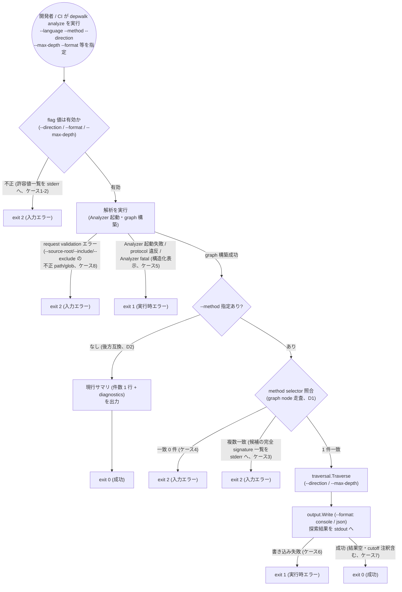
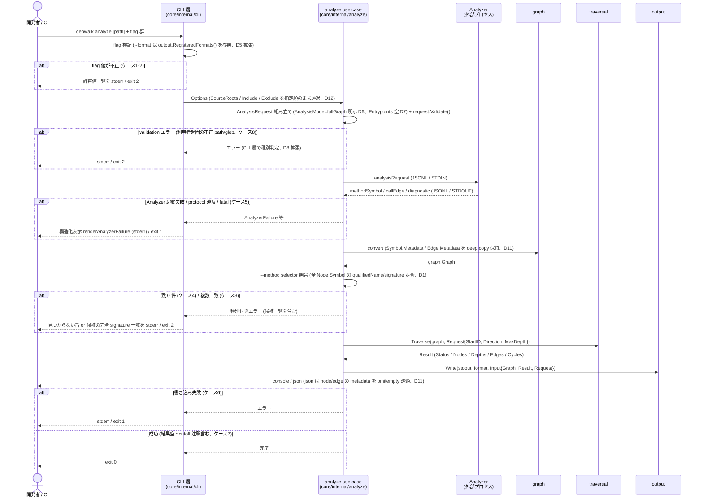

# CLI interface 結合 — analyze / traversal / output を配線し depwalk として機能させる

> spec 本体テンプレート。
> 機能固有の追加節 (API endpoint / ER 図 / 認可マトリクス / data-testid 等) は `templates/specs/appendices/<topic>.md` から該当 appendix を取り込む。
> 必須節・必須サブ節は `hooks/spec/validate_document.sh` が検査し、レビュー観点は `.rulesync/skills/spec-review/references/review-rubric.md` が評価する。
>
> 本 spec は CLI ツールであり API / DB / 認可 / 画面 / data-testid のいずれにも該当しないため、appendix は取り込まない。

## メタ情報

- Issue: `#22`
- ステータス: `In Progress`
- 作成日: 2026-07-12
- 更新日: 2026-07-20
- Branch: `feature/22`
- Owner: Fukuemon

## 設計フェーズ状況

状態は `未着手 / 進行中 / 完了 / レビュー済 / 保留` のいずれか。保留の場合は理由を備考に残す。

| #   | フェーズ                    | 状態       | 最終更新   | 備考                                                                                                                                                                                                                                                       |
| --- | --------------------------- | ---------- | ---------- | ---------------------------------------------------------------------------------------------------------------------------------------------------------------------------------------------------------------------------------------------------------- |
| 1   | 起票                        | 完了       | 2026-07-12 | issue #22                                                                                                                                                                                                                                                  |
| 2   | 下書き (scaffold)           | レビュー済 | 2026-07-12 |                                                                                                                                                                                                                                                            |
| 3   | 上位文書突合                | 完了       | 2026-07-12 |                                                                                                                                                                                                                                                            |
| 4   | 論点整理                    | 完了       | 2026-07-12 |                                                                                                                                                                                                                                                            |
| 5   | 論点解決                    | レビュー済 | 2026-07-20 | D11 を拡張 (graph.Symbol/output.NodeView への Metadata 透過を追加)。develop rebase 後の再検証で再オープンし再確定。2026-07-20 の develop (#24 マージ済み) rebase 後の再検証で D12 (include/exclude の CLI flag 化) を追加し再オープン、同日再レビュー PASS |
| 6   | Interface / Routing 設計    | レビュー済 | 2026-07-20 | CLI flag 体系表・exit code 配線・Request/Response 変換・D11 拡張の Node 側 JSON スキーマ影響を記述。phase 6 再レビュー PASS 後、2026-07-20 に #24 反映 (既存 flag 4 つ化・D12 flag 追加・AnalyzerFailure 経路との整合) で更新、同日再レビュー PASS         |
| 7   | Content / Data 設計         | レビュー済 | 2026-07-20 | 永続ストアなし・package 配置方針を記述。CLI のため Content/Assets・UI Reuse は該当なし。レビュー PASS (1周目) 後、2026-07-20 に #24 反映 (graph.Symbol 側実装済み・E2E harness 再利用) で配置記述を現状化、同日再レビュー PASS                             |
| 8   | Performance / Security 設計 | レビュー済 | 2026-07-20 | Performance (SLO 確定は実装フェーズへ委譲)・Security/Privacy (既存読み取り専用方針の継承)・Error/Fallback を記述。再レビュー PASS 後、2026-07-20 に #24 反映 (エラーケース 8 追加・ケース 5 の対象を構造化 renderer に更新) で更新、同日再レビュー PASS    |
| 9   | Test / Metrics 設計         | レビュー済 | 2026-07-20 | テスト観点 (unit 6 対象 + CLI プロセス E2E、テストしないこと明示)・計測指標 (S1-S3 required gate、SLO 確定は実装フェーズ) を記述。機能仕様 Testing 節も記入。同日レビュー PASS (非ブロッキング補足は context への影響テーブルへ登録済み)                   |
| 10  | 実装分割                    | 進行中     | 2026-07-20 | prompts 5 本 (P1-P5 直列) を生成、実装タスク案・prompts 生成方針を記入。レビュー待ち                                                                                                                                                                       |
| 11  | レビュー済                  | 未着手     |            |                                                                                                                                                                                                                                                            |

## 上位文書整合

正本 ([PRD](../../PRD.md) / [Design Doc](../../design/DesignDoc.md) / [feature doc](../../design/features/) / [context](../../context/) / ADR) のどの節と、どう整合させたかを記録する。

- PRD 更新要否: 不要
- Design Doc 更新要否: 不要
- ADR 起票要否: 不要 (D10 で ADR-0003 無改訂を確定)

| 上位文書      | 節 / 該当箇所                                                                                                                                         | 整合方針 (継承 / 補足 / 変更提案)                                           |
| ------------- | ----------------------------------------------------------------------------------------------------------------------------------------------------- | --------------------------------------------------------------------------- |
| PRD           | -                                                                                                                                                     | -                                                                           |
| Design Doc    | `design/DesignDoc.md` S1-S3 成功条件 (L37-44)、モジュール責務 CLI (L128-140)、Phase 計画 (L232-241) (行番号は 2026-07-20、#24 マージ後の実体に現状化) | 継承                                                                        |
| feature doc   | `design/features/java-analyzer/DesignDoc_java-analyzer.md` analysisMode 意味論 (L141-152。#24 マージ後の実体に現状化)                                 | 継承。caller 方向で Core が fullGraph を選ぶ責務は #22 へ引き継ぎと明記済み |
| context       | `context/architecture.md` package boundary (L8-30)                                                                                                    | 継承                                                                        |
| context       | `context/testing.md` E2E 2 層構造 (L16, L20)                                                                                                          | 補足。CLI 層照合は本 spec の完成をもって E2E 2 層構造が完成する             |
| ADR (なら ID) | ADR-0002 (Cobra / Go 標準 command)                                                                                                                    | 継承                                                                        |
| ADR (なら ID) | ADR-0003 (Analyzer 起動契約の解決順序・規約 path 前段、L19-24, L32-33)                                                                                | 補足。規約 path 前段の要否判断は本 spec の論点 (#10)                        |

> 矛盾を検出した場合は `spec-sync` で PRD / Design Doc / feature doc / context / ADR への back-propagation を提案する。

## 関連資料

- `PRD.md`: 該当なし
- `design/DesignDoc.md`: S1-S3 成功条件 / モジュール責務 CLI / Phase 計画
- 関連 issue / ticket:
  - issue: https://github.com/Fukuemon/depwalk/issues/22
  - 決定経緯 (issue 単位の作業記録): `specs/9-java-analyzer/` (D2/D4/P2_02、D11 帰属型の決定規則 — `methodSymbol.metadata` の `declaringType`/`inherited` はここが起源で feature doc へハンドオフ済み)、`specs/6-traversal/` (Request/Result API)、`specs/7-output/` (D6 `output.Write` / D7 golden test)、`specs/21-java-dispatch-spring-di/` (2026-07-14 に PR #25 で develop へマージ済み。D2 複数候補 edge の metadata 表現、D6 観測レイヤーの責務境界、D9 実装レビューで `core/internal/graph/convert.go` が `callEdge.metadata`/`methodSymbol.metadata` をコピーしていないことを確認し、`callEdge.metadata` 側は #22 D11 へ委譲・`methodSymbol.metadata` 側は当初「両 issue 対象外、将来issue」と確定していたが、2026-07-15 に #22 側の再検証 (本 spec D11 拡張) でこの切り分けを override し、`methodSymbol.metadata`/`graph.Symbol` 側も #22 D11 の実装範囲に含めることとした。#21 index.md D9 にも本 override を追記済み)
  - 関連 issue: #9 (実装済み、D11 帰属型規則が本 spec D11 の前提) / #6 / #7 / #21 (実装済み・develop マージ済み。D9 の「methodSymbol.metadata は対象外」を #22 側で override し D11 拡張に取り込み済み) / #24 (実装済み・PR #26 で develop マージ済み。`--source-root` flag・`AnalyzerFailure` 構造化表示・os/exec CLI E2E harness・`graph.Symbol.Metadata` 透過を先行実装。include/exclude の CLI flag 化 (本 spec D12) と数値 SLO 確定を #22 へ引き継ぎ。決定経緯: `specs/24-gradle-multi-module-source-roots/`)

## 背景

- Phase1 (#9) で解析パイプライン (depwalk analyze → Java Analyzer → graph 構築)、#6 で traversal、#7 で output が実装済みである。
- しかし現状の `depwalk analyze` は graph 構築後に件数サマリ 1 行 (`analyzed %d method(s), %d call edge(s)`) と diagnostics を出すのみで、traversal / output は CLI から一切呼ばれていない (`core/internal/cli/analyze.go`)。
- 本 issue は残る最後のピースである CLI interface (flag 体系と analyze → traversal → output の結合) を設計・実装し、depwalk を「メソッドの caller / callee を探索し、選択した形式で出力する」影響調査ツールとして端から端まで機能させる。
- DesignDoc の S1 (caller 探索) / S2 (callee 探索) / S3 (出力形式のパース可否) の CLI 層照合を完成させる責務を持つ (`design/DesignDoc.md` S1-S3 節)。

## スコープ

### やること

- CLI flag 体系の確定: 対象メソッド指定 (method selector)、探索方向 (caller / callee)、深さ上限、出力形式選択 (Console / JSON)、既存最小 flag (`--analyzer-cmd` / `--language` / `--analyzer-meta` / `--source-root` (#24 で追加)、ADR-0003 正本) との整合
- include / exclude (Analyzer Protocol の `analysisRequest.include`/`exclude`、workspace 相対 glob) の CLI flag 化 (D12。#24 の変更履歴 2026-07-18 で「Issue #22 の branch で対応する」とユーザー決定された引き継ぎスコープ)
- analyze use case から traversal (`traversal.Traverse` / `graph.Direction` / `MaxDepth`) / output (`output.Write` / Format registry) への結合
- caller 方向の問い合わせで Core が fullGraph を選ぶ責務 (spec #9 D4 の宣言、feature doc `design/features/java-analyzer/DesignDoc_java-analyzer.md` analysisMode 意味論節) の実装
- E2E の CLI 出力レベル照合の完成 (spec #9 P2_02 で保留した部分。現 E2E `core/e2e/java_fixture_test.go` は Go 関数直接呼び出しでグラフレベル照合のみ)
- 規約 path による Analyzer 既定解決の要否判断 (ADR-0003 が「必要になった時点で③の前段として追加できる形にしておく」とした前段)

### やらないこと

- Interface Dispatch / Spring DI 解決 (→ issue #21)
- 新規出力形式 (DOT / Mermaid 等) の追加 (output registry に format 定数は存在するが CLI へは露出しない — 露出範囲は論点)
- Analyzer 側 (`analyzers/java/`) の変更

## 要件の解釈

### 実現したいユーザー価値

- 開発者が、変更対象メソッドの影響範囲 (caller / callee) を CLI 一発で調査でき、CI では機械的にパース可能な出力で影響調査を自動化できる。(DesignDoc の利用者像: 開発者 / CI に基づく)

### 成功条件

issue #22 の完了条件をそのまま採用する:

- 実プロジェクト相当の fixture に対し、CLI だけで caller / callee 影響調査が完結する (S1 / S2)
- 出力形式が機械的にパース可能である (S3)
- 探索方向・深さ・出力形式の flag 体系が確定し、後方互換の拡張余地が宣言されている
- E2E が CLI 出力レベルで期待値と照合される

### 対象ユーザー / 操作主体

- 開発者 — ローカルで depwalk CLI を実行し、影響調査結果を Console 形式で読む
- CI — depwalk CLI を実行し、JSON 形式の出力を機械的にパースして後続処理へ渡す

EARS 風で振る舞いを記述する (`<who>` `<trigger>` 時、システムは `<expected behavior>` する)。

- [S1] WHEN 開発者が CLI で対象メソッド (method selector) と caller 方向・深さ上限を指定して実行したとき、システムは到達した caller 集合を指定した出力形式で出力する
- [S2] WHEN 開発者が CLI で対象メソッドと callee 方向・深さ上限を指定して実行したとき、システムは到達した callee 集合を指定した出力形式で出力する
- [S3] WHEN 利用者または CI が JSON 出力形式を指定して実行したとき、システムは機械的にパース可能な構造化出力を stdout に返す

## 設計時の論点

設計 / 実装フェーズへ持ち越す残課題を 1 件ずつ管理する。確定したものは「解決済みの論点」へ移す。

| #   | 論点 | 決定候補 | 決定 |
| --- | ---- | -------- | ---- |
|     |      |          |      |

(すべて解決済み。「解決済みの論点」を参照)

## 解決済みの論点

(`spec-resolve` で確定したものをここに移動する)

- #22 D1: method selector は 1 引数の統合書式 `<型の binary name>#<メソッド名>[(<引数型リスト>)]` とする (用語は feature doc `DesignDoc_java-analyzer.md` の methodId 節に合わせる)。括弧付きで signature 完全指定 (例: `com.example.UserService#findById(java.lang.Long)`)、括弧省略時はメソッド名のみで指定 (例: `com.example.UserService#findById`)。Analyzer の signature 表記 (feature doc java-analyzer の methodId 節) と同一の表記体系。flag 名 / 位置引数かどうかは D2・D3 で確定する。オーバーロード曖昧性は、signature 省略時に同名メソッドが複数一致した場合、候補の完全 signature を一覧表示してエラー終了する (自動選択しない。exit code は D8 で確定)。一致 1 件ならそれを採用する。graph node との照合は node が保持する symbol 情報 (qualifiedName / signature) を走査して行い、Core は methodId の文字列形式 (`java:` prefix 等) に依存しない (Decision Priority 2: 言語非依存)。graph.Node に必要フィールドが不足していれば `graph` package の convert で保持を追加する (core ドメイン内の軽微変更)。理由: methodId 文字列形式への非依存は言語非依存原則と整合し、曖昧時の自動選択をしないことで CI 向けの予測可能性を確保できるため。
- #22 D2: 探索クエリは `analyze` コマンドへの flag 追加で提供する (サブコマンド分割しない)。形は `depwalk analyze <path> --language java --analyzer-cmd ... --method <selector> --direction <dir> --max-depth <n> --format <fmt>` (各 flag の名前・既定値は D3-D5 で確定)。後方互換: `--method` 省略時は現行のサマリ動作 (件数 1 行 + diagnostics) を維持し、既存 flag (`--analyzer-cmd` / `--language` / `--analyzer-meta`。2026-07-20 追記: #24 が `--source-root` を追加したため既存 flag は 4 つ。方針は不変) は変更しない。拡張余地の宣言: 将来の新出力形式は `--format` の値追加で、新しいクエリ種別 (例: パス探索) が必要になった場合はサブコマンド新設でも flag 追加でも拡張できる構造とする (issue 完了条件「後方互換の拡張余地が宣言されている」に対応)。理由: 実装最小・既存動作の後方互換維持・issue の「flag 体系」の表現と一致し、analyzer 起動系 flag の重複定義を避けられるため。
- #22 D3: 探索方向 flag は `--direction`、値は `caller` / `callee` (traversal の `graph.Direction` に対応)。任意 flag で既定値は `caller` — 影響調査の主用途 (S1: このメソッドを変えたら誰に影響するか) を既定にする。不正値は許容値一覧を添えてエラーとする。理由: 主ユースケースの入力を最短にでき、既定の意味が直感的なため。
- #22 D4: 深さ上限 flag は `--max-depth`、非負整数。任意 flag で既定は無制限 (未指定時は traversal の `MaxDepth` に nil を渡す)。0 は「起点のみ」(traversal の意味論をそのまま継承)。負値はエラーとする。指定時に深さ超過で打ち切られた場合は traversal の depthLimit cutoff 注釈が出力に反映される (出力表現は #7 output の View 仕様に従う)。理由: traversal の意味論と 1:1 対応で最も素直であり、循環は traversal が処理済みで結果は有限のため。
- #22 D5: 出力形式 flag は `--format`、任意 flag で既定値は `console`。値域は output registry に formatter 実装が登録されているもののみ (現時点: console / json)。未登録値は登録済み一覧を添えてエラーとする。dot / mermaid は Format 定数の予約のみで CLI には露出しない。将来は formatter 実装 + registry 登録だけで CLI に自動露出する (拡張余地の宣言の一部としてこの機構を明記)。理由: 人間が読む console を既定にでき (CI は `--format json` を明示)、CLI 層に許可値をハードコードしないことで Phase 4 の形式追加時に CLI 変更を不要にできるため。
- #22 D6: 探索方向に関わらず Core は常に fullGraph で解析する。実装位置は analyze use case (`core/internal/analyze`) — AnalysisRequest 組み立て時に AnalysisMode を明示的に fullGraph に設定する (protocol の暗黙既定に依存しない)。analysisMode は CLI flag として露出しない。spec #9 D4 の「caller 方向で Core が fullGraph を選ぶ責務」は本決定 (常時 fullGraph) により自明に満たされる。callee 方向の reachableFromEntrypoints による部分解析は将来の性能最適化として拡張余地に送る (今回スコープ外)。理由: 方向による挙動分岐を排して Phase1 スコープを最小化でき、D1 の「graph node 走査による曖昧性検出」と完全整合する (部分解析だと曖昧性解決が Analyzer 依存になる)。mode 設定を use case に置くのは architecture.md の use case orchestration 責務と整合するため。
- #22 D7: method selector を `AnalysisRequest.Entrypoints` には渡さない (Entrypoints は空のまま)。selector の照合は graph 構築後に Core が node 走査で行う (D1 の決定を踏襲)。entrypoints も CLI flag として露出しない。理由: D6 で常時 fullGraph のため Analyzer 側に entrypoint 情報は不要であり、露出面を最小化して将来の部分解析導入時に改めて設計するため。
- #22 D8: エラー / exit code 体系は 3 区分とする。exit 0: 探索成功 — 結果が空 (到達 node なし) や depthLimit cutoff 注釈付きも成功扱いとし、結果は stdout へ。exit 1: 実行時エラー — Analyzer 起動失敗、protocol 違反、出力書き込み失敗など Core 内部・外部プロセス起因の失敗。exit 2: 入力エラー — 不正な flag 値 (`--direction` / `--format` / `--max-depth` の値域外)、method selector のオーバーロード曖昧 (D1: 候補一覧を stderr へ)、対象メソッドが graph に存在しない (traversal の startNotFound)。エラーメッセージ・候補一覧・diagnostics は stderr、探索結果のみ stdout (S3 の機械パース性を保護)。startNotFound を exit 2 に割り当てる理由: CI が typo や消滅メソッドを exit code だけで検知できる。traversal 層では正常 status だが、CLI 層では「利用者の指定が graph と不一致」という入力問題として扱う。補足: Cobra 既定の exit 1 に依存せず、エラー種別を判別して os.Exit を制御する実装が必要になる。
  - **拡張 (2026-07-20、develop (#24 マージ済み) rebase 後の再検証)**: (1) #24 が導入した Analyzer fatal の構造化エラー経路 (`analyze.AnalyzerFailure` を `renderAnalyzerFailure` で stderr へ表示し `SilenceErrors`/`SilenceUsage` を立てて Cobra へ返す実装、`core/internal/cli/analyze.go`) は「実行時エラー → exit 1」の区分にそのまま該当する。D8 の 0/1/2 制御はこの既存経路の表示・exit 1 を変えずに組み込む (renderer の重複表示や usage 表示を復活させない)。(2) 利用者の flag 値に起因する `AnalysisRequest` の validation エラー (`--source-root` / D12 の `--include`/`--exclude` の空文字・絶対 path・`..` segment 等、`request.Validate()` が検出) は「利用者の指定が protocol 契約と不一致」なので exit 2 (入力エラー) に分類する。現行実装は analyze use case 内の validation 失敗が Cobra 既定で exit 1 になるため、CLI 層でこの種別を判別する配線が必要 (実装方式は Interface 設計節)。
- #22 D9: E2E の CLI 出力照合は os/exec によるバイナリ起動で行う。TestMain 等で `go build` した depwalk バイナリを実プロセスとして起動し、stdout / stderr / exit code を検証する真の E2E とする (flag パースや D8 の exit code 制御 (0/1/2) も検証範囲に含む)。照合粒度は console / json とも golden file との完全一致とし、json は加えて Unmarshal 成功を検証して S3 (機械的パース可能) を直接担保する。golden file の置き場所は既存の fixture 規約 (testdata/ 配下) に合わせ、具体 path は既存 E2E fixture の配置を踏襲する。既存のグラフレベル E2E (analyze.Run 直接呼び出し) は残し、CLI プロセス E2E を追加する 2 層構成とする (context/testing.md の E2E 2 層構造の宣言と対応)。理由: issue 完了条件「E2E が CLI 出力レベルで期待値と照合される」を文字通り満たし、JDK + fat jar の重いセットアップは既存 E2E が既に持つため追加コストが小さく、golden 方式は spec #7 と一貫するため。
  - **追記 (2026-07-20、develop (#24 マージ済み) rebase 後の再検証)**: #24 が `core/e2e/gradle_multiproject_cli_test.go` に os/exec バイナリ起動 harness (`buildCoreCLI` / `runCLI` helper、stdout/stderr/exit code 検証) を先行整備した。D9 の決定 (os/exec バイナリ起動 + golden 照合) は不変だが、実装は harness の新設ではなく既存 helper の再利用 + `--method` 系 flag と golden 照合の追加になる。context/testing.md の「E2E 2 層構造」も #24 時点で CLI プロセス層が部分的に成立済みで、本 spec は探索クエリ (S1-S3) の CLI 出力照合を加えて完成させる位置づけに更新される。
- #22 D10: 規約 path による Analyzer 既定解決は #22 では導入を見送る。現行の解決順序 (`--analyzer-cmd` → `DEPWALK_ANALYZER_CMD` → 拒否) を維持し、ADR-0003 は無改訂とする。理由: 主利用者 (開発者 / CI) は明示指定で既に機能している。規約 path の設計 (置き場所・バージョン整合) は Analyzer の配布方式が固まってからの方が安全。ADR-0003 は「必要になった時点で前段に追加できる形」を既に宣言しており、本決定はその要否判断 (今は不要) の記録で issue のスコープを満たす。
- #22 D11: call edge metadata (`resolution` / `provenance` / `dispatch` 等、#21 の D6 から引き継ぎ) は JSON のみ透過 (passthrough) とする。`graph.Edge` と `output.EdgeView` に Metadata (protocol.Metadata = map[string]any) を非破壊で追加し、graph convert で破棄をやめて保持、JSON formatter は omitempty で edge にそのまま載せる。スキーマ非依存 (#21 が確定させる resolution / provenance 等のキー名に依存しない)。console への人間向け表現は見送り、#21 のスキーマ確定後に設計する。背景: #21 は call site 単位の複数候補 edge を出力し、確定/曖昧の区別と解決根拠を `callEdge.metadata` に持たせる (spec: `specs/21-java-dispatch-spring-di/index.md` の D2/D6)。現状 Core は取り込み時に metadata を破棄する (graph.Edge / output.EdgeView に Metadata なし) ため、CLI 出力への表出には Core graph / output への非破壊的な metadata 通過が必要。前提: #21 の clarify (D2/D6) は別ブランチ系列で進行中で feature/22 には未マージ。本決定は #21 のスキーマ詳細に依存しない透過方式を選ぶことでブランチ乖離の影響を回避している。理由: CI の機械処理用途 (確定 edge のみ利用等) が #21 実装時に Core 無変更で成立する (Decision Priority 1: 将来拡張性)。map 透過なので #21 の未確定スキーマにギャンブルしない。なお JSON 出力の edge に metadata フィールドが追加される点は後続 phase (diagram / 機能仕様記述) で反映する。
  - **拡張 (2026-07-15、develop rebase 後の再検証・D9 override)**: `core/internal/graph/convert.go` の `NodeFromMethodSymbol` も `EdgeFromCallEdge` と同様に `protocol.MethodSymbol.Metadata` をコピーしておらず、`graph.Symbol` (Node が保持) に `Metadata` フィールドが存在しない。この gap は理論上の懸念ではなく実際に使われている情報を失っている: `methodSymbol.metadata.declaringType`/`inherited` (継承元が scope 外のときの引き上げ node 標識) は spec #9 D11 (帰属型の決定規則、feature doc へハンドオフ済み) が起源で、Analyzer は既に出力している。`specs/21-java-dispatch-spring-di/index.md` D9 (2026-07-14、fresh-context レビュー PASS 済み) はこの同じ gap を認識した上で「`methodSymbol.metadata` 側は #21/#22 のどちらの実装範囲にも含めず、将来の method symbol metadata 利用 issue に送る」と確定していたが、本 spec (#22) はその切り分けを override し、Node 側の Metadata 透過も D11 の実装範囲に含めることを決定する (#21 index.md D9 にも本 override の追記を反映済み)。
    - 実装内容: `graph.Symbol` に `Metadata` (protocol.Metadata) を非破壊で追加し、`NodeFromMethodSymbol` で保持する。`output.NodeView` にも `Metadata` を追加し、JSON formatter は omitempty で node にそのまま載せる。Edge 側 (D11 本文) と同じ方針 (JSON のみ透過、スキーマ非依存、console 表現は見送り) を Node 側にも適用する。
    - 理由: D11 本文がスキーマ非依存の透過方式を選んだ理由 (CI の機械処理用途が Core 無変更で成立する) は Node 側にもそのまま当てはまる。Edge/Node で扱いを分ける理由がなく、分けるとかえって「dispatch 系は見えるが帰属型系は見えない」という非対称な CLI 出力になり CI 利用者にとって驚きが大きい。
    - スコープの境界: `graph.Symbol`/`output.NodeView` への Metadata 透過 (map をそのまま運ぶこと) のみが対象。`declaringType`/`inherited` キーの意味解釈や console への人間向け表現、他のキーを新設することは対象外 (Edge 側と同様、スキーマの意味解釈は行わない)。
    - **進捗注記 (2026-07-20、develop (#24 マージ済み) rebase 後の再検証)**: D11 拡張のうち graph 側の Node 分 (`graph.Symbol.Metadata` の追加と `NodeFromMethodSymbol` での保持) は #24 が実装済み (`core/internal/graph/convert.go` / `graph.go`。protocol DTO の後変更から graph を守るため deep copy で保持する実装)。#22 の残実装は (a) `graph.Edge.Metadata` の追加と `EdgeFromCallEdge` での保持 (#24 が確立した deep copy 方針 (`copyMetadataObject`) に合わせる)、(b) `output.EdgeView`/`output.NodeView` への Metadata 追加と JSON formatter の omitempty 表出、の 2 点。決定内容 (JSON のみ透過・スキーマ非依存・console 表現見送り) は不変。

- #22 D12 (2026-07-20 追加、#24 からの引き継ぎスコープ): Analyzer Protocol の `analysisRequest.include` / `exclude` (workspace 相対 path glob、feature doc analyzer-protocol の analysisRequest 節が正本) を CLI flag `--include` / `--exclude` として露出する。repeatable な StringArray flag とし、指定順を保存して `AnalysisRequest.Include`/`Exclude` へそのまま透過する (`--source-root` → `SourceRoots` と同一パターン)。CLI 層は glob の意味解釈・展開を行わず (評価は Analyzer 側の責務、#24 が workspace 相対 glob の意味論を Analyzer 実 jar test で固定済み)、値の検証は既存の `request.Validate()` (protocol 層、空文字・絶対 path・`..` segment を拒否) に委ねる。validation エラーは D8 拡張により exit 2 (入力エラー)。既定値なし (未指定時は request に載せず、Analyzer は全 source を対象とする既存挙動)。出自: spec #24 変更履歴 2026-07-18 「include / exclude の CLI flag 追加は Issue #22 の branch で対応する方針をユーザー決定」、および `core/e2e/gradle_multiproject_cli_test.go` 冒頭の引き継ぎコメント。理由: `--source-root` と対称の透過 flag が実装最小で、protocol 契約 (feature doc) を CLI から利用可能にする以上の新規意味論を導入しないため。console/JSON 出力への影響はない (request 側のみの変更)。

## 未確定事項

(決定できない項目を理由とともに残す。1 件でも残っていれば下流 phase は止める)

- なし (D1-D12 全論点解決済み)。

## 実装対象

正規 target は `context/project.md` の対象ドメイン一覧を正本とする。

| モジュール          | 実装有無 | 主な責務                                                                                                                                                                                                                                          |
| ------------------- | :------: | ------------------------------------------------------------------------------------------------------------------------------------------------------------------------------------------------------------------------------------------------- |
| `core`              |    ◯     | CLI entrypoint (D12 の `--include`/`--exclude` 含む) / analyze use case / E2E / graph convert の Metadata 保持 (D11 で決定、2026-07-15 に Node 側へ拡張。`graph.Symbol` 側は #24 で実装済みのため残りは `graph.Edge` 側のみ、2026-07-20 進捗注記) |
| `traversal`         |    -     | 既存 API を利用、変更なし想定。公開 API 変更が必要になった場合は論点に戻す                                                                                                                                                                        |
| `output`            |    ◯     | EdgeView / NodeView / JSON formatter に Metadata 透過追加 (「変更なし想定」から論点経由で正式に変更、D11 で決定、2026-07-15 に NodeView へ拡張)                                                                                                   |
| `analyzer-protocol` |    -     | `AnalysisRequest` の Entrypoints / AnalysisMode は定義済みで利用のみ                                                                                                                                                                              |
| `java-analyzer`     |    -     | 変更しない                                                                                                                                                                                                                                        |

## 機能仕様

### User Flow

(clarify 以降で記述)

### Reuse Policy

(clarify 以降で記述)

### Performance

- 本 spec の追加分 (method selector 照合・`traversal.Traverse`・`output.Write` 呼び出し) は既存実装 (#6/#7) の呼び出しに留まり、探索方向による解析コスト分岐もない (D6 常時 fullGraph)。数値目標の詳細は `## Performance / Security 設計 > Performance` を参照。
- feature doc `java-analyzer` 性能方針節が #22 完了時の SLO 数値目標確定を前提としているため、実装フェーズ (D9 の E2E 整備と合わせて) で実プロジェクト相当 fixture の計測を行い feature doc へ確定値を記録する。

### Routing / URL State

CLI ツールのため URL routing は存在しない。相当する概念は「コマンド構造」であり、D2 で確定済み: 探索クエリはサブコマンドを新設せず `analyze` コマンドへの flag 追加で提供する (`depwalk analyze <path> --language java --analyzer-cmd ... --method <selector> --direction <dir> --max-depth <n> --format <fmt>`)。`--method` 省略時は現行のサマリ動作 (件数 1 行 + diagnostics) を維持し既存 flag (#24 追加の `--source-root` 含む 4 つ) は変更しない。D12 により `--include` / `--exclude` (workspace 相対 glob、repeatable) も同じ `analyze` コマンドの flag として追加する。将来の新しいクエリ種別 (例: パス探索) はサブコマンド新設でも flag 追加でも拡張できる (D2 の拡張余地宣言)。

### Content / Assets

- 該当なし。解析対象はソース + 依存 jar/classes (`classpath` metadata) であり、コンテンツ配信は発生しない (#21 index.md の同種判断を踏襲)。

### UI Reuse

- 該当なし (CLI 出力のみ)。Console / JSON フォーマットは既存 Output Engine (`output.Write`、#7 実装済み) をそのまま再利用し、新規 formatter は追加しない (D5)。

### Testing

- 検証の層構造は `context/testing.md` のテスト責務分担 (unit / protocol contract / E2E 2 層) を継承する。本 spec の追加分は unit (CLI flag パース・method selector 照合・exit code 判別・Metadata 透過) と CLI プロセス E2E (D9、os/exec + golden 照合) であり、protocol contract 層への追加はない (D12 の include/exclude は既存契約の利用のみ)。詳細は `## テスト / 評価方針` を参照。

## Interface 設計

> **決定時スナップショット (2026-07-20 sync で正本ハンドオフ済み)**: 本節および `## Error / Fallback 設計` の flag 体系・method selector 書式・責務配置・exit code 体系の正本は [CLI feature doc](../../design/features/cli/DesignDoc_cli.md)、Metadata 透過の保持の正本は [graph feature doc](../../design/features/graph/DesignDoc_graph.md)、JSON 表出と `RegisteredFormats()` の正本は [output feature doc](../../design/features/output/DesignDoc_output.md)。本節は決定時の記述を実装分割の入力として保持する。

### UI / API / Event Interface

**CLI flag 体系 (`depwalk analyze [path]` への追加、D2)**:

| flag          | 型                         | 既定値                               | 説明                                                                                    | 決定 |
| ------------- | -------------------------- | ------------------------------------ | --------------------------------------------------------------------------------------- | ---- |
| `--method`    | string                     | (未指定なら現行のサマリ動作)         | method selector `<型の binary name>#<メソッド名>[(<引数型リスト>)]`                     | D1   |
| `--direction` | string (`caller`/`callee`) | `caller`                             | 探索方向 (`graph.Direction` に対応)                                                     | D3   |
| `--max-depth` | int (非負)                 | 無制限 (`nil`)                       | 深さ上限 (`traversal.Request.MaxDepth`)。0 = 起点のみ                                   | D4   |
| `--format`    | string                     | `console`                            | 出力形式。値域は output registry に登録済みの formatter のみ (現時点: `console`/`json`) | D5   |
| `--include`   | string array (repeatable)  | なし (未指定時は request に載せない) | workspace 相対 path glob。指定順を保存して `AnalysisRequest.Include` へ透過             | D12  |
| `--exclude`   | string array (repeatable)  | なし (未指定時は request に載せない) | workspace 相対 path glob。指定順を保存して `AnalysisRequest.Exclude` へ透過             | D12  |

既存 flag (`--analyzer-cmd` / `--language` / `--analyzer-meta` / `--source-root` (#24 で追加)、ADR-0003 / feature doc analyzer-protocol 正本) は変更しない。`--include`/`--exclude` は `--source-root` と同じ `StringArrayVar` パターンで追加し、`analyze` コマンドの Long help (#24 で追加) には discovery との関係を追記しない (include/exclude は source root 解決と独立で、Analyzer 側の source file filtering に作用する。help 記述は flag の usage 文字列で完結させる)。

**`--format` の許容値検証 (D5 拡張、本 phase で確定)**: CLI 層は許可値をハードコードせず、`output` package に既存の (現状 unexported) `registeredFormats() []string` を **`output.RegisteredFormats() []string` として公開 API 化** し、CLI がこれを参照して (a) 検証、(b) 未登録値のエラーメッセージでの一覧表示、の両方に使う。これにより Phase 4 で formatter 実装 + registry 登録を追加するだけで CLI 側は無変更のまま新形式が有効になる (D5 の「拡張余地の宣言」を実装レベルで担保する)。備考にあった引き継ぎメモ (output の登録済み Format 列挙 API の公開) はこの決定で解消する。

**exit code (D8 の実装配線)**: `os.Exit` を Cobra の既定 (`RunE` のエラーを常に exit 1 にする挙動) に委ねず、CLI 層でエラー種別を判別して 0/1/2 を返す。判別対象は traversal の `Status`(`StatusStartNotFound` → exit 2)、flag 値域エラー・method selector 曖昧性 (D1) → exit 2、利用者の flag 値に起因する `request.Validate()` エラー (`--source-root`/`--include`/`--exclude` の不正 path/glob、D8 拡張・D12) → exit 2、Analyzer 起動失敗・protocol 違反・出力書き込み失敗 → exit 1、それ以外の探索成功 (結果空・depthLimit cutoff 含む) → exit 0。**#24 の `AnalyzerFailure` 経路との整合 (2026-07-20 追記)**: Analyzer fatal は #24 実装の `renderAnalyzerFailure` (summary → details 順で stderr へ構造化表示、`SilenceErrors`/`SilenceUsage` で Cobra の重複表示を抑止) をそのまま維持し、exit code は「実行時エラー → exit 1」に分類する (表示・exit とも #24 の現行挙動と一致するため変更は 0/1/2 判別の明示化のみ)。`request.Validate()` エラーを exit 2 に判別する方式は、CLI 層が `analyze.Run` の返すエラーを `errors.As`/sentinel で種別判定する既存パターン (`AnalyzerFailure` 判定と同型) に揃える (具体の型設計は実装分割で確定)。

**E2E からの観測点 (D9)**: 上記 flag パースと exit code 制御は `os/exec` によるバイナリ起動 E2E (D9) の直接の検証対象になる。

### Props / Request / Response

**CLI → Core 内部変換の配線**:

1. `AnalysisRequest` の組み立て (既存 `analyze.Run` 内): `--source-root` (#24 実装済み) と同様に、`--include`/`--exclude` の値を指定順のまま `AnalysisRequest.Include`/`Exclude` へ透過する (D12)。検証は既存の `request.Validate()` に委ね、CLI 層は glob を解釈しない。
2. method selector (`--method`) の照合: graph 構築後、`graph.Graph` の全 `Node.Symbol` (`QualifiedName`/`Signature`) を走査してマッチする node を探す (D1・D7)。一致 0 件は traversal の `StatusStartNotFound` 相当として exit 2、複数一致 (signature 省略時のオーバーロード) は候補一覧を stderr に出し exit 2、1 件一致ならその `Node.ID` を `traversal.Request.StartID` に使う。
3. `traversal.Request` の組み立て: `StartID` (上記照合結果) / `Direction` (`--direction` を `graph.Direction` にマップ) / `MaxDepth` (`--max-depth`、未指定は `nil`)。`Order` は指定せず既定 (`OrderBFS`) のまま (観測可能な `Result` に影響しないため CLI に露出しない)。
4. `traversal.Traverse(graph, request)` → `traversal.Result` (Status/Nodes/Depths/Edges/Cycles)。
5. `output.Write(w, format, output.Input{Graph: graph, Result: result, Request: request})` で Console/JSON へ出力する。`output.Input`/`View`/`NodeView`/`EdgeView`/`CutoffView` は既存 (#7) の型をそのまま使う。

**D11 拡張に伴う Response スキーマへの影響 (Node 側公開 API、本 phase で明示)**: `output.NodeView` に `Metadata protocol.Metadata`(`map[string]any`、`omitempty`) を追加する (Edge 側の `EdgeView.Metadata` と対称)。これにより JSON 出力の `nodes[]` 各要素に、Analyzer が `methodSymbol.metadata` へ設定した値 (例: `declaringType`/`inherited`、spec #9 D11 起源) が omitempty で透過される。これは JSON スキーマの後方互換な追加 (新規 optional フィールド) であり、既存の `nodes[].id`/`qualifiedName`/`signature`/`source`/`minDepth` は変更しない。console フォーマッタは D11 本文の方針を踏襲し、metadata の人間向け表現は見送る (将来 phase で検討)。備考にあった引き継ぎメモ (D11 拡張の Node 側公開 API への影響明示) はこの記述で解消する。**進捗 (2026-07-20)**: graph 側の `Symbol.Metadata` 保持 (deep copy) は #24 で実装済み。本 spec の残実装は `graph.Edge.Metadata` の保持と `output.NodeView`/`EdgeView` への Metadata 追加 + JSON formatter 表出 (D11 進捗注記を参照)。

## Content / Data 設計

### 保存・管理するデータ

- 永続ストアは持たない (既存方針を継承、#21 index.md の同種判断を踏襲)。Core プロセス内の中間状態として `graph.Graph` と `traversal.Result` を保持するのみで、CLI 実行が終われば破棄される。method selector の照合 (D1) や graph convert の Metadata 保持 (D11) もすべてこのプロセス内メモリ上で完結する。

### コンテンツ配置 / package / route

- CLI entrypoint (flag 定義・入力 validation・エラー表示・exit code 制御) は既存の `core/internal/cli` package (`analyze.go`) を拡張する。既存の `--analyzer-cmd`/`--language`/`--analyzer-meta`/`--source-root` (#24 で追加) の flag 定義、`newAnalyzeCommand` の構造、#24 の `renderAnalyzerFailure` 経路は変更せず、そこへ `--method`/`--direction`/`--max-depth`/`--format` (D2) と `--include`/`--exclude` (D12) を追加する形にする。
- analyze use case (`core/internal/analyze`) の `Options`/`Run` に AnalysisMode の明示設定 (D6)・`Include`/`Exclude` の透過 (D12、既存 `SourceRoots` と同型)・探索クエリ (method selector / direction / max-depth / format) の受け取りを追加する。graph 構築後の method selector 照合 (D1)・`traversal.Traverse`・`output.Write` の orchestration は use case が担う (issue スコープ「analyze use case から traversal / output への結合」、`context/architecture.md` の use case orchestration 責務と整合)。照合の曖昧・不一致 (エラーケース 3-4) は候補一覧を含む種別付きエラーで CLI 層へ返し、CLI 層は stderr 表示と exit code 判別 (D8) のみを担う。graph convert (`core/internal/graph/convert.go`) は `graph.Edge` への Metadata 保持を追加する (D11 拡張。`graph.Symbol` 側は #24 で実装済み、deep copy 方針もそこで確立済み)。
- `output.RegisteredFormats()` (D5 拡張で新設) は `core/internal/output` package に置き、既存の unexported `registeredFormats()` (`registry.go`) をラップする形で追加する。package 構成の変更は生じない。
- E2E (D9) は既存 `core/e2e` 配下に `os/exec` バイナリ起動テストを追加する。#24 が整備した harness (`gradle_multiproject_cli_test.go` の `buildCoreCLI`/`runCLI` helper) を再利用し、新設はしない (D9 追記)。golden file の配置は既存 fixture 規約 (`testdata/` 配下) を踏襲し、具体 path は実装分割時に確定する。

## Performance / Security 設計

### Performance

- D6 により探索方向 (`--direction`) に関わらず Core は常に fullGraph で解析するため、CLI 追加による解析コスト自体の増加はない (#9/#21 の既存 baseline から変化しない)。本 spec の追加で新たに発生するコストは (a) method selector (D1) の graph node 走査 (全 node を 1 回線形走査、graph 構築後の追加オーバーヘッド)、(b) `traversal.Traverse` (#6 実装済み、BFS/DFS で到達集合を計算)、(c) `output.Write` (#7 実装済み) の 3 点のみで、いずれも既存実装の呼び出しであり新規の計算量オーダーを導入しない。
- **SLO 数値目標の確定 (feature doc `java-analyzer` 性能方針節からの引き継ぎ)**: `design/features/java-analyzer/DesignDoc_java-analyzer.md` の性能方針節 (#9 D9 / #21 D5) は「SLO (合否ライン) は #22 完了時の数値目標確定と合わせて決める」としている。本 spec ではこの確定作業を実装フェーズ (D9 の E2E 追加) に委ねる: 実プロジェクト相当の fixture による複数回計測 (解析時間・最大 RSS) を D9 の E2E 整備と合わせて行い、確定した数値目標は `design/features/java-analyzer/DesignDoc_java-analyzer.md` の性能方針節へ追記する (sync phase で反映)。本 spec の設計時点では具体的な数値を定めず、計測方法 (既存 baseline と同一 fixture・同一計測項目) と記録先のみを確定する。2026-07-20 追記: #24 (D8) が single 明示 / single discovery / multi discovery の経路別計測 (初回値・warm 中央値) を記録済みで、「数値 SLO は #22 で確定する」ハンドオフは spec #24 側にも明記されている (`specs/24-gradle-multi-module-source-roots/index.md` D8)。実装フェーズの SLO 確定はこの経路別計測を入力として使う。
- 深さ上限 (`--max-depth`、D4) は出力サイズを制限するのみで、`traversal.Traverse` 自体の計算量 (到達可能な全 node への BFS/DFS) には影響しない (traversal 内部で全域を辿った上で depth でフィルタする既存実装、#6 で確定済み)。

### Security / Privacy

- 解析対象ソース・依存 jar/classes は読み取り専用として扱う (既存方針の継承、`context/architecture.md` の State Boundary。#21 index.md の同種記述と整合)。本 spec の追加分 (flag 追加・method selector 照合・traversal/output 呼び出し) はいずれも読み取り専用の既存データ (graph) 上の処理であり、新たな書き込み・実行系の攻撃面を追加しない。
- D9 で追加する E2E は `os/exec` で depwalk バイナリを実プロセス起動するが、これはテスト実行時のみの構成でありプロダクションの攻撃面には影響しない。
- CLI 引数 (method selector・flag 値) は文字列としてのみ扱われ、シェル経由の実行やファイルパス解釈には使わない (D1 の照合は graph node の symbol 情報との文字列比較のみ)。

## Error / Fallback 設計

### エラーケース

| #   | ケース                                                                                                                                  | ユーザーへの見せ方                                                                                                                                               | リカバリ                                                                      |
| --- | --------------------------------------------------------------------------------------------------------------------------------------- | ---------------------------------------------------------------------------------------------------------------------------------------------------------------- | ----------------------------------------------------------------------------- |
| 1   | `--direction` / `--format` に許容値以外を指定                                                                                           | 許容値一覧を添えて stderr にエラー表示 (D3/D5)                                                                                                                   | exit 2 (入力エラー、D8)。利用者が値を修正して再実行                           |
| 2   | `--max-depth` に負の整数を指定                                                                                                          | エラーメッセージを stderr に表示 (D4)                                                                                                                            | exit 2 (入力エラー、D8)。利用者が値を修正して再実行                           |
| 3   | method selector が signature 省略でオーバーロード曖昧 (複数 node に一致)                                                                | 候補の完全 signature 一覧を stderr に表示 (D1)                                                                                                                   | exit 2 (入力エラー、D8)。利用者が signature を補って再実行                    |
| 4   | method selector が graph 上のどの node にも一致しない                                                                                   | 対象が見つからない旨を stderr に表示 (traversal の `StatusStartNotFound` を CLI 層で入力エラーとして再解釈、D8)                                                  | exit 2 (入力エラー、D8)。利用者が selector の typo や対象メソッドの存在を確認 |
| 5   | Analyzer 起動失敗・protocol 違反 (既存 `analyze.Run` のエラー)                                                                          | 既存表示を維持 (変更なし)。Analyzer fatal は #24 実装の構造化表示 (`renderAnalyzerFailure`: summary → details 順で stderr へ) がこれに含まれる (2026-07-20 更新) | exit 1 (実行時エラー、D8)                                                     |
| 6   | 出力書き込み失敗 (`output.Write` がエラーを返す、例: stdout への書き込み不可)                                                           | エラーメッセージを stderr に表示                                                                                                                                 | exit 1 (実行時エラー、D8)                                                     |
| 7   | 探索は成功したが結果が空、または `--max-depth` で打ち切り (cutoff) が発生                                                               | 結果 (空集合、または cutoff 注釈付き) を指定形式で stdout に出力 (#7 output の View 仕様どおり)                                                                  | exit 0 (成功、D8)。エラーではなく正常系として扱う                             |
| 8   | `--source-root` / `--include` / `--exclude` に不正な path/glob (空文字・絶対 path・`..` segment) を指定 (D12・D8 拡張、2026-07-20 追加) | `request.Validate()` (protocol 層) のエラーメッセージを stderr に表示                                                                                            | exit 2 (入力エラー、D8 拡張)。利用者が値を修正して再実行                      |

### Fallback

- 曖昧性 (method selector のオーバーロード曖昧、D1) や打ち切り (depth cutoff、D4) は、根拠なく一つに絞ったり暗黙に切り捨てたりせず、候補一覧や cutoff 注釈として利用者に明示する (ADR-0004 の観測可能性原則を継承)。
- エラーメッセージ・候補一覧・diagnostic は stderr、探索結果のみ stdout に出力し、S3 (JSON の機械パース性) を保護する (D8)。
- Analyzer 側の call edge / method symbol の metadata (`resolution`/`provenance`/`declaringType`/`inherited` 等) は Core が意味解釈せず observability chain (Analyzer JSONL → Core → CLI 出力) をそのまま通す (D11/D11 拡張)。曖昧性の解決自体は Analyzer 側 (#21) の責務であり、CLI 層は解決結果を透過するのみでフォールバック判断を行わない。

## テスト / 評価方針

### テスト観点

検証境界は `context/testing.md` (unit / protocol contract / E2E 2 層) を継承する。fake は既存の手書き fake analyzer (`core/internal/cli` の `fakeAnalyzerCommand` パターン) を再利用し、mock ライブラリは導入しない。

**Unit test (`core/internal/...`、fake analyzer ベース)**:

| 対象                                       | 観点                                                                                                                                                                                                                                                                                                                                                                                          | 決定        |
| ------------------------------------------ | --------------------------------------------------------------------------------------------------------------------------------------------------------------------------------------------------------------------------------------------------------------------------------------------------------------------------------------------------------------------------------------------- | ----------- |
| CLI flag パース (`core/internal/cli`)      | `--direction`/`--format` の不正値で許容値一覧付きエラー + exit 2、`--max-depth` の負値エラー + exit 2、`--format` の値域が `output.RegisteredFormats()` 由来であること (ハードコードなし)                                                                                                                                                                                                     | D3-D5, D8   |
| method selector 照合                       | 完全 signature 指定の一致、括弧省略で 1 件一致、複数一致 (オーバーロード) で候補の完全 signature 一覧 + exit 2、一致 0 件で exit 2。照合が qualifiedName/signature 走査で methodId 文字列形式に依存しないこと                                                                                                                                                                                 | D1, D7, D8  |
| analyze use case (`core/internal/analyze`) | `AnalysisRequest.AnalysisMode` が常に fullGraph で明示されること、`Entrypoints` が空のままなこと、`--include`/`--exclude` が指定順のまま request へ透過されること・未指定時に request へ載らないこと (echo 系 fake analyzer で request 内容を検証、#24 の `echo-source-roots` パターン踏襲)                                                                                                   | D6, D7, D12 |
| exit code 判別 (`core/internal/cli`)       | 0/1/2 の振り分け全経路: 成功 (結果空・cutoff 含む) → 0、`AnalyzerFailure`・出力書き込み失敗 → 1 (既存 `renderAnalyzerFailure` の表示を変えない)、flag 値域・曖昧性・startNotFound・`request.Validate()` の利用者起因エラー → 2 (invalid `--source-root`/`--include`/`--exclude` は Analyzer 起動前に拒否、既存 `TestAnalyzeCommandRejectsInvalidSourceRootBeforeAnalyzerLaunch` パターン踏襲) | D8 (拡張)   |
| graph convert (`core/internal/graph`)      | `EdgeFromCallEdge` が `callEdge.metadata` を deep copy で保持すること (#24 の `NodeFromMethodSymbol` 側テストと対称)、metadata なし record で nil のままなこと                                                                                                                                                                                                                                | D11         |
| output (`core/internal/output`)            | `NodeView`/`EdgeView` の Metadata が JSON へ omitempty で表出されること (metadata なしでフィールド不在 = 後方互換)、console が metadata を表出しないこと、`RegisteredFormats()` が登録済み format を返すこと。golden は package-local `testdata/golden/` の既存規約に従い更新                                                                                                                 | D5, D11     |

**E2E (CLI プロセス層、`core/e2e`)**:

- #24 整備の harness (`gradle_multiproject_cli_test.go` の `buildCoreCLI`/`runCLI`) を再利用し、os/exec でバイナリを実行して stdout/stderr/exit code を検証する (D9)。
- S1 (caller) / S2 (callee): 既存 Java/Spring fixture の既知の呼び出し関係に対し `--method` + `--direction` の出力を console / json の golden file と完全一致で照合する。
- S3 (機械パース性): json 出力は golden 一致に加えて `json.Unmarshal` 成功を検証する。
- exit code: 成功 (0)、Analyzer fatal (1)、不正 flag 値・selector 不一致 (2) の 3 区分を CLI 出力レベルで検証する (D8)。
- golden file は既存 fixture 規約 (`testdata/` 配下) に置き、具体 path は実装分割で確定する。
- 既存のグラフレベル E2E (`analyze.Run` 直接呼び出し) は変更しない (2 層構成の維持、`context/testing.md`)。

**テストしないこと**: include/exclude glob の評価意味論 (Analyzer 側の責務、#24 が実 jar test で固定済み)、metadata キー (`resolution`/`declaringType` 等) の意味解釈 (D11 のスキーマ非依存方針)、dot/mermaid formatter (CLI 非露出、D5)。

### 計測指標

- **リリース判定**: S1 / S2 / S3 の E2E 照合を required gate とする (`context/testing.md` のリリース判定基準と対応)。数値による機械的な合否判定はテストに組み込まない。
- **SLO 数値目標の確定 (実装フェーズで実施)**: `## Performance / Security 設計 > Performance` で確定済みの方針に従い、実プロジェクト相当 fixture の複数回計測 (解析時間・最大 RSS) を D9 の E2E 整備と合わせて行う。#24 (D8) の経路別計測 (single 明示 / single discovery / multi discovery の初回値・warm 中央値) を入力とし、確定値は feature doc `java-analyzer` の性能方針節へ記録する (sync phase で反映)。
- CLI 層固有の計測項目は追加しない (method selector 走査・traversal・output は既存実装の呼び出しで、新規の計算量オーダーを導入しないため。`## Performance / Security 設計` 参照)。

## フロー / シーケンス

CLI 実行 (`depwalk analyze`) の 1 操作を描く。flowchart は利用者から見た分岐 (エラーケース 1-8 と exit code 0/1/2 の対応、D8)、sequence は Core 内部の配線 (Interface 設計の変換手順 1-5) を扱う。

### Flowchart (ユーザー操作起点)

### Sequence

## 実装分割

### 実装タスク案

prompts は `prompts/` 配下に生成済み。直列 5 phase 構成 (output の View 構築が `graph.Edge.Metadata` に依存するため P1/P2 は並列化しない)。

| Phase | prompt                                        | 対象   | 概要                                                                                                          | 依存   |
| ----- | --------------------------------------------- | ------ | ------------------------------------------------------------------------------------------------------------- | ------ |
| P1    | `P1_01_core_graph-edge-metadata.md`           | core   | `graph.Edge.Metadata` の deep copy 保持 (D11)                                                                 | なし   |
| P2    | `P2_01_output_metadata-registered-formats.md` | output | `NodeView`/`EdgeView` Metadata + JSON omitempty 表出、`RegisteredFormats()` 公開 (D11/D5 拡張)                | P1     |
| P3    | `P3_01_core_analyze-query-orchestration.md`   | core   | use case の探索クエリ orchestration (selector 照合 / traverse / output、fullGraph 明示、include/exclude 透過) | P1, P2 |
| P4    | `P4_01_core_cli-flags-exit-codes.md`          | core   | 6 flag 追加 (D2-D5/D12) と exit code 0/1/2 制御 (D8)                                                          | P3     |
| P5    | `P5_01_core_cli-e2e-golden.md`                | core   | CLI プロセス E2E + golden 照合 (S1-S3、exit code 3 区分)、SLO 計測と feature doc 記録 (D9)                    | P4     |

### prompts 生成方針

- 各 prompt は `prompt-template.md` の必須 10 セクションを備えた自己完結文書とし、spec 該当節 (D1-D12・エラーケース表・テスト観点・EARS) を本文へ抜粋する (参照だけにしない)。
- target は `context/project.md` の対象ドメイン (core / output) から選ぶ。traversal / analyzer-protocol / java-analyzer は変更なしのため prompt を作らない (SLO 記録は P5 が feature doc への追記として実施)。
- D8 のエラー種別判定型の具体設計は P3 (種別付きエラー型の導入) と P4 (`errors.As` による判別) に委ねる (Interface 設計の「実装分割で確定」を引き継ぎ)。
- 検証コマンドは `context/project.md` Quick Commands の標準 task を直書きする。実装サイクルは prompt 単位で 実装 → 検証 → commit → レビュー → 反映 を回す。

## 上位資料からの変更点

本 spec で PRD / Design Doc / feature doc / context / 既存 ADR から変更・追加した内容を、反映先別に記録する。`spec-track` / `spec-sync` で更新する。

scaffold 時点では変更なし。clarify / track phase で論点が解決した際に追記する。

### PRD への影響

| 対象節 | 変更内容 | 理由 |
| ------ | -------- | ---- |
|        |          |      |

### Design Doc への影響

| 対象節                                                                   | 変更内容                                                                                                                 | 理由                                                       |
| ------------------------------------------------------------------------ | ------------------------------------------------------------------------------------------------------------------------ | ---------------------------------------------------------- |
| `design/DesignDoc.md` Feature 設計一覧・`design/features/README.md` 一覧 | 新設 CLI feature doc (`design/features/cli/DesignDoc_cli.md`) の行を追加。状態=反映済 (2026-07-20 sync レビュー指摘対応) | 新設した durable 正本を landscape から辿れるようにするため |

### feature doc への影響

| 対象 doc / 節                                                                                       | 変更内容                                                                                                                                                                                                                              | 理由                                                                                                              |
| --------------------------------------------------------------------------------------------------- | ------------------------------------------------------------------------------------------------------------------------------------------------------------------------------------------------------------------------------------- | ----------------------------------------------------------------------------------------------------------------- |
| `design/features/cli/DesignDoc_cli.md` (新設)                                                       | method selector の CLI 書式・曖昧性解決規則・flag 体系 (D2-D5/D12)・責務配置・exit code 体系 (D8)・E2E CLI 照合方針 (D9) を CLI feature doc として新設し、以後これを正本とする。状態=反映済 (2026-07-20 sync。source: clarify D1-D12) | D1 ほか CLI interface の durable な設計成果のため (反映先はユーザー承認済み)                                      |
| `design/features/graph/DesignDoc_graph.md` (graph 値型節)                                           | `graph.Edge.Metadata` (opaque、Symbol 側と同じ deep copy 方針) の追加と JSON 出力への透過表出の明記。状態=反映済 (2026-07-20 sync。source: clarify D11)                                                                               | D11 決定の durable な設計成果のため                                                                               |
| `design/features/output/DesignDoc_output.md` (`NodeView`/`EdgeView`・JSON schema・entry point 節)   | `NodeView`/`EdgeView` への Metadata 追加、JSON の `nodes[].metadata`/`edges[].metadata` (additive、omitempty)、`RegisteredFormats()` の公開 API 化。状態=反映済 (2026-07-20 sync。source: clarify D11/D11 拡張/D5 拡張)               | D11/D5 拡張決定の durable な設計成果のため                                                                        |
| `design/features/analyzer-protocol/DesignDoc_analyzer-protocol.md` (`methodSymbol.metadata` 境界節) | `specs/21-java-dispatch-spring-di/index.md` D9 の「methodSymbol.metadata は両 issue 対象外」を override した経緯を境界記述に反映。状態=反映済 (2026-07-15、phase 6 レビュー指摘対応で先行実施。source: clarify D11 拡張)              | フレッシュコンテキストレビューで #21 由来の durable 記述との矛盾が検出されたため、sync phase を待たず先行して解消 |
| `design/features/analyzer-protocol/DesignDoc_analyzer-protocol.md` (`methodSymbol.metadata` 境界節) | 「Traversal と既存 Output schema は表出しない」を #22 D11 後の状態 (Output は JSON へ意味解釈なしに透過表出、正本: output feature doc) へ現状化。状態=反映済 (2026-07-20 sync レビュー指摘対応)                                       | context/testing.md と同型の文言が未現状化のまま残り、output feature doc と矛盾して読めるため                      |

### context への影響

| 対象 doc / 節                                                                                           | 変更内容                                                                                                                                                                                                          | 理由                                                                                    |
| ------------------------------------------------------------------------------------------------------- | ----------------------------------------------------------------------------------------------------------------------------------------------------------------------------------------------------------------- | --------------------------------------------------------------------------------------- |
| `context/project.md` Quick Commands 開発起動欄                                                          | 探索クエリの起動例 (method selector 書式・--direction/--format 込み) を追加。状態=反映済 (2026-07-20 sync。source: clarify D1)                                                                                    | CLI 起動例が method selector 書式を含むため                                             |
| `context/testing.md` テスト runtime contract (L26)・E2E 2 層構造 (L16, L20)                             | 「E2E の具体 CLI 引数等は後続の CLI interface spec で確定する」を確定済み (正本: CLI feature doc) へ更新し、CLI 出力照合の完成は #22 実装フェーズが担う旨へ現状化。状態=反映済 (2026-07-20 sync。source: phase 9) | E2E 2 層構造の完成宣言が本 spec の実装完了に依存するため                                |
| `context/testing.md` protocol contract 観点 (L87 の「Traversal と既存 Output schema は表出しないこと」) | #22 実装後の状態 (JSON 出力の新規 `metadata` フィールドは透過表出、意味解釈はしない) へ現状化 (JSON は透過表出・意味解釈なし、正本リンク付き)。状態=反映済 (2026-07-20 sync。source: phase 9 レビュー補足)        | D11 実装後は「既存 = #22 以前のフィールド」の読みでのみ真になり、誤読の余地が生じるため |

### ADR の新規 / 更新

| ADR ID   | 変更内容                                                                      | 理由                                                                                            |
| -------- | ----------------------------------------------------------------------------- | ----------------------------------------------------------------------------------------------- |
| ADR-0003 | 無改訂 (規約 path 前段の導入見送り判断は本 spec D10 に記録) (source: clarify) | ADR-0003 は「必要になった時点で前段に追加できる形」を宣言済みで、要否判断の記録のみで足りるため |

## レビュー

`spec-review` (fresh-context evaluator) の最新結果。完全な記録は `review.md` を参照。

| 日付       | 結果 (PASS / NEEDS_WORK) | 指摘要点                                                                                                                                                                                                                                                                                                                                                                                                                                                          | 対応                                                                                                                                                              |
| ---------- | ------------------------ | ----------------------------------------------------------------------------------------------------------------------------------------------------------------------------------------------------------------------------------------------------------------------------------------------------------------------------------------------------------------------------------------------------------------------------------------------------------------- | ----------------------------------------------------------------------------------------------------------------------------------------------------------------- |
| 2026-07-12 | NEEDS_WORK               | (scaffold phase) EARS 要件記述が未記入 (S1-S3 から 3 件追加要)、フェーズ表の突合状態未同期                                                                                                                                                                                                                                                                                                                                                                        | 対応済 (EARS 追加・フェーズ表同期)                                                                                                                                |
| 2026-07-12 | PASS                     | (scaffold 再) 指摘なし (前回指摘対応を確認)                                                                                                                                                                                                                                                                                                                                                                                                                       | —                                                                                                                                                                 |
| 2026-07-12 | NEEDS_WORK               | (clarify phase) メタ情報同期 3 件 + 用語揺れ等 2 件                                                                                                                                                                                                                                                                                                                                                                                                               | 対応済 (同 commit)                                                                                                                                                |
| 2026-07-12 | PASS                     | (clarify 再) 指摘なし (前回 5 件の解消を確認)。非ブロッキング補足 2 件は後続 phase で扱う                                                                                                                                                                                                                                                                                                                                                                         | —                                                                                                                                                                 |
| 2026-07-15 | NEEDS_WORK               | (D11 拡張分 clarify 再オープン) 内容面 (D11 拡張の事実整合性・cross-spec override・実装対象・EARS・上位文書整合) に矛盾なし。ただしメタ情報同期 2 件: (1) 本表に 2026-07-15 分のレビュー記録がないままフェーズ表が「レビュー済」を自称、(2) #21 index.md フェーズ5 備考が D9 override 前の要約のまま                                                                                                                                                              | 対応済 (フェーズ表・#21 フェーズ表 同期)                                                                                                                          |
| 2026-07-15 | PASS                     | (D11 拡張分 再レビュー) 前回指摘 2 件の解消を確認、新たな不整合なし                                                                                                                                                                                                                                                                                                                                                                                               | —                                                                                                                                                                 |
| 2026-07-15 | NEEDS_WORK               | (phase 6 Interface/Routing 設計) CLI flag 体系・exit code・Request/Response 変換・`output.RegisteredFormats()` 提案は D1-D11 と実装コードに整合。ただし `design/features/analyzer-protocol/DesignDoc_analyzer-protocol.md:113,231` (durable 正本、2026-07-14 sync 済み) が「methodSymbol.metadata は #21/#22 双方の対象外」という override 前の記述のままで、本 spec の D11 拡張と矛盾。フェーズ6を「完了」としているが備考は「レビュー待ち」で状態と実態が不一致 | 対応済 (feature doc 2 箇所を override 後の内容へ先行更新、#21 index.md:470 の反映済み行も同期、フェーズ6を進行中に修正)                                           |
| 2026-07-15 | PASS                     | (phase 6 再レビュー) 前回指摘 3 件 (feature doc override 反映・フェーズ6状態不一致・#21 反映済み行同期) すべて解消を確認、新たな不整合なし。#21 index.md の変更履歴に今回の再同期を追記すべきという非ブロッキング補足あり                                                                                                                                                                                                                                         | 対応済 (#21 変更履歴に追記)                                                                                                                                       |
| 2026-07-15 | PASS                     | (phase 7 Content/Data 設計) 「該当なし」判断・package 配置方針が D1-D11・実装コード・context/architecture.md の package boundary と矛盾なし。指摘なし                                                                                                                                                                                                                                                                                                             | —                                                                                                                                                                 |
| 2026-07-15 | NEEDS_WORK               | (phase 8 Performance/Security 設計) Performance の SLO 委譲・Security/Privacy・Error ケーステーブルの exit code 整合はいずれも矛盾なし。ただしフェーズ8の状態が「完了」で備考は「レビュー待ち」となっており、フェーズ6で既に自己是正した同一パターンの不一致が再発                                                                                                                                                                                                | 対応済 (フェーズ8を「進行中」に修正)                                                                                                                              |
| 2026-07-15 | NEEDS_WORK               | (phase 8 再レビュー) フェーズ8の状態修正自体は解消したが、`## 変更履歴` に修正を記録する行がなく、フェーズ6の同種修正時の運用 (変更履歴にも記録) から外れていた                                                                                                                                                                                                                                                                                                   | 対応済 (変更履歴に追記)                                                                                                                                           |
| 2026-07-15 | PASS                     | (phase 8 再レビュー3回目) 変更履歴への記録漏れが解消され、フェーズ表・レビュー表・変更履歴の3節が矛盾なく整合していることを確認。新たな不整合なし                                                                                                                                                                                                                                                                                                                 | —                                                                                                                                                                 |
| 2026-07-20 | PASS                     | (develop (#24 マージ済み) rebase 後の再検証更新分) D12・D8 拡張・D11 進捗注記・D9 追記・既存 flag 4 つ化のいずれも上位文書 (spec #24 の引き継ぎ決定・feature doc analyzer-protocol の include/exclude 契約) と実装コード現状 (graph.Symbol.Metadata 実装済み / EdgeFromCallEdge 未保持 / AnalyzerFailure 経路 / request.Validate()) に整合、矛盾なし。非ブロッキング補足: 上位文書整合テーブルの行番号参照 2 件が #24 マージ後の実体とずれ                        | 対応済 (行番号を現状化)                                                                                                                                           |
| 2026-07-20 | PASS                     | (phase 9 Test/Metrics 設計) テスト観点が context/testing.md の検証境界・既存テストパターン・#24 harness と整合、S1-S3 が観測可能なテストに落ちていることを確認。非ブロッキング補足 2 件 (context/testing.md の sync 時更新推奨)                                                                                                                                                                                                                                   | 対応済 (context への影響テーブルへ testing.md の更新予定 2 行を追加、sync phase で反映)                                                                           |
| 2026-07-20 | NEEDS_WORK               | (diagram phase) Mermaid 構文・エラーケース 1-8 と exit code の網羅・D1-D12 注記は整合。ただし Sequence 図が traversal/output 呼び出しを CLI 層に置いており、スコープ「analyze use case から traversal / output への結合」および context/architecture.md の use case orchestration 責務と矛盾。Content/Data の「照合結果の受け渡し」も図と噛み合わず曖昧                                                                                                           | 対応済 (Sequence の orchestration を use case 側へ修正、Content/Data の責務記述を明確化、Performance/Security の「CLI 層」の緩い呼称を「本 spec の追加分」へ統一) |
| 2026-07-20 | PASS                     | (diagram 再レビュー) 前回指摘 2 件の対応を確認: Sequence の orchestration が use case 側へ修正され architecture.md の責務配置と整合、Content/Data の責務記述が図と一致。波及矛盾 (Interface 設計・テスト観点・呼称統一) なし                                                                                                                                                                                                                                      | —                                                                                                                                                                 |
| 2026-07-20 | NEEDS_WORK               | (sync phase) CLI feature doc の写し・graph/output の Metadata 正本境界は正確。指摘 4 件: CLI feature doc が DesignDoc/features README の一覧未登録、context 2 文書の最終更新未同期、analyzer-protocol の「既存 Output schema は表出しない」未現状化、testing.md L16/L20 の旧文言と影響テーブルの齟齬                                                                                                                                                              | 対応済 (一覧 2 箇所へ行追加・影響テーブル記録・メタ同期・2 文書の文言現状化)                                                                                      |
| 2026-07-20 | NEEDS_WORK               | (sync 再レビュー) 前回 4 件の対応を確認。ただし対応自身が新たなメタ乖離 2 件を生んだ: analyzer-protocol feature doc のヘッダ/変更点テーブル未同期、design/DesignDoc.md のヘッダ未同期                                                                                                                                                                                                                                                                             | 対応済 (2 文書のメタ情報を同期)                                                                                                                                   |
| 2026-07-20 | NEEDS_WORK               | (sync 再々レビュー) メタ同期 2 件の解消と設計内容の無矛盾を確認。残指摘 1 件: sync phase のレビュー記録がレビューテーブルと review.md に未記載                                                                                                                                                                                                                                                                                                                    | 対応済 (本表と review.md に sync レビュー 3 回分を追記)                                                                                                           |
| 2026-07-20 | PASS                     | (sync 最終確認) 変更履歴への記録行追加を確認。レビュー表・変更履歴・review.md の 3 節が 1:1 で整合し新たな不整合なし。sync phase のレビューゲート通過                                                                                                                                                                                                                                                                                                             | —                                                                                                                                                                 |

## 変更履歴

| 日付       | 変更者         | 変更内容                                                                                                                                                                                                                                                                                                                                                                                                                                                                                                                                                                                                                                                                                                                                                               |
| ---------- | -------------- | ---------------------------------------------------------------------------------------------------------------------------------------------------------------------------------------------------------------------------------------------------------------------------------------------------------------------------------------------------------------------------------------------------------------------------------------------------------------------------------------------------------------------------------------------------------------------------------------------------------------------------------------------------------------------------------------------------------------------------------------------------------------------- |
| 2026-07-12 | spec-lifecycle | scaffold 作成                                                                                                                                                                                                                                                                                                                                                                                                                                                                                                                                                                                                                                                                                                                                                          |
| 2026-07-12 | spec-lifecycle | scaffold レビュー指摘対応 (EARS 記述追加・フェーズ表同期)                                                                                                                                                                                                                                                                                                                                                                                                                                                                                                                                                                                                                                                                                                              |
| 2026-07-12 | spec-lifecycle | scaffold 再レビュー PASS                                                                                                                                                                                                                                                                                                                                                                                                                                                                                                                                                                                                                                                                                                                                               |
| 2026-07-12 | clarify        | D1 (method selector 書式) を確定                                                                                                                                                                                                                                                                                                                                                                                                                                                                                                                                                                                                                                                                                                                                       |
| 2026-07-12 | clarify        | D2 (CLI 構造: analyze への flag 追加) を確定                                                                                                                                                                                                                                                                                                                                                                                                                                                                                                                                                                                                                                                                                                                           |
| 2026-07-12 | clarify        | D3 (探索方向 flag: --direction 既定 caller) を確定                                                                                                                                                                                                                                                                                                                                                                                                                                                                                                                                                                                                                                                                                                                     |
| 2026-07-12 | clarify        | D4 (深さ上限 flag: --max-depth 既定無制限) を確定                                                                                                                                                                                                                                                                                                                                                                                                                                                                                                                                                                                                                                                                                                                      |
| 2026-07-12 | clarify        | D5 (出力形式 flag: --format 既定 console) を確定                                                                                                                                                                                                                                                                                                                                                                                                                                                                                                                                                                                                                                                                                                                       |
| 2026-07-12 | clarify        | D6 (解析モード: 常時 fullGraph・use case 設定) を確定                                                                                                                                                                                                                                                                                                                                                                                                                                                                                                                                                                                                                                                                                                                  |
| 2026-07-12 | clarify        | D7 (Entrypoints: 非使用・CLI 非露出) を確定                                                                                                                                                                                                                                                                                                                                                                                                                                                                                                                                                                                                                                                                                                                            |
| 2026-07-12 | Claude         | #21 の D6 から論点引き継ぎ。D11 (call edge metadata の CLI 出力表出方法) を新規追加                                                                                                                                                                                                                                                                                                                                                                                                                                                                                                                                                                                                                                                                                    |
| 2026-07-12 | clarify        | D8 (exit code: 0/1/2 の 3 区分) を確定                                                                                                                                                                                                                                                                                                                                                                                                                                                                                                                                                                                                                                                                                                                                 |
| 2026-07-12 | clarify        | D9 (E2E: os/exec バイナリ起動 + golden 照合) を確定                                                                                                                                                                                                                                                                                                                                                                                                                                                                                                                                                                                                                                                                                                                    |
| 2026-07-12 | clarify        | D10 (規約 path による既定解決: 見送り、ADR-0003 無改訂) を確定                                                                                                                                                                                                                                                                                                                                                                                                                                                                                                                                                                                                                                                                                                         |
| 2026-07-12 | clarify        | D11 (call edge metadata: JSON のみ透過) を確定。全論点解決、論点整理 phase 完了                                                                                                                                                                                                                                                                                                                                                                                                                                                                                                                                                                                                                                                                                        |
| 2026-07-12 | clarify        | clarify レビュー指摘対応 (メタ情報同期・用語統一)                                                                                                                                                                                                                                                                                                                                                                                                                                                                                                                                                                                                                                                                                                                      |
| 2026-07-12 | clarify        | clarify 再レビュー PASS (論点整理 phase 完了)                                                                                                                                                                                                                                                                                                                                                                                                                                                                                                                                                                                                                                                                                                                          |
| 2026-07-14 | Claude         | #21 (`specs/21-java-dispatch-spring-di/`) の D9 で D11 の前提 (Core が metadata を破棄する) を code level (`core/internal/graph/convert.go`) で独立に裏付け。D11 に追記注記を追加: `graph.Symbol`/`methodSymbol.metadata` 側は D11 の対象外であることを明記し、次 phase (Interface/Routing 設計) での検討事項として記録。関連資料の #21 参照を merge 状況の最新化に合わせて更新                                                                                                                                                                                                                                                                                                                                                                                        |
| 2026-07-15 | Claude         | `feature/22` を `origin/develop` (#21 PR #25 マージ済み) へ rebase。rebase 後の再検証で 2026-07-14 の追記注記が誤りだったと判明: `methodSymbol.metadata.declaringType`/`inherited` は spec #9 D11 (帰属型の決定規則) 起源で Analyzer が既に出力しており、`specs/21-java-dispatch-spring-di/index.md` D9 (2026-07-14、レビュー PASS 済み) は「`methodSymbol.metadata` 側は #21/#22 双方の対象外、将来の別 issue へ」と既に確定していた。ユーザー判断によりこの切り分けを override し、D11 を拡張して `graph.Symbol`/`output.NodeView` への Metadata 透過も本 spec のスコープに含めることを確定 (#21 index.md D9 にも override の追記を反映)。実装対象表・feature doc 影響・関連資料・メタ情報を同期                                                                     |
| 2026-07-15 | Claude         | D11 拡張分 clarify 再オープンの spec-review 指摘対応 (NEEDS_WORK 2 件): 本表の 2026-07-15 レビュー記録追加、`specs/21-java-dispatch-spring-di/index.md` フェーズ5備考を D9 override 後の内容に同期                                                                                                                                                                                                                                                                                                                                                                                                                                                                                                                                                                     |
| 2026-07-15 | Claude         | phase 6 (Interface / Routing 設計): CLI flag 体系表 (D1-D5)・`--format` 検証用の `output.RegisteredFormats()` 公開 API 化 (D5 拡張)・exit code 配線 (D8)・CLI→traversal.Request→output.Write の変換手順・D11 拡張に伴う `output.NodeView.Metadata` の後方互換追加を記述。機能仕様の Routing/URL State (D2 のコマンド構造) も記入。備考の引き継ぎメモ 2 件を解消。レビュー待ち                                                                                                                                                                                                                                                                                                                                                                                          |
| 2026-07-15 | Claude         | phase 6 spec-review 指摘対応 (NEEDS_WORK 1件): `design/features/analyzer-protocol/DesignDoc_analyzer-protocol.md` (durable 正本、L3/L113/L231) が override 前の「methodSymbol.metadata は #21/#22 双方の対象外」のままだった矛盾を解消 (override 後の内容へ更新)。`specs/21-java-dispatch-spring-di/index.md` の対応する反映済み行も同期。フェーズ6の状態を「完了」から「進行中」に修正 (レビュー未了のため)                                                                                                                                                                                                                                                                                                                                                           |
| 2026-07-15 | Claude         | phase 6 再レビュー PASS。フェーズ6を「レビュー済」に更新、`specs/21-java-dispatch-spring-di/index.md` の変更履歴に今回の再同期を追記 (非ブロッキング補足対応)。論点整理〜Interface/Routing 設計 phase 完了                                                                                                                                                                                                                                                                                                                                                                                                                                                                                                                                                             |
| 2026-07-15 | Claude         | phase 7 (Content / Data 設計): 永続ストアなし (Core プロセス内メモリのみ) を明記、`core/internal/cli`/`core/internal/analyze`/`core/internal/graph`/`core/internal/output`/`core/e2e` への配置方針 (既存 package 構成を変更しない) を記述。機能仕様の Content/Assets・UI Reuse を「該当なし」で記入。備考の引き継ぎメモを解消。レビュー待ち                                                                                                                                                                                                                                                                                                                                                                                                                            |
| 2026-07-15 | Claude         | phase 7 spec-review PASS (指摘なし)。フェーズ7を「レビュー済」に更新。Content/Data 設計 phase 完了                                                                                                                                                                                                                                                                                                                                                                                                                                                                                                                                                                                                                                                                     |
| 2026-07-15 | Claude         | phase 8 (Performance / Security 設計): Performance (SLO 数値目標確定を実装フェーズ・feature doc sync へ委譲する方針)・Security/Privacy (既存読み取り専用方針の継承)・Error/Fallback (エラーケース7件、D1/D3/D4/D8/traversal StatusStartNotFound に対応)を記述。機能仕様の Performance にも要点を反映。レビュー待ち                                                                                                                                                                                                                                                                                                                                                                                                                                                     |
| 2026-07-15 | Claude         | phase 8 spec-review 指摘対応 (NEEDS_WORK 1件、状態表記不一致): フェーズ8の状態を「完了」から「進行中」に修正 (レビュー未了のため、フェーズ6と同じ運用に統一)                                                                                                                                                                                                                                                                                                                                                                                                                                                                                                                                                                                                           |
| 2026-07-15 | Claude         | phase 8 再レビュー PASS (3回目)。フェーズ8を「レビュー済」に更新。Performance/Security 設計 phase 完了                                                                                                                                                                                                                                                                                                                                                                                                                                                                                                                                                                                                                                                                 |
| 2026-07-20 | Claude         | `feature/22` を `origin/develop` (#24 PR #26 マージ済み) へ rebase (feature doc analyzer-protocol の競合は #24 sync 後の新しい記述を採用)。rebase 後の再検証で 5 件の差分を検出し反映: (1) D12 (include/exclude の CLI flag 化) を追加 — spec #24 変更履歴 2026-07-18 のユーザー決定による引き継ぎスコープ。(2) D11 拡張の `graph.Symbol.Metadata` 側は #24 実装済みのため進捗注記を追加し残スコープを `graph.Edge` + output 層に更新。(3) 既存 flag に `--source-root` を追記 (D2 追記・flag 体系表・配置節)。(4) D8 に拡張追記 — #24 の `AnalyzerFailure` 構造化表示経路との整合と、`request.Validate()` の利用者起因エラーの exit 2 分類 (エラーケース 8 追加)。(5) D9 に追記 — #24 整備の os/exec CLI E2E harness を再利用。phase 5-8 を再オープンし再レビュー待ち |
| 2026-07-20 | Claude         | 再検証更新分の spec-review PASS。phase 5-8 を「レビュー済」に更新し、非ブロッキング補足 (上位文書整合テーブルの Design Doc / java-analyzer feature doc / architecture.md への行番号参照が #24 マージ後の実体とずれ) を現状化。論点解決〜Performance/Security 設計 phase を再完了                                                                                                                                                                                                                                                                                                                                                                                                                                                                                       |
| 2026-07-20 | Claude         | phase 9 (Test / Metrics 設計): テスト観点 (unit: CLI flag パース / method selector 照合 / analyze use case / exit code 判別 / graph convert / output の 6 対象、E2E: #24 harness 再利用 + golden 照合 + exit code 3 区分、テストしないこと 3 件) と計測指標 (S1-S3 の E2E 照合を required gate、SLO 数値確定は実装フェーズで #24 経路別計測を入力に実施) を記述。機能仕様の Testing 節も記入。レビュー待ち                                                                                                                                                                                                                                                                                                                                                             |
| 2026-07-20 | Claude         | phase 9 spec-review PASS。フェーズ9を「レビュー済」に更新。非ブロッキング補足対応として context への影響テーブルへ `context/testing.md` の更新予定 2 行 (E2E 2 層完成の反映・protocol contract 観点の現状化) を追加。Test/Metrics 設計 phase 完了                                                                                                                                                                                                                                                                                                                                                                                                                                                                                                                      |
| 2026-07-20 | Claude         | diagram: フロー / シーケンス節に Flowchart (CLI 実行起点、エラーケース 1-8 と exit code 0/1/2 の分岐、D8) と Sequence (CLI→use case→Analyzer→graph→traversal→output の配線、D1/D5-D8/D11/D12 の対応注記付き) を記述。レビュー待ち                                                                                                                                                                                                                                                                                                                                                                                                                                                                                                                                      |
| 2026-07-20 | Claude         | diagram spec-review 指摘対応 (NEEDS_WORK 2 件): Sequence の selector 照合・traversal.Traverse・output.Write の呼び出し元を CLI 層から analyze use case へ修正 (issue スコープ・architecture.md の責務配置に整合)。CLI 層は flag validation・stderr 表示・exit code 判別のみに限定し、Content/Data の配置記述を明確化。「CLI 層の追加」の緩い呼称 3 箇所を「本 spec の追加分」へ統一                                                                                                                                                                                                                                                                                                                                                                                    |
| 2026-07-20 | Claude         | diagram 再レビュー PASS。フロー / シーケンス phase 完了                                                                                                                                                                                                                                                                                                                                                                                                                                                                                                                                                                                                                                                                                                                |
| 2026-07-20 | Claude         | sync phase (反映先はユーザー承認済み): `design/features/cli/DesignDoc_cli.md` を新設し CLI interface の durable 設計 (selector 書式 D1 / flag 体系 D2-D5・D12 / 責務配置 / exit code 体系 D8 / E2E 方針 D9) の正本をハンドオフ。graph feature doc へ `Edge.Metadata` (D11)、output feature doc へ `NodeView`/`EdgeView` Metadata・JSON additive フィールド・`RegisteredFormats()` 公開 (D5 拡張/D11) を反映。context/project.md Quick Commands に探索クエリ起動例、context/testing.md の E2E 具体引数確定と protocol contract 観点を現状化。spec 側は影響テーブルを反映済へ更新し、Interface 設計に決定時スナップショット注記を追加                                                                                                                                    |
| 2026-07-20 | Claude         | sync spec-review 指摘対応 (NEEDS_WORK 4 件): (1) DesignDoc / features README の feature 一覧へ CLI feature doc の行を追加し Design Doc への影響テーブルに記録、(2) context/project.md・context/testing.md の最終更新を 2026-07-20 へ同期、(3) analyzer-protocol feature doc の「既存 Output schema は表出しない」を透過表出後の状態へ現状化、(4) context/testing.md L16/L20 の旧文言を CLI feature doc 正本リンク付きで現状化                                                                                                                                                                                                                                                                                                                                          |
| 2026-07-20 | Claude         | sync 再レビュー指摘対応 (メタ情報同期 2 件): analyzer-protocol feature doc の最終更新ヘッダと「上位資料からの変更点」テーブルへ #22 現状化の行を追加、design/DesignDoc.md の最終更新ヘッダを 2026-07-20 へ同期                                                                                                                                                                                                                                                                                                                                                                                                                                                                                                                                                         |
| 2026-07-20 | Claude         | sync 再々レビュー指摘対応 (記録同期 1 件): レビューテーブルと review.md へ sync phase のレビュー記録 3 回分 (NEEDS_WORK 4 件 / 2 件 / 1 件と対応) を追記し、本行でその対応を変更履歴にも同期。sync phase 完了 (4 回目レビューで確認)                                                                                                                                                                                                                                                                                                                                                                                                                                                                                                                                   |
| 2026-07-20 | Claude         | sync 最終確認レビュー PASS。upstream sync phase 完了 (CLI feature doc 新設・graph/output/analyzer-protocol feature doc・DesignDoc 一覧・context 2 文書へ反映済み)                                                                                                                                                                                                                                                                                                                                                                                                                                                                                                                                                                                                      |
| 2026-07-20 | Claude         | phase 10 (実装分割): prompts 5 本を生成 (P1 graph Edge.Metadata / P2 output Metadata+RegisteredFormats / P3 use case orchestration / P4 CLI flag+exit code / P5 CLI E2E+SLO、直列依存)。実装タスク案と prompts 生成方針を記入。レビュー待ち                                                                                                                                                                                                                                                                                                                                                                                                                                                                                                                            |

## 備考

appendix は取り込まない (CLI ツールであり API / DB / 認可 / 画面 / data-testid のいずれにも該当しない)。

後続 phase への引き継ぎメモ:

- ~~Interface 設計時に output の登録済み Format 列挙 API の公開を明示する (clarify 再レビュー補足)。~~ → phase 6 (Interface / Routing 設計) で `output.RegisteredFormats()` の公開 API 化として解消済み (2026-07-15)。
- specs/21 の参照は #21 merge 後に解決する (clarify 再レビュー補足) → 2026-07-15 develop rebase で解消済み (#21 は PR #25 でマージ済み)。
- ~~Interface 設計時に `graph.Symbol`/`output.NodeView` の Metadata フィールド追加が Node 側の公開 API (JSON スキーマ) に与える影響も合わせて明示する (D11 拡張、2026-07-15)。~~ → phase 6 の「Props / Request / Response」節で `output.NodeView.Metadata` の後方互換な追加として明示済み (2026-07-15)。

phase 7 (Content/Data 設計) への引き継ぎメモ:

- ~~Content / Data 設計節では「CLI のみで永続ストアなし」の該当なし判断を明示する想定 (#21 index.md の同種判断を踏襲)。~~ → phase 7 で記述済み (2026-07-15)。
