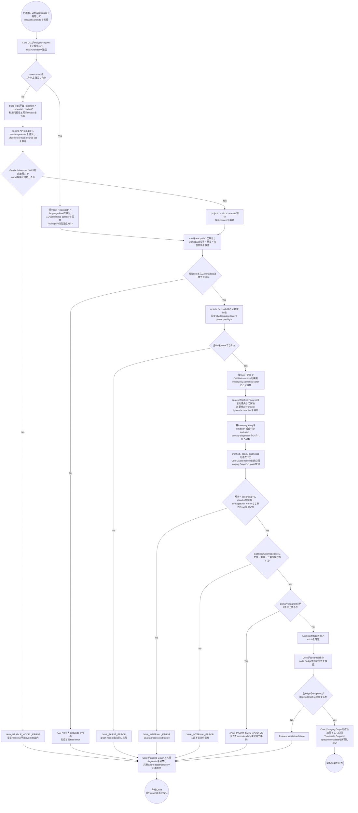
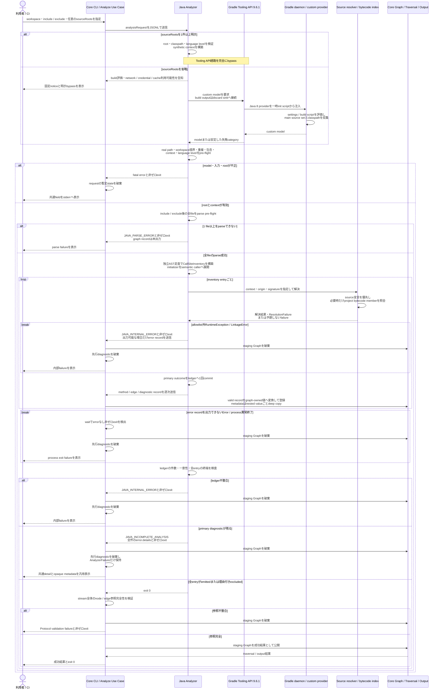

# Gradle マルチモジュールの複数 source root を解析する

> 本文書は Issue #24 の spec-lifecycle における作業記録である。
> durable な Protocol、Java Analyzer、テスト契約は sync phase で feature doc / context へハンドオフする。

## メタ情報

- Issue: `#24`
- ステータス: `In Progress`
- 作成日: 2026-07-15
- 更新日: 2026-07-18
- Branch: `feature/24`
- Owner: Fukuemon

## 設計フェーズ状況

状態は `未着手 / 進行中 / 完了 / レビュー済 / 保留` のいずれか。保留の場合は理由を備考に残す。

| #   | フェーズ                    | 状態       | 最終更新   | 備考                                                                       |
| --- | --------------------------- | ---------- | ---------- | -------------------------------------------------------------------------- |
| 1   | 起票                        | 完了       | 2026-07-15 | GitHub Issue #24 を確認済み                                                |
| 2   | 下書き                      | レビュー済 | 2026-07-15 | 本 index.md をテンプレートから新規作成。spec-review PASS                   |
| 3   | 上位文書突合                | レビュー済 | 2026-07-15 | Design Doc / feature doc / context / ADR と矛盾なし。spec-review PASS      |
| 4   | 論点整理                    | レビュー済 | 2026-07-15 | D1〜D9 を未決論点として抽出。spec-review PASS                              |
| 5   | 論点解決                    | レビュー済 | 2026-07-18 | D1〜D30を解決。fresh-context review PASS                                   |
| 6   | Interface / Routing 設計    | レビュー済 | 2026-07-18 | D13旧構築表現をstaging Graph方針へ統一。fresh-context review PASS          |
| 7   | Content / Data 設計         | レビュー済 | 2026-07-18 | Java固有metadataの正本先をJava Analyzer feature docへ確定。review PASS     |
| 8   | Performance / Security 設計 | レビュー済 | 2026-07-18 | 条件付きGradle runtimeとtoolchain 4軸分離をtrack済み。review PASS          |
| 9   | Test / Metrics 設計         | レビュー済 | 2026-07-18 | Protocol・Java・Core・実CLI E2Eとstaging Graph検証をtrack済み。review PASS |
| 10  | 実装分割                    | 未着手     |            |                                                                            |
| 11  | レビュー済                  | 未着手     |            |                                                                            |

## 上位文書整合

正本 ([Design Doc](../../design/DesignDoc.md) / [feature doc](../../design/features/) / [context](../../context/) / ADR) のどの節と、どう整合させるかを記録する。

- PRD 更新要否: 不要。本プロジェクトは統合モードであり、Why / What は Design Doc に統合されている。
- Design Doc 更新要否: 要。CoreとAnalyzerの責務境界および成功条件は維持し、Java Analyzerの主要依存へ自動discovery時だけ使用する条件付きGradle runtimeを追加する。詳細はJava Analyzer feature doc、infrastructure、ADR-0006へ委譲する。
- ADR 起票要否: 要。D3 / D23 / D25のGradle Tooling API採用、build script評価、output隔離のruntime / security boundaryを、sync phaseでADR-0006として起票する。D13 / D20 / D22 / D24のstreaming後fatal invalidationと共通failure detailをADR-0001へ、D22 / D24のfatal時の未解決理由をADR-0004へ、D18のproject bytecode member索引をADR-0005へ追記する。D24はADR-0003の言語非依存境界を維持するため、ADR-0003の更新・廃止は行わない。

| 上位文書                    | 節 / 該当箇所                                                                 | 整合方針 (継承 / 補足 / 変更提案)                                                                                                                      |
| --------------------------- | ----------------------------------------------------------------------------- | ------------------------------------------------------------------------------------------------------------------------------------------------------ |
| Design Doc                  | Why / What、成功条件 S1 / S2 / S4                                             | 継承。Java / Spring Boot の変更影響解析を実プロジェクト構成へ広げる                                                                                    |
| Design Doc                  | 成功条件 S5、設計原則 P1〜P4、モジュール責務                                  | 継承。Core に Gradle / Java 固有の探索規則を持たせない                                                                                                 |
| Design Doc                  | Java Analyzerのモジュール責務・主要依存                                       | 変更提案。自動discovery時のGradle Tooling API、daemon、custom model providerを条件付きruntime依存として追加し、明示root時は完全bypassする              |
| feature doc (protocol)      | `analysisRequest.workspaceRoot`、`include` / `exclude`、`SourceLocation.path` | 補足。既存の相対 path 基準を保ちながら複数 source root の入力契約を詰める                                                                              |
| feature doc (protocol)      | Versioning / compatibility                                                    | 継承。任意 field 追加を優先し、既存 request の意味を維持する                                                                                           |
| feature doc (protocol)      | `methodSymbol.sourceLocation` / `metadata`                                    | 変更提案。D21で定義位置の意味を維持し、bytecode-only memberのowner位置をopaque metadataとして保持する                                                  |
| feature doc (protocol)      | `error.details` / failure rendering                                           | 変更提案。D24で言語共通のfailure detail構造とCoreの汎用表示を追加する                                                                                  |
| feature doc (graph)         | `Node.Symbol` / Protocol recordからの変換・構築                               | 変更提案。D13で受信recordを非公開staging Graphへ1-pass登録して成功時だけ公開し、D29で`methodSymbol.metadata`をgraph-ownedなopaque JSON値として保持する |
| feature doc (java-analyzer) | TypeSolver、帰属型決定、pre-flight、性能方針                                  | 補足。複数rootの列挙・型解決・scope membership・source優先帰属を具体化する                                                                             |
| feature doc (java-analyzer) | Java unit / Go process contract / 実 jar E2E                                  | 継承。既存三層へマルチモジュールの検証を追加する                                                                                                       |
| context (architecture.md)   | Package Boundary / Runtime Boundary / State Boundary                          | 変更提案。Core → Analyzer はProtocolのみとし、Analyzer自身のread-only性とD23 / D25 / D26のGradle runtime・output隔離境界を分離する                     |
| context (project.md)        | Quick Commands / E2E command contract                                         | 変更提案。D27の自動discovery、明示override、実CLI E2Eの実行入口を追加する                                                                              |
| context (testing.md)        | Protocol contract test / Java Analyzer 三層                                   | 継承。Protocol、Java unit、実 jar E2E の責務を分ける                                                                                                   |
| context (engineering.md)    | Repository Quality Gate / 依存境界 gate                                       | 継承。Go / Java の既存 gate を維持する                                                                                                                 |
| ADR-0001                    | JSONL streaming、fatal failure、versioning                                    | 補足。逐次転送と成功結果の可視性を分離し、fatal時は非公開staging Graphを破棄して同requestの先行recordをすべて無効とする                                |
| ADR-0003                    | Core は Analyzer 固有の意味を解釈しない                                       | 継承。Core に Gradle 固有の module discovery を入れない                                                                                                |
| ADR-0004                    | 動的・未解決callの候補と理由を観測可能にする                                  | 変更提案。D22 / D24のfatal error detailsで全未解決callの候補と理由を保持する                                                                           |
| ADR-0005                    | JavaParser / SymbolSolver、SootUp、Spring DI、Core の責務境界                 | 変更提案。D18のcall site駆動project bytecode member索引をSootUp責務へ追加                                                                              |

前回reviewで検出したarchitecture / project commandの差分はD26 / D27としてsync候補へ分類済みである。最新reviewのinitializer / Graph / Gradle互換性差分はD28〜D30で解決済みである。
Protocol、Graph、Java Analyzer、context、ADRのdurableな追記内容はtrack phaseで反映先を分類済みであり、sync phaseで各上位文書へ反映する。

## 関連資料

- [Issue #24](https://github.com/Fukuemon/depwalk/issues/24): 本 spec の要求起点
- [Design Doc](../../design/DesignDoc.md): Why / What、成功条件 S1 / S2 / S4 / S5、設計原則 P1〜P4
- [Analyzer Protocol feature doc](../../design/features/analyzer-protocol/DesignDoc_analyzer-protocol.md): `analysisRequest`、相対 path、互換性契約
- [Graph feature doc](../../design/features/graph/DesignDoc_graph.md): Protocol recordからGraph node / edgeへの変換と保持属性
- [Java Analyzer feature doc](../../design/features/java-analyzer/DesignDoc_java-analyzer.md): source 解析、型解決、帰属型、性能、三層テスト
- [context/architecture.md](../../context/architecture.md): Core / Analyzer の package・runtime・state boundary
- [context/project.md](../../context/project.md): repository固有のQuick CommandsとE2E command contract
- [context/testing.md](../../context/testing.md): Protocol contract test と Java Analyzer 三層
- [ADR-0001](../../adr/0001-analyzer-protocol-jsonl-spi.md): JSONL process SPI と versioning
- [ADR-0003](../../adr/0003-analyzer-command-resolution.md): 言語非依存な Analyzer 起動・metadata passthrough
- [ADR-0004](../../adr/0004-defer-runtime-call-tracing.md): 動的・未解決callの候補と理由の観測可能性
- [ADR-0005](../../adr/0005-adopt-sootup-and-spring-di-resolution.md): JavaParser / SootUp / Spring DI の責務境界
- [spec #21](../21-java-dispatch-spring-di/index.md): 単一 source root 制約から本 Issue を切り出した決定経緯
- [Gradle Tooling API](https://docs.gradle.org/current/userguide/tooling_api.html): client / daemon / target Gradleの互換性契約
- [Gradle Java Compatibility](https://docs.gradle.org/current/userguide/compatibility.html): Gradle versionごとのdaemon JVM対応範囲

## 背景

現行の `analysisRequest` は単一の `workspaceRoot` を持つ。
Java Analyzer はその値を、対象ファイルの列挙、`JavaParserTypeSolver` の source root、`SourceLocation.path` の相対化基準として兼用している。

この構成では、`module-a/src/main/java` と `module-b/src/main/java` のように複数の package hierarchy 起点を持つ Gradle マルチモジュールを一度に型解決できない。
repository root を `workspaceRoot` にすると `JavaParserTypeSolver` が package hierarchy を認識できず、単一 module の source root を渡すと他 module が解析 scope から外れる。

Issue #21 で追加した Interface Dispatch と Spring DI 解決を標準的なマルチモジュール構成へ適用するため、repository 基準の path と Java の source root を区別し、複数 module を単一の解析要求で扱える契約が必要である。

## スコープ

### やること

- Analyzer Protocol で複数 source root を表す非破壊的な入力契約を設計する。
- Core CLI から複数 source root を言語非依存な値として受け取り、`analysisRequest` へ渡す契約を設計する。
- Java Analyzer が複数 source root の Java ファイルを列挙し、各 root を型解決へ登録できるようにする。
- 全 source root の対象ファイルを同一 scope membership として扱い、既存の帰属型決定規則を維持する。
- module 間の source / bytecode / dependency classpath を使った型解決境界とsource優先順位を決める。
- scope内source typeに属し、source ASTにはないがproject classes outputに存在するbytecode-only memberをgenerator非依存で解決する。
- 単一・複数source rootを同じv1契約で扱い、既存の内部request / fixtureを公開前の確定schemaへ移行する。
- Gradle マルチモジュールの Spring Boot fixture を追加し、module 間の型解決・帰属・DI 解決を検証する。

### やらないこと

- Interface Dispatch、Spring Bean 選択、帰属型決定の意味論自体は変更しない。Issue #21 と Java Analyzer feature doc の既存契約を継承する。
- Gradle Tooling APIのmodel取得は行うが、Gradle taskの自動実行、source生成、対象projectのbuildは行わない。
- Maven、BazelなどGradle以外のbuild system固有の自動検出は扱わない。
- KotlinなどJava以外の言語解析は扱わない。
- Runtime Trace、Reflection、実行時Proxyの完全追跡は扱わない。
- 対応する所有source typeをscope内に持たない生成type全体のsource帰属は扱わない。
- 成功時のCLI / graph出力形式とTraversal / Output Engineの仕様は変更しない。fatal時はD24のProtocol共通failure detailをCLI stderrへ汎用表示する。
- Analyzerとcustom model provider自身は解析対象repositoryへ書き込まない。自動discoveryが評価するbuild logicの任意副作用は保証対象外とし、信頼できないbuildでは明示overrideを使用する。

## 要件の解釈

### 実現したいユーザー価値

Gradle マルチモジュールで構成された Java / Spring Boot プロジェクトを保守する開発者が、module 境界をまたぐ caller / callee と Spring DI 経由の実装候補を、一度の解析要求で調査できる。

### 成功条件

- 複数 source root の各 package hierarchy を型解決へ登録し、module 間参照の caller / callee を graph に含められる。
- 全 source root の Java ファイルが同一解析 scope に含まれ、scope 内宣言を scope 外として誤帰属しない。
- `SourceLocation.path` と include / exclude の基準が request 全体で一意になり、異なる module の同名相対 path を区別できる。
- 単一source rootのbuildも、build model discoveryまたは1件の明示overrideで解析できる。
- マルチモジュール fixture で、型解決・帰属・Spring DI 解決の期待集合を自動テストできる。
- scope内sourceにあるcall siteを、edge生成・仕様上の明示除外・diagnosticのいずれかへ分類し、全救済後もprimary diagnosticが残る場合はrequest全体をfatalにして、不完全なgraphを成功結果として返さない。
- 解析scope内のsource fileを1件でもparseできない場合はrequest全体をfatalにし、欠落範囲が不明な部分graphを利用者へ返さない。
- scope内source typeのcallableなbytecode-only method / constructorをproject classes outputから解決し、generator名に依存せずgraphへ含められる。

### 対象ユーザー / 操作主体

- Gradle マルチモジュールの Java / Spring Boot プロジェクトを解析する開発者
- depwalk を CI から実行する開発者
- Analyzer Protocol、Core CLI、Java Analyzer を保守する開発者

EARS 風で振る舞いを記述する。

- WHEN 利用者が 1 つの workspace と複数の source root を指定したとき、システムは全 source root の対象 Java ファイルを 1 つの解析 scope として解析する。
- WHEN ある module の source が別 module の source type を参照するとき、Java Analyzer は対象 type を解決し、既存の帰属型決定規則に従う `methodSymbol` と `callEdge` を出力する。
- WHEN Spring の注入点と Bean 実装が異なる module にあるとき、Java Analyzer は Issue #21 で確定した Bean 選択規則に従って実装候補を出力する。
- IF `sourceRoots` が省略されたとき、Java Analyzer はGradle Tooling APIで`workspaceRoot`のbuild modelを取得し、Java source rootの検出結果を解析入力として使用する。
- IF 1件以上の `sourceRoots` が指定されたとき、Java Analyzer はbuild model discoveryを行わず、明示されたrootだけを解析入力として使用する。
- IF `sourceRoots` が空配列のとき、Java Analyzerは解析開始前にinvalid requestとして拒否する。
- IF build model discoveryがsource rootを確定できないとき、Java Analyzerはdirectory走査で推測せず、明示指定を案内するfatal errorを返す。
- IF 明示された`sourceRoots`が絶対path、空文字、または`..` segmentを含むとき、システムは解析開始前にinvalid requestとして拒否する。
- WHEN workspace自体をsource rootとして指定するとき、利用者は`sourceRoots`の要素に`.`を指定できる。
- WHEN 複数のsource rootが正規化後に同一となるとき、Java Analyzerは先頭のrootだけを採用する。
- IF 異なるsource rootの間に親子の包含関係があるとき、Java Analyzerは解析開始前にinvalid source root configurationとして拒否する。
- THE SYSTEM SHALL 同一の正規化済み絶対pathを持つsource fileを1回だけ解析する。
- WHEN Gradle build modelからsource rootを自動検出したとき、Java Analyzerは各source fileを所属project / source setのcompile classpathとproject依存関係を持つ解析contextで型解決する。
- WHEN `sourceRoots`を省略して自動検出するとき、Java Analyzerは各in-scope Gradle projectの`main` source setに属するJava source directoryだけを解析対象にする。
- THE SYSTEM SHALL `test`と`main`以外の名前付きsource setを自動検出の解析対象に含めず、利用者がそれらを解析するときは`sourceRoots`と`metadata.classpath`を明示できる。
- WHEN Java Analyzerが自動discoveryするとき、Analyzer同梱のcustom tooling model providerを一時init scriptからGradle daemonへ注入し、各projectの`main` source directory、compile classpath、classes output、project依存関係を取得する。
- THE SYSTEM SHALL Java AnalyzerへGradle Tooling API `9.6.1`を同梱し、target Gradle `7.6.5`以上`9.6.x`以下を自動discoveryのv1対応範囲とする。
- THE SYSTEM SHALL custom tooling model providerをGradle `7.6.5` APIを下限としてJava 8 classfileへcompileし、Analyzer本体のJDK 25 classfileをGradle daemonへ注入しない。
- IF target Gradleが対応範囲外、またはtarget Gradleと選択済みdaemon JVMの組がGradle公式互換範囲外のとき、Java Analyzerはmodelを不完全取得せず`JAVA_GRADLE_MODEL_ERROR`の安定reasonでfatalにし、明示overrideを案内する。
- THE SYSTEM SHALL custom tooling model provider自身からGradle task、source生成、対象workspaceへの書き込みを要求しない。ただしbuild logicのconfiguration副作用と、`main.compileClasspath`の解決に伴うdependency download・Gradle user cache更新は実行環境のGradle runtimeとして発生し得る。
- WHEN 自動discoveryを開始するとき、システムは対象buildのsettings / build script / pluginを実行user権限で評価し、利用者が設定したartifact repository、Gradleの既存credential resolution、network、Gradle user cacheを利用し得ることをCLI helpとstderrで明示する。
- THE SYSTEM SHALL repository credentialをdepwalk固有のCLI / Protocol fieldで受け取らず、保存・metadata化しない。Tooling API operationのstandard output / errorを明示的なdiscard sinkへ接続し、Gradle build outputをAnalyzer Protocol、Analyzer stderr、Core stdout / stderrへ転送しない。
- IF Gradle model取得が失敗したとき、Java Analyzerはraw Gradle exception message、stack trace、repository URL、request headerを出力せず、Analyzerが定義した安定error category、失敗phase、明示overrideを含む復旧案だけを`JAVA_GRADLE_MODEL_ERROR`へ格納する。
- IF build評価、network、repository認証、dependency resolutionを許可できない環境であるとき、利用者は`sourceRoots`と事前解決済みclasspathを明示してTooling API経路を完全にbypassできる。
- WHEN 自動discoveryでprojectごとのJava source language levelを決めるとき、Java Analyzerは`compileJava.options.release`を優先し、未指定なら実効`sourceCompatibility`を使用してcontextごとのJavaParserへ設定する。
- WHEN `sourceRoots`を明示overrideするとき、利用者は`metadata.javaLanguageLevel`を1要素の文字列配列として指定し、Java Analyzerは全明示rootのsynthetic contextへ適用する。
- IF modelまたは明示metadataのJava source language levelがJavaParserの対応範囲外、欠落、曖昧、またはinvalidなとき、Java Analyzerはgraph record出力前にfatal errorとして拒否する。
- WHEN allowlist化されたsymbol / type resolution failureが個別の宣言またはcall siteで発生したとき、Java Analyzerは`JAVA_UNRESOLVED_SYMBOL` diagnosticを出し、他の要素の解析とD18までの救済を継続する。
- IF 全resolverとproject bytecode member救済の完了後も、scope内sourceのcall siteがedge生成または`external-target` / `lift-excluded-package`の根拠付き除外へ確定せずprimary diagnosticに残るとき、Java Analyzerは`JAVA_INCOMPLETE_ANALYSIS`と非ゼロexitでrequest全体をfatalにする。
- WHEN `JAVA_INCOMPLETE_ANALYSIS`を出力するとき、Java Analyzerは全primary diagnostic callを決定順のProtocol共通`error.details`へ格納し、各detailの共通fieldへ位置・元diagnostic code・messageを、opaque metadataへcall kind・reason・判明済みtarget・候補を、成功graphへ依存しない自己完結形式で返す。
- THE SYSTEM SHALL Coreで先行method / edge / diagnosticを成功結果から破棄しつつ、`error.details`を言語共通の構造化fatal detailとして保持する。Core CLIはAnalyzer固有code / metadata keyで分岐せず、各detailの共通fieldとmetadataのcanonical JSONを配列順でstderrへ汎用表示する。
- THE SYSTEM SHALL exit code 0の成功結果について、全`CallSiteInventory` entryのprimary終端を`emitted`または仕様上の根拠付き`excluded`に限定する。v1では不完全なcall graphを許可するpartial / strict modeを提供しない。
- IF allowlist外のruntime exception、内部不変条件違反、または`LinkageError`が発生したとき、Java Analyzerは`JAVA_INTERNAL_ERROR`と非ゼロexitでrequest全体をfatal failureにする。
- IF Analyzerがvalidな`error` recordを出す、または非ゼロexitで終了するとき、Coreは同requestで先に受信した全recordを破棄し、部分graphを成功結果として返さない。
- WHEN sourceとして列挙済みのtypeと同じbinary nameがproject classes outputにも存在するとき、Java Analyzerはsource宣言を帰属の正とし、bytecodeを既存契約で許可された生成member・型階層・dispatchの補完にだけ使用する。
- WHEN 自動discoveryのsolverがproject classes output由来のbytecode宣言を返したとき、Java Analyzerはそのoutputの所有contextが呼出元context自身またはGradle project依存で到達可能であり、同じ所有contextにbinary nameと正規化signatureが一致するsource宣言がある場合だけsourceへ再対応付けする。
- THE SYSTEM SHALL external artifact、JDK、呼出元から依存到達不能なcontextのbytecode宣言を、binary nameとsignatureだけでworkspace内sourceへ再対応付けしない。
- WHEN 明示overrideのsynthetic contextでbytecode宣言をsourceへ再対応付けするとき、Java Analyzerは同じsynthetic context内に一意な一致source宣言がある場合だけ再対応付けする。
- THE SYSTEM SHALL scope内source fileの各call siteをedge生成・仕様上の明示除外・diagnosticのいずれか1つのprimary終端種別へ分類し、未分類または二重分類のcall siteを検出したrequestを`JAVA_INTERNAL_ERROR`のfatal failureにする。
- WHEN 全対象fileのparseが成功したとき、Java Analyzerはsolver処理前に既存の解析対象call kindを独立走査し、workspace相対path、source range、call kind、semantic caller method IDから決定的な`CallSiteId`を持つ`CallSiteInventory`を構築する。
- WHEN instance initializerまたはinstance field initializer内の1つのAST call siteを複数constructorへ畳み込むとき、Java Analyzerはlexical call siteとsemantic caller constructorの組ごとにinventory entryを1件生成し、各entryへ異なる`CallSiteId`とprimary outcomeをちょうど1件対応付ける。
- WHEN static initializer blockまたはstatic field initializer内のcall siteをinventoryへ登録するとき、Java Analyzerはsemantic callerをそのtypeの`<clinit>()`に固定し、lexical call siteごとにentryを1件生成する。
- THE SYSTEM SHALL `CallSiteInventory`の各IDへ内部`CallSiteOutcomeLedger`でprimary終端種別をちょうど1件対応付け、IDの欠落・重複・未分類・二重分類を成功結果として返さない。
- THE SYSTEM SHALL call site別ledgerをAnalyzer Protocolへ追加せず、productionのstderrには総数と終端種別・理由別の集計だけを出力する。
- WHEN scope内source typeへのcall siteがsource ASTのmemberへ解決できず、D16で許可された同一contextのproject classes outputに一致するcallable memberがあるとき、Java Analyzerはそのmemberをbytecode-only `methodSymbol`として出力し、call siteからの`callEdge`を生成する。
- THE SYSTEM SHALL bytecode-only memberの救済可否を特定generatorのannotation名で判定せず、所有source type、`ResolvedDeclarationOrigin`、依存到達可能context、正規化signatureで判定する。
- THE SYSTEM SHALL source ASTに定義位置を持たないbytecode-only `methodSymbol`の`sourceLocation`を省略し、所有source typeの位置を`metadata.ownerSourceLocation`へ格納する。所有typeの位置をmemberの定義位置として出力しない。
- WHEN bytecode-only fieldがreceiver解決に必要なとき、Java Analyzerはproject classes outputからfield typeを補完し、その先のcalleeがscope外ならcall siteを理由付き`external-target`として分類する。
- THE SYSTEM SHALL sourceから直接参照されないbridge method、compiler accessor、lambda bodyなどのJVM内部memberを、classes outputに存在することだけを理由にgraphへ追加しない。
- IF include / exclude適用後のsource fileを1件でも設定済みlanguage levelでparseできないとき、Java Analyzerはgraph record出力前に`JAVA_PARSE_ERROR`のfatal errorと非ゼロexitでrequest全体を失敗させる。
- WHEN `sourceRoots`を明示overrideしたとき、Java Analyzerは全明示rootと`metadata.classpath`を共有する1つの解析contextとして扱う。
- IF 異なる解析contextが同じsource binary nameを宣言するとき、Java Analyzerはgraph recordを出力する前に曖昧な入力として拒否する。
- IF 明示source rootが欠落、非directory、読取不能、またはsymlink解決後にworkspace外となるとき、Java Analyzerは解析開始前にfatal errorとして拒否する。
- WHEN build model上のsource directoryがまだ存在しないとき、Java Analyzerは空のsource directoryとして除外し、他の有効rootを解析する。
- IF discoveryされた既存source rootが読取不能、またはin-scope projectからworkspace外を参照するとき、Java Analyzerは不完全解析へ降格せずfatal errorとして拒否する。
- WHEN model由来のproject classes outputだけが存在しないとき、Java Analyzerは`JAVA_SOOTUP_UNAVAILABLE`を出力し、source解析を継続する。
- THE SYSTEM SHALL single-rootの明示・自動discoveryとmulti-moduleの自動discoveryについて、初回値とwarm run 3回の中央値を計測し、解析時間と最大RSSの増分を記録する。
- WHEN 3 module fixtureをworkspace rootから自動discoveryまたは3 rootの明示overrideで解析したとき、システムは同じ期待method / edge集合とworkspace相対locationを出力する。
- WHEN multi-moduleの自動discoveryをrequired E2Eで検証するとき、テストは実Core CLI binaryからtest-only透過recording proxyを介して実Java Analyzer jarを起動し、`analysisRequest`に`sourceRoots`と明示用metadataが存在しないこと、期待graphとCLIの終了状態を同じrunで照合する。
- WHEN multi-moduleの明示overrideをrequired E2Eで検証するとき、テストはrepeatableな`--source-root`と明示用metadataを実Core CLI binaryへ渡し、captured `analysisRequest`のroot順序、Tooling APIの非起動、期待graphとCLIの終了状態を同じrunで照合する。
- THE SYSTEM SHALL test-only透過recording proxyでAnalyzerへのstdinとAnalyzerからのstdout / stderr / exit statusを変換せず中継し、検証用の複製だけを一時領域へ記録する。productionのCLI option、Analyzer Protocol、graph出力schemaはこのE2E観測のために変更しない。
- THE SYSTEM SHALL `SourceLocation.path` を workspace 全体で一意に解釈できる相対 path として出力する。
- THE SYSTEM SHALL Core に Gradle、JavaParser、JVM 固有の module discovery または型解決ロジックを追加しない。

## 設計時の論点

設計・実装フェーズへ持ち越す残課題を 1 件ずつ管理する。
確定したものは「解決済みの論点」へ移す。

| #   | 論点                                                                                               | 決定候補                                                                                                                   | 決定     |
| --- | -------------------------------------------------------------------------------------------------- | -------------------------------------------------------------------------------------------------------------------------- | -------- |
| D1  | Protocol で複数 source root をどう表現し、既存 `workspaceRoot` request と互換にするか              | D: optional `sourceRoots` を明示overrideとして追加し、省略時はAnalyzer側のbuild model discoveryへ委譲する。空配列はinvalid | 解決済み |
| D2  | `sourceRoots` の path 基準と validation をどう定義するか                                           | A: `workspaceRoot`相対のみ。`/`区切り、`.`を許可し、絶対path・空文字・`..` segmentを拒否                                   | 解決済み |
| D3  | source root discoveryの実現方式とCLIの明示override / opt-inをどう設計するか                        | A: Java AnalyzerがGradle Tooling APIで自動取得し、repeatableな共通`--source-root`指定時はdiscoveryを完全bypass             | 解決済み |
| D4  | `workspaceRoot`、source 列挙、include / exclude、`SourceLocation.path` の責務をどう分けるか        | A: `workspaceRoot`を唯一の座標系とし、`sourceRoots`はsource列挙とTypeSolver登録の起点だけを担う                            | 解決済み |
| D5  | root の重複・包含関係・同一ファイルの重複列挙をどう扱うか                                          | A: 完全重複rootは先頭を残して除去し、異なるrootの包含関係はerror、fileは絶対pathで重複排除                                 | 解決済み |
| D6  | module ごとの classes output / dependency classpath をどう渡して型解決するか                       | B: discovery時はGradle project / source set別の解析context、明示root時はglobal `metadata.classpath`を持つ単一context       | 解決済み |
| D7  | source root の欠落・読取不能・workspace 外指定を fatal と部分解析のどちらで扱うか                  | C: 明示rootと既存rootの異常はfatal、未作成discovery rootは除外、model由来classes output欠落はsource-only継続               | 解決済み |
| D8  | 複数 root 追加による解析時間・最大 RSS をどう評価するか                                            | A: single明示 / single discovery / multi discoveryの初回・warm中央値を記録し、数値SLOは#22で確定                           | 解決済み |
| D9  | E2E fixture の module 構成と合格条件をどこまで含めるか                                             | A: app → service → repositoryの3 module、変更projectDir・custom source dir、module間call / DIを固定期待集合で検証          | 解決済み |
| D10 | 自動discoveryでどのJava source setを解析対象にするか                                               | A: 各projectの`main`だけを自動解析し、`test`と名前付きsource setは明示rootで解析する                                       | 解決済み |
| D11 | project / source set別のroot・classpath・outputをTooling APIからどう取得するか                     | B: 一時init scriptでdepwalk専用custom tooling model providerを注入し、`main`のGradle modelを直接取得する                   | 解決済み |
| D12 | projectごとのJava source language levelをどう取得し、parserへ適用するか                            | A: discovery時は`release`優先の実効Gradle設定をcontext別に使い、明示root時は`metadata.javaLanguageLevel`を必須とする       | 解決済み |
| D13 | 想定内の型解決失敗と予期しないfatal errorの境界をどう定義するか                                    | A: allowlist化したresolution failureだけをdiagnostic化し、未知例外はfatal、先行streaming recordは全破棄する                | 解決済み |
| D14 | sourceと同じtypeのclasses outputが併存するときの帰属優先順位とsilent omissionをどう防ぐか          | A: scope内sourceを帰属の正とし、全call siteをedge・明示除外・diagnosticへ分類して未分類をfatalにする                       | 解決済み |
| D15 | parse不能fileとcall-site完全性の母集合をどう分けるか                                               | B: 解析scope内のparse errorをstreaming前fatalとし、v1ではparse不能fileを含む部分graphを返さない                            | 解決済み |
| D16 | bytecode宣言からsourceへ再対応付けできるcontext境界をどう限定するか                                | A: 自動時はorigin付きproject classes outputかつ依存到達可能な同一context、明示時は同一synthetic contextの一意sourceに限定  | 解決済み |
| D17 | solver処理前のcall-site inventoryと個別outcomeをどう観測・検証するか                               | A: 独立走査の安定ID付きinventoryと内部ledgerを作り、unit/integrationは個別、実jar E2Eはstderr集計を検証                    | 解決済み |
| D18 | scope内source typeのbytecode-only memberをgenerator非依存でどうgraphへ含めるか                     | A: 到達可能なproject classes outputからcall site駆動で解決し、bytecode-only methodSymbolとedgeを出力する                   | 解決済み |
| D19 | multi-module E2Eを実Core CLI binary経由のrequired gateにするか                                     | A: test-only透過proxy経由で実Core CLIと実Analyzer jarを起動し、自動・明示経路のrequestとgraphを照合する                    | 解決済み |
| D20 | 全救済後もscope内callがunresolvedのときrequestを成功扱いできるか                                   | A: primary diagnosticが残るcallを`JAVA_INCOMPLETE_ANALYSIS`でrequest全体fatalにし、v1ではpartial / strict modeを設けない   | 解決済み |
| D21 | bytecode-only memberの所有type位置を既存`sourceLocation`意味論と両立してどう表すか                 | A: memberの`sourceLocation`は省略し、`metadata.ownerSourceLocation`へ所有typeの位置を分離する                              | 解決済み |
| D22 | D20のfatal時に先行diagnosticを無効化しつつ未解決理由をどう観測可能に保つか                         | A: 全未解決callの位置・reason・候補をD24の`JAVA_INCOMPLETE_ANALYSIS.error.details`へ決定順で集約する                       | 解決済み |
| D23 | Tooling APIのnetwork・repository認証・Gradle cache副作用を既存infrastructure契約へどう反映するか   | A: infrastructure正本へbuild評価・利用者repository / 認証・network / cache副作用と明示bypassを追記する                     | 解決済み |
| D24 | Java固有のfatal detailをCoreの言語非依存境界を維持してCLIへどう表示するか                          | A: Protocol共通のfailure detailをCoreが汎用表示し、Java固有code / metadataを解釈しない                                     | 解決済み |
| D25 | 任意build logicが出力し得るcredentialに対してdepwalkが保証する非漏洩境界をどこに置くか             | A: Gradle build outputを利用者へ転送せず、例外をsanitizeし、保証をdepwalk生成・転送outputへ限定する                        | 解決済み |
| D26 | D23のGradle runtime境界を`context/architecture.md`のsync対象へ含めるか                             | A: Runtime / State Boundaryの変更候補へbuild評価、network / cache、副作用、明示bypassを追加する                            | 解決済み |
| D27 | 自動discovery・明示metadata・実CLI E2Eを`context/project.md`のcommand契約へ反映するか              | A: Quick CommandsとE2E contractの変更候補へ追加する                                                                        | 解決済み |
| D28 | initializer内の1つのAST callを複数constructor callerへ畳み込むときinventory / ledgerをどう数えるか | A: lexical call siteとsemantic callerの組ごとにentryを展開し、callerを含むIDごとに1 outcomeを持つ                          | 解決済み |
| D29 | bytecode-only memberのowner metadataをCore graphへ保持する変更をどの正本へ反映するか               | A: Graph feature docをsync対象へ追加し、`graph.Symbol`のopaque metadata passthroughを正式契約にする                        | 解決済み |
| D30 | custom model providerとGradle / daemon JVMの互換性matrixをいつ・どの値で確定するか                 | A: clarifyでbundled Tooling API、対応wrapper範囲、provider classfile target、daemon JVM matrixを確定する                   | 解決済み |

## 解決済みの論点

- **D1: `sourceRoots`をoptionalな明示overrideとしてv1 `analysisRequest`へ追加する。**
  - `workspaceRoot`はbuild全体と`include` / `exclude` / `SourceLocation.path`の共通基準として必須のまま維持する。
  - `sourceRoots`が省略された場合、Analyzerは対象言語・build systemに対応するbuild modelから1件以上のsource rootを解決する。Java AnalyzerはD3で確定したGradle Tooling APIの自動discoveryを使用する。
  - `sourceRoots`が1件以上指定された場合、指定値を正としbuild model discoveryを行わない。単一rootと複数rootは同じ配列schemaで表現する。
  - 空配列は「自動検出」または「解析対象なし」と解釈せず、invalid requestとして解析開始前に拒否する。
  - build model discoveryに失敗した場合、directory走査や`src/main/java`の推測へfallbackせず、明示的な`sourceRoots`指定を案内するfatal errorを返す。
  - 決定理由: 標準的なGradle multi-project buildはroot settingsからproject階層を解決できる一方、source set、`projectDir`、composite build等によりfilesystem規約だけではsource rootを確定できない。通常利用はworkspace rootだけで開始でき、非標準構成・Gradle modelを取得できない環境では明示overrideに切り替えられる境界とする。
  - トレードオフ: requestの意味がAnalyzerのbuild model discovery能力に依存する。Coreはdiscoveryを解釈せず、Analyzerが検出結果と失敗理由を観測可能にする必要がある。
  - 移行方針: 公開済みv1 consumerは存在しないため、現行実装でsource rootとして渡している`workspaceRoot`と内部fixtureを、build root + optional `sourceRoots`の確定schemaへ一括移行する。旧実装挙動の互換分岐は残さない。
  - ADR判断: ADR-0001のoptional field互換性、ADR-0003のCore言語非依存、ADR-0005のJava Analyzer責務と整合するため、D1単独では新規ADR・既存ADR廃止は不要。D3のGradle Tooling API採用判断は新規ADRへ記録する。
  - 決定日: 2026-07-16
  - 決定者: Fukuemon

- **D2: `sourceRoots`は`workspaceRoot`からの相対pathだけを許可する。**
  - Protocol上のpath separatorは`/`へ正規化する。絶対path、空文字、`..` segmentを含む値はinvalid requestとして解析開始前に拒否する。
  - `.`はworkspace directory自体がpackage hierarchyの起点となる単一root構成を表す正当な値として許可する。
  - build model discoveryが返すsource directoryはAnalyzer内部で絶対・正規化pathとして解決した後、`workspaceRoot`配下であることを検証し、同じworkspace相対表現へ正規化する。
  - workspace外のproject directoryやcomposite included buildはv1の解析scopeへ含めない。D7の規則に従いexternal included buildはwarning付きで除外し、in-scope projectのworkspace外source参照はfatalとする。
  - rootとfileの重複・包含関係は、D7でsymlinkの実体pathとworkspace境界を検証した後にD5の規則を適用する。
  - 決定理由: requestとfixtureをlocal / CI間で再利用でき、既存の`include` / `exclude`および`SourceLocation.path`と同じ`workspaceRoot`基準に揃えられる。絶対pathと相対pathの混在による重複・境界判定を避ける。
  - トレードオフ: workspace外に配置されたGradle projectやcomposite buildは単一requestで解析できない。必要性が具体化した時点で、複数workspaceまたはbuild treeを表す後続Protocolを設計する。
  - ADR判断: 既存のAnalyzer Protocol path規則の補足であり、新規ADR・既存ADR更新・廃止は不要。
  - 決定日: 2026-07-16
  - 決定者: Fukuemon

- **D3: `sourceRoots`省略時、Java AnalyzerがGradle Tooling APIでbuild modelを自動取得する。**
  - Java AnalyzerはGradle wrapperを認識するTooling APIからproject階層とD10で対象とする`main` source setを取得し、D2のworkspace相対`sourceRoots`へ正規化する。classpathとclasses outputはD6のproject / source set別解析contextへ対応付ける。
  - Core CLIは言語非依存なrepeatable flag `--source-root <path>`を提供し、指定順を`analysisRequest.sourceRoots`へ渡す。CoreはGradle、SourceSet、Tooling APIの意味を解釈しない。
  - `--source-root`が1件以上指定された場合、Java AnalyzerはGradle Tooling APIを起動せず、明示rootだけを使用する。明示rootはGradle discoveryを避ける安全・再現性のための完全overrideとする。
  - Gradle model取得ではbuild task、compile、source生成を自動実行しない。ただしsettings / build scriptとpluginのconfigurationは評価され、Gradle wrapper取得、plugin / dependency解決、`.gradle` cache等のnetwork・filesystem副作用が起こり得ることを利用者へ明記する。
  - discovery開始・終了、使用したGradle version、検出project数・source root数、D25でallowlist化した失敗categoryをstderrへ出力し、Tooling API実行を観測可能にする。Gradle由来の自由文は出力しない。D8の計測ではmodel discovery時間とcontext構築時間も分離する。
  - Tooling APIが利用できない、build model評価が失敗する、またはJava source rootを1件も検出できない場合は、filesystem走査へfallbackせず、`--source-root`による明示overrideを案内するfatal errorを返す。
  - 決定理由: root projectだけを入力する通常経路で、`settings.gradle(.kts)`のproject階層、変更された`projectDir`、`main` source setのcustom source directoryをGradle自身のmodelに従って解決できる。明示overrideによりGradleを評価できない環境と信頼できないCIにも対応する。
  - トレードオフ: rootだけの解析はbuild scriptを評価するため、静的なsource読取だけより起動コストと安全上の注意が増える。Tooling API・Gradle wrapperのversion compatibilityとmodel取得失敗を保守対象に追加する。
  - ADR判断: Gradle Tooling APIという依存選定とbuild script評価のruntime / security boundaryはfeature docの詳細を超える横断判断である。sync phaseで新規ADRを作成する。ADR-0001 / ADR-0003 / ADR-0005は廃止せず、本決定との関係を新規ADRから参照する。
  - 決定日: 2026-07-16
  - 決定者: Fukuemon

- **D4: `workspaceRoot`をrequest全体の唯一のpath座標系とし、`sourceRoots`は列挙・型解決の起点だけを担う。**
  - `workspaceRoot`はGradle build root、`sourceRoots`の相対基準、`include` / `exclude` globの評価基準、全`SourceLocation.path`の相対基準を兼ねる。
  - `sourceRoots`はJava source file列挙と各`JavaParserTypeSolver`登録の起点に限定する。rootごとのpath namespaceやroot IDはProtocolへ追加しない。
  - 各rootから列挙したfileは絶対・正規化pathへ変換し、`workspaceRoot`からの相対pathに統一してから`include` / `exclude`を評価する。globは`app/src/**/*.java`のようにmodule directoryを含むworkspace相対pathへ一致させる。
  - `methodSymbol.sourceLocation`、`callEdge.callSite`、`diagnostic.sourceLocation`は、fieldが存在する場合にすべてworkspace相対pathを出力する。同じpackage / file名が複数moduleにあってもmodule directoryを含むpathで区別する。
  - scope membershipはinclude / exclude適用後の全rootの正規化済み絶対file集合を和集合として構築する。`AttributionResolver`の帰属意味論は変更せず、D14のsource宣言索引と終端分類でscope内sourceをscope外へ誤帰属しないことを保証する。
  - 同一fileが複数rootから列挙される場合はD5の規則で1件へ重複排除し、異なるrootの包含関係は解析前に拒否する。
  - 決定理由: D2のworkspace相対契約と既存Protocolの`include` / `exclude`、`SourceLocation.path`を同じ基準へ揃え、module間で同名pathが存在してもrecordを一意に解釈できる。root別基準に必要なroot ID追加を避けられる。
  - トレードオフ: module内だけを基準にした短いglobは使えず、利用者はworkspaceからmodule directoryを含むglobを指定する。
  - ADR判断: 既存Analyzer Protocolのpath意味論を複数rootへ適用する補足であり、新規ADR・既存ADR更新・廃止は不要。
  - 決定日: 2026-07-16
  - 決定者: Fukuemon

- **D5: 完全重複rootは除去し、異なるrootの包含関係は拒否し、同一fileは1回だけ解析する。**
  - D2の規則でworkspace相対rootを絶対・正規化pathへ解決した後、同じpathとなるrootは先頭の1件だけを残す。残ったrootの順序は明示指定またはbuild model discoveryの順序を維持する。
  - 正規化後も異なるrootの一方が他方の祖先directoryとなる場合、Java AnalyzerはTypeSolver構築やsource列挙より前のpre-flightでfatal errorとして拒否する。`.`と`module/src/main/java`の同時指定も包含関係として扱う。
  - 各rootは`JavaParserTypeSolver`へ1回だけ登録する。包含rootを自動的に短縮・統合して、どちらかのpackage hierarchyの意味を暗黙に変更しない。
  - include / exclude適用後のsource fileは正規化済み絶対pathをkeyとする集合へ統合し、parse、symbol出力、call edge抽出を1回だけ行う。
  - D7のpre-flightでworkspaceと既存rootの実体pathを解決した後、その実体pathをroot / fileの同一性と包含判定に使用する。directory列挙ではsymlinkを再帰追跡しない。
  - 決定理由: 完全重複は解析意味を変えずに吸収できる。一方、親子rootは同じfileを異なるpackage hierarchy起点として解釈し得るため、fileだけを重複排除してもTypeSolverの曖昧さが残る。意味を推測せず設定修正を求める。
  - トレードオフ: 意図的に親子source directoryを構成するbuildは自動解析できず、重ならないsource rootへ構成を直す必要がある。完全重複を自動除去するため、入力ミスとしてはfatalにならない。
  - ADR判断: Java Analyzerの入力正規化とpre-flightの詳細であり、新規ADR・既存ADR更新・廃止は不要。
  - 決定日: 2026-07-16
  - 決定者: Fukuemon

- **D6: 自動discoveryではGradle project / source setごとの解析contextで型解決する。**
  - Tooling APIから得るproject pathとsource set名をAnalyzer内部のcontext識別子とし、source root、compile classpath、classes output、project依存関係を`SourceSetAnalysisContext`へ対応付ける。この識別子はProtocol recordへ出力せず、root IDも追加しない。
  - 各source fileは所有元contextの`CombinedTypeSolver`で解析する。solverには自身のsource rootと、Gradleのcompile classpath関係から到達できる解析対象project / source setのsource root、当該contextの外部jar / classes directory、JDK標準型だけを登録する。
  - solverの各登録entryと解決結果へ内部`ResolvedDeclarationOrigin`を付与し、`source(contextId)`、`projectClasses(contextId)`、`externalArtifact(identity)`、`jdk`を区別する。owning contextと到達可能projectのsource solverをproject classes outputより優先する。
  - bytecode宣言からsourceへの再対応付けはD16のorigin / context境界に従う。自動discoveryでは`projectClasses(targetContext)`の宣言だけを候補とし、呼出元から到達可能な同じ`targetContext`のsource declaration indexへ照合する。external artifact、JDK、依存到達不能contextをworkspace全体の名前一致で再対応付けしない。
  - 解析対象projectのclasses outputと外部依存はcontextごとのlazyなSootUp indexへ登録する。moduleごとに異なる依存versionや非依存moduleの型をglobal classpathへ混在させない。
  - 同じ正規化rootが複数の異なるproject / source setへ所属する場合は所有contextを推測せず、model ambiguityとしてfatal errorにする。同一context内の完全重複rootはD5どおり除去する。
  - 全contextのsource fileはD4のworkspace scopeへ統合し、method symbolとcall edgeは既存graphへ集約する。ただし異なるcontextが同じsource binary nameを宣言すると、現行Protocolの`methodId`ではmodule別に区別できないため、record出力前にfatal errorとする。
  - `sourceRoots`を明示した場合はD3どおりTooling APIを完全bypassし、全明示rootを1つのsynthetic contextとして扱う。この経路では`metadata.classpath` keyを従来どおり必須とし、空配列を許可する。
  - `sourceRoots`を省略した自動discovery経路では、context classpathをGradle modelから取得するため`metadata.classpath`を任意とする。指定されたentryは利用者による共通追加classpathとして全contextへ追加し、明示entryのpre-flight規則を維持する。
  - model由来のclasses output欠落時はD7どおりsource解析を継続し、SootUp補完だけをwarning付きで無効化する。Java Analyzerはclasses生成やGradle taskを自動実行しない。
  - 決定理由: 全moduleのclasspathを単純結合すると、本来依存していない型やmoduleごとに異なる依存versionを誤って解決し得る。Gradleのproject / source set境界に従いながら、最終graphだけをworkspace単位へ統合する。
  - トレードオフ: contextごとにTypeSolverとSootUp indexを構築するため、global solverより実装量とmemory使用量が増える。明示override経路ではGradle依存関係を利用できず、利用者が与えたglobal classpathの正確性に依存する。
  - ADR判断: D3と同じGradle Tooling API採用判断の一部として、project / source set別contextと明示override時のsynthetic contextをADR-0006へ記録する。追加ADRおよび既存ADRの更新・廃止は不要。
  - 決定日: 2026-07-16
  - 決定者: Fukuemon

- **D7: 明示入力と既存rootの異常はfatal、未作成discovery rootとmodel由来classes output欠落は条件付きで継続する。**
  - pre-flightは`workspaceRoot`のreal pathを境界とし、既存source rootと列挙されたsource fileを`toRealPath`相当で検証する。directory walkではdirectory symlinkを再帰追跡せず、rootまたはfileのsymlink実体がworkspace外ならfatalにする。
  - 明示`sourceRoots`の各要素は存在する読取可能なdirectoryでなければならない。欠落、broken symlink、非directory、読取不能、workspace外実体pathは`JAVA_INVALID_SOURCE_ROOT`または`JAVA_SOURCE_ROOT_OUTSIDE_WORKSPACE`のfatal errorとする。
  - build modelが返すsource directoryが存在しない場合は、未作成の空source directoryとして解析対象から除外し、件数とpathをstderrのdiscovery summaryへ出力する。Protocol diagnosticにはせず、既存の有効rootへ影響させない。
  - discoveryされたsource rootが存在するにもかかわらず非directory・読取不能の場合、またはin-scope projectのsource setがworkspace外pathを参照する場合は、同じfatal error境界を適用する。不完全なmoduleだけを飛ばして成功扱いにしない。
  - Tooling APIがworkspace外のexternal composite / included buildを識別した場合、そのbuildのsource rootはscopeへ含めず、`JAVA_EXTERNAL_BUILD_EXCLUDED` warningを1 buildにつき1件出力する。Gradle modelが解決済みartifactをclasspathとして返す場合は外部依存として利用できる。
  - symlink実体pathの完全重複と包含関係にはD5を適用する。同一実体root / fileは1件へ除去し、異なる実体rootの包含関係はfatalにする。record pathはD4どおり利用者が指定したworkspaceからの相対pathを維持する。
  - model由来の解析対象project classes outputが未作成の場合は、該当contextに`JAVA_SOOTUP_UNAVAILABLE` warningを1件出し、JavaParserによるsource解析を継続する。自動buildやtask実行は行わない。
  - 明示`metadata.classpath` entryと、modelが解決済みcompile classpathとして返した外部jar / classes directoryの欠落・読取不能は`JAVA_MISSING_JAR`のfatalを維持する。広範な型解決欠落を成功に見せないためである。
  - 未作成directoryとexternal buildを除外した結果、build全体で有効なsource rootが0件なら`JAVA_NO_SOURCE_ROOTS`のfatal errorとする。有効rootが存在するがinclude / exclude後のJava fileが0件である場合は、正当な空graphとして成功できる。
  - 決定理由: Gradleでは設定上のsource directoryが未作成でも異常とは限らない。一方、利用者が明示した入力や既存directoryの読取失敗、workspace escape、外部classpath欠落は解析完全性またはsecurity boundaryを壊すためfatalに分ける。
  - トレードオフ: sourceだけで解析を継続したcontextではSootUpが担うbytecode由来のdispatch / Lombok補完が欠ける。ただし既存の`JAVA_SOOTUP_UNAVAILABLE`で明示し、一見完全な結果として扱わない。
  - ADR判断: Tooling API discoveryの失敗・除外・source-only fallbackとworkspace real-path境界を、D3 / D6と合わせてADR-0006へ記録する。追加ADRおよび既存ADRの更新・廃止は不要。
  - 決定日: 2026-07-16
  - 決定者: Fukuemon

- **D8: 性能の数値上限は設けず、3経路の初回値・warm中央値と増分を記録する。**
  - 既存`testdata/fixtures/java/project`を明示single-rootのsynthetic contextで実行し、feature docに記録済みの#21実装後baselineと、Issue #24実装後の解析時間・最大RSSを比較する。
  - 同じsingle-project fixtureを`sourceRoots`省略の自動discoveryで実行し、明示経路との差分としてTooling API model discoveryとcontext構築の増分を記録する。
- D9の`app → service → repository` fixtureを自動discoveryで実行し、複数project / source set contextを含む実運用経路の絶対値を記録する。対応する実装前値は存在しないため、single discoveryとの差を参考値とする。
  - 各経路は同一checkout・Gradle user home・daemon / cache状態で、初回runを1回、その後のwarm runを3回実行する。初回値とwarm 3回の中央値を分け、cache状態を混ぜた単一平均値にしない。
  - 実jar E2Eでtotal wall time、Analyzer stderrのmodel discovery時間・context構築時間・source解析時間、`os.ProcessState.SysUsage()`の最大RSSを取得する。project数、source set context数、root数、解析file数、未解決symbol数も併記する。
  - 計測日、実行command、commit、fixture、JDK / Gradle version、OS / architectureを記録し、結果をJava Analyzer feature docの性能方針へsyncする。
  - correctness testの期待集合一致とfatal / diagnostic境界は必須gateとするが、Issue #24では解析時間・最大RSSの数値による機械的な合否判定を設けない。SLOは既定どおりIssue #22完了時に実プロジェクト規模の測定を含めて確定する。
  - 決定理由: 小規模fixtureではJVM起動、Gradle daemon、cache状態の寄与が大きく、現時点で妥当な上限を設定する材料が不足する。経路別の増分を残せば、#22でSLOを決める入力にできる。
  - トレードオフ: Issue #24の実装中に性能悪化を機械的にrejectするgateはなく、計測結果の妥当性はreviewで判断する。初回とwarm中央値を分離し、少なくともmodel discoveryと複数contextのコストを観測可能にする。
  - ADR判断: 既存feature docの性能方針と#21 D5を継承する計測計画であり、新規ADR・既存ADR更新・廃止は不要。
  - 決定日: 2026-07-16
  - 決定者: Fukuemon

- **D9: `app → service → repository`の3 module fixtureで自動discoveryと明示overrideの同値性を検証する。**
  - fixtureは`testdata/fixtures/java/multi-module-spring-project/`へ配置し、root `settings.gradle.kts`から`:app`、`:service`、`:repository`をincludeする。root project自体にはJava sourceを置かない。
  - `:app`は標準`app/src/main/java`にSpring Boot entrypointとcontrollerを持ち、`:service`へproject dependencyを張る。`:service`は`projectDir = file("modules/service")`で移動し、service interface / `@Service`実装とconstructor injectionを持ち、`:repository`へ依存する。
  - `:repository`はmain Java source directoryを`repository/src/domain/java`へ変更し、repository interface / `@Repository`実装を持つ。これによりroot include、変更`projectDir`、custom source directoryを1つのhappy-path fixtureで検証する。
  - controllerからservice interface、service実装からrepository interfaceへの通常callと、module境界をまたぐconstructor injection / interface実装候補を含める。期待`methodSymbol`、`callEdge`、dispatch / DI provenance、diagnostic集合を固定値としてE2Eで照合する。
  - 自動discovery E2Eはworkspace rootだけを渡し、`sourceRoots`と`metadata.classpath`を省略する。3つの解析対象project / main source set contextと3 source rootを検出し、project依存方向に従って型解決することを確認する。
  - 明示override E2Eは3 source rootとfixture buildが生成するglobal classpath manifestを渡し、Tooling APIを起動しない。自動discovery経路と同じmethod / edge / diagnostic集合を出力することを確認する。discovery固有のstderr metricsは同値比較から除外する。
  - 全`SourceLocation.path`が`app/...`、`modules/service/...`、`repository/...`のworkspace相対pathとなること、module directoryを含むinclude / excludeが対象method集合へ反映されることを検証する。
  - fixtureはE2E前にbuildしてclasses outputを用意し、D8のmulti discovery性能計測にも使用する。classes output欠落、root欠落、symlink escape、重複・包含root、model ambiguity、同一binary name等は小さなJava unit / process contract fixtureへ分離する。
  - 既存single-root fixtureのunit / E2Eを残し、単一rootの明示overrideとsingle-project discoveryが退行しないこともrequired gateとする。
  - 決定理由: 3 moduleの2段project依存で通常callとSpring DIを検証しつつ、変更`projectDir`とcustom source directoryでfilesystem規約ではなくGradle modelを使う価値を確認できる。異常系を分離し、happy-path失敗の原因を限定する。
  - トレードオフ: external included buildやmoduleごとのdependency version衝突はprimary E2Eへ含めない。D6 / D7の専用unit / process contract testで責務境界を検証する。
  - ADR判断: Java AnalyzerのE2E fixtureと受け入れ基準の詳細であり、新規ADR・既存ADR更新・廃止は不要。
  - 決定日: 2026-07-16
  - 決定者: Fukuemon

- **D10: 自動discoveryは各Gradle projectの`main` source setだけを解析する。**
  - `sourceRoots`省略時、Java Analyzerはworkspace内の各in-scope Gradle projectについて、`main` source setに属するJava source directoryを取得する。標準directoryだけでなく、Gradle model上で`main`に割り当てられたcustom source directoryも対象にする。
  - `test`と`main`以外の名前付きsource setは自動discoveryの解析対象に含めない。除外したsource set名と件数はstderrのdiscovery情報へ出力し、解析範囲を確認できるようにする。
  - 利用者が`test`または名前付きsource setを解析する場合は、D1 / D3の明示overrideを使い、対象directoryを`sourceRoots`へ、対応する解決済みclasspathを`metadata.classpath`へ指定する。v1ではsource set名を選択するProtocol fieldやCLI optionを追加しない。
  - `main`に複数のJava source directoryが属する場合は、すべてを同じproject / `main` contextのrootとして扱い、D5の重複・包含検査を適用する。未作成directoryはD7どおり除外し、Analyzerはsource生成taskを実行しない。
  - 決定理由: 変更影響解析の通常対象をproduction codeへ限定し、test helper、test fixture、test専用dependencyが本番graphと型解決contextへ混ざることを防ぐ。`main`内のcustom layoutは自動検出で維持し、通常対象外のsource setには明示経路を残す。
  - トレードオフ: 名前付きproduction source setも自動解析されない。v1では明示rootとglobal classpathが必要であり、source set別の自動選択が必要になった時点でProtocol拡張を別途判断する。
  - ADR判断: D3のdiscovery scopeを限定する判断として、ADR-0006へ`main`のみを自動解析する境界と明示overrideを記録する。追加ADRおよび既存ADRの更新・廃止は不要。
  - 決定日: 2026-07-17
  - 決定者: Fukuemon

- **D11: depwalk専用custom tooling modelで各projectの`main`解析contextを取得する。**
  - Java Analyzerは自動discovery時だけ、Analyzerに同梱したmodel provider artifactと一時init scriptをOSのtemporary directoryへ展開する。init scriptはproviderをGradle daemonへ注入し、対象workspaceのbuild scriptやsettingsへ変更を加えない。
  - model providerは各in-scope projectについて、build identifier、project path、project directory、`main` Java source directory、`main.compileClasspath`の解決済みfile、`main` classes output directory、compile classpath上のproject依存関係を返す。Java pluginを持たないprojectは解析contextを生成しない。
  - Analyzer本体とmodel providerは別artifactとする。D30に従い、Analyzer本体へTooling API `9.6.1`を同梱し、providerはGradle `7.6.5` APIをcompile baseline、Java `--release 8`のclassfile major 52とする。Gradle APIへの依存はprovider artifactへ閉じ、Analyzer本体のJDK 25 classをdaemonへ注入しない。
  - Tooling APIのmodel requestはGradle taskを指定せず、configurationとcustom model構築だけを実行する。source生成、compile、testその他のtaskは起動しない。
  - `main.compileClasspath`のfile解決に必要なdependency downloadとGradle user cacheへの書き込みは許可する。Analyzer、init script、provider自身は対象workspace内のsource、build script、generated source、classes outputへ書き込まないが、build logicのconfiguration副作用まではsandboxしない。networkまたはrepository認証を利用できずclasspath解決に失敗した場合はmodel取得全体をfatalにし、明示overrideを案内する。
  - provider artifactとinit scriptは実行ごとに一意なtemporary directoryへ展開し、Tooling API connection終了後にbest effortで削除する。削除失敗は解析結果を失敗させず、絶対pathやraw exceptionを含まない安定categoryだけをstderrへ記録する。対象workspaceへfallback配置しない。
  - custom modelの必須field欠落、provider非互換、serialization失敗、classpath解決失敗は`JAVA_GRADLE_MODEL_ERROR`のfatal errorとし、標準IDE modelやfilesystem推測へfallbackしない。利用者はD3の明示`sourceRoots`と`metadata.classpath`でGradle model経路をbypassできる。
  - 決定理由: 標準IDE modelではIDE向けsource / dependency scopeを取得できるが、D6で必要な`main.compileClasspath`そのものをsource set単位で固定できない。custom modelからGradleの`main` modelを直接取得し、projectごとの依存境界を解析contextへ写像する。
  - トレードオフ: provider artifact、init script、Gradle / daemon JVM compatibility testが増える。また、task非実行でもdependency resolutionによるnetwork accessとGradle user cache更新は発生し得る。
  - ADR判断: D3 / D6 / D10の実現方式およびruntime / security boundaryとして、ADR-0006へcustom model provider、temporary injection、dependency resolutionの副作用、version compatibility、明示bypassを記録する。追加ADRおよび既存ADRの更新・廃止は不要。
  - 決定日: 2026-07-17
  - 決定者: Fukuemon

- **D12: Gradleの実効source levelをcontextごとに使い、明示rootではlevel指定を必須にする。**
  - 自動discoveryではD11のmodel providerが各projectの`compileJava`設定からsource language levelを返す。`options.release`が設定されていればその整数を優先し、未指定なら`sourceCompatibility`を使う。`targetCompatibility`はbytecode出力先でありsource grammarを決めないため、この選択には使わない。
  - Gradle Java pluginの`sourceCompatibility`は未指定時もproject toolchainのlanguage versionを既定値として持つ。providerが実効値を取得できない場合、Analyzer実行JDKやGradle daemon JVMから推測せず`JAVA_INVALID_LANGUAGE_LEVEL`のfatal errorにする。
  - projectごとに得たlevelを`SourceSetAnalysisContext`へ保持し、そのcontextのmain parserと`JavaParserTypeSolver`内部parserへ同じ`ParserConfiguration.LanguageLevel`を設定する。異なるJava versionを使うprojectが同じbuildに存在しても、workspace全体を1つのlevelへ揃えない。
  - model providerは`compileJava`のcompiler argumentsに`--enable-preview`があるかも返す。該当levelのpreview modeをJavaParserが対応している場合だけ有効化し、対応していなければ`JAVA_UNSUPPORTED_LANGUAGE_LEVEL`のfatal errorにする。Analyzerはpreview sourceを通常levelへ降格してparseしない。
  - `sourceRoots`明示時はTooling APIをbypassするため、`metadata.javaLanguageLevel`を必須とする。wire valueはrepeatable `--analyzer-meta`の既存変換に合わせた1要素の文字列配列とし、値はcanonicalな10進major versionとする。例は`["17"]`であり、`1.8`、空文字、複数要素、整数JSON値はinvalidとする。
  - 明示rootでpreview sourceを解析する場合だけ、optionalな`metadata.javaPreview: ["true"]`を指定する。省略時は`false`とし、`true` / `false`以外または複数要素をinvalidとする。
  - 自動discoveryではGradle modelを正とし、`metadata.javaLanguageLevel`と`metadata.javaPreview`の指定をinvalid requestとして拒否する。利用者によるglobal overrideでprojectごとの実効設定を上書きしない。
  - Analyzer本体はJDK 25で実行し続ける。Analyzer runtime JDK、Gradle daemon JVM、project toolchain、source language levelを別の値として扱い、parser選択にAnalyzer runtime JDKを流用しない。
  - level / preview validationと全contextのparser構築はgraph record出力前のpre-flightで完了する。JavaParserが対応しないlevel、modelの曖昧なcompile option、明示metadataの欠落・型違い・範囲外は部分解析へ降格しない。
  - 決定理由: 最新level固定では古いJavaで有効な識別子や構文を誤判定し、build全体の単一level固定ではmixed-version multi-projectを正しく扱えない。Gradleの実効compile設定をcontextへ対応付け、Gradleをbypassする明示経路では同じ情報を利用者入力で補う。
  - トレードオフ: 明示overrideの必須入力が1件増え、preview対応はJavaParserの対応範囲に制約される。既存の内部request / fixtureはv1公開前にlevel metadataを追加して移行する。
  - ADR判断: JavaParserとGradle modelの既存責務内の入力・parser設定詳細であり、新規ADRおよび既存ADRの更新・廃止は不要。Analyzer runtime JDKとsource levelの分離はJava Analyzer feature docとtoolchain正本へ反映する。
  - 決定日: 2026-07-17
  - 決定者: Fukuemon

- **D13: 既知のresolution failureだけを要素単位に隔離し、予期しないfatalはrequest全体を無効にする。**
  - Java AnalyzerはJavaParser / SymbolSolver / SootUpとのadapter境界で、独立要素の解析と後続救済を継続できる既知のresolution failureをallowlist化する。型または宣言を見つけられないlibrary例外を内部`ResolutionFailure`へ変換し、対象の宣言、call site、DI候補に`JAVA_UNRESOLVED_SYMBOL` diagnosticを対応付ける。
  - `RuntimeException`または`LinkageError`を一括してdiagnosticへ変換しない。allowlist外のruntime exception、内部不変条件違反、library binary非互換を示す`LinkageError`は`JAVA_INTERNAL_ERROR`のfatalとする。processが`error`を出力できない`Error`で終了した場合も、非ゼロexitによりrequest全体をfatalとする。
  - `UnsupportedOperationException`等の汎用例外classはclass名だけでallowlistへ入れない。特定library operationについて要素単位に隔離可能と確認し、adapterが専用`ResolutionFailure`へ変換した経路だけをdiagnosticとして扱う。
  - graph node、edge、Spring DI index、source method indexへのmutationは要素単位の必要なresolutionが成功してからcommitする。既知のfailureが発生した要素について、途中まで作成したnode、edge、index entryを残さない。同じfile内の独立して解決できた要素は保持できる。
  - pre-flightで確定できるinput error、root ambiguity、binary name重複、classpath / language level異常は、既存決定どおりrecord streaming開始前にfatalにする。解析中にしか検出できない未知例外では、先行する`methodSymbol`、`callEdge`、`diagnostic`の後に`error`が出力され得る。
  - validな`error` recordまたは非ゼロexitは、同じAnalyzer processへ送ったrequestの先行recordをすべて無効にする。Coreと他のProtocol consumerは部分graph、diagnostic、件数を成功結果として公開せず破棄する。`diagnostic`だけでexit code 0にできるのは、D20どおりscope内callのedge欠落を伴わない場合に限る。
  - CoreはstdoutのJSON構文、schema、許可record typeを読み取り時に検証する。malformed JSONやinvalid recordは引き続きProtocol failureとする。一方、validなfatalを受信したrequestにはstaging Graphの参照完全性検証と成功公開を要求せず、そのGraphを破棄する。fatal reasonを部分recordの参照不整合で上書きしない。
  - Analyzerが`error`を出力してexit code 0となる、または`error`なしでexit code非ゼロとなる場合もfatalとして全recordを破棄する。前者はAnalyzer contract violationとしてstderrへ記録し、後者はprocess exit failureとして利用者へ伝える。
  - fullGraphのAnalyzer側streamingは維持し、予期しないfatalを防ぐために全graphをAnalyzer memoryへbufferしない。Coreは受信中に非公開staging Graphを構築し、process完了、fatal不在、stream全体の参照完全性を確認した場合だけ成功結果として公開する。
  - v1のCoreは逐次parse / schema validationに成功した`methodSymbol` / `callEdge`をAnalyze Use Caseへ渡し、受信ごとにProtocol DTOからgraph-ownedな値型へ変換して非公開のstaging Graphへ1-pass登録する。wire record全件をprocess終了まで保持しない。
  - staging GraphとdiagnosticはAnalyzer process終了まで成功結果として公開しない。validな`error`がなくexit code 0で終了し、stream全体の参照完全性検証にも成功した場合だけstaging Graphを成功結果として公開する。validなfatalまたは非ゼロexitでは参照完全性を要求せずstaging Graphと先行diagnosticを破棄する。
  - transportがstreamingであること、Core内部でgraph値型へ逐次変換すること、成功結果の可視性がrequest単位で原子的であることを分離する。Graph本体は既存のin-memory stateとして保持するが、Analyzer側の全graph bufferとCore側のwire DTO全件bufferを追加しない。
  - 決定理由: 既知failureの発生時点で直ちに停止すると、独立要素の解析とD18までの救済を完了できず、利用者へ原因を十分に示せない。一方、広い例外catchは実装bugやlibrary非互換を既知failureに見せる。既知failureだけを要素単位に隔離して解析を完走し、D20の完全性gateまたは未知fatalでrequest単位の成功を判定する。
  - トレードオフ: adapterごとのfailure分類と要素単位commitが必要になる。Analyzer stdoutを直接消費する利用者も、process終了を確認するまで受信recordを確定結果として扱えない。
  - ADR判断: JSONL streamingとfatal failureの組合せに関するProtocol全体の判断であるため、ADR-0001へ先行record invalidationとconsumer責務を追記する。新規ADR、ADR-0001の廃止、その他既存ADRの更新・廃止は不要。
  - 決定日: 2026-07-17
  - 決定者: Fukuemon

- **D14: scope内sourceを帰属の正とし、全call siteに観測可能な終端状態を持たせる。**
  - Java Analyzerはinclude / exclude適用後の全source fileから、所有context、binary name、正規化済みmethod signature、workspace相対locationを持つ軽量な`WorkspaceSourceDeclarationIndex`をcall edge解決前に構築する。indexはmethod帰属に必要なsignatureとlocationだけを保持し、ASTを全件保持しない。
  - 各contextのTypeSolverは、owning contextとGradle project依存で到達可能なcontextのsource rootを、同じprojectのclasses outputより優先する。SymbolSolverがbytecode宣言を返しても、indexに同じbinary nameとsignatureのsource宣言があれば、そのsource methodをcalleeの正とする。bytecode由来で`toAst()`がないことだけを理由にscope外と判定しない。
  - project classes outputとSootUpは、sourceに存在しないbytecode-only member、型階層、override、interface実装候補を補完する。scope内source typeのcallable memberはD18のgenerator非依存索引でbytecode-only `methodSymbol`へ対応付ける。D18の対象外または索引でも解決不能なcall siteは外部callとして黙って除外せず、D20の`JAVA_INCOMPLETE_ANALYSIS`判定へ渡す。
  - scope内source fileから検出した各call siteは、内部`CallSiteOutcome`として`emitted`、`excluded`、`diagnostic`のいずれか1つのprimary終端種別を持つ。1件以上の宣言型・dispatch・DI edgeを出したcall siteは`emitted` 1件と数え、候補解決の補助diagnosticが同時に出てもprimary終端種別を変えない。edgeが0件でresolution diagnosticを出した場合だけ`diagnostic`をprimary終端種別とする。
  - `excluded`はJava Analyzer feature docで仕様上出力しないと確定済みの外部targetと引き上げ除外packageだけに限定し、`external-target`または`lift-excluded-package`の理由を必須にする。型・member解決失敗、source対応付け失敗、未知の除外理由を`excluded`へ入れない。
  - stderrの解析summaryへ総call site数、`emitted`数、理由別`excluded`数、code / reason別のprimary `diagnostic`数、補助diagnostic数、`silentOmission`数を出す。primary終端種別の合計は総call site数と一致し、`silentOmission`は0でなければならない。primary終端種別の未分類または二重分類を検出した場合は内部不変条件違反として`JAVA_INTERNAL_ERROR`を出し、D13どおりrequest全体と先行recordを無効にする。
  - D9のJava unit / integration testは内部ledgerでfixture内の全call siteの終端種別と理由を固定し、実jar E2Eはstderrの理由別集計と、自動discovery・明示overrideの両方で`silentOmission = 0`を検証する。同じsource typeをsource rootとclasses outputの双方へ置き、source methodのlocationへ帰属することも検証する。
  - 決定理由: classes outputをclasspathへ含めるマルチモジュール解析では、同じtypeのsourceとbytecodeが併存し得る。solverがbytecodeを選んだだけでscope内callを外部callとして除外すると、終了コード0と少ないdiagnosticが解析品質を保証しない。sourceを帰属の正とし、全call siteの終端を集計することで、既存の帰属意味論を変えずに欠落を検出可能にする。
  - トレードオフ: 軽量indexとcall-site outcome集計のmemory、sourceとbytecodeの再対応付け、signature一致テストが増える。分類不能をfatalにするため、従来は成功していた未知の欠落経路が明示的な失敗へ変わる。
  - ADR判断: ADR-0005のJavaParser / SootUp責務境界と既存の帰属意味論を変更せず、Java Analyzer内のsource優先順位と完全性検査を具体化する判断である。新規ADR、既存ADRの更新・廃止は不要。
  - 決定日: 2026-07-18
  - 決定者: Fukuemon

- **D15: 解析scope内のparse errorはstreaming前fatalとし、部分graphを返さない。**
  - Java Analyzerはroot・path・language levelのpre-flight後、include / exclude適用後の全source fileを決定的なworkspace相対path順でparse検証する。1件でもparseできない場合はgraph recordを出力せず、`JAVA_PARSE_ERROR`の`error` recordと非ゼロexitでrequest全体を失敗させる。
  - `JAVA_PARSE_ERROR`は最初に失敗したfileのworkspace相対path、line / column、適用したsource language level、parser messageを返す。同じ入力では同じfileを先に報告する。Analyzerが未対応の有効構文であれば利用者へ部分graphを返さず、Analyzer側のparser対応を追加してから再実行する。
  - parse pre-flightはfileごとにASTを破棄し、全ASTをmemoryへ保持しない。全fileのparse成功後、通常解析で必要なfileを再parseしてsource宣言索引、D17のcall-site inventory、method / edgeを構築する。parse pre-flight時間と通常解析時間をstderrで分けて計測する。
  - source file自体がコンパイル不能な場合もAnalyzer未対応構文と同じfatal境界とする。depwalkはcompiler taskを起動せず、構文の正当性を推測して復旧しない。利用者はsourceまたは解析対象範囲を明示的に修正して再実行する。
  - v1ではparse errorをdiagnosticへ降格するpartial modeやCLI flagを提供しない。D13の要素単位failure隔離は、ASTを取得できた後のallowlist化済みsymbol / type resolution failureだけに限定する。
  - 決定理由: parse不能fileではcall siteの母集合を構築できず、欠落箇所をdiagnosticへ1対1で対応付けられない。成功扱いの部分graphは影響範囲が欠けていることを利用者が判定できないため、request単位の完全性を優先する。
  - トレードオフ: 1 fileの構文エラーまたはparser未対応で全解析が失敗し、parse passを2回行う実行時間が増える。一方、欠落範囲が不明なgraphを成功結果として公開せず、parser対応漏れをツール側の修正対象として顕在化できる。
  - ADR判断: Java Analyzer feature docの既存parse失敗境界をv1の解析完全性要件に合わせて変更するが、Protocol schemaやJavaParser / SootUp責務境界は変えない。新規ADR、既存ADRの更新・廃止は不要。
  - 決定日: 2026-07-18
  - 決定者: Fukuemon

- **D16: bytecode宣言のsource再対応付けをsolver originと依存到達可能contextで制限する。**
  - solverのsource root、project classes output、external artifact、JDK登録時に`ResolvedDeclarationOrigin`を付け、解決結果までoriginを保持する。origin不明の解決結果を名前一致で補完しない。
  - 自動discoveryでは、`projectClasses(targetContext)`由来のbytecode宣言について、`targetContext`が呼出元context自身またはGradle project依存で到達可能であり、同じ`targetContext`のsource declaration indexにbinary nameと正規化signatureが一致する宣言がある場合だけsource methodへ再対応付けする。
  - external artifactとJDK由来の宣言は、workspace内に同名・同signatureのsourceがあっても外部宣言のままとする。依存到達不能contextは呼出元solverへ登録せず、workspace全体のsource declaration indexを横断した名前一致で補完しない。
  - 明示overrideでは全rootが1つのsynthetic contextに属するため、同じsynthetic context内にbinary nameと正規化signatureが一致するsource宣言が一意に存在する場合だけ再対応付けする。synthetic context外のsourceやJDK宣言は候補にしない。
  - custom modelのclasses outputを所有contextへ一意に対応付けられない場合は、solver構築前に`JAVA_GRADLE_MODEL_ERROR`でfatalにする。解析中にorigin欠落または依存到達不能なproject classes originが返る場合は内部不変条件違反として`JAVA_INTERNAL_ERROR`でrequest全体をfatalにする。
  - 決定理由: workspace内の非依存moduleやexternal artifactが同じbinary name / signatureを持つ場合、workspace全体の名前一致では本来のcalleeを別sourceへ誤帰属し得る。Gradle依存関係とsolver originの両方を満たす範囲だけをsourceへ戻すことで、D6のcontext分離とD14のsource優先帰属を両立する。
  - トレードオフ: solver entryごとのorigin追跡、classes outputとcontextの対応検証、衝突fixtureが必要になる。明示overrideはGradle依存境界を持たないため、利用者が指定した全rootを同じsynthetic contextとして信頼する。
  - ADR判断: D6のcontext分離とD14のsource帰属を具体化し、ADR-0005のJavaParser / SootUp責務境界を変更しない。新規ADR、既存ADRの更新・廃止は不要。
  - 決定日: 2026-07-18
  - 決定者: Fukuemon

- **D17: solver処理前に安定identity付きcall-site inventoryを構築し、内部ledgerで個別outcomeを検証する。**
  - D15のparse pre-flight成功後、通常解析で得たASTをresolution処理とは独立したvisitorで走査し、Java Analyzer feature docが解析対象とする全call kindを`CallSiteInventory`へ登録する。resolverが見つけたcall siteからinventoryを逆算しない。
  - D28でinitializer内callのsemantic caller展開を追加するため、`CallSiteId`はworkspace相対path、start / end line・column、AST call kindからなるlexical site keyと、semantic caller method IDをcanonical順で連結した内部identityとする。通常method / constructor / lambda内callのsemantic callerは既存の帰属規則で1件となる。
  - source rangeまたはsemantic caller method IDを取得できないcall site、同じ`CallSiteId`の重複はinventory構築時の内部不変条件違反とし、graph record出力前に`JAVA_INTERNAL_ERROR`でfatalにする。visitorはlexical site key、semantic caller method IDの順で決定的に並べる。source本文、絶対path、context IDはIDへ含めずProtocolへ出力しない。
  - resolverはinventory entryを入力として処理し、内部`CallSiteOutcomeLedger`へD14の`emitted`、理由付き`excluded`、code / reason付きprimary `diagnostic`のいずれか1件をcommitする。未登録ID、同じIDへの2回目のprimary commit、解析終了時のoutcome欠落は`JAVA_INTERNAL_ERROR`でrequest全体をfatalにする。
  - Java unit / integration testは内部ledger snapshotを読み、fixtureの`CallSiteId`ごとにprimary終端種別とreason / codeを固定期待集合として照合する。これはAnalyzer内部のtest seamであり、production Protocolへcall site別debug recordを追加しない。
  - 実jar E2Eはstderr summaryのinventory総数、`emitted`数、理由別`excluded`数、code / reason別primary `diagnostic`数、`silentOmission = 0`を固定期待値と照合し、既存のmethod / edge / diagnostic集合も併せて検証する。stderr集計だけから個別call siteのidentityを推測しない。
  - 決定理由: outcomeを生成したresolver自身にcall site総数を数えさせると、visitorがcall siteを見落とした場合に総数も減り、`silentOmission = 0`が偽陽性になり得る。resolution前の独立inventoryを母集合としつつ、個別ledgerは内部test seam、productionは集計に限定することで完全性検査とProtocol安定性を両立する。
  - トレードオフ: ASTの独立走査、stable ID生成、ledger保持、個別fixture期待値の保守が増える。source編集でrangeが変わるとfixtureのIDも更新が必要だが、異なるrun間で同じ入力を比較する決定性は維持できる。
  - ADR判断: Java Analyzer内部の完全性検査とテスト観測境界を具体化し、Protocol schemaやADR-0005の責務境界を変更しない。新規ADR、既存ADRの更新・廃止は不要。
  - 決定日: 2026-07-18
  - 決定者: Fukuemon

- **D18: scope内source typeのbytecode-only memberをgenerator非依存でgraphへ含める。**
  - 対象は、所有typeのsourceが解析scope内にあり、member宣言がsource ASTには存在せず、D16で許可された同じ所有contextの`projectClasses(contextId)`には存在し、source call siteから直接参照されるmethod / constructor / receiver fieldとする。Lombok annotation名などgenerator固有のallowlistを救済条件にしない。
  - source solverでmethod / constructorを解決できない場合、Java Analyzerはreceiver / ownerのbinary nameと正規化signatureをkeyに、context別の`ProjectBytecodeMemberIndex`を照会する。呼出元から依存到達可能な所有contextの一意memberだけを採用し、external artifact、JDK、依存到達不能contextへはfallbackしない。
  - 採用したmethod / constructorは、既存と同じowner binary name・正規化signatureから決定的な`methodId`を作るbytecode-only `methodSymbol`として出力し、source call siteから`callEdge`を生成する。`symbolKind`、qualified name、signatureはbytecode宣言を使う。
  - bytecode-only `methodSymbol.sourceLocation`はD21どおり省略する。`methodSymbol.metadata`へ`declarationOrigin: project-bytecode`、`sourceAnchor: owner-type`、所有source typeの位置を持つ`ownerSourceLocation`を付ける。Coreはこのmetadataを意味解釈せずopaqueに保持し、sourceにmember宣言があるように見せない。`callEdge.metadata`へ`calleeOrigin: project-bytecode-member`を付ける。
  - bytecode-only fieldはgraph nodeにせず、receiver typeを決めるためだけに使う。fieldから解決したcalleeがscope外ならD14の`external-target`、scope内なら通常またはbytecode-only methodのedgeとしてledgerへcommitする。生成logging fieldなどを未解決diagnosticへ固定しない。
  - `ACC_BRIDGE`、compiler accessor、`lambda$...`、class initializerなど、Java sourceのcall siteから直接参照されないJVM内部memberは索引から直接graphへ列挙しない。source call siteを起点に一意なsource-level signatureへ正規化できる場合だけ対象とする。
  - 対応する所有source typeがscope内にない生成type全体は、source anchorとscope ownershipをgenerator非依存に確定できないためD18の対象外とする。そのcall siteを根拠付きscope外除外へ確定できなければ、D20どおり`JAVA_INCOMPLETE_ANALYSIS`でrequest全体をfatalにする。
  - Java unit / integration testはLombokのgetter / setter / builder / constructor / logging fieldと、generator名を参照しないbytecode member fixtureを使い、同じ`ProjectBytecodeMemberIndex`経路で解決することを検証する。annotation名ごとの専用resolverだけで合格させない。
  - 決定理由: compile時に追加されるmemberはsource parserだけでは見えないが、project classes outputにはsource-level signatureが残る。generator別実装では未知のpluginやJava compilerが提供する同種memberを救えないため、D16のorigin / context境界内でbytecode宣言そのものを共通索引として扱う。
  - トレードオフ: 解析対象projectのbuild済みclasses outputへの依存が強まり、sourceだけの解析では救済できない。生成memberのsource位置は実在するmember宣言ではなく所有typeへのanchorとなるため、metadataのopaque passthroughと表示上の区別が必要になる。
  - ADR判断: SootUpの責務を型階層・生成constructor補完から、call site駆動のproject bytecode member索引まで広げるためADR-0005を更新する。SootUp自身にcall graph生成は委譲せず、JavaParser由来のcall siteからJava Analyzerがedgeを生成する境界は維持する。新規ADRと既存ADRの廃止は不要。
  - 決定日: 2026-07-18
  - 決定者: Fukuemon

- **D19: 実Core CLI binaryと実Java Analyzer jarを通るmulti-module E2Eをrequired gateにする。**
  - D9のfixtureに対し、build済みの実Core CLI binaryと実Java Analyzer jarを使うrequired E2Eを、自動discoveryと明示overrideの2経路で実行する。Protocol / process層のintegration testだけでproduction wiringの代替とはしない。
  - Core CLIの既存`--analyzer-cmd`にはtest-onlyの透過recording proxyを指定する。proxyはCoreから受けたstdinを実Analyzerへそのまま転送し、Analyzerのstdout / stderrとexit statusをCoreへそのまま中継する。同時に`analysisRequest`とAnalyzer JSONL出力の複製をtest専用の一時領域へ保存し、内容を変換・補完・再生成しない。
  - 自動discovery経路はworkspace rootだけをsource入力として実CLIへ渡し、captured requestに`sourceRoots`、`metadata.classpath`、`metadata.javaLanguageLevel`が存在しないことを確認する。実AnalyzerがTooling APIでroot / contextを検出し、固定期待method / edge / diagnostic集合、call-site outcome集計、workspace相対locationを出力することを検証する。
  - 明示override経路はrepeatableな`--source-root`、classpath、language metadataを実CLIへ渡し、captured requestに正規化済みrootが指定順で存在することを確認する。Tooling APIが起動せず、同じ固定期待graphとlocationを返すことを検証する。
  - production CLIはgraph全体を直接表示する責務を持たないため、graphの合否判定はproxyが複製した実Analyzerのraw JSONLをparseし、method / edge / diagnosticの完全な固定期待集合とD17のstderr集計を照合する。併せて実CLI自身のstdout / stderr / exit statusを固定期待値と照合し、Analyzer終了前の成功やfatal recordの成功扱いを許さない。
  - proxyはfake Analyzerではなくtransportを観測するtest helperとする。production用debug flag、call-site別Protocol record、graph出力機能を追加せず、Traversal / Outputの拡張を扱う別Issueの責務を本Issueへ持ち込まない。
  - proxyの転送、capture、実Analyzer起動のいずれかが失敗した場合はE2E自体を失敗させる。captureはテストごとの一時directoryだけに保存して終了時に削除し、解析対象workspaceやproduction artifactへ書き込まない。
  - request DTO、Analyzer process、内部ledgerを直接検証する下位testは失敗箇所の局所化のため維持し、required CLI E2EはCLI optionからrequest組み立て、process起動、Protocol受信、終了判定までの接続を保証する。
  - 決定理由: 実Analyzerだけのprocess testではrepeatable CLI optionのwire変換、`--analyzer-cmd`の起動、record受信、fatal時の破棄がproductionと同じ経路であることを保証できない。一方、CLIへtest専用graph出力を追加せずraw Analyzer出力を透過的に複製すれば、#24の接続責務とgraph完全性を同じrunで検証できる。
  - トレードオフ: 実binaryを2経路で起動するためtest時間とrecording proxyの保守が増える。fixtureとbuild artifactは共有し、proxyの透過性を単体testでも固定する。
  - ADR判断: productionの責務境界、Protocol、runtime architectureは変更せず、required test gateの観測方法だけを具体化する。新規ADR、既存ADRの更新・廃止は不要。
  - 決定日: 2026-07-18
  - 決定者: Fukuemon

- **D20: 全救済後も解決不能なscope内callが残るrequestを`JAVA_INCOMPLETE_ANALYSIS`でfatalにする。**
  - D13のallowlist化されたresolution failureは、失敗箇所を`JAVA_UNRESOLVED_SYMBOL` diagnosticとして記録し、独立要素の解析とD16 / D18のsource再対応付け・project bytecode member救済を継続するために使う。diagnosticを記録した時点で直ちにprocessを中断せず、利用可能な救済経路を最後まで試す。
  - 全resolverと救済の完了後、D17の`CallSiteOutcomeLedger`を決定的な`CallSiteId`順で検査する。exit code 0を許可するprimary終端は、`emitted`と、D14で確定済みの`external-target`または`lift-excluded-package`を根拠に持つ`excluded`だけとする。
  - call siteが`JAVA_UNRESOLVED_SYMBOL`その他のprimary diagnosticに残る場合、Java Analyzerは最初の該当call siteの`sourceLocation`を持つ`JAVA_INCOMPLETE_ANALYSIS` error recordを出力して非ゼロexitで終了する。error messageには該当件数、最初のworkspace相対path・source range・call kindを決定的に含め、全件の原因はD22 / D24の`error.details`へ格納する。
  - `JAVA_INCOMPLETE_ANALYSIS`より前にstreaming済みのmethod / edge / diagnosticは、D13 / ADR-0001のrequest原子性に従ってすべて無効とする。Coreはgraph、diagnostic、件数を成功結果として返さず、D22の構造化fatal detailだけを利用者へ伝える。
  - external artifact、JDK、または既存仕様で引き上げ対象外と確定できるcallは、根拠付き`excluded`として成功結果に含められる。ownerやoriginが不明なcall、source anchorを持たないproject生成typeへの未解決call、単にsolverが失敗したcallを`external-target`へ降格しない。
  - declarationまたはDI候補に対するallowlist化済みdiagnosticは、それ自体がscope内callのedge欠落を生まない場合に限りexit code 0と両立できる。call edgeを欠落させるfailureは、元のdiagnostic codeにかかわらずrequest終端で`JAVA_INCOMPLETE_ANALYSIS`へ集約する。
  - v1ではpartial解析を既定にするmodeも、`--strict`で成功境界を切り替えるmodeも追加しない。救済可能な構文・generator・bytecode形状はAnalyzer側の対応を増やし、成功契約を緩めずに解析可能範囲を広げる。
  - Java unit / integration testは、source member、bytecode-only member、明確なexternal target、解決不能なscope内targetを同じfixtureに含め、最初の3種がそれぞれ`emitted` / 根拠付き`excluded`になり、最後の1種が`JAVA_INCOMPLETE_ANALYSIS`と非ゼロexitになることを固定する。実jar / 実CLI E2Eでもfatal時の全record破棄を検証する。
  - 決定理由: primary diagnosticをcall-site completenessの終端としてexit code 0で許可すると、欠落箇所を通知していてもconsumerは不完全なgraphを正常結果として利用できる。v1の成功条件を完全性優先で固定し、未対応形状をAnalyzerの改善対象として顕在化する。
  - トレードオフ: 1件の未解決callでrequest全体が失敗し、未知library形状や生成typeを含むprojectでは解析可能になるまで利用できない。一方、成功したgraphに既知のedge欠落がないことをconsumerが追加optionなしで信頼できる。
  - ADR判断: 新規ADRと既存ADRの廃止は不要。ADR-0001へ`JAVA_INCOMPLETE_ANALYSIS`も先行recordを無効にするrequest-level fatalであることを追記し、D13のstreaming原子性を具体化する。
  - 決定日: 2026-07-18
  - 決定者: Fukuemon

- **D21: bytecode-only memberの`sourceLocation`を省略し、所有type位置をmetadataへ分離する。**
  - Protocolの`methodSymbol.sourceLocation`はcallable symbol自身の定義位置を表す。D18のbytecode-only method / constructorはsource ASTにmember宣言を持たないため、所有source typeの宣言位置を`sourceLocation`へ代入しない。
  - bytecode-only `methodSymbol`では`sourceLocation`を省略し、`methodSymbol.metadata`へ`declarationOrigin: project-bytecode`、`sourceAnchor: owner-type`、`ownerSourceLocation`を格納する。`ownerSourceLocation`は既存`SourceLocation`と同じfield構造を持つnested valueで、所有source typeのworkspace相対pathと宣言rangeを表す。
  - `ownerSourceLocation`はmemberの定義位置ではなく、生成起点のsource typeへ任意にnavigationするためのanchorである。Coreはmetadataの中身を意味解釈せず、graph symbolへopaqueに保持する。consumerは`sourceAnchor: owner-type`を確認した場合だけowner anchorとして表示できる。
  - D18はscope内に所有source typeが存在することを救済条件にしているため、採用済みbytecode-only memberでowner位置を構築できない状態は内部不変条件違反とし、`JAVA_INTERNAL_ERROR`でrequest全体をfatalにする。実在しない位置やcall site位置で補完しない。
  - source ASTにmethod / constructor宣言がある通常の`methodSymbol.sourceLocation`は、既存どおりそのmember自身の定義位置を指す。D21は通常symbol、`callEdge.callSite`、`diagnostic.sourceLocation`の意味を変更しない。
  - Protocol schema versionは変更しない。`sourceLocation`は既存どおりoptionalであり、`metadata`もopaqueなoptional objectであるため、既存fieldの意味を維持した追加情報として扱う。
  - Java unit / Protocol contract / Core graph testは、bytecode-only symbolに`sourceLocation`が存在せず、`ownerSourceLocation`が所有typeの位置と一致し、Core round-trip後もmetadataが保持されることを検証する。通常source symbolの定義位置が退行しないことも固定する。
  - 決定理由: 所有type位置をmemberの`sourceLocation`として返すと、定義位置を示す既存契約を破り、navigationや差分表示が実在しないmember宣言へ誘導される。位置を省略してanchor metadataへ分離すれば、Protocolの意味を維持しながら生成起点を観測できる。
  - トレードオフ: `sourceLocation`だけを見るconsumerはbytecode-only memberからsourceへ直接移動できず、owner anchorを使うにはmetadata対応が必要になる。一方、metadata未対応consumerも誤った定義位置を表示しない。
  - ADR判断: 既存`sourceLocation`とopaque metadataの責務を維持する具体化であり、新規ADR、既存ADRの更新・廃止は不要。Protocol feature docへfield意味とCoreのmethod metadata passthroughを反映する。
  - 決定日: 2026-07-18
  - 決定者: Fukuemon

- **D22: 全未解決callの原因を`JAVA_INCOMPLETE_ANALYSIS`の構造化failure detailへ集約する。**
  - Java AnalyzerはD20のcompleteness gateでprimary diagnosticに残った全call siteを、内部`CallSiteId`の決定順でD24のProtocol共通`error.details`配列へ格納する。配列を件数上限でtruncateせず、top-level `error.metadata.total`とcode / reason別の`error.metadata.reasonCounts`も同じledgerから生成する。
  - 各detailは共通fieldの`sourceLocation`、元の`diagnosticCode`を表す`code`、安定したreasonを説明する`message`を必須とする。detailのopaque `metadata`は`callKind`と安定した`reason`を必須とし、静的に判明している場合だけ`target`と`candidates`を持つ。`target`はowner / memberのqualified nameとsignature、originを持ち、`candidates`はqualified name、signature、origin、evidenceを持つself-contained objectとして決定順に並べる。
  - discarded graphのmethod IDは参照先を失うため、`target` / `candidates`の唯一の識別子にしない。候補情報はfatal error単体で利用者が読めるようにし、candidate method IDを補助的に含める場合もqualified nameとsignatureを必須とする。
  - `error.details`とそのmetadataへsource本文、絶対path、classpath entry、repository credential、raw exception messageを含めない。workspace相対location、安定code / reason、symbol descriptor、Analyzerが生成したevidenceだけを許可し、環境依存情報とsecretの混入を防ぐ。
  - `JAVA_INCOMPLETE_ANALYSIS`より前のmethod / edge / diagnostic recordは成功graphの構成要素としてすべて無効のままとする。未解決reasonは先行diagnosticを再利用せず、検証済みledgerからfatal error detailsへ再構成するため、request原子性を緩めない。
  - CoreはAnalyzerのerror recordをcode / messageだけへ平坦化せず、top-level `sourceLocation` / `metadata`と`details`を持つ構造化`AnalyzerFailure`として保持する。CLI表示はD24のProtocol共通rendererへ委譲し、Java固有の配列名やcodeを解釈しない。成功時のCLI出力とgraph出力schemaは変更しない。
  - D24の`error.details`はoptional field追加としてschema version 1へ加える。D22で確定した全件・順序・self-contained性は維持し、Java固有部分を各detailのopaque metadataへ閉じ込める。
  - Java unit / Protocol contract / Go process / 実CLI E2Eは、複数reasonと複数candidateを持つfixtureで全件・順序・self-contained性・reasonCountsを固定する。先行diagnosticを破棄してもfatal detailが残ること、0件やledger件数不一致を`JAVA_INTERNAL_ERROR`にすることも検証する。
  - 決定理由: 不完全graphを成功させないD20と、候補・未解決理由を利用者が確認できるADR-0004は両立させる必要がある。原因を唯一有効なfatal errorへ集約すれば、先行recordの原子性を維持しながらAnalyzer対応やbuild修正に必要な情報を失わない。
  - トレードオフ: 未解決call数に比例して最後のerror record、ledger memory、CLI stderrが大きくなる。v1では情報を欠落させる上限を設けず、serialized byte数を計測して実project検証後に必要なら別Protocol表現を再検討する。
  - ADR判断: 新規ADRと既存ADRの廃止は不要。ADR-0001へfatal error detailsだけを有効なfailure detailとして保持する原子性境界を、ADR-0004へ`JAVA_INCOMPLETE_ANALYSIS.error.details`による候補・理由の観測方法を追記する。
  - 決定日: 2026-07-18
  - 決定者: Fukuemon

- **D23: 自動discoveryのGradle runtime副作用をinfrastructure契約へ明記する。**
  - depwalkは運営主体を持つ外部serviceへ依存しない。一方、自動discoveryではGradle Tooling APIが対象buildのsettings、build script、plugin configurationを実行user権限で評価し、`main.compileClasspath`を解決する。このruntime依存を「対象sourceへのread-only accessだけ」と同一視しない。
  - compile classpath解決は、利用者がbuildに設定したartifact repositoryへのnetwork access、Gradleの既存credential resolution、Gradle user homeのdependency / metadata cache読書きを伴い得る。localとCIの自動discoveryは、対象buildが通常のGradle実行に必要とするrepository到達性、credential、cache権限を前提にする。
  - depwalk固有のCLI option、Analyzer Protocol、metadataでrepository username、password、tokenを受け取らない。Java AnalyzerとCoreはGradleへ渡されたcredential値を取得・保存せず、D25でGradle build outputをdiscardし、認証方法とsecret管理をGradleの既存設定、credential provider、CI secret injectionへ委譲する。
  - Java Analyzerが展開するinit scriptとcustom model providerは対象workspaceへ書き込まず、Gradle task、compile、source生成を要求しない。ただし対象buildのconfiguration code自体は任意codeであり、副作用を持ち得る。depwalkはその副作用をsandboxできないため、自動discoveryは信頼できるbuildだけで使用する。
  - build評価、network、repository認証、user cache更新を許可できない環境、または信頼できないbuildでは、利用者が`sourceRoots`、事前解決済み`metadata.classpath`、language metadataを明示してTooling APIを完全にbypassする。bypass時はprovider展開、build script評価、Gradle接続、dependency resolutionを行わない。
  - CLI helpと自動discovery開始時のstderrへ、build logicを実行すること、network / credential / Gradle cacheを利用し得ること、明示overrideで回避できることを表示する。credential値、repository認証header、絶対cache pathは表示しない。
  - network不通、認証失敗、cache書込不能、repository resolution失敗はD11どおり`JAVA_GRADLE_MODEL_ERROR`でfatalにし、D25の安定categoryと固定messageだけを返す。filesystem推測や不完全classpathへfallbackせず、利用者はGradle環境を修正するか明示overrideへ切り替える。
  - Gradle TestKitまたは同等のintegration testは、local test repositoryとdummy credentialを用いてrepository access / cache更新が起こり得る経路を検証する。build outputと例外へdummy値を出すnegative fixtureで、D25のdepwalk生成・転送outputにcredentialが現れないことを確認する。明示overrideではGradle接続とrepository accessが0件であることも固定する。
  - 決定理由: rootだけで非標準multi-project buildを解決するには、Gradle自身のmodelとcompile classpath解決が必要である。副作用を隠してread-onlyと表現するより、Gradle runtimeへの委譲境界をinfrastructure正本へ記録し、制限環境には完全bypassを提供する方が利用者とCIの判断を再現可能にできる。
  - トレードオフ: 自動discoveryは信頼済みbuild、repository到達性、credential / cache準備を要求し、純粋なoffline read-only処理ではなくなる。明示overrideは安全境界を狭める一方、classpathとlanguage metadataを利用者が準備する必要がある。
  - ADR判断: 新規ADRと既存ADRの廃止は不要。ADR-0006へGradle build評価、network、credential委譲、cache副作用、trusted build前提、明示bypassを記録し、D25のoutput隔離と合わせて`context/infrastructure.md`へruntime / operations / security契約を反映する。
  - 決定日: 2026-07-18
  - 決定者: Fukuemon

- **D24: Protocol共通の`error.details`をCoreが言語非依存に表示する。**
  - `error` recordへoptionalな`details`配列を追加する。各`FailureDetail`はAnalyzerが定める安定`code`と人間向け`message`を必須とし、Protocol共通`SourceLocation`とopaqueな`metadata`を任意で持つ。`details`が存在する場合は1件以上とし、配列順をAnalyzerが定める決定順として保持する。
  - CoreのProtocol parser / validatorは`FailureDetail`の共通fieldだけを検証し、`AnalyzerFailure`へtop-level errorと`details`を欠落なく保持する。detailの`code`値や`metadata` keyをAnalyzer種別ごとの分岐条件にせず、未知metadataをopaqueに保持する。
  - Core CLIはtop-level error summaryの後、各detailについて配列index、`sourceLocation`があればworkspace相対位置、`code`、`message`を共通書式で表示する。metadataが存在するときはobject keyを辞書順、array順を入力順に保ったcompact JSONとして`metadata:`に続けて表示し、Java固有keyを個別整形しない。
  - Java AnalyzerはD22の各未解決callを1件の`FailureDetail`として出力する。共通fieldに元diagnostic code、reason message、source locationを置き、call kind、stable reason、target、candidatesをdetail metadataへ置く。top-level metadataの`total` / `reasonCounts`はsummaryとして維持し、`details`件数と一致させる。
  - `JAVA_INCOMPLETE_ANALYSIS`以外のAnalyzer errorも同じ`details`を任意に使用できる。2つ目以降の言語Analyzerが新しいerror codeやmetadataを追加しても、共通schemaに従う限りCore変更なしで同じrendererを使用できる。
  - `details`のfield欠落、空配列、invalidな`SourceLocation`はCoreのProtocol validation errorとする。Java Analyzerでledger件数、top-level `total`、`details`件数が一致しない場合は、出力前の内部不変条件違反として`JAVA_INTERNAL_ERROR`へ切り替える。
  - Protocol contract testは、未知のAnalyzer code / metadataを持つ複数detailが順序どおりparse・round-trip・汎用表示されることを固定する。Core testはJava固有codeをfixtureに使わず、genericな2つ目のAnalyzerを模したcodeでも同じ出力になることを検証する。Java unit / 実CLI E2EはD22の全未解決callが同じ順序で表示されることを検証する。
  - 決定理由: Coreが`JAVA_INCOMPLETE_ANALYSIS`や`unresolvedCalls`を専用解釈すると、Analyzer固有failureを追加するたびにCore変更が必要になる。Protocol共通のdetail envelopeとrendererを一度定義すれば、構造化された修正情報をCLIへ伝えながらCoreの言語非依存境界を維持できる。
  - トレードオフ: optional field追加と共通rendererの実装・contract testが必要になる。metadataはgeneric JSON表示となりAnalyzer固有UIほど読みやすくないが、専用formatterをCoreへ持ち込まず、機械可読な構造を失わない。
  - ADR判断: ADR-0001へProtocol共通`error.details`とfatal時の保持・汎用表示を追記する。D22の観測方法をADR-0004へ追記する。ADR-0003の言語非依存なCore境界を具体化する決定であり、ADR-0003の更新・廃止は不要。新規ADRは作成しない。
  - 決定日: 2026-07-18
  - 決定者: Fukuemon

- **D25: Gradle build outputを隔離し、depwalkが生成・転送するoutputだけに非漏洩保証を限定する。**
  - Java AnalyzerはTooling APIのmodel operationへstandard outputとstandard errorのdiscard sinkを明示設定する。Gradleの既定動作に暗黙依存せず、build script、plugin、dependency resolution、repository clientがGradle loggingへ出した内容を保持・解析・redact・Analyzer stderrへ転送しない。
  - Tooling API operationのprogress listenerはphase名、開始・終了、経過時間、成功 / 失敗categoryのようにAnalyzerが生成したallowlist済み情報だけを受け取る。progress display name、descriptor、failure message等のGradle由来自由文はProtocol、metadata、stdout、stderr、test captureへ出力しない。
  - `GradleConnectionException`その他のmodel取得例外は、Analyzer adapter境界で安定したfailure categoryへ変換する。利用者へ返す`JAVA_GRADLE_MODEL_ERROR`は`code`、`phase`、category別の固定message、明示overrideを含む復旧案だけを持ち、raw `getMessage()`、`toString()`、stack trace、repository URL、header、credential、Gradle user home / cacheの絶対pathを含めない。
  - v1ではGradle outputのdebug転送flag、raw exception添付、既知credential値によるredactionを提供しない。redactionは未知secretやbuild logicが生成した値を網羅できず、secretを比較・保持する処理自体を増やすため、outputを入口で破棄する。
  - 非漏洩保証の対象は、depwalkが生成または転送するAnalyzer Protocol、Analyzer stdout / stderr、Core stdout / stderr、D19のrecording proxy capture、テストartifactとする。自動discovery中の任意build logicが直接行うfile書込、network送信、子process出力、OS / Gradle daemon側logはdepwalkがsandbox・捕捉できず保証対象外とし、D23のtrusted build前提を維持する。
  - 利用者がGradle由来の詳細failureを必要とする場合、同じbuildを通常のGradle CLIで別途実行して確認する。depwalkからraw outputを再表示するfallbackは設けず、制限環境または信頼できないbuildでは明示`sourceRoots` / classpath / language metadataでTooling APIをbypassする。
  - negative integration fixtureはdummy credentialをbuild scriptのstandard output、standard error、Gradle logger、throwする例外messageへ意図的に含める。自動discoveryを実Analyzerと実Core CLIで実行し、その値がProtocol、両processのstdout / stderr、recording proxy capture、failure detail、test artifactに存在しないことをbyte一致で検証する。
  - 別testは安定category、phase、固定message、復旧案が残り、raw自由文を捨てても利用者が明示overrideへ切り替えられることを確認する。明示override経路ではTooling API operationとdiscard sink自体が生成されないことも検証する。
  - 決定理由: 任意build logicが出力したcredentialを事後redactionで完全に識別することはできない。一方、Tooling APIはoperationのstandard output / error出力先を制御できるため、Gradle outputを入口で破棄し、Analyzer生成情報だけをallowlistで返せば、depwalkの観測面に対する検証可能な非漏洩境界を定義できる。
  - トレードオフ: depwalkだけではGradle failureの詳細を確認できず、利用者は通常のGradle CLIで再現する必要がある。また、悪意あるbuildのfile / network等の副作用は防げないため、自動discoveryを信頼済みbuildに限定する運用制約は残る。
  - ADR判断: 新規ADRと既存ADRの廃止は不要。ADR-0006へGradle output隔離、exception sanitization、保証対象、trusted build境界、明示bypassを追記し、`context/infrastructure.md`のsecurity / operations契約へ同じ境界を反映する。
  - 決定日: 2026-07-18
  - 決定者: Fukuemon

- **D26: Gradle自動discoveryをarchitectureのRuntime / State Boundaryへ要約し、詳細正本へ参照する。**
  - `context/architecture.md`のPackage Boundaryは変更しない。CoreはProtocol共通request / response / failure detailだけを扱い、Gradle Tooling API、custom model provider、build system固有のroot / classpath解決はJava Analyzer processへ閉じる。
  - Runtime Boundaryへ、自動discovery時だけJava AnalyzerからGradle Tooling APIを介して対象build / Gradle daemonを実行user権限で評価することを追記する。信頼済みbuild、repository / network、Gradle credential resolution、Gradle user home / cacheを前提とし、明示`sourceRoots` / classpath / language metadata経路ではこのruntimeを完全bypassする。
  - State Boundaryへ、「Analyzer自身が対象source / classes / jarをread-onlyで扱う」ことと「Gradle runtime全体がread-onlyである」ことを分離して追記する。Analyzer / init script / provider自身は対象workspaceへ書き込まないが、dependency cache更新と任意build configuration codeの副作用は発生し得る。
  - architectureには上記の境界要約と参照だけを置く。repository認証、network / cache権限、Gradle output discard、exception sanitization、非漏洩保証範囲、trusted build運用の詳細は`context/infrastructure.md`を参照し、Tooling API採用理由と明示bypass判断はADR-0006を参照する。
  - `context/architecture.md`にcredential category、failure code、test fixture、Tooling API method等の実装・運用詳細を複製しない。architectureから詳細正本へのlinkを検査し、同じ規範の二重管理を避ける。
  - architectureの図をsync phaseで更新する場合は、Java Analyzerから条件付きGradle runtimeへの依存と、明示override時のbypassを表す。CoreからGradleへの直接edgeや、Gradleを常時必須とするedgeは追加しない。
  - 決定理由: 現行State Boundaryの「対象repositoryへのread-only access」だけでは、自動discoveryがbuild logicを評価しGradle cache / networkを利用する事実を読み取れない。一方、security / operations詳細をarchitectureへ複製するとinfrastructure契約とdriftするため、architectureは境界と依存方向、詳細はinfrastructure / ADRへ分ける。
  - トレードオフ: runtime契約を理解するにはarchitectureからinfrastructure / ADRを辿る必要がある。代わりにarchitectureの役割をlandscapeと境界へ保ち、credentialやoutput隔離の変更を1箇所で保守できる。
  - ADR判断: 新規ADRと既存ADRの廃止は不要。ADR-0006のruntime / state判断をarchitectureから参照し、詳細はADR-0006と`context/infrastructure.md`へ保持する。
  - 決定日: 2026-07-18
  - 決定者: Fukuemon

- **D27: 自動discovery・明示override・実CLI E2Eの実行入口をproject command契約へ追加する。**
  - `context/project.md`のQuick Commandsへ、workspace root、language、Analyzer commandだけを指定する通常の自動discovery経路を追加する。この経路では`--source-root`、classpath、Java language metadataを渡さず、AnalyzerがGradle modelから入力を確定する。
  - 同じQuick Commandsへ、repeatableな`--source-root`、事前解決済みのrepeatable classpath、1要素のJava language level metadataを指定する明示override経路を追加する。この経路はGradle Tooling APIを完全にbypassするため、network・build評価を許可できない環境の標準復旧手段として位置付ける。
  - E2E command contractへ、build済みの実Core CLI binaryと実Java Analyzer jarをtest-only透過recording proxyで接続し、自動discoveryと明示overrideを同じrequired gateで実行する入口を追加する。自動経路のfield省略、明示経路のroot順序・metadata・Tooling API非起動、両経路のgraph・stderr・exit statusを検証対象にする。
  - sync phaseでは、その時点で実装済みのCLI flag、fixture setup、scriptまたはtest targetから再現可能なコマンドを記載する。未実装のwrapper名や将来のtarget名を先に固定せず、既存のQuick Commandsを置き換えるか補足して重複する入口を残さない。
  - `context/project.md`はrepository固有の実行入口、前提toolchain、環境変数を保持する。自動discoveryと明示overrideの意味論はfeature doc、test層別の期待値とnegative fixtureは`context/testing.md`を参照し、コマンド表へ詳細契約を複製しない。
  - 決定理由: 現行Quick Commandsはclasspath明示を前提としており、通常の自動discovery、Tooling APIを避ける完全override、production wiringを保証するrequired E2Eを利用者と実装者が再現できない。project command契約へ実行入口を置くことで、`dev-commands`から同じ正本を解決できる。
  - トレードオフ: CLI flagやtest targetの変更時は`context/project.md`も同期する必要がある。代わりに、spec終了後も有効な実行方法をissue単位の作業文書へ閉じ込めず、repository全体で一意に保守できる。
  - ADR判断: 実行コマンドの正本配置であり、新規ADR・既存ADR更新・廃止は不要。
  - 決定日: 2026-07-18
  - 決定者: Fukuemon

- **D28: initializer内callをlexical call siteとsemantic callerの組へ展開する。**
  - instance initializerとinstance field initializerは独立したgraph nodeを追加せず、Java Analyzer feature docの既存規則どおり各constructor `methodSymbol`へ畳み込む。1つのAST call siteに対象constructorがN件ある場合、`CallSiteInventory`は同じlexical site keyと異なるsemantic caller method IDを持つN件のentryへ展開する。
  - 明示constructorがないtypeでは、既存のmethod symbol生成規則で作るcanonical default constructor `<init>()`をsemantic callerとし、entryを1件生成する。constructorが複数ある場合は各constructorをcallerとするが、同じconstructorへ同じlexical call siteを2回登録しない。
  - static initializer blockとstatic field initializerはtypeごとの`<clinit>()`をsemantic callerとし、lexical call siteごとにentryを1件生成する。instance / static initializer自体を新しい`symbolKind`や独立nodeとしてProtocolへ追加しない。
  - lexical site keyはworkspace相対path、source range、AST call kindで構成する。`CallSiteId`はlexical site keyとsemantic caller method IDの組から決定的に生成し、同じsource rangeから展開したentryもcallerが異なれば別IDにする。
  - `CallSiteOutcomeLedger`は展開後のinventory entryと1対1に対応する。各entryは、そのsemantic callerからのedgeを`emitted`、根拠付き`excluded`、primary `diagnostic`のいずれか1件へ終端させる。inventory総数とoutcome総数はlexical AST node数ではなく展開後entry数で比較する。
  - Java unit fixtureは、callを持つinstance field initializer / instance initializer、複数の明示constructor、default constructorだけのtype、static field initializer / blockを含める。lexical call数、展開後entry数、caller別`CallSiteId`、ledger outcome数、生成edgeのcaller集合を固定期待値として照合する。
  - 決定理由: graphはinitializer内callをconstructor / `<clinit>()`からのedgeとして表すため、lexical AST nodeだけを1件と数えると1つのledger outcomeから複数caller edgeが生じ、D17の1 entry・1 primary outcome契約が崩れる。semantic callerまで含めて展開すれば、inventory、ledger、edgeのcardinalityを同じ単位で検査できる。
  - トレードオフ: constructor数に比例してinventory entryとledger outcomeが増え、同じsource rangeが複数IDに現れる。代わりに、ledgerを複数callerを内包する複合outcomeへ拡張せず、既存の完全性検査を維持できる。
  - ADR判断: Java Analyzer feature docの既存initializer帰属をD17の内部完全性検査へ適用する具体化であり、新規ADR・既存ADR更新・廃止は不要。sync phaseでJava Analyzer feature docのcall-site inventory節へ反映する。
  - 決定日: 2026-07-18
  - 決定者: Fukuemon

- **D29: `methodSymbol.metadata`をGraph Symbolへopaqueに保持し、Graph feature docを正本にする。**
  - Analyzer Protocol feature docは`methodSymbol.metadata`のwire schema、optional性、未知keyを許容するopaque JSON object、versioningを定義する。Graph feature docはwire recordから`graph.Symbol`への変換とCore内の保持属性を定義し、両docの責務を分離する。
  - `graph.Symbol`へgraph-ownedなoptional `Metadata`を追加する。値はJSON objectとして表現可能なstring / number / boolean / null / object / arrayだけを保持し、ProtocolからGraphへの1回の変換時にnested object / arrayを含めてdeep copyする。wire DTOのmutable mapを参照共有せず、`schemaVersion` / `recordType`などwire専用fieldを持ち込まない。
  - Graph / Analyze Use Caseはmetadata keyと値の意味を解釈せず、未知key、nested value、array順を欠落なく保持する。Java固有の`declarationOrigin`、`sourceAnchor`、`ownerSourceLocation`で分岐せず、2つ目以降のAnalyzerが出すmetadataにも同じ変換を適用する。
  - metadataが省略された通常symbolはnil / absentのまま扱い、空objectと省略を変換時に混同しない。JSONとして表現不能な内部値はProtocol validationまたはGraph変換errorとし、文字列化・部分破棄へfallbackしない。
  - Traversal Engineは従来どおりnode IDとedge接続関係だけで探索し、Symbol metadataへ依存しない。Issue #24ではOutputの`NodeView`、Console / JSON / DOT / Mermaid schemaへmetadataを追加せず、成功時の公開出力形式を変更しない。将来Outputへ表出する場合はOutput feature docとschema versioningを別途判断する。
  - Core graph testは、未知key、nested object / array、nullを持つ`methodSymbol.metadata`がProtocol parseからGraph構築まで構造的に同値であること、変換後に元DTOを変更してもGraph値が変わらないこと、metadata欠落symbolが従来どおり構築できることを検証する。Java fixtureではD21のowner anchorがGraphまで保持されることを追加する。
  - 決定理由: D21のowner anchorをGraph構築時に破棄すると、定義位置を偽装せず生成起点を保持する設計がCore境界で失われる。一方、GraphがJava固有keyを専用fieldとして解釈するとCoreの言語非依存性を破るため、Graph固有のopaque JSON値として一律に保持する。
  - トレードオフ: Graph nodeごとにmetadataのdeep copy分だけmemoryと変換costが増える。代わりにwire DTOとのaliasを避け、Analyzer固有metadataの追加でGraph構造を変更せずに済む。Outputへ露出しないため、Issue #24時点のCLI利用者がowner anchorを直接表示する機能は増えない。
  - ADR判断: Protocol / Graph package境界とCoreの言語非依存性を維持した属性追加であり、新規ADR・既存ADR更新・廃止は不要。sync phaseでAnalyzer Protocol feature docの既存gap記述、Graph feature docの`Symbol` / 変換契約、`context/architecture.md`のGraph保持属性を一貫して更新する。
  - 決定日: 2026-07-18
  - 決定者: Fukuemon

- **D30: Tooling API `9.6.1`とGradle `7.6.5`〜`9.6.x`のv1互換性matrixを固定する。**
  - Java Analyzerへbundled clientとしてGradle Tooling API `9.6.1`を同梱する。Analyzerのbuild wrapperもsync / implementation時に`9.6.1`へ更新し、build wrapperとbundled clientの基準versionを分岐させない。
  - 自動discoveryのtarget Gradle対応範囲は`7.6.5 <= version < 9.7.0`とする。wrapperがないbuildはTooling API同梱version `9.6.1`を使用する。`7.6.5`未満、`9.7.0`以上、またはversionを安定して判定できないcustom distributionはv1の自動discovery対象外とする。
  - custom tooling model providerはGradle `7.6.5` APIだけをcompile-time baselineとし、Java `--release 8`、classfile major 52で生成する。`7.6.5`より新しいGradle APIを直接参照せず、必要になった場合は対応下限の引き上げまたはversion別providerを新しい判断として扱う。
  - Tooling API clientはAnalyzer JDK 25で動作する。target Gradle daemonのJVMは対象buildのwrapper / Gradle設定が選択し、正確な許容範囲はGradle公式Java compatibility matrixに従う。depwalkはdaemon JDKをdownload・同梱・自動選択せず、Analyzer runtime JDK 25を古いGradleへ強制しない。
  - required cross-version CIは、同じcustom model contract fixtureを`Gradle 7.6.5 / daemon JDK 8`、`Gradle 8.14.5 / daemon JDK 17`、`Gradle 9.6.1 / daemon JDK 25`で実行する。全組合せでprovider load、model field、task非実行、output隔離、固定graphを検証し、Analyzer clientはJDK 25へ固定する。
  - supported range内の他versionは同じprovider contractを対象とするが、各minor全件をCI matrixにはしない。各Gradle majorの検証anchorを上記3件に固定し、対応上限または下限を変更するときはanchorとADR-0006 / toolchainを同時更新する。
  - target Gradleが範囲外、providerをloadできない、または選択済みdaemon JVMがtarget Gradleと非互換な場合は、`JAVA_GRADLE_MODEL_ERROR`の安定reason `unsupported-gradle-version` / `provider-incompatible` / `daemon-jvm-incompatible`のいずれかでfatalにする。raw Gradle例外へ依存せず、Gradle / JVM設定の修正またはD3の明示overrideを案内する。
  - 明示`sourceRoots` / classpath / language metadata経路はGradle / daemon JVM matrixの対象外であり、Tooling API、wrapper判定、provider loadを完全bypassする。対象buildのGradleが対応範囲外でも、解析入力を事前解決できればこの経路を利用できる。
  - 決定理由: Tooling API自体の広いcross-version互換性だけでは、target daemonへ注入するcustom providerのGradle APIとclassfile互換性を保証できない。v1の下限・上限、provider baseline、CI anchorを同時に固定することで、「動くかもしれないversion」を成功契約へ混入させない。
  - トレードオフ: Gradle `7.6.5`未満と将来の`9.7`以降は自動discoveryできず、古いwrapperでは互換daemon JDKを利用者側で用意する必要がある。またCIで複数JDK / wrapperを取得するcostが増える。一方、明示overrideはbuild versionに依存せず維持できる。
  - ADR判断: 新規ADR・既存ADR廃止は不要。ADR-0006へTooling API version、target Gradle範囲、provider baseline、daemon JVM委譲、CI anchor、範囲外fatal、明示bypassを記録し、`context/toolchain.md`をversion matrixの詳細正本とする。
  - 決定日: 2026-07-18
  - 決定者: Fukuemon

## 未確定事項

なし。

## 実装対象

正規 target は `context/project.md` の対象ドメイン一覧を正本とする。

| モジュール          | 実装有無 | 主な責務                                                                                                                         |
| ------------------- | :------: | -------------------------------------------------------------------------------------------------------------------------------- |
| `core`              |    ◯     | `--source-root`入力、request組み立て、複数root / opaque metadata / 共通failure detailの保持・汎用表示、Graph Symbol metadata保持 |
| `traversal`         |    -     | graphに入ったedgeを既存規則で探索する。変更しない                                                                                |
| `output`            |    -     | 既存のgraph出力を継承する。変更しない                                                                                            |
| `analyzer-protocol` |    ◯     | 複数source rootと共通`error.details`のwire schema、validation、互換性                                                            |
| `java-analyzer`     |    ◯     | Tooling APIとmodel provider、複数root列挙、TypeSolver、pre-flight、unit/E2E                                                      |

責務境界は Core → Analyzer の Protocol 接続を維持する。
Core は path の正規化と共通 request schema だけを扱い、Gradle module や Java の package hierarchy を解釈しない。

## 機能仕様

### User Flow

1. 利用者が解析対象workspaceとAnalyzer起動情報を指定し、必要ならrepeatableな`--source-root`で1件以上を明示overrideする。
2. Core が`workspaceRoot`とoptionalな`sourceRoots`を言語非依存な`analysisRequest`に正規化してAnalyzer processへ送る。
3. Java Analyzerは明示rootがあればその値を採用し、省略時は一時init scriptからcustom tooling model providerを注入して各projectの`main` source setをbuild model discoveryする。real pathでworkspace境界を検査し、未作成discovery rootを除外してから、重複・包含関係をpre-flightし、各rootのfileへworkspace相対のinclude / excludeを適用する。
4. Java Analyzerが全対象fileを設定済みlanguage levelでparse pre-flightし、1件でも失敗すればgraph record出力前にrequest全体をfatalにする。
5. parse成功後、Java Analyzerがresolverとは独立したAST走査で安定`CallSiteId`付きinventoryを構築し、initializer内callはlexical siteとsemantic caller constructor / `<clinit>()`の組へ展開する。各fileを所属project / `main` source setのsource language levelとclasspathを持つ解析contextで型解決し、solver originと依存到達可能contextで制限したsource宣言索引を帰属の正とする。source ASTにないscope内typeのmemberは同じcontextの`ProjectBytecodeMemberIndex`でgenerator非依存に補完し、inventoryの全entryをedge・明示除外・diagnosticへ分類する。明示rootの場合は全rootを1つのlevelとclasspathを共有するsynthetic contextとして扱う。
6. Java Analyzerが全救済後のledgerを検査し、全call siteが`emitted`または根拠付き`excluded`なら成功終了する。primary diagnosticが1件でも残れば全件の原因をProtocol共通`error.details`へ集約した`JAVA_INCOMPLETE_ANALYSIS`と非ゼロexitでrequest全体をfatalにする。
7. CoreはAnalyzerのvalid recordを受信ごとにgraph-ownedな値型へ変換して非公開staging Graphへ登録する。processのexit 0、fatal不在、stream全体の参照完全性を確認した場合だけGraphを成功結果として公開し、fatal時はstaging Graphと先行diagnosticを破棄して構造化`AnalyzerFailure`の共通fieldをCLIへ汎用表示する。

### Reuse Policy

- Protocol DTOとvalidationは`core/internal/protocol`の既存`AnalysisRequest`を拡張する。
- Analyzer process境界はvalid typed recordをAnalyze Use Caseのrecord consumerへ逐次渡し、Analyze Use Caseは非公開staging Graphへ1-pass登録する。Graphの公開 / 破棄はprocess終了状態の確認後にAnalyze Use Caseが決める。
- `methodSymbol.metadata`はstaging Graph登録時にgraph-ownedなopaque JSON値へdeep copyし、`graph.Symbol`に保持する。Traversalと既存Output formatterは内容を解釈しない。
- Gradle Tooling API、custom model provider、Java source setの選択、TypeSolver構築は`analyzers/java/`に閉じる。
- Gradle build modelの共通 abstractionは本Issueで追加しない。

### Performance

- 複数rootでも解析済みファイルのASTを保持し続けない既存方針を継承する。
- Gradle model discoveryの所要時間と検出project / root数を観測可能にする。
- model provider展開、Gradle configuration、classpath解決、model転送、context構築の所要時間を分けてstderrへ記録する。
- parse pre-flightと通常解析のparse時間を分けてstderrへ記録する。
- 明示single-root、single-project自動discovery、multi-module自動discoveryの3経路で、初回値とwarm run 3回の中央値を記録する。
- 数値SLOは本Issueで設けず、Issue #22で実プロジェクト規模の計測を含めて確定する。

### Routing / URL State

非該当。CLIツールであり、画面routingとURL stateを持たない。

### Content / Assets

非該当。外部配信コンテンツと静的assetを持たない。
Analyzer自身は解析対象sourceとbuild成果物をread-onlyで扱う。自動discovery時に評価するbuild logicの副作用はD23のtrusted build境界に従う。

### UI Reuse

非該当。Web UI / IDE Pluginは対象外である。

### Testing

- `analyzer-protocol`: wire schema、validation、後方互換性をcontract testで検証する。
- failure detail: optional `error.details`の共通field、順序、未知metadataのopaque round-trip、Analyzer固有codeに依存しないCore CLI汎用表示をProtocol contract / Go CLI testで検証する。
- `java-analyzer`: root列挙、TypeSolver、scope membership、pre-flightをJUnitで検証する。
- source attribution: source / classes outputに同じtypeがある場合のsource優先、solver originと依存到達可能contextに限定したsource methodへの再対応付け、独立inventoryと内部ledgerによるcall-site終端分類、silent omissionのfatalをJUnit / integration testと実jar E2Eで検証する。
- bytecode-only member: scope内source typeのmethod / constructor / receiver fieldをcontext別project classes outputからcall site駆動で解決し、generator名に依存しないことをJava unit / integration testで検証する。
- bytecode-only location: member自身の`sourceLocation`を省略し、`ownerSourceLocation`を所有type位置としてProtocolからgraph-owned metadataまでdeep copyできることをJava unit / Protocol contract / Core graph testで検証する。
- language level: projectごとの`release` / `sourceCompatibility`優先順位、mixed-version context、明示metadata、preview、未対応levelのfatalをJava unit / process testで検証する。
- failure containment: allowlist化したresolution failureの要素単位diagnostic、全救済後のcall-site completeness gate、未知例外のfatal、mutationの非部分commit、Coreの非公開staging Graphへの逐次登録、fatal時のGraph / diagnostic破棄と構造化failure detail保持をJava unit / Go process contractで検証する。
- parse completeness: parser未対応構文と構文不正を`JAVA_PARSE_ERROR`のstreaming前fatalにし、method / edgeを返さないことをJava unitと実jar process testで検証する。
- custom tooling model: provider単体のGradle TestKitまたは同等のintegration testと、D30の`7.6.5/JDK 8`・`8.14.5/JDK 17`・`9.6.1/JDK 25` cross-version matrixでmodel field、task非実行、repository / cache副作用、Gradle build outputのdiscard、exception sanitization、depwalk outputへのcredential非出力、明示bypass、非互換時fatalを検証する。Tooling API clientは全runでAnalyzer JDK 25とする。
- 実jar process E2E: D9の3 module fixtureについて、自動discoveryと明示overrideのmethod / edge / diagnostic固定期待集合、workspace相対location、module glob、call-site inventoryとoutcomeのstderr集計を照合する。call site別の固定期待集合は内部ledgerを読むJava unit / integration testで検証する。
- 実CLI E2E: test-only透過recording proxyを介して実Core CLI binaryと実Java Analyzer jarを起動し、自動経路のfield省略、明示経路のroot順序とmetadata、Tooling API bypass、raw JSONLの固定期待graph、CLIのstdout / stderr / exit statusを同じrunで照合する。proxyのstdin / stdout / stderr / exit透過性も単体testで固定する。
- source set選択: 自動discoveryが各projectの`main`だけを解析し、`test`と名前付きsource setを除外すること、明示overrideでは同じdirectoryを解析できることを検証する。
- 性能はD8の3経路を計測・記録し、multi discoveryにはD9 fixtureを使用する。

## Interface 設計

### UI / API / Event Interface

外部interfaceはCLIとAnalyzer Protocolの`analysisRequest`である。
`workspaceRoot`は必須、`sourceRoots`はoptionalな明示override、空配列はinvalidとする。
Core CLIはrepeatableな`--source-root <path>`を`sourceRoots`へ写像する。省略時はJava AnalyzerがGradle Tooling APIとcustom tooling modelで自動discoveryする。
`workspaceRoot`をsource列挙後のglob評価と全`SourceLocation.path`の唯一の相対基準とする。
Java Analyzerは正規化後の完全重複rootを先頭優先で除去するが、異なるrootの包含関係はinvalid configurationとして拒否する。
自動discovery時のproject / `main` source setとclasspathの対応はJava Analyzer内部状態とし、Protocolへmodule ID、root ID、source set選択fieldを追加しない。

### Props / Request / Response

- Request: 必須の`workspaceRoot`、optionalかつ指定時は1件以上のworkspace相対`sourceRoots`、`include` / `exclude`、条件付きの`metadata.classpath` / `metadata.javaLanguageLevel` / `metadata.javaPreview`。`sourceRoots`は`/`区切りで、`.`を許可し、絶対path・空文字・`..` segmentを拒否する。
- `metadata.classpath`: `sourceRoots`明示時はkey必須かつ空配列を許可する。自動discovery時は任意の共通追加classpathとして全contextへ適用する。
- `metadata.javaLanguageLevel`: `sourceRoots`明示時だけ必須。canonicalな10進major versionを持つ1要素の文字列配列とする。自動discovery時の指定はinvalidとする。
- `metadata.javaPreview`: `sourceRoots`明示時だけ任意。`["true"]` / `["false"]`のいずれかとし、省略時は`false`。自動discovery時の指定はinvalidとする。
- Response: 既存record typeとschemaVersion 1を維持する。bytecode-only `methodSymbol`は`sourceLocation`を省略し、既存のoptional `metadata`に`declarationOrigin` / `sourceAnchor` / `ownerSourceLocation`、対応する`callEdge.metadata`に`calleeOrigin`を追加する。Coreは`methodSymbol.metadata`をgraph-ownedなopaque JSON値へdeep copyするが、既存Output schemaへは露出しない。`error`には互換なoptional `details: FailureDetail[]`を追加し、各detailは必須`code` / `message`、任意`sourceLocation` / opaque `metadata`を持つ。`JAVA_INCOMPLETE_ANALYSIS`はtop-level `error.metadata`に`total` / `reasonCounts`、`error.details`に全未解決callを持つ。validな`error`または非ゼロexitがあれば、同requestの先行recordはすべて無効とし、error recordだけをfailure detailとして保持する。
- `SourceLocation.path`: `methodSymbol`、`callEdge`、`diagnostic`の全recordでworkspace相対pathを使用し、module directoryを含めて一意にする。

## Content / Data 設計

### 保存・管理するデータ

永続データは追加しない。
重複排除済みsource root、workspace相対path、scope fileの絶対path集合、custom model snapshot、project / `main` source set別のsource language levelとpreview flagを含む`SourceSetAnalysisContext`、origin付きTypeSolver entryと`ResolvedDeclarationOrigin`、SootUp index、context別の軽量な`WorkspaceSourceDeclarationIndex`と`ProjectBytecodeMemberIndex`、bytecode-only symbolのowner source anchor、`CallSiteInventory`、`CallSiteOutcomeLedger`、fatal時のself-containedなunresolved call detailはAnalyzer process内だけに保持する。成功recordのsymbol属性とgraph-owned opaque metadataはCoreのGraph process stateへdeep copyし、永続化しない。

### コンテンツ配置 / package / route

- Core DTO / validation / CLI: `core/internal/protocol`、`core/internal/analyze`、`core/internal/cli`
- Java Analyzer: `analyzers/java/`
- Protocol fixture: `testdata/analyzer-protocol/`
- 実jar E2E fixture: `testdata/fixtures/java/`

詳細なclass配置はclarify後の実装分割で確定する。

## Performance / Security 設計

### Performance

既存のAST逐次破棄とmode別streaming方針を継承する。
Gradle model discovery、context別`CombinedTypeSolver` / lazy SootUp index、root横断index、source宣言索引、project bytecode member索引、独立call-site inventory走査、outcome ledger、fatal detail serialization、classpathの構築コストはD8の計測対象とする。
既存single-root baselineとの差分、single自動discoveryのTooling API増分、multi-module実運用経路を、初回値とwarm中央値に分けてfeature docへ記録する。数値による合否判定は行わない。

### Security / Privacy

Analyzer自身は解析対象source、classes directory、依存jarをread-onlyで扱い、外部送信しない。自動discoveryはbuild logicを実行user権限で評価するため、信頼できるbuildだけを対象にする。
`sourceRoots`と列挙fileはsymlink解決後の実体pathもworkspace配下に限定する。directory symlinkは再帰追跡せず、workspace外実体pathはfatalにする。
Tooling APIによるdiscoveryはGradle taskやbuildを実行しないが、settings / build scriptとplugin configurationを評価する。Gradle評価を避ける場合は`--source-root`を明示する。
custom model providerはOSのtemporary directoryから注入し、対象workspaceへ配置しない。`main.compileClasspath`の解決はnetwork access、repository認証、Gradle user cache更新を伴い得る。これらを許可できない環境では、事前解決したclasspathと`--source-root`を明示してTooling APIをbypassする。
repository credentialはGradleの既存機構へ委譲し、depwalkのCLI / Protocolで受領・保存しない。Tooling API operationのstandard output / errorは明示的にdiscardし、progress eventと例外からはallowlist済みcategory / phase / 固定messageだけを出力する。自動discoveryのbuild評価、network、cache副作用はCLI helpとstderrで開始前に告知する。
非漏洩保証はdepwalkが生成・転送するProtocol、Analyzer / Coreのstdout / stderr、recording proxy capture、test artifactに限定する。任意build logicによるfile、network、子process、OS / Gradle daemon logへの出力はsandboxできないため保証対象外とし、信頼できるbuildだけを自動discoveryする。
`JAVA_INCOMPLETE_ANALYSIS`のtop-level metadata、`error.details`、CLI stderrにはworkspace相対location、安定code / reason、symbol descriptor、Analyzer生成evidenceだけを含め、source本文、絶対path、classpath entry、raw exception message、credentialを出力しない。

## Error / Fallback 設計

### エラーケース

| #   | ケース                                                            | ユーザーへの見せ方                                 | リカバリ                                                     |
| --- | ----------------------------------------------------------------- | -------------------------------------------------- | ------------------------------------------------------------ |
| E1  | 明示source rootが存在しない                                       | `JAVA_INVALID_SOURCE_ROOT` fatal                   | 入力修正                                                     |
| E2  | 既存source rootがdirectoryでない・読めない                        | `JAVA_INVALID_SOURCE_ROOT` fatal                   | 入力・権限を修正                                             |
| E3  | 異なるrootが親子の包含関係にある                                  | pre-flightのfatal error                            | 重ならないsource rootへ指定を修正                            |
| E4  | module間typeを解決できずcall edgeが欠落する                       | `JAVA_INCOMPLETE_ANALYSIS` fatal                   | classpath / source rootを修正し再実行                        |
| E5  | model由来のproject classes outputが欠落する                       | `JAVA_SOOTUP_UNAVAILABLE` warning                  | source-only継続。必要ならbuild後再実行                       |
| E6  | `sourceRoots`が空配列                                             | 解析開始前のinvalid request                        | fieldを省略するか1件以上指定する                             |
| E7  | build model discoveryでrootを確定できない                         | 明示指定を案内するfatal error                      | `sourceRoots`を明示して再実行                                |
| E8  | 明示rootが絶対path・空文字・`..`を含む                            | 解析開始前のinvalid request                        | workspace相対pathへ修正する                                  |
| E9  | in-scope sourceまたはsymlinkがworkspace外                         | `JAVA_SOURCE_ROOT_OUTSIDE_WORKSPACE` fatal         | workspace内rootだけを指定する                                |
| E10 | 対応範囲外Gradle / daemon JVM非互換 / Tooling API / model評価失敗 | 安定reason付きfatal error                          | Gradle / JVM設定を修正するか`--source-root`を指定して再実行  |
| E11 | 1つのrootが複数の解析contextへ所属する                            | model ambiguityのfatal error                       | Gradle source set構成を修正                                  |
| E12 | 異なるcontextに同じsource binary nameがある                       | record出力前のfatal error                          | package名または解析範囲を分離                                |
| E13 | workspace外のexternal included buildを検出                        | `JAVA_EXTERNAL_BUILD_EXCLUDED` warning             | artifact利用または別workspaceで解析                          |
| E14 | 除外後に有効source rootが0件                                      | `JAVA_NO_SOURCE_ROOTS` fatal                       | root明示またはbuild構成を修正                                |
| E15 | custom modelの非互換・必須field欠落・転送失敗                     | `JAVA_GRADLE_MODEL_ERROR` fatal                    | Analyzer更新または明示override                               |
| E16 | `main.compileClasspath`の解決に失敗                               | `JAVA_GRADLE_MODEL_ERROR` fatal                    | network・認証修正または明示override                          |
| E17 | 明示rootでlanguage levelが欠落・invalid                           | `JAVA_INVALID_LANGUAGE_LEVEL` fatal                | metadataを1件指定                                            |
| E18 | modelのlanguage levelが欠落・曖昧                                 | `JAVA_INVALID_LANGUAGE_LEVEL` fatal                | Gradle compile設定を修正                                     |
| E19 | JavaParserがlevel / previewに未対応                               | `JAVA_UNSUPPORTED_LANGUAGE_LEVEL` fatal            | Analyzer更新または対応levelへ変更                            |
| E20 | 既知のsymbol / type resolution failure                            | `JAVA_UNRESOLVED_SYMBOL` diagnostic                | 独立要素の解析と救済を継続                                   |
| E21 | allowlist外のruntime exception / LinkageError                     | `JAVA_INTERNAL_ERROR` fatal                        | 全record破棄、Analyzer修正・更新                             |
| E22 | `error`または非ゼロexit前にrecord出力済み                         | request全体をfatalとして全record破棄               | fatal原因を修正して再実行                                    |
| E23 | call siteが未分類または二重分類                                   | `JAVA_INTERNAL_ERROR` fatal                        | 全record破棄、Analyzerを修正                                 |
| E24 | 全救済後もcall siteがprimary diagnosticに残る                     | 全未解決detail付き`JAVA_INCOMPLETE_ANALYSIS` fatal | metadataのreasonに従いbuild・classpath修正またはAnalyzer対応 |
| E25 | 解析scope内のsource fileをparseできない                           | `JAVA_PARSE_ERROR` fatal                           | source修正またはAnalyzerのparser対応                         |
| E26 | classes outputを所有contextへ一意に対応付け不能                   | `JAVA_GRADLE_MODEL_ERROR` fatal                    | Gradle modelまたはbuild構成を修正                            |
| E27 | 解決結果のorigin欠落・依存到達性違反                              | `JAVA_INTERNAL_ERROR` fatal                        | 全record破棄、Analyzerを修正                                 |
| E28 | call siteのidentity欠落・ID重複・ledger不整合                     | `JAVA_INTERNAL_ERROR` fatal                        | 全record破棄、Analyzerを修正                                 |
| E29 | Gradle model取得時にbuild outputまたはraw例外が発生               | 安定categoryだけの`JAVA_GRADLE_MODEL_ERROR` fatal  | 通常Gradle CLIで詳細確認または明示override                   |

### Fallback

`sourceRoots`省略時はbuild model discovery、1件以上の明示時は明示値のみを使用する。
discovery失敗時にdirectory走査や規約pathの推測へfallbackしない。
未作成discovery rootとexternal build sourceだけを明示的に除外でき、既存rootの異常やworkspace escapeは部分解析へfallbackしない。
model由来project classes output欠落時だけSootUpを無効化してsource解析を継続する。
解析中の例外はallowlist化したresolution failureだけを要素単位diagnosticへ降格し、未知例外を別level、別solver、file skipへfallbackしない。diagnosticがcall edge欠落を表す場合は全救済後に`JAVA_INCOMPLETE_ANALYSIS`へ集約する。
sourceとして列挙済みのbinary nameでもworkspace全体の名前一致へfallbackしない。source memberへ再対応付けできない場合は、D16のorigin / context境界内にある`ProjectBytecodeMemberIndex`だけを照会する。そこにも一致memberがなく、根拠付きscope外除外にも確定できないcall siteは`JAVA_INCOMPLETE_ANALYSIS`でrequest全体をfatalにする。
bytecode-only memberの救済をLombok等のannotation名別resolverへfallbackしない。generator非依存の共通索引で解決し、sourceから直接参照されないJVM内部memberをclasses outputから一括列挙しない。
parse errorはfile-level diagnosticやfile skipへfallbackせず、graph record出力前にrequest全体をfatalにする。v1ではpartial parse modeを提供しない。
call-site inventoryをresolverの成功結果やstderr集計から逆算せず、独立AST走査で構築する。identity欠落、ID重複、ledgerの未分類・二重分類は部分結果へfallbackしない。
`JAVA_INCOMPLETE_ANALYSIS.error.details`を件数制限でtruncateせず、先行diagnosticや成功graphへの参照だけで代替しない。ledgerからself-containedな全件detailを再構成できなければ`JAVA_INTERNAL_ERROR`にする。
Gradle model取得失敗時にraw build output、exception message、stack traceの転送へfallbackしない。D25の安定categoryと固定messageだけを返し、詳細確認は通常Gradle CLIへ分離する。

## テスト / 評価方針

### テスト観点

- optional field追加後も`sourceRoots`を省略した`analysisRequest`をparse / validateできる。
- 1件・複数件の`sourceRoots`を同じschemaで受理し、空配列を解析開始前に拒否できる。
- workspace相対rootと`.`を受理し、絶対path、空文字、`..` segmentを解析開始前に拒否できる。
- discovery結果をworkspace相対へ正規化し、workspace外rootを解析scopeへ混入させない。
- include / excludeをroot別相対pathではなくmodule directoryを含むworkspace相対pathへ適用できる。
- 異なるmoduleに同じpackage / file名を配置しても、全SourceLocationをworkspace相対pathで区別できる。
- 全rootのscope fileを1つの正規化済み絶対path集合へ統合し、既存のscope membership規則を維持できる。
- `sourceRoots`明示時にbuild model discoveryを行わず、省略時だけdiscoveryを行うことをJava unit / 実jar E2Eの境界で検証できる。
- 実Core CLIの自動discovery E2Eで、captured `analysisRequest`に`sourceRoots`と明示用metadataが存在せず、実Analyzerのraw JSONLとstderr集計が固定期待集合に一致する。
- 実Core CLIの明示override E2Eで、repeatableな`--source-root`が指定順にcaptured requestへ入り、classpath / language metadataが保持され、Tooling APIが起動しない。
- test-only recording proxyがstdin、stdout、stderr、exit statusを変換せず中継し、capture failureまたは実Analyzer起動失敗をE2E failureにできる。
- 実CLIがAnalyzerの正常終了後だけ成功し、Analyzerのvalidなfatal recordまたは非ゼロexitを成功として表示しないことを検証できる。
- custom tooling modelが各projectのidentity、`main` source directory、compile classpath、classes output、project依存関係を返し、`SourceSetAnalysisContext`へ欠落なく対応付けられる。
- bundled Tooling APIが`9.6.1`、providerがGradle `7.6.5` API baseline / Java 8 classfileであることをartifact testで固定し、Analyzer JDK 25 classがprovider artifactへ混入しない。
- `7.6.5/JDK 8`、`8.14.5/JDK 17`、`9.6.1/JDK 25`で同じcustom model fixtureと固定graphを取得し、対応範囲外version・provider load失敗・daemon JVM非互換を安定reason付きfatalにできる。
- custom modelの`options.release`を`sourceCompatibility`より優先し、projectごとに異なるlevel / previewをparserと`JavaParserTypeSolver`へ同じ値で適用できる。
- `options.release`未指定時にtoolchain由来の実効`sourceCompatibility`を使い、Analyzer JDKまたはGradle daemon JVMをsource levelとして推測しないことを検証できる。
- 明示rootで`metadata.javaLanguageLevel`の1要素canonical文字列を必須とし、preview省略をfalseとして扱い、欠落・複数値・型違い・自動discovery時指定をpre-flightで拒否できる。
- JavaParser未対応のlevel / previewをgraph record出力前のfatalとし、別levelへfallbackしないことを検証できる。
- 全対象source fileをworkspace相対path順でparse pre-flightし、最初の失敗についてpath、位置、language level、parser messageを持つ`JAVA_PARSE_ERROR`を決定的に返せる。
- parse error時はmethod / edgeを1件もstreamingせず非ゼロexitとなり、parse成功後のallowlist化済みresolution failureだけがD13の要素単位隔離対象になることを検証できる。
- allowlist化したresolution failureが宣言 / call site / DI候補単位の`JAVA_UNRESOLVED_SYMBOL`となり、失敗要素のnode / edge / index entryだけが残らないことを検証できる。call edge欠落を伴う場合は最終的に`JAVA_INCOMPLETE_ANALYSIS`となる。
- sourceと到達可能なproject classes outputに同じbinary name / method signatureがあるとき、bytecode宣言が選ばれても同じ所有contextのworkspace source methodとsource locationへ再対応付けできる。
- 呼出元から依存到達不能なmodule、external jar、JDKに同じbinary name / method signatureがあっても、workspace内sourceへ再対応付けしないことを衝突fixtureで検証できる。
- 明示overrideでは同じsynthetic context内の一意なsourceだけへ再対応付けし、synthetic context外のsourceを候補にしないことを検証できる。
- classes outputとcontextの対応が欠落・重複するmodelを`JAVA_GRADLE_MODEL_ERROR`、origin欠落または到達性違反を注入したsolver結果を`JAVA_INTERNAL_ERROR`でfatalにできる。
- scope内source typeのmethod / constructorがsource ASTになくても、到達可能な同一contextのproject classes outputに一致すれば、bytecode-only `methodSymbol`とcall edgeを決定的に出力できる。
- bytecode-only `methodSymbol`が`sourceLocation`を持たず、`declarationOrigin: project-bytecode` / `sourceAnchor: owner-type` / `ownerSourceLocation`と、edgeの`calleeOrigin: project-bytecode-member`を出力できる。
- `ownerSourceLocation`が所有typeのworkspace相対path・宣言rangeと一致し、通常source memberの`sourceLocation`はmember自身の定義位置のまま変わらない。
- Coreがbytecode-only `methodSymbol.metadata`を意味解釈せずgraph symbolへopaqueに保持し、Protocol parse / graph構築のround-tripで欠落させない。
- Protocol DTOのmetadataをGraphへdeep copyした後に元DTOのnested object / arrayを変更してもGraph Symbolが変化せず、metadata省略と空objectを区別できる。
- Traversal結果と既存Output schemaがGraph Symbol metadataに依存せず、Issue #24の成功時Console / JSON / DOT / Mermaid出力へ新しいfieldを追加しない。
- bytecode-only receiver fieldからcallee typeを解決し、scope外logging API等を理由付き`external-target`、scope内calleeをedgeとしてledgerへ分類できる。
- Lombokのgetter / setter / builder / constructor / logging fieldとgenerator名を持たないbytecode fixtureが同じ索引経路を通り、annotation名別分岐なしで解決できる。
- bridge method、compiler accessor、lambda bodyなどsourceから直接参照されないJVM内部memberをgraph nodeへ一括追加しないことを検証できる。
- scope内source fileの全call siteを`emitted`、理由付き`excluded`、code / reason付きprimary `diagnostic`のいずれかへ1回だけ分類し、primary分類数の合計が総call site数と一致する。edgeと補助diagnosticが併存するcall siteは`emitted`として1回だけ数える。
- resolverとは独立したAST visitorが既存の全解析対象call kindをinventoryへ登録し、同じ入力からlexical site keyとsemantic caller method IDに基づく同じ`CallSiteId`集合を決定的に構築できる。
- instance initializer / field initializerの1 lexical callをconstructor数だけentryへ展開し、default constructor、複数constructor、`<clinit>()`についてinventory entry数、ledger outcome数、caller別edge数が一致する。
- Java unit / integration testで内部ledger snapshotを読み、inventoryの全IDが個別の固定期待outcomeと一致し、未登録ID・primary outcomeの二重commit・outcome欠落を`JAVA_INTERNAL_ERROR`にできる。
- 実jar E2Eでcall site別identityをProtocolへ出さず、stderrのinventory総数と理由別outcome集計、`silentOmission = 0`を固定期待値として検証できる。
- 未分類または二重分類を注入したunit testで`JAVA_INTERNAL_ERROR`と非ゼロexitになり、D13どおり先行recordが無効になることを検証できる。
- allowlist外のruntime exception、内部不変条件違反、`LinkageError`を`JAVA_INTERNAL_ERROR`と非ゼロexitへ変換し、file単位diagnosticへ降格しないことを検証できる。
- method / edgeを受信ごとにgraph-owned値へ変換して非公開staging Graphへ登録し、wire DTO全件をprocess終了まで保持しないことを検証できる。
- validな`error`または非ゼロexitの前にmethod / edge / diagnosticを受信しても、Coreがstaging Graphと先行diagnosticを破棄し、graph、diagnostic、件数を成功結果として返さないことを検証できる。
- fatal requestではstaging Graphの参照完全性を要求せずfatal reasonを維持する。exit 0の正常streamではedgeがnodeより先に到着してもstream終了後に参照完全性を検証でき、malformed JSON / invalid schemaは引き続きProtocol failureにできる。
- call edge欠落を表さないdiagnosticだけのrequestはexit code 0でgraphとdiagnosticを返せるが、primary diagnosticのcall siteが1件でもあれば`JAVA_INCOMPLETE_ANALYSIS`と非ゼロexitになる。
- `JAVA_INCOMPLETE_ANALYSIS`が該当件数と決定的な最初のsource locationに加え、全未解決callの位置・call kind・diagnostic code・reason・判明済みtarget / candidatesを決定順の`error.details`で返せる。
- top-level fatal metadataの`total` / `reasonCounts`と`error.details`件数がledgerと一致し、0件、不一致、非決定順、discarded method IDだけのcandidateを`JAVA_INTERNAL_ERROR`にできる。
- Coreが先行method / edge / diagnosticをすべて破棄しつつerrorのsource location / metadata / detailsを構造化`AnalyzerFailure`へ保持し、Analyzer固有codeへ分岐しないCLI rendererが全未解決callを同じ順序で表示できる。
- Protocol共通`FailureDetail`が未知code / metadataをopaqueにround-tripし、Core CLIが共通fieldとcanonical JSONだけを同じ書式で表示できる。
- fatal detailとCLI stderrにsource本文、絶対path、classpath entry、raw exception message、credentialが含まれない。
- 明確なexternal artifact / JDK targetは`external-target`、引き上げ対象外packageは`lift-excluded-package`として成功できる一方、owner / origin不明やsource anchorのないproject生成typeを同じ理由へ誤分類しない。
- v1のCLIとProtocolにpartial / strict modeを追加せず、同じ入力の成功 / fatal境界がoptionで変化しない。
- model requestがGradle taskとsource生成を要求せず、Analyzer / provider自身から対象workspaceへprovider、init script、classes outputを作成しないことを検証できる。fixtureのbuild logicが起こすconfiguration副作用とは観測主体を分離する。
- provider非互換、必須field欠落、serialization失敗、classpath解決失敗を`JAVA_GRADLE_MODEL_ERROR`のfatalとし、IDE modelやfilesystem推測へfallbackしないことを検証できる。
- `sourceRoots`明示時にprovider展開とTooling API接続が発生せず、network / Gradle user cacheを必要としないことを検証できる。
- local test repositoryとdummy credentialを使う自動discoveryでrepository accessとGradle cache更新を観測できる。build scriptのstandard output / error、Gradle logger、例外messageにdummy値を出しても、depwalkが生成・転送するProtocol、metadata、Analyzer / Core stdout / stderr、proxy capture、test artifactへ現れない。
- Tooling API operationへstandard output / errorのdiscard sinkを明示設定し、raw exception / progress自由文を安定category・phase・固定messageへ置換できる。通常Gradle CLIのoutput隔離まではtest対象に含めない。
- CLI helpと自動discovery開始時stderrがbuild logic評価、network / credential / cache利用可能性、明示bypassを案内し、明示override時はこのGradle runtime経路を開始しない。
- 自動discoveryが各projectの`main` source setに属する全Java source directoryを採用し、`test`と名前付きsource setを除外できる。
- 除外したsource setをstderrのdiscovery情報で観測でき、同じdirectoryを明示rootにした場合はglobal `metadata.classpath`で解析できる。
- repeatableな`--source-root`が指定順でrequestへ渡り、1件以上の指定時はTooling APIを起動しない。
- 正規化後に同一となるrootは先頭だけがTypeSolverへ登録され、残ったrootの順序が維持される。
- 異なるrootの親子関係をTypeSolver構築・source列挙前に拒否できる。
- 複数の列挙経路から同じ正規化済み絶対pathへ到達しても、fileを1回だけ解析・出力できる。
- 自動discovery時、各fileが所有project / source setのclasspathとproject依存sourceだけを使って解決され、非依存moduleの型を参照しない。
- moduleごとに異なるdependency versionを持つfixtureで、contextごとのTypeSolver / SootUp indexが分離される。
- 明示root時は全rootが1つのsynthetic contextとglobal `metadata.classpath`を共有し、classpath key不在を既存errorとして拒否する。
- 自動discovery時は`metadata.classpath`を省略でき、指定時は全contextの共通追加entryとなる。
- 同一rootの複数context所属と、異なるcontextのsource binary name重複をrecord出力前にfatalにできる。
- 明示rootの欠落・非directory・読取不能・workspace外symlinkをpre-flightでfatalにできる。
- 未作成discovery rootをstderrへ記録して除外し、他の有効rootを解析できる。
- existing discovery rootの読取不能とin-scope projectのworkspace外source参照をfatalにできる。
- workspace外external included buildをwarning付きでscopeから除外し、解決済みartifactだけを外部依存として利用できる。
- symlink実体pathでD5の重複・包含判定を行い、directory symlinkを再帰追跡しない。
- model由来classes output欠落時にcontext単位の`JAVA_SOOTUP_UNAVAILABLE`を出し、source解析を継続できる。
- 除外後の有効root 0件をfatalとし、include / exclude後のfile 0件は空graphとして成功できる。
- root settingsから`app`、変更`projectDir`の`service`、custom source directoryの`repository`を検出し、3つのmain解析contextへ対応付けられる。
- `app → service → repository`の通常call、constructor injection、interface実装候補について、method / edge / provenance / diagnosticの固定期待集合が一致する。
- 3 module fixtureの全call siteについて終端種別と理由の固定期待集合が一致し、自動discoveryと明示overrideの両方で`silentOmission = 0`になる。
- 自動discoveryと明示3-root overrideがdiscovery metricsを除いて同じgraphを出力し、全locationがmodule directoryを含むworkspace相対pathになる。
- module directoryを含むinclude / excludeが3 module fixtureの対象method集合へ反映される。
- Gradle modelから変更済み`projectDir`と`main` source setのcustom Java source directoryを検出できる。
- discoveryの開始・終了、Gradle version、project / source root数、allowlist済み失敗categoryをstderrで観測でき、Gradle由来自由文を出力しない。
- discovery失敗時にfilesystem推測へfallbackせず、明示指定を案内するfatal errorを検証できる。
- 複数rootのvalidation、path正規化、symlink境界をD2 / D5 / D7の決定どおり検証できる。
- 各source rootを`JavaParserTypeSolver`へ登録し、module間のsource typeを解決できる。
- 全rootのscope file集合によってscope内宣言を正しく判定できる。
- moduleをまたぐSpring DI候補とcaller / calleeの期待集合が一致する。
- 既存の単一root unit / E2E testが変更後も通る。
- 明示single-root、single-project discovery、multi-module discoveryを同一環境で初回1回・warm 3回計測し、warm中央値を算出できる。
- correctnessの期待集合を性能値より先に検証し、計測結果を数値gateにせずfeature docへ記録できる。

### 計測指標

- project数 / source set context数 / 解析root数
- 解析Javaファイル数
- total wall time / provider展開時間 / Gradle configuration・classpath解決時間 / model転送時間 / context構築時間 / parse pre-flight時間 / source解析時間
- 最大RSS (`os.ProcessState.SysUsage()`)
- 未解決symbol件数
- `JAVA_INCOMPLETE_ANALYSIS`のunresolved call件数 / reason別件数 / serialized `error.details` byte数
- inventory総call site数 / ledger登録数 / bytecode-only method・receiver field解決数 / `emitted`数 / 理由別`excluded`数 / code・reason別primary `diagnostic`数 / 補助diagnostic数 / `silentOmission`数
- 期待caller / callee集合との差分

期待caller / callee集合、dispatch / DI provenance、error / diagnostic境界、call-site終端分類の総数一致、`silentOmission = 0`は合否判定する。性能値は初回値・warm中央値・既存baselineとの差分を記録し、数値上限による合否判定はしない。

## フロー / シーケンス

以下の図はD1〜D30の可視化である。図と本文に差異がある場合は、sync phaseまでは`## 解決済みの論点`と`## 機能仕様`の記述を優先する。

### Flowchart (ユーザー操作起点)

CLI入力からroot決定、完全性検査、成功時のGraph出力またはfatal終了までを描く。明示overrideはGradle runtimeを起動せず、自動discoveryだけがbuild評価を行う。parse失敗とcall-site欠落は部分解析へ降格しない。

この図の分岐点は、入力の選び方ではなく「完全な解析結果を返せるか」である。明示・自動の両経路とも、成功時は全call siteの終端分類を保証し、fatal時は先行recordを利用者へ渡さない。

### Sequence

CoreがAnalyzerのvalid recordを非公開staging Graphへ逐次変換し、終了確認後に公開または破棄する境界と、Java Analyzerがparse pre-flight、inventory、resolver、ledgerの順に完全性を確定する内部処理を描く。Gradle daemonは自動discovery時だけ登場し、providerはAnalyzer本体と異なるJava 8 classfile境界で実行される。

この図では、Graphへの内部登録と成功結果としての公開を分離している。Coreはvalid recordを受信ごとに非公開staging Graphへ1-pass登録するが、Analyzerのexit 0、fatal不在、stream全体の参照完全性を確認した場合だけ公開する。fatal時は部分的なstaging Graphを参照検証せず破棄する。

## 実装分割

### 実装タスク案

| Phase | 対象                         | 概要                                                                                                                        | 依存                                      |
| ----- | ---------------------------- | --------------------------------------------------------------------------------------------------------------------------- | ----------------------------------------- |
| P1    | `analyzer-protocol` / `core` | 複数rootのrequest契約、CLI入力、共通failure detail schema・汎用表示                                                         | D1〜D4・D22・D24の確定後に分割            |
| P2    | `java-analyzer`              | 列挙、型解決、source帰属、bytecode member / owner metadata、pre-flight、call-site ledger / completeness gate / fatal detail | P1、D5〜D7・D14〜D18・D20〜D22・D24の確定 |
| P3    | `java-analyzer` / `core`     | fixture、contract、実jar / 実CLI E2E、透過proxy、output隔離、性能計測                                                       | P1 / P2、D19・D25の確定                   |

### prompts 生成方針

- Protocol / CoreとJava Analyzerの責務境界でpromptを分ける。
- wire schema確定後にJava側request modelとTypeSolverを実装する。
- fixtureと実jar E2Eはproduction contractの実装後に行う。
- 詳細な並列可否はtasks phaseで決める。

## 上位資料からの変更点

本節の表をsync作業の唯一の網羅リストとする。`## 上位文書整合`は既存資料との整合確認記録であり、sync対象の列挙には使用しない。
`source: clarify`はclarify phaseで記録済みの判断、`source: track`はdiagram phase以降の意味変更またはtrackで補った分類を表す。「なし」以外の全行は未反映の変更提案であり、sync phaseで上位文書へ反映して正本ハンドオフする。
D1〜D30とdiagram reviewのdurableな変更候補は、PRD / Design Doc / feature doc / context / ADR別に分類済みである。

### PRD への影響

| 対象節 | 変更内容                                  | 理由             |
| ------ | ----------------------------------------- | ---------------- |
| なし   | 独立PRDなし。Design DocのWhy / Whatを継承 | 統合モードのため |

### Design Doc への影響

| 対象節                                  | 変更内容                                                                                                                                                                                                                                                                      | 理由                                                                                                                                        |
| --------------------------------------- | ----------------------------------------------------------------------------------------------------------------------------------------------------------------------------------------------------------------------------------------------------------------------------- | ------------------------------------------------------------------------------------------------------------------------------------------- |
| Java Analyzerのモジュール責務・主要依存 | (source: track, track review) 自動discovery時だけ使用するGradle Tooling API、Gradle daemon、一時注入するcustom model providerを条件付きruntime依存として追記し、明示root時はこの経路を完全bypassする。詳細契約はJava Analyzer feature doc、infrastructure、ADR-0006を参照する | landscapeから実行時依存とbypass経路を発見可能にしつつ、version matrix・副作用・security境界の詳細をトップレベルDesign Docへ重複させないため |

### feature doc への影響

| 対象 doc / 節                                       | 変更内容                                                                                                                                                                                                                                                                                                          | 理由                                                                                                                                       |
| --------------------------------------------------- | ----------------------------------------------------------------------------------------------------------------------------------------------------------------------------------------------------------------------------------------------------------------------------------------------------------------- | ------------------------------------------------------------------------------------------------------------------------------------------ |
| analyzer-protocol / `analysisRequest`               | (source: clarify, D1) optional `sourceRoots`を明示overrideとして追加し、省略時はAnalyzer discovery、空配列はinvalidとする                                                                                                                                                                                         | 単一・複数rootを同じv1 schemaで扱い、通常利用と明示overrideを両立するため                                                                  |
| analyzer-protocol / path contract                   | (source: clarify, D2) `sourceRoots`をworkspace相対・`/`区切りとし、`.`を許可、絶対path・空文字・`..`を拒否する                                                                                                                                                                                                    | `include` / `exclude` / `SourceLocation.path`と基準を統一し、requestを環境非依存にするため                                                 |
| analyzer-protocol / path contract                   | (source: clarify, D4) `workspaceRoot`をinclude / excludeと全`SourceLocation`の唯一の座標系とし、root IDを追加しない                                                                                                                                                                                               | module directoryを含むpathで一意性を保ち、既存のpath意味論を維持するため                                                                   |
| analyzer-protocol / fatal streaming                 | (source: clarify, D13) validな`error`または非ゼロexitで同requestの先行recordをすべて無効とする                                                                                                                                                                                                                    | streaming後の未知fatalから部分graphを成功結果として公開しないため                                                                          |
| analyzer-protocol / completeness fatal              | (source: clarify, D20/D22/D24) primary diagnosticのcallが残るrequestをfatalにし、先行recordを無効化しつつ全未解決detailを共通`error.details`へ集約する                                                                                                                                                            | 既知のedge欠落を持つgraphを正常結果として渡さず、Coreの言語非依存性と修正情報を両立するため                                                |
| analyzer-protocol / failure detail                  | (source: clarify, D24) optional `FailureDetail`の共通field、opaque metadata、順序、validationとCore汎用表示を追加する                                                                                                                                                                                             | 2つ目以降のAnalyzer固有failureをCore変更なしで構造化表示するため                                                                           |
| analyzer-protocol / symbol location・metadata       | (source: clarify, D18/D21/D29) bytecode-only methodSymbolの`sourceLocation`を省略し、owner位置をmetadataとしてGraphまでopaque passthroughするwire契約と既存gap記述を更新する                                                                                                                                      | 定義位置の既存意味を維持し、生成起点のsource typeをCore境界で欠落させないため                                                              |
| Graph / `Node.Symbol`・record変換・構築フロー       | (source: clarify, D13/D29 + track, diagram review) valid recordを受信ごとにgraph-owned値へ変換して非公開staging Graphへ1-pass登録し、fatal時は参照完全性を要求せず破棄、exit 0・fatal不在・参照完全時だけ公開する。optional metadataはnested valueごとdeep copyし、Traversalと既存Output schemaは解釈・露出しない | JSONL streaming、request単位の成功可視性、wire DTO非保持を両立し、Analyzer固有keyをGraphの専用fieldへ昇格せずaliasとmetadata欠落を防ぐため |
| Java Analyzer / 解析入力解決                        | (source: clarify, D1) 明示root優先、build model discovery、推測fallback禁止の責務を追加                                                                                                                                                                                                                           | Gradle modelで非標準source setを解決し、失敗を不完全解析へ降格しないため                                                                   |
| Java Analyzer / root正規化                          | (source: clarify, D2) discovery結果をworkspace相対へ正規化し、workspace外rootをscopeへ含めない                                                                                                                                                                                                                    | 明示入力とdiscovery結果へ同じpath境界を適用するため                                                                                        |
| Java Analyzer / root正規化・pre-flight              | (source: clarify, D5) 完全重複rootは先頭を残して除去し、異なるrootの包含関係を拒否し、fileを絶対pathで重複排除する                                                                                                                                                                                                | package hierarchyの曖昧化と二重解析を防ぐため                                                                                              |
| Java Analyzer / root pre-flight                     | (source: clarify, D7) 明示・既存rootの異常とworkspace escapeはfatal、未作成discovery rootは除外、real pathで境界判定する                                                                                                                                                                                          | 空directoryを許容しつつ不完全解析とworkspace外読取を防ぐため                                                                               |
| Java Analyzer / 型解決context                       | (source: clarify, D6) discovery時はproject / source set別context、明示root時はglobal classpathのsynthetic contextを使用する                                                                                                                                                                                       | Gradle moduleの依存境界とdependency versionを維持するため                                                                                  |
| Java Analyzer / scope・location                     | (source: clarify, D4) 全rootのfileへworkspace相対globを適用し、絶対path集合でscope判定し、locationをworkspace相対で出力する                                                                                                                                                                                       | 複数rootを単一scopeとして扱い、module間の同名pathを区別するため                                                                            |
| Java Analyzer / build model discovery               | (source: clarify, D3) `sourceRoots`省略時にGradle Tooling APIでproject階層・Java source setを自動取得し、明示時は完全bypassする                                                                                                                                                                                   | rootだけで非標準layoutを解決しつつ、安全・再現性が必要な環境では明示入力へ切り替えるため                                                   |
| Java Analyzer / Gradle runtime boundary             | (source: clarify, D23/D25) 自動discoveryのbuild logic評価、repository / credential委譲、network / cache副作用、build output隔離、例外sanitize、trusted build前提を明示する                                                                                                                                        | root入力の利便性を維持しつつ、実行code・外部runtime依存とdepwalkの非漏洩保証境界を誤認させないため                                         |
| Java Analyzer / discovery scope                     | (source: clarify, D10) 自動discoveryを各projectの`main` source setに限定し、他source setは明示rootで扱う                                                                                                                                                                                                          | test依存をproduction graphへ混在させず、通常解析の対象を予測可能にするため                                                                 |
| Java Analyzer / custom tooling model                | (source: clarify, D11/D30) 一時init scriptで同梱providerを注入し、`main`のroot、compile classpath、output、project依存を直接取得する。Tooling API `9.6.1`、Gradle `7.6.5`〜`9.6.x`、provider Java 8 classfileの互換性境界を追加する                                                                               | D6のproject別classpath境界をGradle modelどおりに構築し、custom providerが保証するversion範囲を明確にするため                               |
| Java Analyzer / 明示metadata・source language level | (source: clarify, D6/D12 + track, track review) `metadata.classpath`は明示root時に必須、自動discovery時は任意の共通追加classpathとする。discoveryは`release`優先の実効levelとpreviewをcontext別に使い、明示rootは`metadata.javaLanguageLevel`を必須、`metadata.javaPreview`を任意とする                           | Java固有の型解決・parser入力契約を言語共通Protocolから分離し、Gradle modelを正とする自動経路と利用者入力を正とする明示経路を一意にするため |
| Java Analyzer / failure containment                 | (source: clarify, D13/D20/D22/D24) resolution failureの救済を継続し、call edge欠落は全原因を共通detailsに持つrequest-level fatal、未知例外はinternal fatalとする                                                                                                                                                  | 不完全なcall graphを成功扱いせず、既知failureの原因も言語共通形式で観測可能に保つため                                                      |
| Java Analyzer / source attribution                  | (source: clarify, D14) scope内sourceを帰属の正とし、bytecode宣言をsource methodへ再対応付けし、全call siteの終端を分類する                                                                                                                                                                                        | source / classes output併存時のscope内call欠落を防ぎ、silent omissionを機械検出するため                                                    |
| Java Analyzer / remapping boundary                  | (source: clarify, D16) solver originと依存到達可能contextでbytecode宣言からsourceへの再対応付けを制限する                                                                                                                                                                                                         | 非依存moduleやexternal artifactの同名宣言へ誤帰属しないため                                                                                |
| Java Analyzer / call-site completeness              | (source: clarify, D17/D28) resolver前の安定ID付きinventoryを構築し、initializer内callをlexical siteとsemantic callerごとに展開して内部outcome ledgerで全entryの終端を検査する                                                                                                                                     | resolver自身の見落としとinitializerの複数caller展開を同じcardinalityで検査し、Protocolを変更せず個別結果をテストするため                   |
| Java Analyzer / bytecode-only member                | (source: clarify, D18/D21) scope内source typeのcallable memberをgenerator非依存で補完し、member定義位置は省略してowner anchorをmetadataへ分離する                                                                                                                                                                 | compile時memberをgraphへ含めつつ、所有type位置を実在しないmember定義として扱わないため                                                     |
| Java Analyzer / parse completeness                  | (source: clarify, D15) 全対象fileのparse pre-flightをstreaming前に行い、1件でもparse不能ならrequest全体をfatalにする                                                                                                                                                                                              | call site母集合を作れないfileを含む部分graphを成功結果として公開しないため                                                                 |
| Java Analyzer / 性能方針                            | (source: clarify, D8) single明示・single discovery・multi discoveryの初回値とwarm中央値を記録し、SLOは#22で確定する                                                                                                                                                                                               | Tooling APIと複数contextの増分を分離し、将来の数値目標の入力にするため                                                                     |
| Java Analyzer / E2E fixture                         | (source: clarify, D9) app / service / repository、変更projectDir、custom source dir、module間call / DIの固定期待集合を追加                                                                                                                                                                                        | 標準・非標準Gradle構成を実jarで検証し、自動・明示経路の同値性を保証するため                                                                |
| Java Analyzer / CLI E2E boundary                    | (source: clarify, D19) test-only透過proxyで実Core CLIと実Analyzerを接続し、request、raw graph、CLI終了状態をrequired gateで照合                                                                                                                                                                                   | productionの出力責務を広げず、CLIからAnalyzerまでのproduction wiringとgraph完全性を保証するため                                            |
| Java Analyzer / call completeness gate              | (source: clarify, D20/D22/D24) 全救済後もprimary diagnosticに残るcallを全件detail付き`JAVA_INCOMPLETE_ANALYSIS`でfatalにする                                                                                                                                                                                      | v1の成功graphから既知のedge欠落を排除し、未対応形状と修正根拠を顕在化するため                                                              |

### context への影響

| 対象 doc / 節                                         | 変更内容                                                                                                                                                                                                                                                                                                                                                                                                                                                                                                                                                  | 理由                                                                                                                                                                                                                      |
| ----------------------------------------------------- | --------------------------------------------------------------------------------------------------------------------------------------------------------------------------------------------------------------------------------------------------------------------------------------------------------------------------------------------------------------------------------------------------------------------------------------------------------------------------------------------------------------------------------------------------------- | ------------------------------------------------------------------------------------------------------------------------------------------------------------------------------------------------------------------------- |
| architecture.md / Package・Runtime・State Boundary    | (source: clarify, D3/D6/D7/D13/D18/D20/D21/D22/D23/D24/D25/D26/D29 + track, diagram review) Core / Analyzer境界とfailure伝播を維持し、Analyze Use Caseがvalid recordを非公開staging Graphへ逐次変換して成功時だけ公開するstate boundaryと、Graph EngineがSymbolのopaque metadataを保持することを補足する。自動discovery時だけ加わるGradle runtime、build評価・network / credential / cache・任意副作用、明示経路の完全bypassを要約し、詳細をGraph feature / infrastructure / ADR-0006へ参照する                                                           | CoreへJava / Gradle固有解釈を持ち込まず、request原子性、Graph属性、Analyzer自身のread-only性、Gradle runtime全体の副作用を区別し、詳細契約の二重管理を避けるため                                                          |
| project.md / Quick Commands・E2E command contract     | (source: clarify, D27/D30) workspace rootだけで開始する自動discovery、source roots・classpath・language levelを渡す明示override、実Core CLIと実Analyzer jarを通すrequired E2E、Gradle / daemon JDK matrixの再現可能な実行入口を追加する                                                                                                                                                                                                                                                                                                                   | 通常利用、安全なbypass、production wiring / cross-version検証を`dev-commands`から一意に解決し、issue終了後もrepository標準として保守するため                                                                              |
| toolchain.md / 標準スタック                           | (source: clarify, D3/D11/D12/D30 + track, track review) Tooling API `9.6.1`、target Gradle `7.6.5`〜`9.6.x`、provider Gradle API `7.6.5` / Java 8 classfile、CI anchorに加え、(1) Analyzer runtime JDK 25、(2) target Gradle互換条件で選ぶGradle daemon JVM、(3) 対象projectのcompile用toolchain、(4) `release`優先で`sourceCompatibility`へfallbackするsource language level / previewを独立した4軸として追記する。Analyzer JDK・daemon JVM・project toolchainからparser levelを推測せず、4軸を相互に代用しない                                          | custom modelのbinary互換性と実行JVMを分離し、mixed-version projectでもruntime JDKをsource grammarへ誤適用しない標準toolchain契約を固定するため                                                                            |
| testing.md                                            | (source: clarify, D3/D7/D8/D9/D10/D11/D12/D13/D14/D15/D16/D17/D18/D19/D20/D21/D22/D24/D25/D28/D29 + track, diagram review) discovery、custom model、source set、language level、failure containment、parse fatal、source帰属、bytecode-only member / owner metadataのGraph deep copy、initializer caller展開、call ledger、共通fatal detail、汎用CLI表示、Gradle output隔離・negative secret fixture、実CLI E2E、性能に加え、staging Graphへの逐次登録、wire DTO非保持、成功時公開、fatal時のGraph / diagnostic破棄、正常streamだけの参照完全性検証を追記 | build model、parse完全性、生成member、位置意味論、initializer cardinality、Graph metadata保持、誤帰属防止、言語非依存failure観測、credential非漏洩境界、production wiring、request原子性、graph完全性、性能を検証するため |
| infrastructure.md / Infrastructure Contract・Security | (source: clarify, D23/D25) 外部service非依存とGradle runtime依存を分離し、build評価、repository / credential委譲、network / cache副作用、Gradle output discard、exception sanitization、保証対象、trusted build、明示bypassを追記                                                                                                                                                                                                                                                                                                                         | local / CIで必要な権限・副作用と、depwalkが保証できるcredential非漏洩境界を固定するため                                                                                                                                   |

### ADR の新規 / 更新

| ADR ID              | 変更内容                                                                                                                                                                                                                                                                                                                                                                         | 理由                                                                                                                  |
| ------------------- | -------------------------------------------------------------------------------------------------------------------------------------------------------------------------------------------------------------------------------------------------------------------------------------------------------------------------------------------------------------------------------- | --------------------------------------------------------------------------------------------------------------------- |
| ADR-0001            | (source: clarify, D13/D20/D22/D24 + track, diagram review) transport streaming、Coreの非公開staging Graphへの1-pass変換、成功結果のrequest単位公開を分離する。Analyzerは全graphをbufferせず、Coreはwire DTO全件を保持しない。fatal requestではstaging Graphと先行diagnosticを破棄し、Protocol共通`error.details`だけを有効なfailure detailとして保持・汎用表示する責務を追記する | JSONL streamingとrequest原子性を維持しながら言語非依存に未解決理由を伝え、Analyzer / Core双方の重複bufferを避けるため |
| ADR-0004            | (source: clarify, D22/D24) `JAVA_INCOMPLETE_ANALYSIS.error.details`で動的・未解決callの全候補と理由をfatal時も観測可能にする                                                                                                                                                                                                                                                     | 不完全graphを成功させない方針と既存の観測可能性契約を両立するため                                                     |
| ADR-0003            | (source: clarify, D1/D3/D13/D14/D15/D16/D17/D18/D24) 更新・廃止なし。Coreの言語非依存とopaque metadata / 共通failure detail passthroughを継承                                                                                                                                                                                                                                    | Java固有のbytecode member解決やfailure code分岐をCoreへ持ち込まないため                                               |
| ADR-0005            | (source: clarify, D18) SootUpの責務へcall site駆動のproject bytecode member索引を追加し、call graph生成はJava Analyzerに維持                                                                                                                                                                                                                                                     | generator非依存のcompiled-only member救済を既存JavaParser / SootUp境界へ位置付けるため                                |
| ADR-0006 (新規予定) | (source: clarify, D3/D6/D7/D10/D11/D23/D25/D26/D30) Tooling API `9.6.1`、Gradle `7.6.5`〜`9.6.x`、provider baseline / Java 8、daemon JVM委譲、CI anchor、custom provider、`main`限定、build評価、repository / credential委譲、network / cache、output隔離、exception sanitization、保証対象、trusted build、明示bypass、architecture参照境界を記録                               | runtime副作用、解析scope、型解決、filesystem / secret安全性、version compatibilityを横断判断として残すため            |
| なし                | (source: clarify, D19) 実CLI E2Eのtest-only観測境界について新規・更新・廃止なし                                                                                                                                                                                                                                                                                                  | production architectureとProtocolの意思決定を変更しないため                                                           |
| なし                | (source: clarify, D29) Graph Symbolへのopaque metadata保持について新規・更新・廃止なし                                                                                                                                                                                                                                                                                           | ADR-0001 / ADR-0002のProtocol・Core package境界を維持した属性追加であるため                                           |

## レビュー

`spec-review` (fresh-context evaluator) の最新結果。完全な記録は `review.md` を参照する。

| 日付       | 結果 (PASS / NEEDS_WORK) | 指摘要点                                                                               | 対応                              |
| ---------- | ------------------------ | -------------------------------------------------------------------------------------- | --------------------------------- |
| 2026-07-15 | PASS                     | scaffoldの上位文書整合、未決論点管理、対象境界、必須節、EARSを根拠付きで確認。指摘なし | Phase 2 gate完了。clarify開始待ち |
| 2026-07-16 | PASS                     | clarifyのD1〜D9、上位文書整合、対象境界、必須節、EARSを根拠付きで確認。指摘なし        | Phase 3 gate完了。diagram開始待ち |
| 2026-07-17 | PASS                     | D10〜D13追加後の上位文書整合、未解決論点0件、対象境界、必須節、EARSを確認。指摘なし    | Phase 3再review完了。diagram待ち  |
| 2026-07-18 | NEEDS_WORK               | D14のparse境界、context到達性、call-site identity・観測経路の具体化が必要              | clarifyを保留しD15〜D17で判断待ち |
| 2026-07-18 | PASS                     | D15〜D17でparse完全性、context到達性、call-site inventory・観測経路を具体化            | Phase 3再review完了。diagram待ち  |
| 2026-07-18 | NEEDS_WORK               | D18のsourceLocation意味論、D20 fatal時の未解決理由、Tooling API副作用の正本追跡が必要  | clarifyを保留し追加判断待ち       |
| 2026-07-18 | NEEDS_WORK               | Coreの言語非依存表示、credential非漏洩境界、architecture / projectのsync候補が不足     | clarifyを保留しD24〜D27を判断待ち |
| 2026-07-18 | NEEDS_WORK               | initializer call identity、Graph metadata正本、Gradle互換性matrixの確定が必要          | clarifyを保留しD28〜D30を判断待ち |
| 2026-07-18 | PASS                     | D28〜D30でinitializer identity、Graph metadata正本、Gradle互換性matrixを確定           | Phase 3再review完了。diagram待ち  |
| 2026-07-18 | NEEDS_WORK               | Flowchartのstreaming境界とresolver例外・非ゼロexitの破棄経路がD13と不整合              | diagramを保留し方針判断待ち       |
| 2026-07-18 | NEEDS_WORK               | 前回図指摘は解消。Core暫定record保持とGraph feature docの1-pass即時登録が不整合        | diagramを保留しGraph境界判断待ち  |
| 2026-07-18 | NEEDS_WORK               | 図・staging境界は整合。D13に終了後Graph構築と読める旧表現が2箇所残存                   | diagramを保留し文面修正判断待ち   |
| 2026-07-18 | PASS                     | D13・図・上位文書変更候補がstaging Graphの逐次構築・成功時公開・fatal時破棄で整合      | Phase 4 gate完了                  |
| 2026-07-18 | NEEDS_WORK               | Java metadata正本先、Design Doc runtime依存、toolchainのJDK / source level分離が不足   | trackを保留し3論点を判断待ち      |
| 2026-07-18 | PASS                     | 3指摘を解消し、D1〜D30とdiagram reviewの変更候補・sync先・正本境界が整合               | Phase 5 gate完了                  |

## 変更履歴

| 日付       | 変更者 | 変更内容                                                                                                                                  |
| ---------- | ------ | ----------------------------------------------------------------------------------------------------------------------------------------- |
| 2026-07-15 | Codex  | Issue #24からscaffoldを作成し、上位文書整合と未決論点D1〜D9を整理                                                                         |
| 2026-07-15 | Codex  | scaffoldのfresh-context review PASSを記録し、下書き・上位文書突合・論点整理をレビュー済へ更新                                             |
| 2026-07-15 | Codex  | clarify phaseを開始し、D1から1件ずつ判断する状態へ更新                                                                                    |
| 2026-07-16 | Codex  | D1を解決し、optional sourceRoots、Analyzer discovery、明示override、推測fallback禁止を関連節へ同期                                        |
| 2026-07-16 | Codex  | D2を解決し、sourceRootsをworkspace相対へ統一するpath・validation契約を関連節へ同期                                                        |
| 2026-07-16 | Codex  | D3を解決し、Gradle Tooling API自動discovery、明示override、観測・安全境界、新規ADR予定を関連節へ同期                                      |
| 2026-07-16 | Codex  | D4を解決し、workspaceRootをglob・locationの唯一の座標系とするscope・path契約を関連節へ同期                                                |
| 2026-07-16 | Codex  | D5を解決し、完全重複rootの除去、包含rootの拒否、source fileの一意化を関連節へ同期                                                         |
| 2026-07-16 | Codex  | D6を解決し、Gradle project / source set別contextと明示override時のglobal classpath境界を関連節へ同期                                      |
| 2026-07-16 | Codex  | D7を解決し、rootのfatal / 除外境界、symlink検査、classes outputのsource-only fallbackを関連節へ同期                                       |
| 2026-07-16 | Codex  | D8を解決し、single / discovery / multiの初回・warm性能計測とSLO非判定境界を関連節へ同期                                                   |
| 2026-07-16 | Codex  | D9を解決し、3 module fixture、非標準layout、自動・明示経路の固定期待集合を関連節へ同期                                                    |
| 2026-07-16 | Codex  | clarify phaseのfresh-context review PASSを記録し、論点解決をレビュー済へ更新                                                              |
| 2026-07-17 | Codex  | 実プロジェクト検証で判明した設計漏れD10〜D13を追加し、clarify phaseを再開                                                                 |
| 2026-07-17 | Codex  | D10を解決し、自動discoveryを各projectの`main` source setへ限定する解析scopeを関連節へ同期                                                 |
| 2026-07-17 | Codex  | D11を解決し、custom tooling model providerの注入、model field、副作用、失敗境界を関連節へ同期                                             |
| 2026-07-17 | Codex  | D12を解決し、Gradle実効source levelのcontext別適用、明示metadata、preview、fatal境界を関連節へ同期                                        |
| 2026-07-17 | Codex  | D13を解決し、既知resolution failureの部分解析、未知fatal、先行record全破棄を関連節へ同期                                                  |
| 2026-07-17 | Codex  | D10〜D13追加後のfresh-context review PASSを記録し、論点解決をレビュー済へ更新                                                             |
| 2026-07-18 | Codex  | 追加検証で判明したsource / bytecode帰属とsilent omissionをD14としてclarifyへ追加                                                          |
| 2026-07-18 | Codex  | D14を選択Aで解決し、source優先帰属、call-site終端分類、未分類fatal、E2E完全性検査を関連節へ同期                                           |
| 2026-07-18 | Codex  | D14のfresh-context review NEEDS_WORKを記録し、追加判断D15〜D17のためclarifyを保留                                                         |
| 2026-07-18 | Codex  | D15を選択Bで解決し、parse pre-flight、`JAVA_PARSE_ERROR` fatal、partial mode非提供を関連節へ同期                                          |
| 2026-07-18 | Codex  | D16を選択Aで解決し、solver origin、依存到達可能context、synthetic contextの再対応付け境界を関連節へ同期                                   |
| 2026-07-18 | Codex  | D17を選択Aで解決し、solver前inventory、安定`CallSiteId`、内部outcome ledger、テスト観測境界を関連節へ同期                                 |
| 2026-07-18 | Codex  | D15〜D17反映後のfresh-context review PASSを記録し、論点解決をレビュー済へ更新                                                             |
| 2026-07-18 | Codex  | 追加検証の未回収点をD18〜D20としてclarifyへ追加し、D18をgenerator非依存のproject bytecode member救済で解決                                |
| 2026-07-18 | Codex  | D19を選択Aで解決し、実Core CLIと実Analyzer jarをtest-only透過proxyで接続するrequired E2E境界を関連節へ同期                                |
| 2026-07-18 | Codex  | D20を選択Aで解決し、全救済後もprimary diagnosticに残るcallをrequest-level fatalにする完全性境界を関連節へ同期                             |
| 2026-07-18 | Codex  | D18〜D20反映後のfresh-context review NEEDS_WORKを記録し、追加判断のためclarifyを保留                                                      |
| 2026-07-18 | Codex  | review指摘をD21〜D23としてclarifyへ追加し、D21をmember定義位置省略・owner anchor metadata分離で解決                                       |
| 2026-07-18 | Codex  | D22を選択Aで解決し、全未解決callの位置・reason・候補をfatal error metadataへ決定順で集約する契約を同期                                    |
| 2026-07-18 | Codex  | D23を選択Aで解決し、Gradle build評価・repository / credential委譲・network / cache副作用と明示bypassを関連節へ同期                        |
| 2026-07-18 | Codex  | D21〜D23反映後のfresh-context review NEEDS_WORKを記録し、追加判断D24〜D27のためclarifyを保留                                              |
| 2026-07-18 | Codex  | D24を選択Aで解決し、Protocol共通`error.details`とAnalyzer固有codeに依存しないCore CLI汎用表示を関連節へ同期                               |
| 2026-07-18 | Codex  | D25を選択Aで解決し、Gradle build output discard、raw例外sanitize、depwalk生成・転送outputに限定した非漏洩保証を関連節へ同期               |
| 2026-07-18 | Codex  | D26を選択Aで解決し、architectureのRuntime / State BoundaryへGradle runtime要約とinfrastructure / ADR参照を追加する候補を同期              |
| 2026-07-18 | Codex  | D27を選択Aで解決し、自動discovery・明示override・実CLI E2Eをproject command契約へ追加する候補を同期                                       |
| 2026-07-18 | Codex  | D24〜D27反映後のfresh-context review NEEDS_WORKを記録し、追加判断D28〜D30のためclarifyを保留                                              |
| 2026-07-18 | Codex  | D28を選択Aで解決し、initializer内callをlexical siteとsemantic callerごとのinventory / ledger entryへ展開する契約を同期                    |
| 2026-07-18 | Codex  | D29を選択Aで解決し、Graph Symbolへのopaque metadata deep copyとGraph / Protocol / architectureのsync候補を同期                            |
| 2026-07-18 | Codex  | D30を選択Aで解決し、Tooling API・target Gradle・provider bytecode・daemon JVM・CI anchorの互換性matrixを同期                              |
| 2026-07-18 | Codex  | D28〜D30反映後のfresh-context review PASSを記録し、論点解決をレビュー済へ更新                                                             |
| 2026-07-18 | Codex  | diagram phaseでCLI起点flowchartとCore / Java Analyzer sequenceを生成し、D1〜D30の成功・fatal境界を可視化                                  |
| 2026-07-18 | Codex  | diagram phaseのfresh-context review NEEDS_WORKを記録し、streaming / resolver fatal経路の判断待ちとして保留                                |
| 2026-07-18 | Codex  | diagram指摘を選択Aで対応し、D13のAnalyzer streaming・Core暫定保持と未知resolver / process fatalの全record破棄を図とADR候補へ同期          |
| 2026-07-18 | Codex  | diagram再reviewで前回指摘解消とGraph feature docの1-pass構築境界との新規不整合を記録し、方針判断待ちとして保留                            |
| 2026-07-18 | Codex  | Graph境界をstaging方式で解決し、valid recordの1-pass変換、成功時公開、fatal時破棄、参照完全性検証をD13・図・sync候補へ同期                |
| 2026-07-18 | Codex  | staging Graph再reviewで図とsync候補の整合を確認し、D13に残る旧構築表現2箇所の判断待ちとして保留                                           |
| 2026-07-18 | Codex  | D13の旧構築表現を選択Aで修正し、受信中の非公開staging Graph構築と成功時公開・fatal時破棄へ統一                                            |
| 2026-07-18 | Codex  | D13文面修正後のfresh-context review PASSを記録し、Interface / Routing設計をレビュー済へ更新                                               |
| 2026-07-18 | Codex  | track phaseで上位資料への変更候補を一意のsync作業リストとして確定し、diagram review由来のGraph・architecture・testing・ADR-0001差分を分類 |
| 2026-07-18 | Codex  | track phaseのfresh-context review NEEDS_WORKを記録し、metadata正本先・Design Doc runtime依存・toolchain分離の3論点判断待ちとして保留      |
| 2026-07-18 | Codex  | track review論点1を選択Aで解決し、Java固有のclasspath・language level・preview意味論をJava Analyzer feature docのsync候補へ統合           |
| 2026-07-18 | Codex  | track review論点2を選択Aで解決し、条件付きGradle runtimeと明示bypassをDesign Docのモジュール責務・主要依存のsync候補へ追加                |
| 2026-07-18 | Codex  | track review論点3を選択Aで解決し、Analyzer JDK・daemon JVM・project toolchain・source level / previewの4軸分離をtoolchainのsync候補へ追加 |
| 2026-07-18 | Codex  | track phaseのfresh-context再review PASSを記録し、Content / Data・Performance / Security・Test / Metrics設計をレビュー済へ更新             |

## 備考

API endpoint、永続データ、認可、画面コンポーネント、UI E2Eは対象外である。
このため、spec appendixは追加しない。
