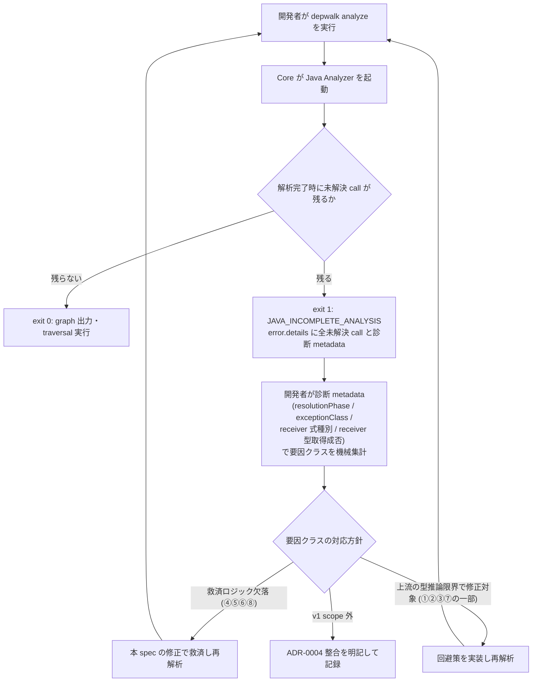
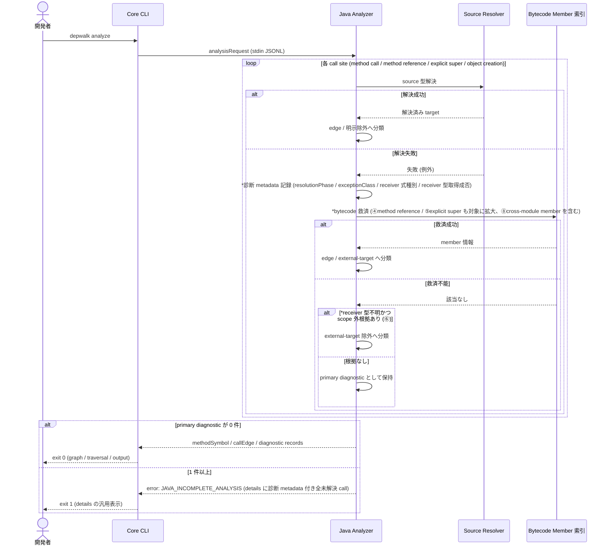

# 実環境Gradle multi-projectの残存未解決callの診断と救済

> 本文書は Issue #27 の spec-lifecycle における作業記録である。
> 当初 `type:research` (要因分類レポート + 後続issue起票) として開始したが、2026-07-21 に `type:bug` の対応 issue へ変換し、診断 metadata 追加・救済ロジック修正・fixture 追加・再計測までを本 spec / branch で実施する。
> durable な設計成果 (診断 metadata 契約 / 救済適用範囲 / fixture 方針) は 2026-07-21 の sync phase で [Java Analyzer feature doc](../../design/features/java-analyzer/DesignDoc_java-analyzer.md) へハンドオフ済みであり、以後 feature doc が正本、本 spec の該当記述は決定時スナップショットである。ADR-0004 は実装後の実測評価に基づき 2026-07-22 に「状態追記」で更新済み ([ADR-0004](../../adr/0004-defer-runtime-call-tracing.md) の `## 決定` 節末尾)。

## メタ情報

- Issue: `#27`
- ステータス: `In Progress`
- 作成日: 2026-07-20
- 更新日: 2026-07-22
- Branch: `feature-27`
- Owner: Fukuemon

## 設計フェーズ状況

状態は `未着手 / 進行中 / 完了 / レビュー済 / 保留` のいずれか。保留の場合は理由を備考に残す。

| #   | フェーズ                    | 状態       | 最終更新   | 備考                                                                                             |
| --- | --------------------------- | ---------- | ---------- | ------------------------------------------------------------------------------------------------ |
| 1   | 起票                        | 完了       | 2026-07-21 | Issue #27 を確認済み。2026-07-21 に research → bug (対応 issue) へ変換                           |
| 2   | 下書き                      | レビュー済 | 2026-07-21 | スコープ変更 (対応まで本 spec で実施) を反映し、再レビュー PASS                                  |
| 3   | 上位文書突合                | 完了       | 2026-07-22 | sync phase で feature doc へ正本ハンドオフ済み (D2/D3/D4)。ADR-0004 状態追記を反映。レビュー待ち |
| 4   | 論点整理                    | レビュー済 | 2026-07-21 | D1〜D5 を抽出。spec-review PASS                                                                  |
| 5   | 論点解決                    | レビュー済 | 2026-07-21 | D1〜D5 確定。D5 はユーザー判断で改訂 (本 spec で対応実施)。再レビュー PASS                       |
| 6   | Interface / Routing 設計    | 完了       | 2026-07-21 | 外部 I/F 変更なし (D2 で確定)。diagram phase で解決パイプライン図を追加                          |
| 7   | Content / Data 設計         | 完了       | 2026-07-21 | 要因分類レポートの配置を確定                                                                     |
| 8   | Performance / Security 設計 | 完了       | 2026-07-21 | 実測データの記載範囲を確定                                                                       |
| 9   | Test / Metrics 設計         | 完了       | 2026-07-21 | fixture 検証・再計測指標を確定                                                                   |
| 10  | 実装分割                    | レビュー済 | 2026-07-21 | prompts/ へ 9 prompt を生成 (hook 10節検査 全 OK)。spec-review PASS                              |
| 11  | レビュー済                  | レビュー済 | 2026-07-21 | tasks phase の fresh-context review PASS。軽微指摘2件反映済み。実装開始可能                      |

## 上位文書整合

正本 ([Design Doc](../../design/DesignDoc.md) / [feature doc](../../design/features/) / [context](../../context/) / ADR) のどの節と、どう整合させたかを記録する。

- PRD 更新要否: 不要。本プロジェクトは統合モードであり、Why / What は Design Doc に統合されている。
- Design Doc 更新要否: 不要。未解決 call の観測可能性は既存の成功条件 S1/S2 と ADR-0004 の枠内。診断 metadata 追加 (D2) と救済 fallback 修正は feature doc への補足として sync phase で反映する (「feature doc への影響」テーブル記載済み)。
- ADR 起票要否: 不要 (新規起票なし)。ADR-0004 は状態追記で更新済み (反映済 2026-07-22)。決定・再検討条件の本文は変更していない。

| 上位文書                    | 節 / 該当箇所                                                     | 整合方針 (継承 / 補足 / 変更提案)                                                               |
| --------------------------- | ----------------------------------------------------------------- | ----------------------------------------------------------------------------------------------- |
| Design Doc                  | 成功条件 S1/S2 (caller/callee 探索の網羅性)                       | 継承                                                                                            |
| feature doc (java-analyzer) | 完全性 gate (`JAVA_INCOMPLETE_ANALYSIS`) / `error.details` の契約 | 継承。Protocol schema は変更しない前提で診断を深掘りする                                        |
| feature doc (java-analyzer) | solver 層の bytecode member 合成の適用範囲                        | 補足。method reference / explicit super / cross-module Lombok 救済の欠落箇所を具体化する        |
| ADR-0004                    | 動的・未解決 call の候補と理由を観測可能にする方針、再検討条件    | 継承。実測により再検討条件への非抵触を確認し、状態追記として ADR へ記録した (反映済 2026-07-22) |
| context (architecture.md)   | Package Boundary (Core は Analyzer 固有の意味を解釈しない)        | 継承。診断 metadata 拡張は Java Analyzer 内部に閉じる想定                                       |

> 矛盾は未検出。D2 (診断 metadata) と救済 fallback 修正は feature doc へ反映済み、ADR-0004 は状態追記で反映済み (いずれも 2026-07-22 時点で完了)。

## 関連資料

- `design/DesignDoc.md`: 成功条件 S1/S2/S4/S5
- 関連 issue: #22 (CLI Interface, 実装済), #24 (Gradle multi-module source roots, D31/D32 で生成 member 起点の型伝播を解決)
- `specs/24-gradle-multi-module-source-roots/index.md`: D31/D32 の決定記録、Resilience4j 実測 3,900→3,267 件の経緯
- PR #26: #24 の実装とレビュー反映
- Issue #27 コメント (2026-07-20): Resilience4j 実測 (module別 build 後 350 件、要因クラス(1)〜(6)、推奨する次の調査順)

## 背景

- #24 (PR #26) で複数 source root 対応と解析完全性 gate (`JAVA_INCOMPLETE_ANALYSIS`) を実装し、実環境の Gradle multi-project で実行検証した。生成 member 起点の型伝播は D31/D32 で解決し、未解決 call は 3,900 → 3,267 へ減少したが、残り 3,267 件の要因が未分類のため #24 から本 issue へ切り出された。
- 本 spec 作成にあたり、issue コメントの Resilience4j 一次調査 (build 後 350 件、要因クラス(1)〜(6)) に加えて、別の実環境 Gradle multi-project (Spring Boot, 7 module。以下「追加検証プロジェクト」) に対しても実測を行った。自動 discovery で `exit 1` / `JAVA_INCOMPLETE_ANALYSIS`、total 14,248 件 (unresolved-method-call 11,355 / unresolved-constructor-call 1,903 / unresolved-method-reference 983 等) を確認した。
- 追加検証プロジェクトの代表例からは、Resilience4j と共通する要因 (`var` + generic メソッドの型推論失敗、Stream fluent chain の解決失敗) に加え、支配的と見られる新規パターン (Lombok `@AllArgsConstructor` / `@Getter` の bytecode 救済が cross-module 呼び出しで機能していない、module 間で偏りが大きい: 最多 module 8,780 / 次点 4,054 / 共通基盤 module 727 他) を確認した。
- Phase 1 の完成条件である caller/callee 探索の網羅性 (S1/S2) に関わる。

## スコープ

### やること

- Resilience4j と追加検証プロジェクトの実測データを合わせて、残存未解決 call の要因クラスを分類する (件数分布・代表例)。
- 各要因クラスが「解決すべき欠陥」「仕様上の除外 (`external-target` / `lift-excluded-package`) へ分類すべきもの」「v1 scope 外として記録するもの」のどれに当たるかを判定する。
- 診断用の追加観測 (`error.details.metadata` への sanitize 済み4項目、D2) を実装する (Protocol / graph 出力契約は変更しない)。
- 「修正」判定の要因クラス (④method reference fallback / ⑤explicit super fallback / ⑥receiver 型不明時の external-target 判定 / ⑧Lombok cross-module 救済、および D3(c) で修正と判断した JavaParser 上流限界の回避策) を本 branch で修正する。
- 最小再現 fixture を追加し、修正の回帰検証を可能にする (D4)。
- 修正後に実プロジェクト2件で再計測し、要因クラス別の件数推移を記録する。
- 修正後も残る診断が実運用の妨げにならないよう、完全性 gate の opt-in 緩和 (`metadata.allowIncompleteAnalysis`) を実装する (ユーザー判断、2026-07-21 追加)。

### やらないこと

- Protocol / Model schema の変更 (→ 必要なら別途 analyzer-protocol feature doc 側の spec)。
- Reflection / AspectJ Runtime / 実行時 Proxy の動的解析対応 (ADR-0004 の据え置き範囲を維持)。
- 実測対象プロジェクト自体のプロダクトコード修正・リファクタリング。

## 要件の解釈

### 実現したいユーザー価値

- depwalk 利用者が、実プロジェクトで `JAVA_INCOMPLETE_ANALYSIS` に遭遇した際に、残存要因が「ツールの欠陥」か「仕様上想定内」かを区別でき、対応の優先順位を判断できる。

### 成功条件

- 残存未解決 call (Resilience4j 350件 + 追加検証プロジェクト 14,248件) が要因クラスへ分類され、件数分布と代表例が記録されている。
- 診断用 metadata 4項目 (D2) が実装され、fixture で期待値検証されている。
- 「修正」判定の要因クラスが本 branch で修正され、最小再現 fixture の回帰検証と実プロジェクト再計測で件数減少が確認されている。
- JavaParser 上流限界による残存分は、仕様上の除外 / v1 scope 外として ADR-0004 との整合を明記して記録されている。
- 完全性 gate の opt-in 緩和が実装され、既定挙動 (fatal) を変えずに実プロジェクトで graph を実用できることを確認済みである。

### 対象ユーザー / 操作主体

- depwalk 開発者 (要因分類・修正の実施者) と、実プロジェクトで `JAVA_INCOMPLETE_ANALYSIS` に遭遇する depwalk 利用者

EARS 風で振る舞いを記述する (`<who>` `<trigger>` 時、システムは `<expected behavior>` する)。

- WHEN 開発者が実環境 Gradle multi-project に対して `depwalk analyze` を実行し `JAVA_INCOMPLETE_ANALYSIS` を受け取ったとき、システムは `error.details` から要因クラスを判別できる情報を提供する。
- IF 要因が仕様上の対象外 (動的呼び出し等、ADR-0004 の据え置き範囲) であるとき、システムはその旨を diagnostic として区別可能に保持する。
- THE SYSTEM SHALL 要因分類の結果を Protocol / Graph 出力契約を変更せずに得られるようにする (診断は内部表現の拡張に閉じる)。
- WHEN method reference / explicit `super(...)` の source 解決が失敗したとき、システムは method call と同等の bytecode 救済と external-target 分類を試みてから diagnostic 化する。
- WHEN Lombok 生成 member を持つ scope 内型が他 module から呼ばれ source 解決に失敗したとき、システムは所属 context の bytecode member 索引で救済する。
- IF receiver 型が取得できず、かつ call が scope 外と判定できる根拠があるとき、システムは primary diagnostic ではなく `external-target` 除外へ分類する (判定根拠の詳細は下流 phase で確定)。

## 設計時の論点

設計 / 実装フェーズへ持ち越す残課題を 1 件ずつ管理する。確定したものは「解決済みの論点」へ移す。

| #   | 論点             | 決定候補 | 決定 |
| --- | ---------------- | -------- | ---- |
| -   | (全論点解決済み) | -        | -    |

## 解決済みの論点

(`spec-resolve` で確定したものをここに移動する)

- **D1 (要因クラス体系)**: Resilience4j 一次調査の6分類 (①fluent chain 型推論失敗 ②generic 型変数 / lambda parameter 解決失敗 ③JDK fluent API 後続 call 解決失敗 ④method reference fallback 不足 ⑤explicit `super(...)` fallback 不足 ⑥receiver 型不明で external-target 分類へ到達不能) を維持し、追加検証プロジェクト由来の「⑦`var` + generic メソッド戻り値の型推論失敗」「⑧Lombok 生成 member の cross-module bytecode 救済欠落」を追加した8分類を本 spec の要因クラス体系とする。②と⑦は近縁だが、⑦は代入先 `var` の推論起点が特定できるため別クラスとして計上し、分類が困難な残余は「未分類 (要診断 metadata)」として D2 の追加観測で解消する。(決定日: 2026-07-20, source: clarify, 案A)
- **D2 (診断用の追加観測)**: `error.details.metadata` へ sanitize 済みの4項目 — `resolutionPhase` (どの解決段階で失敗したか) / `exceptionClass` (JavaParser 例外のクラス名のみ、message は含めない) / receiver 式種別 / receiver 型取得成否 — を追加する。Protocol schema は非破壊 (metadata は opaque な key-value のまま) で、#24 D24 の sanitize 制約 (source 本文・絶対 path・raw exception message 禁止) を維持する。これにより8分類 (D1) への機械的な振り分けと「未分類」残余の解消を可能にする。(決定日: 2026-07-20, source: clarify, 案A)
- **D3 (対応方針の判定基準)**: 次の3基準で各要因クラスを判定する。(a) 自前実装の救済ロジック欠落 (④method reference / ⑤explicit super / ⑧Lombok cross-module 等、depwalk 側で閉じて修正できるもの) → **修正**。(b) scope 外 call なのに receiver 型不明で `external-target` 分類へ到達できないもの (⑥) → **修正 (分類ロジック改善)**。(c) 上流 (JavaParser) の型推論限界 (①②③⑦) → 回避策の実装コストと件数規模で修正 / v1 scope 外記録を個別判断し、scope 外とする場合は ADR-0004 の再検討条件との整合 (静的解析で主要ユースケースの精度を満たせないか) を明記して記録する。(決定日: 2026-07-20, source: clarify, 案A)
- **D4 (最小再現 fixture の方針)**: 既存の `testdata/fixtures/java/multi-module-spring-project` fixture へ、上位パターン (⑧Lombok cross-module、⑦`var`+generic、①fluent chain、④method reference、⑤explicit super) の最小再現ケースを追加する。実測対象コードへ依存しない一般化した形で表現し、既存 E2E 基盤を再利用して修正後の回帰検証にもそのまま使う。既存 fixture の期待 graph / diagnostic 集合への影響は追加ケース分の期待値更新で吸収する。(決定日: 2026-07-20, source: clarify, 案A)
  - **実装時の逸脱 (2026-07-21 記録、2026-07-22 確定)**: (1) 完全性 gate は request 全体を fatal にするため、未解決ケースを既存 fixture の discovery 対象 workspace へ直接追加すると既存 required E2E (成功 graph / exit 0) と両立できない。このため fixture 配下の独立入れ子 build `patterns/` (root settings 非包含) として追加し、専用 E2E `TestUnresolvedCallPatternsCLI` で修正前の未解決 10 件と診断 metadata を固定した。既存期待 graph は不変。correctness / spec-contract の2観点レビューで指摘なしを確認済みであり、**確定**とする。(2) ①fluent chain の「lambda / generic を含む builder 風 API」形は、一般化 2 形状 (通常 generic builder / 自己境界 generic builder + overload + lambda) とも JavaParser 3.28.2 が解決に成功し fixture では再現しなかった。真の再現形の特定は打ち切り、成功回帰ガードとして fixture に残す。実プロジェクトでの効果は P4_04 (chain 前進解決 + 起点遡及の一般化) の再計測で確認済み: Resilience4j の①/⑥ chain 波及バケットは修正前 173 件 → 最終 33 件まで減少しており、①の実質的な要因 (chain 途中の receiver 型消失) は解消できている。**確定**とする。
- **D5 (対応の実施単位)**: 当初「集約 issue として起票」(2026-07-21, 案C) と決定したが、同日のユーザー判断で **後続 issue を起票せず、本 issue #27 / branch `feature-27` で対応まで実施する**方針へ変更した (issue #27 も `type:research` → `type:bug` へ変換済み)。「修正」判定の要因クラス (④method reference fallback / ⑤explicit super fallback / ⑥receiver 型不明時の external-target 判定 / ⑧Lombok cross-module 救済 / ①②③⑦JavaParser 型推論の回避策のうち修正と判定したもの) を本 spec の実装分割 (P4以降) として扱う。効果測定は同一 commit の実プロジェクト再計測で要因クラス別件数を追跡する。(決定日: 2026-07-21, source: clarify → ユーザー判断で改訂)

## 未確定事項

(決定できない項目を理由とともに残す。1 件でも残っていれば下流 phase は止める)

- なし (D1〜D5 すべて解決済み)

## 実装対象

正規 target は `context/project.md` の対象ドメイン一覧を正本とする。

| モジュール          | 実装有無 | 主な責務                                                                 |
| ------------------- | :------: | ------------------------------------------------------------------------ |
| `java-analyzer`     |    ◯     | 要因分類の対象となる resolver / bytecode 救済 / 診断 metadata が属する層 |
| `core`              |    -     | 既存の汎用 metadata passthrough で対応可能 (D2 で確定。Core 側変更なし)  |
| `traversal`         |    -     |                                                                          |
| `output`            |    -     |                                                                          |
| `analyzer-protocol` |    -     | Protocol schema 変更は本 issue のスコープ外                              |

## 機能仕様

(本 issue は Analyzer 内部の診断・救済修正であり、UI/画面/API endpoint を持たない。以下のサブ節は該当なし)

### User Flow

- 該当なし (CLI 利用者から見た操作フローは既存 `depwalk analyze` から変わらない)

### Reuse Policy

- 該当なし

### Performance

- 該当なし (診断のための計測観点は「テスト/評価方針」節で扱う)

### Routing / URL State

- 該当なし

### Content / Assets

- 該当なし

### UI Reuse

- 該当なし

### Testing

- 要因分類の再現性は、D4 のとおり既存 `testdata/fixtures/java/multi-module-spring-project` へ上位パターンの最小再現ケースを追加し、既存 E2E 基盤で検証する。
- D2 の診断 metadata 4項目は、fixture の該当ケースで期待値として検証する (sanitize 制約が守られていることを含む)。

## Interface 設計

### UI / API / Event Interface

- 該当なし。Protocol schema / CLI インターフェースは変更しない (D2 で確定)。`error.details.metadata` への診断4項目追加は opaque metadata の範囲内で、Core / Protocol の契約に影響しない。

### Props / Request / Response

- 該当なし

## Content / Data 設計

### 保存・管理するデータ

- 要因分類レポート (要因クラス別の件数分布・代表例・再現最小ケース) を本 spec または `specs/27-unresolved-call-diagnosis/` 配下に記録する。

### コンテンツ配置 / package / route

- 該当なし

## Performance / Security 設計

### Performance

- 該当なし

### Security / Privacy

- 該当なし。

## Error / Fallback 設計

### エラーケース

| #   | ケース                                                            | ユーザーへの見せ方                                                       | リカバリ                                             |
| --- | ----------------------------------------------------------------- | ------------------------------------------------------------------------ | ---------------------------------------------------- |
| 1   | 修正後も JavaParser 上流限界で未解決 call が残る                  | `JAVA_INCOMPLETE_ANALYSIS` の `error.details` に診断 metadata 付きで残る | v1 scope 外として記録し、ADR-0004 の再検討条件で追跡 |
| 2   | 救済 fallback 追加により scope 内 call を誤って external 分類する | 既存 fixture の期待 graph / call-site outcome 集計との差分で検出         | fixture 回帰検証 (P2) で修正                         |

### Fallback

- ④⑤の resolve 失敗時 fallback、⑥の external-target 判定、⑧の cross-module 救済の各 fallback 実装が本 spec の対応対象 (実装分割 P5〜P7)。判定根拠の詳細は P4 で確定する。

## テスト / 評価方針

### テスト観点

- 要因分類の妥当性: 代表例が該当 reason / target と一致しているか
- 分類の再現性: D4 で追加する最小再現 fixture が同じ要因クラスとして検出されるか
- 救済修正の正しさ: 修正後に fixture の該当ケースが edge / external-target 除外へ分類され、scope 内 call の誤 external 分類が起きていないか

### 計測指標

- 要因クラス別の件数分布 (Resilience4j / 追加検証プロジェクトそれぞれ)
- 修正後の再計測での残存件数推移

## フロー / シーケンス

対象は「開発者が実環境プロジェクトを解析し、未解決 call を診断・修正するまで」の流れ (flowchart) と、「call site 1 件の解決・救済・分類」の内部処理 (sequence)。修正対象の fallback (④⑤⑥⑧) と診断 metadata (D2) の位置づけを示す。

### Flowchart (ユーザー操作起点)

### Sequence

call site 1 件の解決パイプライン。`*` 付きが本 spec の変更点。診断 metadata は解決失敗時点で内部記録し、その call site が最終的に primary diagnostic として終端した場合のみ `error.details.metadata` へ出力する (救済成功時は Protocol へ出さない。保持・破棄の実装詳細は P1 prompt で明示する)。

## 実装分割

### 実装タスク案

| Phase | 対象            | 概要                                                                                                            | 依存   |
| ----- | --------------- | --------------------------------------------------------------------------------------------------------------- | ------ |
| P1    | `java-analyzer` | D2 の診断 metadata 4項目 (`resolutionPhase` / `exceptionClass` / receiver 式種別 / receiver 型取得成否) を実装  | -      |
| P2    | `java-analyzer` | D4 の最小再現 fixture を `multi-module-spring-project` へ追加し、診断 metadata の期待値を検証                   | P1     |
| P3    | -               | 実プロジェクト2件 (Resilience4j / 追加検証プロジェクト) を再計測し、8分類 (D1) へ機械集計・要因分類レポート作成 | P1     |
| P4    | -               | D3 基準で要因クラス別の対応方針を確定し、修正対象・仕様除外・scope 外記録を確定する                             | P3     |
| P5    | `java-analyzer` | ④method reference / ⑤explicit super の resolve 失敗時 bytecode 救済・external-target 分類 fallback を実装       | P2, P4 |
| P6    | `java-analyzer` | ⑧Lombok 生成 member の cross-module bytecode 救済を修正                                                         | P2, P4 |
| P7    | `java-analyzer` | ⑥receiver 型不明時の external-target 判定を実装 (P4 で確定した判定根拠に従う)                                   | P2, P4 |
| P8    | `java-analyzer` | P4 で「修正」と判定した JavaParser 型推論限界 (①②③⑦) の回避策を実装 (対象は P4 の判定結果に従う)                | P2, P4 |
| P9    | -               | 実プロジェクト2件で再計測し、要因クラス別件数推移と v1 scope 外記録を確定、feature doc / ADR へ sync            | P5〜P8 |

### prompts 生成方針

- P1〜P2 は `java-analyzer` 内で閉じる実装 prompt、P3〜P4 は調査・レポート・判定の作業 prompt、P5〜P8 は要因クラス別の修正 prompt、P9 は再計測と sync の締め prompt として分ける
- P2 (fixture) と P3 (実測再計測) は P1 完了後に並列実行できる。P5〜P8 は fixture (P2) と判定 (P4) 完了後に相互独立で並列実行できる

### 生成済み prompts (2026-07-21, tasks phase)

タスク案の P1〜P9 を `prompts/` 配下の 9 ファイルへ写像した。prompt phase 番号は依存順で振り直している。
P4 系 4 本は責務独立だが、いずれも同じ E2E 期待値ファイルと fixture 期待集合を更新するため、真に並列実行する場合は期待値更新の merge 衝突に注意する (逐次実行を推奨)。

| ファイル (prompts/)                                 | タスク案 | 並列可                | 依存先            | 概要                                                |
| --------------------------------------------------- | -------- | --------------------- | ----------------- | --------------------------------------------------- |
| `P1_01_java-analyzer_diagnostic-metadata.md`        | P1       | -                     | なし              | 診断 metadata 4項目の実装                           |
| `P2_01_java-analyzer_unresolved-fixture.md`         | P2       | P2_02                 | P1_01             | 最小再現 fixture 5 パターンと期待値                 |
| `P2_02_java-analyzer_remeasure-classification.md`   | P3       | P2_01                 | P1_01             | 実プロジェクト再計測と 8 分類レポート (`report.md`) |
| `P3_01_java-analyzer_disposition.md`                | P4       | -                     | P2_02             | D3 基準の対応方針判定 (ユーザー承認ゲート)          |
| `P4_01_java-analyzer_reference-super-fallback.md`   | P5       | P4_02 / P4_03 / P4_04 | P2_01, P3_01      | ④⑤ method reference / explicit super の救済         |
| `P4_02_java-analyzer_lombok-cross-module.md`        | P6       | P4_01 / P4_03 / P4_04 | P2_01, P3_01      | ⑧ cross-module 生成 member 救済の欠陥修正           |
| `P4_03_java-analyzer_receiver-unknown-external.md`  | P7       | P4_01 / P4_02 / P4_04 | P2_01, P3_01      | ⑥ receiver 型不明時の external-target 判定          |
| `P4_04_java-analyzer_type-inference-workarounds.md` | P8       | P4_01 / P4_02 / P4_03 | P2_01, P3_01      | ①②③⑦ 回避策 (P3_01 で修正判定分のみ)                |
| `P5_01_java-analyzer_remeasure-sync.md`             | P9       | -                     | P4_01〜P4_04 全部 | 修正後再計測・ADR-0004 判定・spec / issue 締め      |

## 上位資料からの変更点

本 spec で PRD / Design Doc / feature doc / context / 既存 ADR から変更・追加した内容を、反映先別に記録する。`spec-track` / `spec-sync` で更新する。

### PRD への影響

| 対象節 | 変更内容 | 理由 |
| ------ | -------- | ---- |
|        |          |      |

### Design Doc への影響

| 対象節 | 変更内容 | 理由 |
| ------ | -------- | ---- |
|        |          |      |

### feature doc への影響

| 対象 doc / 節                                                                        | 変更内容                                                                                                                                                                                                                                                                          | 理由                                                                                             |
| ------------------------------------------------------------------------------------ | --------------------------------------------------------------------------------------------------------------------------------------------------------------------------------------------------------------------------------------------------------------------------------- | ------------------------------------------------------------------------------------------------ |
| java-analyzer / `diagnostic / error code 体系`                                       | `error.details.metadata` へ sanitize 済み診断4項目 (`resolutionPhase` / `exceptionClass` / receiver 式種別 / receiver 型取得成否) を追加 (source: clarify D2) — **反映済 (2026-07-21 sync)**                                                                                      | 要因クラスの機械集計に必要。Protocol schema 非破壊・D24 sanitize 制約維持                        |
| java-analyzer / `Parse・resolution・call 完全性`、`solver 層の bytecode member 合成` | bytecode 救済と external-target 分類の適用対象を method call だけでなく method reference / explicit `super(...)` へ拡大し (④⑤)、cross-module の生成 member 救済 (⑧) と receiver 型不明時の external-target 判定 (⑥) を追加 (source: clarify D3/D5) — **反映済 (2026-07-21 sync)** | 実測で判明した救済ロジック欠落の修正。帰属意味論・完全性 gate の枠組みは変えず適用範囲のみ広げる |
| java-analyzer / `テスト観点`                                                         | `multi-module-spring-project` fixture へ上位パターン (①④⑤⑦⑧) の最小再現ケースと診断 metadata 期待値検証を追加 (source: clarify D4) — **反映済 (2026-07-21 sync)**                                                                                                                 | 救済修正の回帰検証と診断 metadata の sanitize 制約検証を E2E で担保する                          |
| java-analyzer / `Parse・resolution・call 完全性`                                     | ⑥の external-target 判定規則の実体 (chain 前進解決 / 起点遡及 / lambda parameter 規則、P3_01 承認 + 実装で確定) を追記 (source: P4_03/P4_04 実装) — **反映済 (2026-07-21 実装後)**                                                                                                | 「詳細規則は実装で確定し本節へ追記する」の履行                                                   |
| java-analyzer / `solver 層の bytecode member 合成`                                   | 採用境界の機構記述を「classpath 上の依存 project output」から「model の project 依存関係で到達可能な依存 project output」へ精緻化 (source: P4_02 実装 + レビュー指摘) — **反映済 (2026-07-21 実装後)**                                                                            | Gradle model が依存 project を jar として返す場合の欠陥修正 (⑧) と文言を一致させる               |
| java-analyzer / `Parse・resolution・call 完全性`、`metadata 契約`、`テスト観点`      | `metadata.allowIncompleteAnalysis` による完全性 gate の opt-in 緩和 (既定 `false`) を追加。有効時は primary diagnostic が残っても exit 0 で graph を公開し、残存は診断として可視のまま維持 (source: ユーザー判断、2026-07-21 追加) — **反映済 (2026-07-21 実装後)**               | 実測残余 (2.3%/1.3%) があっても graph を実用できるようにする。gate 契約・帰属意味論は変更しない  |

### context への影響

| 対象 doc / 節 | 変更内容                                                                                                                                                  | 理由                                                   |
| ------------- | --------------------------------------------------------------------------------------------------------------------------------------------------------- | ------------------------------------------------------ |
| (変更なし)    | architecture の Package / Runtime Boundary は不変。診断 metadata と救済拡大は Java Analyzer 内部に閉じ、Core は opaque passthrough のまま (source: track) | 境界不変の確認記録。sync phase での context 更新は不要 |

### ADR の新規 / 更新

| ADR ID   | 変更内容                                                                                                                                                                                                                                                                                                                         | 理由                                                                                                  |
| -------- | -------------------------------------------------------------------------------------------------------------------------------------------------------------------------------------------------------------------------------------------------------------------------------------------------------------------------------- | ----------------------------------------------------------------------------------------------------- |
| ADR-0004 | `## 決定` 節へ「状態追記 (spec #27、2026-07-21)」を追加: D2 の診断 metadata が観測可能性の方針を具体化したこと、実測 (97.7%〜98.7% 解決/scope外判定) により再検討条件に抵触しないと判断したこと、`allowIncompleteAnalysis` opt-in 緩和が Runtime Trace とは独立であることを記録 (source: P5_01 実装後) — **反映済 (2026-07-22)** | 決定自体は変更せず、実測に基づく判断根拠を ADR に残すことで将来の再検討時に同じ調査を繰り返さずに済む |

## レビュー

`spec-review` (fresh-context evaluator) の最新結果。完全な記録は `review.md` を参照。

| 日付       | 結果 (PASS / NEEDS_WORK)        | 指摘要点                                                                                                | 対応                                                                                                   |
| ---------- | ------------------------------- | ------------------------------------------------------------------------------------------------------- | ------------------------------------------------------------------------------------------------------ |
| 2026-07-21 | PASS                            | 軽微3件: feature doc 参照が実装クラス名になっている / D3(c) に②が暗黙 / 実装分割フェーズ表同期          | 前2件を反映済み。フェーズ表の実装分割状態は track phase 移行時に同期                                   |
| 2026-07-21 | PASS (スコープ変更後再レビュー) | 軽微3件: 上位文書整合の前文が research 前提の条件文 / テスト観点の D4 条件表現が古い / フェーズ10未同期 | 前2件を反映済み。フェーズ10は track phase 移行時に同期                                                 |
| 2026-07-21 | PASS (diagram phase)            | 軽微2件: flowchart ラベルの `\n` は ` ` が安全 / 診断 metadata の記録・出力タイミングの明示         | 2件とも反映済み                                                                                        |
| 2026-07-21 | NEEDS_WORK (track phase)        | 4件: feature doc / ADR の反映先節名が実在しない / フェーズ10未同期 / source 帰属誤り                    | 4件とも反映済み (節名を実在見出しへ修正、フェーズ10を進行中へ、source を clarify へ訂正)。再レビューへ |
| 2026-07-21 | PASS (track phase 再レビュー)   | 指摘なし。前回4件すべて解消を確認                                                                       | -                                                                                                      |
| 2026-07-21 | NEEDS_WORK (sync phase)         | 1件: feature doc のハンドオフ台帳 (上位資料からの変更点) に spec #27 行が未追加                         | 反映済み (spec #27 行を追加)。再レビューへ                                                             |
| 2026-07-21 | PASS (sync phase 再レビュー)    | 指摘なし。台帳と本文の整合を確認                                                                        | -                                                                                                      |
| 2026-07-21 | PASS (tasks phase)              | 軽微3件: P5_01 の全体 E2E に fixture prep が必要 / P4 系並列時の期待値衝突注意 / fixture task 名の許容  | 前2件を反映済み (P5_01 へ prep 追記、実装分割へ注意書き)。3件目は注記済みで対応不要                    |

## 変更履歴

| 日付       | 変更者   | 変更内容                                                                                                                 |
| ---------- | -------- | ------------------------------------------------------------------------------------------------------------------------ |
| 2026-07-20 | Fukuemon | scaffold phase で index.md を新規作成                                                                                    |
| 2026-07-21 | Fukuemon | clarify phase で D1〜D5 を確定し、実装分割タスク案・Testing・Interface 設計へ同期                                        |
| 2026-07-21 | Fukuemon | spec-review PASS。軽微指摘 (feature doc 節名参照 / D3(c) への②明記) を反映                                               |
| 2026-07-21 | Fukuemon | issue #27 を research → bug へ変換 (ユーザー判断)。対応実装まで本 spec のスコープへ拡大し、D5 改訂・実装分割 P5〜P9 追加 |
| 2026-07-21 | Fukuemon | diagram phase で解析フロー flowchart と call site 解決パイプライン sequence を追加                                       |
| 2026-07-21 | Fukuemon | track phase で上位資料からの変更点を最新化 (feature doc 3件 / context 変更なし確認 / ADR-0004 条件付き追記)              |
| 2026-07-21 | Fukuemon | sync phase で feature doc へ D2/D3/D4 の durable 成果をハンドオフ (診断 metadata 契約 / 救済適用範囲拡大 / fixture 方針) |
| 2026-07-21 | Fukuemon | tasks phase で prompts/ 配下に 9 実装 prompt を生成し、実装分割節へ一覧・依存表を追記                                    |
| 2026-07-21 | Fukuemon | tasks phase レビュー PASS。軽微指摘 (P5_01 fixture prep / P4 並列注意) を反映し、全 phase レビュー済みへ                 |
| 2026-07-21 | Fukuemon | 実装 P1_01 (診断 metadata) / P2_01 (patterns fixture + 専用 E2E) 完了。D4 実装時の逸脱 2 件を記録 (ユーザー追認待ち)     |
| 2026-07-21 | Fukuemon | P2_02〜P5_01 (再計測・P3_01対応方針承認・P4_01〜P4_04修正) 完了。R4j 350→143、追加検証 14,248→1,161 まで削減             |
| 2026-07-21 | Fukuemon | ユーザー判断で完全性 gate の opt-in 緩和 (`metadata.allowIncompleteAnalysis`) を追加実装し、やること/成功条件へ反映      |
| 2026-07-22 | Fukuemon | D4 実装時の逸脱2件を確定 (ユーザー指示によりレビュー結果と実測効果で判断)。ADR-0004 を状態追記で更新し spec 側を同期     |

## 備考

- 本 issue は appendix (API / database / authorization / screen-spec / testid) のいずれにも該当しない。挿入しない。
