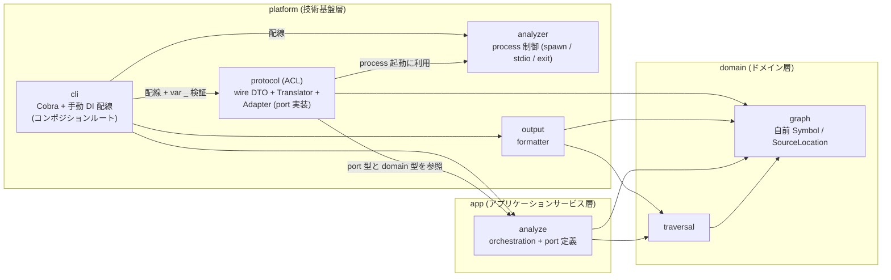
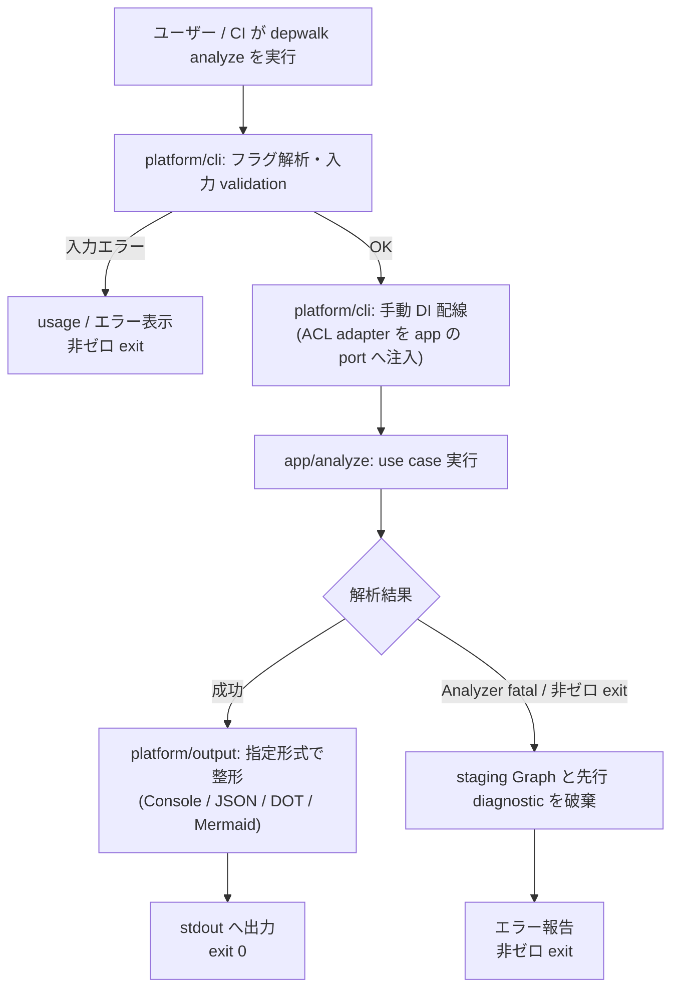
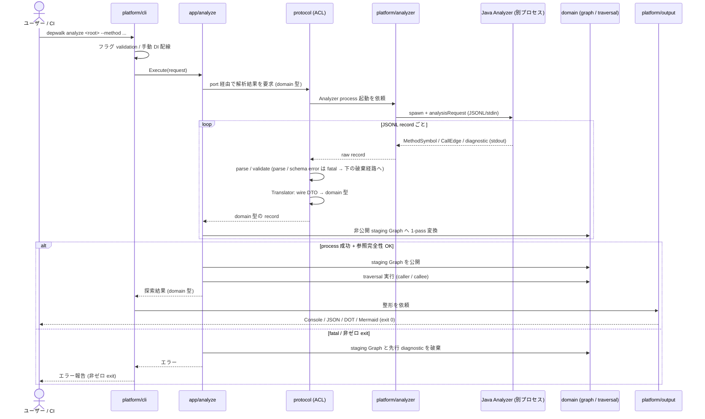

# Core / Java Analyzer アーキテクチャ再編

> spec 本体。要求の正本は [requirements.md](requirements.md)、上位文書は [design/DesignDoc.md](../../design/DesignDoc.md) / [context/architecture.md](../../context/architecture.md) を参照する。

## メタ情報

- Issue: `#32`
- ステータス: `In Progress` (設計フェーズ完了・実装は子 issue #34 / #35 で進行)
- 作成日: 2026-07-23
- 更新日: 2026-07-26
- Branch: `feature/32`
- Owner: Fukuemon

## 設計フェーズ状況

状態は `未着手 / 進行中 / 完了 / レビュー済 / 保留` のいずれか。保留の場合は理由を備考に残す。

| #   | フェーズ                    | 状態       | 最終更新   | 備考                                                                                |
| --- | --------------------------- | ---------- | ---------- | ----------------------------------------------------------------------------------- |
| 1   | 起票                        | 完了       | 2026-07-23 | #32 (requirements.md で要求整理済み)                                                |
| 2   | 下書き                      | レビュー済 | 2026-07-23 | 本 scaffold。spec-review PASS                                                       |
| 3   | 上位文書突合                | レビュー済 | 2026-07-24 | track で変更点テーブル最新化。再レビュー PASS                                       |
| 4   | 論点整理                    | レビュー済 | 2026-07-23 | requirements の未決 4 件 + scaffold で追加 3 件                                     |
| 5   | 論点解決                    | レビュー済 | 2026-07-24 | D1〜D7 全件解決 + 精緻化追記。spec-review PASS                                      |
| 6   | Interface / Routing 設計    | レビュー済 | 2026-07-24 | diagram: 図を確定。再レビュー PASS                                                  |
| 7   | Content / Data 設計         | 完了       | 2026-07-24 | 図・配置・変換方針を確定。変換 API の関数シグネチャ詳細は実装 prompt (P2_01) へ委譲 |
| 8   | Performance / Security 設計 | 完了       | 2026-07-24 | 変換は既存処理の再配置で追加走査なし。E2E 時間逸脱なしを基準化 (該当節に記述済み)   |
| 9   | Test / Metrics 設計         | 完了       | 2026-07-24 | 挙動不変の検証方針 (既存テスト無変更 PASS + 意図的違反での lint FAIL 確認) を確定   |
| 10  | 実装分割                    | レビュー済 | 2026-07-24 | 子 issue #34 / #35 起票、prompts 6 本生成。再レビュー PASS                          |
| 11  | レビュー済                  | 完了       | 2026-07-24 | 全 phase レビュー済み。最終 (tasks) レビュー PASS                                   |

## 上位文書整合

正本 ([Design Doc](../../design/DesignDoc.md) / [feature doc](../../design/features/) / [context](../../context/) / ADR) のどの節と、どう整合させたかを記録する。

- PRD 更新要否: 不要 (統合モード。DesignDoc の Why/What / 成功条件 S1〜S5 は変更しない)
- Design Doc 更新要否: 要 (モジュール責務・図の package 参照が再編後に古くなる場合のみ)
- ADR 起票要否: 起票済み ([ADR-0007](../../adr/0007-layered-architecture-refactor.md)、2026-07-24 sync。ADR-0002 へ追補注記済み)

| 上位文書                | 節 / 該当箇所                                         | 整合方針 (継承 / 補足 / 変更提案)                                                                                                                                         |
| ----------------------- | ----------------------------------------------------- | ------------------------------------------------------------------------------------------------------------------------------------------------------------------------- |
| Design Doc (統合 PRD)   | Why/What / 成功条件 / Non Goals                       | 継承 (外部挙動・スコープを変えない)                                                                                                                                       |
| Design Doc              | モジュール責務 / 設計原則 P1〜P4                      | 継承 (P2/P3 の内部徹底。責務分割自体は変えない)                                                                                                                           |
| Design Doc              | モジュール責務表・図中の package 対応                 | 変更提案 (再編後の package 名参照の更新が必要なら sync で反映)                                                                                                            |
| feature doc (graph)     | staging Graph の規約 / `SourceLocation` 再利用決定    | 継承 + 変更提案 (staging Graph 規約は継承。`SourceLocation` は feature doc が protocol 型の再利用を明示決定済みであり、D6 はこれを覆して domain 自前型へ改訂する変更提案) |
| feature doc (output 等) | package 参照箇所                                      | 変更提案 (移動後の path 追随。sync で反映)                                                                                                                                |
| context/architecture.md | Package Boundary (package 表 / 依存方向)              | 変更提案 (層別構造へ改訂。本 issue の成果物)                                                                                                                              |
| context/project.yml     | Naming Conventions (Core package 一覧) / 対象ドメイン | 変更提案 (再編後の package 一覧へ改訂)                                                                                                                                    |
| context/engineering.md  | quality gate                                          | 変更提案 (依存方向 lint の組み込みを追記)                                                                                                                                 |
| ADR-0002                | 初期 directory / package 構成                         | 変更提案 (追補 ADR で改訂。0002 自体は履歴として保持)                                                                                                                     |
| ADR-0001 / ADR-0006     | Protocol 境界 / Gradle discovery                      | 継承 (プロセス境界・Protocol は現状維持)                                                                                                                                  |

> 変更提案は本 issue の目的そのもの (ドキュメント同期が成果物) であり、変更内容は論点解決 (層命名・配置) に依存する。したがって scaffold 時点で sync へ分岐せず、論点解決・設計確定後の sync phase で back-propagate する。

## 関連資料

- 要求定義: [requirements.md](requirements.md)
- Issue: https://github.com/Fukuemon/depwalk/issues/32
- [design/DesignDoc.md](../../design/DesignDoc.md) — 設計原則 P1〜P4、モジュール責務
- [context/architecture.md](../../context/architecture.md) — Package Boundary (改訂対象)
- [context/project.yml](../../context/project.yml) — Naming Conventions / 対象ドメイン (改訂対象)
- [context/engineering.md](../../context/engineering.md) — quality gate (lint 組み込み先)
- [adr/0002-core-implementation-foundation.md](../../adr/0002-core-implementation-foundation.md) — 現行 package 構成の正本 (追補対象)
- 関連 feature doc: [graph](../../design/features/graph/DesignDoc_graph.md) / [output](../../design/features/output/DesignDoc_output.md) / [analyzer-protocol](../../design/features/analyzer-protocol/DesignDoc_analyzer-protocol.md) / [java-analyzer](../../design/features/java-analyzer/DesignDoc_java-analyzer.md)
- 外部参考資料: [Go の設計、どこまでやる？ (zenn.dev/135yshr/books/go-service-design)](https://zenn.dev/135yshr/books/go-service-design) — 依存性ルール / interface 利用側定義 / UseCase 層 / ACL / 手動 DI / depguard の各章を D1・D5・D6 の精緻化根拠として参照 (2026-07-24)

## 背景

- Core (Go) は `core/internal` 配下が feature 単位の 7 package 並列で、Domain / UseCase / Infrastructure の層区別と依存方向がディレクトリ構造から読み取れない。
- import 実測 (2026-07-23) で `core/internal/protocol` がハブ化しており、`graph` / `output` / `cli` / `analyze` / `analyzer` の 5 package が直接依存。wire 表現 (JSONL DTO) がドメイン側へ漏れている (`graph -> protocol` の import が実在)。なお `SourceLocation` の protocol 型再利用は graph feature doc が明示的に決定した設計であり (規約違反ではない)、architecture.md の「wire DTO / wire 専用フィールドを graph model に保持しない」との間で文書間の緊張関係があった。本 issue (D6) はこれを domain 自前型へ統一する方向で改訂する。
- `core/internal/cli` が use case (`analyze`) だけでなく `graph` / `output` / `protocol` にも直接依存し、エントリポイントが内層を迂回参照している。
- Java Analyzer は `analysis` 配下に 9 sub-package が並列し、解析パイプラインの段階と SootUp 等外部ライブラリへの依存境界が構造から読み取れない。
- これを層が明示された構造へ再編し、依存方向を機械検査 (lint) で固定し、正本ドキュメントを実態と一致させる。外側の Core / Analyzer プロセス境界 (P1〜P4) は変更しない。

## スコープ

### やること

- Core (Go) `core/internal` 配下の層別ディレクトリ再編 (層の命名・配置は設計で確定)
- 依存方向の是正: wire 表現のドメイン漏れを変換層で断ち切る (`graph` / `output` から `protocol` への依存除去を含む)。`cli` の内層迂回参照の整理
- Java Analyzer `javaanalyzer` 配下を、解析パイプラインの段階と依存境界 (SootUp 等の隔離) が読み取れる構造へ再編
- 依存方向の自動検査: Go は lint (depguard 等) を既存 quality gate (lefthook / CI) に組み込む。Java 側の検査手段は設計で選定
- ドキュメント同期: architecture.md / DesignDoc / feature doc / project.yml / engineering.md / 追補 ADR

### やらないこと

- CLI インターフェース (フラグ / 引数 / 出力形式)、JSONL Protocol schema、exit code 等の外部挙動の変更
- 新機能の追加、既存ロジックのアルゴリズム変更
- Core / Analyzer 間のプロセス境界・Protocol 境界の変更
- analyzers/java の Gradle build 構成 (shadowJar / compatibility matrix) の変更 (package 移動に伴う機械的追随を除く)

## 要件の解釈

### 実現したいユーザー価値

- 機能追加時に「どの層に置くか / 何に依存してよいか」をディレクトリ構造と lint から迷わず判断できる
- AI エージェント (spec-\* workflow) が architecture.md を読んで正しい配置・依存で実装できる
- 第 2 言語 Analyzer 実装者が参照実装 (Java Analyzer) の構造から Analyzer の作り方を読み取れる

### 成功条件

- ディレクトリ構造 (および層 README / architecture.md) だけで層と依存方向が判別できる
- 層をまたぐ禁止 import が CI / pre-commit で機械検出される
- architecture.md / DesignDoc の記述と実装の乖離 (graph -> protocol 等) がゼロ
- 既存の外部挙動 (CLI / JSONL Protocol / 出力形式) が一切変わらない

### 対象ユーザー / 操作主体

- リポジトリ開発者 (Fukuemon) / AI エージェント / 将来のコントリビュータ

EARS 風で振る舞いを記述する (正本は [requirements.md の受け入れ基準](requirements.md#受け入れ基準-ears))。

- WHEN 開発者が `core/internal` / `analyzers/java` のツリーを閲覧したとき、システムは層の区別と依存方向を構造から判別できる状態を提供する
- THE SYSTEM SHALL Core の Domain 相当層から wire 表現 (`protocol` 相当 package) への import を持たない
- IF 層をまたぐ禁止 import が追加された場合、システムは lint で検出し CI / pre-commit を FAIL させる
- WHEN 再編後に既存テストスイートを実行したとき、システムはテスト本体のロジック変更なし (package 移動の機械的修正のみ) で全件 PASS する
- THE SYSTEM SHALL architecture.md / project.yml の記述と実装の package 構造・import 関係を一致させる

## 設計時の論点

設計 / 実装フェーズへ持ち越す残課題を 1 件ずつ管理する。確定したものは「解決済みの論点」へ移す。
D1〜D4 は [requirements.md の未決事項](requirements.md#未決事項論点) から引き継ぎ。D5〜D7 は scaffold で追加。

| #   | 論点                         | 決定候補 | 決定 |
| --- | ---------------------------- | -------- | ---- |
| -   | なし (D1〜D7 すべて解決済み) | -        | -    |

## 解決済みの論点

(clarify で確定したものをここに移動する)

- **D1: Core の層ディレクトリ命名 → B) Go 慣習寄りの層名 `domain` / `app` / `platform` を採用** (2026-07-23, Fukuemon) **→ 2026-07-25 D8 で物理化を撤回 (層は概念のみ維持)**
  - `core/internal/` 直下を `domain/` (graph / traversal)、`app/` (analyze)、`platform/` (protocol / analyzer / cli、output は D2 で確定) の 3 層ディレクトリでグルーピングする。package 名 (import 末尾) は従来の責務名を維持する
  - `usecase` / `infra` という機械的層名は避け、Go コミュニティで通用する語彙 (`app` = アプリケーションサービス層、`platform` = 技術基盤層) を使う。層名とクリーンアーキテクチャ用語の対応は architecture.md と各層 README で明文化する
  - 依存方向は `platform` → `app` → `domain` の内向き単方向 (業務ルール 1)。lint (D5) はディレクトリ prefix 単位でルール化する
  - (2026-07-24 追記, go-service-design 準拠) クリーンアーキテクチャで唯一絶対なのは依存の内向き方向であり、層数・ディレクトリ構成・命名は自由 (原典 Ch.22)。書籍はマルチ feature アプリでは「モジュール × レイヤー」分割 (feature 散在の回避) を推すが、Core は呼び出しグラフ解析という単一 context で責務 package (graph / traversal 等) がそのまま機能単位なので、層ファースト構成でも feature 散在は起きない — D1 の構成を維持する根拠として記録
- **D2: output の位置づけ → A) `platform/output` (presenter 層は設けない)** (2026-07-23, Fukuemon)
  - output は「外界への書き出し形式」という技術詳細として `platform` に含める。依存先は `domain` のみ (現状の `output -> protocol` import は本 issue で除去)
  - package 1 つのために 4 層目 (presenter) を作らない (先回りした共通化の回避)。将来 formatter が肥大化した場合に分離を再検討する
- **D6: wire 変換層の配置 → A) platform 側に変換、app に port interface** (2026-07-23, Fukuemon)
  - `graph` が自前の `Symbol` / `SourceLocation` 相当型を持ち、protocol import をゼロにする (受け入れ基準 2)。wire 型との重複定義は境界隔離のコストとして許容する
  - `analyze` は domain 型を返す port interface を定義し、`protocol` (adapter) が wire → domain 変換を担って port を実装する。変換関数の現在地 (`graph/convert.go` の `NodeFromMethodSymbol` 等) は platform 側へ移す
  - 依存方向は `platform` → `app` → `domain` の内向き単方向を例外なしで成立させる (app から protocol への import も除去)
  - 配線は `cli` でのコンストラクタ注入による**手動 DI** とし、`google/wire` 等の DI ライブラリ・コード生成は導入しない (独自の変換層のみ。ADR-0002 の依存最小方針と整合)
  - (2026-07-24 追記, go-service-design 準拠) port interface の置き方を精緻化:
    - port は **利用側 (app/analyze) のファイル内に小さく定義** (1〜2 メソッド、必要なら非公開)。`port/` 専用ディレクトリ・package は作らない (Input Port 廃止・interface は利用側 package に属するという Go 慣習)
    - `app/analyze` 自身は **struct として公開**し、cli 向けの先回り interface (Preemptive Interface) を作らない。cli 側が抽象を必要とする場合のみ cli 側で定義する
    - `var _ Interface = (*Impl)(nil)` による interface 満足の検証は **コンポジションルート (cli の配線箇所) に集約**する
    - `protocol` は **ACL (腐敗防止層)** として位置づける: wire DTO (外部形式) は ACL 内に閉じ、Translator (wire → domain 変換) + Adapter (port 実装) の組で構成する
- **D5: Go 側の依存方向 lint → A) golangci-lint + depguard** (2026-07-23, Fukuemon) **→ 2026-07-25 D8 でルール単位を層 glob から package 単位へ変更**
  - golangci-lint を dev ツールとして導入し、depguard で層別 (ディレクトリ prefix 単位) の import 禁止ルールを宣言する: `domain` は `app` / `platform` を deny、`app` は `platform` を deny
  - 既存 quality gate (lefthook pre-commit / CI) に組み込む。バージョンは固定して再現性を保つ
  - ルール定義の詳細 (`.golangci.yml` の具体構成) は実装 phase で確定
  - (2026-07-24 追記, go-service-design 準拠) depguard ルールは `files` (層の glob) + `deny` (禁止 pkg) + `desc` (違反理由の日本語メッセージ) の宣言形式で記述する (書籍 Ch.17 のパターン)。違反時に理由が表示されることで開発者・AI エージェントが自己修正しやすくなる
- **D7: Java Analyzer の層構造 → A) パイプライン段階 + 外部ライブラリ隔離** (2026-07-23, Fukuemon)
  - `javaanalyzer` 直下 (`protocol` / `io` / `preflight` / `discovery`) は現状維持。`discovery` は引き続き Gradle Tooling API の隔離境界とする
  - `analysis` 配下を「実行順の段階別 package」+「外部ライブラリ adapter package」で再編する。段階の実行順は `pipeline` (Runner) だけが知る
  - SootUp 型の漏れ (現状 `graph` / `augment` / `completeness` / `spring` / `AnalysisRunner` に散在) を adapter package (`sootup` 等) の境界内に封じ、JavaParser / SymbolSolver も同様に扱う
  - Core (3 層) と命名思想が非対称になることは許容し、意図 (Analyzer は変換パイプラインである) を README / architecture.md で説明する
  - クラス単位の最終配置図は diagram phase で確定する
  - (2026-07-24 精緻化, Fukuemon 確認済み) 外部ライブラリ隔離の適用レベルを 3 段階に確定: **SootUp** は `sootup/` adapter に完全封じ込め (facade が自前型で公開。現状 7 クラスに漏れている `sootup.*` import を除去)。**Gradle Tooling API** は `discovery/` に完全隔離 (現状維持)。**JavaParser / SymbolSolver** は解析エンジンの中核であり `analysis` 配下の段階 package 間では自由に使ってよい — 禁止するのは `analysis` の外 (`io` / `protocol` / `preflight` / `discovery` / `Main`) への漏れのみ。字義どおりの全面隔離は実質的な解析器書き換えとなり「外部挙動不変の再編」スコープを超えるため不採用
- **D3: Java 側の依存検査 → A) ArchUnit を採用** (2026-07-23, Fukuemon)
  - ArchUnit を test 依存として追加し、「adapter package 以外から `sootup.*` / `com.github.javaparser.*` / `org.gradle.tooling.*` を import 禁止」等のルールを JUnit テストとして記述する
  - 既存の `./gradlew test` (quality gate 組み込み済み) で実行されるため、新しい gate 配線は不要。Go 側 (depguard) と対の機械検査が揃う (業務ルール 5)
  - 具体的なルールセットは diagram phase の配置図確定後に定義する。例外シナリオ 3 (別 issue 分離) は不採用
- **D4: 段階分割 → A) epic + 子 issue 2 件** (2026-07-23, Fukuemon)
  - #32 は epic (起票時にラベル付与済み) + 設計 spec の親 issue として維持し、実装は子 issue 2 件に分割する: ① Core 再編 + golangci-lint/depguard、② Java Analyzer 再編 + ArchUnit (いずれも実態追随の doc 修正を含む)
  - 子 issue のラベルは `type:task` / `phase:implementation` / `domain:core` または `domain:java-analyzer`。branch は `feature/<子issue-id>`、PR は子 issue 単位で小さく保つ。両者は独立で並行作業可能
  - 設計判断のドキュメント同期 (architecture.md / project.yml / engineering.md / feature doc / ADR) は本 spec の sync phase で実装に先行して実施する
  - 子 issue の起票は tasks (実装分割) phase で `workflow-git` に従って行う
- **D8: 層ディレクトリの物理化を撤回し、フラット構成 + 生成依存図で可視性を実現する** (2026-07-25, Fukuemon)
  - `core/internal` は現行のフラットな責務名 package (`graph` / `traversal` / `analyze` / `protocol` / `analyzer` / `output` / `cli`) を維持し、`domain/` `app/` `platform/` への物理移動 (D1・P1_01) を実施しない。層は概念として architecture.md の対応表で示す
  - **経緯**: 本 issue の課題の本質は「package 間の実際の依存エッジが見えない・強制されないこと」であり、層ディレクトリは 3 分類の粗い順序しか示さず (`graph` ↔ `traversal` のような層内エッジは依然不可視)、知りたい解像度に届かない。また sdd-template の Go 規約 (effective-go。2026-07-25 改訂) が layer-first 構成を避け責務名 package を推す方向に更新され、D1 の 2026-07-24 追記 (層ファースト維持の根拠) を再検討した結果の再決定
  - **代替の可視化 3 点**: ① composition root (`cli` の手動 DI 配線 + `var _` 集約 — D6 から不変) ② depguard を package 単位の deny ルールに変更 (層 glob より高解像度。D5 改訂) ③ 依存図を `go list` から生成するスクリプト (`scripts/depgraph.sh`) を導入し、architecture.md の生成マーカー区間を更新・drift 検査する (手描き図の腐敗を構造的に防止)
  - requirements の成功条件「ディレクトリ構造を見るだけで層と依存方向が判別できる」を「機械検査 + 生成依存図 + 配線コードで判別・強制できる」に改訂 (要求者確認済み)
  - ACL / port / 手動 DI (D6)・Java 側 (D7 / D3)・段階分割 (D4) は不変。P1_01 (物理移動 prompt) は削除し、core 系列は 2 本 (ACL 化 → depguard + depgraph) に再編

## 未確定事項

(決定できない項目を理由とともに残す。1 件でも残っていれば下流 phase は止める)

- なし (D1〜D7 すべて解決済み。2026-07-23)

## 実装対象

正規 target は [context/project.yml](../../context/project.yml) の対象ドメイン一覧を正本とする。

| モジュール          | 実装有無 | 主な責務                                                                     |
| ------------------- | :------: | ---------------------------------------------------------------------------- |
| `core`              |    ◯     | `core/internal` の層別再編、cli 迂回参照の整理、Go lint 組み込み             |
| `traversal`         |    ◯     | Domain 相当層への配置替え (ロジック変更なし)                                 |
| `output`            |    ◯     | `platform/output` へ配置 (D2 確定)、`protocol` 依存の除去                    |
| `analyzer-protocol` |    ◯     | wire → domain 変換を platform 側に集約 (D6 確定)。Protocol schema 自体は不変 |
| `java-analyzer`     |    ◯     | `javaanalyzer` 配下のパッケージ再編、ArchUnit による依存検査 (D3 確定)       |

## 機能仕様

リファクタリングのため、ユーザー向け機能仕様は変更しない。本 spec では「層構造と依存規約」を仕様として扱う。

### User Flow

外部挙動の変更なし (`depwalk analyze` の操作フローは現状維持)。

### Reuse Policy

- 層の抽象は Core / Java Analyzer それぞれの内部で閉じる。Core と Analyzer 間で code を共有しない (architecture.md の既存規約を継承)
- 先回りした共通化 (未使用の抽象層・interface) を導入しない。層分けは既存責務の再配置に留める

### Performance

- wire → domain の変換層追加による解析時間の目立った劣化がないこと (現行 E2E の実行時間から大きく逸脱しない)

### Routing / URL State

該当なし (CLI ツール)。

### Content / Assets

該当なし。

### UI Reuse

該当なし。

### Testing

- 既存テストスイート (Go unit / Java unit / E2E / golden) がテスト本体のロジック変更なしで全件 PASS することを挙動不変の検証基準とする
- 依存方向 lint (golangci-lint + depguard、D5 確定) を quality gate (lefthook pre-commit / CI) に組み込み、禁止 import を機械検出する
- Java 側は ArchUnit (D3 確定) を JUnit テストとして追加し、既存の `./gradlew test` で外部ライブラリ隔離・段階間依存を検査する

## Interface 設計

### UI / API / Event Interface

- 確定済み: package 配置図 (D8 改訂でフラット構成)・公開境界は `## Content / Data 設計` の「コンテンツ配置 / package / route」(決定時スナップショット) と正本 (architecture.md / ADR-0007) を参照

### Props / Request / Response

- 変換層 (D6 確定): `analyze` が domain 型を返す port interface を **自ファイル内に小さく** 定義し (`port/` package は作らない)、`platform/protocol` (ACL) が wire DTO (`MethodSymbol` / `CallEdge` / `SourceLocation`) → domain 型 (`graph.Node` / `graph.Edge` / domain 版 `SourceLocation`) の写像 (Translator) と port 実装 (Adapter) を担う。変換関数のシグネチャ詳細は diagram / 実装 phase で確定
- `analyze` は struct として公開し、cli 向けの先回り interface は作らない。`var _` による interface 満足検証は cli の配線箇所に集約する
- 配線は `cli` でのコンストラクタ注入による手動 DI (`google/wire` 等の DI ライブラリは導入しない)

## Content / Data 設計

### 保存・管理するデータ

- 永続データなし (既存どおり process 内 staging Graph のみ。State Boundary は変更しない)

### コンテンツ配置 / package / route

> **決定時スナップショット (2026-07-24 sync で正本ハンドオフ済み)**: 以下の層別配置・層依存図・Java 配置の正本は [context/architecture.md](../../context/architecture.md) の Package Boundary / [ADR-0007](../../adr/0007-layered-architecture-refactor.md) / [java-analyzer feature doc](../../design/features/java-analyzer/DesignDoc_java-analyzer.md) の「内部 package 構成と依存境界」節。本節は決定時点の記録であり、以後の更新は design 側で行う。

- Core (Go) の配置 (D1 / D2 / D6 決定、**2026-07-25 D8 改訂: フラット構成を維持し層ディレクトリは作らない**):

```text
core/internal/
├── graph/      # [domain 相当] graph model (自前の Symbol / SourceLocation 型。wire 非依存)
├── traversal/  # [domain 相当] caller/callee 探索
├── analyze/    # [app 相当]    analyze orchestration + port interface 定義
├── protocol/   # [platform 相当] JSONL wire DTO / parse / validate + wire→domain 変換 (port 実装)
├── analyzer/   # [platform 相当] Analyzer process 制御
├── output/     # [platform 相当] formatter (依存は graph / traversal のみ)
└── cli/        # [platform 相当] Cobra command + 手動 DI 配線 (コンポジションルート)
```

- `core/cmd/depwalk` は現状維持
- Core の依存図 (D1 / D2 / D6 確定、D8 改訂後も辺は不変)。**辺は Go の import 方向** (A → B は「A が B を import する」)。subgraph は概念上の層対応でありディレクトリではない:



- 辺の読み方の補足: `analyzer` は純粋な process 制御であり内層を import しない (呼ばれる側)。ACL adapter (`protocol`) が process 起動に `analyzer` を利用し、`app/analyze` が定義した port を実装する。`cli` はコンポジションルートとして全 package を import してよい (依存性ルールの例外ではなく最外層の役割)

- Java Analyzer の構造原理 (D7 確定 + 2026-07-24 精緻化): `javaanalyzer` 直下 (`protocol` / `io` / `preflight` / `discovery`) は現状維持。`analysis` 配下は既存 sub-package の粒度が段階として概ね妥当であり、再編の実体は ① `pipeline/` 新設 (実行順を知る唯一の場所として `AnalysisRunner` を移動)、② `sootup/` の facade 化 (自前型公開で `sootup.*` の漏れ 7 クラスを封じ込め)、③ `TypeSolverFactory` の `context/` への移動、④ 実行順の README 明文化。クラス単位の最終配置:

```text
javaanalyzer/
├── Main / JavaDiagnosticCode / JavaErrorCode      (現状維持)
├── protocol/  io/  preflight/  discovery/          (現状維持。discovery = Gradle Tooling API 隔離)
└── analysis/
    ├── pipeline/      AnalysisRunner (analysis 直下から移動。段階の実行順を知る唯一のクラス)
    ├── scope/         ScopeFiles
    ├── context/       AnalysisContextFactory / ContextScope / LanguageLevels / ParsePreflight /
    │                  ResolvedDeclarationOrigin / SolverOriginIndex / SourceSetAnalysisContext /
    │                  TypeSolverFactory (analysis 直下から移動)
    ├── augment/       AugmentedJavaParserClassDeclaration / GenericSignatureReader /
    │                  MemberAugmentingTypeSolver / SynthesizedBytecodeMethodDeclaration
    ├── attribution/   AttributionResolver / AttributionResult / LiftExcludePackages / TypeSite
    ├── sootup/        SootUpTypeHierarchyIndex + 型階層 facade (新設。自前型で公開する adapter)
    ├── spring/        SpringAnnotations / SpringDiagnosticEmitter / SpringDiIndex
    ├── graph/         CallGraphBuilder / GraphAccumulator / ReachabilityFilter / SourceMethodIndex
    ├── completeness/  CallSiteId / CallSiteInventory / CallSiteOutcomeLedger /
    │                  IncompleteAnalysisException / ProjectBytecodeMemberIndex /
    │                  WorkspaceSourceDeclarationIndex
    └── normalize/     BinaryNames / MethodIds / RelativePaths (段階横断 util)
```

- 段階の実行順 (pipeline README に明文化する内容。AnalysisRunner の実測): scope 列挙 → context 構築 (JavaParser + augment) → attribution 準備 → sootup 型階層 index → spring DI index → graph 構築 → completeness 検査 → io 出力

## Performance / Security 設計

### Performance

- 変換層は既存の analyze use case が行っている protocol record → graph 変換の再配置であり、追加の走査を導入しない方針 (設計 phase で確認)

### Security / Privacy

- 該当なし (ローカル CLI のリファクタリング。Runtime / State Boundary は変更しない)

## Error / Fallback 設計

### エラーケース

| #   | ケース                                                   | ユーザーへの見せ方                         | リカバリ                                             |
| --- | -------------------------------------------------------- | ------------------------------------------ | ---------------------------------------------------- |
| 1   | 再編後にテスト (unit / E2E) が FAIL する                 | 該当 commit を merge しない (CI で検出)    | 挙動差分を特定し是正するまで PR を進めない           |
| 2   | protocol 依存の除去で変換コストや重複モデルが過大になる  | 設計 phase で trade-off を提示し判断を仰ぐ | 該当箇所のみ規約に例外を設け ADR に記録              |
| 3   | Java 側の依存検査に適切なツールがない / 導入コストが過大 | 設計 phase で報告                          | Java 側の機械検査を別 issue へ分離し、規約文書で運用 |

### Fallback

- 再編は段階的に進め、各段階で既存テストが PASS する状態を保つ (壊れた中間状態を main に入れない)

## テスト / 評価方針

### テスト観点

- 既存テスト無変更 PASS (受け入れ基準 4)
- 禁止 import の lint 検出 (受け入れ基準 3): 意図的に違反 import を書いて FAIL することを確認
- ドキュメント整合 (受け入れ基準 5): architecture.md の境界記述と実 import の一致をレビューで確認

### 計測指標

- E2E 実行時間が現行から大きく逸脱しないこと

## フロー / シーケンス

再編後の `depwalk analyze` の流れ。**外部挙動 (コマンド・出力・exit code) は現状と完全に同一**であり、変わるのは内部の担当 package と依存方向のみ。Core の層依存図と Java Analyzer の配置図は `## Content / Data 設計` を参照。

### Flowchart (ユーザー操作起点)



### Sequence



## 実装分割

### 実装タスク案

(D4 確定: epic #32 + 子 issue 2 件。子 issue は 2026-07-24 起票済み: [#34](https://github.com/Fukuemon/depwalk/issues/34) Core / [#35](https://github.com/Fukuemon/depwalk/issues/35) Java Analyzer)

| Phase | 対象                         | 概要                                                                        | 依存                     |
| ----- | ---------------------------- | --------------------------------------------------------------------------- | ------------------------ |
| P0    | 正本ドキュメント             | sync phase: architecture.md / project.yml / engineering.md / ADR の先行更新 | 完了 (2026-07-24 sync)   |
| P1    | 子 issue #34 (core)          | wire ACL 化 + port + 手動 DI + depguard (package 単位) + 生成依存図         | P0 (main へのマージ)     |
| P2    | 子 issue #35 (java-analyzer) | Java Analyzer pipeline 再編 + SootUp 隔離 + ArchUnit                        | P0 (P1 とは独立・並行可) |

### 生成済み prompts 一覧

`prompts/` 配下 (2026-07-24 生成、2026-07-25 D8 改訂で core 系列を 3 本 → 2 本に再編)。各 issue 内は直列、issue 間 (P*\_01 系列と P*\_02 系列) は並列可:

| ファイル                                    | issue | target        | 並列可       | 依存先 | 概要                                                                 |
| ------------------------------------------- | ----- | ------------- | ------------ | ------ | -------------------------------------------------------------------- |
| `P1_01_core_wire-acl-port.md`               | #34   | core          | P\*\_02 と可 | なし   | graph 自前型 + ACL (Translator/Adapter) + port + 手動 DI (D8 改訂済) |
| `P2_01_core_depguard-depgraph.md`           | #34   | core          | P\*\_02 と可 | P1_01  | golangci-lint + depguard (package 単位) + 生成依存図 + drift 検査    |
| `P1_02_java-analyzer_pipeline-structure.md` | #35   | java-analyzer | P1_01 と可   | なし   | pipeline 新設 (Runner 移動) + TypeSolverFactory 移動 + 実行順 README |
| `P2_02_java-analyzer_sootup-facade.md`      | #35   | java-analyzer | P\*\_01 と可 | P1_02  | SootUp facade 化 (自前型公開、7 ファイルの import 除去)              |
| `P3_02_java-analyzer_archunit-gate.md`      | #35   | java-analyzer | P\*\_01 と可 | P2_02  | ArchUnit 隔離 3 段階の検査 + doc path 追随                           |

### prompts 生成方針

- 子 issue 単位 (core / java-analyzer) で prompts を分ける (D4 確定)
- 並列実装できる境界: P1 と P2 は独立・並行可。各 issue 内では「package 移動 → 依存是正 → lint/ArchUnit 導入 → doc 実態追随」の順に段階化し、各段階で既存テスト PASS を維持する

## 上位資料からの変更点

本 spec で Design Doc / feature doc / context / 既存 ADR から変更・追加した内容を、反映先別に記録する。track / sync phase で更新する。

### PRD への影響

| 対象節 | 変更内容 | 理由 |
| ------ | -------- | ---- |
| なし   |          |      |

### Design Doc への影響

| 対象節              | 変更内容                                                                                                                                 | 理由                                                         |
| ------------------- | ---------------------------------------------------------------------------------------------------------------------------------------- | ------------------------------------------------------------ |
| なし (本文変更不要) | モジュール責務表・C4 図・設計原則はモジュール名ベースで package path を参照しておらず影響なし (grep 実測で `core/internal` への言及ゼロ) | 再編は P2/P3 の内部徹底であり landscape 不変 (source: track) |

### feature doc への影響

| 対象 doc / 節                                           | 変更内容                                                                                                                                                                                    | 理由                                    |
| ------------------------------------------------------- | ------------------------------------------------------------------------------------------------------------------------------------------------------------------------------------------- | --------------------------------------- |
| graph / データ構造・変換                                | wire → graph 変換の所在を graph package から platform 側 (adapter) へ移す記述に更新 (「変換は Analyze Use Case 層で 1 回だけ」の記述も含む) **[反映済: 2026-07-24 sync]**                   | D6 決定 (source: clarify)               |
| graph / データ構造 (`SourceLocation`)                   | `Node.Symbol` の `Symbol.Source` / `Edge.CallSite` の `*protocol.SourceLocation` を domain 自前型へ置換 (feature doc の「protocol 型を再利用する」決定を改訂) **[反映済: 2026-07-24 sync]** | D6 決定 (source: clarify)               |
| java-analyzer / 内部構成                                | `analysis` 配下の package 参照を段階別 + adapter 構造へ更新 **[反映済: 2026-07-24 sync「内部 package 構成と依存境界」節]**                                                                  | D7 決定 (source: clarify)               |
| java-analyzer / 依存境界                                | 外部ライブラリ隔離の 3 段階 (SootUp = adapter facade / Gradle Tooling API = discovery / JavaParser = analysis 配下許容) と `pipeline/` 新設・段階実行順を反映 **[反映済: 2026-07-24 sync]** | D7 精緻化 2026-07-24 (source: track)    |
| cli / graph / output / traversal / java-analyzer 各 doc | `core/internal/<pkg>` への path 参照 (grep 実測 計 13 箇所) を再編後の `core/internal/{domain,app,platform}/<pkg>` へ機械的追随 **[子 issue で実施 (D4: 実態追随の doc 修正)]**             | D1 決定に伴う path 追随 (source: track) |

### context への影響

| 対象 doc / 節                      | 変更内容                                                                                                                                                                                                                            | 理由                                    |
| ---------------------------------- | ----------------------------------------------------------------------------------------------------------------------------------------------------------------------------------------------------------------------------------- | --------------------------------------- |
| architecture.md / Package Boundary | Core package 表を 3 層構造 (`domain` / `app` / `platform`) へ改訂し、層名と層責務の対応を明文化 **[反映済: 2026-07-24 sync]**                                                                                                       | D1 決定 (source: clarify)               |
| project.yml / Naming Conventions   | Core package 一覧を `core/internal/{domain,app,platform}/...` へ改訂 **[反映済: 2026-07-24 sync]**                                                                                                                                  | D1 決定 (source: clarify)               |
| architecture.md / Package Boundary | 変換の所在を「analyze が port を定義し protocol が wire→domain 変換を実装」へ更新 **[反映済: 2026-07-24 sync。2026-07-26 #34 で実装追随: 参照完全性検査の担当を ACL と明記し、依存図を `scripts/depgraph.sh` の生成物へ差し替え]**  | D6 決定 (source: clarify)               |
| engineering.md / quality gate      | golangci-lint + depguard による依存方向検査を lefthook / CI の quality gate へ追記 **[反映済: 2026-07-24 sync。2026-07-26 #34 で実装し、version pin 方法 (`go run <pkg>@<version>`) と実行入口 `scripts/golangci-lint.sh` を追記]** | D5 決定 (source: clarify)               |
| engineering.md / quality gate      | Java 側の依存検査 (ArchUnit、`./gradlew test` 内で実行) を quality gate の記述へ追記 **[反映済: 2026-07-24 sync]**                                                                                                                  | D3 決定 (source: clarify)               |
| architecture.md / Package Boundary | Java Analyzer 側の内部境界 (SootUp = `sootup/` adapter facade、Gradle Tooling API = `discovery/`、JavaParser = `analysis` 配下のみ許容) と ArchUnit による検査を追記 **[反映済: 2026-07-24 sync]**                                  | D3 / D7 決定 (source: track)            |
| testing.md / toolchain.md          | `core/internal/<pkg>` への path 参照 (grep 実測 計 4 箇所) を再編後 path へ機械的追随 **[子 issue で実施 (D4: 実態追随の doc 修正)]**                                                                                               | D1 決定に伴う path 追随 (source: track) |
| project.yml / 対象ドメイン         | 変更不要 (module 名ベースで package path を参照しておらず、上位文書整合テーブルの変更提案は Naming Conventions 側のみが対象)                                                                                                        | 実測確認 (source: track)                |

### ADR の新規 / 更新

| ADR ID          | 変更内容                                                                                                                                                                                      | 理由                                  |
| --------------- | --------------------------------------------------------------------------------------------------------------------------------------------------------------------------------------------- | ------------------------------------- |
| ADR-0007 (新規) | 層別ディレクトリ再編と D1〜D7 の判断一式 (層名 / output 配置 / 変換層 + port + 手動 DI / depguard / ArchUnit / Java 構造原理と隔離 3 段階) を 1 本で記録 **[反映済: 2026-07-24 sync で起票]** | D1〜D7 決定 (source: clarify + track) |
| ADR-0002 追補   | 初期 directory / package 構成の記述を ADR-0007 参照へ追補 **[反映済: 2026-07-24 sync]**                                                                                                       | D1 決定 (source: clarify)             |
| ADR-0003        | `core/internal` 参照 2 箇所は履歴文書として当時の記述のまま保持 (改訂しない)                                                                                                                  | ADR の追跡可能性 (source: track)      |

## レビュー

`spec-review` (fresh-context evaluator) の最新結果。完全な記録は `review.md` を参照。

| 日付       | 結果 (PASS / NEEDS_WORK) | 指摘要点                                                                                                                                                 | 対応                                                                                                        |
| ---------- | ------------------------ | -------------------------------------------------------------------------------------------------------------------------------------------------------- | ----------------------------------------------------------------------------------------------------------- |
| 2026-07-23 | PASS (scaffold)          | 軽微 2 件: D5〜D7 の決定者未明示 / requirements.md の記法崩れ                                                                                            | 未確定事項へ決定者・期限を補記 / requirements.md を修正                                                     |
| 2026-07-23 | NEEDS_WORK (clarify)     | D6 の位置づけ不正確 (graph feature doc の `SourceLocation` 再利用は確定済み決定であり「乖離是正」ではなく「決定の改訂」) / feature doc 影響行の欠落      | 上位文書整合・背景の表現を修正し、feature doc 影響行を追加 (2026-07-24)。再レビューは design 見直し後に実施 |
| 2026-07-24 | PASS (clarify 再)        | 指摘 2 件の対応を確認。go-service-design 由来の精緻化追記も既存決定・上位文書と矛盾なし。参考指摘 2 件 (日付揃え / sync 時の graph feature doc 変換記述) | 日付を揃え、feature doc 影響行に変換記述の包含を明記                                                        |
| 2026-07-24 | NEEDS_WORK (diagram)     | 層依存図と sequence の analyzer 駆動関係の矛盾 / cli 配線辺の欠落 / parse エラー表現 / phase 7 行の状態                                                  | 辺を D6 と一致させ凡例を明記、fatal 破棄経路へ合流を明示、phase 7 行を補記                                  |
| 2026-07-24 | PASS (diagram 再)        | 指摘 4 件すべて解消を確認。Mermaid 構文・上位文書整合とも問題なし                                                                                        | 変更履歴へ反映行を追記                                                                                      |
| 2026-07-24 | NEEDS_WORK (track)       | phase 3 行のメタ情報未同期 / project.yml 対象ドメインの変更要否が未記録 (実測主張は全件一致を確認済み)                                                   | phase 3 行を更新し、対象ドメイン「変更不要」行を追加                                                        |
| 2026-07-24 | PASS (track 再)          | 指摘 2 件の解消を確認。変更点テーブルの実測主張は上位文書と全件一致。sync へ進行可                                                                       | レビュー表・変更履歴へ記録                                                                                  |
| 2026-07-24 | PASS (sync)              | [反映済] 7 系統の実反映・正本ハンドオフの完全性・D1〜D7 一致・path 委譲の一貫性をすべて確認。参考 2 件 (graph doc の drift 注記等) は非ブロッキング      | graph doc の drift 窓は子 issue ① で解消される旨を認識                                                      |
| 2026-07-24 | NEEDS_WORK (tasks)       | フェーズ表 7〜9 のメタ未同期 (ブロッキング) / feature doc 影響行の表記 / Interface 設計節のプレースホルダ残置 / P2_02 のクラス数表記揺れ                 | 4 件すべて反映                                                                                              |
| 2026-07-24 | PASS (tasks 再)          | 指摘 4 件の解消を確認。prompts 6 本の自己完結性 (必須 10 節 / antipatterns / Quick Commands 一致) も確認済み                                             | 最終レビュー PASS。spec-lifecycle 完了                                                                      |

## 変更履歴

| 日付       | 変更者                  | 変更内容                                                                                                                                                                                                                                                                                                                                          |
| ---------- | ----------------------- | ------------------------------------------------------------------------------------------------------------------------------------------------------------------------------------------------------------------------------------------------------------------------------------------------------------------------------------------------- |
| 2026-07-23 | Claude (spec-lifecycle) | scaffold: index.md 初版作成 (論点 D1〜D7 整理)                                                                                                                                                                                                                                                                                                    |
| 2026-07-23 | Claude (spec-lifecycle) | spec-review PASS (scaffold)。軽微指摘 2 件を反映                                                                                                                                                                                                                                                                                                  |
| 2026-07-23 | Claude (spec-lifecycle) | clarify: D1 解決 (層名 domain/app/platform 採用)                                                                                                                                                                                                                                                                                                  |
| 2026-07-23 | Claude (spec-lifecycle) | clarify: D2 解決 (output は platform に配置)                                                                                                                                                                                                                                                                                                      |
| 2026-07-23 | Claude (spec-lifecycle) | clarify: D6 解決 (変換は platform、port は app、手動 DI)                                                                                                                                                                                                                                                                                          |
| 2026-07-23 | Claude (spec-lifecycle) | clarify: D5 解決 (golangci-lint + depguard 採用)                                                                                                                                                                                                                                                                                                  |
| 2026-07-23 | Claude (spec-lifecycle) | clarify: D7 解決 (パイプライン段階 + 外部 lib 隔離)                                                                                                                                                                                                                                                                                               |
| 2026-07-23 | Claude (spec-lifecycle) | clarify: D3 解決 (ArchUnit 採用)                                                                                                                                                                                                                                                                                                                  |
| 2026-07-23 | Claude (spec-lifecycle) | clarify: D4 解決 (epic + 子 issue 2 件)。全論点解決                                                                                                                                                                                                                                                                                               |
| 2026-07-24 | Claude (spec-lifecycle) | clarify レビュー指摘 2 件を反映 (D6 を feature doc 決定の改訂として記録)                                                                                                                                                                                                                                                                          |
| 2026-07-24 | Claude (spec-lifecycle) | go-service-design を照合し D1 / D5 / D6 へ精緻化を追記 (interface 利用側定義・ACL・depguard 記法)                                                                                                                                                                                                                                                 |
| 2026-07-24 | Claude (spec-lifecycle) | clarify 再レビュー PASS。参考指摘 2 件を反映                                                                                                                                                                                                                                                                                                      |
| 2026-07-24 | Claude (spec-lifecycle) | diagram: 層依存図・Java クラス配置図・flowchart/sequence を追加。D7 に JavaParser 隔離範囲を精緻化                                                                                                                                                                                                                                                |
| 2026-07-24 | Claude (spec-lifecycle) | diagram レビュー指摘 4 件を反映 (層依存図の辺修正・fatal 経路明示)。再レビュー PASS                                                                                                                                                                                                                                                               |
| 2026-07-24 | Claude (spec-lifecycle) | track: 上位資料からの変更点を最新化 (path 追随の実測件数・Java 内部境界・ADR 統合方針を追記)                                                                                                                                                                                                                                                      |
| 2026-07-24 | Claude (spec-lifecycle) | track レビュー指摘 2 件を反映し再レビュー PASS                                                                                                                                                                                                                                                                                                    |
| 2026-07-24 | Claude (spec-lifecycle) | sync: 正本ハンドオフ (architecture/project/engineering/graph・java-analyzer feature doc へ反映、ADR-0007 起票、ADR-0002 追補)。path 追随は子 issue へ委譲                                                                                                                                                                                         |
| 2026-07-24 | Claude (spec-lifecycle) | sync レビュー PASS (反映の実在・ハンドオフ完全性・D1〜D7 一致を確認)                                                                                                                                                                                                                                                                              |
| 2026-07-24 | Claude (spec-lifecycle) | tasks: 子 issue #34 / #35 を起票し、prompts 6 本 (P1〜P3 × core / java-analyzer) を生成                                                                                                                                                                                                                                                           |
| 2026-07-24 | Claude (spec-lifecycle) | tasks レビュー指摘 4 件を反映し再レビュー PASS。全 phase レビュー済みで spec-lifecycle 完了                                                                                                                                                                                                                                                       |
| 2026-07-25 | Claude + Fukuemon       | D8: 層ディレクトリ物理化を撤回 (フラット維持 + package 単位 depguard + 生成依存図)。ADR-0007 / requirements 成功条件 / 正本 doc / prompts (core 系列 3→2 本) / 子 issue #34 を改訂                                                                                                                                                                |
| 2026-07-26 | Claude (#34 実装)       | 子 issue #34 (core) を実装: P1_01 (graph 自前値型 + ACL + port + 手動 DI) / P2_01 (depguard + 生成依存図 + drift 検査)。実装追随で architecture.md / engineering.md / graph・cli・output feature doc を更新                                                                                                                                       |
| 2026-07-26 | Claude (#34 実装)       | effective-go レビューの指摘を反映: analyze の stutter 型名を Request / Outcome / Source へ改名、起動コマンド解決を cli へ移設 (ADR-0003 の実装ポインタ更新)、output の formatter registry からパッケージ変数を排除、graph の fixture builder を graphtest へ分離、公開 API のみ検証するテストを black-box 化。testing.md にテスト構造の規約を追記 |

## 備考

- appendix (api / database / authorization / screen-spec / testid) はいずれも該当しないため取り込まない (ローカル CLI のリファクタリングで API / 永続層 / 権限 / 画面なし)
- 「機能仕様」以下の web 前提サブセクションは該当なしと明記の上で残置 (テンプレート必須節)
