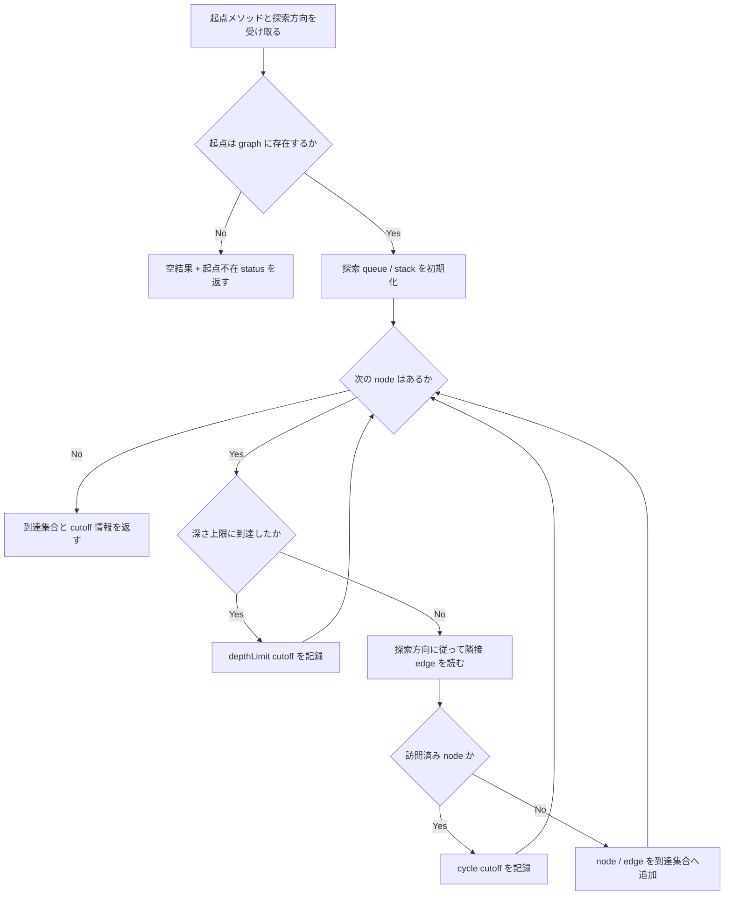
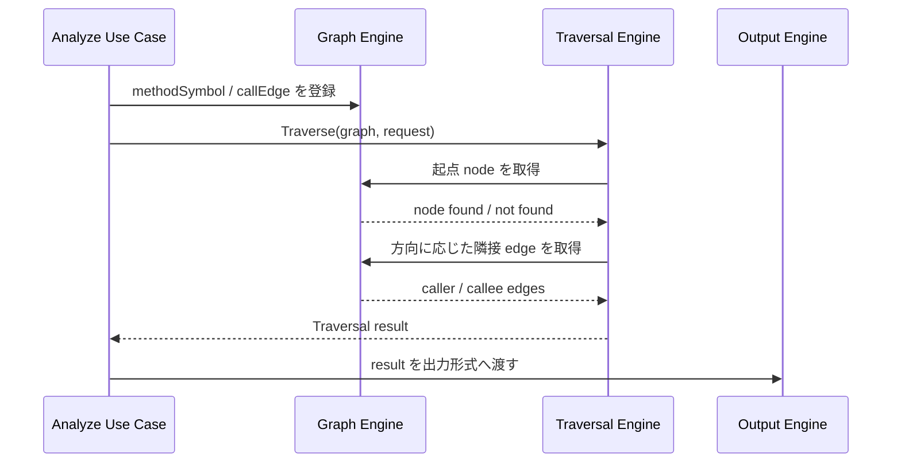

# Traversal (Caller / Callee 探索) spec

> issue #6 の設計 spec。
> Traversal Engine は Graph Engine が保持する `MethodSymbol` / `CallEdge` 相当のグラフを入力に、caller / callee 方向の到達集合を返す。Model schema の正本は Analyzer Protocol / SPI feature doc、Core package 境界の正本は Design Doc / context / ADR-0002 とする。

## メタ情報

- Issue: `#6`
- ステータス: `Draft`
- 作成日: 2026-07-07
- 更新日: 2026-07-07
- Branch: `feature/6`
- Owner: Fukuemon

## 設計フェーズ状況

状態は `未着手 / 進行中 / 完了 / レビュー済 / 保留` のいずれか。保留の場合は理由を備考に残す。

| #   | フェーズ                    | 状態   | 最終更新   | 備考                                                      |
| --- | --------------------------- | ------ | ---------- | --------------------------------------------------------- |
| 1   | 起票                        | 完了   | 2026-06-10 | GitHub issue #6 を確認済み                                |
| 2   | 下書き                      | 進行中 | 2026-07-07 | requirements から本 spec を scaffold                      |
| 3   | 上位文書突合                | 完了   | 2026-07-07 | Design Doc / context / ADR / analyzer-protocol と矛盾なし |
| 4   | 論点整理                    | 進行中 | 2026-07-07 | D1-D5 を初期論点として列挙                                |
| 5   | 論点解決                    | 未着手 |            | `spec-resolve` で D1 から解決する                         |
| 6   | Interface / Routing 設計    | 未着手 |            | Traversal API / Graph 境界を具体化する                    |
| 7   | Content / Data 設計         | 未着手 |            | 探索結果モデル / 打ち切り情報を具体化する                 |
| 8   | Performance / Security 設計 | 未着手 |            | 大規模 graph / read-only 前提を具体化する                 |
| 9   | Test / Metrics 設計         | 未着手 |            | unit / E2E fixture 観点を具体化する                       |
| 10  | 実装分割                    | 未着手 |            | Graph / traversal / test の prompts 分割を決める          |
| 11  | レビュー済                  | 未着手 |            | `spec-review` 後に更新                                    |

## 上位文書整合

正本 ([PRD](../../PRD.md) / [Design Doc](../../design/DesignDoc.md) / [feature doc](../../design/features/) / [context](../../context/) / ADR) のどの節と、どう整合させたかを記録する。

- PRD 更新要否: 不要 (本プロダクトは統合モード。Why / What は Design Doc に統合)
- Design Doc 更新要否: 未定 (Q4 解決後、循環 / 深さ上限の durable な設計だけ反映要否を判定)
- ADR 起票要否: 不要 (現時点では既存の Core package 境界と Protocol 判断の範囲内)

| 上位文書    | 節 / 該当箇所                                                                                                        | 整合方針 (継承 / 補足 / 変更提案) |
| ----------- | -------------------------------------------------------------------------------------------------------------------- | --------------------------------- |
| PRD         | 統合モードのため `design/DesignDoc.md` の Why / What を参照                                                          | 継承                              |
| Design Doc  | 成功条件 S1 / S2、Goal G1 / G2、モジュール責務 Traversal Engine、Open Question Q4                                    | 継承                              |
| feature doc | `design/features/analyzer-protocol/DesignDoc_analyzer-protocol.md` の `MethodSymbol` / `CallEdge` / `SourceLocation` | 継承                              |
| context     | `context/architecture.md` Package Boundary (`Traversal Engine` -> `Graph Engine` -> `Model`)                         | 継承                              |
| context     | `context/testing.md` E2E 照合、探索打ち切り (Q4) の unit test                                                        | 継承                              |
| context     | `context/toolchain.md` Go 標準 library / Go 標準 `testing`                                                           | 継承                              |
| context     | `context/engineering.md` Repository Quality Gate / 依存境界 gate                                                     | 継承                              |
| ADR         | `adr/0001-analyzer-protocol-jsonl-spi.md`                                                                            | 継承                              |
| ADR         | `adr/0002-core-implementation-foundation.md`                                                                         | 継承                              |

> 現時点で上位文書との矛盾は検出していない。本 spec は Design Doc の Q4 を issue #6 の作業正本として解く。

## 関連資料

- `design/DesignDoc.md`: S1 / S2、G1 / G2、Traversal Engine、Graph Engine、Q4
- `design/features/analyzer-protocol/DesignDoc_analyzer-protocol.md`: `MethodSymbol` / `CallEdge` / `SourceLocation` の正本
- `context/architecture.md`: Traversal Engine の package boundary と依存方向
- `context/testing.md`: Traversal unit test、S1 / S2 E2E 照合
- `context/toolchain.md`: Go 標準 library / `testing` 方針
- `adr/0001-analyzer-protocol-jsonl-spi.md`: Analyzer Protocol / Model 境界の判断
- `adr/0002-core-implementation-foundation.md`: Go Core package 境界
- `specs/6-traversal/requirements.md`: issue #6 の要求定義 draft
- `specs/12-analyzer-protocol-implementation/`: Protocol DTO / parser / contract fixture / analyzer runner 実装記録
- 関連 issue / ticket: [#6](https://github.com/Fukuemon/depwalk/issues/6), [#7](https://github.com/Fukuemon/depwalk/issues/7), [#9](https://github.com/Fukuemon/depwalk/issues/9), [#12](https://github.com/Fukuemon/depwalk/issues/12)

## 背景

depwalk の Phase1 は、指定メソッドの caller / callee を探索し、既知の呼び出し関係集合と一致する結果を返すことを成功条件にしている。Analyzer Protocol / SPI は #12 で Go Core 側に実装済みであり、Core は Analyzer から `methodSymbol` / `callEdge` を受け取れる境界を持った。

次に必要なのは、Graph Engine が構築した呼び出しグラフを入力として、Traversal Engine が caller / callee 方向へ到達集合を計算する設計である。本 spec は Design Doc の Open Question Q4「循環呼び出し・再帰の探索打ち切り条件」を解き、探索 API、探索結果モデル、テスト観点、実装分割を確定する。

## スコープ

### やること

- caller 方向の再帰探索を設計する。
- callee 方向の探索を設計する。
- 探索方向、起点メソッド、深さ上限、探索順序を受け取る Traversal API を設計する。
- 循環呼び出し / 再帰 / 深さ上限到達を検出し、探索結果へ観測可能に含める方針を決める。
- Graph Engine との入力境界を設計する。
- Traversal unit test と S1 / S2 E2E 照合の責務を分ける。
- 実装 prompt へ分割できる粒度まで package / test / fixture 境界を整理する。

### やらないこと

- Java ソースの解析、型解決、DI 解決は行わない。これは `java-analyzer` の責務である。
- Analyzer Protocol / SPI / Model schema は再定義しない。正本は analyzer-protocol feature doc と ADR-0001 である。
- Output Engine の Console / JSON / DOT / Mermaid 表現は決めない。Traversal は出力に必要な構造と打ち切り情報を渡せる形にする。
- CLI `depwalk analyze` の引数、exit code、エラー表示は決めない。CLI interface spec の対象とする。
- 永続ストア、キャッシュ、並列探索、分散処理は扱わない。

## 要件の解釈

### 実現したいユーザー価値

開発者は、改修対象メソッドを起点に「どこから呼ばれているか」と「何を呼んでいるか」を再帰的に確認できる。CI は同じ探索を自動実行し、既知の caller / callee 集合とのずれを検出できる。

### 成功条件

- 指定した起点メソッドから caller 方向の到達集合を列挙できる。
- 指定した起点メソッドから callee 方向の到達集合を列挙できる。
- 循環呼び出し / 再帰を検出して無限ループしない。
- 深さ上限に到達したノードを探索結果で区別できる。
- 起点メソッドがグラフに存在しない場合、panic ではなく「該当なし」を表す結果を返せる。
- `cd core && go test ./...` で Traversal unit test を実行できる。
- E2E fixture では S1 / S2 の既知集合と CLI 出力の一致を検証できる。

### 対象ユーザー / 操作主体

- Core 開発者
- depwalk CLI を local / CI で利用する開発者
- Output Engine / CLI interface の後続実装者

EARS 風で振る舞いを記述する。

- WHEN Core が caller 探索を実行する時、システムは起点メソッドへ到達する呼び出し元を探索方向に従って列挙する。
- WHEN Core が callee 探索を実行する時、システムは起点メソッドから到達する呼び出し先を探索方向に従って列挙する。
- IF グラフに循環または再帰が含まれる時、システムは訪問済みノードを管理し、無限ループせず循環を結果に標識する。
- IF 深さ上限に到達した時、システムはそれ以降の探索を打ち切り、打ち切り理由を結果に保持する。
- IF 起点メソッドがグラフに存在しない時、システムは空の探索結果と起点不在の状態を返す。
- THE SYSTEM SHALL keep Traversal Engine independent from Analyzer implementation language and Output format.

## 設計時の論点

設計 / 実装フェーズへ持ち越す残課題を 1 件ずつ管理する。確定したものは「解決済みの論点」へ移す。

| #   | 論点                                     | 決定候補                                                                                                                         | 決定 |
| --- | ---------------------------------------- | -------------------------------------------------------------------------------------------------------------------------------- | ---- |
| D1  | 探索順序を BFS / DFS のどちらにするか    | A: BFS を既定にする / B: DFS を既定にする / C: API で選択可能にし既定を固定する                                                  | 未決 |
| D2  | Q4: 循環呼び出し・再帰の探索打ち切り条件 | A: 訪問済み node で再訪を抑止し循環を標識 / B: path 単位で循環を検出し同一 node の別 path 再訪を許す / C: 深さ上限のみで制御する | 未決 |
| D3  | 深さ上限の扱い                           | A: 未指定は無制限 / B: 未指定時に安全な既定値を置く / C: CLI interface で必須にする                                              | 未決 |
| D4  | 探索結果モデルの形                       | A: 到達 node 集合 + edge 集合 / B: 起点からの traversal tree / C: graph view と tree view の両方を保持                           | 未決 |
| D5  | 起点メソッド不在の扱い                   | A: 空結果 + status で返す / B: validation error として返す / C: Output Engine でのみ表現する                                     | 未決 |

## 解決済みの論点

- #8 / #12: Traversal が参照する `MethodSymbol` / `CallEdge` / `SourceLocation` の schema と Go 側 Protocol 実装は確定済み。正本は analyzer-protocol feature doc、ADR-0001、#12 実装である。
- #11: Core 実装基盤と package 境界は確定済み。Traversal 実装は `core/internal/traversal`、Graph 実装は `core/internal/graph` に置く。

## 未確定事項

| 未確定事項 | 候補 / 確認方法                                                                    | 決定者   | 期限               | 下流への影響                                                    |
| ---------- | ---------------------------------------------------------------------------------- | -------- | ------------------ | --------------------------------------------------------------- |
| D1-D5      | `spec-resolve` で 1 件ずつ解決し、Traversal API / 結果モデル / test 観点へ反映する | Fukuemon | 実装 prompt 生成前 | Graph / traversal / output / CLI interface の実装分割に影響する |

## 実装対象

正規 target は `context/project.md` の対象ドメイン一覧を正本とする。

| モジュール          | 実装有無 | 主な責務                                                    |
| ------------------- | :------: | ----------------------------------------------------------- |
| `core`              |    ◯     | Graph / Traversal package 境界、use case からの呼び出し口   |
| `traversal`         |    ◯     | caller / callee 探索、循環 / 深さ上限の扱い、探索結果モデル |
| `output`            |    -     | #6 では Traversal 結果の consumer として参照のみ            |
| `analyzer-protocol` |    -     | `MethodSymbol` / `CallEdge` schema の正本として参照のみ     |
| `java-analyzer`     |    -     | #6 では graph 入力を生成する上流として参照のみ              |

## 機能仕様

### User Flow

1. Core は Analyzer から受け取った `methodSymbol` / `callEdge` を Graph Engine に渡す。
2. Graph Engine は node / edge を保持し、Traversal Engine が参照できる graph view を提供する。
3. 呼び出し側は起点メソッド、探索方向、深さ上限、探索順序を指定して Traversal Engine を呼び出す。
4. Traversal Engine は caller または callee 方向に graph を辿り、到達 node / edge と打ち切り情報を返す。
5. Output Engine は Traversal 結果を受け取り、Console / JSON / DOT / Mermaid の各形式へ変換する。

### Reuse Policy

- Traversal Engine は `core/internal/traversal` に閉じる。
- Graph の node / edge 管理は `core/internal/graph` に閉じ、Traversal は graph が公開する読み取り API 経由で探索する。
- Analyzer 固有情報や Java 固有 metadata を Traversal の分岐条件にしない。
- Output format 固有の tree 表現は Traversal に持ち込まない。ただし循環 / 深さ上限 / 起点不在など、出力に必要な状態は Traversal 結果として保持する。

### Performance

- 探索は graph 全体の再構築を伴わず、Graph Engine が保持する adjacency を読む。
- 訪問済み管理により循環で無限ループしない。
- 大規模 graph の runtime budget は実装後の fixture 計測で候補値を出し、CLI interface または performance spec で確定する。

### Routing / URL State

- 非該当。depwalk は CLI ツールであり、Web routing / URL state を持たない。

### Content / Assets

- 永続コンテンツや静的 asset は扱わない。
- E2E fixture は `testdata/fixtures/` に置く。具体的なサンプル Java/Spring repo は Java Analyzer / CLI interface の spec と同期して決める。

### UI Reuse

- 非該当。IDE Plugin / Web UI は Non Goals。

### Testing

- Traversal unit test は `core/internal/traversal` に置く。
- Graph fixture / builder は `core/internal/graph` の公開 API を通じて組み立てる。
- 循環、再帰、深さ上限、起点不在、caller / callee 方向を unit test で検証する。
- S1 / S2 の既知集合との一致は `testdata/fixtures/` の E2E で検証する。

## Interface 設計

### UI / API / Event Interface

- UI: 非該当。
- Web API endpoint: 非該当。
- Go package interface: `core/internal/traversal` は graph view、起点、探索方向、探索 option を受け取り、探索結果を返す。
- Event interface: 非該当。Traversal はプロセス内同期処理として扱う。

### Props / Request / Response

初期設計では次の概念を扱う。具体的な Go 型名は D1-D5 解決後に確定する。

| 概念              | 主な field / 値                                                | 備考                      |
| ----------------- | -------------------------------------------------------------- | ------------------------- |
| Traversal request | 起点 method ID、方向 (`caller` / `callee`)、深さ上限、探索順序 | CLI 引数名は後続で決める  |
| Traversal result  | 到達 node、到達 edge、起点状態、打ち切り情報                   | Output Engine が consumer |
| Cutoff            | 理由 (`cycle` / `depthLimit`)、対象 node / edge、depth         | Q4 の決定に従う           |

## Content / Data 設計

### 保存・管理するデータ

- 永続データは持たない。
- Graph は Core process 内の一時データとして扱う。
- Traversal 結果も Core process 内の一時データとして扱い、Output Engine へ渡した後は破棄できる。

### コンテンツ配置 / package / route

| path                      | 用途                                                 |
| ------------------------- | ---------------------------------------------------- |
| `core/internal/graph`     | node / edge 管理、Traversal が読む graph view        |
| `core/internal/traversal` | caller / callee 探索、探索 option、探索結果          |
| `core/internal/output`    | Traversal 結果の出力先。#6 では参照のみ              |
| `testdata/fixtures`       | S1 / S2 E2E fixture。具体 fixture は後続 spec と同期 |

## Performance / Security 設計

### Performance

- Traversal は node 数 `V`、edge 数 `E` に対して `O(V + E)` の探索を基本方針にする。
- 深さ上限がある場合は、上限到達以降の隣接 node を展開しない。
- 探索結果が大きい場合の出力抑制や pagination は #6 の対象外とし、CLI / Output の後続論点に残す。

### Security / Privacy

- 解析対象ソースは read-only とし、Traversal はファイルシステムを書き換えない。
- Traversal は外部送信を行わない。
- Analyzer metadata に含まれる言語固有情報は、Traversal の権限判断や外部 I/O に使わない。

## Error / Fallback 設計

### エラーケース

| #   | ケース                            | ユーザーへの見せ方                 | リカバリ                                      |
| --- | --------------------------------- | ---------------------------------- | --------------------------------------------- |
| 1   | 起点メソッドが graph に存在しない | 「該当なし」を表現できる結果を返す | CLI / Output が候補表示を行うかは後続で決める |
| 2   | 探索方向が未対応値                | 実行前 validation error            | caller / callee のいずれかを指定する          |
| 3   | 深さ上限が不正値                  | 実行前 validation error            | 0 以上の整数を指定する                        |
| 4   | 循環呼び出し / 再帰               | 探索結果に循環を標識する           | 訪問済み管理で再訪を抑止する                  |

### Fallback

- Graph が空の場合、Traversal は空結果を返す。
- 深さ上限に到達した場合、Traversal は部分結果と cutoff 情報を返す。

## テスト / 評価方針

### テスト観点

- caller 方向で既知の呼び出し元集合を返せること。
- callee 方向で既知の呼び出し先集合を返せること。
- 循環 graph で無限ループしないこと。
- 再帰 edge を含む graph で循環を標識できること。
- 深さ上限に到達した node を cutoff として保持できること。
- 起点メソッドが存在しない場合に panic しないこと。
- Traversal が Analyzer 実装や Output format に依存しないこと。

### 計測指標

- Traversal unit test の pass / fail。
- S1 / S2 E2E fixture の expected caller / callee 集合との差分。
- 大規模 fixture での探索時間と peak memory。固定 budget は後続で決める。

## フロー / シーケンス

(`spec-diagrams` で生成。spec の主要操作を Mermaid 図に落とす)

### Flowchart (ユーザー操作起点)

### Sequence

## 実装分割

### 実装タスク案

| Phase | 対象                                      | 概要                                                           | 依存  |
| ----- | ----------------------------------------- | -------------------------------------------------------------- | ----- |
| P1    | `core/internal/graph`                     | Traversal が読む node / edge graph view と test builder を実装 | #12   |
| P2    | `core/internal/traversal`                 | caller / callee 探索、方向、深さ上限、起点不在を実装           | P1    |
| P3    | `core/internal/traversal`                 | 循環 / 再帰 cutoff と traversal result を実装                  | P2    |
| P4    | `testdata/fixtures` / `core/internal/...` | S1 / S2 fixture と E2E 照合の土台を追加                        | P1-P3 |

### prompts 生成方針

- `graph` と `traversal` を分ける。Traversal API が Graph Engine の内部構造へ直接依存しないようにするため。
- D1-D5 解決後に prompts を生成する。未確定のまま実装 prompt へ進まない。
- Output Engine の実装 prompt は #7 で生成する。

## 上位資料からの変更点

本 spec で PRD / Design Doc / feature doc / context / 既存 ADR から変更・追加した内容を、反映先別に記録する。`spec-track` / `spec-sync` で更新する。

### PRD への影響

| 対象節 | 変更内容 | 理由                                                            |
| ------ | -------- | --------------------------------------------------------------- |
| -      | なし     | 本プロダクトは統合モードで、Why / What は Design Doc に統合済み |

### Design Doc への影響

| 対象節            | 変更内容                  | 理由                                |
| ----------------- | ------------------------- | ----------------------------------- |
| Open Questions Q4 | D2 解決後に反映要否を判定 | Q4 は issue #6 が正本として解くため |

### feature doc への影響

| 対象 doc / 節                                      | 変更内容                                   | 理由                                            |
| -------------------------------------------------- | ------------------------------------------ | ----------------------------------------------- |
| `design/features/traversal/DesignDoc_traversal.md` | 未作成。spec 解決後に作成 / 同期要否を判定 | durable な Traversal 設計の置き場が未作成のため |

### context への影響

| 対象 doc / 節 | 変更内容 | 理由                                                   |
| ------------- | -------- | ------------------------------------------------------ |
| -             | なし     | 現時点では既存 package / test / toolchain 境界の範囲内 |

### ADR の新規 / 更新

| ADR ID | 変更内容 | 理由                                 |
| ------ | -------- | ------------------------------------ |
| -      | なし     | 技術選定や横断アーキ判断の変更はない |

## レビュー

`spec-review` (fresh-context evaluator) の最新結果。完全な記録は `review.md` を参照。

| 日付 | 結果 (PASS / NEEDS_WORK) | 指摘要点 | 対応               |
| ---- | ------------------------ | -------- | ------------------ |
| -    | -                        | 未実施   | D1-D5 解決後に実施 |

## 変更履歴

| 日付       | 変更者 | 変更内容                          |
| ---------- | ------ | --------------------------------- |
| 2026-07-07 | Codex  | requirements から初期 spec を作成 |

## 備考

- 追加 appendix は現時点では不要。API endpoint、永続データ層、認可、画面、E2E UI を持たないため。
