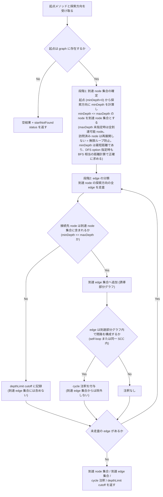
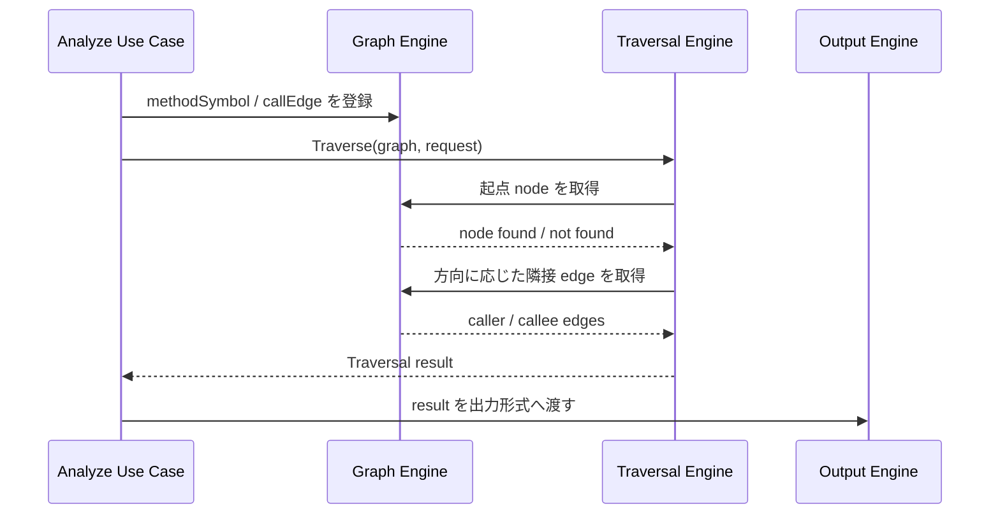

# Traversal (Caller / Callee 探索) spec

> issue #6 の設計 spec。
> Traversal Engine は Graph Engine が保持する `MethodSymbol` / `CallEdge` 相当のグラフを入力に、caller / callee 方向の到達集合を返す。Model schema の正本は Analyzer Protocol / SPI feature doc、Core package 境界の正本は Design Doc / context / ADR-0002 とする。Traversal result の契約 (到達集合・cycle 注釈・depthLimit cutoff の意味論) の正本は [Traversal feature doc](../../design/features/traversal/DesignDoc_traversal.md) (`spec-sync` 済)。

## メタ情報

- Issue: `#6`
- ステータス: `Done` (phase 11 完了、`spec-sync` 完了、prompts 生成済み。実装フェーズへ進める)
- 作成日: 2026-07-07
- 更新日: 2026-07-10
- Branch: `feature/6`
- Owner: Fukuemon

## 設計フェーズ状況

状態は `未着手 / 進行中 / 完了 / レビュー済 / 保留` のいずれか。保留の場合は理由を備考に残す。

| #   | フェーズ                    | 状態 | 最終更新   | 備考                                                                                                           |
| --- | --------------------------- | ---- | ---------- | -------------------------------------------------------------------------------------------------------------- |
| 1   | 起票                        | 完了 | 2026-06-10 | GitHub issue #6 を確認済み                                                                                     |
| 2   | 下書き                      | 完了 | 2026-07-07 | requirements から本 spec を scaffold                                                                           |
| 3   | 上位文書突合                | 完了 | 2026-07-08 | Design Doc / context / ADR / analyzer-protocol と矛盾なし。Q4 と S1/S2 測定方法の分界は `spec-sync` で反映済み |
| 4   | 論点整理                    | 完了 | 2026-07-07 | D1-D5 を初期論点として列挙                                                                                     |
| 5   | 論点解決                    | 完了 | 2026-07-08 | D1-D6 を解決済み (D6 は spec-review 4 回目の指摘を受けて追加)                                                  |
| 6   | Interface / Routing 設計    | 完了 | 2026-07-07 | Traversal request / result の主要 option を決定                                                                |
| 7   | Content / Data 設計         | 完了 | 2026-07-07 | 探索結果モデルは到達 node 集合 + edge 集合として確定                                                           |
| 8   | Performance / Security 設計 | 完了 | 2026-07-08 | 深さ上限未指定時は無制限。大規模 graph budget は後続計測                                                       |
| 9   | Test / Metrics 設計         | 完了 | 2026-07-08 | unit / E2E fixture 観点を具体化済み                                                                            |
| 10  | 実装分割                    | 完了 | 2026-07-08 | prompts 4 件を生成済み (P1-P4 直列依存)。prompts phase レビュー 2 ラウンドの指摘対応済み                       |
| 11  | レビュー済                  | 完了 | 2026-07-08 | spec-review 6 回目で 3/3 全会一致 PASS (`spec-sync` / prompts 生成 / 実装 P1-P4 も完了済み)                    |

## 上位文書整合

正本 (PRD ※本プロダクトは統合モードのため未作成、Why/What は [Design Doc](../../design/DesignDoc.md) に統合 / [Design Doc](../../design/DesignDoc.md) / [feature doc](../../design/features/) / [context](../../context/) / ADR) のどの節と、どう整合させたかを記録する。

- PRD 更新要否: 不要 (本プロダクトは統合モード。Why / What は Design Doc に統合)
- Design Doc 更新要否: 反映済み (2026-07-08 `spec-sync` で Q4 の解決内容と S1/S2 測定方法の補足を反映済み)
- ADR 起票要否: 不要 (現時点では既存の Core package 境界と Protocol 判断の範囲内)

| 上位文書    | 節 / 該当箇所                                                                                                        | 整合方針 (継承 / 補足 / 変更提案) |
| ----------- | -------------------------------------------------------------------------------------------------------------------- | --------------------------------- |
| PRD         | 統合モードのため `design/DesignDoc.md` の Why / What を参照                                                          | 継承                              |
| Design Doc  | 成功条件 S1 / S2、Goal G1 / G2、モジュール責務 Traversal Engine、Open Question Q4                                    | 補足 (下記注記)                   |
| feature doc | `design/features/analyzer-protocol/DesignDoc_analyzer-protocol.md` の `MethodSymbol` / `CallEdge` / `SourceLocation` | 継承                              |
| feature doc | `design/features/traversal/DesignDoc_traversal.md` (D1-D6 の durable 設計判断の正本。`spec-sync` で新規作成)         | 反映済み                          |
| context     | `context/architecture.md` Package Boundary (`Traversal Engine` -> `Graph Engine` -> `Model`)                         | 継承                              |
| context     | `context/testing.md` E2E 照合、探索打ち切り (Q4) の unit test                                                        | 補足 (下記注記)                   |
| context     | `context/toolchain.md` Go 標準 library / Go 標準 `testing`                                                           | 継承                              |
| context     | `context/engineering.md` Repository Quality Gate / 依存境界 gate                                                     | 継承                              |
| ADR         | `adr/0001-analyzer-protocol-jsonl-spi.md`                                                                            | 継承                              |
| ADR         | `adr/0002-core-implementation-foundation.md`                                                                         | 継承                              |

> Design Doc (`design/DesignDoc.md:41-42`) と `context/testing.md:16,20` は S1 / S2 の測定方法を「既知の caller / callee 集合と CLI 出力の一致」と定義する。本 spec の実装対象は Traversal Engine のみ (CLI 引数 / exit code / エラー表示は対象外、`## スコープ > やらないこと`) のため、#6 の成功条件 (`## 要件の解釈 > 成功条件`) は Traversal Engine が返す到達 node / edge 集合の一致に限定して検証する。S1 / S2 を CLI 出力レベルで満たす最終的な E2E 照合は、CLI interface spec の実装後に本 spec の Traversal 層 E2E と組み合わせて完成する。この分界の補足は 2026-07-08 `spec-sync` で Design Doc / `context/testing.md` 側へ反映済み (測定方法定義そのものは変更していない)。
> Q4 (循環 / 深さ上限の打ち切り条件) は本 spec の D2 / D3 / D6 で解き、2026-07-08 `spec-sync` で `design/DesignDoc.md` の Open Questions Q4 を「解決済み」へ更新済み (正本は [Traversal feature doc](../../design/features/traversal/DesignDoc_traversal.md))。上位文書との矛盾は検出していない。

## 関連資料

- `design/DesignDoc.md`: S1 / S2、G1 / G2、Traversal Engine、Graph Engine、Q4
- `design/features/analyzer-protocol/DesignDoc_analyzer-protocol.md`: `MethodSymbol` / `CallEdge` / `SourceLocation` の正本
- `context/architecture.md`: Traversal Engine の package boundary と依存方向
- `context/testing.md`: Traversal unit test、S1 / S2 E2E 照合
- `context/toolchain.md`: Go 標準 library / `testing` 方針
- `adr/0001-analyzer-protocol-jsonl-spi.md`: Analyzer Protocol / Model 境界の判断
- `adr/0002-core-implementation-foundation.md`: Go Core package 境界
- `specs/6-traversal/requirements.md`: issue #6 の要求定義 draft
- `specs/12-analyzer-protocol-implementation/`: Protocol DTO / parser / contract fixture / analyzer runner 実装記録
- 関連 issue / ticket: [#6](https://github.com/Fukuemon/depwalk/issues/6), [#7](https://github.com/Fukuemon/depwalk/issues/7), [#9](https://github.com/Fukuemon/depwalk/issues/9), [#12](https://github.com/Fukuemon/depwalk/issues/12)

## 背景

depwalk の Phase1 は、指定メソッドの caller / callee を探索し、既知の呼び出し関係集合と一致する結果を返すことを成功条件にしている。Analyzer Protocol / SPI は #12 で Go Core 側に実装済みであり、Core は Analyzer から `methodSymbol` / `callEdge` を受け取れる境界を持った。

次に必要なのは、Graph Engine が構築した呼び出しグラフを入力として、Traversal Engine が caller / callee 方向へ到達集合を計算する設計である。本 spec は Design Doc の Open Question Q4「循環呼び出し・再帰の探索打ち切り条件」を解き、探索 API、探索結果モデル、テスト観点、実装分割を確定する。

## スコープ

### やること

- caller 方向の再帰探索を設計する。
- callee 方向の探索を設計する。
- 探索方向、起点メソッド、深さ上限、探索順序を受け取る Traversal API を設計する。
- 循環呼び出し / 再帰 / 深さ上限到達を検出し、探索結果へ観測可能に含める方針を決める。
- Graph Engine との入力境界を設計する。
- Traversal unit test と S1 / S2 E2E 照合の責務を分ける。
- 実装 prompt へ分割できる粒度まで package / test / fixture 境界を整理する。

### やらないこと

- Java ソースの解析、型解決、DI 解決は行わない。これは `java-analyzer` の責務である。
- Analyzer Protocol / SPI / Model schema は再定義しない。正本は analyzer-protocol feature doc と ADR-0001 である。
- Output Engine の Console / JSON / DOT / Mermaid 表現は決めない。Traversal は出力に必要な構造と打ち切り情報を渡せる形にする。
- CLI `depwalk analyze` の引数、exit code、エラー表示は決めない。CLI interface spec の対象とする。
- 永続ストア、キャッシュ、並列探索、分散処理は扱わない。

## 要件の解釈

### 実現したいユーザー価値

開発者は、改修対象メソッドを起点に「どこから呼ばれているか」と「何を呼んでいるか」を再帰的に確認できる。CI は同じ探索を自動実行し、既知の caller / callee 集合とのずれを検出できる。

### 成功条件

- 指定した起点メソッドから caller 方向の到達集合を列挙できる。
- 指定した起点メソッドから callee 方向の到達集合を列挙できる。
- 循環呼び出し / 再帰を検出して無限ループしない。
- 深さ上限に到達したノードを探索結果で区別できる。
- 起点メソッドがグラフに存在しない場合、panic ではなく「該当なし」を表す結果を返せる。
- `cd core && go test ./...` で Traversal unit test を実行できる。
- E2E fixture では S1 / S2 の既知 caller / callee 集合と、Traversal Engine が返す到達 node / edge 集合の一致を検証できる。CLI 出力を経由した E2E 照合は CLI interface spec の対象とする。

### 対象ユーザー / 操作主体

- Core 開発者
- depwalk CLI を local / CI で利用する開発者
- Output Engine / CLI interface の後続実装者

EARS 風で振る舞いを記述する。

- WHEN Core が caller 探索を実行する時、システムは起点メソッドへ到達する呼び出し元を探索方向に従って列挙する。
- WHEN Core が callee 探索を実行する時、システムは起点メソッドから到達する呼び出し先を探索方向に従って列挙する。
- IF グラフに循環または再帰が含まれる時、システムは訪問済みノードを管理し、無限ループせず循環を結果に標識する。
- IF 深さ上限に到達した時、システムはそれ以降の探索を打ち切り、打ち切り理由を結果に保持する。
- IF 起点メソッドがグラフに存在しない時、システムは空の探索結果と起点不在の状態を返す。
- THE SYSTEM SHALL keep Traversal Engine independent from Analyzer implementation language and Output format.

## 設計時の論点

設計 / 実装フェーズへ持ち越す残課題を 1 件ずつ管理する。確定したものは「解決済みの論点」へ移す。

| #   | 論点                                                                                                                                                                     | 決定候補                                                                                                                                                                                             | 決定                                                                                        |
| --- | ------------------------------------------------------------------------------------------------------------------------------------------------------------------------ | ---------------------------------------------------------------------------------------------------------------------------------------------------------------------------------------------------- | ------------------------------------------------------------------------------------------- |
| D1  | 探索順序を BFS / DFS のどちらにするか                                                                                                                                    | A: BFS を既定にする / B: DFS を既定にする / C: API で選択可能にし既定を固定する                                                                                                                      | C: API で選択可能にし、既定は BFS とする                                                    |
| D2  | Q4: 循環呼び出し・再帰の探索打ち切り条件                                                                                                                                 | A: 訪問済み node で再訪を抑止し循環を標識 / B: path 単位で循環を検出し同一 node の別 path 再訪を許す / C: 深さ上限のみで制御する                                                                     | A: 訪問済み node で再訪を抑止して無限ループを防ぐ (循環の標識方法は D6 で SCC 注釈へ精密化) |
| D3  | 深さ上限の扱い                                                                                                                                                           | A: 未指定は無制限 / B: 未指定時に安全な既定値を置く / C: CLI interface で必須にする                                                                                                                  | A: 未指定は無制限とし、指定された場合だけ depth limit cutoff を記録する                     |
| D4  | 探索結果モデルの形                                                                                                                                                       | A: 到達 node 集合 + edge 集合 / B: 起点からの traversal tree / C: graph view と tree view の両方を保持                                                                                               | A: 到達 node 集合 + edge 集合を基本結果とし、tree 表現は Output 側で必要に応じて構築する    |
| D5  | 起点メソッド不在の扱い                                                                                                                                                   | A: 空結果 + status で返す / B: validation error として返す / C: Output Engine でのみ表現する                                                                                                         | A: 空結果 + `startNotFound` status で返す                                                   |
| D6  | 合流 (複数経路で同一 node へ到達) と循環の区別。探索木 edge 方式では BFS/DFS の選択で到達 edge 集合と cutoff の帰属が変わり、D4 の「順序に依存しない集合」契約と矛盾する | A: 現在の探索パス上の祖先への edge のみを循環と判定 (DFS でのみ正確) / B: 到達 edge 集合を誘導部分グラフとして定義し、循環は SCC で判定 (順序非依存) / C: DFS option を廃止し BFS 固定で決定性を確保 | B: 到達集合を minDepth と誘導部分グラフで定義し、`cycle` は SCC 判定の注釈にする            |

## 解決済みの論点

- #8 / #12: Traversal が参照する `MethodSymbol` / `CallEdge` / `SourceLocation` の schema と Go 側 Protocol 実装は確定済み。正本は analyzer-protocol feature doc、ADR-0001、#12 実装である。
- #11: Core 実装基盤と package 境界は確定済み。Traversal 実装は `core/internal/traversal`、Graph 実装は `core/internal/graph` に置く。
- #6 D1: 探索順序は Traversal API の option として選択可能にし、未指定時の既定は BFS とする。影響範囲調査では起点から近い caller / callee を先に確認できることが重要で、深さ上限とも整合しやすいため。DFS は debug や tree 表現の都合で必要になった場合に選択できる余地を残す。
- #6 D2: 循環呼び出し / 再帰は、訪問済み node への再訪を抑止して無限ループを防ぐ。#6 の目的は全経路列挙ではなく caller / callee の到達集合を安定して列挙することであり、同一 node の別 path 再展開を許すと結果量と test matrix が膨らむため。深さ上限だけで制御する案は循環を観測可能にできないため採用しない。(補記: 当初は「再訪 edge を `cycle` cutoff として記録する」としていたが、D6 で再訪抑止は内部の停止機構に格下げし、循環の観測可能な標識は SCC 判定の注釈へ精密化した。無限ループ防止という D2 の判断自体は変わらない)
- #6 D3: 深さ上限は任意 option とし、未指定時は無制限に探索する。D2 で訪問済み node の再展開を抑止するため、循環による無限ループは深さ上限なしでも防げる。Phase1 の成功条件は caller / callee 到達集合の網羅列挙であり、既定値で探索を切ると取りこぼしが発生するため、必要な利用者だけ明示的に上限を指定する。
- #6 D4: 探索結果モデルは到達 node 集合 + edge 集合を基本とする。Traversal は全経路列挙や Output 固有 tree 表現を責務にしないため、起点からの traversal tree は保持しない。Console などで tree 表現が必要な場合は、#7 Output 側で Traversal 結果を入力に変換する。
- #6 D5: 起点メソッドが graph に存在しない場合は、validation error ではなく空結果 + `startNotFound` status を返す。起点不在は解析処理の破綻ではなく「該当なし」を表す正常な探索結果として扱えるため。Output Engine は status を参照して利用者向けに表示する。
- #6 D6: 到達集合を探索木 (どの edge を辿って到達したか) ではなく、グラフの数学的性質として定義する。到達 node 集合は「起点からの最短距離 minDepth <= maxDepth の node」(未指定時は全到達可能 node)、到達 edge 集合は「両端が到達 node 集合に属する探索方向の edge (誘導部分グラフ)」、`cycle` は「到達部分グラフ内で閉路を構成する edge (自己再帰 self-loop、または同一強連結成分 SCC 内の edge)」の注釈とする。理由: 呼び出しグラフでは複数箇所から同一メソッドへ到達する合流 (ダイヤモンド型) が一般的であり、探索木 edge 方式では BFS/DFS の選択によってどの edge が「木の edge」になり どの edge が cutoff になるかが変わってしまい、D4 の「順序に依存しない集合」契約が破れる。さらに合流 edge を `cycle` と誤標識する意味論的誤りも生む。誘導部分グラフ定義なら結果は探索順序に依存せず決定的で、合流 edge は呼び出し関係として保持され、循環標識は SCC により厳密になる。案 A (現在パス上の祖先判定) は DFS でのみ正確で BFS では祖先概念が定義できず、案 C (BFS 固定) は D1 を覆すため採用しない。minDepth / 誘導 edge / SCC の計算はいずれも `O(V + E)` で D4 の性能方針と整合する。訪問済み node 管理は無限ループ防止の内部機構であり、結果契約には現れない。

## 未確定事項

| 未確定事項 | 候補 / 確認方法 | 決定者 | 期限 | 下流への影響                                 |
| ---------- | --------------- | ------ | ---- | -------------------------------------------- |
| なし       | -               | -      | -    | D1-D6 は解決済み。実装分割と review へ進める |

## 実装対象

正規 target は `context/project.md` の対象ドメイン一覧を正本とする。

| モジュール          | 実装有無 | 主な責務                                                    |
| ------------------- | :------: | ----------------------------------------------------------- |
| `core`              |    ◯     | Graph / Traversal package 境界、use case からの呼び出し口   |
| `traversal`         |    ◯     | caller / callee 探索、循環 / 深さ上限の扱い、探索結果モデル |
| `output`            |    -     | #6 では Traversal 結果の consumer として参照のみ            |
| `analyzer-protocol` |    -     | `MethodSymbol` / `CallEdge` schema の正本として参照のみ     |
| `java-analyzer`     |    -     | #6 では graph 入力を生成する上流として参照のみ              |

## 機能仕様

### User Flow

1. Core は Analyzer から受け取った `methodSymbol` / `callEdge` を Graph Engine に渡す。
2. Graph Engine は node / edge を保持し、Traversal Engine が参照できる graph view を提供する。
3. 呼び出し側は起点メソッド、探索方向、深さ上限、探索順序を指定して Traversal Engine を呼び出す。探索順序を未指定にした場合、Traversal Engine は BFS として扱う。深さ上限を未指定にした場合、Traversal Engine は到達可能な node を無制限に探索する。
4. 起点メソッドが graph に存在しない場合、Traversal Engine は空の到達集合と `startNotFound` status を返す。
5. Traversal Engine は caller または callee 方向に graph を辿り、到達 node 集合 (minDepth <= maxDepth の node)、到達 edge 集合 (到達 node 間の誘導 edge)、`cycle` 注釈 (閉路を構成する edge)、`depthLimit` cutoff を返す。訪問済み node の再展開抑止は無限ループ防止の内部機構であり、結果には現れない。
6. Output Engine は Traversal 結果を受け取り、Console / JSON / DOT / Mermaid の各形式へ変換する。Console tree が必要な場合も、tree 構築は Output 側で行う。

### Reuse Policy

- Traversal Engine は `core/internal/traversal` に閉じる。
- Graph の node / edge 管理は `core/internal/graph` に閉じ、Traversal は graph が公開する読み取り API 経由で探索する。
- Analyzer 固有情報や Java 固有 metadata を Traversal の分岐条件にしない。
- Traversal は全経路列挙を責務にしない。到達 node 集合、到達 edge 集合 (誘導部分グラフ)、`cycle` 注釈、`depthLimit` cutoff を返す。
- 起点メソッド不在は Traversal result の status として返す。Output Engine だけに判断を委ねず、Traversal から意味を渡す。
- Output format 固有の tree 表現は Traversal に持ち込まない。ただし循環 / 深さ上限 / 起点不在など、出力に必要な状態は Traversal 結果として保持する。
- 到達 node 集合 / 到達 edge 集合は順序を保証しない (D4 の「集合」定義そのもの)。到達集合は minDepth と誘導部分グラフというグラフの性質で定義するため (D6)、探索順序 (BFS / DFS) は内部の訪問順序のみを制御し、結果の内容にも順序にも影響しない。

### Performance

- 探索は graph 全体の再構築を伴わず、Graph Engine が保持する adjacency を読む。
- 探索順序は BFS / DFS を option として受け取り、内部の訪問順序 (どの順で node を展開するか) を決定する (未指定時は BFS)。到達集合は minDepth / 誘導部分グラフで定義するため (D6)、結果は探索順序に依存しない。
- 訪問済み node は再展開しない (無限ループ防止の内部機構)。循環の観測可能な標識は、到達部分グラフの SCC 判定による `cycle` 注釈として返す。
- 深さ上限は任意 option として受け取る。未指定時は無制限とし、指定時は minDepth > maxDepth となる node への edge を `depthLimit` cutoff として保持する。
- 大規模 graph の runtime budget は実装後の fixture 計測で候補値を出し、CLI interface または performance spec で確定する。

### Routing / URL State

- 非該当。depwalk は CLI ツールであり、Web routing / URL state を持たない。

### Content / Assets

- 永続コンテンツや静的 asset は扱わない。
- E2E fixture は `testdata/fixtures/` に置く。具体的なサンプル Java/Spring repo は Java Analyzer / CLI interface の spec と同期して決める。

### UI Reuse

- 非該当。IDE Plugin / Web UI は Non Goals。

### Testing

- Traversal unit test は `core/internal/traversal` に置く。
- Graph fixture / builder は `core/internal/graph` の公開 API を通じて組み立てる。
- 探索結果モデルの unit test は、到達 node 集合、到達 edge 集合、`cycle` 注釈、`depthLimit` cutoff が期待どおりに返ることを検証する。tree 表現の生成は #7 Output の test 対象とする。
- 探索順序の unit test は、内部の訪問順序 (どの順で node を展開するか) が未指定時に BFS、明示指定時に BFS / DFS option に従って変わることを検証する。結果契約は順序非依存のため公開契約経由では観測できず、内部の展開順を記録する white-box test (package 内 test) で検証する。到達 node / edge 集合・`cycle` 注釈・`depthLimit` cutoff の内容が BFS / DFS どちらでも同一であること (順序非依存性) を検証する。
- 循環 / 再帰の unit test は、循環 graph で無限ループしないこと、閉路を構成する edge (自己再帰 / 相互再帰) が `cycle` 注釈を持ちつつ到達 edge 集合にも含まれることを検証する。
- 合流 (ダイヤモンド型) graph の unit test は、複数経路で到達する node への edge がすべて到達 edge 集合に含まれ、`cycle` と誤標識されないことを検証する。
- 深さ上限の unit test は、未指定時に到達可能 node を深さで打ち切らないこと、指定時に `minDepth <= maxDepth` の node を到達集合に含め、`minDepth > maxDepth` の node への edge を `depthLimit` cutoff として記録することを検証する (起点の minDepth は 0、`maxDepth=0` の場合は起点のみを含み self-loop 以外の隣接 edge が `depthLimit` cutoff になり起点への self-loop は誘導 edge + `cycle` 注釈として残る境界ケース、深い経路と浅い経路の両方を持つ node が浅い経路の minDepth で到達集合に入る合流ケースを含む)。
- 起点不在の unit test は、空の到達 node / edge 集合と `startNotFound` status が返ることを検証する。
- caller / callee 方向を unit test で検証する。
- S1 / S2 の既知集合との一致は `testdata/fixtures/` の E2E で検証する。既知集合の定義: 到達 node 集合には起点 node 自身を含む。到達 edge 集合は両端が到達 node 集合に属する探索方向の全 edge (誘導部分グラフ) であり、`cycle` 注釈付き edge も含む。`depthLimit` cutoff の edge は含まない。

## Interface 設計

### UI / API / Event Interface

- UI: 非該当。
- Web API endpoint: 非該当。
- Go package interface: `core/internal/traversal` は graph view、起点、探索方向、探索 option を受け取り、探索結果を返す。
- Event interface: 非該当。Traversal はプロセス内同期処理として扱う。

### Props / Request / Response

初期設計では次の概念を扱う。具体的な Go 型名は実装 prompt 生成時に確定する。

| 概念              | 主な field / 値                                                                                                           | 備考                                                                                                                                                            |
| ----------------- | ------------------------------------------------------------------------------------------------------------------------- | --------------------------------------------------------------------------------------------------------------------------------------------------------------- |
| Traversal request | 起点 method ID、方向 (`caller` / `callee`)、深さ上限 (任意、未指定時は無制限)、探索順序 (`bfs` / `dfs`、未指定時は `bfs`) | CLI 引数名は後続で決める                                                                                                                                        |
| Traversal result  | 到達 node 集合、到達 edge 集合、status (`ok` / `startNotFound`)、`cycle` 注釈、`depthLimit` cutoff                        | Output Engine が consumer。tree は保持しない。到達 node / edge 集合は順序を保証しない                                                                           |
| Cycle 注釈        | 対象 edge の集合                                                                                                          | 到達部分グラフ内で閉路を構成する edge (自己再帰 self-loop、または同一 SCC 内の edge)。**到達 edge 集合にも含まれる** (呼び出し関係として実在するため除外しない) |
| DepthLimit cutoff | 対象 edge の集合、接続先 node の minDepth                                                                                 | 到達 node から `minDepth > maxDepth` の node への edge。**到達 edge 集合には含まれない**。対象は edge のみで node 自体は cutoff 対象にしない                    |

> 到達集合の定義 (D6): 結果は探索の副産物 (どの edge を辿ったか) ではなく、グラフの性質として定義する。
>
> - **minDepth**: 起点から探索方向に沿った最短距離。起点自身は 0。合流 node は複数経路のうち最短の距離を採る。
> - **到達 node 集合**: `minDepth <= maxDepth` を満たす node (maxDepth 未指定時は全到達可能 node)。起点を含む。
> - **到達 edge 集合**: 両端が到達 node 集合に属する、探索方向に沿った全 edge (誘導部分グラフ)。合流 edge も `cycle` 注釈付き edge も含む。
> - **`maxDepth=0`**: 起点 node のみを到達集合に含み、起点の隣接 edge は `depthLimit` cutoff になる。ただし起点自身への self-loop は両端が到達 node のため、誘導 edge (+ `cycle` 注釈) として到達 edge 集合に残る (誘導部分グラフ定義からの帰結)。
>
> この定義により、結果は BFS / DFS の選択・訪問順序に一切依存せず決定的になる。DFS option 指定時も、maxDepth 判定は minDepth 基準で行う (実装は問わないが観測結果はこの定義に従う)。

## Content / Data 設計

### 保存・管理するデータ

- 永続データは持たない。
- Graph は Core process 内の一時データとして扱う。
- Traversal 結果は到達 node 集合 + edge 集合 + `cycle` 注釈 + `depthLimit` cutoff として Core process 内で一時的に扱い、Output Engine へ渡した後は破棄できる。
- 起点不在時の Traversal 結果は、空の到達 node 集合、空の到達 edge 集合、`startNotFound` status を持つ。
- Traversal 実行中は訪問済み node set と minDepth を保持する。訪問済み node set は無限ループ防止の内部機構であり、結果には現れない (D6)。
- 深さ上限は request option としてのみ保持し、永続設定や global default は持たない。

### コンテンツ配置 / package / route

| path                      | 用途                                                 |
| ------------------------- | ---------------------------------------------------- |
| `core/internal/graph`     | node / edge 管理、Traversal が読む graph view        |
| `core/internal/traversal` | caller / callee 探索、探索 option、探索結果          |
| `core/internal/output`    | Traversal 結果の出力先。#6 では参照のみ              |
| `testdata/fixtures`       | S1 / S2 E2E fixture。具体 fixture は後続 spec と同期 |

## Performance / Security 設計

### Performance

- Traversal は node 数 `V`、edge 数 `E` に対して `O(V + E)` を基本方針にする。minDepth 計算 (BFS 相当)、誘導 edge 集合の収集、SCC 判定 (Tarjan 等) はいずれも `O(V + E)` で、全体もこれに収まる。
- BFS / DFS のどちらを選んでも、同一 graph view に対して追加の graph 再構築は行わない。
- 訪問済み node を再展開しないため、循環 graph でも探索量は node / edge の到達範囲に比例させる。
- 深さ上限が未指定の場合は到達可能 node を深さで打ち切らない。深さ上限が指定された場合は、`minDepth <= maxDepth` の node とその誘導 edge を到達集合に含め、`minDepth > maxDepth` の node への edge を `depthLimit` cutoff として記録する (起点の minDepth は 0)。
- 探索結果が大きい場合の出力抑制や pagination は #6 の対象外とし、CLI / Output の後続論点に残す。

### Security / Privacy

- 解析対象ソースは read-only とし、Traversal はファイルシステムを書き換えない。
- Traversal は外部送信を行わない。
- Analyzer metadata に含まれる言語固有情報は、Traversal の権限判断や外部 I/O に使わない。

## Error / Fallback 設計

### エラーケース

| #   | ケース                            | ユーザーへの見せ方                                                               | リカバリ                                      |
| --- | --------------------------------- | -------------------------------------------------------------------------------- | --------------------------------------------- |
| 1   | 起点メソッドが graph に存在しない | 空結果 + `startNotFound` status を返す。Output Engine は「該当なし」と表示できる | CLI / Output が候補表示を行うかは後続で決める |
| 2   | 探索方向が未対応値                | 実行前 validation error                                                          | caller / callee のいずれかを指定する          |
| 3   | 深さ上限が不正値                  | 実行前 validation error                                                          | 未指定または 0 以上の整数を指定する           |
| 4   | 循環呼び出し / 再帰               | 閉路を構成する edge を `cycle` 注釈付きで到達 edge 集合に含める (SCC 判定)       | 訪問済み node を再展開せず無限ループしない    |
| 5   | 探索順序が未対応値                | 実行前 validation error                                                          | `bfs` / `dfs` のいずれか、または未指定にする  |

### Fallback

- Graph が空の場合、Traversal は空の到達 node / edge 集合を返す。起点メソッドはこの空 graph 上にも存在しないため、status は `startNotFound` とする (エラーケース #1 と同一の扱い)。
- 深さ上限に到達した場合、Traversal は部分結果と cutoff 情報を返す。

## テスト / 評価方針

### テスト観点

- caller 方向で既知の呼び出し元集合を返せること。
- callee 方向で既知の呼び出し先集合を返せること。
- 探索順序未指定時に内部訪問順序が BFS になること (white-box test で検証。到達集合そのものの順序は検証しない)。
- DFS を明示指定した場合に内部訪問順序が DFS になること。
- 探索順序に未対応値を指定した場合、実行前 validation error になること。
- 循環 graph で無限ループしないこと。
- 自己再帰 (self-loop) / 相互再帰 (SCC) を含む graph で、閉路を構成する edge が `cycle` 注釈を持ち、かつ到達 edge 集合にも含まれること。
- 合流 (ダイヤモンド型) graph で、同一 node への複数経路の edge がすべて到達 edge 集合に含まれ、`cycle` と誤標識されないこと。
- BFS / DFS のどちらを指定しても、到達 node / edge 集合・`cycle` 注釈・`depthLimit` cutoff の内容が同一であること (順序非依存性)。
- 深さ上限未指定時に、到達可能 node を深さで打ち切らないこと。
- 深さ上限指定時に、`minDepth <= maxDepth` の node を到達集合に含め、`minDepth > maxDepth` の node への edge を `depthLimit` cutoff として保持できること。境界ケースとして `maxDepth=0` (起点のみを含み、self-loop 以外の隣接 edge が `depthLimit` cutoff。起点への self-loop は誘導 edge + `cycle` 注釈として残る)、および深い経路と浅い経路の両方を持つ合流 node が浅い経路の minDepth で到達集合に入ることを含む。
- Traversal 結果が tree ではなく、到達 node 集合 + edge 集合 (誘導部分グラフ) として返ること。到達 node / edge 集合に順序保証がないこと。
- 起点メソッドが存在しない場合に panic せず、空結果 + `startNotFound` status を返すこと。
- Graph が空の場合、空結果 + `startNotFound` status を返すこと。
- Traversal が Analyzer 実装や Output format に依存しないこと。

### 計測指標

- Traversal unit test の pass / fail。
- S1 / S2 E2E fixture の expected caller / callee 集合との差分。
- 大規模 fixture での探索時間と peak memory。固定 budget は後続で決める。

## フロー / シーケンス

(`spec-diagrams` で生成。spec の主要操作を Mermaid 図に落とす)

### Flowchart (ユーザー操作起点)

処理は「到達 node 集合の確定」→「誘導 edge 集合と注釈の構築」の 2 段階で行う。結果は minDepth / 誘導部分グラフ / SCC というグラフの性質で定義されるため、段階 1 の訪問順序 (BFS / DFS) は結果に影響しない (D6)。

### Sequence

## 実装分割

### 実装タスク案

| Phase | 対象                                      | 概要                                                                                                                                           | 依存  |
| ----- | ----------------------------------------- | ---------------------------------------------------------------------------------------------------------------------------------------------- | ----- |
| P1    | `core/internal/graph`                     | Traversal が読む node / edge graph view と test builder を実装                                                                                 | #12   |
| P2    | `core/internal/traversal`                 | caller / callee 探索、探索順序 option、既定 BFS、任意 depth limit、方向、起点不在を実装                                                        | P1    |
| P3    | `core/internal/traversal`                 | 訪問済み node 管理 (内部機構)、`cycle` 注釈 (SCC 判定)、`depthLimit` cutoff、到達 node / edge 集合 (誘導部分グラフ) の traversal result を実装 | P2    |
| P4    | `testdata/fixtures` / `core/internal/...` | S1 / S2 fixture と、Traversal Engine が返す到達 node / edge 集合を期待値と照合する E2E テストを実装                                            | P1-P3 |

### prompts 生成方針

- `graph` と `traversal` を分ける。Traversal API が Graph Engine の内部構造へ直接依存しないようにするため。
- 未確定論点はない。`spec-review` 後に prompts を生成する。
- Output Engine の実装 prompt は #7 で生成する。

### 生成済み prompts (2026-07-08)

| ファイル                          | phase | target      | 並列可 | 依存先     | 概要                                                                      |
| --------------------------------- | ----- | ----------- | ------ | ---------- | ------------------------------------------------------------------------- |
| `P1_01_core_graph-view.md`        | 1     | `core`      | -      | なし (#12) | node / edge graph view と test builder                                    |
| `P2_01_traversal_search-api.md`   | 2     | `traversal` | -      | P1_01      | request 型 / validation、起点不在、minDepth 計算、到達 node 集合          |
| `P3_01_traversal_result-model.md` | 3     | `traversal` | -      | P2_01      | 誘導 edge 集合、`cycle` 注釈 (SCC)、`depthLimit` cutoff、Traversal result |
| `P4_01_core_e2e-fixture.md`       | 4     | `core`      | -      | P1-P3      | S1 / S2 fixture と Traversal 層 E2E 照合テスト                            |

全 prompt は直列依存 (P1 → P2 → P3 → P4) であり、並列実行可能な組はない。

## 上位資料からの変更点

本 spec で PRD / Design Doc / feature doc / context / 既存 ADR から変更・追加した内容を、反映先別に記録する。`spec-track` / `spec-sync` で更新する。

### PRD への影響

| 対象節 | 変更内容 | 理由                                                            |
| ------ | -------- | --------------------------------------------------------------- |
| -      | なし     | 本プロダクトは統合モードで、Why / What は Design Doc に統合済み |

### Design Doc への影響

| 対象節            | 変更内容                                                                                                                                                                                                                              | 理由                                                                                                                                                       |
| ----------------- | ------------------------------------------------------------------------------------------------------------------------------------------------------------------------------------------------------------------------------------- | ---------------------------------------------------------------------------------------------------------------------------------------------------------- |
| -                 | なし (source: spec-resolve D1)                                                                                                                                                                                                        | 探索順序 option は Traversal API の詳細であり、Design Doc の landscape 変更を伴わない                                                                      |
| Open Questions Q4 | 循環 / 再帰は訪問済み node の再展開を抑止して無限ループを防ぎ (source: spec-resolve D2)、循環の観測可能な標識は到達部分グラフの SCC 判定による `cycle` 注釈とする (source: spec-resolve D6)。`spec-sync` 時に Q4 を解決済みへ更新する | Q4 は issue #6 が正本として解くため                                                                                                                        |
| Open Questions Q4 | 深さ上限は任意 option とし、未指定時は無制限に探索する (source: spec-resolve D3)。`spec-sync` 時に Q4 の解決内容へ含める                                                                                                              | Q4 の深さ上限 / 訪問済み管理のうち深さ上限側の判断であるため                                                                                               |
| -                 | なし (source: spec-resolve D4)                                                                                                                                                                                                        | 探索結果モデルは Traversal feature の詳細であり、Design Doc の landscape 変更を伴わない                                                                    |
| -                 | なし (source: spec-resolve D5)                                                                                                                                                                                                        | 起点不在 status は Traversal API の詳細であり、Design Doc の landscape 変更を伴わない                                                                      |
| 成功条件 S1 / S2  | 測定方法 (CLI 出力の一致) は変更しないが、「CLI interface spec 完了後に Traversal 層 E2E と組み合わせて完成する」という補足を追加する (source: multi-agent review 指摘対応)                                                           | #6 の実装対象は Traversal Engine のみで CLI 引数 / exit code / エラー表示を決めないため、S1/S2 の完全な CLI 出力照合は CLI interface spec 完了後に確定する |

> **反映済み**: 2026-07-08 `spec-sync` で [design/DesignDoc.md](../../design/DesignDoc.md) の Open Questions Q4 (解決済みへ更新) / 成功条件 S1・S2 の測定方法 (補足追加) に反映済み。

### feature doc への影響

| 対象 doc / 節                                      | 変更内容                                                                                                                                                                                                                                        | 理由                                                                     |
| -------------------------------------------------- | ----------------------------------------------------------------------------------------------------------------------------------------------------------------------------------------------------------------------------------------------- | ------------------------------------------------------------------------ |
| `design/features/traversal/DesignDoc_traversal.md` | 探索順序は API option とし、既定を BFS にする (source: spec-resolve D1)。feature doc 作成時に反映する                                                                                                                                           | Traversal の durable な API 判断になるため                               |
| `design/features/traversal/DesignDoc_traversal.md` | 循環 / 再帰は訪問済み node の再展開を抑止して無限ループを防ぐ (source: spec-resolve D2)。feature doc 作成時に反映する                                                                                                                           | Traversal の durable な打ち切り条件になるため                            |
| `design/features/traversal/DesignDoc_traversal.md` | 深さ上限は任意 option とし、未指定時は無制限に探索する (source: spec-resolve D3)。feature doc 作成時に反映する                                                                                                                                  | Traversal の durable な API / 探索仕様になるため                         |
| `design/features/traversal/DesignDoc_traversal.md` | 探索結果モデルは到達 node 集合 + edge 集合とし、tree 表現は Output 側で必要に応じて構築する (source: spec-resolve D4)。feature doc 作成時に反映する                                                                                             | Traversal と Output の責務境界になるため                                 |
| `design/features/traversal/DesignDoc_traversal.md` | 起点不在は空結果 + `startNotFound` status として返す (source: spec-resolve D5)。feature doc 作成時に反映する                                                                                                                                    | Traversal result の status contract になるため                           |
| `design/features/traversal/DesignDoc_traversal.md` | 到達集合は minDepth (最短距離) と誘導部分グラフで定義し、`cycle` は SCC 判定の注釈、`depthLimit` cutoff は minDepth 超過 node への edge とする。結果は探索順序 (BFS / DFS) に依存しない (source: spec-resolve D6)。feature doc 作成時に反映する | Traversal result の durable な意味論 (順序非依存の決定的契約) になるため |
| `design/features/traversal/DesignDoc_traversal.md` | 作成済み (2026-07-08 `spec-sync` で新規作成し反映済み)                                                                                                                                                                                          | durable な Traversal 設計の置き場として作成                              |

> **反映済み**: 2026-07-08 `spec-sync` で [design/features/traversal/DesignDoc_traversal.md](../../design/features/traversal/DesignDoc_traversal.md) を新規作成し、D1-D6 の durable 設計判断すべてを反映済み。**以後、Traversal result の契約 (到達 node / edge 集合、`cycle` 注釈、`depthLimit` cutoff、minDepth / 誘導部分グラフの定義) の正本は本 feature doc とする**。本 spec の `## 機能仕様` / `## Interface 設計` / `## Content / Data 設計` / `## Performance / Security 設計` / `## フロー / シーケンス` の該当記述は、以後「決定時スナップショット」であり、feature doc との間で drift が生じた場合は feature doc を正とする。論点 D1-D6 の決定経緯・受け入れ基準・テスト観点・実装分割は本 spec に残る (ハンドオフ対象外)。

### context への影響

| 対象 doc / 節                   | 変更内容                                                                                                                                                                                                             | 理由                                                                  |
| ------------------------------- | -------------------------------------------------------------------------------------------------------------------------------------------------------------------------------------------------------------------- | --------------------------------------------------------------------- |
| `context/testing.md` E2E (照合) | 定義 (「既知の caller/callee 集合と CLI 出力の一致」) は変更しないが、#6 単体では Traversal 層 E2E までを担当し CLI 出力照合は CLI interface spec 完了後に完成する旨を注記する (source: multi-agent review 指摘対応) | E2E 照合の完成が複数 spec にまたがることを testing 契約に明示するため |

> **反映済み**: 2026-07-08 `spec-sync` で [context/testing.md](../../context/testing.md) の E2E (照合) 行に反映済み。

### ADR の新規 / 更新

| ADR ID | 変更内容 | 理由                                 |
| ------ | -------- | ------------------------------------ |
| -      | なし     | 技術選定や横断アーキ判断の変更はない |

## レビュー

`spec-review` (fresh-context evaluator) の最新結果。完全な記録は `review.md` を参照。

| 日付       | 結果 (PASS / NEEDS_WORK) | 指摘要点                                                                                                                                                                                                                                                                                                                                                                                                        | 対応                                                                                                                                                                                                                                                                                                     |
| ---------- | ------------------------ | --------------------------------------------------------------------------------------------------------------------------------------------------------------------------------------------------------------------------------------------------------------------------------------------------------------------------------------------------------------------------------------------------------------- | -------------------------------------------------------------------------------------------------------------------------------------------------------------------------------------------------------------------------------------------------------------------------------------------------------- |
| 2026-07-08 | NEEDS_WORK               | Design Doc 更新要否と phase 状態の同期不足                                                                                                                                                                                                                                                                                                                                                                      | 対応済み                                                                                                                                                                                                                                                                                                 |
| 2026-07-08 | NEEDS_WORK               | multi-agent review 1 回目 (claude/codex PASS, cursor-composer NEEDS_WORK): 成功条件 (L108 CLI 出力一致) とスコープ (L91 CLI 決定なし) / 実装分割 (L365 土台のみ) の E2E 検証範囲が未整合                                                                                                                                                                                                                        | 対応済み。成功条件を Traversal 結果レベルの一致に修正                                                                                                                                                                                                                                                    |
| 2026-07-08 | NEEDS_WORK               | multi-agent review 2 回目 (spec-reviewer/codex PASS, cursor-composer NEEDS_WORK): 修正後の成功条件が Design Doc S1/S2 (`design/DesignDoc.md:41-42`) / `context/testing.md:16` の「CLI 出力一致」定義と食い違い、上位文書整合表・上位資料からの変更点に未記録                                                                                                                                                    | 対応済み。`## 上位文書整合` の Design Doc / context 行を「補足」に変更し注記を追加、`## 上位資料からの変更点` の Design Doc / context 節に測定方法の補足行を追加                                                                                                                                         |
| 2026-07-08 | PASS                     | multi-agent review 3 回目 (spec-reviewer subagent / codex PASS、cursor-composer NEEDS_WORK): cursor の指摘は phase 3 の記述粒度と `spec-sync` 未実行時の drift 再掲であり、他 2 エージェントは「射程の分界として説明できておりPASS」と判定。phase 3 の記述と Design Doc 更新要否サマリを明確化して採用                                                                                                          | 対応済み。phase 3 / L38 のサマリに S1/S2 補足の分界を明記                                                                                                                                                                                                                                                |
| 2026-07-08 | (別rubric)               | `multi-agent-review` skill (claude/codex/cursor 3 エージェント): [medium×2] BFS/DFS 順序検証と順序なし集合モデルの矛盾、[low×2] 空 graph 時の status 未定義。未合意: depth 境界の意味論未定義 (medium×2)、S1/S2 到達集合の包含規則未定義 (medium)、Draft/phase 不同期・探索順序不正値のエラーケース欠落・PRD リンク破損 (low×4)。詳細は `review.md`                                                             | 対応済み。到達集合を順序なしと明記しテストを内部訪問順序の検証に限定、深さ (depth=0 起点、`depthLimit` は edge 対象) の定義を Interface / Performance / Flowchart に統一、S1/S2 到達 edge 集合の定義を追加、空 graph は `startNotFound`、探索順序不正値のエラーケースを追加、メタ情報 / PRD リンクを修正 |
| 2026-07-08 | NEEDS_WORK               | spec-review 4 回目 (spec-reviewer subagent NEEDS_WORK、codex / cursor-composer PASS): 探索木 edge 方式では合流 (ダイヤモンド型) graph で BFS/DFS の選択により到達 edge 集合と cutoff の帰属が変わり、「順序は契約に現れない」という修正の前提と矛盾。合流 edge を `cycle` と誤標識する意味論的誤りも指摘                                                                                                        | 対応済み。D6 を新設し、到達集合を minDepth + 誘導部分グラフで定義、`cycle` を SCC 判定の注釈へ精密化 (到達 edge 集合から除外しない)、`depthLimit` cutoff を minDepth 基準に統一。User Flow / Reuse Policy / Performance / Interface / Content / Error / テスト観点 / Flowchart を再整合                  |
| 2026-07-08 | NEEDS_WORK               | spec-review 5 回目 (spec-reviewer / cursor-composer NEEDS_WORK、codex PASS): **D6 の数学的定義は 4 回目の指摘を解消しており穴はないことを確認**。残指摘は D6 対応時の同期漏れのみ — メタ情報 (L9) と phase 表 (L31) の矛盾、論点テーブル D2 決定欄の旧記述残留、実装分割 P3 の「`cycle` cutoff」旧表記。non-blocking 推奨: Flowchart 段階 1 への minDepth 正確性注記、内部訪問順序の検証手段 (white-box) の明記 | 対応済み。メタ情報 / D2 決定欄 / P3 を D6 後の契約に同期し、non-blocking 推奨 2 件も反映                                                                                                                                                                                                                 |
| 2026-07-08 | **PASS**                 | spec-review 6 回目 (spec-reviewer subagent / codex / cursor-composer 3/3 全会一致 PASS): ラウンド5の同期指摘の解消を独立に確認。新たな矛盾なし。ラウンド1〜6 を通じて解消した指摘の総括は `review.md` 末尾を参照                                                                                                                                                                                                | 完了。次 phase `spec-sync` へ進める                                                                                                                                                                                                                                                                      |
| 2026-07-08 | NEEDS_WORK               | prompts phase レビュー 1 回目 (spec-reviewer subagent): [blocking] P4 に探索誘発表現 (「既存の testdata/ 配下の慣行に合わせた」が参照 path 未掲示)、[minor] 上位文書整合の注記に spec-sync 前の残置記述、[non-blocking] 生成後の依存関係表が成果物に無い                                                                                                                                                        | 対応済み。P4 に fixture 慣行をインライン化 + 参照 path 明示、sync 記述を「反映済み」へ同期、生成済み prompts 一覧表を実装分割へ追加                                                                                                                                                                      |
| 2026-07-08 | NEEDS_WORK               | prompts phase レビュー 2 回目 (spec-reviewer subagent): 前回 3 指摘の解消を確認、prompts 自己完結性 / 正本境界含む主要観点は PASS。残指摘はメタ情報同期のみ — ステータス注記が prompts 生成前の未来形、変更履歴に prompts 生成 / 指摘対応のエントリ欠落 [minor×2]                                                                                                                                               | 対応済み。ステータスを「prompts 生成済み」へ更新し、変更履歴にエントリを追加                                                                                                                                                                                                                             |
| 2026-07-08 | **PASS**                 | prompts phase レビュー 3 回目 (spec-reviewer subagent、最終確認): 前回のメタ情報同期 2 件の解消を確認。メタ情報 / phase 表 / レビュー表 / 変更履歴 / 本文の間に新たな不整合なし。全 7 観点 PASS (prompts 自己完結性: 必須 10 セクション・antipatterns 注入・探索誘発表現なし・命名規則準拠を再確認)                                                                                                             | 完了。実装フェーズ (P1_01 から直列実行) へ進める                                                                                                                                                                                                                                                         |
| 2026-07-10 | 対応済み                 | 実装レビュー (code-review 8 観点並列): コアの正確性は健全。二重走査の統一、Neighbors の契約明文化、テストギャップ 2 件、testing.md 規約違反 2 件等に対応。詳細は `review.md` の Implementation Review                                                                                                                                                                                                           | 対応済み (commit c581250)                                                                                                                                                                                                                                                                                |
| 2026-07-10 | 対応済み                 | PR #17 multi-agent review (claude/codex/cursor × コード/文書 2 chunk): コードは codex/cursor が NO FINDINGS。文書で [medium×3] `maxDepth=0` self-loop 例外の同期漏れ (spec Testing/テスト観点・prompts P2/P3)、[medium×2] Design Doc feature 一覧の未更新、context/testing.md の 2 層 E2E 未反映、feature doc テスト観点の frontier cross edge 欠落、メタ情報同期 [low×3] を検出                                | 対応済み。全反映先を同期                                                                                                                                                                                                                                                                                 |

## 変更履歴

| 日付       | 変更者 | 変更内容                                                                                                                                                                                                                                                     |
| ---------- | ------ | ------------------------------------------------------------------------------------------------------------------------------------------------------------------------------------------------------------------------------------------------------------ |
| 2026-07-10 | Claude | PR #17 multi-agent review の指摘に対応。`maxDepth=0` self-loop 例外を Testing / テスト観点 / prompts P2-P3 へ同期、Design Doc feature 一覧を更新、context/testing.md を 2 層 E2E に同期、feature doc テスト観点に frontier cross edge を追加、メタ情報を同期 |
| 2026-07-10 | Claude | 実装 P1-P4 完了 (graph view / 探索 API / result モデル / E2E fixture)。実装レビュー (8 観点並列) の指摘対応を含む。記録は `review.md` の Implementation Review                                                                                               |
| 2026-07-08 | Claude | prompts phase レビュー指摘に対応。P4 の fixture 慣行をインライン化し参照 path を明示、上位文書整合の sync 記述を「反映済み」へ同期、生成済み prompts 一覧表を実装分割へ追加                                                                                  |
| 2026-07-08 | Claude | 実装 prompts を生成 (P1_01 graph view / P2_01 探索 API / P3_01 result モデル / P4_01 E2E fixture の 4 件、直列依存)                                                                                                                                          |
| 2026-07-08 | Claude | `spec-sync` を実行。Design Doc (Open Questions Q4 解決済み化、S1/S2 測定方法補足) / feature doc (`design/features/traversal/DesignDoc_traversal.md` 新規作成、D1-D6 の durable 判断を反映し正本ハンドオフ) / context (`context/testing.md` E2E 補足) へ反映  |
| 2026-07-08 | Claude | spec-review 6 回目で 3/3 エージェント全会一致 PASS。ステータスを `Done` に更新し phase 11 を完了。次 phase `spec-sync` へ進める                                                                                                                              |
| 2026-07-08 | Claude | spec-review 5 回目の同期指摘に対応。メタ情報 / 論点テーブル D2 決定欄 / 実装分割 P3 を D6 後の契約に同期し、Flowchart への minDepth 正確性注記と内部訪問順序の white-box 検証を明記                                                                          |
| 2026-07-08 | Claude | D6 (合流と循環の区別) を新設し解決。到達集合を minDepth + 誘導部分グラフで定義、`cycle` を SCC 注釈へ精密化し、spec-review 4 回目の指摘 (探索木 edge 方式の順序依存性) に対応                                                                                |
| 2026-07-08 | Claude | `multi-agent-review` skill の指摘 (BFS/DFS 順序 vs 順序なし集合モデルの矛盾、depth 境界の意味論、S1/S2 到達集合の包含規則、空 graph の status 等) に対応し Reuse Policy / Interface / Performance / Flowchart / Error / テスト観点を修正                     |
| 2026-07-08 | Claude | multi-agent review 3 回目で PASS。phase 3 / Design Doc 更新要否サマリに S1/S2 分界を明記し phase 11 を完了に更新                                                                                                                                             |
| 2026-07-08 | Claude | multi-agent review 2 回目の指摘に対応し `## 上位文書整合` / `## 上位資料からの変更点` に S1/S2 測定方法の分界を注記                                                                                                                                          |
| 2026-07-08 | Claude | multi-agent review 指摘に対応し成功条件 / 実装分割の E2E 検証範囲を Traversal 結果レベルに統一                                                                                                                                                               |
| 2026-07-08 | Codex  | spec-review 指摘に対応し Design Doc 更新要否と phase 状態を同期                                                                                                                                                                                              |
| 2026-07-08 | Codex  | spec-review の NEEDS_WORK 結果を記録                                                                                                                                                                                                                         |
| 2026-07-07 | Codex  | D5 起点メソッド不在を空結果 + status として解決                                                                                                                                                                                                              |
| 2026-07-07 | Codex  | D4 探索結果モデルを到達 node 集合 + edge 集合として解決                                                                                                                                                                                                      |
| 2026-07-07 | Codex  | D3 深さ上限を任意 option、未指定時は無制限として解決                                                                                                                                                                                                         |
| 2026-07-07 | Codex  | D2 循環 / 再帰の打ち切り条件を訪問済み node の再展開抑止と `cycle` cutoff として解決                                                                                                                                                                         |
| 2026-07-07 | Codex  | D1 探索順序を API option、既定 BFS として解決                                                                                                                                                                                                                |
| 2026-07-07 | Codex  | requirements から初期 spec を作成                                                                                                                                                                                                                            |

## 備考

- 追加 appendix は現時点では不要。API endpoint、永続データ層、認可、画面、E2E UI を持たないため。
