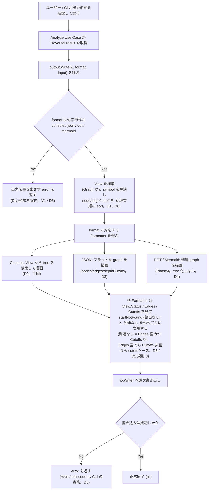
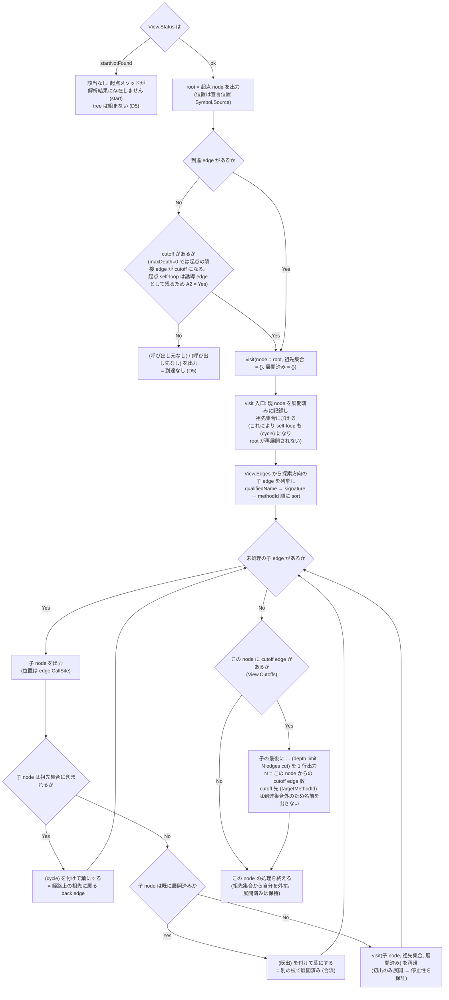
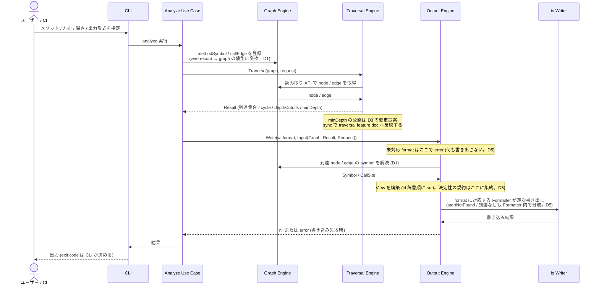

# 出力形式 (Console / JSON / DOT / Mermaid) spec

> issue #7 の設計 spec。
> Output Engine は Traversal Engine が返す到達集合 (到達 node / edge 集合、`cycle` 注釈、`depthLimit` cutoff) を入力に、Console / JSON / DOT / Mermaid の各形式へ変換する。Traversal result 契約の正本は [Traversal feature doc](../../design/features/traversal/DesignDoc_traversal.md)、Model schema の正本は [Analyzer Protocol / SPI feature doc](../../design/features/analyzer-protocol/DesignDoc_analyzer-protocol.md)、Core package 境界の正本は [context/architecture.md](../../context/architecture.md) / [ADR-0002](../../adr/0002-core-implementation-foundation.md) とする。
> **正本ハンドオフ済み (2026-07-11 `spec-sync`)**: durable な設計成果の正本は [Output feature doc](../../design/features/output/DesignDoc_output.md) (D2-D7: entry point / Console tree 規則 / JSON schema / DOT・Mermaid I/F 要件 / エラー境界 / テスト観点) と [Graph feature doc](../../design/features/graph/DesignDoc_graph.md) (D1: graph の symbol 値型) にある。本 spec の `## 解決済みの論点` 以下の該当節は **決定時スナップショット** (issue 単位の決定経緯の記録) であり、正本ではない。

## メタ情報

- Issue: `#7`
- ステータス: `In Progress` (phase: clarify / diagram / track / sync 完了。phase: tasks が残る)
- 作成日: 2026-07-11
- 更新日: 2026-07-11
- Branch: `feature/7`
- Owner: Fukuemon

## 設計フェーズ状況

状態は `未着手 / 進行中 / 完了 / レビュー済 / 保留` のいずれか。保留の場合は理由を備考に残す。

| #   | フェーズ                    | 状態       | 最終更新   | 備考                                                                       |
| --- | --------------------------- | ---------- | ---------- | -------------------------------------------------------------------------- |
| 1   | 起票                        | 完了       | 2026-07-11 | GitHub issue #7 と `requirements.md` を確認済み                            |
| 2   | 下書き                      | レビュー済 | 2026-07-11 | `requirements.md` から本 spec を scaffold。scaffold gate で PASS           |
| 3   | 上位文書突合                | レビュー済 | 2026-07-11 | Design Doc / context / ADR / traversal / analyzer-protocol と矛盾なし      |
| 4   | 論点整理                    | レビュー済 | 2026-07-11 | D1-D7 を初期論点として列挙 (Q3 は D2 が引き取る)                           |
| 5   | 論点解決                    | レビュー済 | 2026-07-11 | D1-D7 をすべて解決 (D2 = Q3)。clarify gate は 3 回目の spec-review で PASS |
| 6   | Interface / Routing 設計    | レビュー済 | 2026-07-11 | Formatter interface + 共有 View を確定 (D1 / D5 / D6)                      |
| 7   | Content / Data 設計         | レビュー済 | 2026-07-11 | JSON schema / 版管理 / graph の symbol 値型を確定 (D1 / D3)                |
| 8   | Performance / Security 設計 | レビュー済 | 2026-07-11 | 逐次書き出し。streaming 機構は導入しない (D6)                              |
| 9   | Test / Metrics 設計         | レビュー済 | 2026-07-11 | golden + パース検証を unit 層に (D7)                                       |
| 10  | 実装分割                    | 未着手     |            |                                                                            |
| 11  | レビュー済                  | 未着手     |            |                                                                            |

## 上位文書整合

正本 (PRD ※本プロダクトは統合モードのため未作成、Why/What は [Design Doc](../../design/DesignDoc.md) に統合 / [Design Doc](../../design/DesignDoc.md) / [feature doc](../../design/features/) / [context](../../context/) / ADR) のどの節と、どう整合させたかを記録する。

> **本節の役割**: 下表は「**確認した上位文書と、その整合方針 (継承 / 補足 / 変更提案)**」の記録であり、**phase: sync で実施する作業の網羅リストではない**。sync 作業の唯一の管理箇所は [`## 上位資料からの変更点`](#上位資料からの変更点) のテーブル群とする (同じ規範を 2 箇所に列挙して片方だけ更新される drift を避けるため)。

- PRD 更新要否: 不要 (本プロダクトは統合モード。Why / What は Design Doc に統合)
- Design Doc 更新要否: 要 → **2026-07-11 の sync で反映済み** (反映内容の正本は `## 上位資料からの変更点 > Design Doc への影響`)
- ADR 起票要否: 不要 (D1-D7 はいずれも既存の Core package 境界 (ADR-0002) と Protocol 判断 (ADR-0001) の範囲内。依存先の追加は Core 内の依存方向の明文化であり、ADR-0002 の判断を覆さない)

| 上位文書    | 節 / 該当箇所                                                                                                                 | 整合方針 (継承 / 補足 / 変更提案)                      |
| ----------- | ----------------------------------------------------------------------------------------------------------------------------- | ------------------------------------------------------ |
| PRD         | 統合モードのため `design/DesignDoc.md` の Why / What を参照                                                                   | 継承                                                   |
| Design Doc  | Goal G3、Non Goals (ビューワ非提供)、Future Work Phase1 / Phase4                                                              | 継承                                                   |
| Design Doc  | 成功条件 S3 の測定方法                                                                                                        | **変更提案** (D7。Output 層 + CLI 層の 2 層照合を追記) |
| Design Doc  | Open Questions Q3 (Console ツリー表現)                                                                                        | 補足 (D2 で解決 → sync で反映)                         |
| Design Doc  | 「詳細の所在」feature 一覧 (「出力形式」行 = 未作成 / 未着手。Graph Engine の行は存在しない)                                  | 補足 (sync で output / graph の feature doc を作成)    |
| Design Doc  | モジュール責務 Output Engine の依存先 (`Graph Engine, Model`) と C4 図                                                        | **変更提案** (D6。Traversal を追加)                    |
| feature doc | `design/features/traversal/DesignDoc_traversal.md` の Traversal result 契約 (到達集合 / `cycle` / `depthLimit` / tree 非保持) | 継承 (下記注記)                                        |
| feature doc | `design/features/traversal/DesignDoc_traversal.md` の Traversal result (到達 node 集合の形)                                   | **変更提案** (D3。`minDepth` の公開)                   |
| feature doc | `design/features/analyzer-protocol/DesignDoc_analyzer-protocol.md` の `MethodSymbol` / `CallEdge` / `SourceLocation`          | 継承 (下記注記)                                        |
| feature doc | `design/features/graph/DesignDoc_graph.md` (sync で作成済み)                                                                  | **変更提案** (D1 の durable 正本として新規作成)        |
| feature doc | `design/features/output/DesignDoc_output.md` (sync で作成済み)                                                                | **変更提案** (D2-D7 の durable 正本として新規作成)     |
| context     | `context/architecture.md` Package Boundary (`Output Engine` → `Graph Engine` / `Model`、`core/internal/output`)               | **変更提案** (D1 で補足 / D6 で Traversal 依存を追加)  |
| context     | `context/testing.md` E2E 照合 (S3 = 各出力形式のパース可否)                                                                   | **変更提案** (D7。2 層照合の補足)                      |
| context     | `context/testing.md` テスト runtime contract (Golden fixture の置き場所)                                                      | 補足 (D7。package-local `testdata/` を含む旨を追記)    |
| feature doc | `design/features/README.md` の索引 (現在 analyzer-protocol のみ登録。traversal が stale)                                      | 補足 (新規 2 本 + traversal を登録)                    |
| context     | `context/toolchain.md` Go 標準 library / Go 標準 `testing`                                                                    | 継承                                                   |
| context     | `context/engineering.md` Repository Quality Gate / 依存境界 gate                                                              | 継承                                                   |
| ADR         | `adr/0001-analyzer-protocol-jsonl-spi.md`                                                                                     | 継承                                                   |
| ADR         | `adr/0002-core-implementation-foundation.md`                                                                                  | 継承                                                   |

> Traversal feature doc は「Console tree が必要な場合も tree 構築は Output 側で行う (Traversal は tree 表現を保持しない)」と定めている。本 spec はこの分界を継承し、tree 化を Output Engine の責務として設計する (D2)。
> `context/architecture.md` は Output Engine の依存先を `Graph Engine` / `Model` と定める。一方、現行実装の `graph.Node` は `methodId` のみを保持し (`core/internal/graph/graph.go:23-25`)、`MethodSymbol` の `qualifiedName` / `signature` / `sourceLocation` を保持していない。Console / JSON が methodId 以外を表示するには symbol 情報の受け渡し経路が要る。これは上位文書との**矛盾ではなく未定義**であり (Design Doc のモジュール責務は Output → Model 依存を許容している)、D1 で解決する。D1 が graph model の拡張を選ぶ場合は Graph Engine (`core/internal/graph`) への差分が発生するため、実装対象に `core` を含めている。

## 関連資料

- `design/DesignDoc.md`: 成功条件 S3、Goal G3、モジュール責務 Output Engine、Non Goals、Future Work Phase1 / Phase4、Open Questions Q3
- `design/features/traversal/DesignDoc_traversal.md`: Traversal result 契約 (Output Engine が consumer)
- `design/features/analyzer-protocol/DesignDoc_analyzer-protocol.md`: `MethodSymbol` / `CallEdge` / `SourceLocation` schema の正本
- `context/architecture.md`: Package Boundary、`core/internal/output` の責務
- `context/testing.md`: S3 の E2E 照合方針
- `specs/7-output/requirements.md`: 本 spec の要求定義 (S3、R1-R3、I1-I2、O1-O3、E1-E3、V1)
- 関連 issue: #7 (本 spec)、#6 (Traversal / 入力元、完了)、#8 (Analyzer Protocol / Model、完了)、CLI interface spec (未起票。format 引数 / exit code の決定先)

## 背景

- depwalk の調査結果は、人が読む用途 (Console) と機械処理・可視化用途 (JSON / DOT / Mermaid) の双方で使われる。両立する出力手段が現状ない。
- Design Doc の成功条件 S3 「呼び出しグラフを Console / JSON / DOT / Mermaid で出力できる」と Goal G3 に直接対応する。
- Traversal Engine (#6) が到達集合を返せる状態になり、その consumer である Output Engine が Phase1 の最後の未設計モジュールになっている (`core/internal/output/output.go` は package 宣言のみの stub)。
- Phase1 の完成条件は Console / JSON。DOT / Mermaid は Future Work Phase4 の実装だが、後から Output Engine の構造を作り直さずに済むよう **I/F は本 feature で設計する**。

## スコープ

### やること

- Traversal result (到達 node / edge 集合、`cycle` 注釈、`depthLimit` cutoff、`status`) を各出力形式へ変換する Output API を設計する。
- Console 出力のツリー表現を確定する (深さ表示、循環参照の見せ方、depthLimit cutoff の見せ方) — Design Doc Open Question **Q3** の解 (durable 正本は sync で [Output feature doc](../../design/features/output/DesignDoc_output.md) へハンドオフ済み)。
- JSON 出力の契約を確定する (schema、schemaVersion、後方互換方針、要素順序の決定性)。
- DOT / Mermaid 出力の I/F 方針を確定する (実装は Phase4)。
- 空グラフ / 起点不在 (`startNotFound`) / 未対応 format の各形式での見せ方を定義する。
- Output Engine のテスト観点 (unit / golden / S3 の parse 可否照合) を定義する。

### やらないこと

- グラフのビューワ / レンダラの提供 (DOT / Mermaid は構文生成まで — Design Doc Non Goals)。
- 探索ロジック (→ `traversal` / #6 で確定済み)。
- 解析・Model schema の定義 (→ `analyzer-protocol` / #8 で確定済み)。
- CLI の引数名 (`--format` 等)、exit code、エラーメッセージ表示 (→ CLI interface spec。本 spec は Output Engine が返す値までを責務とし、プロセス終了コードには関与しない)。
- DOT / Mermaid の実装、および具体構文 (ノード形状 / 色 / 線種) の確定 (Phase4 spec)。本 spec は Formatter interface と表現すべき意味の要件 (G-1〜G-7) までを確定する (D4)。
- 出力のファイル書き出し / 出力先の決定 (Output Engine は `io.Writer` へ書く。宛先の選択は CLI の責務)。

## 要件の解釈

### 実現したいユーザー価値

- 開発者 / 保守担当が、ターミナルで呼び出し関係をすぐ読める (Console)。
- CI パイプラインが、機械可読な形式で結果を保存・後処理できる (JSON)。
- 調査結果を図としてドキュメントに貼り付けられる (DOT / Mermaid、Phase4)。

### 成功条件

- S3: 呼び出しグラフを Console / JSON / DOT / Mermaid で出力でき、各形式でパース / レンダリング可能な出力が得られる。
- 本 spec の実装対象は Output Engine (+ D1 の結論次第で Graph Engine) に限られるため、#7 の成功条件は **Output Engine が Traversal result から各形式の文字列を生成できること**に限定して検証する。CLI 引数レベルでの最終的な S3 の E2E 照合は、CLI interface spec の実装後に完成する (Traversal の #6 と同じ分界)。
- Phase1 完了時点で Console / JSON が満たされていること。DOT / Mermaid は I/F が定まっていれば Phase1 の完了条件を満たす。

### 対象ユーザー / 操作主体

- 開発者 / 保守担当 (Console)
- CI パイプライン (JSON)
- 下流ツール / ドキュメント (DOT / Mermaid)

EARS 風で振る舞いを記述する。

- WHEN 呼び出し側が Traversal result と出力形式を指定して Output Engine を呼ぶ時、システムは指定形式の出力を `io.Writer` へ書き出す。
- WHEN format が `console` の時、システムは起点メソッドを根とするツリーを出力し、経路上の祖先に戻る edge の先には `(cycle)`、別の枝で展開済みの node には `(既出)`、深さ上限で切られた枝には `… (depth limit: N edges cut)` を付ける。到達 node はすべて最低 1 回 tree に現れる (D2)。
- WHEN format が `json` の時、システムは `schemaVersion` / `status` / `direction` / `start` / `nodes[]` / `edges[]` / `depthCutoffs[]` を持つ JSON を、id の辞書順で出力する (D3)。
- IF Traversal result の status が `startNotFound` の時、システムは各形式で「該当なし」を明示し、`error` を返さない (D5)。
- IF 到達 edge も depthLimit cutoff も無い時 (起点が孤立している時)、システムは Console で `(呼び出し元なし)` / `(呼び出し先なし)` を、JSON で起点 1 件 + 空の `edges` を出力する (D5)。
- IF 到達 edge は無いが depthLimit cutoff がある時 (`maxDepth=0` 等)、システムは Console で root 行 + `… (depth limit: N edges cut)` を出力し、`(呼び出し元なし)` とは出力しない (D2 規則 8)。
- IF 未対応の format が指定された時、システムは出力を一切書き出さずに `error` を返す (対応形式を案内する。プロセス exit code は CLI の責務) (D5)。
- THE SYSTEM SHALL 同一の Traversal result に対して常に同一のバイト列を出力する (到達集合が順序非保証であっても、出力は決定的にする)。

## 設計時の論点

設計 / 実装フェーズへ持ち越す残課題を 1 件ずつ管理する。確定したものは「解決済みの論点」へ移す。

| #   | 論点                                                                                                                                                   | 決定候補                                                                                                                                                                                                          | 決定         |
| --- | ------------------------------------------------------------------------------------------------------------------------------------------------------ | ----------------------------------------------------------------------------------------------------------------------------------------------------------------------------------------------------------------- | ------------ |
| D1  | Output が表示する symbol 情報 (`qualifiedName` / `signature` / `sourceLocation` / `callSite`) の受け渡し経路。現行 `graph.Node` は `methodId` のみ持つ | (a) `graph` に固有の値型で保持し Output は Graph から引く / (b) `graph.Node` に `protocol.MethodSymbol` (wire DTO) をそのまま埋める / (c) methodId のみ表示                                                       | **決定 (a)** |
| D2  | **Q3**: Console ツリー表現。到達集合 (非 tree) から tree を組む際の、深さ表示・循環参照・`depthLimit` cutoff・合流 (同一 node 複数経路) の見せ方       | 罫線ツリー + **初出のみ展開** (停止性を保証)。再登場 node は経路上の祖先なら `(cycle)`、別枝で展開済みなら `(既出)`。cutoff は `… (depth limit: N edges cut)`。深さラベルなし。子行は `callSite`、root は宣言位置 | **決定**     |
| D3  | JSON 出力スキーマと版管理。フィールド構成、`schemaVersion` の採番系 (Analyzer Protocol の `schemaVersion` と同一系統か独立か)、後方互換方針、要素順序  | フラットな graph (`nodes[]` / `edges[]` / `depthCutoffs[]`)。node に `minDepth` を持つ (**traversal 契約の拡張が必要**)。版は Protocol と独立 / additive 互換。順序は id の辞書順                                 | **決定**     |
| D4  | DOT / Mermaid の I/F 方針 (Phase4 実装)。Formatter をどう抽象化し、`cycle` / cutoff / 起点をどう図示するか。本 spec でどこまで決めるか                 | 共通 Formatter interface + 「各形式が表現すべき意味」を要件として確定する。具体構文 (ノード形状 / 色 / 線種) は Phase4 spec へ送る                                                                                | **決定**     |
| D5  | 空グラフ / `startNotFound` / 未対応 format の扱いと、Output Engine とエラーの境界 (どこまでを戻り値のエラーとし、どこから CLI の責務か)                | `startNotFound` と到達なしは**正常系**として各形式で明示。Output が `error` を返すのは「未対応 format」「書き込み失敗」の 2 つのみ。exit code / 表示は CLI spec                                                   | **決定**     |
| D6  | Formatter の Go interface 形状と出力先。大規模グラフでの streaming / バッファリング方針 (非機能: 実用時間で出力)                                       | `Formatter.Format(w io.Writer, v View) error` + 全形式が共有する中間表現 `View` (symbol 解決済み / sort 済み)。入力は Graph + Result + **Request**。streaming 機構は導入しない                                    | **決定**     |
| D7  | テストの検証境界。golden file test を導入するか、S3 の「パース可否」照合をどの層で行うか (`context/testing.md` との整合)                               | golden file test + パース検証を **unit 層**に置く。golden は `core/internal/output/testdata/golden/`。S3 は Output 層と CLI 層の 2 層照合 (context/testing.md へ補足)                                             | **決定**     |

## 解決済みの論点

> **決定時スナップショット** (2026-07-11 `spec-sync` で正本ハンドオフ済み)。本節以下の設計内容の正本は [Output feature doc](../../design/features/output/DesignDoc_output.md) (D2-D7) と [Graph feature doc](../../design/features/graph/DesignDoc_graph.md) (D1)。本節は各論点の**決定経緯と理由の記録**として保持し、以後の設計変更は feature doc 側で行う。

### D1: symbol 情報は Graph が保持し、Output は Graph から引く (2026-07-11 決定)

**決定**: `graph` package に表示用の値型を持たせる。`graph.Node` は `ID` (Analyzer の `methodId`) に加えて `Symbol` (`QualifiedName` / `Signature` / `Source`) を保持し、`graph.Edge` は `CallSite` を保持する。`protocol` の wire record から graph の値型への変換は、graph 構築時 (Analyze Use Case 層) に 1 回だけ行う。Output Engine は Graph の読み取り API から symbol を引く。

**理由**:

- `methodId` は Analyzer が決定的に生成する **不透明な stable ID** であり、人間可読な名前である保証も Analyzer version をまたぐ永続性もない ([analyzer-protocol feature doc](../../design/features/analyzer-protocol/DesignDoc_analyzer-protocol.md) の `methodId` 定義)。したがって Console / JSON が `methodId` のみを出す案 (c) は成立しない。
- 依存方向が `Output Engine → Graph Engine → Model` となり、[Design Doc モジュール責務](../../design/DesignDoc.md) および [context/architecture.md](../../context/architecture.md) の Package Boundary と一致する。Graph Engine の責務 (Node 管理 / Edge 管理) の範囲内に収まる。
- symbol table を別入力で渡す案 (b) は、「table が到達 node 集合を漏れなく覆っていること」という**暗黙の不変条件**を新設し、graph と table の 2 つを同期させる必要が生じる。node 属性は node と同じ場所に置くほうが不変条件が 1 つ減る。
- wire DTO をそのまま埋める案 (b') は変換コストがゼロな一方、`schemaVersion` / `recordType` という wire 専用フィールドを Core の graph model に持ち込む。graph 固有の値型にすることでこれを避ける。

**派生する詳細**:

- `SourceLocation` は `protocol` package の型を再利用する。この型は `path` / `startLine` 等の純粋な値のみで wire 専用フィールドを持たないため、再利用しても本決定の理由 (wire 表現を core domain に入れない) に反しない。依存方向も `Graph Engine → Model` の範囲内。
- 本決定により Graph Engine (`core/internal/graph`) への差分が確定するため、実装対象の `core` は条件付きではなく確定 ◯ になる。
- edge の `callSite` を Console / JSON でどう見せるかは D2 / D3 で決める (保持することのみ本決定で確定)。

### D2 (= Design Doc Open Question Q3): Console ツリー表現 (2026-07-11 決定)

**決定**: 罫線ツリーで、**初出の node のみ部分木を展開する** (これが停止性を保証する)。展開しない葉には、経路上の祖先に戻る場合は `(cycle)`、別の枝で展開済みの場合は `(既出)` を付ける。深さ上限で切られた枝は `… (depth limit: N edges cut)` で「続きがある」ことを明示する。深さラベル (`[d2]` 等) は付けない。

Traversal result は tree ではなく集合 (到達 node 集合 + 誘導 edge 集合) であるため、**tree 化の規則を Output 側の仕様として定義する** ([traversal feature doc](../../design/features/traversal/DesignDoc_traversal.md): 「tree 構築は Output 側で行う」)。

#### tree 構築規則

1. **root** = 起点 node。
2. **子** = 誘導 edge 集合 (`Result.Edges`) を探索方向に辿った先の node。caller 方向なら子は「呼び出し元」、callee 方向なら子は「呼び出し先」。
3. **兄弟の順序** = `qualifiedName` → `signature` → `methodId` の辞書順。到達集合は順序非保証のため、この並び順の固定が出力の決定性を担保する。
4. **展開順序** = 上記順序に従った pre-order DFS。展開順が決定的なので、どの出現が「初出」かも決定的になる。**node の展開に入る時点で、その node 自身を「展開済み」に記録し、「経路上の祖先集合」に加える** (root を含む)。この初期化により、self-loop (`B → B`) も規則 6 の「祖先に戻る edge」として正しく `(cycle)` になり、root の self-loop で root が再展開されることもない。
5. **初出のみ展開** = ある node の部分木を展開するのは、tree 中で最初に出現したときの 1 回のみ。2 回目以降の出現は標識付きの葉にする。これにより出力行数は **O(到達 edge 数)** に収まり、合流 (ダイヤモンド構造) で指数的に膨らまない。**停止性はこの規則だけで保証される** (各 node は高々 1 回しか展開されないため、循環があっても DFS は必ず終わる)。
6. **再登場 node の標識** = 展開しない葉には、その node が **現在の DFS 経路上の祖先か否か**で 2 種類の標識を付ける:
   - **`(cycle)`** = root からの現在の経路上の祖先に戻る edge (back edge) の先。呼び出しグラフに実在する循環を意味する。
   - **`(既出)`** = 祖先ではないが、tree の別の枝で既に展開済みの node。合流 (ダイヤモンド構造) を意味する。
   - 判定は Console formatter が DFS 中に保持する経路 (祖先集合) で行う。**`Result.Cycles` は使わない** — `Result.Cycles` は「両端が同一 SCC に属する誘導 edge すべて」というグラフ全体の性質であり (`core/internal/traversal/result.go` の `cycleEdges`)、SCC 内の最初の edge も注釈対象になる。これを打ち切り条件に使うと、A→B→C→A のような 3 要素 SCC で最初の edge A→B が打ち切られ、**C が tree に一度も現れなくなる**。`Result.Cycles` は JSON の `cycle` フラグ (D3) には正しく使える。
7. **`… (depth limit: N edges cut)`** = cutoff edge の **到達側 endpoint** (= `targetMethodId` ではない方。探索方向の手前側で、到達 node 集合に属する) の子として 1 行出す。**位置はその node の子の最後** (通常の子 edge をすべて出した後)。N はその node からの cutoff edge 数 (深さ上限値ではない)。cutoff の先の node (`targetMethodId`) は到達集合外なので名前は出さない。
8. **到達なし** = `Edges` が空 **かつ** `Cutoffs` も空のとき。root 行のみを出し、その子として `(呼び出し元なし)` / `(呼び出し先なし)` を出す (子の展開は行わない)。
   - **`Edges` が空でも `Cutoffs` が非空なら「到達なし」ではない**。root 行 + 規則 7 の `… (depth limit: N edges cut)` を出す。これは `maxDepth=0` で起きる (traversal の契約上、`maxDepth=0` は起点のみを到達集合に含め、**起点の隣接 edge は cutoff になる。ただし起点自身への self-loop は両端が到達 node のため、誘導 edge (+ `cycle` 注釈) として到達 edge 集合に残る** — [traversal feature doc](../../design/features/traversal/DesignDoc_traversal.md))。呼び出し元は存在するが深さ上限で切られただけなので、`(呼び出し元なし)` と出してはならない。
9. **`startNotFound`** は tree を組まず、D5 の表に従った文言を出す (Console formatter 内の分岐)。

#### 行の書式

- **node ラベル** = `qualifiedName` + `signature`。
- **位置情報**: 子行は **`edge.CallSite`** (= その呼び出しを行っている行) を出す。tree の各子行は edge を表すため、影響調査で「どこで呼んでいるか」に直接飛べることを優先する。root は edge を持たないため、node の宣言位置 (`Symbol.Source`) を出す。位置が欠落している場合 (`callSite` / `sourceLocation` は Protocol 上 optional) は位置表記を省略する。
- メソッド自体の宣言位置は Console では出さない (JSON には node / edge の両方を含める → D3)。

caller 方向の例 (`ApiFilter` は 2 経路から到達する合流 node、`CacheWarmer` → `Scheduler` → `UserService` は 3 要素の循環):

```text
UserService.findById(Long)  [UserService.java:42]
├─ UserController.getUser(Long)  [UserController.java:31]
│  └─ ApiFilter.doFilter()  [ApiFilter.java:20]
├─ AdminController.getUser(Long)  [AdminController.java:18]
│  └─ ApiFilter.doFilter()  (既出)
├─ UserBatch.execute()  [UserBatch.java:55]
│  └─ … (depth limit: 2 edges cut)
└─ CacheWarmer.warm()  [CacheWarmer.java:8]
   └─ Scheduler.run()  [Scheduler.java:12]
      └─ UserService.findById(Long)  (cycle)
```

`Scheduler.run` は循環の途中にあるが、`(cycle)` で打ち切られるのは**経路上の祖先に戻る edge の先 (root)** だけなので、循環に属する node もすべて tree に現れる。

**理由**:

- 呼び出しグラフでは共有メソッド (Filter / Util / Repository 等) が多数の経路から到達する。経路ごとにフル展開する案は「その経路を辿るとこうなる」が完全に見える一方、実コードのダイヤモンド構造で出力が指数的に膨らみ、Console として実用にならない。初出のみ展開なら出力サイズの上限が到達 edge 数で読める。
- `(既出)` の node は tree の別の場所に必ず完全な部分木があるため、情報は失われない (参照先を辿れば読める)。**この論拠が成り立つには、到達 node が最低 1 回は展開されることが必要**であり、規則 6 の back edge 判定はそれを担保する (SCC 全体を最初の edge で切り落とさない)。
- 停止性と標識は独立している。停止は「初出のみ展開」が担い、`(cycle)` / `(既出)` は「なぜこの枝が展開されていないか」を利用者に説明するためだけの情報である。この分離により、循環検出の誤りが tree の欠落に直結しなくなる。
- 深さラベルはインデントと冗長であり、行を長くする割に得られる情報が少ないため付けない。深さ情報が必要な用途 (機械処理) は JSON 側が担う。

**空グラフ / 起点不在 (`startNotFound`) の Console 表現は D5 で決める。**

### D3: JSON 出力スキーマと版管理 (2026-07-11 決定)

**決定**: JSON は **フラットな graph** (`nodes[]` / `edges[]`) として出力し、Console と同型の tree にはしない。各 node は起点からの最短距離 `minDepth` を持つ。スキーマは Analyzer Protocol とは**独立した output schema 版**を持つ。

#### スキーマ

```json
{
  "schemaVersion": "1.0",
  "status": "ok",
  "direction": "caller",
  "start": "<methodId>",
  "nodes": [
    {
      "methodId": "<methodId>",
      "qualifiedName": "com.example.UserService.findById",
      "signature": "(java.lang.Long)",
      "minDepth": 0,
      "sourceLocation": {
        "path": "src/main/java/com/example/UserService.java",
        "startLine": 42
      }
    }
  ],
  "edges": [
    {
      "edgeId": "<edgeId>",
      "callerMethodId": "<methodId>",
      "calleeMethodId": "<methodId>",
      "cycle": false,
      "callSite": {
        "path": "src/main/java/com/example/UserController.java",
        "startLine": 31
      }
    }
  ],
  "depthCutoffs": [
    {
      "edgeId": "<edgeId>",
      "callerMethodId": "<methodId>",
      "calleeMethodId": "<methodId>",
      "targetMethodId": "<methodId>",
      "targetMinDepth": 3,
      "callSite": { "path": "...", "startLine": 12 }
    }
  ]
}
```

- **field 名は Analyzer Protocol の語彙を踏襲する** (`methodId` / `callerMethodId` / `sourceLocation` / `callSite`)。利用者が Protocol JSONL と同じ語彙で扱えるようにする。
- `status` は `ok` / `startNotFound` (`traversal.Status` と同値)。`direction` は `caller` / `callee`。
- `cycle` は `Result.Cycles` の注釈に対応する bool。**false でも省略せず常に出力する** (利用者が field の有無を分岐しなくて済むようにする)。
- `sourceLocation` / `callSite` は Protocol 上 optional のため、欠落時は field ごと省略する。
- **`depthCutoffs[]` の `targetMethodId` は `nodes[]` に存在しない (dangling)**。`targetMethodId` は **探索方向の接続先** を指し、`direction=caller` なら `callerMethodId`、`direction=callee` なら `calleeMethodId` と同じ値になる (`core/internal/traversal/search.go` の `nextNode(e, dir)` の定義に対応。caller 方向の探索は callee → caller へ辿るため、深さ上限の外側にあるのは caller 側)。既存の `targetMinDepth` はこの `targetMethodId` の minDepth である。
  - `targetMethodId` を持たせることで、利用者は `direction` を見て `callerMethodId` / `calleeMethodId` のどちらが dangling かを分岐せずに済む。
  - cutoff 先の node が `nodes[]` にないのは、深さ上限の外側にあり到達集合に含まれないため (`traversal.Result` は cutoff 先の symbol を保持しない)。この非対称性は Traversal result の契約に由来する。
- **要素順序**: `nodes[]` は `methodId`、`edges[]` / `depthCutoffs[]` は `edgeId` の辞書順に固定する。到達集合は順序非保証のため、この固定が出力の決定性を担保する。

#### 版管理

- **Analyzer Protocol の `schemaVersion` とは独立の採番**とする。Protocol は Analyzer ↔ Core の wire 契約、本 schema は Core ↔ 利用者 (CI / 後処理) の契約であり、変更理由が独立しているため。
- **後方互換方針**: field の追加は後方互換 (additive) とし minor を上げる。field の削除 / 意味変更 / 型変更は破壊的変更とし major を上げる。利用者は未知の field を無視できることを前提にする。

**理由**:

- Traversal result は tree ではなく **graph** (合流・循環を含む) である。フラットな graph はこの構造をそのまま表現でき、合流 node の重複も、循環の打ち切り表現も要らない。tree 化は Console の表示都合であり、機械処理向けの JSON に持ち込む必要がない。
- tree 形式にすると、Console と同じ `(既出)` / `(cycle)` の打ち切りが機械処理側に漏れ出し、利用者が「この node は本当に葉なのか、参照印なのか」を判定する羽目になる。
- `minDepth` を含めることで、「直接の呼び出し元だけ抽出 (`minDepth == 1`)」のような典型的な後処理が JSON 単体で完結する。

**上位文書への影響 (変更提案)**: `minDepth` を出力するには `traversal.Result` が node ごとの最短距離を公開する必要がある。現行の `Result.Nodes` は `map[string]bool` で深さを公開していない (深さは `minDepths()` の内部計算のみ)。これは #6 で確定した Traversal result 契約の拡張であり、[traversal feature doc](../../design/features/traversal/DesignDoc_traversal.md) への **変更提案** として phase: sync で反映する (`## 上位資料からの変更点 > feature doc への影響`)。追加は additive (既存の到達集合・`cycle`・`depthLimit` の意味論を変えない) であり、#6 の決定を上書きしない。

### D4: DOT / Mermaid は interface + 意味要件までを本 spec で確定する (2026-07-11 決定)

**決定**: 本 spec では **共通 Formatter interface** と、**各形式が表現できなければならない意味 (以下の要件)** までを確定する。ノード形状 / 色 / 線種といった具体構文は **Phase4 spec** に送る。

#### DOT / Mermaid が表現すべき意味 (Phase4 実装が満たす要件)

| #   | 要件                                                                                                             | 由来                                                   |
| --- | ---------------------------------------------------------------------------------------------------------------- | ------------------------------------------------------ |
| G-1 | 到達 node 集合と到達 edge 集合を、グラフとしてそのまま描ける (tree に潰さない)                                   | DOT / Mermaid はグラフ形式。合流も循環もそのまま描ける |
| G-2 | 起点 node を他と区別できる                                                                                       | 調査の基点が読み取れること                             |
| G-3 | `cycle` 注釈付き edge を他の edge と区別できる                                                                   | E1 / Traversal の `cycle` 注釈                         |
| G-4 | `depthLimit` cutoff がある node に「続きがある」ことを示せる (cutoff 先の node は到達集合外のため名前は出せない) | E2 / Traversal の `depthLimit` cutoff                  |
| G-5 | node ラベルは `qualifiedName` + `signature` (Console と同じ語彙)                                                 | D1 / D2                                                |
| G-6 | 同一 Result から常に同一のバイト列を出力する (要素順序は id の辞書順)                                            | 決定性 (Console / JSON と同じ規約)                     |
| G-7 | 外部ツール (Graphviz / Mermaid レンダラ) がパース可能な構文であること                                            | S3 / Non Goals (ビューワは提供しない)                  |

**理由**:

- issue #7 の完了条件は「DOT/Mermaid 出力 I/F の方針が確定 (実装は Phase4)」であり、構文の確定までは求めていない。
- 本 feature で I/F を設計する目的は「Phase4 で Output Engine の構造を作り直さずに済むこと」にある。そのためには **interface が cycle / cutoff / 起点を表現可能な情報を Formatter に渡せているか**が要点であり、構文そのものは後から決めても構造に影響しない。上表を要件として固定することで、interface の手直しリスクを潰しつつ Phase4 の裁量を残す。
- Console と違い DOT / Mermaid は**グラフ形式なので tree 化が不要**である (合流も循環も構文上そのまま表現できる)。D2 の tree 構築規則は Console 専用であり、DOT / Mermaid には適用しない。

### D5: 該当なしは全形式で正常系として表現し、Output が返すエラーは 2 種類に限る (2026-07-11 決定)

**決定**: `startNotFound` と「到達なし (起点のみ)」は **正常系**として各形式で明示する。Output Engine が `error` を返すのは **未対応 format** と **書き込み失敗** の 2 つだけとする。

#### 各ケースの扱い

| ケース                                              | Console                                                                       | JSON                                                         | DOT / Mermaid             | 戻り値  |
| --------------------------------------------------- | ----------------------------------------------------------------------------- | ------------------------------------------------------------ | ------------------------- | ------- |
| 起点不在 (`status=startNotFound`)                   | `該当なし: 起点メソッドが解析結果に存在しません (<start>)`                    | `status: "startNotFound"` + `nodes` / `edges` は空配列       | 空グラフの有効構文        | `nil`   |
| 到達なし (`Edges` も `Cutoffs` も空)                | root 行 + `└─ (呼び出し元なし)` (callee 方向では `(呼び出し先なし)`)          | `nodes` に起点 1 件、`edges` は空配列                        | 起点 node のみのグラフ    | `nil`   |
| `Edges` は空だが `Cutoffs` が非空 (`maxDepth=0` 等) | root 行 + `… (depth limit: N edges cut)`。**`(呼び出し元なし)` とは出さない** | `nodes` に起点 1 件、`edges` は空配列、`depthCutoffs` は非空 | 起点 node + cutoff の表現 | `nil`   |
| 未対応 format 指定                                  | —                                                                             | —                                                            | —                         | `error` |
| `io.Writer` への書き込み失敗                        | —                                                                             | —                                                            | —                         | `error` |

- **未対応 format** は出力を一切書き出す前に validation で弾く (`requirements.md` V1)。エラーは対応形式を案内する内容とする。
- **exit code / エラーメッセージの表示先 (stdout / stderr)** は Output Engine の責務ではない。Output は `error` を返すところまでを担い、プロセス終了コードと表示は **CLI interface spec** に委ねる (`## スコープ > やらないこと`)。

**理由**:

- Traversal Engine は `startNotFound` を「エラーではなく正常な no-match の結果」と定義している (`core/internal/traversal/traversal.go` の `StatusStartNotFound`)。Output でこれをエラーに格上げすると、上流の契約と矛盾する。
- JSON を消費する CI は、該当なしの場合も**パース可能な文書**を受け取れる必要がある。エラーや空出力にすると、CI 側が「該当なし」と「ツールが壊れた」を区別できない。
- 「到達なし」と「起点不在」は利用者にとって意味が異なる (前者は起点が存在し呼び出し関係がない、後者は起点自体が解析結果にない)。Console でも両者を区別できる文言にする。

### D6: Formatter interface + 全形式が共有する中間表現 (View) (2026-07-11 決定)

**決定**: `Graph` / `traversal.Result` / `traversal.Request` から、**symbol 解決済み・sort 済みの中間表現 (`View`)** を 1 度だけ構築し、各 Formatter は `View` を描画する。streaming 機構は導入せず、`io.Writer` へ逐次書き出す。

```go
// core/internal/output

type Format string

const (
    FormatConsole Format = "console"
    FormatJSON    Format = "json"
    FormatDOT     Format = "dot"     // Phase4
    FormatMermaid Format = "mermaid" // Phase4
)

type Input struct {
    Graph   *graph.Graph
    Result  traversal.Result
    Request traversal.Request // direction / start を持つ
}

// Write は Output package の唯一の公開 entry point。
//  1. f が未対応 format なら、何も書き出さずに error を返す (D5)
//  2. Input から View を構築する (symbol 解決 + sort。D6)
//  3. f に対応する Formatter を選ぶ
//  4. formatter.Format(w, view) を呼ぶ
func Write(w io.Writer, f Format, in Input) error

// 以下は package 内部の拡張点。呼び出し側 (Analyze Use Case) は
// Formatter / View を知らず、format 名を渡すだけでよい。

// 全 formatter が共有する中間表現 (symbol 解決済み / sort 済み)
type View struct {
    Status  traversal.Status
    Start   NodeView
    Nodes   []NodeView   // sorted
    Edges   []EdgeView   // sorted。Cycle flag を持つ
    Cutoffs []CutoffView // sorted
}

type Formatter interface {
    Format(w io.Writer, v View) error
}
```

- **未対応 format の検証・`View` の構築・Formatter の選択は `Write` が担う**。`Formatter` は「`View` を描く」ことだけに責務を絞る。D5 の「未対応 format は出力を書き出す前に `error`」は Formatter 選択より前の段階であり、`Formatter.Format` では表現できないため、この entry point が必要になる。
- **`startNotFound` / 到達なしの表現は各 Formatter の内部分岐**とする。分岐は `View.Status` / `View.Edges` / **`View.Cutoffs`** の 3 つを見る (「到達なし」= `Edges` 空 **かつ** `Cutoffs` 空。`Edges` が空でも `Cutoffs` が非空なら `maxDepth=0` 等の cutoff ケースであり到達なしではない — D2 規則 8)。`Write` は status で分岐せず、常に Formatter に委譲する — 「該当なし」の見せ方は形式ごとに異なる (D5 の表) ため。

- **`traversal.Request` を入力に含める**理由: `traversal.Result` は `direction` / `start` を保持しない (`Status` / `Nodes` / `Edges` / `Cycles` / `DepthCutoffs` のみ)。D3 の JSON はこの 2 つを出力するため、Output 側で Request を受け取る必要がある。
- **sort 規則の所在**: `View` の構築時に、`Nodes` / `Edges` / `Cutoffs` を id (`methodId` / `edgeId`) の辞書順に固定する。これが JSON / DOT / Mermaid の要素順序 (D3 / D4 G-6) をそのまま満たす。Console の兄弟順序だけは `qualifiedName` → `signature` → `methodId` 順 (D2) であり、これは Console formatter が `View` を読み替えて適用する (`View` は決定的な基準順序を与え、Console はその上で表示順を定める)。
- **tree 化は Console formatter 内に閉じる** (D2)。`View` は tree を持たない。Console は `View.Edges` を隣接情報として DFS し、`(cycle)` / `(既出)` の判定は **自身の DFS 経路 (祖先集合)** から行う。`EdgeView.Cycle` (= `Result.Cycles` 由来) は **JSON / DOT / Mermaid 用**であり、Console の打ち切り判定には使わない (D2 規則 6)。
- **`View.Start` の symbol 欠落**: `status = startNotFound` のとき起点 node は graph に存在せず symbol を解決できない (`traversal.Traverse` が空 Result を返す)。`NodeView` は symbol 欠落 (ID のみ) を許容する。D5 の Console 文言と D3 の `start` はいずれも methodId のみで足りる。
- **package 依存**: `Input` / `View` が `traversal.Result` / `traversal.Request` / `traversal.Status` を持つため、`core/internal/output` は `core/internal/traversal` を import する。これは Design Doc / `context/architecture.md` が宣言する Output の依存先 (`Graph Engine` / `Model`) に含まれないため、**変更提案として上位文書に反映する** (`## 上位資料からの変更点`)。traversal は output に依存しないため循環依存は生じない。
- **性能**: graph は既に全体がメモリ上にあり、出力サイズは到達集合に比例する。`View` の構築コストは sort が支配的 (O(n log n)) で、graph 規模に対して支配的にならない。逐次書き出しで足り、専用の streaming API は導入しない。

**理由**:

- symbol 引き (D1) と決定的な sort (D3 / D4 G-6) は 4 つの formatter すべてが必要とする。各 formatter に実装させると同じ規約を 4 箇所で守ることになり、どれか 1 つが sort を忘れるとその形式だけ非決定的になる。`View` に集約すれば決定性の規約が 1 本化される。
- Phase4 で DOT / Mermaid を追加するとき、実装すべきは `Formatter` 1 つであり、`View` の構築や symbol 解決を再実装しなくてよい (I/F を作り直さない = D4 / issue #7 の完了条件)。

### D7: golden file test + パース検証を unit 層に置く (2026-07-11 決定)

**決定**: 各 formatter の出力を **golden file と比較する unit test** で担保し、S3 の「パース可否」も unit 層で検証する。golden は Go 標準の package-local `testdata/` (`core/internal/output/testdata/golden/`) に置く。CLI 引数レベルの E2E 照合は CLI interface spec 完了後に完成させる。

```text
core/internal/output/
  console_test.go
  json_test.go
  testdata/
    golden/
      console_cycle.txt
      console_diamond.txt
      console_depth_limit.txt
      console_start_not_found.txt
      json_cycle.json
      ...
```

- **golden で担保するもの**: 書式 (D2 の Console 罫線 / 標識、D3 の JSON schema) と **決定性** (同一 Result から常に同一のバイト列 = `## 要件の解釈` の `THE SYSTEM SHALL`)。決定性は golden 比較で自然に検出できる (sort を忘れると golden が不安定になる)。
- **S3 のパース可否**: JSON は `encoding/json` で unmarshal できることを unit test で検証する。DOT / Mermaid は Phase4 実装時に同層で構文検証を追加する (D4 G-7)。
- **fixture のケース**: 循環 (self-loop / 相互再帰 / 3 要素 SCC) / 合流 (ダイヤモンド) / `depthLimit` cutoff / 到達なし (`Edges` も `Cutoffs` も空) / **`maxDepth=0`** (`Edges` は空だが `Cutoffs` が非空) / **`maxDepth=0` + 起点 self-loop** (誘導 edge + `cycle` が残るため別経路を通る) / `startNotFound` を最低限そろえる (`## 機能仕様 > Testing` の観点に対応)。
- **既存規約との整合**: [context/testing.md](../../context/testing.md) の「Golden fixture は `testdata/` 配下に置く」に従う。`go-cmp` は初期導入しない方針のため、golden 比較は文字列比較で行う。テストは仕様単位の `Test...` 関数に分ける (巨大な table-driven に異なる仕様を混ぜない)。

**S1/S2 と同じ 2 層構造 (context への補足が必要)**: `context/testing.md` は S3 (各出力形式のパース可否) を「サンプル Java/Spring repo による E2E」に位置づけているが、CLI 層の E2E は CLI interface spec 完了後にしか完成しない。したがって S3 の照合は **Output 層 (本 spec の unit / golden、formatter が Traversal result から各形式を生成できること)** と **CLI 層 (CLI 出力そのものの照合)** の 2 層からなる。これは #6 が S1/S2 で採った分界と同じ構造であり、phase: sync で `context/testing.md` に補足する。

**理由**:

- D2 / D3 / D6 はいずれも「同一 Result から常に同一のバイト列」を受け入れ基準に含む。golden 比較はこの基準を直接検証できる唯一の手段であり、部分一致アサーションでは sort 忘れを検出できない。
- Output は Traversal result という**純粋な入力から文字列を生成する関数**であり、外部依存を持たない。unit 層で完全に検証でき、E2E に持ち上げる必要がない。

## 未確定事項

(決定できない項目を理由とともに残す。1 件でも残っていれば下流 phase は止める)

- **論点 D1-D7 はすべて解決済み** (2026-07-11、決定者: Fukuemon)。Design Doc Open Question Q3 は D2 で解決した。
- **上位文書への反映は 2026-07-11 の phase: sync で完了** (全行 `[反映済]`。反映対象の唯一の管理箇所は [`## 上位資料からの変更点`](#上位資料からの変更点) のテーブル群)。durable 成果の正本は feature doc 2 本 (graph = D1 / output = D2-D7) へハンドオフ済みで、spec の該当節は決定時スナップショットに降格した。
- CLI interface spec が未起票のため、`--format` の引数名・exit code・エラー出力先 (stdout / stderr) は本 spec では確定できない。本 spec は Output Engine の戻り値までを責務境界とし、CLI 側の契約は当該 spec に委ねる (D5 で境界を明文化済み)。これは本 spec 内では解決不能な依存であり、下流 phase を止める未決事項ではない。

## 実装対象

正規 target は `context/project.md` の対象ドメイン一覧を正本とする。

| モジュール          | 実装有無 | 主な責務                                                                                                                                            |
| ------------------- | :------: | --------------------------------------------------------------------------------------------------------------------------------------------------- |
| `output`            |    ◯     | Console / JSON / DOT / Mermaid formatter (`core/internal/output`)。本 spec の主対象                                                                 |
| `core`              |    ◯     | `core/internal/graph` に symbol 値型を追加 (`Node.Symbol` / `Edge.CallSite`) と、graph 構築時の wire → 値型変換 (D1 で確定)                         |
| `traversal`         |    ◯     | **D3 の変更提案**: `Result` が node ごとの `minDepth` を公開するよう拡張 (additive)。到達集合 / `cycle` / `depthLimit` の意味論は #6 のまま変えない |
| `analyzer-protocol` |    -     | Model schema の正本。#8 で確定済み。本 spec では再定義しない                                                                                        |
| `java-analyzer`     |    -     | 非該当                                                                                                                                              |

## 機能仕様

### User Flow

1. 呼び出し側 (Analyze Use Case) が Traversal Engine から `traversal.Result` を得る。
2. 呼び出し側が出力形式と出力先 (`io.Writer`) を指定して Output Engine を呼ぶ。
3. Output Engine は format に対応する Formatter を選び、result を当該形式へ変換して書き出す。
4. Console なら人間可読なツリー、JSON なら機械可読なレコード、DOT / Mermaid ならグラフ構文が得られる。
5. 起点不在 / 空グラフの場合も、エラーではなく「該当なし」を表す出力を返す。

### Reuse Policy

- Formatter は `core/internal/output` に閉じる。format ごとのヘルパを他 package へ先回りで昇格しない。
- 出力に必要な graph / symbol の読み取りは Graph Engine / Model の公開 API 経由で行い、内部構造に依存しない (`context/architecture.md` Package Boundary)。
- Traversal の内部関数 (SCC 判定・minDepth 計算等) を Output から再実装しない。必要な情報は `traversal.Result` の契約から取る。

### Performance

- 大規模グラフでも実用時間で出力できること (`requirements.md` 非機能)。graph は既に全体がメモリ上にあり、出力サイズは到達集合に比例するため、`io.Writer` への逐次書き出しで足りる。**専用の streaming 機構は導入しない** (D6)。
- 出力の決定性 (要素順序の固定) のためのソートは `View` 構築時の 1 回に集約し (O(n log n))、グラフ規模に対して支配的にならない (D6)。

### Routing / URL State

- 非該当 (CLI ツール)。

### Content / Assets

- 非該当 (静的 asset を持たない)。

### UI Reuse

- 非該当 (Web UI / IDE Plugin は Non Goals)。

### Testing

- 横断規約は [context/testing.md](../../context/testing.md)。詳細な検証境界は D7 で確定する。
- unit: 各 formatter が Traversal result から期待どおりの出力を生成すること (検証する具体ケースの durable 正本は [Output feature doc のテスト観点](../../design/features/output/DesignDoc_output.md#テスト観点)。決定経緯は `## 解決済みの論点 > D7`)。
- E2E: 生成物が各形式としてパース可能であること (S3 の測定方法)。
- Console (D2 で確定した規則の検証観点):
  - 合流 (ダイヤモンド) graph で、共有 node の部分木が展開されるのは 1 回だけで、2 回目以降が `(既出)` の葉になること (出力行数が到達 edge 数に対して線形に収まること)。
  - 循環 (self-loop / 相互再帰) を含む graph で無限展開しないこと。
  - **3 要素以上の SCC (A→B→C→A) で、循環に属する node がすべて tree に現れること** (最初の edge で SCC 全体を切り落とさない)。`(cycle)` が付くのは経路上の祖先に戻る edge の先だけであること (D2 規則 6 の回帰テスト)。
  - **self-loop (`B → B`) が `(既出)` ではなく `(cycle)` になること**、および **root の self-loop で root の部分木が二重出力されないこと** (D2 規則 4 の「visit 入口で自分を展開済み / 祖先集合に入れる」の回帰テスト)。
  - **`maxDepth=0` で `(呼び出し元なし)` を出さず、root 行 + `… (depth limit: N edges cut)` を出すこと** (D2 規則 8 の回帰テスト)。traversal の契約上、`maxDepth=0` は `Edges` が空・`Cutoffs` が非空になるため、「到達なし」と誤判定してはならない。起点 self-loop がある場合は誘導 edge (+ `cycle` 注釈) が残るため、通常の tree 経路を通ること。
  - 合流で再登場した node には `(既出)`、経路上の祖先に戻る場合は `(cycle)` と、標識が区別されること。
  - `depthLimit` cutoff を持つ node の下に `… (depth limit: N edges cut)` が出て、N が当該 node からの cutoff edge 数に一致すること。
  - 兄弟の並び順が `qualifiedName` → `signature` → `methodId` の辞書順で固定され、同一 Result から常に同一のバイト列が得られること (到達集合の map 順序に依存しないこと)。
  - 子行に `callSite`、root に宣言位置が出ること。位置が欠落している場合に位置表記を省略しても破綻しないこと。
- JSON (D3 で確定した契約の検証観点):
  - 出力が `encoding/json` でパースでき、`schemaVersion` / `status` / `direction` / `start` / `nodes[]` / `edges[]` / `depthCutoffs[]` を持つこと (S3 の測定方法)。
  - `nodes[]` は `methodId`、`edges[]` / `depthCutoffs[]` は `edgeId` の辞書順で、同一 Result から常に同一のバイト列が得られること。
  - node の `minDepth` が起点 0 からの最短距離に一致すること (合流 graph で最短経路側の値を採ること)。
  - `cycle` が false の場合も field が出力されること。`sourceLocation` / `callSite` が欠落する場合に field ごと省略されること。
  - `depthCutoffs[]` の `targetMethodId` が `nodes[]` に存在しない (dangling) ことを、**caller / callee の両方向で**検証すること。caller 方向では `targetMethodId == callerMethodId`、callee 方向では `targetMethodId == calleeMethodId` になり、もう一方の endpoint は `nodes[]` に存在する。

## Interface 設計

### UI / API / Event Interface

- Output Engine の入力は **Graph と Traversal result の 2 つ**に確定 (D1)。symbol は Graph の読み取り API から引くため、symbol table を第 3 引数として渡さない。
- **公開 entry point**: `output.Write(w io.Writer, f Format, in Input) error`。未対応 format の検証 → `View` 構築 → Formatter 選択 → 描画、を担う唯一の公開 API。呼び出し側 (Analyze Use Case) は `Formatter` / `View` を知らず、format 名を渡すだけでよい (D6 で確定)。
- **Formatter interface (package 内部の拡張点)**: `Formatter.Format(w io.Writer, v View) error`。入力は `Graph` + `traversal.Result` + `traversal.Request` (= `Input`) で、そこから symbol 解決済み・sort 済みの中間表現 `View` を 1 度構築し、各 formatter が描画する (型は `## 解決済みの論点 > D6`)。
- `startNotFound` / 到達なしは `Write` では分岐せず、各 Formatter が `View.Status` / `View.Edges` / `View.Cutoffs` の 3 つを見て形式ごとに表現する (D5。「到達なし」= `Edges` 空 かつ `Cutoffs` 空 — D2 規則 8)。
- Output が `error` を返すのは「未対応 format」「書き込み失敗」の 2 つのみ。`startNotFound` / 到達なしは正常系として各形式で表現する (D5)。exit code と表示は CLI の責務。
- **Console 出力**: 罫線ツリー / 初出のみ展開 / `(cycle)` (経路上の祖先) / `(既出)` (別枝で展開済み) / `… (depth limit: N edges cut)` / 子行は `callSite`、root は宣言位置 (D2 で確定。tree 構築規則と書式の詳細は `## 解決済みの論点 > D2`)。
- Console の tree 化は Output Engine 内に閉じる。Traversal は tree を保持しないため、tree 構築を Traversal 側へ押し戻さない。
- **JSON 出力**: フラットな graph (`nodes[]` / `edges[]` / `depthCutoffs[]`)。node は `minDepth` を持つ (D3 で確定。schema は `## 解決済みの論点 > D3`)。
- **DOT / Mermaid 出力 (Phase4 実装)**: 本 spec では Formatter interface と「表現すべき意味」の要件 (G-1〜G-7) までを確定し、具体構文は Phase4 spec に送る (D4)。tree 化は行わず、到達 graph をそのまま描く。

### Props / Request / Response

- Graph が保持する表示用の値型 (D1 で確定):

  ```go
  // core/internal/graph
  type Node struct {
      ID     string // Analyzer の methodId (不透明な stable ID)
      Symbol Symbol
  }

  type Symbol struct {
      QualifiedName string
      Signature     string
      Source        *protocol.SourceLocation
  }

  type Edge struct {
      ID       string
      CallerID string
      CalleeID string
      CallSite *protocol.SourceLocation
  }
  ```

- `protocol.MethodSymbol` / `protocol.CallEdge` (wire record) から上記値型への変換は graph 構築時に 1 回だけ行い、wire 専用フィールド (`schemaVersion` / `recordType`) は Core の graph model に持ち込まない。

## Content / Data 設計

### 保存・管理するデータ

- Output Engine は状態を持たない (`State Boundary`: 中間状態は Core プロセス内、永続ストアなし)。表示に要する属性は Graph が保持する (D1)。
- JSON 出力はフラットな graph (`nodes[]` / `edges[]` / `depthCutoffs[]`)。node は `minDepth` を持つ。field 名は Analyzer Protocol の語彙を踏襲し、要素順序は id の辞書順に固定する (D3 で確定。schema 全体は `## 解決済みの論点 > D3`)。
- `schemaVersion` は Analyzer Protocol とは独立の採番。field 追加は additive (minor)、削除 / 意味変更は破壊的 (major) (D3)。

### コンテンツ配置 / package / route

- `core/internal/output` (`context/architecture.md` の package 表に既定)。

## Performance / Security 設計

### Performance

D6 で確定。詳細は `## 機能仕様 > Performance` と `## 解決済みの論点 > D6`。

- graph は既に全体がメモリ上にあり、出力サイズは到達集合に比例するため、`io.Writer` への逐次書き出しで足りる。**専用の streaming 機構は導入しない**。
- 決定性のためのソートは `View` 構築時の 1 回に集約する (O(n log n))。graph 規模に対して支配的にならない。
- Console の tree 化は「初出のみ展開」により **O(到達 edge 数)** に収まり、合流構造で指数的に膨らまない (D2)。

### Security / Privacy

- 出力先は標準出力 / ファイルのみ。外部送信は行わない (`requirements.md` 非機能)。
- 出力にはソースコード上の識別子・パスが含まれる。秘匿情報の追加収集は行わない。

## Error / Fallback 設計

### エラーケース

| #   | ケース                                              | ユーザーへの見せ方                                                                                                   | リカバリ                                                                  |
| --- | --------------------------------------------------- | -------------------------------------------------------------------------------------------------------------------- | ------------------------------------------------------------------------- |
| E1  | 循環参照を含むグラフ                                | Console は**経路上の祖先に戻る edge の先**を `(cycle)` で打ち切り表示、JSON は edge に `cycle` を表現 (D3)           | 正常系。無限展開させない (停止性は「初出のみ展開」が保証。D2)             |
| E2  | 到達なし (`Edges` も `Cutoffs` も空)                | Console は root 行 + `(呼び出し元なし)` / `(呼び出し先なし)`、JSON は起点 1 件 + 空 `edges`                          | 正常系。`error` を返さない (D5)                                           |
| E2' | `Edges` は空だが `Cutoffs` が非空 (`maxDepth=0` 等) | Console は root 行 + `… (depth limit: N edges cut)` (`(呼び出し元なし)` とは出さない)、JSON は `depthCutoffs` を出す | 正常系。呼び出し元は存在するが深さ上限で切られただけ (D2 規則 8)          |
| E3  | 起点不在 (`status = startNotFound`)                 | Console は `該当なし: 起点メソッドが解析結果に存在しません (<start>)`、JSON は `status` + 空配列                     | 正常系。`error` を返さない (D5)                                           |
| E4  | 未対応 format 指定                                  | 対応形式を案内する `error` を返す (出力は一切書き出さない)                                                           | `output.Write` が Formatter 選択より前に validation で拒否 (V1 / D5 / D6) |
| E5  | 出力先への書き込み失敗 (`io.Writer`)                | `error` を返す                                                                                                       | 表示 / exit code は CLI の責務 (D5)                                       |

### Fallback

- Output Engine はフォールバック出力を行わない。生成できない場合はエラーを返し、表示は呼び出し側 (CLI) に委ねる。

## テスト / 評価方針

### テスト観点

- **unit (golden)**: 各 formatter の出力を golden file と比較する (`core/internal/output/testdata/golden/`)。書式 (D2 / D3) と決定性 (同一 Result → 同一バイト列) を同時に担保する。
- **fixture ケース**: durable 正本は [Output feature doc のテスト観点](../../design/features/output/DesignDoc_output.md#テスト観点) (二重管理を避けるため本節では再掲しない)。決定経緯は `## 解決済みの論点 > D7`。`maxDepth=0` 系と 3 要素 SCC の回帰ケースを含む。
- **パース可否 (S3)**: JSON は `encoding/json` で unmarshal 可能であること。DOT / Mermaid の構文検証は Phase4 で同層に追加する。
- **エラー境界 (D5)**: 未対応 format が出力を書き出す前に `error` になること。`startNotFound` / 到達なしが `error` にならないこと。
- 詳細な観点は `## 機能仕様 > Testing` を参照。横断規約は [context/testing.md](../../context/testing.md)。

### 計測指標

- S3: 各形式でパース / レンダリング可能な出力が得られること。**Output 層 (本 spec の unit / golden) と CLI 層 (CLI interface spec 後) の 2 層で照合する** (D7)。

## フロー / シーケンス

depwalk は CLI ツールであり画面操作を持たないため、flowchart の起点は「ユーザーが出力形式を指定して実行する」時点とし、以降は Output Engine 内部の処理として描く。participants は Core 内の層 (Analyze Use Case / Graph / Traversal / Output) を採る。

### Flowchart (出力形式の指定 → 出力)

D5 のエラー境界 (`error` を返すのは「未対応 format」「書き込み失敗」の 2 つのみ) と、D6 の `View` 構築を経由する流れを示す。



`startNotFound` / 到達なしは **Formatter を迂回しない**。「該当なし」の見せ方は形式ごとに異なる (D5 の表) ため、各 Formatter が `View.Status` / `View.Edges` / `View.Cutoffs` を見て分岐する。**「到達なし」は `Edges` 空 かつ `Cutoffs` 空**であり、`Edges` が空でも `Cutoffs` が非空なら (`maxDepth=0` 等) 到達なしではない (D2 規則 8)。

### Flowchart (Console の tree 構築 — D2)

Traversal result は tree ではなく集合であるため、tree 化の規則を Output 側で定義する (D2)。**停止性は「初出のみ展開」が単独で保証**し、`(cycle)` / `(既出)` は「なぜこの枝が展開されていないか」を説明する情報表示にすぎない。



### Sequence

`Output` は `Graph` から symbol を引き (D1)、`traversal.Result` / `Request` を入力に取る (D6)。`Request` を渡すのは、`Result` が `direction` / `start` を保持しないため (JSON がこの 2 つを出力する)。



## 実装分割

### 実装タスク案

(phase: tasks で確定)

| Phase | 対象 | 概要 | 依存 |
| ----- | ---- | ---- | ---- |
| P1    |      |      |      |

### prompts 生成方針

- (phase: tasks で確定)

## 上位資料からの変更点

本 spec で PRD / Design Doc / feature doc / context / 既存 ADR から変更・追加した内容を、反映先別に記録する。phase: track / sync で更新する。

**ステータス規約**: 本節の行は phase: sync で上位文書へ反映するまで**すべて未反映**であり、反映が済んだ行の先頭に `[反映済]` を付す (**2026-07-11 の phase: sync で全行反映済み**)。「変更提案」は**種別**を表す語で、上位文書の既存宣言を書き換えるもの (単なる追記・新規作成と区別する)。ステータスと種別を同じ語で表さない。

### PRD への影響

| 対象節 | 変更内容                          | 理由                            |
| ------ | --------------------------------- | ------------------------------- |
| (なし) | 統合モードのため PRD は存在しない | Why / What は Design Doc に統合 |

### Design Doc への影響

| 対象節                                          | 変更内容                                                                                                                                                                                                                       | 理由                                                                                                                                                                                                                                                       |
| ----------------------------------------------- | ------------------------------------------------------------------------------------------------------------------------------------------------------------------------------------------------------------------------------ | ---------------------------------------------------------------------------------------------------------------------------------------------------------------------------------------------------------------------------------------------------------- |
| Open Questions Q3                               | [反映済] 「解決済み」へ更新し、feature doc を正本として参照させる <!-- source: clarify (D2) -->                                                                                                                                | Q3 は本 feature が正本。D2 で決定済み                                                                                                                                                                                                                      |
| 詳細の所在 / Feature 設計 一覧                  | [反映済] 「出力形式 (Console/JSON/DOT/Mermaid)」行に新規 feature doc を紐付けて状態を更新し、**Graph Engine の行を新規追加**して `design/features/graph/DesignDoc_graph.md` を紐付ける <!-- source: track (D1) -->             | 出力形式は現在「未作成 / 未着手」。Graph Engine は D1 の正本を持つ feature doc を新設するため一覧に載せる                                                                                                                                                  |
| 成功条件 S3 の測定方法                          | [反映済] **変更提案**: S3 の照合が **Output 層照合** (新規 output feature doc が正本。unit / golden) と **CLI 出力照合** の 2 層からなり、CLI 層は CLI interface spec 完了後に完成する旨を追記する <!-- source: track (D7) --> | S1 / S2 は #6 の sync で同じ 2 層注記が Design Doc に入っている (`design/DesignDoc.md` 成功条件表)。S3 だけ Design Doc 側を据え置くと、#7 で完了しない測定方法を宣言したまま残り、S1/S2 と非対称な drift になる (track gate の指摘)                        |
| モジュール責務 (Output Engine の依存先) / C4 図 | [反映済] **変更提案**: Output Engine の依存先に **Traversal Engine** を追加する (現在は `Graph Engine, Model` のみ)。C4 図にも `Output --> Traversal` を追加 <!-- source: clarify (D6) -->                                     | Output は Traversal result の consumer であり (traversal feature doc の sequence でも `UseCase->>Output: result を出力形式へ渡す`)、D6 の `Input` / `View` が `traversal.Result` / `Request` / `Status` を持つ。実態と宣言を一致させる。循環依存は生じない |

### feature doc への影響

| 対象 doc / 節                                      | 変更内容                                                                                                                                                                                                                                                                                                                                                                                                                                                        | 理由                                                                                                                                                                                                                                                                |
| -------------------------------------------------- | --------------------------------------------------------------------------------------------------------------------------------------------------------------------------------------------------------------------------------------------------------------------------------------------------------------------------------------------------------------------------------------------------------------------------------------------------------------- | ------------------------------------------------------------------------------------------------------------------------------------------------------------------------------------------------------------------------------------------------------------------- |
| `design/features/output/DesignDoc_output.md`       | [反映済] 新規作成。**Output Engine の durable 成果**の正本: 公開 entry point (`output.Write`) と Formatter / View の構造 (D6) / Console tree 構築規則 1-9 (D2 = Q3) / JSON schema と版管理 (D3) / DOT・Mermaid の I/F 要件 G-1〜G-7 (D4) / エラー境界 (D5) / テスト観点と fixture (D7)。**D1 (graph の symbol 値型) は graph feature doc を正本として参照する** <!-- source: clarify (D2-D7) + track (diagram phase の entry point / tree 規則の修正を含む) --> | phase: sync の正本ハンドオフ先。ハンドオフ後、spec の該当節は「決定時スナップショット」に降格する                                                                                                                                                                   |
| `design/features/graph/DesignDoc_graph.md`         | [反映済] **新規作成**。D1 の正本: Graph Engine が保持する node / edge の表示用属性 (`Node.Symbol` = `QualifiedName` / `Signature` / `Source`、`Edge.CallSite`) と、wire record (`protocol.MethodSymbol` / `CallEdge`) → graph 値型への変換を graph 構築時に 1 回だけ行う契約 <!-- source: track (D1) -->                                                                                                                                                        | graph model は Output 専用ではなく Traversal も読む横断データモデルであり、durable 正本を「出力形式 feature doc」に置くと将来の graph 変更が Output の doc を正本として要求することになる (track gate の指摘)。Graph Engine の feature doc を新設して正本を持たせる |
| `design/features/README.md` の一覧表               | [反映済] 新規作成する 2 本 (graph / output) を一覧に登録する。あわせて **未登録のまま stale になっている traversal の行も追加**する <!-- source: track -->                                                                                                                                                                                                                                                                                                      | 索引が実体と乖離している (現在 analyzer-protocol のみ登録)。feature doc を作るだけで索引に載せないと、次に読む人が辿れない (track gate の指摘)                                                                                                                      |
| `design/features/traversal/DesignDoc_traversal.md` | [反映済] **変更提案**: Traversal result が node ごとの最短距離 (`minDepth`) を公開する。到達 node 集合を「ID 集合」から「ID → minDepth」へ拡張する <!-- source: clarify (D3) -->                                                                                                                                                                                                                                                                                | D3 で JSON に `minDepth` を含めると決定したため。additive な拡張で、到達集合 / `cycle` / `depthLimit` の意味論は変えない (#6 の決定を上書きしない)                                                                                                                  |

### context への影響

| 対象 doc / 節                                | 変更内容                                                                                                                                                                                                                                                                    | 理由                                                                                                                                                                                  |
| -------------------------------------------- | --------------------------------------------------------------------------------------------------------------------------------------------------------------------------------------------------------------------------------------------------------------------------- | ------------------------------------------------------------------------------------------------------------------------------------------------------------------------------------- |
| `context/architecture.md` Package Boundary   | [反映済] Graph Engine が node / edge の表示用属性 (`Symbol` / `CallSite`) を保持し、wire record → 値型の変換を graph 構築時に行う旨を **1 行で補足し、正本として graph feature doc を参照させる** <!-- source: clarify (D1) + track (正本先を graph feature doc に確定) --> | D1 で確定。依存方向 (Graph Engine → Model) 自体は不変。durable 正本は `design/features/graph/DesignDoc_graph.md` に置き、context 側は package 境界の記述に留める (二重正本を作らない) |
| `context/architecture.md` Package Boundary   | [反映済] **変更提案**: Core 内の依存方向に `Output Engine` → `Traversal Engine` を追加する (現在は `Output Engine` → `Graph Engine` / `Model` のみ) <!-- source: clarify (D6) -->                                                                                           | D6 で `Input` / `View` が `traversal.Result` / `Request` / `Status` を持つと確定したため。Design Doc のモジュール責務表と同時に更新する                                               |
| `context/testing.md` E2E (照合) 行           | [反映済] S3 (各出力形式のパース可否) が **Output 層照合** (本 spec の unit / golden) と **CLI 出力照合** の 2 層からなり、CLI 層は CLI interface spec 完了後に完成する旨を補足 <!-- source: clarify (D7) -->                                                                | D7 で確定。#6 が S1/S2 で採った分界と同じ構造                                                                                                                                         |
| `context/testing.md` テスト runtime contract | [反映済] 「Golden fixture は `testdata/` 配下に置く」に、Go の **package-local `testdata/`** (例: `core/internal/output/testdata/golden/`) も含む旨を 1 行補足 <!-- source: clarify (D7) -->                                                                                | 現行の記述は repo root の `testdata/` を指す文脈が多く解釈が揺れる (clarify gate 3 回目の非ブロッキング指摘)                                                                          |

### ADR の新規 / 更新

| ADR ID | 変更内容             | 理由                                                                                                                                                                                                                                                                                                                                                                                                                                                                      |
| ------ | -------------------- | ------------------------------------------------------------------------------------------------------------------------------------------------------------------------------------------------------------------------------------------------------------------------------------------------------------------------------------------------------------------------------------------------------------------------------------------------------------------------- |
| (なし) | 新規 ADR 不要 (確定) | D1-D7 はいずれも既存の Core package 境界 (ADR-0002) / Protocol 判断 (ADR-0001) の範囲内に収まり、これらを覆さない。D6 の `Output → Traversal` 依存は Core 内の依存方向の**明文化**であり、P1-P4 の設計原則を変えない。D3 の出力 schema 版管理方針は durable だが、正本を output feature doc が保持すれば足りる (Analyzer Protocol の versioning が ADR-0001 + analyzer-protocol feature doc に分担されているのと同じ構図で、Core ↔ 利用者の契約は feature doc 側に閉じる) |

## レビュー

`spec-review` (fresh-context evaluator) の最新結果。完全な記録は `review.md` を参照。

| 日付       | 結果 (PASS / NEEDS_WORK)             | 指摘要点                                                                                                                                                                                                                                                                                                                         | 対応                                                                                                                                                                                                                                                                                                |
| ---------- | ------------------------------------ | -------------------------------------------------------------------------------------------------------------------------------------------------------------------------------------------------------------------------------------------------------------------------------------------------------------------------------- | --------------------------------------------------------------------------------------------------------------------------------------------------------------------------------------------------------------------------------------------------------------------------------------------------- |
| 2026-07-11 | PASS (phase: scaffold)               | 全観点 PASS。非ブロッキング提案 3 件: ①Console の EARS 述語は D2 確定時に具体化 ②未確定事項に決定者 / 期限 ③D1(b) の供給元                                                                                                                                                                                                       | ② は本 spec に反映済み。① / ③ は phase: clarify で D2 / D1 を解くときに対応する                                                                                                                                                                                                                     |
| 2026-07-11 | NEEDS_WORK (phase: clarify / 1 回目) | blocking 3 件: ①D2 の `(cycle)` 判定が `Result.Cycles` の意味論と矛盾し 3 要素 SCC で node が tree から欠落 ②`output → traversal` の package 依存が上位文書に未宣言 ③Performance 節が placeholder のまま phase 表は「完了」。minor 2 件: `depth limit: N` の曖昧さ / `View.Start` の symbol 欠落                                 | ①経路上の祖先への back edge で判定する規則へ修正 (ユーザー承認済み。回帰テスト観点を追加) ②Design Doc / architecture.md への変更提案として記録 ③D6 の結論を反映 ④`… (depth limit: N edges cut)` に変更 ⑤`NodeView` の symbol 欠落許容を D6 に明記                                                   |
| 2026-07-11 | NEEDS_WORK (phase: clarify / 2 回目) | 1 回目の blocking 3 件は解消確認。新規 blocking 1 件: `depthCutoffs[]` の dangling 参照が探索方向で逆 (caller 方向では `callerMethodId` 側が dangling)。minor: cutoff ラベルの表記ゆれ                                                                                                                                           | schema に `targetMethodId` (探索方向の接続先) を追加し、D7 の検証観点を両方向で書き分け (ユーザー承認済み)。表記を統一                                                                                                                                                                              |
| 2026-07-11 | **PASS** (phase: clarify / 3 回目)   | 全観点 PASS。blocking なし。`targetMethodId` の定義が `nextNode(e, dir)` / cutoff 記録ロジックと厳密に一致することを実装照合で確認。非ブロッキング 3 件: ①golden の置き場所 (package-local testdata) の解釈揺れ ②D2 規則 7 の endpoint が暗黙 ③E1 行の表現が D2 より緩い                                                         | ② / ③ は本 spec に反映済み。① は `context/testing.md` への変更提案として phase: sync で反映する                                                                                                                                                                                                     |
| 2026-07-11 | NEEDS_WORK (phase: diagram / 1 回目) | blocking 2 件: ①Flowchart 2 で祖先集合の初期化が抜け self-loop が `(既出)` になり root が二重展開 ②sequence の `Format(w, Input)` が D6 と signature 不一致 (= format 検証 / View 構築 / Formatter 選択を担う entry point が未定義)。他 moderate 1 / minor 2                                                                     | ①D2 規則 4 に「visit 入口で自分を展開済み / 祖先集合に入れる」を明記し図と回帰テスト観点を追加 ②D6 に公開 entry point `output.Write(w, format, Input)` を追加 (ユーザー承認済み) ③`startNotFound` / 到達なしが Formatter を迂回しない形に修正 ④cutoff 行の位置を明記 ⑤minDepth の変更提案注記を追加 |
| 2026-07-11 | NEEDS_WORK (phase: diagram / 2 回目) | 1 回目の指摘は全件解消を確認。新規 blocking 1 件: `maxDepth=0` で `Edges` は空だが `Cutoffs` が非空になるため、「到達なし」を `Edges` 空だけで判定すると誤って `(呼び出し元なし)` を出力し、規則 7 の cutoff 行も出ない (規則 7 と規則 8 が矛盾)                                                                                 | 「到達なし」を **`Edges` 空 かつ `Cutoffs` 空** に狭め、EARS / D5 表 / E2・E2' / D2 規則 8 / Flowchart 2 を統一。D7 に `maxDepth=0` と `maxDepth=0 + 起点 self-loop` の fixture を追加                                                                                                              |
| 2026-07-11 | NEEDS_WORK (phase: diagram / 3 回目) | 2 回目の修正自体は実装照合で正しいと確認 (4 境界ケース)。blocking 1 件: **修正の適用漏れ** — Formatter の分岐条件が「`Edges` 空だけ」のまま D6 / Interface 設計 / Flowchart 1 の 4 箇所に残存し、実装者が最初に読む場所で誤出力が再現しうる。minor: 「すべて cutoff」が self-loop 例外と食い違う                                 | 4 箇所を `View.Status` / `Edges` / **`Cutoffs`** の 3 条件に統一 (grep で残存ゼロを確認)。self-loop 例外を上位 feature doc と一致させた                                                                                                                                                             |
| 2026-07-11 | NEEDS_WORK (phase: diagram / 4 回目) | 述語の統一は解消を確認 (全数突合)。適用漏れ 2 件: ①Flowchart 2 の A4 に「すべて cutoff」が残存 ②`## テスト / 評価方針` の fixture 一覧が D7 より古く、`maxDepth=0` の回帰テストが tasks から落ちる恐れ                                                                                                                           | ①図の注記を本文と同じ述語に修正 ②fixture の列挙をやめ **D7 への参照 1 行に置き換え**、二重管理を解消 (3 回続いた「片方だけ直す」の根本対処)                                                                                                                                                         |
| 2026-07-11 | **PASS** (phase: diagram / 5 回目)   | 全観点 PASS。二重規範 6 カテゴリ (到達なし判定 / self-loop / cutoff 行位置 / Formatter 分岐 / fixture 一覧 / entry point signature) を全数突合し、旧述語の残存ゼロ・単一正本化を確認。実装との回帰照合も一致                                                                                                                     | 非ブロッキング提案 (unit 概括も D7 参照に統一) を反映。phase: track / sync / tasks へ進める                                                                                                                                                                                                         |
| 2026-07-11 | NEEDS_WORK (phase: track / 1 回目)   | blocking 1: Design Doc 成功条件 S3 の 2 層照合の反映行が欠落 (#6 は S1/S2 で Design Doc と testing.md の両方を更新済みで非対称)。moderate 1: D1 (graph の symbol 値型) の正本を output feature doc に置くのは不適切 (graph model は Traversal も読む横断モデル)。minor 1: ラベル不整合                                           | ①Design Doc への S3 行を追加し整合ラベルを変更提案に ②**`design/features/graph/DesignDoc_graph.md` を新設**して D1 の正本を持たせる (ユーザー判断)。output feature doc は D2-D7 の正本に ③変更提案を 4 件に統一                                                                                     |
| 2026-07-11 | NEEDS_WORK (phase: track / 2 回目)   | 1 回目の指摘は本体対応を確認。正本の振り分けも「二重正本なし」と評価。blocking 1: `## 上位文書整合` の要約行が旧 3 件のままで、S3 と Graph Engine 行の追加が未反映 (**diagram gate で 3 回踏んだ二重列挙パターンの再発**)。minor 2: ステータス語彙の 2 軸混在 / `design/features/README.md` の索引更新が sync 作業として導けない | ①要約行の列挙を廃止し**変更点テーブルへの参照 1 行**に置換 (根本対処) ②節冒頭にステータス規約を明示し `(予定)` を全廃 ③README 索引の行を追加 (stale な traversal も同時に登録)                                                                                                                      |
| 2026-07-11 | NEEDS_WORK (phase: track / 3 回目)   | 上位文書との矛盾ゼロ / 二重正本なし / ADR 判定妥当 / sync 作業の導出可能性を確認。blocking 1: `## 上位文書整合` **テーブル本体**が変更点テーブルの第 2 列挙として残り 2 行乖離 (**二重列挙パターン 5 回目**)。moderate 1: 未確定事項の「4 件」が第 3 列挙                                                                        | **根本対処**: 各列挙箇所に役割と正本を明記。整合テーブルを「確認記録」に限定し、**sync 作業の網羅リストは変更点テーブル 1 本を唯一の正本**と宣言。未確定事項の件数・内訳の再掲を廃止し参照に降格。欠落 2 行も追加                                                                                   |
| 2026-07-11 | **PASS** (phase: track / 4 回目)     | 全観点 PASS。整合テーブル 13 行と変更点テーブルを全数マッピングし**片側にしかない行はゼロ**。二重列挙は構造的に解消と判断。sync 作業は変更点テーブルのみから漏れなく導ける。二重正本なし                                                                                                                                         | 非ブロッキング 2 件 (未確定事項の「要点」の残り火 / blockquote の位置) を反映。phase: sync へ進める                                                                                                                                                                                                 |
| 2026-07-11 | NEEDS_WORK (phase: sync / 1 回目)    | 上位文書への反映は全 11 行を実文書と全数突合し**意味の変質なし・反映漏れ / 過剰反映ゼロ**。ハンドオフ本体 (降格宣言 / snapshot / 逆リンク) も正しい。blocking 1: スコープ節に「Q3 の正本」が残存し二重正本状態。minor 2: fixture / CLI spec の「正本」呼称                                                                       | 3 件とも用語規約に従い言い換え (「Q3 の解 (durable 正本はハンドオフ済み)」「決定先」等)。上位文書側の再修正は不要                                                                                                                                                                                   |

## 変更履歴

| 日付       | 変更者   | 変更内容                                                                                                                                                                                                                                                                                                  |
| ---------- | -------- | --------------------------------------------------------------------------------------------------------------------------------------------------------------------------------------------------------------------------------------------------------------------------------------------------------- |
| 2026-07-11 | Fukuemon | phase: scaffold で初版作成 (上位文書突合 + D1-D7 列挙)                                                                                                                                                                                                                                                    |
| 2026-07-11 | Fukuemon | scaffold gate の spec-review で PASS。未確定事項に決定者 / 期限を追記                                                                                                                                                                                                                                     |
| 2026-07-11 | Fukuemon | phase: clarify で D1 (symbol 情報の受け渡し経路) を決定                                                                                                                                                                                                                                                   |
| 2026-07-11 | Fukuemon | phase: clarify で D2 (= Design Doc Q3。Console ツリー表現) を決定                                                                                                                                                                                                                                         |
| 2026-07-11 | Fukuemon | phase: clarify で D3 (JSON schema / 版管理) を決定。traversal feature doc への変更提案 (`minDepth` 公開) が発生                                                                                                                                                                                           |
| 2026-07-11 | Fukuemon | phase: clarify で D4 (DOT/Mermaid I/F) / D5 (エラー境界) / D6 (Formatter interface + View) / D7 (テスト境界) を決定。論点 D1-D7 がすべて解決                                                                                                                                                              |
| 2026-07-11 | Fukuemon | clarify gate の spec-review (NEEDS_WORK) を受けて修正: D2 の `(cycle)` 判定を back edge 方式へ、`output → traversal` 依存を変更提案として宣言、Performance 節を確定、cutoff ラベルを明確化                                                                                                                |
| 2026-07-11 | Fukuemon | clarify gate 2 回目の指摘に対応: `depthCutoffs[]` に `targetMethodId` を追加し dangling 参照を方向非依存に (D3 / D7)                                                                                                                                                                                      |
| 2026-07-11 | Fukuemon | clarify gate 3 回目で PASS。phase: diagram で `## フロー / シーケンス` に 3 図を生成 (出力フロー / Console tree 構築 / sequence)。mermaid-cli でレンダリング検証済み                                                                                                                                      |
| 2026-07-11 | Fukuemon | diagram gate の指摘に対応: D2 規則 4 に visit 入口の初期化を明記 (self-loop / root 二重展開の修正)、D6 に公開 entry point `output.Write` を追加、図を本文と一致させた                                                                                                                                     |
| 2026-07-11 | Fukuemon | diagram gate 2 回目の指摘に対応: 「到達なし」の判定を `Edges` 空 かつ `Cutoffs` 空に狭め、`maxDepth=0` の誤出力 (`(呼び出し元なし)`) を修正 (D2 規則 8 / D5 / D7)                                                                                                                                         |
| 2026-07-11 | Fukuemon | diagram gate 3 回目の指摘に対応: Formatter の分岐条件を `Status` / `Edges` / `Cutoffs` の 3 条件に統一 (適用漏れ 4 箇所)、self-loop 例外を上位 doc と一致                                                                                                                                                 |
| 2026-07-11 | Fukuemon | diagram gate 4 回目の指摘に対応: Flowchart 2 の self-loop 例外を修正し、fixture 一覧を D7 への参照に置き換えて二重管理を解消                                                                                                                                                                              |
| 2026-07-11 | Fukuemon | diagram gate 5 回目で **PASS**。unit 概括も D7 参照に統一 (二重規範の残り火を除去)                                                                                                                                                                                                                        |
| 2026-07-11 | Fukuemon | phase: track で `## 上位資料からの変更点` を最新化 (ADR 不要を確定)                                                                                                                                                                                                                                       |
| 2026-07-11 | Fukuemon | track gate の指摘に対応: Design Doc S3 の 2 層照合を反映先に追加、D1 の正本を新設 `design/features/graph/DesignDoc_graph.md` に確定 (output feature doc は D2-D7 の正本)、変更提案を 4 件に統一                                                                                                           |
| 2026-07-11 | Fukuemon | track gate 2 回目の指摘に対応: 上位文書整合の要約行を変更点テーブルへの参照に置換、ステータス規約を明示 (`(予定)` 全廃)、README 索引の更新を sync 作業に追加                                                                                                                                              |
| 2026-07-11 | Fukuemon | track gate 3 回目の指摘に対応: 整合テーブルを「確認記録」に限定し、sync 作業の正本を変更点テーブル 1 本に確定 (二重列挙の根本対処)                                                                                                                                                                        |
| 2026-07-11 | Fukuemon | track gate 4 回目で **PASS**。未確定事項の「要点」再掲を参照に純化し、二重列挙の残り火を除去                                                                                                                                                                                                              |
| 2026-07-11 | Fukuemon | phase: sync を実行。feature doc 2 本 (graph / output) を新規作成し、Design Doc (Q3 / S3 / 依存先 / feature 一覧 / C4 図)・traversal feature doc (`minDepth`)・features README・context (architecture / testing) へ反映。変更点テーブル全行を `[反映済]` にし、spec の該当節を決定時スナップショットへ降格 |
| 2026-07-11 | Fukuemon | sync gate の指摘に対応: spec 内に残っていた「正本」呼称 3 件を用語規約に従い言い換え (二重正本の解消)                                                                                                                                                                                                     |

## 備考

- 追加 appendix (API / database / authorization / screen-spec / testid) はいずれも本 spec のスコープに該当しないため取り込まない (CLI ツールであり、HTTP endpoint / 永続層 / ロール / 画面を持たない)。
