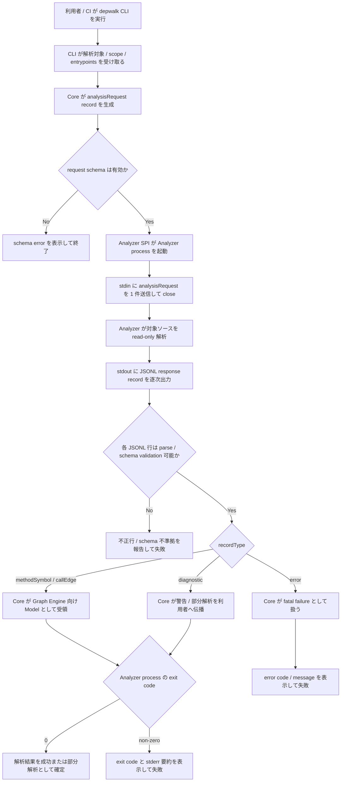
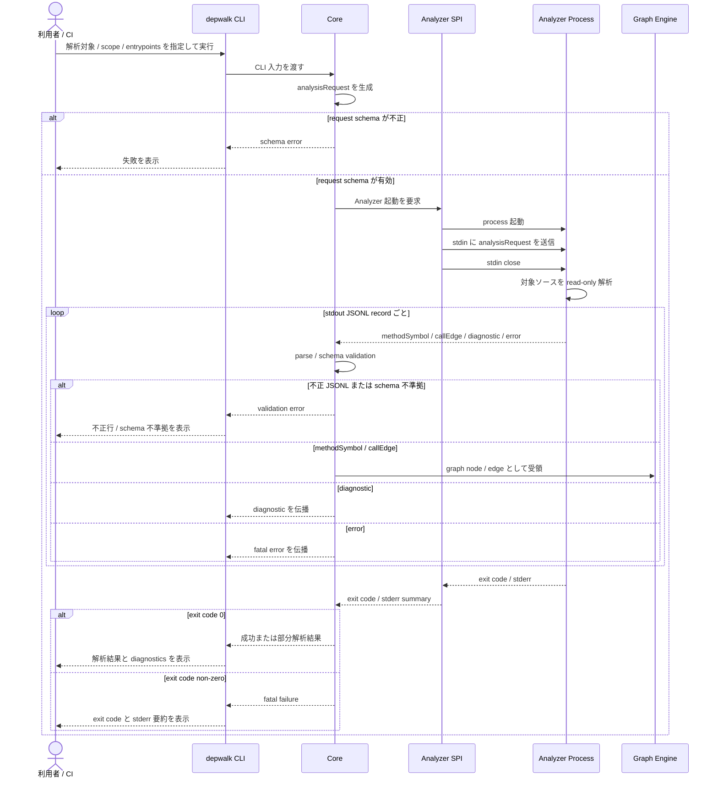

# Analyzer Protocol / SPI feature spec

> Analyzer SPI、JSONL Communication Protocol、Model schema の issue 単位の決定記録。
> durable な契約は `spec-sync` 済み。正本は [Analyzer Protocol / SPI feature doc](../../design/features/analyzer-protocol/DesignDoc_analyzer-protocol.md) と [ADR-0001](../../adr/0001-analyzer-protocol-jsonl-spi.md)。

## メタ情報

- Issue: `#8`
- ステータス: `レビュー済`
- 作成日: 2026-06-13
- 更新日: 2026-06-28
- Branch: `feature/8`
- Owner: Fukuemon

## 設計フェーズ状況

状態は `未着手 / 進行中 / 完了 / レビュー済 / 保留` のいずれか。保留の場合は理由を備考に残す。

| #   | フェーズ                    | 状態   | 最終更新   | 備考                                     |
| --- | --------------------------- | ------ | ---------- | ---------------------------------------- |
| 1   | 起票                        | 完了   | 2026-06-13 | GitHub issue #8 を確認済み               |
| 2   | 下書き                      | 完了   | 2026-06-13 | 本 spec を scaffold                      |
| 3   | 上位文書突合                | 完了   | 2026-06-13 | Design Doc / context / ADR と矛盾なし    |
| 4   | 論点整理                    | 完了   | 2026-06-13 | D1-D5 を初期論点として列挙               |
| 5   | 論点解決                    | 完了   | 2026-06-15 | D1-D5 解決済み                           |
| 6   | Interface / Routing 設計    | 完了   | 2026-06-15 | Analyzer SPI / process interface を定義  |
| 7   | Content / Data 設計         | 完了   | 2026-06-15 | Model schema / JSONL record を定義       |
| 8   | Performance / Security 設計 | 完了   | 2026-06-15 | streaming / read-only / no external send |
| 9   | Test / Metrics 設計         | 完了   | 2026-06-15 | protocol contract test 観点を定義        |
| 10  | 実装分割                    | 完了   | 2026-06-15 | prompts 生成前の分割案を定義             |
| 11  | レビュー済                  | レビュー済 | 2026-06-28 | spec-review PASS。ADR-0002 / issue #12 参照を追記 |

## 上位文書整合

正本 ([PRD](../../PRD.md) / [Design Doc](../../design/DesignDoc.md) / [feature doc](../../design/features/) / [context](../../context/) / ADR) のどの節と、どう整合させたかを記録する。

- PRD 更新要否: 不要 (本プロダクトは統合モード。Why / What は Design Doc に統合)
- Design Doc 更新要否: 反映済 (Q1 状態と feature doc / ADR への正本リンクを更新済み)
- ADR 起票要否: 反映済 (ADR-0001 に JSONL process SPI / versioning 判断を昇格)

| 上位文書    | 節 / 該当箇所                                                                | 整合方針 (継承 / 補足 / 変更提案) |
| ----------- | ---------------------------------------------------------------------------- | --------------------------------- |
| PRD         | 統合モードのため `design/DesignDoc.md` の Why / What を参照                  | 継承                              |
| Design Doc  | Communication Protocol / モジュール責務 / 設計原則 P1-P4 / Open Questions Q1 | 補足                              |
| feature doc | `design/features/analyzer-protocol/DesignDoc_analyzer-protocol.md`           | 反映済                            |
| context     | `context/architecture.md` Package Boundary / Runtime Boundary                | 補足                              |
| context     | `context/testing.md` Protocol contract / test runtime contract               | 反映済                            |
| context     | `context/toolchain.md` Analyzer との通信は JSONL over STDIN/STDOUT に固定    | 継承                              |
| context     | `context/infrastructure.md` CLI / CI 実行、外部送信なし、JSONL 観測可能      | 継承                              |
| ADR         | `adr/0001-analyzer-protocol-jsonl-spi.md`                                    | 反映済                            |

> 現時点で上位文書との矛盾は検出していない。durable な契約は `spec-sync` で feature doc / ADR / context へ反映済み。

## 関連資料

- `design/DesignDoc.md`: Communication Protocol、モジュール責務、設計原則 P1-P4、Open Questions Q1、Future Work Phase1 / Phase5
- `design/features/analyzer-protocol/DesignDoc_analyzer-protocol.md`: Protocol / SPI / Model schema の正本
- `adr/0001-analyzer-protocol-jsonl-spi.md`: JSONL over STDIN/STDOUT、process SPI、versioning 判断の正本
- `context/project.md`: 対象ドメイン `analyzer-protocol`、Issue Tracker、Source of Truth、Branch pattern
- `context/architecture.md`: Core -> Analyzer は Protocol 境界のみ、Core は Analyzer 内部を知らない
- `context/testing.md`: analyzer-protocol に Protocol contract test を置く
- `context/toolchain.md`: JSONL over STDIN/STDOUT 固定。Core 実装言語 / package manager / test framework は ADR-0002 で解決済み
- `adr/0002-core-implementation-foundation.md`: Core 実装言語 / package manager / test framework / 初期 package 境界の正本
- `context/infrastructure.md`: CLI / CI 実行、外部インフラなし、外部送信なし
- `specs/8-analyzer-protocol/requirements.md`: 要求定義
- 関連 issue / ticket: [#8](https://github.com/Fukuemon/depwalk/issues/8)

## 背景

depwalk は Core を言語非依存に保ち、言語ごとの差異を独立プロセスの Analyzer に閉じ込める。Core と Analyzer の結合点は Analyzer SPI、STDIN / STDOUT 上の JSONL、`MethodSymbol` / `CallEdge` / `SourceLocation` である。

この spec は、全 Analyzer が実装する共通契約を issue #8 の決定記録として残す。Phase1 では Java Analyzer がこの契約を最初に実装し、将来の Kotlin / TypeScript / Vue / Go Analyzer 追加時にも Core を変更しない状態を目指す。最新の durable な契約は [Analyzer Protocol / SPI feature doc](../../design/features/analyzer-protocol/DesignDoc_analyzer-protocol.md) を正本とし、本 spec の Interface / Data / Error / Test / Flow は決定時スナップショットとして扱う。

## スコープ

### やること

- Model schema (`MethodSymbol` / `CallEdge` / `SourceLocation`) の JSONL record 形式を定義する
- Core から Analyzer へ渡す解析要求 record を定義する
- Analyzer から Core へ返す応答 record とエラー record を定義する
- Analyzer SPI の起動境界、終了条件、stderr / exit code の扱いを定義する
- schema versioning、未知フィールド、後方互換 / 前方互換の方針を定義する
- Protocol contract test の最小観点を定義する

### やらないこと

- Java 固有の AST 解析、型解決、DI 解決の方式を定義しない
- Graph Engine、Traversal Engine、Output Engine の内部データ構造を定義しない
- Console / DOT / Mermaid の出力表現を定義しない
- Core 実装言語や package manager を確定しない
- Reflection、AspectJ Runtime、実行時 Proxy の動的解析を扱わない

## 要件の解釈

### 実現したいユーザー価値

Core 開発者は、Analyzer の実装言語や内部ライブラリを知らずに、呼び出し関係を `MethodSymbol` / `CallEdge` として受け取れる。Analyzer 実装者は、準拠すべき JSONL record と SPI 境界を一意に参照できる。

### 成功条件

- Q1 の JSONL schema が確定している
- Analyzer SPI の起動、入出力、終了、エラー伝播の契約が確定している
- schema versioning と未知フィールドの扱いが確定している
- Protocol contract test により、Analyzer 実装が schema 準拠か判定できる
- 新しい Analyzer を追加しても Core の内部実装に差分が発生しない方針が説明できる

### 対象ユーザー / 操作主体

- Core 開発者
- Analyzer 実装者
- depwalk CLI を CI / ローカルで実行する開発者

EARS 風で振る舞いを記述する。

- WHEN Core が解析対象と解析範囲を Analyzer に渡す時、Analyzer SPI は schema version を含む解析要求 record を JSONL で送信する。
- WHEN Analyzer がメソッド定義を検出した時、Analyzer は `MethodSymbol` record を JSONL の 1 行として出力する。
- WHEN Analyzer が呼び出し関係を検出した時、Analyzer は caller と callee を参照する `CallEdge` record を JSONL の 1 行として出力する。
- IF Analyzer が schema に準拠しない JSONL を出力した時、Core は不準拠行を報告して解析を失敗として扱う。
- IF Analyzer が未知フィールドを含む JSONL record を出力した時、Core は既知フィールドを採用し、未知フィールドを無視する。
- IF Analyzer プロセスが非ゼロ終了した時、Core は exit code と stderr の要約を利用者に伝播する。
- THE SYSTEM SHALL keep Core independent from Analyzer implementation language and runtime.

## 設計時の論点

現時点で未解決の設計論点はない。D1-D5 は「解決済みの論点」に移動済み。

## 解決済みの論点

- D1: `MethodSymbol` / `CallEdge` / `SourceLocation` は最小共通 schema + optional `metadata` で定義する。`MethodSymbol` は graph node、`CallEdge` は graph edge、`SourceLocation` は独立 record ではなく embedded value object として扱う。Core は `methodId` と `callerMethodId` / `calleeMethodId` の参照関係に依存し、Java 固有情報は `metadata` に置く。
- D2: Core は Analyzer process 起動後、最初に 1 件の `analysisRequest` record を stdin に送る。`analysisRequest` は workspace、対象言語、解析 scope、任意の entrypoint selector、任意の analysis mode を表す。Java 固有の build / classpath / framework hint は共通必須 field にしない。
- D3: Phase1 の Analyzer SPI は最小 process contract とする。Core は 1 request ごとに Analyzer process を 1 つ起動し、stdin に 1 件の `analysisRequest` を送信して close する。Analyzer は stdout に JSONL response record を逐次出力し、stderr は人間向け diagnostics として扱う。exit code `0` は成功、非ゼロは fatal failure とする。session reuse / interactive mode / capability handshake は初期 protocol に含めない。
- D4: 全 record の `schemaVersion` は protocol 全体の version を表す。Phase1 は `"1"` とする。Core は対応済み major version の未知 field を無視し、未対応 major version は拒否する。任意 field の追加は互換変更、必須 field の削除・型変更・意味変更は breaking change として major version bump の対象にする。
- D5: Analyzer は継続可能な問題を `diagnostic` record、致命的な問題を `error` record として stdout に出力する。未解決 symbol や部分解析は `diagnostic` として表現し、valid な `callEdge` には解決済み `methodSymbol` だけを参照させる。不正 JSONL、schema 不準拠、未対応 `schemaVersion` は Analyzer が表現する `error` ではなく Core 側 validation error として扱う。

## 未確定事項

Spec8 の下流 phase をブロックする未確定事項はない。Protocol 契約は特定実装言語に依存しない形で定義済み。
Core 実装言語 / package manager / test framework は [ADR-0002](../../adr/0002-core-implementation-foundation.md) で解決済みであり、Protocol 契約の正本には含めない。

| 未確定事項 | 決定者 | 期限 | Spec8 への影響 |
| ---------- | ------ | ---- | -------------- |
| なし | - | - | Core 実装基盤は ADR-0002 で解決済み。Go 側 parser / validator / contract test 実装は issue #12 で扱う |

## 実装対象

正規 target は `context/project.md` の対象ドメイン一覧を正本とする。

| モジュール          | 実装有無 | 主な責務                                                                |
| ------------------- | :------: | ----------------------------------------------------------------------- |
| `traversal`         |    -     | 本 spec では Model の consumer として参照のみ                           |
| `output`            |    -     | 本 spec では JSON 出力 schema と混同しない                              |
| `analyzer-protocol` |    ◯     | Analyzer SPI、JSONL Communication Protocol、Model schema、contract test |
| `java-analyzer`     |    -     | 本 spec で定義した契約を実装する後続 feature                            |

## 機能仕様

### User Flow

1. Core は CLI から受け取った解析対象と解析範囲を `analysisRequest` record に正規化する。
2. Analyzer SPI は対象 Analyzer を独立プロセスとして起動し、最初に 1 件の `analysisRequest` record を JSONL で stdin に送って close する。
3. Analyzer は対象ソースを read-only で解析し、`MethodSymbol` / `CallEdge` / diagnostic record を stdout に JSONL で出力する。
4. Core は stdout の各行を schema 検証し、Graph Engine が扱える Model として受領する。
5. Core は Analyzer の終了コードと stderr を確認し、成功 / 失敗 / 部分解析の結果を確定する。
6. 複数 request が必要な場合、Core は request ごとに Analyzer process を起動する。

### Reuse Policy

- Analyzer 固有の処理は各 Analyzer 実装に閉じ込める。
- Core が再利用してよいのは Analyzer SPI、Protocol parser / validator、Model schema のみとする。
- Java 固有フィールドは共通 Model の必須フィールドに昇格しない。必要な場合は optional metadata または language-specific extension として扱う。

### Performance

- JSONL は 1 行 1 record の streaming とし、Core は全出力を一括読み込みしない。
- 大規模コードベースを想定し、Analyzer は `MethodSymbol` / `CallEdge` を逐次出力できる契約にする。
- 具体的な runtime budget は Core 実装言語と Analyzer 実装後に測定値で確定する。

### Routing / URL State

- 非該当。depwalk は CLI ツールであり、Web routing / URL state を持たない。

### Content / Assets

- 非該当。静的 asset やコンテンツ配信は扱わない。

### UI Reuse

- 非該当。IDE Plugin / Web UI は Non Goals。

### Testing

- analyzer-protocol に Protocol contract test を置く。
- contract test は `analysisRequest` / response record の必須フィールド、未知フィールド、schema version、不正 JSONL、Analyzer error record を検証する。
- Java Analyzer はこの contract test に準拠する実装として検証する。

## Interface 設計

この節は 2026-06-15 時点の決定時スナップショット。Protocol / SPI / Model schema の最新正本は [Analyzer Protocol / SPI feature doc](../../design/features/analyzer-protocol/DesignDoc_analyzer-protocol.md)。

### UI / API / Event Interface

- UI: 非該当。
- Web API endpoint: 非該当。
- Process interface: Core は 1 request ごとに Analyzer を独立プロセスとして起動し、stdin / stdout / stderr / exit code を SPI 境界として扱う。
- Event interface: JSONL の各行を record event として扱う。

#### Analyzer process contract

| 境界      | 契約                                                                                     |
| --------- | ---------------------------------------------------------------------------------------- |
| 起動      | Core は 1 `analysisRequest` ごとに Analyzer process を 1 つ起動する                      |
| stdin     | Core は最初に 1 件の `analysisRequest` record を JSONL で送信し、その後 stdin を close する |
| stdout    | Analyzer は `methodSymbol` / `callEdge` / `diagnostic` / `error` record を JSONL で逐次出力する |
| stderr    | 人間向け diagnostics として扱う。Core は stderr を protocol record として parse しない   |
| exit code | `0` は成功、非ゼロは fatal failure として扱う                                             |

複数 request は Core が request ごとに Analyzer process を起動して扱う。Analyzer process reuse、session mode、interactive mode、capability handshake は Phase1 の対象外とする。timeout、最大 stderr サイズ、最大 record サイズは Core 実装時の runtime config とし、JSONL protocol field には含めない。

### Props / Request / Response

#### Versioning / compatibility

`schemaVersion` は record 種別ごとの個別 version ではなく、protocol 全体の version を表す。Phase1 の `schemaVersion` は `"1"` とする。

| 変更種別              | 互換性 | 扱い                                                       |
| --------------------- | ------ | ---------------------------------------------------------- |
| 任意 field の追加     | 互換   | record の受信者は未知 field を無視し、既知 field だけで処理を継続する |
| `metadata` 内の追加   | 互換   | record の受信者は必要な既知 field のみを採用し、Core の graph 構築は `metadata` に依存しない |
| 必須 field の追加     | 非互換 | major version bump の対象                                  |
| 必須 field の削除     | 非互換 | major version bump の対象                                  |
| field 型の変更        | 非互換 | major version bump の対象                                  |
| field 意味論の変更    | 非互換 | major version bump の対象                                  |
| record type の削除    | 非互換 | major version bump の対象                                  |

record の受信者は対応済み major version の record だけを受け付ける。未対応 major version の record を受け取った場合、受信者は schema version mismatch として解析を失敗させる。Handshake / capability negotiation は Phase1 では採用しないため、受信者は各 JSONL 行の `schemaVersion` と `recordType` で validation 対象を判断する。

#### Core -> Analyzer request

| 項目            | 必須/任意 | 説明                                                 |
| --------------- | --------- | ---------------------------------------------------- |
| `schemaVersion` | 必須      | JSONL record の schema version                       |
| `recordType`    | 必須      | `analysisRequest`                                    |
| `requestId`     | 必須      | 解析要求を識別する ID                                |
| `workspaceRoot` | 必須      | 解析対象 repository root                             |
| `language`      | 必須      | 対象言語。Phase1 は `java`                           |
| `include`       | 任意      | `workspaceRoot` からの相対 path glob 配列。未指定時は Analyzer の既定範囲を解析する |
| `exclude`       | 任意      | `workspaceRoot` からの相対除外 path glob 配列 |
| `entrypoints`   | 任意      | 起点 method selector 配列。未指定または空配列の場合は scope 全体の call graph を生成する |
| `analysisMode`  | 任意      | `fullGraph` または `reachableFromEntrypoints`。未指定時は `fullGraph` |
| `metadata`      | 任意      | 言語固有または Analyzer 固有の hint。Core / 共通 protocol の必須処理はこの field に依存しない |

Core は 1 Analyzer process につき 1 件の `analysisRequest` を送る。複数 request / session reuse / incremental analysis は D2-D3 では採用しない。Java 固有の build 設定、classpath、framework hint は共通必須 field にしない。

#### Scope / entrypoint selector contract

`include` / `exclude` は `workspaceRoot` からの相対 path glob とする。path separator は `/` に正規化し、絶対 path、空文字、`..` を含む path は schema 不準拠として扱う。`exclude` は `include` で選択された候補から除外する。

| pattern | 意味                         |
| ------- | ---------------------------- |
| `*`     | path segment 内の任意文字列  |
| `?`     | path segment 内の任意 1 文字 |
| `**`    | 0 個以上の path segment      |

`entrypoints` の各要素は method selector object とする。

| 項目            | 必須/任意 | 説明                                                                                                   |
| --------------- | --------- | ------------------------------------------------------------------------------------------------------ |
| `qualifiedName` | 必須      | 表示・照合用の完全修飾名。例: `com.example.UserService.findById`                                       |
| `signature`     | 任意      | overload を一意化する正規化済み signature。省略時に候補が複数あれば Analyzer は `diagnostic` を出力する |

`entrypoints` が未指定または空配列の場合、Analyzer は scope 全体の call graph 生成要求として扱う。`analysisMode = reachableFromEntrypoints` かつ `entrypoints` が空の場合は schema 不準拠ではなく、scope 全体を起点集合として扱う。

#### Analyzer -> Core response

| record         | Core 対応 | 出現条件 / 説明                                                            |
| -------------- | --------- | -------------------------------------------------------------------------- |
| `methodSymbol` | 必須      | graph node として扱う method / constructor / function が検出された場合に出現する |
| `callEdge`     | 必須      | 解決済み caller / callee の呼び出し関係が検出された場合に出現する          |
| `diagnostic`   | 必須      | 未解決 symbol、部分解析、警告、非致命的エラーがある場合に出現する          |
| `error`        | 必須      | 致命的エラー時に出現する。出力後、Analyzer は非ゼロ終了する                |

`Core 対応 = 必須` は Core parser / validator がその record type を実装するという意味であり、すべての解析結果にその record が 1 件以上出ることを意味しない。対象 scope に検出対象がない場合、Analyzer は `methodSymbol` / `callEdge` を 0 件で終了できる。

#### `methodSymbol` record

`methodSymbol` は呼び出し graph の node を表す。Core が依存する必須 field は graph 構築・識別・表示に必要な最小限に限定する。

| 項目             | 必須/任意 | 説明                                                                                     |
| ---------------- | --------- | ---------------------------------------------------------------------------------------- |
| `schemaVersion`  | 必須      | JSONL record の schema version                                                           |
| `recordType`     | 必須      | `methodSymbol`                                                                           |
| `methodId`       | 必須      | Analyzer が決定的に生成する stable ID。`callEdge` から参照する                           |
| `language`       | 必須      | 対象言語。Phase1 は `java`                                                               |
| `symbolKind`     | 必須      | symbol 種別。例: `method` / `constructor` / `function` / `initializer`                   |
| `qualifiedName`  | 必須      | 表示・debug 用の完全修飾名。例: `com.example.UserService.findById`                       |
| `signature`      | 必須      | overload を区別できる正規化済み signature。例: `findById(java.lang.Long):User`           |
| `sourceLocation` | 任意      | 定義位置。外部 library、生成コード、型解決のみの symbol など位置を持てない場合は省略する |
| `metadata`       | 任意      | Java 固有情報や Analyzer 固有情報。Core の graph 構築はこの field に依存しない           |

`methodId` の stable は、同一 Analyzer 実装 version、同一 `analysisRequest`、同一 source content、同一 `qualifiedName` / `signature` に対して決定的に再生成できることを指す。global UUID や Analyzer version をまたぐ永続 ID は要求しない。

#### `callEdge` record

`callEdge` は caller から callee への呼び出し関係を表す。valid な `callEdge` は、`callerMethodId` と `calleeMethodId` が解決済み `methodSymbol` を参照することを前提にする。未解決 symbol は `diagnostic` として表現する。

| 項目             | 必須/任意 | 説明                                                                 |
| ---------------- | --------- | -------------------------------------------------------------------- |
| `schemaVersion`  | 必須      | JSONL record の schema version                                       |
| `recordType`     | 必須      | `callEdge`                                                           |
| `edgeId`         | 必須      | Analyzer が決定的に生成する stable ID。重複排除と期待値比較に使う   |
| `callerMethodId` | 必須      | 呼び出し元の `methodSymbol.methodId`                                 |
| `calleeMethodId` | 必須      | 呼び出し先の `methodSymbol.methodId`                                 |
| `callSite`       | 任意      | 呼び出し式の source 位置。正確な位置が取得できない場合は省略する     |
| `metadata`       | 任意      | dispatch 種別、解析 confidence、言語固有 call kind などの拡張情報    |

`edgeId` の stable は、同一 Analyzer 実装 version、同一 `analysisRequest`、同一 source content、同一 `callerMethodId` / `calleeMethodId` / `callSite` に対して決定的に再生成できることを指す。

#### `SourceLocation` value object

`SourceLocation` は独立 JSONL record ではなく、`methodSymbol.sourceLocation` または `callEdge.callSite` に埋め込む value object とする。

| 項目          | 必須/任意 | 説明                                                                 |
| ------------- | --------- | -------------------------------------------------------------------- |
| `path`        | 必須      | `workspaceRoot` からの相対 path。絶対 path は環境差が出るため使わない |
| `startLine`   | 必須      | 1-based の開始行                                                     |
| `startColumn` | 任意      | 1-based の開始 column                                                |
| `endLine`     | 任意      | 1-based の終了行                                                     |
| `endColumn`   | 任意      | 1-based の終了 column                                                |

#### `diagnostic` record

`diagnostic` は Analyzer が検出した継続可能な問題や部分解析情報を表す。Core は `diagnostic` を利用者へ観測可能な形で伝播するが、`diagnostic` だけを理由に解析全体を fatal failure として扱わない。

| 項目             | 必須/任意 | 説明                                                                 |
| ---------------- | --------- | -------------------------------------------------------------------- |
| `schemaVersion`  | 必須      | JSONL record の schema version                                       |
| `recordType`     | 必須      | `diagnostic`                                                         |
| `severity`       | 必須      | `info` / `warning` / `partialFailure`                                |
| `code`           | 必須      | 機械判定可能な診断 code。例: `UNRESOLVED_SYMBOL`                     |
| `message`        | 必須      | 人間向けの説明                                                       |
| `sourceLocation` | 任意      | 関連する source 位置                                                 |
| `relatedMethodId`| 任意      | 関連する `methodSymbol.methodId`                                     |
| `metadata`       | 任意      | 言語固有または Analyzer 固有の補足情報                               |

未解決 symbol は `diagnostic` として出力する。Analyzer は未解決 callee を参照する `callEdge` を valid edge として出力しない。

#### `error` record

`error` は Analyzer が解析を継続できない致命的な問題を表す。Analyzer が `error` を出力した場合、Analyzer process は非ゼロ exit code で終了する。

| 項目             | 必須/任意 | 説明                                   |
| ---------------- | --------- | -------------------------------------- |
| `schemaVersion`  | 必須      | JSONL record の schema version         |
| `recordType`     | 必須      | `error`                                |
| `code`           | 必須      | 機械判定可能な error code              |
| `message`        | 必須      | 人間向けの説明                         |
| `sourceLocation` | 任意      | 関連する source 位置                   |
| `metadata`       | 任意      | 言語固有または Analyzer 固有の補足情報 |

不正 JSONL、schema 不準拠、未対応 `schemaVersion` は Analyzer が表現する `error` ではなく、Core が Analyzer stdout を validate した結果として検出する Core 側 validation error とする。

## Content / Data 設計

この節は 2026-06-15 時点の決定時スナップショット。Data model の最新正本は [Analyzer Protocol / SPI feature doc](../../design/features/analyzer-protocol/DesignDoc_analyzer-protocol.md)。

### 保存・管理するデータ

- 永続データは持たない。
- Core は Analyzer から受け取った `methodSymbol` / `callEdge` をプロセス内の Graph Engine へ渡す。
- `SourceLocation` は独立 record ではなく、`methodSymbol.sourceLocation` または `callEdge.callSite` の embedded value object として管理する。
- Java 固有情報や Analyzer 固有情報は `metadata` に保持できる。ただし Core の graph 構築は `metadata` に依存しない。
- Core は `diagnostic` を利用者へ伝播するが、`diagnostic` だけを理由に graph 構築を失敗させない。
- Core は `error` record または Analyzer 非ゼロ終了を fatal failure として扱う。
- JSONL schema と contract test fixture は repository 内の実装対象として管理する。

### コンテンツ配置 / package / route

- package 配置は Core 実装言語確定後に決める。
- spec 上の分割単位は `analyzer-protocol` とする。
- route は非該当。

## Performance / Security 設計

この節は 2026-06-15 時点の決定時スナップショット。Process SPI と JSONL streaming 判断の正本は [ADR-0001](../../adr/0001-analyzer-protocol-jsonl-spi.md)。

### Performance

- JSONL は streaming 前提とし、Analyzer は解析結果を逐次出力できる。
- Core は stdout の各行を逐次 parse / validate する。
- Analyzer の timeout、最大 stderr サイズ、最大 record サイズは Core 実装時の runtime config とし、JSONL protocol field には含めない。

### Security / Privacy

- Analyzer は対象ソースを read-only で読む。
- Core / Analyzer は解析対象ソースや解析結果を外部送信しない。
- secret / token は不要。
- Analyzer 実行は利用者が指定したローカルまたは CI 環境内で完結する。

## Error / Fallback 設計

この節は 2026-06-15 時点の決定時スナップショット。`diagnostic` / `error` と Core validation error の境界は [Analyzer Protocol / SPI feature doc](../../design/features/analyzer-protocol/DesignDoc_analyzer-protocol.md) を正本とする。

### エラーケース

| #   | ケース                                      | ユーザーへの見せ方                                         | リカバリ                                       |
| --- | ------------------------------------------- | ---------------------------------------------------------- | ---------------------------------------------- |
| 1   | Analyzer が不正 JSONL を出力する            | 不正行の record type / 行番号 / parse error を報告して失敗 | Analyzer 実装を contract test で修正する       |
| 2   | Analyzer が schema 不準拠 record を出力する | 不足フィールドまたは型不一致を報告して失敗                 | schema version と必須フィールドを修正する      |
| 3   | Analyzer が非ゼロ終了する                   | exit code と stderr 要約を表示して失敗                     | Analyzer stderr をもとに原因を修正する         |
| 4   | Analyzer が未知フィールドを出力する         | 既知フィールドを採用し、未知フィールドは無視する           | schema version policy に従い後続で採用判断する |
| 5   | 型解決不能などの部分解析が発生する          | diagnostic record として警告を残し、継続可否を判定する     | Analyzer 側の解析精度を改善する                |
| 6   | Analyzer が未対応 `schemaVersion` を出力する | schema version mismatch として失敗                         | Core / Analyzer の protocol version を揃える   |
| 7   | Analyzer が `error` record を出力する       | error code / message / source location を表示して失敗       | Analyzer 実装または解析対象の前提を修正する    |
| 8   | Analyzer が未解決 symbol を検出する         | `diagnostic` record として警告を表示し、解決済み edge のみ採用する | Analyzer 側の型解決または利用者の解析範囲を見直す |

### Fallback

- schema 準拠の既知フィールドが揃っている場合、Core は未知フィールドを無視して処理を継続する。
- 未対応 major version の record は schema version mismatch として失敗する。
- 致命的な schema 不準拠、不正 JSONL、Analyzer 非ゼロ終了は失敗として扱う。
- Analyzer が timeout した場合、Core は Analyzer process を終了し、timeout と stderr 要約を利用者へ伝播して失敗として扱う。
- 部分解析は diagnostic record として表現し、Core が利用者に観測可能な形で伝播する。
- `error` record は fatal failure として扱い、Analyzer process は非ゼロ exit code で終了する。
- 未解決 symbol は `diagnostic` として表現し、未解決 callee を参照する `callEdge` は valid edge として出力しない。

## テスト / 評価方針

この節は 2026-06-15 時点の決定時スナップショット。Protocol contract test の横断規約は [context/testing.md](../../context/testing.md#protocol-contract-test) を正本とする。

### テスト観点

- valid `analysisRequest` record を Analyzer が受け取れること
- `analysisRequest` の `include` / `exclude` が `workspaceRoot` からの相対 path glob 配列として扱われること
- `include` / `exclude` が `*` / `?` / `**` の glob として扱われ、絶対 path、空文字、`..` を含む path が schema 不準拠として拒否されること
- `entrypoints` の method selector object が `qualifiedName` 必須、`signature` 任意として検証されること
- `analysisRequest.entrypoints` 未指定または空配列の場合に、scope 全体の call graph 生成要求として扱われること
- `analysisRequest.analysisMode` 未指定時に `fullGraph` として扱われること
- Core が `analysisRequest` 送信後に stdin を close すること
- Analyzer stdout の JSONL record が逐次 parse / validate されること
- Analyzer stderr が protocol record として parse されないこと
- exit code `0` を成功、非ゼロを fatal failure として扱うこと
- 複数 request が必要な場合、Core が request ごとに Analyzer process を起動すること
- `methodSymbol` / `callEdge` が 0 件の正常解析を success として扱えること
- `methodId` / `edgeId` が同一 Analyzer 実装 version、同一 request、同一 source content で決定的に再生成されること
- `schemaVersion` が protocol 全体 version として全 record に必須であること
- Analyzer が `analysisRequest` の未知 field を無視できること
- Core が Analyzer response record の未知 field を無視できること
- 未対応 major version の record を Core が schema version mismatch として拒否できること
- 必須 field の削除、型変更、意味変更を非互換変更として contract test で検出できること
- valid `diagnostic` record を Core が利用者へ伝播し、`diagnostic` だけを理由に fatal failure としないこと
- valid `error` record を Core が fatal failure として扱うこと
- Analyzer が `error` record 出力後に非ゼロ exit code で終了すること
- 未解決 symbol が `diagnostic` として表現され、未解決 callee を参照する `callEdge` が valid edge として扱われないこと
- valid `methodSymbol` / `callEdge` record と embedded `SourceLocation` value object を Core が parse / validate できること
- `SourceLocation.path` が `workspaceRoot` からの相対 path であること
- Java 固有情報を `metadata` に含む record でも、Core が共通必須 field のみで graph を構築できること
- 未知フィールドを含む record で受信者が既知フィールドを採用できること
- schema 不準拠 record を拒否できること
- 不正 JSONL を parse error として報告できること
- Analyzer の非ゼロ終了と stderr を Core が伝播できること
- Java Analyzer が protocol contract test を通過できること

### 計測指標

- contract test pass rate
- schema validation error count
- Analyzer process exit status
- JSONL records processed per second (実装後に計測)
- peak memory while streaming parse (実装後に計測)

## フロー / シーケンス

この節は 2026-06-15 時点の決定時スナップショット。feature 内部の durable flow は [Analyzer Protocol / SPI feature doc](../../design/features/analyzer-protocol/DesignDoc_analyzer-protocol.md) を正本とする。

この spec では、CLI 実行から `analysisRequest` 送信、Analyzer stdout validation、Graph 受領、diagnostic / error / exit code 分岐までを図示する。

### Flowchart (ユーザー操作起点)

### Sequence

## 実装分割

### 実装タスク案

| Phase | 対象                | 概要                                                          | 依存   |
| ----- | ------------------- | ------------------------------------------------------------- | ------ |
| P1    | `analyzer-protocol` | schema の record 種別と必須フィールドを定義する               | D1     |
| P2    | `analyzer-protocol` | Core -> Analyzer request と process SPI を定義する            | D2, D3 |
| P3    | `analyzer-protocol` | versioning / unknown field / error policy を定義する          | D4, D5 |
| P4    | `analyzer-protocol` | Protocol contract test の fixture と期待結果を定義する        | P1-P3  |
| P5    | `java-analyzer`     | Java Analyzer が protocol を実装するための handoff を整理する | P1-P4  |

### prompts 生成方針

- prompts は `analyzer-protocol` を中心に生成する。
- `java-analyzer` 用 prompt は contract 確定後に別 spec または後続 prompt へ分ける。
- `traversal` / `output` は consumer として Model を参照するため、本 spec の prompts では実装対象にしない。

## 上位資料からの変更点

本 spec で PRD / Design Doc / feature doc / context / 既存 ADR から変更・追加した内容を、反映先別に記録する。`spec-track` / `spec-sync` で更新する。

### PRD への影響

| 対象節 | 変更内容                                                   | 理由                                   |
| ------ | ---------------------------------------------------------- | -------------------------------------- |
| なし   | 現時点では Design Doc 統合モードの Why / What を変更しない | 既存の S5 / P1-P4 の詳細化で足りるため |

### Design Doc への影響

| 対象節                 | 変更内容                                                              | 理由                                                                      |
| ---------------------- | --------------------------------------------------------------------- | ------------------------------------------------------------------------- |
| Open Questions Q1      | 反映済: Q1 を feature doc / ADR への正本リンク付きで `解決済み` に更新 | D1-D5 で schema / SPI / versioning / error policy を解決したため          |
| 詳細の所在             | 反映済: Analyzer Protocol / SPI feature doc を追加                    | Design Doc には landscape だけを残し、詳細は feature doc / ADR に移すため |
| Communication Protocol | 反映済: graph model に加えて `diagnostic` / `error` を Protocol diagnostics として受領する表現に更新 | D5 で diagnostics / error record を protocol に含めたため                 |
| Communication Protocol | 反映済: 具体 schema / SPI 方針への正本リンクを feature doc / ADR へ更新 | durable な契約詳細は feature doc / ADR に移すため                         |

### feature doc への影響

| 対象 doc / 節                                                      | 変更内容                                             | 理由                                          |
| ------------------------------------------------------------------ | ---------------------------------------------------- | --------------------------------------------- |
| `design/features/analyzer-protocol/DesignDoc_analyzer-protocol.md` | 反映済: Q1 / SPI / Model schema / versioning / contract test 観点を新規作成 | durable な契約は feature doc を正本にするため |

### context への影響

| 対象 doc / 節             | 変更内容                                         | 理由                                       |
| ------------------------- | ------------------------------------------------ | ------------------------------------------ |
| `context/architecture.md` | 反映済: Analyzer Protocol / SPI feature doc への正本リンクを追加 | 既存の Protocol 境界方針と整合しているため |
| `context/toolchain.md`    | 反映済: ADR-0001 と feature doc への正本リンクを追加             | JSONL over STDIN/STDOUT の判断根拠と schema 正本を明示するため |
| `context/testing.md`      | 反映済: protocol contract test の正本観点を追記                 | 横断テスト規約として残すため |
| `context/testing.md`      | 反映済: `methodSymbol` / `callEdge` の共通必須 field、stable ID 決定性、embedded `SourceLocation`、`metadata` 非依存性を contract test 観点に追加 | D1 で共通 schema の最小必須 field を確定したため。source: spec-resolve D1 |
| `context/testing.md`      | 反映済: `analysisRequest` の必須 field、path glob、entrypoint selector object、entrypoints 未指定時、`analysisMode` default を contract test 観点に追加 | D2 で Core -> Analyzer request の最小粒度を確定したため。source: spec-resolve D2 |
| `context/testing.md`      | 反映済: stdin close、stdout JSONL streaming、stderr diagnostics、exit code、複数 request 時の process 分離を contract test 観点に追加 | D3 で Analyzer SPI の最小 process contract を確定したため。source: spec-resolve D3 |
| `context/testing.md`      | 反映済: `schemaVersion`、未知 field、未対応 major version、breaking change の contract test 観点を追加 | D4 で versioning / compatibility policy を確定したため。source: spec-resolve D4 |
| `context/testing.md`      | 反映済: `diagnostic` / `error` record、未解決 symbol、Core validation error と Analyzer error の境界を contract test 観点に追加 | D5 で error / diagnostic policy を確定したため。source: spec-resolve D5 |

### ADR の新規 / 更新

| ADR ID | 変更内容                                                                                               | 理由                                   |
| ------ | ------------------------------------------------------------------------------------------------------ | -------------------------------------- |
| ADR-0001 | 反映済: Analyzer 通信を JSONL over STDIN/STDOUT とする判断、SPI 境界、versioning 方針を ADR 化 | 長期参照価値のあるアーキ判断になるため |
| ADR-0001 | 反映済: `1 analysisRequest = 1 Analyzer process` を Phase1 の Analyzer SPI とし、session reuse / incremental analysis を初期 protocol に含めない判断を ADR 化 | Analyzer 実装から session state 管理を除外し、初期 protocol と contract test を単純に保つため。source: spec-resolve D2/D3 |
| ADR-0001 | 反映済: 全 record の `schemaVersion` を protocol 全体 version として扱い、未知 field を互換、必須 field の削除・型変更・意味変更を breaking change とする判断を ADR 化 | Core / Analyzer の version mismatch を検出し、複数 Analyzer の互換性を一貫して扱うため。source: spec-resolve D4 |

## レビュー

`spec-review` (fresh-context evaluator) の最新結果。完全な記録は `review.md` を参照。

| 日付 | 結果 (PASS / NEEDS_WORK) | 指摘要点 | 対応 |
| ---- | ------------------------ | -------- | ---- |
| 2026-06-15 | NEEDS_WORK | 未確定事項に期限 / 決定者がない。`反映済` 行と feature doc / ADR への正本ハンドオフ未完了が衝突。 | 対応済: 未確定事項を期限 / 決定者付きで管理し、feature doc / ADR / context へ正本ハンドオフ。再 review 待ち |
| 2026-06-15 | PASS | 指摘なし。上位文書整合、未解決論点、実装対象、必須節、EARS、正本境界を満たす。 | 完了 |

## 変更履歴

| 日付       | 変更者 | 変更内容               |
| ---------- | ------ | ---------------------- |
| 2026-06-28 | Codex  | ADR-0002 / issue #12 への参照を追加し、Core 実装基盤未確定事項を解決済みとして整理 |
| 2026-06-15 | Codex  | spec-sync で feature doc / ADR / context へ正本ハンドオフ |
| 2026-06-15 | Codex  | flow / sequence diagram を追加 |
| 2026-06-13 | Codex  | 初版 draft spec を追加 |

## 備考

- Appendix は追加しない。Web API endpoint、永続データ層、ロール / 権限、画面、E2E 対象 UI が本 spec の直接スコープにないため。
