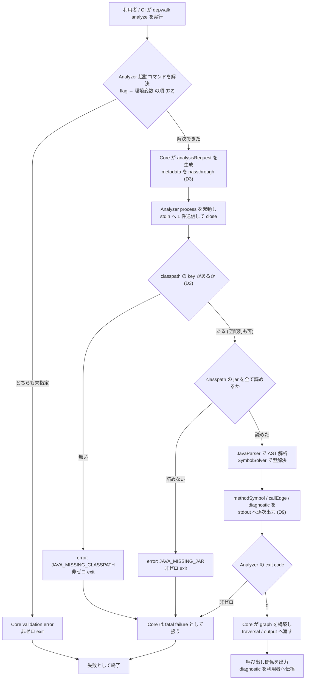
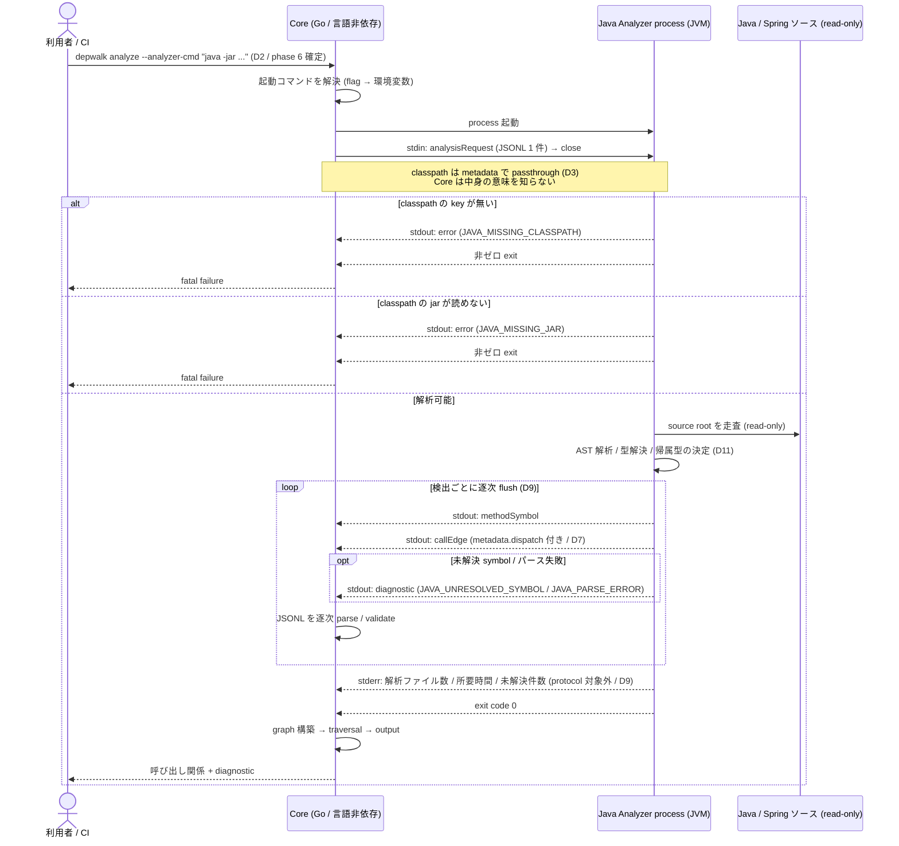
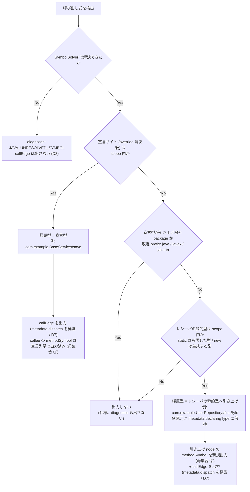

# Java Analyzer feature spec

> issue #9 の spec。Java/Spring ソースの AST 解析・型解決・CallGraph 生成を担う言語別 Analyzer の設計と実装分割を管理する。
> 共通契約 (SPI / JSONL Protocol / Model schema) の正本は [Analyzer Protocol / SPI feature doc](../../design/features/analyzer-protocol/DesignDoc_analyzer-protocol.md) と [ADR-0001](../../adr/0001-analyzer-protocol-jsonl-spi.md)。本 spec は契約を変更せず、Java 側の実装方式を決める。
> durable な設計成果の正本は [feature doc](../../design/features/java-analyzer/DesignDoc_java-analyzer.md)。本 spec は issue 単位の決定経緯・受け入れ基準・実装分割の記録。

## メタ情報

- Issue: `#9`
- ステータス: `Done`
- 作成日: 2026-07-11
- 更新日: 2026-07-12
- Branch: `feature/9`
- Owner: Fukuemon

## 設計フェーズ状況

状態は `未着手 / 進行中 / 完了 / レビュー済 / 保留` のいずれか。保留の場合は理由を備考に残す。

| #   | フェーズ                     | 状態       | 最終更新   | 備考                                                                                                                                                           |
| --- | ---------------------------- | ---------- | ---------- | -------------------------------------------------------------------------------------------------------------------------------------------------------------- |
| 1   | 起票                         | 完了       | 2026-07-11 | GitHub issue #9 / requirements.md を確認済み                                                                                                                   |
| 2   | 下書き                       | レビュー済 | 2026-07-11 | scaffold 完了。spec-review PASS (4 回目)                                                                                                                       |
| 3   | 上位文書突合                 | 完了       | 2026-07-11 | S5 / P4 の測定方法に齟齬を検出し Design Doc への変更提案として登録 (phase: sync で反映)。feature doc / context / ADR とは矛盾なし                              |
| 4   | 論点整理                     | 完了       | 2026-07-11 | D1-D10 を初期論点として列挙。D11 は clarify 中に spec-review が検出し追加起票                                                                                  |
| 5   | 論点解決                     | レビュー済 | 2026-07-11 | D1-D11 をすべて決定 (未決ゼロ)。D11 は spec-review が検出した追加論点。Q2 と性能数値目標は決定者・期限付きで保留管理。spec-review PASS (5 回目)                |
| 5.5 | 図 (phase: diagram)          | レビュー済 | 2026-07-11 | 利用者起点フロー / Core ↔ Analyzer シーケンス / 帰属型決定フロー (D11) の 3 図を生成し Mermaid CLI で検証。User Flow 節も記入。spec-review PASS (3 回目)       |
| 6   | Interface / Routing 設計     | レビュー済 | 2026-07-11 | `--analyzer-cmd` / `DEPWALK_ANALYZER_CMD` / `--analyzer-meta` / metadata key (`classpath` / `liftExcludePackages`) を確定。実装言語は Java を維持              |
| 7   | Content / Data 設計          | レビュー済 | 2026-07-11 | 永続データなし / `analyzers/java/` 配置 / fixture 配置を確定                                                                                                   |
| 8   | Performance / Security 設計  | レビュー済 | 2026-07-11 | 方式 (streaming / AST 破棄 / stderr 計測) と Fallback 方針を記載。数値目標は実測 baseline 後                                                                   |
| 9   | Test / Metrics 設計          | レビュー済 | 2026-07-11 | 三層 (Java unit / Go fake / 実 jar E2E) の feature 固有観点と計測指標を記載                                                                                    |
| 9.5 | 正本ハンドオフ (phase: sync) | レビュー済 | 2026-07-11 | feature doc 新規作成 / DesignDoc S5・P4 / ADR-0003 / context 5 ファイルへ反映。spec-review PASS (3 回目)                                                       |
| 10  | 実装分割                     | レビュー済 | 2026-07-12 | prompts 4 件を生成 (P1 並列 2 + P2 直列 2)。#7 (output) merge 済みの codebase と突合し P1_01 の traversal / output 境界表現を明確化。spec-review PASS (2 回目) |
| 11  | レビュー済                   | レビュー済 | 2026-07-12 | prompts gate の fresh-context review (2 回目) が全観点 PASS — 最終レビューを兼ねる。非ブロッキング補足 1 件 (E2E 配置先) は実装時に確定                        |

## 上位文書整合

正本 ([PRD](../../PRD.md) / [Design Doc](../../design/DesignDoc.md) / [feature doc](../../design/features/) / [context](../../context/) / ADR) のどの節と、どう整合させたかを記録する。

- PRD 更新要否: 不要 (本プロダクトは統合モード。Why / What は Design Doc に統合)
- Design Doc 更新要否: **反映済** (① 「詳細の所在 → Feature 設計」の Java Analyzer 行を feature doc へリンクした ② 成功条件 S5 / 設計原則 P4 の測定方法を「2 つ目以降の Analyzer 追加時に Core 無変更」と明確化した。phase: sync で反映済み、2026-07-11)
- ADR 起票要否: **反映済** (ADR-0003: Analyzer 起動コマンドを言語非依存な文字列として CLI flag + 環境変数で解決する = D2。phase: sync で起票済み、2026-07-11)。D1 (build tool / JDK / 配布形態) は toolchain の確定値として `context/toolchain.md` に記録し、ADR にはしない

| 上位文書                       | 節 / 該当箇所                                                         | 整合方針 (継承 / 補足 / 変更提案)                                                                                                                                     |
| ------------------------------ | --------------------------------------------------------------------- | --------------------------------------------------------------------------------------------------------------------------------------------------------------------- |
| PRD                            | 統合モードのため非該当                                                | 継承                                                                                                                                                                  |
| Design Doc                     | モジュール責務 (Java Analyzer) / 設計原則 P2・P3 / S4                 | 継承 (Analyzer は独立プロセス、Protocol のみで Core と結合)                                                                                                           |
| Design Doc                     | 成功条件 S5 / 設計原則 P4                                             | 変更提案 (測定方法を「**2 つ目以降**の言語 Analyzer 追加時に Core へ差分が出ないこと」と明確化する。初号機導入時の言語非依存な初回配線は対象外。反映済 2026-07-11)    |
| Design Doc                     | Future Work Phase1〜3 / Open Questions Q2                             | 補足 (Phase1 の範囲を確定し、Phase2/3 の段階導入境界を宣言する。反映済 2026-07-11)                                                                                    |
| Design Doc                     | 詳細の所在 → Feature 設計 (Java Analyzer)                             | 変更提案 (feature doc を作成しリンクした。反映済 2026-07-11)                                                                                                          |
| feature doc: analyzer-protocol | Model schema / process contract / versioning                          | 継承 (契約は変更しない。Java 側は準拠側として実装する。反映済 2026-07-11)                                                                                             |
| feature doc: java-analyzer     | Java Analyzer の durable な設計成果 (正本)                            | 新規作成 (本 spec の D1-D11 を feature doc へハンドオフ。反映済 2026-07-11)                                                                                           |
| context: architecture          | Package Boundary (`analyzers/<language>/`) / Runtime Boundary         | 継承 (Java 実装は `analyzers/java/` に置き、Core の internal に入れない。反映済 2026-07-11)                                                                           |
| context: toolchain             | 標準スタック (Java Analyzer 行) / Scaffold Policy                     | 補足 (JavaParser / SymbolSolver / SootUp は確定済。build tool と JDK version を本 spec で確定した。反映済 2026-07-11)                                                 |
| context: testing               | Protocol contract test / テスト責務の分担                             | 補足 (Java Analyzer 側の contract test 実行方式を確定した。反映済 2026-07-11)                                                                                         |
| context: engineering           | quality gate / Analyzer build を束ねる wrapper の要否                 | 補足 (D1 / D10 の決定に伴い、Java build を quality gate に含めるかを確定した。反映済 2026-07-11)                                                                      |
| ADR-0001                       | JSONL over STDIN/STDOUT / process SPI                                 | 継承 (反映済 2026-07-11)                                                                                                                                              |
| ADR-0002                       | Core 実装基盤 (Go)                                                    | 継承 (Core に JVM 依存を持ち込まない。反映済 2026-07-11)                                                                                                              |
| ADR-0003                       | Analyzer 起動コマンドを言語非依存な文字列として解決する (D2)          | 新規作成 (反映済 2026-07-11)                                                                                                                                          |
| ADR-0004                       | 動的呼び出しの完全追跡を初期スコープに含めない                        | 継承 (Design Doc Non Goals と整合。Phase1 は動的解析を実装せず、候補・未解決の観測可能性の境界も後続 feature が継承する。2026-07-12 突合)                             |
| ADR-0005                       | SootUp と Spring DI 解決を単一の後続 feature (#21) として段階導入する | 継承 (本 spec の Phase2 / Phase3 という 2 段階呼称は決定時の区分。後続範囲が本 spec のスコープ外である事実は変わらず、統合設計は #21 の spec が担う。2026-07-12 突合) |

> 矛盾を検出した場合は phase: sync で PRD / Design Doc / feature doc / context / ADR への back-propagation を提案する。

## 関連資料

- `design/DesignDoc.md`: モジュール責務 (Java Analyzer)、設計原則 P1〜P4、Communication Protocol、Future Work Phase1〜3、Open Questions Q2
- `design/features/analyzer-protocol/DesignDoc_analyzer-protocol.md`: Model schema / process contract / versioning (本 spec が準拠する契約の正本)
- `adr/0001-analyzer-protocol-jsonl-spi.md`: JSONL process SPI の判断
- `adr/0002-core-implementation-foundation.md`: Core 実装基盤 (Go)
- `adr/0004-defer-runtime-call-tracing.md` / `adr/0005-adopt-sootup-and-spring-di-resolution.md`: 後続 feature (#21) の境界決定 (Phase2 / Phase3 の呼称を統合)
- `context/architecture.md` / `context/toolchain.md` / `context/testing.md`
- `specs/9-java-analyzer/requirements.md`: 要求定義 (本 issue の起点)
- `specs/8-analyzer-protocol/`: 契約決定の経緯 (issue 単位の作業記録)
- `specs/12-analyzer-protocol-implementation/`: Core 側 Protocol / Analyzer process 実装の作業記録
- 関連 issue: #8 (Protocol 設計, closed) / #12 (Protocol 実装, closed) / #7 (出力形式, closed — PR #20 で merge 済み。graph の Symbol 拡張 / traversal の MinDepth / output の Console・JSON formatter は本 branch に取り込み済み) / #21 (Interface Dispatch / Spring DI, open — ADR-0004 / ADR-0005 で境界決定済み)

## 背景

Phase1 の対象は Java/Spring Boot であり、Java Analyzer は `analyzer-protocol` の SPI / JSONL スキーマを実装する **最初の言語別 Analyzer** である。Core 側は #12 で Protocol parser / validator (`core/internal/protocol`) と Analyzer process 起動 (`core/internal/analyzer`) を実装済みで、契約の受け側は揃っている。本 spec は、その契約に対して JSONL を出力する Java 側の実装方式を確定する。

本 spec が関わる成功条件は Design Doc の S1 / S2 (caller / callee 探索の網羅性 — graph の入力を供給する)、S4 (Spring DI 経由の呼び出し先解決、Phase2 以降)、S5 (Analyzer 追加時に Core を変更しない) である。Phase1 では JavaParser ベースの静的呼び出し抽出を達成し、DI 解決 (Phase2) と Interface Dispatch / Override 解決 (Phase3, SootUp) は段階導入とする。なお、その後 ADR-0005 (2026-07-11 承認) により Phase2 / Phase3 は単一の後続 feature (#21) として統合設計し、型階層補完 (SootUp) を先行させることが決定した。本 spec 内の Phase2 / Phase3 という呼称は決定時の区分として残す。

解析ロジックの影響範囲は `analyzers/java/` に閉じる。ただし Core 側には「どの Analyzer をどう起動するか」を決める配線 (analyze command / Analyzer 起動コマンド解決) がまだ無く (`core/internal/cli/root.go` に analyze command は無く、`core/internal/analyzer/runner.go` は起動コマンドを呼び出し側から受け取るだけ)、Java Analyzer を初号機として Core から実行するにはこの初回配線が必要になる。S5 が求めるのは **2 つ目以降**の言語 Analyzer 追加時に Core へ差分を出さないことなので、初回配線は S5 に反しない。本 spec はこの配線を「言語非依存」に作ることで S5 を担保する。

## スコープ

### やること

- Java ソースの AST 解析 (JavaParser) と型解決 (SymbolSolver) による静的呼び出し抽出
- 抽出結果を `analyzer-protocol` の JSONL スキーマ (`methodSymbol` / `callEdge` / `diagnostic` / `error`) で stdout へ出力
- `analysisRequest` の受領 (stdin) と process contract (exit code / stderr) の遵守
- Java Analyzer の build / 配布形態と、Core からの起動方法の確定
- Core 側の初回配線の実装: `depwalk analyze` から Analyzer 起動コマンドを解決し、Protocol 経由で graph を受け取るまで (言語非依存に作り、2 つ目以降の Analyzer 追加で差分が出ない構造にする)
- 未解決 symbol / 部分解析の `diagnostic` 表現
- Phase2 (Spring Bean / DI 解決) / Phase3 (Interface Dispatch / Override 解決, SootUp) の段階導入境界の宣言
- Phase1 実装のタスク分割と実装 prompts の生成

### やらないこと

- 共通契約 (SPI / Protocol / Model schema) の定義・変更 (→ `analyzer-protocol` feature doc が正本)
- グラフ探索 (→ `traversal`)、出力整形 (→ `output`)
- Phase2 / Phase3 の実装 (本 spec では段階導入の境界宣言のみ。後続範囲は ADR-0005 により #21 の単一 feature として設計する)
- SootUp 統合範囲 (Q2) の決定 (DesignDoc Open Question として Phase3 着手前まで保留)
- Reflection / AspectJ Runtime / 実行時 Proxy の動的解析 (Design Doc Non Goals)
- CLI 引数の完全仕様の確定 (出力形式指定 / 探索方向 / 深さ上限などの全 flag 体系 → 後続の CLI interface spec)。本 spec は Analyzer を起動して graph を得るために必要な最小 flag のみ扱い、後から拡張できる形に留める

## 要件の解釈

### 実現したいユーザー価値

- Java/Spring プロジェクトのメソッド呼び出し関係を、実行せずに (静的解析だけで) 網羅的に抽出できる。
- 型解決できない呼び出しが残っても解析全体は止まらず、どこが未解決かを利用者が観測できる。

### 成功条件

- Phase1: サンプル Java/Spring プロジェクトに対し、JavaParser ベースで抽出した `methodSymbol` / `callEdge` が Protocol contract test を通過する。
- S5: Core 側の配線を言語非依存に保ち、**2 つ目以降**の言語 Analyzer (Kotlin / TypeScript 等) を追加するとき Core に差分が出ない構造にする。Java 導入に伴う初回配線 (`depwalk analyze` / Analyzer 起動コマンド解決) は S5 の対象外であり、Java 固有の分岐を Core に入れないことで担保する。
- S4 (Phase2 以降): interface 注入を含むサンプルで、実装クラスのメソッドが呼び出し先として現れる。

### 対象ユーザー / 操作主体

- 直接の呼び出し元は Core (depwalk CLI)。Java Analyzer は独立プロセスとして起動され、人間が直接叩くことは想定しない (debug 用途を除く)。

EARS 風で振る舞いを記述する。

- WHEN Core が Analyzer process を起動し stdin へ `analysisRequest` を 1 件送信して close したとき、システムは対象 Java ソースを read-only で解析し、結果を stdout へ JSONL で逐次出力する。
- WHEN 呼び出し先の型が解決できたとき、システムは `methodSymbol` (caller / callee 双方) と、両者を参照する `callEdge` を出力する。
- WHERE 呼び出し先が interface / 抽象メソッドであるとき、システムは D11 の規則で決まる帰属型のメソッドを callee として `callEdge` を出力し、`callEdge.metadata.dispatch` に dispatch 種別を標識する。
- IF 呼び出し先メソッドの宣言サイトが scope 外で、その宣言型が引き上げ除外 package (既定 prefix: `java` / `javax` / `jakarta`。segment 単位 prefix 一致 / D11) に属するとき、システムは `methodSymbol` / `callEdge` を出力しない (解析失敗ではないため `diagnostic` も出さない)。例: `userService.toString()` (`java.lang.Object#toString`)、レシーバ静的型が scope 内の `com.example.MyCollection` である場合の `myCollection.iterator()` (宣言サイトが `java.*` 側にある)。
- IF 呼び出し先メソッドの宣言サイトもレシーバの静的型もいずれも scope 外であるとき、システムは `methodSymbol` / `callEdge` を出力しない (同上)。
- IF 呼び出し先の型が解決できないとき、システムは `callEdge` を出力せず `diagnostic` (`severity: warning` または `partialFailure`) として未解決を報告し、解析を継続する。
- IF 個別ファイルがパース不能なとき、システムは該当ファイルを `diagnostic` で報告し、他ファイルの解析を継続する (部分解析を許容する)。
- IF 解析を継続できない致命的な問題が起きたとき、システムは `error` record を出力し、非ゼロ exit code で終了する。
- THE SYSTEM SHALL すべての出力 record に `schemaVersion` (Phase1 は `"1"`) と `recordType` を含める。
- THE SYSTEM SHALL 解析対象リポジトリを書き換えず、外部への送信を行わない。

## 設計時の論点

設計 / 実装フェーズへ持ち越す残課題を 1 件ずつ管理する。確定したものは「解決済みの論点」へ移す。

| #   | 論点                                                                                 | 決定候補                                                                                    | 決定     |
| --- | ------------------------------------------------------------------------------------ | ------------------------------------------------------------------------------------------- | -------- |
| D1  | ~~Java Analyzer の build tool / JDK version / 配布形態~~                             | (解決済み → `## 解決済みの論点` D1)                                                         | 解決済み |
| D2  | ~~Core が Analyzer をどう発見・起動するか (実行コマンドの解決)~~                     | (解決済み → `## 解決済みの論点` D2)                                                         | 解決済み |
| D3  | ~~SymbolSolver の型解決範囲 (source root のみか、依存 jar を classpath に含めるか)~~ | (解決済み → `## 解決済みの論点` D3)                                                         | 解決済み |
| D4  | ~~Phase1 で対応する `analysisMode` の範囲~~                                          | (解決済み → `## 解決済みの論点` D4)                                                         | 解決済み |
| D5  | ~~`methodId` / `signature` の正規化規則~~                                            | (解決済み → `## 解決済みの論点` D5。lambda / 匿名クラスの命名は D6 の結果に従って拡張する)  | 解決済み |
| D6  | ~~Phase1 で node 化する `symbolKind` の範囲~~                                        | (解決済み → `## 解決済みの論点` D6)                                                         | 解決済み |
| D7  | ~~interface / 抽象メソッド呼び出しの Phase1 での扱い~~                               | (解決済み → `## 解決済みの論点` D7)                                                         | 解決済み |
| D8  | ~~`diagnostic.code` 体系と、未解決/部分解析の分類粒度~~                              | (解決済み → `## 解決済みの論点` D8)                                                         | 解決済み |
| D9  | ~~大規模プロジェクトの性能 / メモリ方針~~                                            | (解決済み → `## 解決済みの論点` D9)                                                         | 解決済み |
| D10 | ~~テスト戦略 (fixture / contract test の実行方式 / CI の JVM 要求)~~                 | (解決済み → `## 解決済みの論点` D10)                                                        | 解決済み |
| D11 | ~~scope 外 (依存 jar / JDK) に宣言されたメソッドへの呼び出しの出力範囲~~             | (解決済み → `## 解決済みの論点` D11。spec-review が D4 / D7 の間の未決として検出し追加起票) | 解決済み |

## 解決済みの論点

> 以下は決定時スナップショット。durable な設計内容の正本は [feature doc](../../design/features/java-analyzer/DesignDoc_java-analyzer.md) へハンドオフ済み (2026-07-11)。論点の決定経緯として保持する。

### D1: build tool / JDK version / 配布形態 (2026-07-11 決定)

- **build tool: Gradle (Kotlin DSL)**。`gradlew` wrapper を同梱し、CI に Gradle 本体の事前インストールを要求しない。将来 Kotlin Analyzer を追加するときにも同じ build 基盤を使える。
- **JDK: 25 LTS** (Analyzer process の runtime)。Gradle toolchain で JDK 25 を固定する。これは Analyzer 自身が動く JVM の version であり、解析対象ソースの言語レベルとは独立して扱う (JavaParser は自身の runtime より新しい言語レベルも parse できる)。
- **配布形態: 単一 fat jar** (Gradle Shadow plugin)。Core は `java -jar <path>` の 1 コマンドで起動でき、D2 の起動契約を最も単純にできる。

**留意点 (Phase3 で確認)**: SootUp の bytecode frontend が最新の class file version に追随しているかは、Phase3 で SootUp を統合するときに確認する。Phase1 は JavaParser の source ベース解析のみのため、Phase1 のリスクにはならない。

**波及**: `context/toolchain.md` の標準スタック (Java Analyzer 行) を確定値に更新し、`context/project.md` の Quick Commands に Java の build / test コマンドを追加する (phase: sync)。CI に JDK 25 を要求する。

### D2: Analyzer 起動コマンドの解決 (2026-07-11 決定)

**CLI flag を第一とし、環境変数を fallback とする言語非依存の解決順序**を Core に持たせる。

- 解決順序: ① CLI flag (例: `--analyzer-cmd "java -jar /path/analyzer.jar"`) → ② 環境変数 (例: `DEPWALK_ANALYZER_CMD`) → ③ どちらも無ければ実行前に validation error で拒否する。
- Core は受け取った文字列を exec するだけで、`java` / jar / JVM の存在を知らない。言語固有の分岐と path 解決規約を Core に持ち込まないことで S5 (2 つ目以降の Analyzer 追加時に Core 無変更) を担保する。
- 規約 path による既定解決 (binary の隣を探す等) は Phase1 では導入せず、後続の CLI interface spec で必要になった時点で ③ の前段として足せる形にしておく。
- 解決順序 (flag 主 + 環境変数 fallback) は本 spec で確定した。具体名は phase 6 で確定済み: **`--analyzer-cmd` / `DEPWALK_ANALYZER_CMD` / `--analyzer-meta key=value`** (決定時スナップショット。正本は [feature doc の起動契約](../../design/features/java-analyzer/DesignDoc_java-analyzer.md))。CLI 引数の**完全仕様** (出力形式 / 探索方向 / 深さ上限などの全 flag 体系) は後続の CLI interface spec で確定する。

**利点**: E2E / contract test で fake analyzer (任意の実行可能ファイル) に差し替えられるため、JVM を持たない環境でも Core 側のテストが回る (D10 に影響)。

**波及**: `context/project.md` の Quick Commands に最小 `depwalk analyze` の起動例を記入する (source: clarify / D1・D2)。

### D3: SymbolSolver の型解決範囲 (2026-07-11 決定)

**依存 jar の classpath を必須入力とする。** classpath なしでの解析は許可しない。

**必須性の粒度**: `analysisRequest.metadata` の classpath **key は必須**とし、**値としての空配列は許容する** (依存を持たない純 Java プロジェクト / テスト fixture のため)。key 自体が無い場合のみ `JAVA_MISSING_CLASSPATH` の `error` とする。key 名は `classpath` (phase 6 で確定。決定時スナップショット。正本は [feature doc の metadata 契約](../../design/features/java-analyzer/DesignDoc_java-analyzer.md))。

**検査のタイミング**: classpath の key 検査と、指定された jar の存在 / 読み取り可否の検査は、**解析開始前に一括で** (pre-flight) 行う。型解決の途中で jar 欠落を遅延検出すると、それまでに出力済みの `methodSymbol` / `callEdge` を Core が受け取った状態で fatal になり、部分的な結果が「一見成功した出力」として観測されうるため。いずれも `error` + 非ゼロ exit で即停止する (D8)。

- TypeSolver 構成: `ReflectionTypeSolver` (JDK 標準型) + `JavaParserTypeSolver` (対象プロジェクトの source root) + `JarTypeSolver` (依存 jar)。
- 理由: プロジェクト内のメソッド呼び出しであっても、レシーバの型を知るために library 型が必要になる (例: Spring Data の `JpaRepository` を継承した interface、`Optional` / `Stream` チェーン、library 由来の generics)。classpath を欠くと未解決 `diagnostic` が多発し、S1 / S2 (網羅性) が実用レベルに届かない。必須にすることで解析精度が常に一定になる。
- **classpath の受け渡し**: `analysisRequest.metadata` に載せる (protocol の `metadata` は「言語固有または Analyzer 固有の hint。Core の共通処理は依存しない」と定義済みのため契約変更は不要)。Core 側は言語固有の flag (`--java-classpath` 等) を持たず、**汎用の passthrough flag** `--analyzer-meta key=value` (phase 6 で確定) で metadata へ素通しする。意味づけを知るのは Analyzer だけであり、S5 を守る。
- **必須性の検査場所**: Core は言語非依存で「Java には classpath が要る」ことを知らないため、検査は **Analyzer 側**で行う。classpath が metadata に無い場合、Analyzer は protocol の `error` record を出力し非ゼロ exit code で終了する (既存の process contract のまま成立する)。
- classpath の生成 (`./gradlew dependencies` 等) は利用者 / CI の責務とする。Analyzer が対象プロジェクトの build tool を叩いて自動取得する案は、対象を read-only に保つ原則 (`context/architecture.md` State Boundary) と衝突し、build 失敗が解析失敗に直結するため Phase1 では採らない。将来必要になれば別 spec で扱う。

**波及**:

- 要求定義のバリデーション方針 V1 (「対象パスに Java/Spring ソースが存在すること」) に classpath 必須を追加する。
- テスト fixture (サンプル Java/Spring プロジェクト) にも classpath の準備が必要になる (D10 で実行方式を決める)。
- Core の CLI に汎用 metadata passthrough flag が必要 (実装対象 `core` の初回配線に含める)。

### D4: Phase1 で対応する `analysisMode` の範囲 (2026-07-11 決定)

**`fullGraph` と `reachableFromEntrypoints` の両方を Phase1 で実装する。**

protocol は 2 モードの名前と既定値 (未指定時は `fullGraph`) しか定義していないため、Java Analyzer 側の意味論を本 spec で確定する:

| モード                     | 出力範囲                                                                                                          |
| -------------------------- | ----------------------------------------------------------------------------------------------------------------- |
| `fullGraph`                | scope (`include` / `exclude` 適用後) 内の全 `methodSymbol` と、その間の全 `callEdge`                              |
| `reachableFromEntrypoints` | `entrypoints` から **呼び出し先 (callee) 方向に推移的に到達する** `methodSymbol` と、それらの間の `callEdge` のみ |

- `entrypoints` が未指定または空配列の場合は、`analysisMode` の値によらず scope 全体の call graph 生成要求として扱う (protocol の既定義に従う)。
- **node 母集合 (どのメソッドを `methodSymbol` として出すか) の列挙方法は D11 の規則に従う**。上表の「scope 内の全 `methodSymbol`」は D11 の帰属型規則で読む。
- **caller 探索 (S1) との関係**: `reachableFromEntrypoints` で得たグラフは呼び出し先方向にしか広がらないため、caller 探索の入力としては不完全になる。したがって **caller 方向の問い合わせでは Core が `fullGraph` を選ぶ**責務を持つ。`reachableFromEntrypoints` は callee 方向の調査で大規模リポジトリの出力量を削るための最適化と位置づける。
- モード選択の CLI 上の露出 (利用者が明示指定できるか、Core が問い合わせ方向から自動選択するか) は後続の CLI interface spec で確定する。本 spec では Analyzer が両モードを実装することと、上記の意味論を確定する。

### D5: `methodId` / `signature` の正規化規則 (2026-07-11 決定)

**型表記は erasure + JVM binary name、`methodId` は可読な文字列そのものとする。**

| 項目            | 規則                                                                                                             | 例                                                           |
| --------------- | ---------------------------------------------------------------------------------------------------------------- | ------------------------------------------------------------ |
| 型名            | JVM binary name (nested class は `$` 区切り)                                                                     | `com.example.Outer$Inner`                                    |
| generics        | erasure で消去する (型引数を保持しない)                                                                          | `List<String>` → `java.util.List`                            |
| 配列 / varargs  | erasure の配列表記に正規化する (varargs は配列として扱う)                                                        | `String...` → `java.lang.String[]`                           |
| `signature`     | `<帰属型の binary name>#<メソッド名>(<引数型の binary name をカンマ区切り>)` (**帰属型の決定規則は D11 に従う**) | `com.example.UserService#findById(java.lang.Long)`           |
| `qualifiedName` | 表示・debug 用の完全修飾名 (protocol の定義どおり)                                                               | `com.example.UserService.findById`                           |
| constructor     | メソッド名 token は JVM 表記の `<init>` を用いる                                                                 | `com.example.UserService#<init>(com.example.UserRepository)` |
| `methodId`      | `java:` prefix + `signature` (hash しない)                                                                       | `java:com.example.UserService#findById(java.lang.Long)`      |

**根拠**:

- Java の overload 解決は erasure ベースであり、erasure が同一の overload は言語仕様上コンパイルできない。したがって erasure だけで overload の区別に十分で、generics を保持しても一意性は増えない。
- source 表記 (`com.example.Outer.Inner`) は package 区切りと nested 区切りを区別できない。binary name はこの曖昧さがなく、Phase3 で統合する SootUp の型表記とも揃う。
- `methodId` を hash しないのは、protocol が JSONL を選んだ理由の一つ「デバッグ容易 (テキストで観測可能)」と一貫させるため。JSONL のサイズは増えるが、test 失敗時の出力と JSONL の目視追跡が可能になる利点を優先する。決定性は文字列生成規則が決定的であることで満たす。

**lambda / 匿名クラスの命名** (D6 決定を受けた拡張):

- 匿名クラスのメソッド: 宣言型を JavaParser のソース出現順で採番した binary name (`com.example.Outer$1`) とし、通常のメソッドと同じ規則で `signature` / `methodId` を作る。採番はソース内容が同じなら決定的に再現する。
- lambda: 独立 node にしないため専用の ID を持たない (D6 参照)。

### D6: node 化する `symbolKind` の範囲 (2026-07-11 決定)

**`method` + `constructor` + static initializer (`initializer`) を node 化する。lambda は独立 node にしない。** protocol の `symbolKind` enum を変更しないため、契約変更 (major bump) は発生しない。

| Java の構文                                     | 扱い                                                                                  |
| ----------------------------------------------- | ------------------------------------------------------------------------------------- |
| インスタンス / static メソッド                  | `symbolKind: method`                                                                  |
| コンストラクタ                                  | `symbolKind: constructor`                                                             |
| 匿名クラスのメソッド                            | `symbolKind: method` (宣言型が `Outer$1` になるだけで実体は通常のメソッド)            |
| static 初期化ブロック                           | `symbolKind: initializer` (`signature` は `com.example.Foo#<clinit>()`)               |
| インスタンス初期化ブロック / フィールド初期化子 | 独立 node にせず、**各 `constructor` に畳み込む** (Java コンパイラの意味論に合わせる) |
| lambda 本体                                     | 独立 node にせず、**lambda を字句的に囲むメソッドに帰属**させる                       |

**lambda の扱いの詳細**: lambda 本体内の呼び出しは、囲みメソッドを caller とする `callEdge` として出力する。遅延実行される呼び出しであることは `callEdge.metadata` に `viaLambda: true` を立てて標識し、情報が完全に失われないようにする (Core の graph 構築は `metadata` に依存しないため契約上は無害)。

**根拠**: protocol の `function` は本来 非 OO 言語の関数向けであり、lambda に流用すると意味論の濫用になる。契約を拡張して `lambda` を追加する案は、#8 で確定した契約の major bump を招き、Phase1 の便益に対して代償が大きい。囲みメソッドへの帰属は「どのメソッドを直すとどこに影響するか」という depwalk の用途に対して十分な粒度を保てる。

**留意点**: lambda を独立 node にしないため、「lambda が実際に呼ばれる場所 (`Stream.forEach` の内部等)」から lambda 本体への辺は表現されない。これは Phase1 の既知の制約とし、必要になれば Phase3 (SootUp / Interface Dispatch) の文脈で再検討する。

### D7: interface / 抽象メソッド呼び出しの扱い (2026-07-11 決定)

**帰属型 (D11 の規則で決まる型。interface / 抽象クラスを含む) のメソッドを callee として `callEdge` を出力し、`callEdge.metadata` に dispatch 種別を標識する。**

- Phase1 は DI 解決を行わないため、`userRepository.findById(id)` の callee は静的に決まる帰属型のメソッド (`com.example.UserRepository#findById(java.lang.Long)`) になる。帰属型の決定規則は D11 に従う。実装クラスのメソッドへの辺は Phase2 (Spring Bean / DI 解決) 以降で追加する。
- `callEdge.metadata.dispatch` に呼び出しの種別を持たせる: `static` (static メソッド呼び出し) / `virtual` (具象クラスの instance メソッド) / `interface` (interface 経由) / `abstract` (抽象クラスの抽象メソッド経由)。利用者は「この辺は宣言型止まりで実体ではない」と判別でき、Phase2/3 で実装候補の辺を足すときの土台にもなる。Core の graph 構築は `metadata` に依存しないため契約上は無害。
- 未解決 `diagnostic` に倒す案は採らない。Spring プロジェクトでは呼び出しの大半が interface 越しであり、辺を落とすと S1 / S2 (網羅性) が Phase1 で実用にならないため。

**S4 との関係**: 「Spring DI 経由の呼び出し先を実体まで解決できる」(S4) は Phase2 以降の成功条件であり、Phase1 では宣言型止まりであることが仕様である。Phase1 の出力は「interface のメソッドが呼ばれている」ところまでを正確に表す。

### D8: `diagnostic` / `error` の code 体系 (2026-07-11 決定)

**`JAVA_` prefix + 大文字スネークケース**とする。Core は `code` を不透明な文字列として扱うため契約変更は発生せず、言語別 prefix により将来の Kotlin / TypeScript Analyzer と名前空間が衝突しない。

`diagnostic` (解析継続):

| code                        | severity         | 出る場面                                                          |
| --------------------------- | ---------------- | ----------------------------------------------------------------- |
| `JAVA_UNRESOLVED_SYMBOL`    | `warning`        | 呼び出し先の型が解決できず `callEdge` を張れない                  |
| `JAVA_PARSE_ERROR`          | `partialFailure` | ファイル単位で構文解析に失敗し、そのファイルを飛ばした            |
| `JAVA_ENTRYPOINT_NOT_FOUND` | `warning`        | `entrypoints` の method selector に一致する method が見つからない |

`error` (fatal / 非ゼロ exit):

| code                     | 出る場面                                                                                                          |
| ------------------------ | ----------------------------------------------------------------------------------------------------------------- |
| `JAVA_MISSING_CLASSPATH` | `analysisRequest.metadata` に classpath の **key が無い** (D3。値としての空配列は正当な入力であり error にしない) |
| `JAVA_MISSING_JAR`       | classpath に指定された jar が存在しない / 読めない (D8-b で fatal と決定)                                         |
| `JAVA_INVALID_REQUEST`   | `analysisRequest` が Java Analyzer として処理できない (未対応 `language` 等)                                      |
| `JAVA_INTERNAL_ERROR`    | 上記以外の継続不能な内部エラー                                                                                    |

**jar 欠落を fatal にする根拠**: jar が 1 つ欠けるだけで、その jar 由来の型が絡む解決が広範囲に失敗する。継続すると「未解決だらけの、一見成功した結果」が出てしまい、利用者が不完全なグラフを正と誤認するリスクが高い。D3 で classpath を必須化した方針 (解析精度を常に一定に保つ) と一貫させ、fatal で即停止する。

**未解決 symbol の観測性**: `diagnostic.sourceLocation` と `relatedMethodId` を可能な範囲で埋め、どのファイル・どの呼び出し元で未解決が起きたかを追跡できるようにする (要求定義の監査要件「未解決シンボル・部分解析の発生を観測可能にする」に対応)。

### D9: 性能 / メモリ方針 (2026-07-11 決定)

**方式を Phase1 の必須仕様として確定し、数値目標は実測 baseline から確定する。** 現時点で実測データがなく、根拠のない数値を先に置くと「目標未達」なのか「目標が的外れ」なのかを実装時に判別できなくなるため。

Phase1 の必須仕様:

- **streaming 出力**: `methodSymbol` / `callEdge` を逐次 stdout へ flush し、Analyzer 側にグラフ全体をメモリ保持しない (protocol の「stdout に JSONL record を逐次出力」と整合)。
- **AST の逐次破棄**: 解析済みファイルの AST を保持し続けない。保持するのは SymbolSolver の型解決キャッシュと、`callEdge` 出力に必要な最小限の情報に限る。
- **計測の観測性**: 解析ファイル数 / 所要時間 / 未解決件数を **stderr** に出力する (protocol record としては出さない。stderr は protocol の parse 対象外であることが契約で定まっている)。

数値目標:

- Phase1 実装時に、テスト fixture のサンプル Java/Spring プロジェクトに対する実測値 (ファイル数 / 所要時間 / 最大 RSS) を baseline として記録する。
- baseline を得た後に、目標値 (対象規模と実行時間の上限) を feature doc 側へ記録する (phase: sync 以降 / 実装 task の成果として)。本 spec は「baseline を測る」ことを Phase1 の完了条件に含めることで、数値未定のまま放置されない状態にする。

### D10: テスト戦略 (2026-07-11 決定)

**Java 側 unit test / Go 側 fake analyzer / 実 jar を使った E2E の三層**とする。

| 層                     | 配置                                                          | 検証範囲                                                                                                                                                                                                                                                | JVM 要否               |
| ---------------------- | ------------------------------------------------------------- | ------------------------------------------------------------------------------------------------------------------------------------------------------------------------------------------------------------------------------------------------------- | ---------------------- |
| Java unit test (JUnit) | `analyzers/java/`                                             | signature / `methodId` の正規化 (D5)、`symbolKind` の割り当て (D6)、dispatch 標識 (D7)、`diagnostic` / `error` code (D8)、**帰属型の決定規則 (D11: 宣言サイト / 引き上げ / 除外 package の既定値と metadata による上書き / override / static / `new`)** | 要 (Java job)          |
| Go process contract    | `core/internal/analyzer` (既存) + fake analyzer               | stdin close / stdout 逐次 parse / stderr 非 parse / exit code / metadata passthrough (D2・D3)                                                                                                                                                           | **不要** (fake で代替) |
| E2E (S1 / S2 照合)     | `testdata/fixtures/java/` のサンプル Java/Spring プロジェクト | `depwalk analyze` から実 jar を起動し、既知の caller / callee 集合と出力を照合する                                                                                                                                                                      | 要 (JDK 25 + jar)      |

- **Go 側が JVM に依存しない**のは D2 の設計 (起動コマンドを文字列で受ける) の直接的な帰結であり、Core の unit / contract test は fake analyzer (任意の実行可能ファイル) で回せる。CI の Go job に JVM を要求しない。
- **E2E だけが JDK 25 + build 済み jar を要求する**。CI は「Go job (JVM 不要)」と「Java + E2E job (JDK 25 / Gradle build)」に分ける。
- protocol 契約の検査ロジックを Java / Go に二重実装しない。Java 側は「自分の出力が仕様どおりか」を、Go 側は「受け取った JSONL を契約どおり扱えるか」を検証し、両者が実際に噛み合うことは E2E が担保する。

**D3 の運用細則 (fixture のための補足)**: classpath は必須入力だが、**値としての空配列を許す**。依存を持たない純 Java の fixture プロジェクトでは空 classpath で解析でき、軽量な fixture を維持できる。key 自体が無い場合は `JAVA_MISSING_CLASSPATH` の `error` とする (D3 / D8 のとおり)。

**波及**: `context/testing.md` に本三層の責務分担と「Go job は JVM 不要 / E2E job は JDK 25 を要求」を追記する (phase: sync)。`context/project.md` の Quick Commands に Java の test コマンドと E2E の実行手順を追加する。

### D11: scope 外に宣言されたメソッドへの呼び出しの扱い (2026-07-11 決定)

**帰属型 (メソッドが属する型) は「宣言型を優先し、宣言が scope 外のときだけレシーバの静的型へ引き上げる」。**

`spec-review` (phase: clarify) が D4 (「`fullGraph` = scope 内の `methodSymbol` とその間の `callEdge`」) と D7 (「interface 呼び出しは宣言型のメソッドに辺を張る」) の間の未決として検出した論点。`userRepository.findById(id)` の宣言型メソッドは継承元の `JpaRepository#findById` (jar 由来 = scope 外) であり、宣言型のみを基準にすると node にならず、classpath を必須化 (D3) してまで解決した呼び出しが出力から消えてしまう。

**帰属型の決定規則** (この規則で決まる帰属型が `signature` / `methodId` の型部分になる。D5 の「帰属型」はこれを指す):

「宣言型」は **SymbolSolver が override 解決まで済ませた後に返す、そのメソッド宣言の所在型**を指す (本体を持つかどうかは問わない — interface / 抽象メソッドの宣言もここに含む)。override されていれば override 先の型、されていなければ継承元の型になる。

| 条件                                                                                                  | 帰属型                                                | 例                                                                                                                                                                                        |
| ----------------------------------------------------------------------------------------------------- | ----------------------------------------------------- | ----------------------------------------------------------------------------------------------------------------------------------------------------------------------------------------- |
| **宣言サイトが scope 内**                                                                             | **宣言型** (実際に本体が書かれている型)               | `UserService extends BaseService` で `save` を override していない → `userService.save()` の callee は `com.example.BaseService#save`。override していれば `com.example.UserService#save` |
| **宣言サイトが scope 外**で、**レシーバの静的型が scope 内**、かつ宣言型が引き上げ除外 package でない | **レシーバの静的型** へ引き上げる                     | `UserRepository extends JpaRepository` → `userRepository.findById()` の callee は `com.example.UserRepository#findById(java.lang.Long)`                                                   |
| **宣言サイトが scope 外**で、宣言型が**引き上げ除外 package**                                         | 出力しない                                            | `userService.toString()` (`java.lang.Object#toString`) / `equals` / `hashCode`                                                                                                            |
| **宣言サイトが scope 外**で、**レシーバの静的型も scope 外**                                          | 出力しない (`methodSymbol` / `callEdge` とも出さない) | `String#equals` / `List#add`                                                                                                                                                              |

**引き上げ除外 package (B2)**: 既定で `java` / `javax` / `jakarta` 配下を引き上げ対象から除外する (`liftExcludePackages` に渡す正規値は wildcard を含まない package prefix。本 spec の他所の `java.*` という表現はこの prefix 一致の言い換え)。`analysisRequest.metadata` の `liftExcludePackages` で除外 package を上書き (置き換え) 可能にする (phase 6 で確定。決定時スナップショット。正本は [feature doc の metadata 契約](../../design/features/java-analyzer/DesignDoc_java-analyzer.md))。除外しないと `toString` / `equals` / `hashCode` が scope 内の全型ぶん node 化され、D11 自身のノイズ排除根拠と矛盾するため。除外判定は宣言型の binary name に対する **`.` 区切り segment 単位の prefix 一致**で行う (`java` は `java.lang` / `java.util` に一致し、`javafx` には一致しない)。

**その他の呼び出し形**:

- **static メソッド**: 「レシーバ」を参照した型とみなして同一規則を適用する (`Sub.staticFromLibBase()` は、宣言サイトが scope 外・参照型 `Sub` が scope 内・除外 package でないなら `Sub` へ引き上げる)。
- **`this.foo()` / `super.foo()`**: 宣言サイトが scope 内なら宣言型に帰属するため揺れない。
- **`new Foo()` (constructor)**: constructor は継承されないため引き上げは発生しない。`Foo` が scope 内なら `com.example.Foo#<init>(...)` を callee とし、scope 外 (`new ArrayList<>()` 等) なら出力しない。

**根拠**:

- **宣言サイト基準の根拠 (B1)**: 「常にレシーバ型へ帰属」だと scope 内継承 (`UserService extends BaseService`, override なし) で `UserService#save` という実在しない node が合成され、`BaseService#save` と 2 node に分裂して caller 探索が取りこぼす。逆に「常に根の基底へ集約」だと、override した `UserService#save` が誰からも参照されない dead node になり、その override を直すときの影響調査ができない。**実際の宣言サイト**を使えばどちらの病理も起きない。
- **引き上げを scope 外に限る根拠**: 引き上げは「宣言が jar の中にあって node にできない」問題を解くためだけに使う。継承元が scope 外であることは `methodSymbol.metadata` に保持する (例: `declaringType: "org.springframework.data.repository.CrudRepository"`, `inherited: true`)。情報を捨てずに、グラフの語彙を自プロジェクトに閉じる。
- **scope 外呼び出しを落とす根拠**: `String#equals` / `List#add` のような JDK / library 内部メソッドをすべて node 化すると、影響調査に無価値なノイズでグラフが埋まり、出力量も大きく増える。depwalk の用途は「自分のコードのどこが影響を受けるか」であり、library 内部の呼び出し関係は対象外 (Design Doc のスコープと整合)。
- **未解決との区別**: scope 外呼び出しの省略は「解析できなかった」ではなく「仕様として出力しない」ため、`JAVA_UNRESOLVED_SYMBOL` の `diagnostic` は出さない。型解決自体に失敗した場合のみ `diagnostic` とする (D8)。
- **protocol 整合**: 出力する `callEdge` の caller / callee はいずれも出力済み `methodSymbol` を参照するため、「valid な `callEdge` は解決済み `methodSymbol` を参照する」という契約を満たす。

**Phase1 の既知の制約 (override)**: 静的解決のため、`BaseService` 型の変数経由の呼び出しは `BaseService#save` に帰属し、実行時に呼ばれる `UserService#save` (override) には辺が張られない。virtual dispatch の解決は Phase3 (Interface Dispatch / Override 解決, SootUp) の担当とする。

**D4 の node 母集合 (列挙方法)**: `fullGraph` の `methodSymbol` は次の和集合とする。

1. **宣言列挙**: scope 内で宣言された method / constructor / static initializer (D6 の範囲) のすべて。呼ばれていないメソッドも node として出力する (caller が 0 件であることを示せる = S1 の用途に必要)。
2. **call site 由来**: 引き上げで生じた node (scope 内型に帰属する、宣言が scope 外のメソッド)。これらは scope 内に宣言が存在しないため宣言列挙では出せず、**実際に呼び出された箇所からのみ**生成する。呼ばれていない継承 library メソッドは node 化しない。

`reachableFromEntrypoints` は上記母集合のうち、entrypoints から callee 方向に推移的に到達するものに限る (D4)。

## 未確定事項

(決定できない項目を理由とともに残す。1 件でも残っていれば下流 phase は止める。ただし **決定者 / 期限が付き、Phase1 実装に影響しないことが明記された項目は除く**)

- **Q2 (SootUp 統合範囲)**: DesignDoc Open Questions Q2。決定者 Fukuemon / 期限 Phase3 着手前。本 spec では Phase3 のスコープ宣言のみを行い、統合範囲は決定しない。本 spec の下流 phase を止める対象には含めない (Phase1 実装に影響しないため)。
- **性能の数値目標 (D9 の従属項目)**: 決定者 Fukuemon / 期限 Phase1 実装完了時。方式 (streaming 出力 / AST 逐次破棄 / 計測の観測性) は D9 で確定済みで、数値目標のみ実測 baseline 取得後に確定する。baseline の取得を Phase1 の完了条件に含めるため、下流 phase を止める対象には含めない。確定値の正本は phase: sync 後の feature doc (`design/features/java-analyzer/`) に一本化し、spec 側 (phase 8) には決定時スナップショットとして残す。

## 実装対象

正規 target は `context/project.md` の対象ドメイン一覧を正本とする。

| モジュール          | 実装有無 | 主な責務                                                                                                                                                                                                                                         |
| ------------------- | :------: | ------------------------------------------------------------------------------------------------------------------------------------------------------------------------------------------------------------------------------------------------ |
| `java-analyzer`     |    ◯     | Java/Spring の AST 解析・型解決・CallGraph 生成・JSONL 出力 (`analyzers/java/`)                                                                                                                                                                  |
| `analyzer-protocol` |    -     | 契約は #8 / #12 で確定済み。本 spec は準拠側。契約変更が必要になったら phase: sync で提案                                                                                                                                                        |
| `core`              |    ◯     | 初回配線のみ: `depwalk analyze` command と Analyzer 起動コマンド解決 (D2) を実装し、既存の `core/internal/analyzer` / `core/internal/protocol` (#12 実装済み) と結合する。Java 固有の分岐は入れない。CLI 引数の完全仕様は後続 CLI interface spec |
| `traversal`         |    -     | 対象外 (#6 で実装済み)                                                                                                                                                                                                                           |
| `output`            |    -     | 対象外 (#7)                                                                                                                                                                                                                                      |

## 機能仕様

### User Flow

depwalk は CLI ツールであり、利用者の操作は `depwalk analyze` の実行 1 つに集約される。

1. 利用者 / CI が `depwalk analyze` を実行する (解析対象 path と Analyzer 起動コマンドを指定)。
2. Core が Analyzer 起動コマンドを解決する (CLI flag → 環境変数 の順。どちらも無ければ実行前に拒否する / D2)。
3. Core が `analysisRequest` を組み立て、Analyzer process を起動して stdin へ 1 件送信し close する。classpath 等の言語固有 hint は `metadata` として素通しする (D3)。
4. Java Analyzer が classpath を検証し (欠落は fatal / D3・D8)、Java ソースを read-only で解析して `methodSymbol` / `callEdge` / `diagnostic` を stdout へ逐次出力する。
5. Core が JSONL を逐次 parse / validate して graph を構築し、traversal / output へ渡す。未解決や部分解析は `diagnostic` として利用者へ伝播する。
6. Analyzer が非ゼロ exit した場合、Core は fatal failure として扱う。

図示は [`## フロー / シーケンス`](#フロー--シーケンス) を参照 (Flowchart = 本 User Flow の分岐、Sequence = Core ↔ Analyzer の contract、帰属型決定フロー = D11 の可視化)。**durable な仕様の正本は [feature doc](../../design/features/java-analyzer/DesignDoc_java-analyzer.md) (2026-07-11 ハンドオフ済み)。本文の D1-D11 は決定経緯、図はその可視化**とする。

### Reuse Policy

- Java Analyzer の実装は `analyzers/java/` に閉じる。Core (`core/`) と Go package / Java code を共有しない ([context/architecture.md](../../context/architecture.md))。
- Core と Analyzer の共有境界は Protocol doc / ADR / JSONL fixture / contract test 観点に限定する。

### Performance

- streaming 出力 (record を逐次 flush) / AST の逐次破棄 / 計測値を stderr に出力。数値目標は Phase1 実装時の実測 baseline から確定する (解決済みの論点 D9)。

### Routing / URL State

- 非該当 (CLI ツール / 独立プロセス)。

### Content / Assets

- 非該当。

### UI Reuse

- 非該当 (Design Doc Non Goals: IDE Plugin / Web UI を提供しない)。

### Testing

- Java unit test (JUnit) / Go 側 process contract (fake analyzer で JVM 不要) / 実 jar を使った E2E の三層で担保する (解決済みの論点 D10)。横断規約は [context/testing.md](../../context/testing.md)。

## Interface 設計

> 本節は決定時スナップショット (2026-07-11 ハンドオフ済み)。起動契約 / metadata 契約の正本は [feature doc](../../design/features/java-analyzer/DesignDoc_java-analyzer.md)。

### UI / API / Event Interface

Java Analyzer の外部 interface は 3 面ある。protocol record の schema は analyzer-protocol feature doc が正本で、本 spec は Java 固有の具体名だけを定義した。

**(1) CLI (Core 初回配線 / 本 spec で実装する最小 flag)**

| 項目                 | 名前                   | 形式 / 意味                                                                                                               |
| -------------------- | ---------------------- | ------------------------------------------------------------------------------------------------------------------------- |
| 起動コマンド flag    | `--analyzer-cmd`       | 文字列 1 つ (例: `"java -jar analyzers/java.jar"`)。**shell を介さず shell-word 分割して exec する** (injection を避ける) |
| 起動コマンド環境変数 | `DEPWALK_ANALYZER_CMD` | 同形式。解決順序は flag → 環境変数 → どちらも無ければ実行前に validation error (D2)                                       |
| metadata passthrough | `--analyzer-meta`      | `key=value` 形式で繰り返し指定可。Core は key / value の意味を解釈しない (D3)。合成規則は下記                             |

**`--analyzer-meta` の合成規則** (Core が metadata の JSON を組み立てる規則。Analyzer 側の型分岐を不要にするため、値の型を常に一定にする):

- **値は常に JSON 配列に積む**。1 回だけ指定した場合も要素 1 の配列になる (`--analyzer-meta classpath=/a.jar` → `{"classpath": ["/a.jar"]}`)。
- 同一 key の繰り返しは、指定順に配列へ追加する (`--analyzer-meta classpath=/a.jar --analyzer-meta classpath=/b.jar` → `{"classpath": ["/a.jar", "/b.jar"]}`)。
- **値が空文字列の場合、その key を空配列として登録する** (`--analyzer-meta classpath=` → `{"classpath": []}`)。D3 の「key は必須 / 空配列は許容」(依存なし fixture) を CLI から表現する手段はこれ。
- 分割は**最初の `=`** で行う (value 側に `=` を含んでよい)。`=` を含まない指定は validation error として実行前に拒否する。

`DEPWALK_` prefix は depwalk の環境変数の名前空間とする。CLI 引数の完全仕様 (出力形式 / 探索方向 / 深さ上限等) は後続の CLI interface spec で確定し、上記は拡張可能な最小集合。

**(2) `analysisRequest.metadata` の Java Analyzer 固有 key**

| key                   | 型          | 必須/任意                                | 意味                                                                                                                 |
| --------------------- | ----------- | ---------------------------------------- | -------------------------------------------------------------------------------------------------------------------- |
| `classpath`           | string 配列 | **必須** (key として。空配列は許容 / D3) | 依存 jar / classes dir の path。key 不在は `JAVA_MISSING_CLASSPATH` の `error`                                       |
| `liftExcludePackages` | string 配列 | 任意                                     | 引き上げ除外 package (D11)。指定時は既定値 (`java` / `javax` / `jakarta`) を**置き換える**。segment 単位 prefix 一致 |

未知 key は protocol の規則どおり無視する。Core は本表を知らない (Analyzer 側のみが解釈する)。

**(3) process contract**

stdin (`analysisRequest` 1 件 → close) / stdout (JSONL 逐次) / stderr (計測ログ、protocol 対象外) / exit code (0 = 成功、非ゼロ = fatal)。正本は analyzer-protocol feature doc と ADR-0001。

### Props / Request / Response

- Request: `analysisRequest` (protocol 正本)。Java Analyzer は `language: "java"` 以外を `JAVA_INVALID_REQUEST` の `error` として拒否する。
- Response: `methodSymbol` / `callEdge` / `diagnostic` / `error` (protocol 正本)。Java 固有の内容は D5 (signature / methodId)、D7 (`metadata.dispatch`)、D8 (code 体系)、D11 (`metadata.declaringType` / `inherited`) で確定済み。

## Content / Data 設計

### 保存・管理するデータ

- **永続データは持たない**。Java Analyzer は 1 request = 1 process で起動され、解析結果は stdout の JSONL としてのみ出力する (`context/architecture.md` State Boundary と整合)。
- process 内で保持するのは SymbolSolver の型解決キャッシュと、record 出力に必要な最小限の中間状態のみ (D9)。解析済みファイルの AST は逐次破棄する。
- 出力 record の内容 (`signature` / `methodId` / `metadata.dispatch` / `metadata.declaringType`・`inherited`) の正本は [feature doc](../../design/features/java-analyzer/DesignDoc_java-analyzer.md) の該当節 (正規化規則 / dispatch 標識 / 帰属型の決定規則)。D5 / D7 / D11 は決定経緯。

### コンテンツ配置 / package / route

- 実装は `analyzers/java/` に閉じる (`context/architecture.md` Package Boundary)。Core と Go package / Java code を共有しない。
- Gradle (Kotlin DSL) の単一 module とし、`gradlew` wrapper を同梱する (D1)。内部 package 構成は実装 prompts で確定する (責務の目安: request 受領 / AST 解析・型解決 / 帰属型決定 (D11) / record 出力)。
- fixture は `testdata/fixtures/java/` (E2E 用サンプル Java/Spring プロジェクト)、protocol の JSONL fixture は既存の `testdata/analyzer-protocol/` を使う (D10)。

## Performance / Security 設計

### Performance

- **方式** (D9 で確定): `methodSymbol` / `callEdge` を逐次 stdout へ flush する streaming 出力。解析済みファイルの AST は逐次破棄し、グラフ全体を Analyzer 側でメモリ保持しない。
- **観測性** (D9): 解析ファイル数 / 所要時間 / 未解決件数を stderr に出力する (protocol の parse 対象外)。
- **数値目標**: Phase1 実装時に fixture プロジェクトの実測値 (ファイル数 / 所要時間 / 最大 RSS) を baseline として記録し、その後に確定する (`## 未確定事項` で決定者・期限付き管理。確定値の正本は phase: sync 後の feature doc に一本化し、本節には決定時スナップショットを残す)。

### Security / Privacy

- 解析対象ソースは read-only。外部送信を行わない ([context/architecture.md](../../context/architecture.md) State Boundary)。

## Error / Fallback 設計

### エラーケース

| #   | ケース                                       | ユーザーへの見せ方                                                                          | リカバリ                                                                                          |
| --- | -------------------------------------------- | ------------------------------------------------------------------------------------------- | ------------------------------------------------------------------------------------------------- |
| 1   | 型解決できないシンボル                       | `diagnostic` で未解決を報告                                                                 | 解析継続 (部分結果を返す)                                                                         |
| 2   | DI / interface 経由で実体が一意に定まらない  | エラーとしない。帰属型 (D11) のメソッドへ `callEdge` を張り `metadata.dispatch` を標識 (D7) | Phase2 (DI 解決) / Phase3 (Interface Dispatch) で実装への辺を追加する                             |
| 3   | パース不能なソースファイル                   | `diagnostic` で該当ファイル報告                                                             | 他ファイルの解析を継続                                                                            |
| 4   | 解析継続不能な致命的エラー                   | `error` record + 非ゼロ exit                                                                | Core が fatal failure として扱う                                                                  |
| 5   | classpath が metadata に無い (D3 で必須化)   | Analyzer が `error` record + 非ゼロ exit                                                    | 利用者が classpath を用意して再実行する (Core は言語固有の必須性を知らないため検査は Analyzer 側) |
| 6   | classpath の一部 jar が存在しない / 読めない | `error` (`JAVA_MISSING_JAR`) + 非ゼロ exit で即停止 (D8)                                    | 利用者が classpath を修正して再実行する                                                           |

### Fallback

- **部分解析を許容する**のが基本方針 (E1 / E3): 個別ファイルのパース失敗・型解決失敗は `diagnostic` で観測可能にして解析を継続し、部分結果を返す。
- **fatal に倒す**のは「継続すると不完全なグラフが正と誤認されるケース」のみ: classpath key 不在 (`JAVA_MISSING_CLASSPATH`)、jar 欠落 (`JAVA_MISSING_JAR`)、未対応 request (`JAVA_INVALID_REQUEST`)、内部エラー (`JAVA_INTERNAL_ERROR`)。いずれも pre-flight または即時に `error` + 非ゼロ exit で停止する (D3 / D8)。
- degrade 実行 (classpath なしで精度を落として続行する等) は提供しない (D3 で不採用と決定済み)。

## テスト / 評価方針

### テスト観点

三層構成の正本は [feature doc のテスト観点](../../design/features/java-analyzer/DesignDoc_java-analyzer.md)。D10 は決定経緯。横断規約と Protocol contract test の観点一覧は [context/testing.md](../../context/testing.md) を継承する。本 feature 固有の観点:

**Java unit test (JUnit / `analyzers/java/`)**

- D5: signature / `methodId` の正規化 — overload / generics erasure / varargs / nested class (`$`) / constructor (`<init>`) / static initializer (`<clinit>`) / 匿名クラス採番の決定性
- D6: `symbolKind` の割り当て — インスタンス初期化子・フィールド初期化子が constructor に畳み込まれること、lambda 内の呼び出しが囲みメソッドに帰属し `viaLambda: true` が立つこと
- D7 / D11: 帰属型の決定規則 — 宣言サイト scope 内 (override あり / なし)、scope 外宣言の引き上げ、除外 package (既定値と `liftExcludePackages` による置き換え、segment 単位 prefix 一致)、`this` / `super` / static / `new` の各形、`metadata.dispatch` の値
- D8: `diagnostic` / `error` の code と severity の対応、pre-flight 検査 (classpath key 不在 / jar 欠落 / `language != "java"`) が解析開始前に fatal になること
- D4: `fullGraph` / `reachableFromEntrypoints` の出力範囲 (宣言列挙 ∪ call site 由来、entrypoints 空は全体扱い)
- **EARS の優先順位**: 「出力する」条 (WHEN / WHERE) に対し「出力しない」条 (IF) が例外として優先されることをテスト名で明示する

**Go 側 process contract (fake analyzer / JVM 不要)**

- `--analyzer-cmd` / `DEPWALK_ANALYZER_CMD` の解決順序と、どちらも無い場合の実行前拒否 (D2)
- `--analyzer-meta key=value` の合成規則 (D3 / Interface 設計): 1 回指定 → 要素 1 の配列、繰り返し → 指定順の配列、空値 (`key=`) → 空配列、`=` なし → validation error、value に `=` を含む指定 → 最初の `=` で分割
- shell を介さない shell-word 分割で exec されること
- 既存の contract test 観点 (stdin close / 逐次 parse / stderr 非 parse / exit code) は #12 実装済みのものを再利用する

**E2E (実 jar / `testdata/fixtures/java/`)**

- 既知の caller / callee 集合と `depwalk analyze` の出力の照合 (S1 / S2)
- interface 注入を含むサンプルで、宣言型 (interface) のメソッドが callee に現れ `dispatch: interface` が立つこと (Phase1 の S4 前段)
- パース不能ファイルを混ぜた fixture で、`diagnostic` が出つつ他ファイルの解析が継続すること (部分解析の継続 / エラーケース表 row3)
- 未解決 symbol を含む fixture で、`JAVA_UNRESOLVED_SYMBOL` の `diagnostic` が出つつ解決済みの `callEdge` が揃うこと (エラーケース表 row1 の継続)

### 計測指標

- 実測 baseline: fixture プロジェクトに対する解析ファイル数 / 所要時間 / 最大 RSS (D9。stderr の計測出力から取得)
- 解析品質: 未解決 symbol 件数 / パース失敗ファイル数 (diagnostic の集計)。fixture では期待値 (既知の未解決数) と照合する

## フロー / シーケンス

depwalk は CLI ツールであり UI を持たないため、「ユーザー操作起点」は **`depwalk analyze` の実行**とする。

### Flowchart (ユーザー操作起点)

利用者 / CI が `depwalk analyze` を実行してから結果を得るまで。Core が言語を知らないまま Analyzer を起動する点 (D2)、Java 固有の検証が Analyzer 側で行われる点 (D3) が読めるようにする。

### Sequence

Core と Analyzer の JSONL 越しのやり取り。契約 (`analysisRequest` を 1 件送って stdin を close、stdout は逐次 parse、stderr は protocol 対象外、exit code で成否) は analyzer-protocol feature doc が正本。

### 帰属型の決定フロー (D11)

呼び出し 1 件ごとに、callee をどの型のメソッドとして出力するか (あるいは出力しないか) を決める規則。実装 (`analyzers/java/`) と Java unit test が従う正本は [feature doc の帰属型の決定規則](../../design/features/java-analyzer/DesignDoc_java-analyzer.md)。D11 は決定経緯、本図はその可視化。

**本図が扱うのは「呼び出し 1 件ごとに callee の帰属型を決めること」**であり、node 母集合の列挙そのものではない。両者の関係は次のとおり:

- `declared` 枝 (宣言サイトが scope 内) が指す `methodSymbol` は、**① 宣言列挙で既に node 化されている**。この枝の `emit` は node の重複生成ではなく、`callEdge` の参照先が確定することを意味する。
- `lifted` 枝 (scope 外宣言の引き上げ) だけが、**② call site 由来の新規 node** を生む (scope 内に宣言が無いため宣言列挙では出せない)。

## 実装分割

### 実装タスク案

生成済み prompts (`prompts/`) と 1:1 対応する。

| Phase | 対象            | 概要                                                                                                                                          | 依存               | prompt                                        |
| ----- | --------------- | --------------------------------------------------------------------------------------------------------------------------------------------- | ------------------ | --------------------------------------------- |
| P1    | `core`          | `depwalk analyze` command と Analyzer 起動コマンド解決 (D2)、`--analyzer-meta` 合成、既存 runner / protocol / graph との結合 (graph 構築まで) | なし (P1 内並列可) | `P1_01_core_analyze-command.md`               |
| P1    | `java-analyzer` | Gradle (Kotlin DSL) scaffold、`analysisRequest` 受領、pre-flight 検査、JSONL 書出基盤、stderr 計測の枠                                        | なし (P1 内並列可) | `P1_02_java-analyzer_scaffold-protocol-io.md` |
| P2    | `java-analyzer` | AST 解析・型解決 (3 TypeSolver)、正規化 (D5) / symbolKind (D6) / 帰属型 (D11) / dispatch 標識 (D7) / diagnostic (D8) / analysisMode (D4)      | P1_02              | `P2_01_java-analyzer_extraction.md`           |
| P2    | `core`          | サンプル Java/Spring fixture、実 jar E2E 照合 (S1 / S2)、性能 baseline 計測と feature doc への記録 (D9)                                       | P1_01 + P2_01      | `P2_02_core_e2e-fixture-baseline.md`          |

### prompts 生成方針

- 分割軸は「変更ファイルが衝突しない境界」: Core 初回配線 (P1_01) と Analyzer scaffold (P1_02) は互いのファイルに触れないため並列可。解析本体 (P2_01) は P1_02 の成果に積み、E2E (P2_02) は P1_01 / P2_01 双方の成果物を要求する。
- 各 prompt は `spec-lifecycle` の phase-prompts 絶対ガード 10 セクション (絶対ルール / 作業ステップ / 実装コンテキスト / 前提条件 / 不明点ハンドリング / タスク境界 / 設計仕様 / テスト観点 / 検証コマンド / 完了条件) を備え、自己完結で実行できる。
- 設計仕様は feature doc (`design/features/java-analyzer/DesignDoc_java-analyzer.md`) からの抜粋で構成し、spec の D1-D11 は決定経緯として参照する (正本の二重化をしない)。
- traversal (#6) / output (#7) は実装済みのため結合対象に含めず、`depwalk analyze` からの探索・出力整形の配線は後続の CLI interface spec に委ねる。

## 上位資料からの変更点

本 spec で PRD / Design Doc / feature doc / context / 既存 ADR から変更・追加した内容を、反映先別に記録する。phase: track / phase: sync で更新する。

### PRD への影響

| 対象節 | 変更内容               | 理由                            |
| ------ | ---------------------- | ------------------------------- |
| (なし) | 統合モードのため非該当 | Why / What は Design Doc に統合 |

### Design Doc への影響

| 対象節                    | 変更内容                                                                                                                                                                                             | 理由                                                                                                                                                  |
| ------------------------- | ---------------------------------------------------------------------------------------------------------------------------------------------------------------------------------------------------- | ----------------------------------------------------------------------------------------------------------------------------------------------------- |
| 詳細の所在 → Feature 設計 | Java Analyzer 行を feature doc へリンクし、状態を `未着手` → `完了` に更新する (phase: sync で反映) (反映済 2026-07-11)                                                                              | phase: sync で feature doc を作成するため                                                                                                             |
| 成功条件 S5 / 設計原則 P4 | 測定方法を「**2 つ目以降**の言語 Analyzer を追加するとき Core モジュールに差分が発生しないこと」と明確化する。初号機 (Java) 導入時の言語非依存な初回配線は S5 の対象外と明記する (反映済 2026-07-11) | Core に `depwalk analyze` / Analyzer 起動コマンド解決が未実装のため、初号機導入時のみ言語非依存の配線が必要。現行の文言では初回配線が S5 違反に読める |

### feature doc への影響

| 対象 doc / 節                                              | 変更内容                                   | 理由                     |
| ---------------------------------------------------------- | ------------------------------------------ | ------------------------ |
| `design/features/java-analyzer/DesignDoc_java-analyzer.md` | 新規作成 (phase: sync) (反映済 2026-07-11) | durable な設計成果の正本 |

### context への影響

| 対象 doc / 節                       | 変更内容                                                                                                                                                                                                                           | 理由                                                                                                                                                        |
| ----------------------------------- | ---------------------------------------------------------------------------------------------------------------------------------------------------------------------------------------------------------------------------------- | ----------------------------------------------------------------------------------------------------------------------------------------------------------- |
| `context/project.md` Quick Commands | Java Analyzer の build / test コマンドを追加 (D1 / D10 の決定後)。「開発起動」「E2E」行 (現在「後続の CLI interface spec で確定」) に、本 spec が実装する最小 `depwalk analyze` の起動例を暫定値として記入する (反映済 2026-07-11) | 現状 Go (`cd core && ...`) のみで Java 側のコマンド契約を持たない。最小 analyze を実装するため起動手段が確定する (全 flag 体系は CLI interface spec で確定) |
| `context/toolchain.md` 標準スタック | Java Analyzer 行を確定値に更新: build tool = Gradle (Kotlin DSL) + Shadow plugin、JDK = 25 LTS (Gradle toolchain で固定)、配布形態 = 単一 fat jar (source: clarify / D1) (反映済 2026-07-11)                                       | 現在「JavaParser / SymbolSolver / SootUp を利用」までしか固定されていない                                                                                   |
| `context/engineering.md`            | Analyzer build を束ねる wrapper (make-like) 導入要否の判断を反映 (反映済 2026-07-11)                                                                                                                                               | 「Analyzer build を束ねる必要が出た時点で検討」と保留されている                                                                                             |
| `context/testing.md`                | Java Analyzer 側の contract test 実行方式 / CI の JVM 要求を追記 (D10)。S5 の再掲箇所 (「新 Analyzer 追加時は Protocol contract test の通過を必須」) が Design Doc 側の明確化に追随しているか確認する (反映済 2026-07-11)          | Protocol contract test の実行主体が Go 側のみを前提にしている                                                                                               |
| `context/architecture.md`           | Package Boundary の S5 再掲 (「Analyzer 追加で Core に差分が出ないこと (S5)」) を Design Doc 側の明確化に追随させる (反映済 2026-07-11)                                                                                            | S5 の測定方法を変更提案するため、再掲箇所に drift が残らないようにする                                                                                      |

### ADR の新規 / 更新

| ADR ID          | 変更内容                                                                                                                                                 | 理由                                                                                                                                      |
| --------------- | -------------------------------------------------------------------------------------------------------------------------------------------------------- | ----------------------------------------------------------------------------------------------------------------------------------------- |
| ADR-0003 (新規) | Analyzer 起動コマンドを言語非依存な文字列として解決する (CLI flag 主 + 環境変数 fallback)。Core は起動対象の言語ランタイムを知らない (反映済 2026-07-11) | S5 (2 つ目以降の Analyzer 追加時に Core 無変更) の担保方法であり、将来 Analyzer を追加するたびに参照される長期判断 (source: clarify / D2) |
| ADR-0004 (新規) | 動的呼び出しの完全追跡を初期スコープに含めない (2026-07-11 承認。#21 起票に伴い作成)                                                                     | Phase1 の Non Goals (Reflection / AOP / Proxy) と後続 feature の境界を長期判断として固定する                                              |
| ADR-0005 (新規) | SootUp と Spring DI 解決を単一の後続 feature として段階導入する (2026-07-11 承認。#21 起票に伴い作成)                                                    | 本 spec が宣言した Phase2 / Phase3 の 2 段階区分を統合し、型階層補完 → Spring 絞り込みの順に再定義する後続決定                            |

## レビュー

`spec-review` (fresh-context evaluator) の最新結果。完全な記録は `review.md` を参照。

| 日付       | 結果 (PASS / NEEDS_WORK) | 指摘要点                                                                                                                                                                                                           | 対応                                                                                                                                                                                         |
| ---------- | ------------------------ | ------------------------------------------------------------------------------------------------------------------------------------------------------------------------------------------------------------------ | -------------------------------------------------------------------------------------------------------------------------------------------------------------------------------------------- |
| 2026-07-11 | NEEDS_WORK               | `core` の責務境界が矛盾 (D2 で起動方法を決めるのに実装対象は `-` / S5 解釈が上位より強い)                                                                                                                          | `core` を実装対象 ◯ (初回配線のみ) に変更、S5 の表現を DesignDoc 定義に合わせた。advisory (D6 の protocol 影響 / context 波及) も反映                                                        |
| 2026-07-11 | NEEDS_WORK (2 回目)      | S5 の再定義が「継承」扱いのままで Design Doc へ back-propagation 登録されていない                                                                                                                                  | 上位文書整合表の Design Doc 行を分割し S5 / P4 を `変更提案` として登録。「Design Doc への影響」表に明確化行を追加 (phase: sync で反映)                                                      |
| 2026-07-11 | NEEDS_WORK (3 回目)      | メタ情報の追随漏れ (phase 3 備考 / phase 2 状態 / review 記録)。設計内容の変更は不要                                                                                                                               | phase 3 備考を齟齬検出に更新、phase 2 を `進行中` に戻し、`review.md` と本表に 2・3 回目の記録を追記                                                                                         |
| 2026-07-11 | **PASS** (4 回目)        | 全観点 PASS (prompts / 正本境界は N/A)。phase: scaffold の gate 通過                                                                                                                                               | phase: clarify (D1-D10 の決定) へ進む                                                                                                                                                        |
| 2026-07-11 | NEEDS_WORK (clarify)     | D4 (scope 内 node) と D7 (宣言型に辺) の間に未決 — scope 外に宣言されたメソッド (継承した library メソッド) の node 化基準が無く、protocol の「valid edge は解決済み symbol を参照」に違反しうる                   | D11 を追加起票して決定。advisory 4 件 (classpath の key/空配列、metadata key 名の確定先、constructor signature、性能目標の追跡) も反映                                                       |
| 2026-07-11 | NEEDS_WORK (clarify 2)   | D11 を「常にレシーバ型に帰属」としたため scope 内継承で node が分裂し S1 の網羅性が壊れる。D5 の signature 定義と EARS が D11 反映前のまま                                                                         | D11 を「宣言型優先、scope 外のときだけ引き上げ」に修正。D5 / EARS / D7 本文を帰属型基準に同期。性能目標の正本を feature doc に一本化                                                         |
| 2026-07-11 | NEEDS_WORK (clarify 3)   | D11 の「宣言型」が override 時に一意でない (dead node か取りこぼしか)。引き上げが `Object#toString` 等を巻き込みノイズ排除根拠と衝突。`fullGraph` の node 母集合の列挙方法が未定義                                 | 宣言型を「実際の宣言サイト」と定義。引き上げ除外 package (既定 JDK / metadata で上書き可) を導入。node 母集合を「宣言列挙 ∪ call site 由来の引き上げ node」と定義。D7 / D10 / エラー表も同期 |
| 2026-07-11 | NEEDS_WORK (clarify 4)   | EARS が D11 の第 3 分岐 (引き上げ除外 package) に追随しておらず、`myCollection.iterator()` で EARS と D11 が逆の結論を出す (決定内容の欠陥ではなく同期漏れ)                                                        | EARS の WHERE 条を D11 参照に改め、除外 package の IF 条を追加。D5 の括弧書きも D11 参照に統一。advisory (D4 の相互参照 / prefix 一致の segment 粒度 / D10 の検証範囲) も反映                |
| 2026-07-11 | **PASS** (clarify 5)     | 全観点 PASS。D1-D11 が protocol 契約を変更せずに成立し、EARS / D4-D10 / エラー表が D11 を正本として一貫。未決ゼロ                                                                                                  | advisory 2 件 (宣言サイトの定義を abstract / interface に適用可能な表現へ、`iterator()` の例に前提を明記) を反映。phase: diagram へ進む                                                      |
| 2026-07-11 | NEEDS_WORK (diagram)     | User Flow 節が placeholder のままで本文と drift。図が本文より先に規定していた 3 点 (flag 名 / classpath 検査の順序 / node 母集合)                                                                                  | User Flow を記入し設計フェーズ状況に図の行を追加。Sequence の flag を例示表記へ、D3 に pre-flight 検査を明記、D11 図に node 母集合の但し書きを追加                                           |
| 2026-07-11 | NEEDS_WORK (diagram 2)   | D11 図のキャプションが過剰補正で図自身 (declared 枝) と矛盾。変更履歴が D3 への決定追加に追随していない                                                                                                            | キャプションを書き分け、図の emit を declared / lifted の 2 枝に分割して node 母集合 ①/② と対応づけ。変更履歴に対応行を追加。「正本」の向きも統一                                            |
| 2026-07-11 | **PASS** (diagram 3)     | 全観点 PASS。3 図が本文 (D1-D11 / EARS / エラーケース表 / node 母集合) と一致し、図が本文に根拠を持たない仕様を新設していないことを確認                                                                            | phase 6 (Interface 設計) へ進む                                                                                                                                                              |
| 2026-07-11 | NEEDS_WORK (phase 6-9)   | `--analyzer-meta` の合成規則が未定義 (1 回指定の型 / 空配列の表現)。レビュー表が diagram 3 回目 PASS に未追随                                                                                                      | 合成規則を確定 (常に配列 / 空値 `key=` → 空配列 / `=` なし → 拒否) し Go テスト観点に同期。除外 package の正規値を統一。PASS 行を追加                                                        |
| 2026-07-11 | NEEDS_WORK (phase 6-9 ②) | メタ同期の追随漏れ (レビュー表 / 変更履歴) + D11 図ラベルの表記ゆれ + `=` 分割位置の未規定                                                                                                                         | 表・履歴を同期。図ラベルを既定 prefix 表記に統一。合成規則に「最初の `=` で分割」を追記                                                                                                      |
| 2026-07-11 | NEEDS_WORK (phase 6-9 ③) | 2 回目の記録が review.md / レビュー表 / 変更履歴に未追記 (記録同期のみ)                                                                                                                                            | 各記録を同期。Go テスト観点に value 内 `=` のケースを追加                                                                                                                                    |
| 2026-07-11 | **PASS** (phase 6-9 ④)   | 全観点 PASS。記録同期の完了と、確定した interface が protocol 契約と矛盾しないことを確認                                                                                                                           | phase 10 (実装分割) へ進む                                                                                                                                                                   |
| 2026-07-11 | NEEDS_WORK (sync)        | spec と feature doc の二重正本 (5 箇所)                                                                                                                                                                            | 降格 + 正本リンクに統一                                                                                                                                                                      |
| 2026-07-11 | NEEDS_WORK (sync ②)      | Content / Data 設計に「D5 / D7 / D11 が正本」が残存 (+ snapshot 節内の「D11 を正本とする」3 箇所)                                                                                                                  | feature doc への正本リンクに置換 / 相互参照は「従う」に言い換え                                                                                                                              |
| 2026-07-11 | **PASS** (sync ③)        | 全観点 PASS。二重正本の完全解消 (spec 内の「正本」語は durable 文書への参照とレビュー履歴引用のみ)、上位文書 8 ファイルとの整合を確認                                                                              | phase 10 (実装分割 / prompts 生成) へ進む                                                                                                                                                    |
| 2026-07-12 | NEEDS_WORK (prompts)     | P2_02 の target `e2e` が対象ドメイン一覧に無い (命名規則違反)。承認済み ADR-0004 / ADR-0005 が整合表・関連資料に未登録で、段階導入境界 (Phase2 / Phase3) の宣言と矛盾                                              | P2_02 を `P2_02_core_e2e-fixture-baseline.md` に改名し参照を同期。ADR-0004 / 0005 を整合表・ADR 表・関連資料に登録し、背景 / スコープ / feature doc の段階導入節を ADR-0005 に追随           |
| 2026-07-12 | **PASS** (prompts ②)     | 全観点 PASS。指摘 2 件 (P2_02 改名 / ADR-0004・0005 追随) の解消と、prompts 4 件の自己完結性 (必須 10 セクション / antipatterns 注入 / 命名規則 / 依存表整合) を確認。非ブロッキング補足: E2E 配置先は実装時に確定 | phase 10 をレビュー済に更新。実装セッション (P1_01 / P1_02 並列) の起動が可能                                                                                                                |

## 変更履歴

| 日付       | 変更者   | 変更内容                                                                                                                                                                                                                                                                  |
| ---------- | -------- | ------------------------------------------------------------------------------------------------------------------------------------------------------------------------------------------------------------------------------------------------------------------------- |
| 2026-07-11 | Fukuemon | phase: scaffold — index.md を作成、D1-D10 を初期論点として列挙                                                                                                                                                                                                            |
| 2026-07-11 | Fukuemon | spec-review NEEDS_WORK 対応 — `core` を実装対象 ◯ (初回配線のみ) に、S5 の表現を修正、context への影響表と D6 の注記を追加                                                                                                                                                |
| 2026-07-11 | Fukuemon | spec-review 再指摘対応 — S5 / P4 の明確化を Design Doc への変更提案として登録 (整合表・影響表)、context: engineering 行を追加                                                                                                                                             |
| 2026-07-11 | Fukuemon | spec-review 3 回目対応 — phase 3 備考 / phase 2 状態 / レビュー記録のメタ情報を実態に同期                                                                                                                                                                                 |
| 2026-07-11 | Fukuemon | phase: clarify — D1-D10 をすべて決定 (未決ゼロ)。ADR-0003 (D2) の起票を決定                                                                                                                                                                                               |
| 2026-07-11 | Fukuemon | spec-review (clarify) 対応 — D11 (scope 外呼び出しの node 化基準) を追加起票し決定。classpath の key/空配列の粒度、constructor の signature、metadata key 名の確定先、性能目標の追跡を明記                                                                                |
| 2026-07-11 | Fukuemon | spec-review (clarify 2 回目) 対応 — D11 の帰属規則を「宣言型優先、scope 外のときだけレシーバ型へ引き上げ」に修正 (scope 内継承での node 分裂を防止)。D5 の signature 定義と EARS を帰属型基準に同期                                                                       |
| 2026-07-11 | Fukuemon | spec-review (clarify 3 回目) 対応 — D11 の「宣言型」を実際の宣言サイトと定義 (override の dead node を回避)。引き上げ除外 package (既定 `java.*` / `javax.*` / `jakarta.*`、metadata で上書き可) と `fullGraph` の node 母集合の列挙方法を追加                            |
| 2026-07-11 | Fukuemon | spec-review (clarify 4 回目) 対応 — EARS を D11 の除外 package 分岐に同期 (WHERE 条を D11 参照化 + IF 条を追加)。D5 の括弧書き / D4 の相互参照 / prefix 一致の segment 粒度 / D10 の検証範囲を整理                                                                        |
| 2026-07-11 | Fukuemon | phase: diagram — 利用者起点フロー / Core ↔ Analyzer シーケンス / 帰属型決定フロー (D11) の 3 図を生成 (Mermaid CLI でレンダリング検証済み)                                                                                                                                |
| 2026-07-11 | Fukuemon | spec-review (diagram) 対応 — User Flow 節を記入。D3 に「検査のタイミング」(classpath / jar の pre-flight 一括検査) を追加。Sequence の flag を例示表記化。D11 図のキャプションと emit 枝を node 母集合 (①/②) に対応づけ                                                   |
| 2026-07-11 | Fukuemon | 実装言語の再確認 — Kotlin 案を検討したが Java を維持 (JDK 25 の sealed interface + record + pattern matching で Kotlin の主利点が得られ、JavaParser interop では Kotlin の null 安全が platform type で効かないため)。`context/toolchain.md` の確定値どおりで変更提案なし |
| 2026-07-11 | Fukuemon | phase 6-9 — Interface 設計 (`--analyzer-cmd` / `DEPWALK_ANALYZER_CMD` / `--analyzer-meta` / metadata key `classpath`・`liftExcludePackages`)、Content / Data、Performance / Fallback、テスト観点・計測指標を記入。D2 / D3 / D11 / Sequence の先送り箇所を確定名で同期     |
| 2026-07-11 | Fukuemon | spec-review (phase 6-9) 対応 — `--analyzer-meta` の合成規則を確定 (常に JSON 配列 / 空値は空配列 / `=` なしは拒否)。除外 package の正規値を wildcard なしの prefix に統一。E2E 観点に未解決 symbol 混在 fixture を追加                                                    |
| 2026-07-11 | Fukuemon | spec-review (phase 6-9 ②③) 対応 — D11 図ラベルを既定 prefix 表記に統一、合成規則に「最初の `=` で分割」を追記、レビュー記録を同期、Go テスト観点に value 内 `=` ケースを追加                                                                                              |
| 2026-07-11 | Fukuemon | phase: sync — feature doc (java-analyzer) を新規作成し正本をハンドオフ。DesignDoc の S5/P4 明確化、ADR-0003 起票、context 5 ファイル (project / toolchain / testing / architecture / engineering) を反映                                                                  |
| 2026-07-11 | Fukuemon | spec-review (sync) 対応 — spec 内の「正本」表現を決定時スナップショットに降格し feature doc への正本リンクに統一。feature doc の帰属型表の括弧書きを修正                                                                                                                  |
| 2026-07-11 | Fukuemon | spec-review (sync ②) 対応 — 残存していた spec 内「正本」表現を掃き出し、feature doc への正本リンクと「従う」表現に統一                                                                                                                                                    |
| 2026-07-12 | Fukuemon | phase: prompts — 実装 prompts 4 件を生成 (P1 並列 2 + P2 直列 2)。#7 (output, PR #20) merge 済みの codebase と突合し、P1_01 の traversal / output 境界表現を明確化。関連資料の #7 状態を closed に更新                                                                    |
| 2026-07-12 | Fukuemon | spec-review (prompts) 対応 — P2_02 の target を core に改名 (命名規則準拠)。ADR-0004 / ADR-0005 (#21 の境界決定) を整合表・関連資料に登録し、段階導入境界の記述を ADR-0005 (単一後続 feature / 型階層補完先行) に追随                                                     |
| 2026-07-12 | Fukuemon | spec-review (prompts ②) PASS — phase 10 / 11 をレビュー済に更新し spec を Done へ。#9 Phase1 の実装 prompts 4 件が確定                                                                                                                                                    |
| 2026-07-12 | Fukuemon | Phase1 実装完了 — P1_01 (7445399) / P1_02 (2a34149) / P2_01 (5b3f783) / P2_02 (d86cfe3) を実装。性能 baseline (10 files / ~500ms / ~122MiB) を feature doc に記録。CI workflow (Go job / Java+E2E job) を追加                                                             |

## 備考

- appendix (api / database / authorization / screen-spec / testid) は本 spec のスコープに該当しないため取り込まない。Java Analyzer は CLI 配下の独立プロセスであり、HTTP API / 永続層 / 画面 / ロールを持たない。
